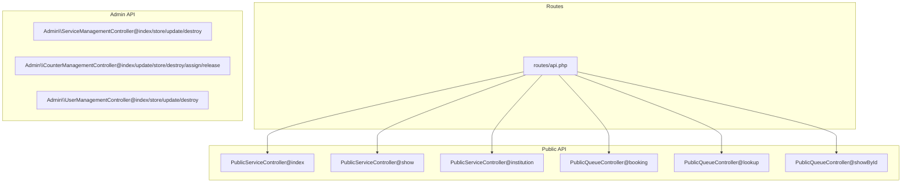
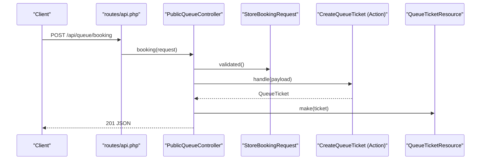
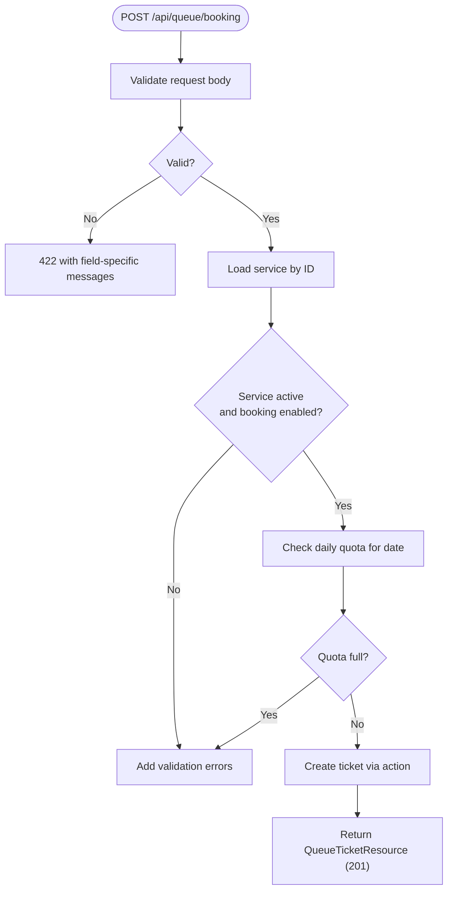
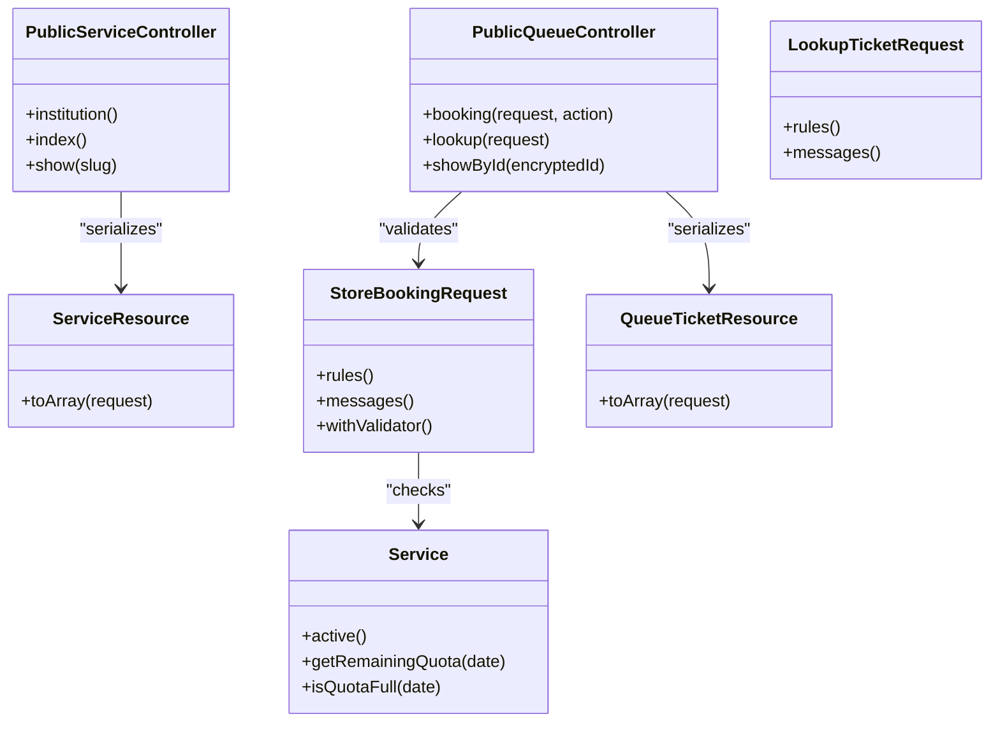

# API Endpoints

<cite>
**Referenced Files in This Document**
- [routes/api.php](file://routes/api.php)
- [PublicQueueController.php](file://app/Http/Controllers/Api/PublicQueueController.php)
- [PublicServiceController.php](file://app/Http/Controllers/Api/PublicServiceController.php)
- [ServiceController.php](file://app/Http/Controllers/Api/ServiceController.php)
- [StoreBookingRequest.php](file://app/Http/Requests/Api/StoreBookingRequest.php)
- [LookupTicketRequest.php](file://app/Http/Requests/Api/LookupTicketRequest.php)
- [ServiceResource.php](file://app/Http/Resources/ServiceResource.php)
- [QueueTicketResource.php](file://app/Http/Resources/QueueTicketResource.php)
- [Service.php](file://app/Models/Service.php)
- [sanctum.php](file://config/sanctum.php)
- [auth.php](file://config/auth.php)
- [ServiceManagementController.php](file://app/Http/Controllers/Admin/ServiceManagementController.php)
- [CounterManagementController.php](file://app/Http/Controllers/Admin/CounterManagementController.php)
- [UserManagementController.php](file://app/Http/Controllers/Admin/UserManagementController.php)
</cite>

## Table of Contents
1. [Introduction](#introduction)
2. [Project Structure](#project-structure)
3. [Core Components](#core-components)
4. [Architecture Overview](#architecture-overview)
5. [Detailed Component Analysis](#detailed-component-analysis)
6. [Dependency Analysis](#dependency-analysis)
7. [Performance Considerations](#performance-considerations)
8. [Troubleshooting Guide](#troubleshooting-guide)
9. [Conclusion](#conclusion)
10. [Appendices](#appendices)

## Introduction
This document provides comprehensive API documentation for the PTSP system. It covers public endpoints for queue operations, booking management, and status lookup, as well as administrative endpoints for service management, counter administration, and user management. It also documents authentication using Laravel Sanctum, request validation rules, error response formats, rate limiting, and practical integration guidance.

## Project Structure
The API surface is primarily defined in the routes file and implemented by controller classes under the Api and Admin namespaces. Public endpoints are throttled differently from administrative endpoints. Resource classes normalize JSON responses. Validation is enforced via FormRequest classes.

**Diagram sources**
- [routes/api.php:1-23](file://routes/api.php#L1-L23)
- [PublicServiceController.php:1-42](file://app/Http/Controllers/Api/PublicServiceController.php#L1-L42)
- [PublicQueueController.php:1-75](file://app/Http/Controllers/Api/PublicQueueController.php#L1-L75)
- [ServiceManagementController.php:1-75](file://app/Http/Controllers/Admin/ServiceManagementController.php#L1-L75)
- [CounterManagementController.php:1-125](file://app/Http/Controllers/Admin/CounterManagementController.php#L1-L125)
- [UserManagementController.php:1-102](file://app/Http/Controllers/Admin/UserManagementController.php#L1-L102)

**Section sources**
- [routes/api.php:1-23](file://routes/api.php#L1-L23)

## Core Components
- Public API: Provides institution info, service catalog, ticket lookup, and online booking.
- Administrative API: Manages services, counters, and users with validation and safety checks.
- Authentication: Uses Laravel Sanctum for stateful and token-based authentication.
- Rate Limiting: Applied per route group to protect public endpoints.
- Request Validation: Strong validation rules with custom after-validation checks.
- Response Normalization: Resources standardize JSON output.

**Section sources**
- [PublicServiceController.php:1-42](file://app/Http/Controllers/Api/PublicServiceController.php#L1-L42)
- [PublicQueueController.php:1-75](file://app/Http/Controllers/Api/PublicQueueController.php#L1-L75)
- [ServiceManagementController.php:1-75](file://app/Http/Controllers/Admin/ServiceManagementController.php#L1-L75)
- [CounterManagementController.php:1-125](file://app/Http/Controllers/Admin/CounterManagementController.php#L1-L125)
- [UserManagementController.php:1-102](file://app/Http/Controllers/Admin/UserManagementController.php#L1-L102)
- [StoreBookingRequest.php:1-73](file://app/Http/Requests/Api/StoreBookingRequest.php#L1-L73)
- [LookupTicketRequest.php:1-32](file://app/Http/Requests/Api/LookupTicketRequest.php#L1-L32)
- [ServiceResource.php:1-25](file://app/Http/Resources/ServiceResource.php#L1-L25)
- [QueueTicketResource.php:1-30](file://app/Http/Resources/QueueTicketResource.php#L1-L30)
- [sanctum.php:1-85](file://config/sanctum.php#L1-L85)
- [auth.php:1-118](file://config/auth.php#L1-L118)

## Architecture Overview
The API follows a layered structure:
- Routes define endpoint groups with middleware (including throttling).
- Controllers handle requests, delegate to actions/services, and return normalized resources.
- Requests encapsulate validation and custom rules.
- Resources transform models to JSON responses.
- Models provide domain logic (e.g., quota calculations).

**Diagram sources**
- [routes/api.php:16-18](file://routes/api.php#L16-L18)
- [PublicQueueController.php:16-34](file://app/Http/Controllers/Api/PublicQueueController.php#L16-L34)
- [StoreBookingRequest.php:17-27](file://app/Http/Requests/Api/StoreBookingRequest.php#L17-L27)

## Detailed Component Analysis

### Public API Endpoints

#### GET /api/institution
- Purpose: Retrieve institution metadata (name, address, phone, operating hours, logo path).
- Authentication: Not required.
- Throttling: 60 RPM.
- Response: JSON object containing selected fields.
- Notes: Response is filtered to a predefined set of fields.

**Section sources**
- [routes/api.php:8-14](file://routes/api.php#L8-L14)
- [PublicServiceController.php:13-24](file://app/Http/Controllers/Api/PublicServiceController.php#L13-L24)

#### GET /api/services
- Purpose: List active services.
- Authentication: Not required.
- Throttling: 60 RPM.
- Response: Array of ServiceResource entries.

**Section sources**
- [routes/api.php:8-14](file://routes/api.php#L8-L14)
- [PublicServiceController.php:26-31](file://app/Http/Controllers/Api/PublicServiceController.php#L26-L31)
- [ServiceResource.php:10-23](file://app/Http/Resources/ServiceResource.php#L10-L23)

#### GET /api/services/{slug}
- Purpose: Retrieve a single active service by slug.
- Authentication: Not required.
- Throttling: 60 RPM.
- Response: ServiceResource.
- Error: 404 if not found.

**Section sources**
- [routes/api.php:8-14](file://routes/api.php#L8-L14)
- [PublicServiceController.php:33-40](file://app/Http/Controllers/Api/PublicServiceController.php#L33-L40)
- [ServiceResource.php:10-23](file://app/Http/Resources/ServiceResource.php#L10-L23)

#### POST /api/queue/booking
- Purpose: Create a new queue ticket for online booking.
- Authentication: Not required.
- Throttling: 10 RPM.
- Request body:
  - service_id: integer, exists in services, active, booking_enabled
  - service_date: date, today or later, up to 14 days ahead, weekday only
  - visitor_name: string, max length 255
  - visitor_identifier: optional string, max length 64
  - visitor_phone: optional string, max length 30
  - notes: optional string, max length 1000
- Response: QueueTicketResource with 201 Created.
- Validation rules and messages are defined in the request class.
- Additional checks:
  - Service must be active and allow bookings.
  - Daily quota must not be exceeded for the given date.
- Error responses:
  - 422 Unprocessable Entity for validation errors.
  - 404 Not Found if ticket lookup fails (in related endpoints).

**Diagram sources**
- [StoreBookingRequest.php:17-57](file://app/Http/Requests/Api/StoreBookingRequest.php#L17-L57)
- [Service.php:69-99](file://app/Models/Service.php#L69-L99)
- [PublicQueueController.php:16-34](file://app/Http/Controllers/Api/PublicQueueController.php#L16-L34)

**Section sources**
- [routes/api.php:16-18](file://routes/api.php#L16-L18)
- [PublicQueueController.php:16-34](file://app/Http/Controllers/Api/PublicQueueController.php#L16-L34)
- [StoreBookingRequest.php:17-73](file://app/Http/Requests/Api/StoreBookingRequest.php#L17-L73)
- [Service.php:69-99](file://app/Models/Service.php#L69-L99)
- [QueueTicketResource.php:10-29](file://app/Http/Resources/QueueTicketResource.php#L10-L29)

#### GET /api/queue/lookup
- Purpose: Look up a ticket by ticket number and service date.
- Authentication: Not required.
- Throttling: 60 RPM.
- Query parameters:
  - ticket_number: required string
  - service_date: required date
- Response: PublicQueueTicketResource.
- Error: 404 Not Found if ticket not found.

**Section sources**
- [routes/api.php:8-14](file://routes/api.php#L8-L14)
- [PublicQueueController.php:36-45](file://app/Http/Controllers/Api/PublicQueueController.php#L36-L45)
- [LookupTicketRequest.php:14-20](file://app/Http/Requests/Api/LookupTicketRequest.php#L14-L20)

#### GET /api/queue/ticket-by-id/{encryptedId}
- Purpose: Retrieve a ticket by encrypted ID.
- Authentication: Not required.
- Throttling: 60 RPM.
- Path parameter:
  - encryptedId: string (encrypted ticket ID)
- Response: PublicQueueTicketResource.
- Error: 404 Not Found if decryption fails or ticket not found.

**Section sources**
- [routes/api.php:8-14](file://routes/api.php#L8-L14)
- [PublicQueueController.php:47-64](file://app/Http/Controllers/Api/PublicQueueController.php#L47-L64)

### Administrative API Endpoints

Administrative endpoints require authenticated access. The system uses Laravel Sanctum for authentication. The /api/user endpoint returns the authenticated user.

#### GET /api/user
- Purpose: Get the authenticated user.
- Authentication: Required (Sanctum).
- Throttling: None specified in routes; subject to global limits if applied elsewhere.
- Response: User model representation.

**Section sources**
- [routes/api.php:20-22](file://routes/api.php#L20-L22)

#### Service Management (Admin)
- GET /admin/services (web page): Lists services with filters and pagination.
- POST /admin/services (web form): Creates a new service.
- PUT /admin/services/{service} (web form): Updates a service.
- DELETE /admin/services/{service} (web form): Deletes a service if safe.

Constraints:
- Cannot delete a service with active tickets.
- Requires validation via StoreServiceRequest and UpdateServiceRequest.

**Section sources**
- [ServiceManagementController.php:17-75](file://app/Http/Controllers/Admin/ServiceManagementController.php#L17-L75)

#### Counter Administration (Admin)
- GET /admin/counters (web page): Lists counters with queue pools and active sessions.
- POST /admin/counters (web form): Creates a counter.
- PUT /admin/counters/{counter} (web form): Updates a counter.
- DELETE /admin/counters/{counter} (web form): Deletes a counter if safe.
- POST /admin/counters/{counter}/assign-officer (web form): Assigns an officer to a counter.
- POST /admin/counters/{counter}/release-officer (web form): Releases current officer assignment.

Constraints:
- Cannot delete a counter with active tickets.
- Officer assignments are managed via CounterSession records.

**Section sources**
- [CounterManagementController.php:20-125](file://app/Http/Controllers/Admin/CounterManagementController.php#L20-L125)

#### User Management (Admin)
- GET /admin/users (web page): Lists users with associated services.
- POST /admin/users (web form): Creates a user and optionally assigns services (for officers).
- PUT /admin/users/{user} (web form): Updates a user and syncs services.
- DELETE /admin/users/{user} (web form): Deletes a user if safe.

Constraints:
- Cannot delete self.
- Cannot delete a user with active tickets they created.
- Service assignments are synced for officers.

**Section sources**
- [UserManagementController.php:19-102](file://app/Http/Controllers/Admin/UserManagementController.php#L19-L102)

### Authentication and Authorization

#### Sanctum Tokens
- Guards and stateful domains are configured in Sanctum config.
- The /api/user endpoint requires Sanctum authentication.
- Sanctum middleware and cookie encryption are configured.

**Section sources**
- [sanctum.php:18-82](file://config/sanctum.php#L18-L82)
- [routes/api.php:20-22](file://routes/api.php#L20-L22)

#### Authentication Methods
- Session-based authentication via Sanctum guard "web".
- Bearer token authentication is supported by Sanctum for stateless APIs.
- CSRF validation and cookie encryption are part of Sanctum middleware stack.

**Section sources**
- [sanctum.php:37-82](file://config/sanctum.php#L37-L82)
- [auth.php:40-74](file://config/auth.php#L40-L74)

### Request Validation Rules

#### Booking Validation (StoreBookingRequest)
- service_id: required, integer, must exist in services, must be active, must allow bookings.
- service_date: required, date, must be today or later, up to 14 days ahead, weekday only.
- visitor_name: required, string, max 255.
- visitor_identifier: nullable, string, max 64.
- visitor_phone: nullable, string, max 30.
- notes: nullable, string, max 1000.
- After-validation checks:
  - Service existence and booking eligibility.
  - Daily quota availability for the selected date.

**Section sources**
- [StoreBookingRequest.php:17-57](file://app/Http/Requests/Api/StoreBookingRequest.php#L17-L57)
- [Service.php:69-99](file://app/Models/Service.php#L69-L99)

#### Ticket Lookup Validation (LookupTicketRequest)
- ticket_number: required, string.
- service_date: required, date.

**Section sources**
- [LookupTicketRequest.php:14-20](file://app/Http/Requests/Api/LookupTicketRequest.php#L14-L20)

### Error Response Formats
- Validation errors: 422 Unprocessable Entity with field-specific messages.
- Not found: 404 Not Found for missing tickets or resources.
- General server errors: 500 Internal Server Error (standard Laravel behavior).

Examples:
- Booking endpoint returns 422 with messages for invalid service_id, service_date, or quota issues.
- Lookup and encrypted ID endpoints return 404 when resources are not found.

**Section sources**
- [PublicQueueController.php:40-44](file://app/Http/Controllers/Api/PublicQueueController.php#L40-L44)
- [PublicQueueController.php:51-61](file://app/Http/Controllers/Api/PublicQueueController.php#L51-L61)
- [StoreBookingRequest.php:59-71](file://app/Http/Requests/Api/StoreBookingRequest.php#L59-L71)
- [LookupTicketRequest.php:22-30](file://app/Http/Requests/Api/LookupTicketRequest.php#L22-L30)

### Rate Limiting Mechanisms
- Public endpoints grouped under throttle:60,1 (60 requests per minute).
- Booking endpoint additionally grouped under throttle:10,1 (10 requests per minute).
- Throttling middleware applies per IP and per route group.

**Section sources**
- [routes/api.php:8-18](file://routes/api.php#L8-L18)

### API Versioning, Backward Compatibility, and Deprecation
- No explicit versioning scheme is evident in routes or controllers.
- Backward compatibility is not documented; future changes should introduce versioned routes or headers.
- Deprecation policy is not defined; recommended practice is to add X-API-Deprecation headers and maintain multiple versions during transitions.

[No sources needed since this section provides general guidance]

## Dependency Analysis

**Diagram sources**
- [PublicServiceController.php:1-42](file://app/Http/Controllers/Api/PublicServiceController.php#L1-L42)
- [PublicQueueController.php:1-75](file://app/Http/Controllers/Api/PublicQueueController.php#L1-L75)
- [StoreBookingRequest.php:1-73](file://app/Http/Requests/Api/StoreBookingRequest.php#L1-L73)
- [LookupTicketRequest.php:1-32](file://app/Http/Requests/Api/LookupTicketRequest.php#L1-L32)
- [ServiceResource.php:1-25](file://app/Http/Resources/ServiceResource.php#L1-L25)
- [QueueTicketResource.php:1-30](file://app/Http/Resources/QueueTicketResource.php#L1-L30)
- [Service.php:62-99](file://app/Models/Service.php#L62-L99)

**Section sources**
- [PublicServiceController.php:1-42](file://app/Http/Controllers/Api/PublicServiceController.php#L1-L42)
- [PublicQueueController.php:1-75](file://app/Http/Controllers/Api/PublicQueueController.php#L1-L75)
- [StoreBookingRequest.php:1-73](file://app/Http/Requests/Api/StoreBookingRequest.php#L1-L73)
- [LookupTicketRequest.php:1-32](file://app/Http/Requests/Api/LookupTicketRequest.php#L1-L32)
- [ServiceResource.php:1-25](file://app/Http/Resources/ServiceResource.php#L1-L25)
- [QueueTicketResource.php:1-30](file://app/Http/Resources/QueueTicketResource.php#L1-L30)
- [Service.php:62-99](file://app/Models/Service.php#L62-L99)

## Performance Considerations
- Throttling reduces load on public endpoints; adjust rates based on traffic.
- Resource serialization includes related models; consider eager loading and selective includes.
- Database queries for ticket lookup and quota checks are straightforward; ensure proper indexing on ticket_number and service_date.
- Consider caching institution metadata and active services for frequent reads.

[No sources needed since this section provides general guidance]

## Troubleshooting Guide
- 404 Not Found on ticket lookup:
  - Verify ticket_number and service_date format and correctness.
  - Confirm the ticket exists and was created on the specified date.
- 422 Unprocessable Entity on booking:
  - Check service_id validity and booking eligibility.
  - Ensure service_date is within allowed range and weekday-only.
  - Confirm daily quota is not exceeded.
- Authentication failures:
  - Ensure Sanctum token or session is present.
  - Verify stateful domains and CSRF settings if using browser clients.

**Section sources**
- [PublicQueueController.php:40-44](file://app/Http/Controllers/Api/PublicQueueController.php#L40-L44)
- [PublicQueueController.php:51-61](file://app/Http/Controllers/Api/PublicQueueController.php#L51-L61)
- [StoreBookingRequest.php:59-71](file://app/Http/Requests/Api/StoreBookingRequest.php#L59-L71)
- [sanctum.php:18-82](file://config/sanctum.php#L18-L82)

## Conclusion
The PTSP API provides a focused set of public endpoints for service discovery, booking, and status lookup, along with administrative capabilities for managing services, counters, and users. Strong validation and quotas ensure operational integrity. Sanctum enables flexible authentication for both web and API consumers. Adopting explicit versioning and deprecation policies will improve long-term maintainability.

## Appendices

### Practical Examples and Integration Patterns
- Public booking flow:
  - Fetch services, select service_id and service_date, submit booking payload.
  - Handle 422 for validation/quota errors, 201 with ticket details on success.
- Status lookup:
  - Use ticket_number and service_date to retrieve current status.
- Admin operations:
  - Authenticate via Sanctum, then manage services/counters/users through web forms handled by admin controllers.

[No sources needed since this section provides general guidance]