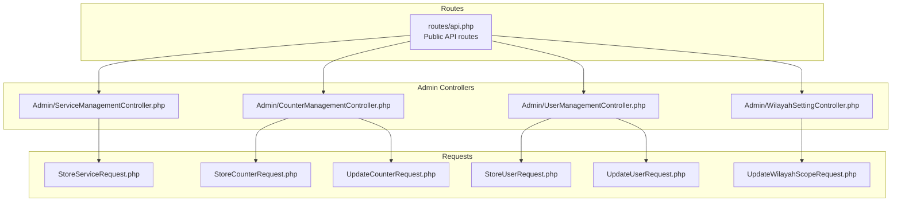
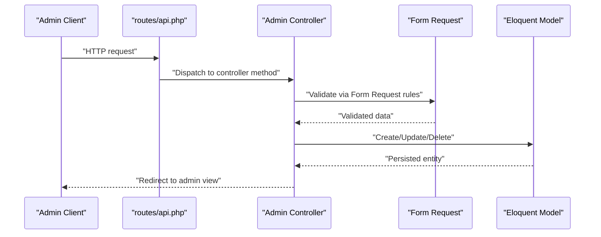
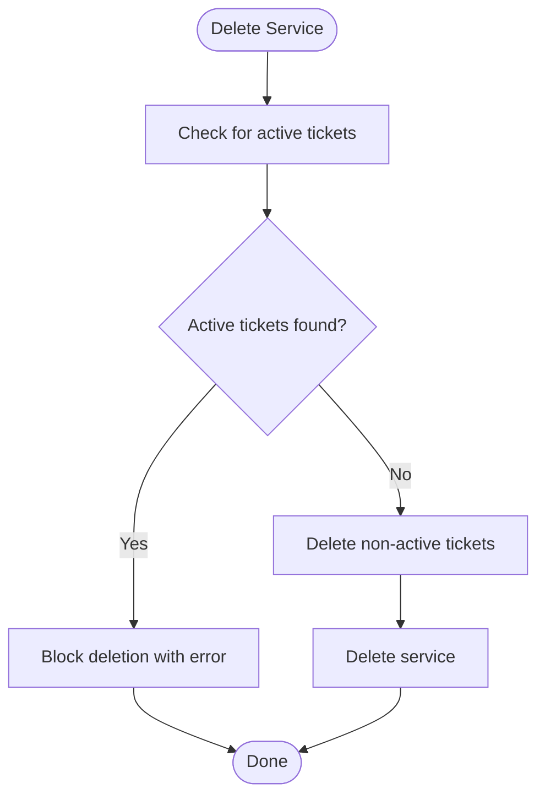
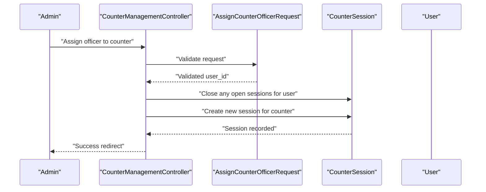
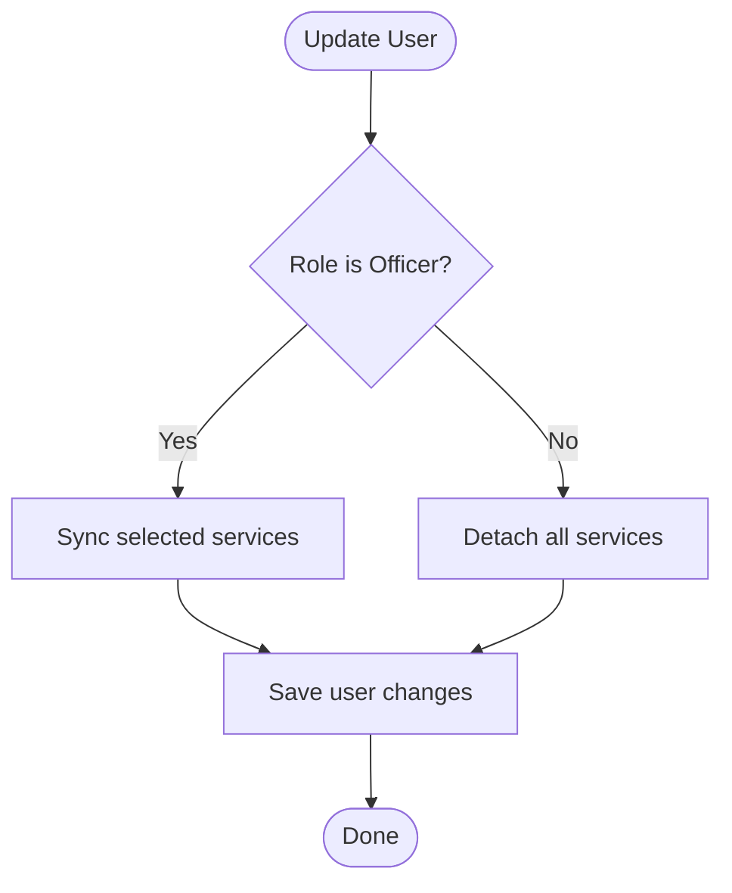
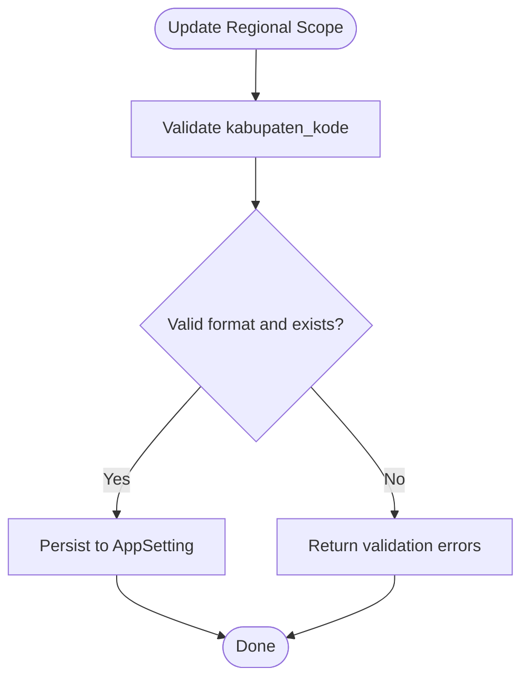
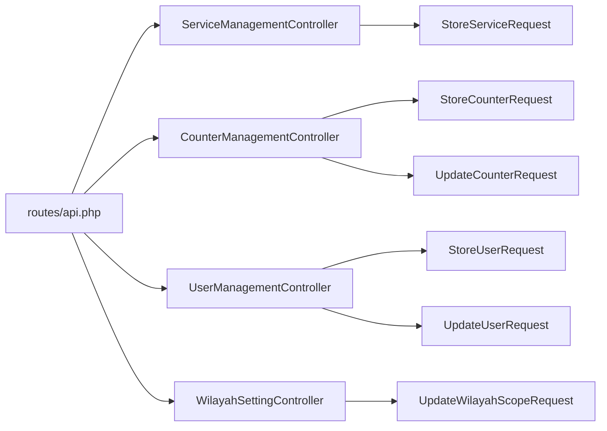

# Administrative API Endpoints

<cite>
**Referenced Files in This Document**
- [routes/api.php](file://routes/api.php)
- [config/sanctum.php](file://config/sanctum.php)
- [app/Http/Controllers/Admin/ServiceManagementController.php](file://app/Http/Controllers/Admin/ServiceManagementController.php)
- [app/Http/Controllers/Admin/CounterManagementController.php](file://app/Http/Controllers/Admin/CounterManagementController.php)
- [app/Http/Controllers/Admin/UserManagementController.php](file://app/Http/Controllers/Admin/UserManagementController.php)
- [app/Http/Controllers/Admin/WilayahSettingController.php](file://app/Http/Controllers/Admin/WilayahSettingController.php)
- [app/Http/Requests/StoreServiceRequest.php](file://app/Http/Requests/StoreServiceRequest.php)
- [app/Http/Requests/StoreCounterRequest.php](file://app/Http/Requests/StoreCounterRequest.php)
- [app/Http/Requests/UpdateCounterRequest.php](file://app/Http/Requests/UpdateCounterRequest.php)
- [app/Http/Requests/StoreUserRequest.php](file://app/Http/Requests/StoreUserRequest.php)
- [app/Http/Requests/UpdateUserRequest.php](file://app/Http/Requests/UpdateUserRequest.php)
- [app/Http/Requests/UpdateWilayahScopeRequest.php](file://app/Http/Requests/UpdateWilayahScopeRequest.php)
- [testsprite_tests/standard_prd.json](file://testsprite_tests/standard_prd.json)
- [testsprite_tests/tmp/code_summary.yaml](file://testsprite_tests/tmp/code_summary.yaml)
</cite>

## Table of Contents
1. [Introduction](#introduction)
2. [Project Structure](#project-structure)
3. [Core Components](#core-components)
4. [Architecture Overview](#architecture-overview)
5. [Detailed Component Analysis](#detailed-component-analysis)
6. [Dependency Analysis](#dependency-analysis)
7. [Performance Considerations](#performance-considerations)
8. [Troubleshooting Guide](#troubleshooting-guide)
9. [Conclusion](#conclusion)
10. [Appendices](#appendices)

## Introduction
This document describes the Administrative API endpoints used by system administrators and authorized personnel. It covers service management, counter management, user management, and institutional configuration endpoints. It also documents authentication using Sanctum tokens, request validation rules, response formats, and practical administrative workflows.

## Project Structure
Administrative endpoints are implemented as web routes that render Blade views for the admin UI. While the repository does not expose dedicated JSON REST endpoints under the routes/api.php namespace, the controllers and requests define the administrative capabilities and validation rules that would be applicable for backend integrations.

**Diagram sources**
- [routes/api.php:1-23](file://routes/api.php#L1-L23)
- [app/Http/Controllers/Admin/ServiceManagementController.php:1-75](file://app/Http/Controllers/Admin/ServiceManagementController.php#L1-L75)
- [app/Http/Controllers/Admin/CounterManagementController.php:1-125](file://app/Http/Controllers/Admin/CounterManagementController.php#L1-L125)
- [app/Http/Controllers/Admin/UserManagementController.php:1-102](file://app/Http/Controllers/Admin/UserManagementController.php#L1-L102)
- [app/Http/Controllers/Admin/WilayahSettingController.php:1-54](file://app/Http/Controllers/Admin/WilayahSettingController.php#L1-L54)
- [app/Http/Requests/StoreServiceRequest.php:1-44](file://app/Http/Requests/StoreServiceRequest.php#L1-L44)
- [app/Http/Requests/StoreCounterRequest.php:1-33](file://app/Http/Requests/StoreCounterRequest.php#L1-L33)
- [app/Http/Requests/UpdateCounterRequest.php:1-33](file://app/Http/Requests/UpdateCounterRequest.php#L1-L33)
- [app/Http/Requests/StoreUserRequest.php:1-39](file://app/Http/Requests/StoreUserRequest.php#L1-L39)
- [app/Http/Requests/UpdateUserRequest.php:1-45](file://app/Http/Requests/UpdateUserRequest.php#L1-L45)
- [app/Http/Requests/UpdateWilayahScopeRequest.php:1-49](file://app/Http/Requests/UpdateWilayahScopeRequest.php#L1-L49)

**Section sources**
- [routes/api.php:1-23](file://routes/api.php#L1-L23)

## Core Components
- Authentication: Uses Sanctum with bearer tokens or session cookies depending on guard configuration.
- Service Management: CRUD for services including daily quotas and pool assignments.
- Counter Management: CRUD for counters, officer assignment/release, and pool linkage.
- User Management: CRUD for users, role assignment, and officer-service associations.
- Institutional Configuration: Setting regional scope for the application.

**Section sources**
- [config/sanctum.php:1-85](file://config/sanctum.php#L1-L85)
- [app/Http/Controllers/Admin/ServiceManagementController.php:1-75](file://app/Http/Controllers/Admin/ServiceManagementController.php#L1-L75)
- [app/Http/Controllers/Admin/CounterManagementController.php:1-125](file://app/Http/Controllers/Admin/CounterManagementController.php#L1-L125)
- [app/Http/Controllers/Admin/UserManagementController.php:1-102](file://app/Http/Controllers/Admin/UserManagementController.php#L1-L102)
- [app/Http/Controllers/Admin/WilayahSettingController.php:1-54](file://app/Http/Controllers/Admin/WilayahSettingController.php#L1-L54)

## Architecture Overview
Administrative actions are handled by dedicated controllers that enforce validation via form requests and operate on Eloquent models. The controllers return redirects to admin views, indicating the presence of a server-rendered admin interface. For backend integrations, these controllers and requests define the canonical validation and behavior.

**Diagram sources**
- [routes/api.php:1-23](file://routes/api.php#L1-L23)
- [app/Http/Controllers/Admin/ServiceManagementController.php:1-75](file://app/Http/Controllers/Admin/ServiceManagementController.php#L1-L75)
- [app/Http/Controllers/Admin/CounterManagementController.php:1-125](file://app/Http/Controllers/Admin/CounterManagementController.php#L1-L125)
- [app/Http/Controllers/Admin/UserManagementController.php:1-102](file://app/Http/Controllers/Admin/UserManagementController.php#L1-L102)
- [app/Http/Controllers/Admin/WilayahSettingController.php:1-54](file://app/Http/Controllers/Admin/WilayahSettingController.php#L1-L54)
- [app/Http/Requests/StoreServiceRequest.php:1-44](file://app/Http/Requests/StoreServiceRequest.php#L1-L44)
- [app/Http/Requests/StoreCounterRequest.php:1-33](file://app/Http/Requests/StoreCounterRequest.php#L1-L33)
- [app/Http/Requests/UpdateCounterRequest.php:1-33](file://app/Http/Requests/UpdateCounterRequest.php#L1-L33)
- [app/Http/Requests/StoreUserRequest.php:1-39](file://app/Http/Requests/StoreUserRequest.php#L1-L39)
- [app/Http/Requests/UpdateUserRequest.php:1-45](file://app/Http/Requests/UpdateUserRequest.php#L1-L45)
- [app/Http/Requests/UpdateWilayahScopeRequest.php:1-49](file://app/Http/Requests/UpdateWilayahScopeRequest.php#L1-L49)

## Detailed Component Analysis

### Authentication and Authorization
- Authentication guard: Sanctum configured with the web guard and optional bearer tokens.
- Session domain configuration supports local development and production domains.
- Access control: Controllers restrict access to authorized users; middleware ensures authenticated requests.

Key configuration and behavior:
- Sanctum guard and expiration settings.
- Stateful domains for cookie-based auth.
- Middleware stack for session authentication.

**Section sources**
- [config/sanctum.php:1-85](file://config/sanctum.php#L1-L85)

### Service Management Endpoints
Endpoints and behaviors:
- List services with search and pagination.
- Create a new service with validation rules.
- Update an existing service with validation rules.
- Delete a service with safety checks against active tickets.

Validation rules (high level):
- Queue pool selection constrained to active pools.
- Unique constraints on code and slug.
- Numeric and boolean constraints for quotas and flags.
- Sort order and string limits.

Operational safeguards:
- Prevent deletion if active tickets exist.
- Cleanup dependent records prior to deletion.

**Diagram sources**
- [app/Http/Controllers/Admin/ServiceManagementController.php:55-73](file://app/Http/Controllers/Admin/ServiceManagementController.php#L55-L73)
- [app/Http/Requests/StoreServiceRequest.php:25-41](file://app/Http/Requests/StoreServiceRequest.php#L25-L41)

**Section sources**
- [app/Http/Controllers/Admin/ServiceManagementController.php:17-73](file://app/Http/Controllers/Admin/ServiceManagementController.php#L17-L73)
- [app/Http/Requests/StoreServiceRequest.php:1-44](file://app/Http/Requests/StoreServiceRequest.php#L1-L44)
- [testsprite_tests/standard_prd.json:67-87](file://testsprite_tests/standard_prd.json#L67-L87)
- [testsprite_tests/tmp/code_summary.yaml:221-226](file://testsprite_tests/tmp/code_summary.yaml#L221-L226)

### Counter Management Endpoints
Endpoints and behaviors:
- List counters with pool and officer assignment context.
- Create a new counter with validation rules.
- Update an existing counter with validation rules.
- Delete a counter with safety checks against active tickets.
- Assign an officer to a counter with session management.
- Release an officer from a counter.

Validation rules (high level):
- Unique constraints on counter code.
- Required pool association.
- Sort order and activation flag.

Operational safeguards:
- Prevent deletion if counters have active tickets.
- Manage officer sessions with open/close transitions.

**Diagram sources**
- [app/Http/Controllers/Admin/CounterManagementController.php:86-109](file://app/Http/Controllers/Admin/CounterManagementController.php#L86-L109)
- [app/Http/Requests/StoreCounterRequest.php:24-30](file://app/Http/Requests/StoreCounterRequest.php#L24-L30)
- [app/Http/Requests/UpdateCounterRequest.php:23-30](file://app/Http/Requests/UpdateCounterRequest.php#L23-L30)

**Section sources**
- [app/Http/Controllers/Admin/CounterManagementController.php:20-124](file://app/Http/Controllers/Admin/CounterManagementController.php#L20-L124)
- [app/Http/Requests/StoreCounterRequest.php:1-33](file://app/Http/Requests/StoreCounterRequest.php#L1-L33)
- [app/Http/Requests/UpdateCounterRequest.php:1-33](file://app/Http/Requests/UpdateCounterRequest.php#L1-L33)
- [testsprite_tests/tmp/code_summary.yaml:224-244](file://testsprite_tests/tmp/code_summary.yaml#L224-L244)

### User Management Endpoints
Endpoints and behaviors:
- List users with associated services.
- Create a new user with role and password hashing.
- Update an existing user with role and service associations.
- Delete a user with safety checks and self-deletion prevention.

Validation rules (high level):
- Unique email constraint.
- Role constrained to enumerated values.
- Password minimum length.
- Service IDs validated for existence.

Operational safeguards:
- Prevent self-deletion.
- Prevent deletion if user created active tickets.
- Sync services for officers; detach for non-officers during updates.

**Diagram sources**
- [app/Http/Controllers/Admin/UserManagementController.php:55-74](file://app/Http/Controllers/Admin/UserManagementController.php#L55-L74)
- [app/Http/Requests/StoreUserRequest.php:26-36](file://app/Http/Requests/StoreUserRequest.php#L26-L36)
- [app/Http/Requests/UpdateUserRequest.php:25-42](file://app/Http/Requests/UpdateUserRequest.php#L25-L42)

**Section sources**
- [app/Http/Controllers/Admin/UserManagementController.php:19-100](file://app/Http/Controllers/Admin/UserManagementController.php#L19-L100)
- [app/Http/Requests/StoreUserRequest.php:1-39](file://app/Http/Requests/StoreUserRequest.php#L1-L39)
- [app/Http/Requests/UpdateUserRequest.php:1-45](file://app/Http/Requests/UpdateUserRequest.php#L1-L45)
- [testsprite_tests/tmp/code_summary.yaml:245-265](file://testsprite_tests/tmp/code_summary.yaml#L245-L265)

### Institutional Configuration Endpoints
Endpoints and behaviors:
- List regional kabupaten with search and pagination.
- Set the active kabupaten scope with validation.

Validation rules (high level):
- Required 5-character code matching a specific numeric pattern.
- Existence check against the wilayah table.

Operational safeguards:
- Enforce format and existence constraints.
- Persist scope via application settings.

**Diagram sources**
- [app/Http/Controllers/Admin/WilayahSettingController.php:44-52](file://app/Http/Controllers/Admin/WilayahSettingController.php#L44-L52)
- [app/Http/Requests/UpdateWilayahScopeRequest.php:25-33](file://app/Http/Requests/UpdateWilayahScopeRequest.php#L25-L33)

**Section sources**
- [app/Http/Controllers/Admin/WilayahSettingController.php:15-52](file://app/Http/Controllers/Admin/WilayahSettingController.php#L15-L52)
- [app/Http/Requests/UpdateWilayahScopeRequest.php:1-49](file://app/Http/Requests/UpdateWilayahScopeRequest.php#L1-L49)
- [testsprite_tests/tmp/code_summary.yaml:266-266](file://testsprite_tests/tmp/code_summary.yaml#L266-L266)

## Dependency Analysis
- Controllers depend on form requests for validation.
- Controllers operate on Eloquent models and related pivot tables.
- Routes dispatch to controllers; public API routes are defined separately and do not include administrative endpoints.

**Diagram sources**
- [routes/api.php:1-23](file://routes/api.php#L1-L23)
- [app/Http/Controllers/Admin/ServiceManagementController.php:1-75](file://app/Http/Controllers/Admin/ServiceManagementController.php#L1-L75)
- [app/Http/Controllers/Admin/CounterManagementController.php:1-125](file://app/Http/Controllers/Admin/CounterManagementController.php#L1-L125)
- [app/Http/Controllers/Admin/UserManagementController.php:1-102](file://app/Http/Controllers/Admin/UserManagementController.php#L1-L102)
- [app/Http/Controllers/Admin/WilayahSettingController.php:1-54](file://app/Http/Controllers/Admin/WilayahSettingController.php#L1-L54)
- [app/Http/Requests/StoreServiceRequest.php:1-44](file://app/Http/Requests/StoreServiceRequest.php#L1-L44)
- [app/Http/Requests/StoreCounterRequest.php:1-33](file://app/Http/Requests/StoreCounterRequest.php#L1-L33)
- [app/Http/Requests/UpdateCounterRequest.php:1-33](file://app/Http/Requests/UpdateCounterRequest.php#L1-L33)
- [app/Http/Requests/StoreUserRequest.php:1-39](file://app/Http/Requests/StoreUserRequest.php#L1-L39)
- [app/Http/Requests/UpdateUserRequest.php:1-45](file://app/Http/Requests/UpdateUserRequest.php#L1-L45)
- [app/Http/Requests/UpdateWilayahScopeRequest.php:1-49](file://app/Http/Requests/UpdateWilayahScopeRequest.php#L1-L49)

**Section sources**
- [routes/api.php:1-23](file://routes/api.php#L1-L23)

## Performance Considerations
- Pagination is used for listing services and regional entries to limit payload sizes.
- Index usage on unique fields (code, slug, email) helps maintain fast validations and lookups.
- Minimize N+1 queries by eager-loading relationships (e.g., queuePool, services, officers).

## Troubleshooting Guide
Common issues and resolutions:
- Validation failures: Review request rules for missing or invalid fields.
- Deletion blocked: Ensure no active tickets exist for the entity being deleted.
- Officer assignment conflicts: Previous sessions for the user are automatically closed before creating a new session.
- Self-deletion attempts: Controllers prevent deleting the currently authenticated user.

**Section sources**
- [app/Http/Controllers/Admin/ServiceManagementController.php:55-73](file://app/Http/Controllers/Admin/ServiceManagementController.php#L55-L73)
- [app/Http/Controllers/Admin/CounterManagementController.php:69-84](file://app/Http/Controllers/Admin/CounterManagementController.php#L69-L84)
- [app/Http/Controllers/Admin/UserManagementController.php:76-100](file://app/Http/Controllers/Admin/UserManagementController.php#L76-L100)
- [app/Http/Controllers/Admin/CounterManagementController.php:86-109](file://app/Http/Controllers/Admin/CounterManagementController.php#L86-L109)

## Conclusion
The administrative capabilities are implemented via server-rendered controllers and form requests. For backend integration scenarios, the validation rules and controller behaviors documented here serve as the authoritative specification. Administrators can manage services, counters, users, and institutional scope with robust validation and safety checks.

## Appendices

### Administrative Workflows and Integration Patterns
- Service lifecycle: Create, update quotas, assign pool, delete with safety checks.
- Counter lifecycle: Create, assign to pool, assign officer, release officer, delete with safety checks.
- User lifecycle: Create with role and password, assign services for officers, update roles, delete with safety checks.
- Institutional scope: Select and persist regional scope with strict validation.

**Section sources**
- [testsprite_tests/standard_prd.json:67-87](file://testsprite_tests/standard_prd.json#L67-L87)
- [testsprite_tests/tmp/code_summary.yaml:221-266](file://testsprite_tests/tmp/code_summary.yaml#L221-L266)