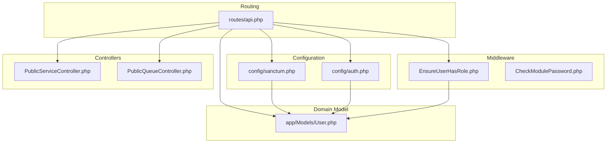
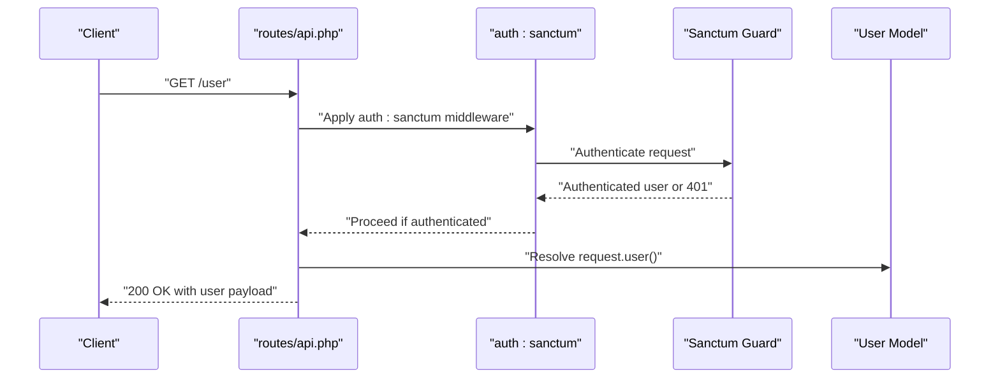
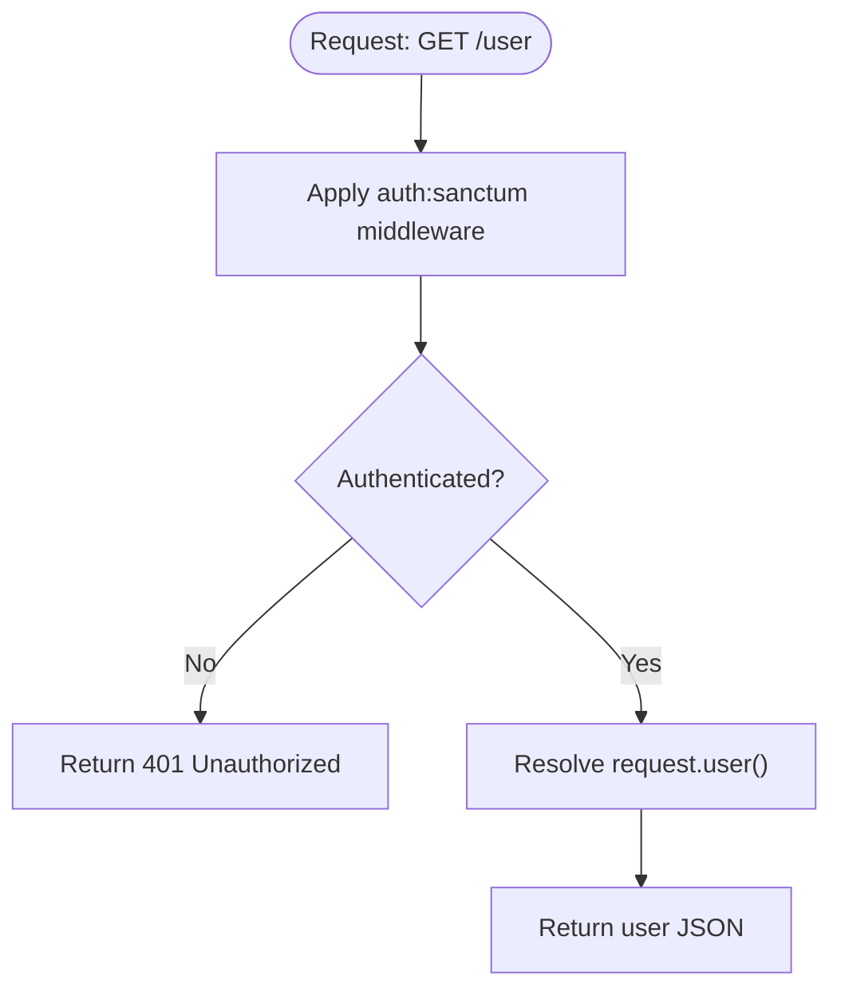
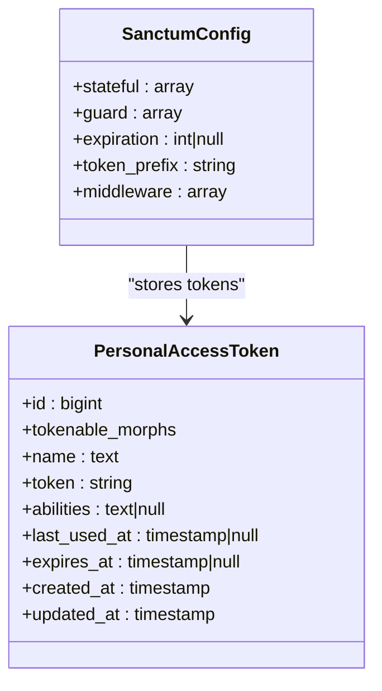
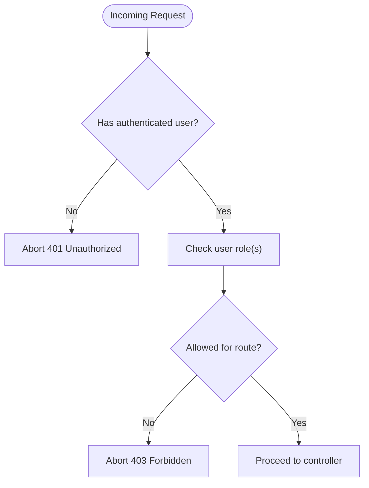
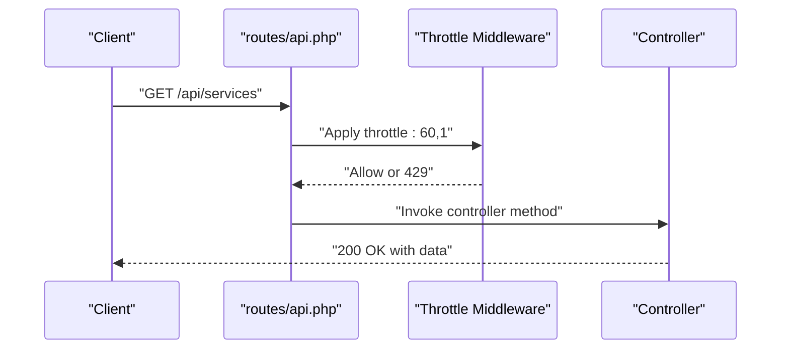
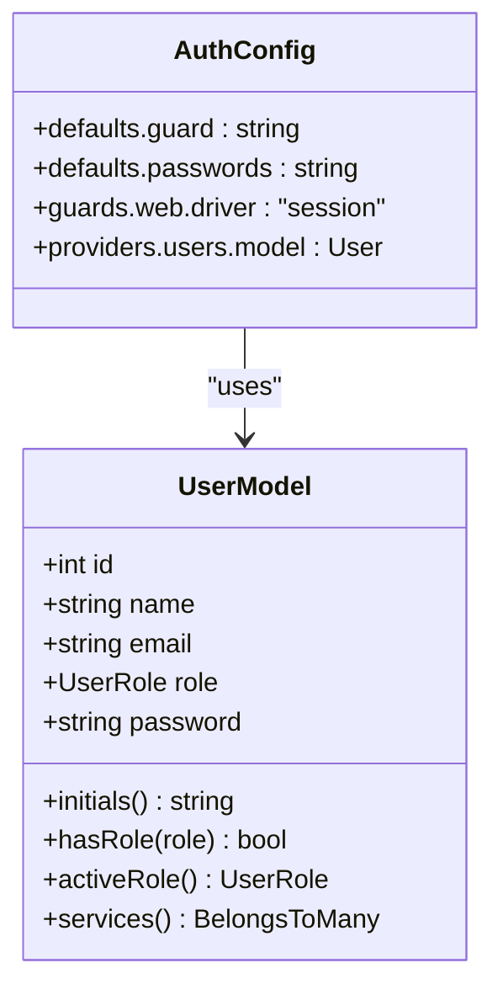
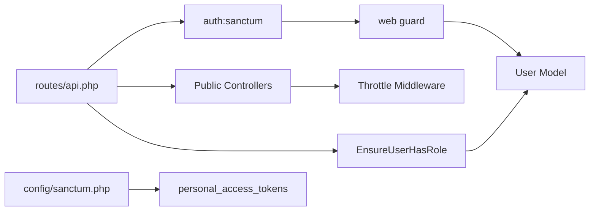

# Authentication API Endpoints

<cite>
**Referenced Files in This Document**
- [routes/api.php](file://routes/api.php)
- [config/sanctum.php](file://config/sanctum.php)
- [config/auth.php](file://config/auth.php)
- [app/Models/User.php](file://app/Models/User.php)
- [app/Http/Middleware/EnsureUserHasRole.php](file://app/Http/Middleware/EnsureUserHasRole.php)
- [app/Http/Middleware/CheckModulePassword.php](file://app/Http/Middleware/CheckModulePassword.php)
- [database/migrations/2026_03_11_045926_create_personal_access_tokens_table.php](file://database/migrations/2026_03_11_045926_create_personal_access_tokens_table.php)
- [app/Http/Controllers/Api/PublicServiceController.php](file://app/Http/Controllers/Api/PublicServiceController.php)
- [app/Http/Controllers/Api/PublicQueueController.php](file://app/Http/Controllers/Api/PublicQueueController.php)
</cite>

## Table of Contents
1. [Introduction](#introduction)
2. [Project Structure](#project-structure)
3. [Core Components](#core-components)
4. [Architecture Overview](#architecture-overview)
5. [Detailed Component Analysis](#detailed-component-analysis)
6. [Dependency Analysis](#dependency-analysis)
7. [Performance Considerations](#performance-considerations)
8. [Troubleshooting Guide](#troubleshooting-guide)
9. [Conclusion](#conclusion)

## Introduction
This document explains the Authentication API endpoints and Sanctum token management for the application. It focuses on:
- The user endpoint that returns authenticated user information
- Sanctum token lifecycle: creation, validation, and revocation
- Authentication middleware requirements and role-based access
- Rate limiting policies and security best practices
- Practical integration patterns for frontend applications

## Project Structure
The authentication and API surface relevant to this document spans routing, configuration, middleware, models, and controllers:

**Diagram sources**
- [routes/api.php:1-23](file://routes/api.php#L1-L23)
- [config/sanctum.php:1-85](file://config/sanctum.php#L1-L85)
- [config/auth.php:1-118](file://config/auth.php#L1-L118)
- [app/Models/User.php:1-99](file://app/Models/User.php#L1-L99)
- [app/Http/Middleware/EnsureUserHasRole.php:1-37](file://app/Http/Middleware/EnsureUserHasRole.php#L1-L37)
- [app/Http/Middleware/CheckModulePassword.php:1-68](file://app/Http/Middleware/CheckModulePassword.php#L1-L68)
- [app/Http/Controllers/Api/PublicServiceController.php:1-42](file://app/Http/Controllers/Api/PublicServiceController.php#L1-L42)
- [app/Http/Controllers/Api/PublicQueueController.php:1-75](file://app/Http/Controllers/Api/PublicQueueController.php#L1-L75)

**Section sources**
- [routes/api.php:1-23](file://routes/api.php#L1-L23)
- [config/sanctum.php:1-85](file://config/sanctum.php#L1-L85)
- [config/auth.php:1-118](file://config/auth.php#L1-L118)

## Core Components
- User endpoint: GET /user returns the authenticated user via the auth:sanctum middleware.
- Public API endpoints: Public services and queue endpoints are throttled and publicly accessible.
- Sanctum configuration: Defines stateful domains, guards, expiration, token prefix, and middleware stack.
- Authentication guard: Uses the session-based web guard for authentication.
- Role-based middleware: Enforces role checks for protected routes.
- Personal Access Tokens table: Stores token metadata, abilities, and expiration.

**Section sources**
- [routes/api.php:20-22](file://routes/api.php#L20-L22)
- [config/sanctum.php:18-82](file://config/sanctum.php#L18-L82)
- [config/auth.php:18-44](file://config/auth.php#L18-L44)
- [database/migrations/2026_03_11_045926_create_personal_access_tokens_table.php:14-23](file://database/migrations/2026_03_11_045926_create_personal_access_tokens_table.php#L14-L23)

## Architecture Overview
The authentication flow integrates Sanctum with Laravel’s session guard and optional bearer tokens. The user endpoint enforces Sanctum authentication, while public endpoints remain unauthenticated and throttled.

**Diagram sources**
- [routes/api.php:20-22](file://routes/api.php#L20-L22)
- [config/sanctum.php:37](file://config/sanctum.php#L37)
- [app/Models/User.php:14-99](file://app/Models/User.php#L14-L99)

## Detailed Component Analysis

### User Endpoint (/user)
- Purpose: Returns the currently authenticated user.
- Authentication: Requires Sanctum authentication via the auth:sanctum middleware.
- Behavior: Returns the user object resolved from the current request.
- Throttling: Not throttled by default; consider applying rate limits if needed.

**Diagram sources**
- [routes/api.php:20-22](file://routes/api.php#L20-L22)

**Section sources**
- [routes/api.php:20-22](file://routes/api.php#L20-L22)

### Sanctum Token Management
- Guards and Session: Sanctum checks configured guards (default web session) before falling back to bearer tokens.
- Stateful Domains: Configures trusted domains/hosts for stateful cookie-based authentication.
- Expiration: Token expiration is configurable; current configuration sets no global expiration.
- Token Prefix: Optional token prefix for secret scanning compatibility.
- Middleware Stack: Includes session authentication, cookie encryption, and CSRF validation.
- Personal Access Tokens Storage: Tokens are stored in personal_access_tokens with fields for abilities and expiration.

**Diagram sources**
- [config/sanctum.php:18-82](file://config/sanctum.php#L18-L82)
- [database/migrations/2026_03_11_045926_create_personal_access_tokens_table.php:14-23](file://database/migrations/2026_03_11_045926_create_personal_access_tokens_table.php#L14-L23)

**Section sources**
- [config/sanctum.php:18-82](file://config/sanctum.php#L18-L82)
- [database/migrations/2026_03_11_045926_create_personal_access_tokens_table.php:14-23](file://database/migrations/2026_03_11_045926_create_personal_access_tokens_table.php#L14-L23)

### Authentication Middleware and Role-Based Access
- EnsureUserHasRole: Validates that the authenticated user has one of the required roles. Returns 401 if unauthenticated or 403 if insufficient permissions.
- CheckModulePassword: Manages module-specific session-based authentication for kiosk and TV display modules, enforcing session lifetime and redirecting to login when expired.

**Diagram sources**
- [app/Http/Middleware/EnsureUserHasRole.php:16-35](file://app/Http/Middleware/EnsureUserHasRole.php#L16-L35)

**Section sources**
- [app/Http/Middleware/EnsureUserHasRole.php:16-35](file://app/Http/Middleware/EnsureUserHasRole.php#L16-L35)
- [app/Http/Middleware/CheckModulePassword.php:17-33](file://app/Http/Middleware/CheckModulePassword.php#L17-L33)

### Public API Endpoints and Rate Limiting
- Public endpoints (institution, services, queue lookup, ticket by ID) are grouped under a 60 RPM throttle.
- Booking endpoint is grouped under a 10 RPM throttle.
- These endpoints are intentionally unauthenticated; use the user endpoint for authenticated requests.

**Diagram sources**
- [routes/api.php:8-18](file://routes/api.php#L8-L18)
- [app/Http/Controllers/Api/PublicServiceController.php:26-31](file://app/Http/Controllers/Api/PublicServiceController.php#L26-L31)
- [app/Http/Controllers/Api/PublicQueueController.php:36-44](file://app/Http/Controllers/Api/PublicQueueController.php#L36-L44)

**Section sources**
- [routes/api.php:8-18](file://routes/api.php#L8-L18)
- [app/Http/Controllers/Api/PublicServiceController.php:13-41](file://app/Http/Controllers/Api/PublicServiceController.php#L13-L41)
- [app/Http/Controllers/Api/PublicQueueController.php:16-74](file://app/Http/Controllers/Api/PublicQueueController.php#L16-L74)

### Authentication Guards and User Model
- Authentication defaults to the web session guard with Eloquent user provider.
- User model includes role enumeration, two-factor authentication, and helpers for roles and services.

**Diagram sources**
- [config/auth.php:18-74](file://config/auth.php#L18-L74)
- [app/Models/User.php:14-99](file://app/Models/User.php#L14-L99)

**Section sources**
- [config/auth.php:18-74](file://config/auth.php#L18-L74)
- [app/Models/User.php:14-99](file://app/Models/User.php#L14-L99)

## Dependency Analysis
- The user endpoint depends on Sanctum middleware and the web guard to resolve the authenticated user.
- Public endpoints depend on throttle middleware and controller logic.
- Role-based middleware depends on the authenticated user’s role property.
- Token storage depends on the personal_access_tokens migration schema.

**Diagram sources**
- [routes/api.php:1-23](file://routes/api.php#L1-L23)
- [config/sanctum.php:18-82](file://config/sanctum.php#L18-L82)
- [database/migrations/2026_03_11_045926_create_personal_access_tokens_table.php:14-23](file://database/migrations/2026_03_11_045926_create_personal_access_tokens_table.php#L14-L23)

**Section sources**
- [routes/api.php:1-23](file://routes/api.php#L1-L23)
- [config/sanctum.php:18-82](file://config/sanctum.php#L18-L82)
- [database/migrations/2026_03_11_045926_create_personal_access_tokens_table.php:14-23](file://database/migrations/2026_03_11_045926_create_personal_access_tokens_table.php#L14-L23)

## Performance Considerations
- Token expiration: With no global expiration configured, consider setting a reasonable expiration to reduce long-lived token risks.
- Throttling: Public endpoints are already throttled; avoid adding redundant rate limits on the user endpoint.
- Middleware overhead: Keep Sanctum middleware stack minimal; only enable CSRF validation when necessary for stateful flows.

## Troubleshooting Guide
- 401 Unauthorized on /user: Ensure the client sends a valid Sanctum session cookie or a proper Authorization header with a bearer token.
- 403 Forbidden on role-protected routes: Verify the authenticated user’s role matches the required roles enforced by the EnsureUserHasRole middleware.
- Session timeouts for modules: Check module session keys and lifetime configuration; expired sessions trigger redirects to the module login page.
- Token not found or expired: Confirm token exists in personal_access_tokens, has not exceeded expiration, and is properly scoped.

**Section sources**
- [app/Http/Middleware/EnsureUserHasRole.php:20-32](file://app/Http/Middleware/EnsureUserHasRole.php#L20-L32)
- [app/Http/Middleware/CheckModulePassword.php:22-30](file://app/Http/Middleware/CheckModulePassword.php#L22-L30)
- [database/migrations/2026_03_11_045926_create_personal_access_tokens_table.php:14-23](file://database/migrations/2026_03_11_045926_create_personal_access_tokens_table.php#L14-L23)

## Conclusion
The application exposes a simple yet secure authentication model:
- The /user endpoint provides authenticated user details behind Sanctum.
- Public endpoints are throttled and designed for anonymous access.
- Role-based middleware ensures authorized access to sensitive routes.
- Sanctum configuration supports both session-based and bearer-token authentication with flexible domain and middleware settings.
Adopt the documented patterns for frontend integration, apply appropriate rate limits, and follow the security recommendations to maintain a robust authentication system.