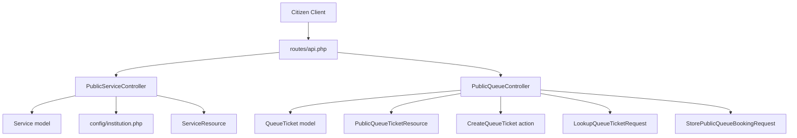
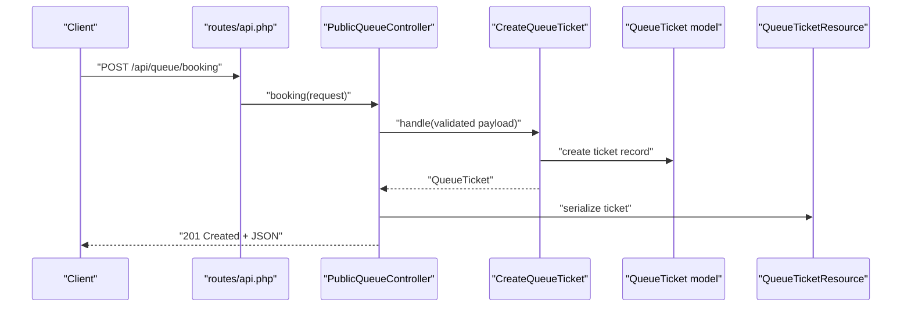
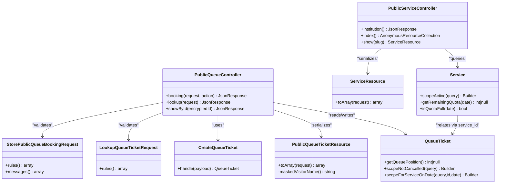

# Public API Endpoints

<cite>
**Referenced Files in This Document**
- [routes/api.php](file://routes/api.php)
- [PublicServiceController.php](file://app/Http/Controllers/Api/PublicServiceController.php)
- [PublicQueueController.php](file://app/Http/Controllers/Api/PublicQueueController.php)
- [ServiceResource.php](file://app/Http/Resources/ServiceResource.php)
- [PublicQueueTicketResource.php](file://app/Http/Resources/PublicQueueTicketResource.php)
- [StorePublicQueueBookingRequest.php](file://app/Http/Requests/StorePublicQueueBookingRequest.php)
- [LookupQueueTicketRequest.php](file://app/Http/Requests/LookupQueueTicketRequest.php)
- [Service.php](file://app/Models/Service.php)
- [QueueTicket.php](file://app/Models/QueueTicket.php)
- [CreateQueueTicket.php](file://app/Actions/Queue/CreateQueueTicket.php)
- [WeekdayOnly.php](file://app/Rules/WeekdayOnly.php)
- [institution.php](file://config/institution.php)
</cite>

## Table of Contents
1. [Introduction](#introduction)
2. [Project Structure](#project-structure)
3. [Core Components](#core-components)
4. [Architecture Overview](#architecture-overview)
5. [Detailed Component Analysis](#detailed-component-analysis)
6. [Dependency Analysis](#dependency-analysis)
7. [Performance Considerations](#performance-considerations)
8. [Troubleshooting Guide](#troubleshooting-guide)
9. [Conclusion](#conclusion)
10. [Appendices](#appendices)

## Introduction
This document describes the Public API endpoints that enable citizens to browse available services and manage queue bookings. It covers:
- Service discovery endpoints for browsing services and institution metadata
- Queue management endpoints for looking up tickets and booking new tickets
- Request validation rules, response schemas, and error handling
- Practical usage examples, rate limiting policies, and integration patterns
- The encrypted ticket ID mechanism and security considerations for public endpoints

## Project Structure
The Public API endpoints are registered under the routes/api.php file and handled by dedicated controllers. Resource classes transform domain models into JSON responses. Validation is enforced via form requests, and business logic is encapsulated in action classes.

**Diagram sources**
- [routes/api.php:1-23](file://routes/api.php#L1-L23)
- [PublicServiceController.php:1-42](file://app/Http/Controllers/Api/PublicServiceController.php#L1-L42)
- [PublicQueueController.php:1-75](file://app/Http/Controllers/Api/PublicQueueController.php#L1-L75)
- [ServiceResource.php:1-25](file://app/Http/Resources/ServiceResource.php#L1-L25)
- [PublicQueueTicketResource.php:1-38](file://app/Http/Resources/PublicQueueTicketResource.php#L1-L38)
- [Service.php:1-101](file://app/Models/Service.php#L1-L101)
- [QueueTicket.php:1-121](file://app/Models/QueueTicket.php#L1-L121)
- [CreateQueueTicket.php:1-91](file://app/Actions/Queue/CreateQueueTicket.php#L1-L91)
- [LookupQueueTicketRequest.php:1-30](file://app/Http/Requests/LookupQueueTicketRequest.php#L1-L30)
- [StorePublicQueueBookingRequest.php:1-46](file://app/Http/Requests/StorePublicQueueBookingRequest.php#L1-L46)
- [institution.php:1-10](file://config/institution.php#L1-L10)

**Section sources**
- [routes/api.php:1-23](file://routes/api.php#L1-L23)

## Core Components
- PublicServiceController: Handles institution metadata retrieval and service listings.
- PublicQueueController: Handles queue lookup by number/date and encrypted ID, and ticket booking.
- ServiceResource: Serializes service data including quota calculations.
- PublicQueueTicketResource: Serializes queue ticket data with masked visitor name and position calculation.
- Validation Requests: Enforce required fields, formats, and business rules.
- Domain Models: Service and QueueTicket define data structures and scopes.
- Action Classes: Encapsulate booking creation and numbering logic.
- Institution Config: Provides institution metadata returned by the institution endpoint.

**Section sources**
- [PublicServiceController.php:1-42](file://app/Http/Controllers/Api/PublicServiceController.php#L1-L42)
- [PublicQueueController.php:1-75](file://app/Http/Controllers/Api/PublicQueueController.php#L1-L75)
- [ServiceResource.php:1-25](file://app/Http/Resources/ServiceResource.php#L1-L25)
- [PublicQueueTicketResource.php:1-38](file://app/Http/Resources/PublicQueueTicketResource.php#L1-L38)
- [Service.php:1-101](file://app/Models/Service.php#L1-L101)
- [QueueTicket.php:1-121](file://app/Models/QueueTicket.php#L1-L121)
- [CreateQueueTicket.php:1-91](file://app/Actions/Queue/CreateQueueTicket.php#L1-L91)
- [LookupQueueTicketRequest.php:1-30](file://app/Http/Requests/LookupQueueTicketRequest.php#L1-L30)
- [StorePublicQueueBookingRequest.php:1-46](file://app/Http/Requests/StorePublicQueueBookingRequest.php#L1-L46)
- [institution.php:1-10](file://config/institution.php#L1-L10)

## Architecture Overview
The Public API follows a layered pattern:
- Routing defines endpoints and applies rate limits per group
- Controllers orchestrate requests, delegate to actions, and return resources
- Resources transform models to JSON with privacy and derived fields
- Validation requests enforce input rules
- Domain models encapsulate persistence and business logic
- Actions encapsulate complex operations like ticket creation and numbering

**Diagram sources**
- [routes/api.php:16-18](file://routes/api.php#L16-L18)
- [PublicQueueController.php:16-34](file://app/Http/Controllers/Api/PublicQueueController.php#L16-L34)
- [CreateQueueTicket.php:34-89](file://app/Actions/Queue/CreateQueueTicket.php#L34-L89)
- [QueueTicket.php:17-52](file://app/Models/QueueTicket.php#L17-L52)

## Detailed Component Analysis

### Endpoint: GET /institution
- Purpose: Retrieve institution metadata for display and branding.
- Authentication: None (public).
- Rate limit: 60 requests per minute.
- Response schema:
  - name: string
  - address: string
  - phone: string
  - operating_hours: string
  - logo_path: string
- Error handling: Returns 200 even if fields are empty; no explicit 404 for missing config.
- Usage example:
  - GET https://example.com/api/institution

**Section sources**
- [routes/api.php:8-14](file://routes/api.php#L8-L14)
- [PublicServiceController.php:13-24](file://app/Http/Controllers/Api/PublicServiceController.php#L13-L24)
- [institution.php:1-10](file://config/institution.php#L1-L10)

### Endpoint: GET /services
- Purpose: List all active services available for booking.
- Authentication: None (public).
- Rate limit: 60 requests per minute.
- Response schema: Array of service objects
  - id: integer
  - name: string
  - code: string
  - slug: string
  - description: string
  - requirements: array
  - booking_enabled: boolean
  - daily_quota: integer|null
  - remaining_quota: integer|null
- Error handling: Returns empty array if none found; no 404.
- Usage example:
  - GET https://example.com/api/services

**Section sources**
- [routes/api.php:8-14](file://routes/api.php#L8-L14)
- [PublicServiceController.php:26-31](file://app/Http/Controllers/Api/PublicServiceController.php#L26-L31)
- [ServiceResource.php:10-23](file://app/Http/Resources/ServiceResource.php#L10-L23)
- [Service.php:62-67](file://app/Models/Service.php#L62-L67)

### Endpoint: GET /services/{slug}
- Purpose: Retrieve a single active service by slug.
- Authentication: None (public).
- Rate limit: 60 requests per minute.
- Path parameters:
  - slug: string (service slug)
- Response schema: Same as GET /services with a single service object.
- Error handling:
  - 404 Not Found if service does not exist or is inactive.
- Usage example:
  - GET https://example.com/api/services/property-registration

**Section sources**
- [routes/api.php:8-14](file://routes/api.php#L8-L14)
- [PublicServiceController.php:33-40](file://app/Http/Controllers/Api/PublicServiceController.php#L33-L40)
- [ServiceResource.php:10-23](file://app/Http/Resources/ServiceResource.php#L10-L23)

### Endpoint: GET /queue/lookup
- Purpose: Look up a ticket by ticket number and service date.
- Authentication: None (public).
- Rate limit: 60 requests per minute.
- Query parameters:
  - ticket_number: string (optional)
  - service_date: date (optional)
- Response schema: PublicQueueTicketResource
  - id: encrypted string (see Security section)
  - ticket_number: string
  - service_date: date (YYYY-MM-DD)
  - visitor_name: string (masked)
  - status: enum value
  - status_label: human-readable label
  - service: ServiceResource (when loaded)
  - queue_position: integer|null (position among waiting tickets)
  - counter_name: string|null
  - checked_in_at: ISO 8601|null
  - called_at: ISO 8601|null
  - completed_at: ISO 8601|null
- Error handling:
  - 404 Not Found if no matching ticket is found.
- Usage example:
  - GET https://example.com/api/queue/lookup?ticket_number=A123&service_date=2026-03-20

**Section sources**
- [routes/api.php:8-14](file://routes/api.php#L8-L14)
- [PublicQueueController.php:36-45](file://app/Http/Controllers/Api/PublicQueueController.php#L36-L45)
- [PublicQueueTicketResource.php:10-26](file://app/Http/Resources/PublicQueueTicketResource.php#L10-L26)
- [QueueTicket.php:82-94](file://app/Models/QueueTicket.php#L82-L94)

### Endpoint: GET /queue/ticket-by-id/{encryptedId}
- Purpose: Retrieve a ticket by its encrypted ID.
- Authentication: None (public).
- Rate limit: 60 requests per minute.
- Path parameters:
  - encryptedId: string (encrypted ticket identifier)
- Response schema: PublicQueueTicketResource
- Error handling:
  - 404 Not Found if decryption fails or ticket not found.
- Usage example:
  - GET https://example.com/api/queue/ticket-by-id/ENCRYPTED_STRING

**Section sources**
- [routes/api.php:8-14](file://routes/api.php#L8-L14)
- [PublicQueueController.php:47-64](file://app/Http/Controllers/Api/PublicQueueController.php#L47-L64)
- [PublicQueueTicketResource.php:10-26](file://app/Http/Resources/PublicQueueTicketResource.php#L10-L26)

### Endpoint: POST /queue/booking
- Purpose: Create a new queue ticket for a service on a weekday within allowed range.
- Authentication: None (public).
- Rate limit: 10 requests per minute.
- Request body fields:
  - service_id: integer (required; exists in services)
  - service_date: date (required; today or later, up to +14 days; must be weekday)
  - visitor_name: string (required)
  - visitor_identifier: string (required)
  - visitor_phone: string (required)
  - visit_purpose: enum (optional; one of: pendaftaran, informasi_pengaduan, produk_hukum, ecourt)
  - notes: string (optional)
- Response schema: QueueTicketResource (201 Created)
- Error handling:
  - 422 Unprocessable Entity for validation errors
  - 404 Not Found if service not found
- Usage example:
  - POST https://example.com/api/queue/booking
  - Body: {"service_id":1,"service_date":"2026-03-20","visitor_name":"John Doe","visitor_identifier":"123456789","visitor_phone":"+628123456789","visit_purpose":"pendaftaran"}

**Section sources**
- [routes/api.php:16-18](file://routes/api.php#L16-L18)
- [PublicQueueController.php:16-34](file://app/Http/Controllers/Api/PublicQueueController.php#L16-L34)
- [StorePublicQueueBookingRequest.php:22-33](file://app/Http/Requests/StorePublicQueueBookingRequest.php#L22-L33)
- [WeekdayOnly.php:16-31](file://app/Rules/WeekdayOnly.php#L16-L31)
- [CreateQueueTicket.php:34-89](file://app/Actions/Queue/CreateQueueTicket.php#L34-L89)
- [QueueTicket.php:17-52](file://app/Models/QueueTicket.php#L17-L52)

## Dependency Analysis

**Diagram sources**
- [PublicServiceController.php:11-41](file://app/Http/Controllers/Api/PublicServiceController.php#L11-L41)
- [PublicQueueController.php:14-75](file://app/Http/Controllers/Api/PublicQueueController.php#L14-L75)
- [ServiceResource.php:8-24](file://app/Http/Resources/ServiceResource.php#L8-L24)
- [PublicQueueTicketResource.php:8-38](file://app/Http/Resources/PublicQueueTicketResource.php#L8-L38)
- [Service.php:12-101](file://app/Models/Service.php#L12-L101)
- [QueueTicket.php:12-121](file://app/Models/QueueTicket.php#L12-L121)
- [CreateQueueTicket.php:13-91](file://app/Actions/Queue/CreateQueueTicket.php#L13-L91)
- [LookupQueueTicketRequest.php:7-29](file://app/Http/Requests/LookupQueueTicketRequest.php#L7-L29)
- [StorePublicQueueBookingRequest.php:7-46](file://app/Http/Requests/StorePublicQueueBookingRequest.php#L7-L46)

## Performance Considerations
- Rate limiting:
  - GET endpoints (/institution, /services, /services/{slug}, /queue/lookup, /queue/ticket-by-id/{encryptedId}): 60 per minute
  - POST /queue/booking: 10 per minute
- Indexing and queries:
  - Service listing uses active scope; ensure appropriate indexes on is_active and sort fields.
  - Queue lookup filters by ticket_number and service_date; ensure composite indexes on these columns.
  - Position calculation for waiting tickets counts rows; consider indexed counters and statuses.
- Caching:
  - Consider caching institution metadata and service lists for frequently accessed endpoints.
- Serialization:
  - Lazy-loading relations (service, counter, queuePool) reduces payload size; avoid unnecessary eager loading.

[No sources needed since this section provides general guidance]

## Troubleshooting Guide
Common issues and resolutions:
- 404 Not Found on ticket lookup:
  - Verify ticket_number and service_date combination exists.
  - Ensure service_date matches the ticket’s service_date.
- 404 Not Found on encrypted ID:
  - Confirm the encryptedId was generated from a valid internal ticket ID.
  - Ensure the ticket still exists in the database.
- 422 Unprocessable Entity on booking:
  - service_id must reference an existing active service.
  - service_date must be a weekday within allowed range.
  - visitor_identifier and visitor_phone are required.
  - visit_purpose must be one of the allowed values if provided.
- Quota exceeded:
  - Check service.daily_quota and remaining_quota.
  - If unlimited, daily_quota is null; otherwise remaining_quota indicates available slots.

**Section sources**
- [PublicQueueController.php:36-45](file://app/Http/Controllers/Api/PublicQueueController.php#L36-L45)
- [PublicQueueController.php:47-64](file://app/Http/Controllers/Api/PublicQueueController.php#L47-L64)
- [StorePublicQueueBookingRequest.php:22-33](file://app/Http/Requests/StorePublicQueueBookingRequest.php#L22-L33)
- [Service.php:73-99](file://app/Models/Service.php#L73-L99)

## Conclusion
The Public API provides a secure, rate-limited interface for citizens to discover services and manage queue bookings. Validation ensures data integrity, while resource classes deliver consistent, privacy-aware responses. The encrypted ticket ID mechanism protects internal identifiers in public contexts.

[No sources needed since this section summarizes without analyzing specific files]

## Appendices

### Request Validation Rules Summary
- GET /queue/lookup
  - ticket_number: nullable string, max length 40
  - service_date: nullable date
- POST /queue/booking
  - service_id: required integer, must exist in services
  - service_date: required date, today or later, up to +14 days, weekday only
  - visitor_name: required string, max 255
  - visitor_identifier: required string, max 64
  - visitor_phone: required string, max 30
  - visit_purpose: optional enum from predefined set
  - notes: optional string, max 1000

**Section sources**
- [LookupQueueTicketRequest.php:22-28](file://app/Http/Requests/LookupQueueTicketRequest.php#L22-L28)
- [StorePublicQueueBookingRequest.php:22-33](file://app/Http/Requests/StorePublicQueueBookingRequest.php#L22-L33)
- [WeekdayOnly.php:16-31](file://app/Rules/WeekdayOnly.php#L16-L31)

### Response Schemas Summary
- GET /institution
  - Fields: name, address, phone, operating_hours, logo_path
- GET /services
  - Array of service objects with id, name, code, slug, description, requirements, booking_enabled, daily_quota, remaining_quota
- GET /services/{slug}
  - Single service object
- GET /queue/lookup
  - PublicQueueTicketResource
- GET /queue/ticket-by-id/{encryptedId}
  - PublicQueueTicketResource
- POST /queue/booking
  - QueueTicketResource (201 Created)

**Section sources**
- [PublicServiceController.php:13-24](file://app/Http/Controllers/Api/PublicServiceController.php#L13-L24)
- [ServiceResource.php:10-23](file://app/Http/Resources/ServiceResource.php#L10-L23)
- [PublicQueueTicketResource.php:10-26](file://app/Http/Resources/PublicQueueTicketResource.php#L10-L26)
- [QueueTicket.php:17-52](file://app/Models/QueueTicket.php#L17-L52)

### Rate Limiting Policies
- GET endpoints: 60 per minute
- POST /queue/booking: 10 per minute

**Section sources**
- [routes/api.php:8-18](file://routes/api.php#L8-L18)

### Encrypted Ticket ID Mechanism and Security
- The ticket ID exposed in responses is encrypted using the application’s encryption mechanism.
- Retrieval endpoint decrypts the ID; any decryption failure results in 404 Not Found.
- Security considerations:
  - Treat encryptedId as a bearer token; rotate tokens periodically if feasible.
  - Avoid embedding encryptedId in insecure contexts (e.g., emails without transport encryption).
  - Apply HTTPS and consider short-lived tokens if integrating with third-party systems.
- Internal handling:
  - Decryption occurs before querying the database; invalid tokens yield 404.

**Section sources**
- [PublicQueueTicketResource.php:13](file://app/Http/Resources/PublicQueueTicketResource.php#L13)
- [PublicQueueController.php:47-64](file://app/Http/Controllers/Api/PublicQueueController.php#L47-L64)

### Integration Patterns for External Systems
- Service discovery:
  - Poll GET /services periodically to keep local caches updated.
  - Cache institution metadata for branding and display.
- Booking:
  - Pre-validate service_date against WeekdayOnly rule and allowed range before calling POST /queue/booking.
  - On 422, present user-friendly messages derived from validation messages.
- Status checks:
  - After successful booking, store the encryptedId and use GET /queue/ticket-by-id/{encryptedId} to poll status.
  - Alternatively, use GET /queue/lookup with ticket_number and service_date.
- Error handling:
  - Implement retry with exponential backoff for transient failures.
  - Surface user-facing errors for 422 and 404 scenarios.

**Section sources**
- [routes/api.php:8-18](file://routes/api.php#L8-L18)
- [StorePublicQueueBookingRequest.php:38-44](file://app/Http/Requests/StorePublicQueueBookingRequest.php#L38-L44)
- [PublicQueueController.php:16-34](file://app/Http/Controllers/Api/PublicQueueController.php#L16-L34)
- [PublicQueueController.php:36-45](file://app/Http/Controllers/Api/PublicQueueController.php#L36-L45)
- [PublicQueueController.php:47-64](file://app/Http/Controllers/Api/PublicQueueController.php#L47-L64)