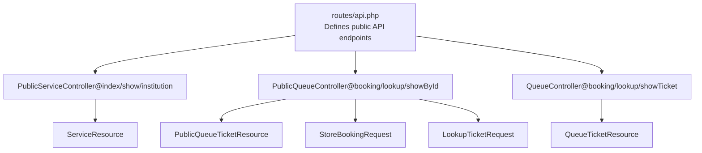
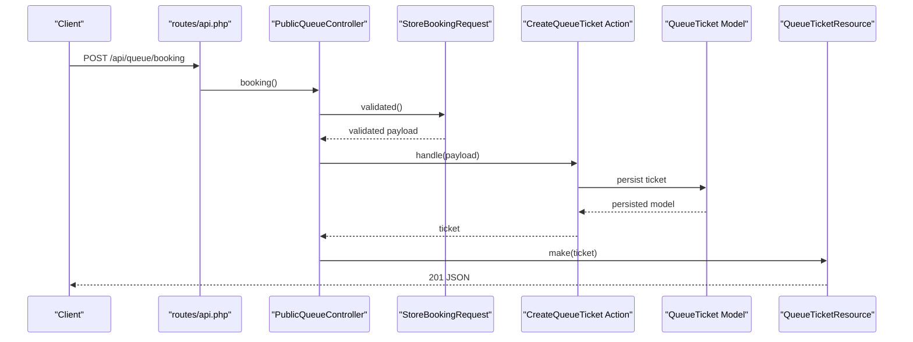
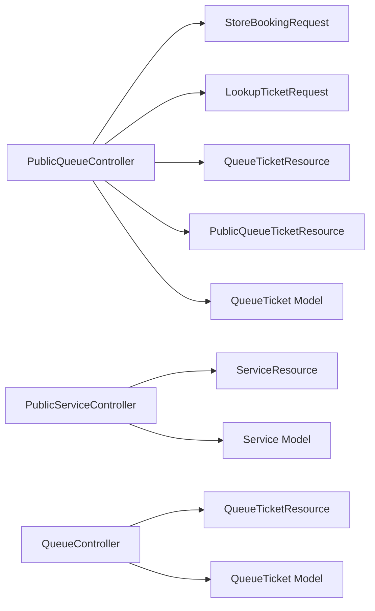

# Request/Response Data Formats

<cite>
**Referenced Files in This Document**
- [routes/api.php](file://routes/api.php)
- [PublicQueueController.php](file://app/Http/Controllers/Api/PublicQueueController.php)
- [PublicServiceController.php](file://app/Http/Controllers/Api/PublicServiceController.php)
- [ServiceController.php](file://app/Http/Controllers/Api/ServiceController.php)
- [InstitutionController.php](file://app/Http/Controllers/Api/InstitutionController.php)
- [QueueController.php](file://app/Http/Controllers/Api/QueueController.php)
- [StoreBookingRequest.php](file://app/Http/Requests/Api/StoreBookingRequest.php)
- [LookupTicketRequest.php](file://app/Http/Requests/Api/LookupTicketRequest.php)
- [QueueTicketResource.php](file://app/Http/Resources/QueueTicketResource.php)
- [PublicQueueTicketResource.php](file://app/Http/Resources/PublicQueueTicketResource.php)
- [ServiceResource.php](file://app/Http/Resources/ServiceResource.php)
- [QueueTicket.php](file://app/Models/QueueTicket.php)
- [Service.php](file://app/Models/Service.php)
</cite>

## Table of Contents
1. [Introduction](#introduction)
2. [Project Structure](#project-structure)
3. [Core Components](#core-components)
4. [Architecture Overview](#architecture-overview)
5. [Detailed Component Analysis](#detailed-component-analysis)
6. [Dependency Analysis](#dependency-analysis)
7. [Performance Considerations](#performance-considerations)
8. [Troubleshooting Guide](#troubleshooting-guide)
9. [Conclusion](#conclusion)

## Introduction
This document defines the API request and response data formats used by the public-facing queue management system. It covers:
- JSON schemas for request payloads (booking, lookup, and administrative operations)
- Response formats using Laravel Resources (QueueTicketResource, ServiceResource, and collection responses)
- Validation rules, required fields, and optional parameters
- Example request/response pairs
- Error response formats
- Pagination and filtering/sorting for list endpoints
- Data transformation patterns (masking, encryption, ISO 8601 timestamps)

## Project Structure
The API surface is organized under the routes/api.php file and implemented by controllers in the Api namespace. Resources define the JSON output shape for tickets and services. Request classes encapsulate validation rules.

**Diagram sources**
- [routes/api.php:1-23](file://routes/api.php#L1-L23)
- [PublicQueueController.php:1-75](file://app/Http/Controllers/Api/PublicQueueController.php#L1-L75)
- [PublicServiceController.php:1-42](file://app/Http/Controllers/Api/PublicServiceController.php#L1-L42)
- [ServiceController.php:1-33](file://app/Http/Controllers/Api/ServiceController.php#L1-L33)
- [QueueController.php:1-82](file://app/Http/Controllers/Api/QueueController.php#L1-L82)
- [StoreBookingRequest.php:1-73](file://app/Http/Requests/Api/StoreBookingRequest.php#L1-L73)
- [LookupTicketRequest.php:1-32](file://app/Http/Requests/Api/LookupTicketRequest.php#L1-L32)
- [QueueTicketResource.php:1-30](file://app/Http/Resources/QueueTicketResource.php#L1-L30)
- [PublicQueueTicketResource.php:1-38](file://app/Http/Resources/PublicQueueTicketResource.php#L1-L38)
- [ServiceResource.php:1-25](file://app/Http/Resources/ServiceResource.php#L1-L25)

**Section sources**
- [routes/api.php:1-23](file://routes/api.php#L1-L23)

## Core Components
- Public booking endpoint: POST /api/queue/booking
- Public lookup endpoint: GET /api/queue/lookup
- Public ticket by encrypted ID: GET /api/queue/ticket-by-id/{encryptedId}
- Public services listing: GET /api/services
- Public single service: GET /api/services/{slug}
- Institution info: GET /api/institution
- Administrative service listing: GET /admin/services (web-only)
- Administrative service CRUD: POST/PUT/DELETE /admin/services/{service} (web-only)

Notes:
- Endpoints are throttled differently to protect resources.
- Administrative endpoints require authentication via Sanctum and are not documented here in detail.

**Section sources**
- [routes/api.php:8-18](file://routes/api.php#L8-L18)
- [PublicQueueController.php:16-34](file://app/Http/Controllers/Api/PublicQueueController.php#L16-L34)
- [PublicQueueController.php:36-45](file://app/Http/Controllers/Api/PublicQueueController.php#L36-L45)
- [PublicQueueController.php:47-64](file://app/Http/Controllers/Api/PublicQueueController.php#L47-L64)
- [PublicServiceController.php:26-40](file://app/Http/Controllers/Api/PublicServiceController.php#L26-L40)
- [ServiceController.php:14-31](file://app/Http/Controllers/Api/ServiceController.php#L14-L31)

## Architecture Overview
The API follows a thin-controller pattern with dedicated request validation classes and resource transformers.

**Diagram sources**
- [routes/api.php:16-18](file://routes/api.php#L16-L18)
- [PublicQueueController.php:16-34](file://app/Http/Controllers/Api/PublicQueueController.php#L16-L34)
- [StoreBookingRequest.php:17-27](file://app/Http/Requests/Api/StoreBookingRequest.php#L17-L27)
- [QueueTicketResource.php:10-28](file://app/Http/Resources/QueueTicketResource.php#L10-L28)

## Detailed Component Analysis

### Booking Request Payload (POST /api/queue/booking)
- Purpose: Create a new public queue booking.
- Authentication: Not required by route definition; however, administrative endpoints require Sanctum.

Request body (JSON):
- service_id: integer, required, must exist in services.id
- service_date: date string, required, must be today or later, up to 14 days ahead, and a weekday
- visitor_name: string, required, max length 255
- visitor_identifier: string, optional, max length 64
- visitor_phone: string, optional, max length 30
- notes: string, optional, max length 1000

Validation rules summary:
- service_id: required, integer, exists in services.id, service must be active and booking-enabled, and daily quota must not be full
- service_date: required, date, after_or_equal today, before_or_equal +14 days, passes weekday-only rule
- visitor_name: required, string, max 255
- visitor_identifier: nullable, string, max 64
- visitor_phone: nullable, string, max 30
- notes: nullable, string, max 1000

Success response:
- Status: 201 Created
- Body: QueueTicketResource (see below)

Error responses:
- 422 Unprocessable Entity: validation errors returned as field-level messages
- 404 Not Found: when ticket lookup fails (not applicable for booking)
- 400 Bad Request: invalid input formats (not applicable for booking)

Example request:
{
  "service_id": 5,
  "service_date": "2026-03-20",
  "visitor_name": "John Doe",
  "visitor_identifier": "ID-12345",
  "visitor_phone": "+628123456789",
  "notes": "Please expedite"
}

Example success response:
{
  "id": "ENCRYPTED_TICKET_ID",
  "ticket_number": "A123456",
  "service_date": "2026-03-20",
  "visitor_name": "John Doe",
  "visitor_wilayah_kode": "KODE_WILAYAH",
  "status": "waiting",
  "status_label": "Waiting",
  "service": {
    "id": 5,
    "name": "License Renewal",
    "code": "LR-2026",
    "slug": "license-renewal",
    "description": "Renew vehicle license",
    "requirements": [],
    "booking_enabled": true,
    "daily_quota": 50,
    "remaining_quota": 49
  },
  "queue_position": 3,
  "counter_name": null,
  "checked_in_at": null,
  "called_at": null,
  "completed_at": null,
  "cancelled_at": null
}

**Section sources**
- [routes/api.php:16-18](file://routes/api.php#L16-L18)
- [PublicQueueController.php:16-34](file://app/Http/Controllers/Api/PublicQueueController.php#L16-L34)
- [StoreBookingRequest.php:17-57](file://app/Http/Requests/Api/StoreBookingRequest.php#L17-L57)
- [QueueTicketResource.php:10-28](file://app/Http/Resources/QueueTicketResource.php#L10-L28)
- [ServiceResource.php:10-23](file://app/Http/Resources/ServiceResource.php#L10-L23)

### Lookup Request Payload (GET /api/queue/lookup)
- Purpose: Retrieve a public queue ticket by ticket number and service date.

Query parameters:
- ticket_number: string, required
- service_date: date, required

Success response:
- Status: 200 OK
- Body: PublicQueueTicketResource (see below)

Error responses:
- 404 Not Found: ticket not found

Example request:
GET /api/queue/lookup?ticket_number=A123456&service_date=2026-03-20

Example success response:
{
  "id": "ENCRYPTED_TICKET_ID",
  "ticket_number": "A123456",
  "service_date": "2026-03-20",
  "visitor_name": "Jo***",
  "status": "waiting",
  "status_label": "Waiting",
  "service": {
    "id": 5,
    "name": "License Renewal",
    "code": "LR-2026",
    "slug": "license-renewal",
    "description": "Renew vehicle license",
    "requirements": [],
    "booking_enabled": true,
    "daily_quota": 50,
    "remaining_quota": 49
  },
  "queue_position": 3,
  "counter_name": null,
  "checked_in_at": null,
  "called_at": null,
  "completed_at": null
}

Notes:
- Visitor name is masked in the response.

**Section sources**
- [routes/api.php:12-13](file://routes/api.php#L12-L13)
- [PublicQueueController.php:36-45](file://app/Http/Controllers/Api/PublicQueueController.php#L36-L45)
- [LookupTicketRequest.php:14-20](file://app/Http/Requests/Api/LookupTicketRequest.php#L14-L20)
- [PublicQueueTicketResource.php:10-26](file://app/Http/Resources/PublicQueueTicketResource.php#L10-L26)

### Ticket Details by Encrypted ID (GET /api/queue/ticket-by-id/{encryptedId})
- Purpose: Retrieve a queue ticket by its encrypted ID.

Path parameter:
- encryptedId: string, required

Success response:
- Status: 200 OK
- Body: PublicQueueTicketResource

Error responses:
- 404 Not Found: invalid or decrypted ID not found

Example request:
GET /api/queue/ticket-by-id/ENCRYPTED_TICKET_ID

Example success response:
{
  "id": "ENCRYPTED_TICKET_ID",
  "ticket_number": "A123456",
  "service_date": "2026-03-20",
  "visitor_name": "Jo***",
  "status": "waiting",
  "status_label": "Waiting",
  "service": {
    "id": 5,
    "name": "License Renewal",
    "code": "LR-2026",
    "slug": "license-renewal",
    "description": "Renew vehicle license",
    "requirements": [],
    "booking_enabled": true,
    "daily_quota": 50,
    "remaining_quota": 49
  },
  "queue_position": 3,
  "counter_name": null,
  "checked_in_at": null,
  "called_at": null,
  "completed_at": null
}

**Section sources**
- [routes/api.php:13-13](file://routes/api.php#L13-L13)
- [PublicQueueController.php:47-64](file://app/Http/Controllers/Api/PublicQueueController.php#L47-L64)

### Services Listing and Single Service (GET /api/services, GET /api/services/{slug})
- Purpose: List active services and fetch a single service by slug.

GET /api/services:
- Success: 200 OK
- Body: Array of ServiceResource entries

GET /api/services/{slug}:
- Success: 200 OK
- Body: ServiceResource

ServiceResource fields:
- id: integer
- name: string
- code: string
- slug: string
- description: string or null
- requirements: array
- booking_enabled: boolean
- daily_quota: integer or null
- remaining_quota: integer or null

Example success response (list):
[
  {
    "id": 5,
    "name": "License Renewal",
    "code": "LR-2026",
    "slug": "license-renewal",
    "description": "Renew vehicle license",
    "requirements": [],
    "booking_enabled": true,
    "daily_quota": 50,
    "remaining_quota": 49
  }
]

Example success response (single):
{
  "id": 5,
  "name": "License Renewal",
  "code": "LR-2026",
  "slug": "license-renewal",
  "description": "Renew vehicle license",
  "requirements": [],
  "booking_enabled": true,
  "daily_quota": 50,
  "remaining_quota": 49
}

Notes:
- Services are ordered by sort_order and name.

**Section sources**
- [routes/api.php:9-11](file://routes/api.php#L9-L11)
- [PublicServiceController.php:26-40](file://app/Http/Controllers/Api/PublicServiceController.php#L26-L40)
- [ServiceController.php:14-31](file://app/Http/Controllers/Api/ServiceController.php#L14-L31)
- [Service.php:62-67](file://app/Models/Service.php#L62-L67)

### Institution Information (GET /api/institution)
- Purpose: Retrieve institution metadata for display.

Success response:
- Status: 200 OK
- Body: JSON object with selected fields

Fields:
- name: string
- address: string
- phone: string
- operating_hours: string
- logo_path: string or null

Example success response:
{
  "name": "Pengadilan Agama Penajam",
  "address": "Jl. Propinsi Km. 9, Nipah-Nipah, Penajam",
  "phone": "(0542) 8530321",
  "email": "pa.penajam@gmail.com",
  "operating_hours": "Senin - Kamis: 08:00 - 16:30, Jumat: 08:00 - 17:00",
  "logo_path": null
}

**Section sources**
- [routes/api.php:9-9](file://routes/api.php#L9-L9)
- [PublicServiceController.php:13-24](file://app/Http/Controllers/Api/PublicServiceController.php#L13-L24)
- [InstitutionController.php:12-23](file://app/Http/Controllers/Api/InstitutionController.php#L12-L23)

### Administrative Operations (Web-only)
These endpoints are used by administrators and are not part of the public API. They are included for completeness.

- GET /admin/services
- POST /admin/services
- PUT /admin/services/{service}
- DELETE /admin/services/{service}

Notes:
- Require Sanctum authentication.
- Pagination behavior observed in tests: 10 items per page.

**Section sources**
- [tests/Feature/Admin/ManageServicesTest.php:228-246](file://tests/Feature/Admin/ManageServicesTest.php#L228-L246)

## Dependency Analysis
The following diagram shows how controllers depend on request validators, actions/models, and resources.

**Diagram sources**
- [PublicQueueController.php:1-75](file://app/Http/Controllers/Api/PublicQueueController.php#L1-L75)
- [StoreBookingRequest.php:1-73](file://app/Http/Requests/Api/StoreBookingRequest.php#L1-L73)
- [LookupTicketRequest.php:1-32](file://app/Http/Requests/Api/LookupTicketRequest.php#L1-L32)
- [QueueTicketResource.php:1-30](file://app/Http/Resources/QueueTicketResource.php#L1-L30)
- [PublicQueueTicketResource.php:1-38](file://app/Http/Resources/PublicQueueTicketResource.php#L1-L38)
- [PublicServiceController.php:1-42](file://app/Http/Controllers/Api/PublicServiceController.php#L1-L42)
- [ServiceResource.php:1-25](file://app/Http/Resources/ServiceResource.php#L1-L25)
- [QueueController.php:1-82](file://app/Http/Controllers/Api/QueueController.php#L1-L82)
- [QueueTicket.php:1-121](file://app/Models/QueueTicket.php#L1-L121)
- [Service.php:1-101](file://app/Models/Service.php#L1-L101)

## Performance Considerations
- Throttling: Endpoints are rate-limited (e.g., 60/minute for lookup and 10/minute for booking). Tune these values based on load.
- Eager loading: Controllers load related models (service, counter, queuePool) to avoid N+1 queries.
- Resource transformations: Resources compute derived fields (queue position, masked names) and format timestamps; keep payloads lean.
- Pagination: Administrative listing uses 10 items per page; adjust for client needs.

## Troubleshooting Guide
Common issues and resolutions:
- 422 Validation errors on booking:
  - service_id does not exist or inactive
  - booking disabled for the service
  - daily quota full for the selected date
  - service_date outside allowed range or not a weekday
- 404 Not Found on lookup:
  - ticket_number/service_date mismatch or wrong date format
- 400 Bad Request:
  - Malformed JSON or incorrect types in request body

Error response format:
- JSON object with message field
- Example: {"message": "Tiket tidak ditemukan"}

**Section sources**
- [StoreBookingRequest.php:29-57](file://app/Http/Requests/Api/StoreBookingRequest.php#L29-L57)
- [PublicQueueController.php:40-42](file://app/Http/Controllers/Api/PublicQueueController.php#L40-L42)
- [PublicQueueController.php:51-61](file://app/Http/Controllers/Api/PublicQueueController.php#L51-L61)

## Conclusion
The public API provides a clear contract for booking, lookup, and service discovery. Request validation ensures data integrity, while resources standardize response shapes. Administrators can manage services via web endpoints with pagination and quotas enforced at the service level.