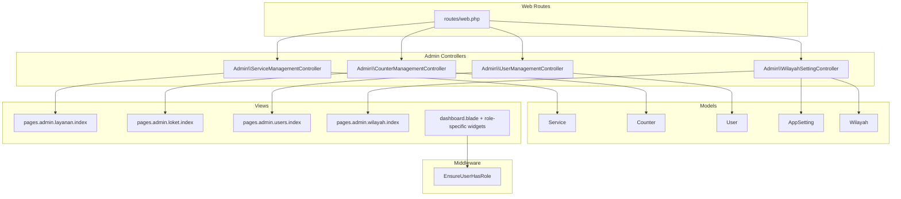
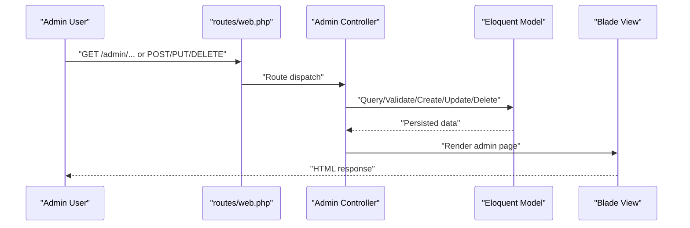
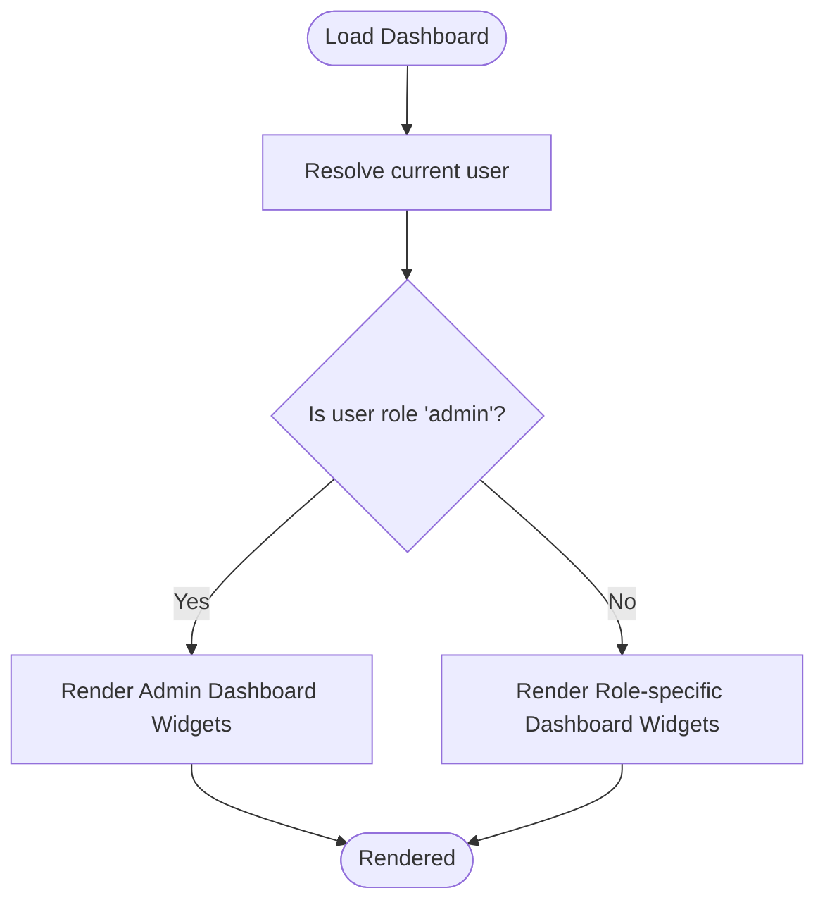
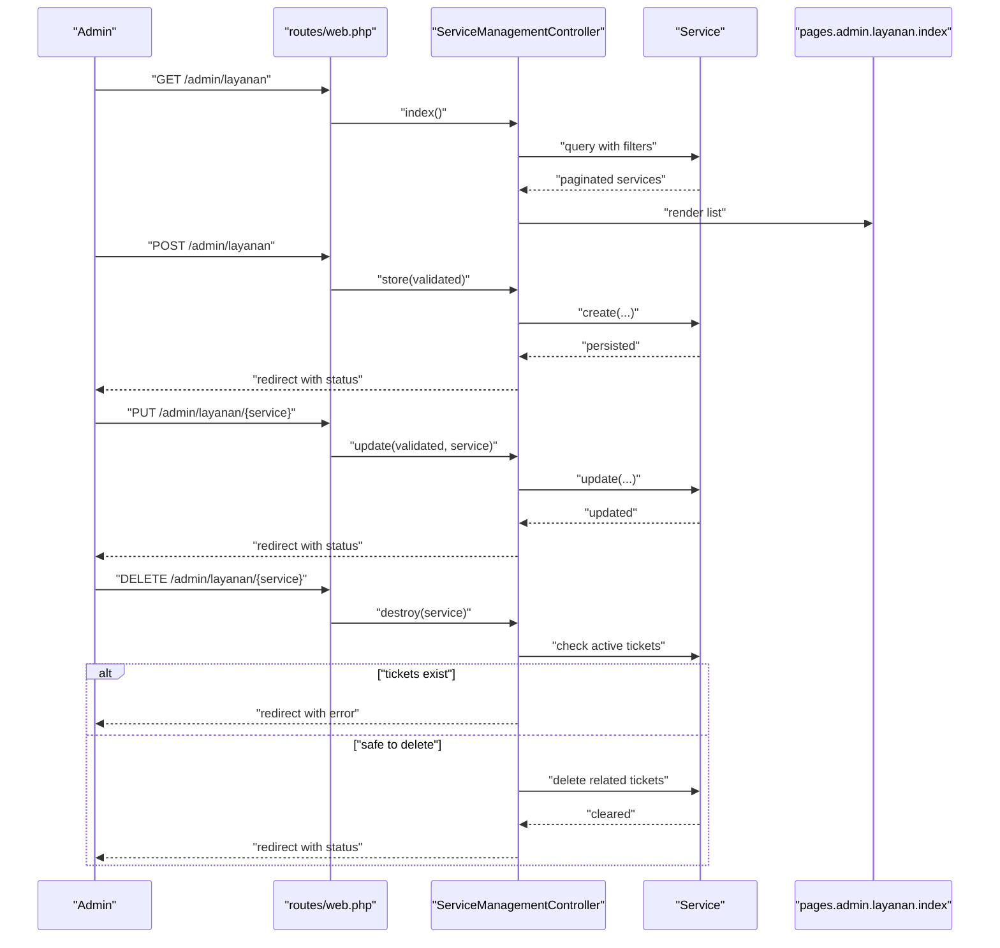
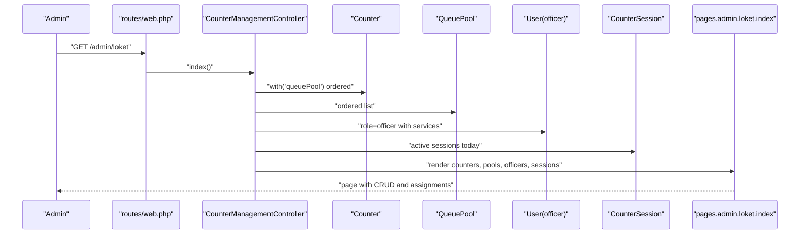
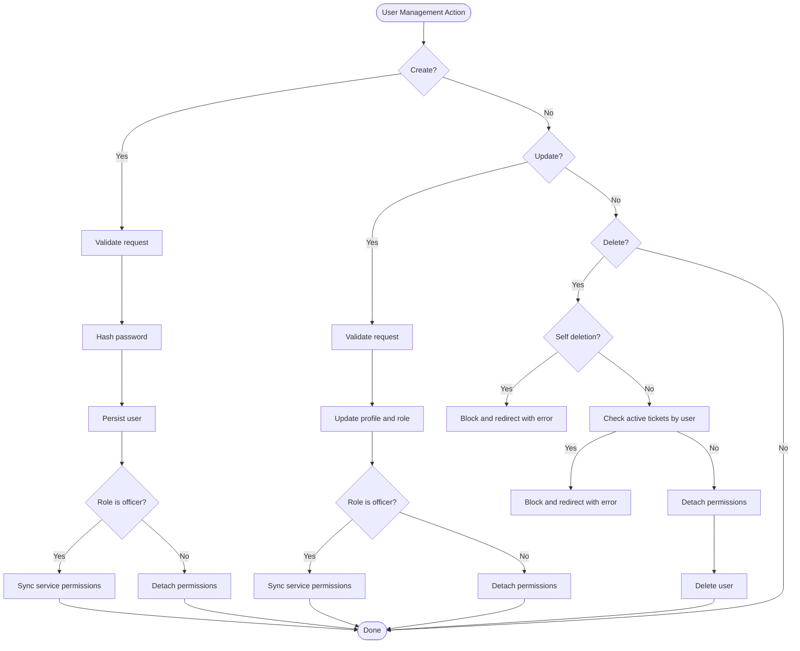
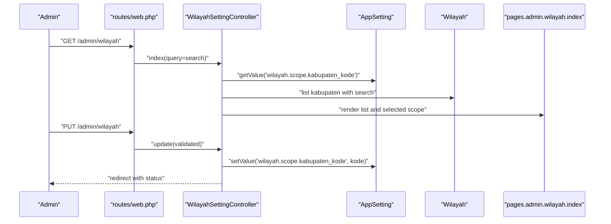
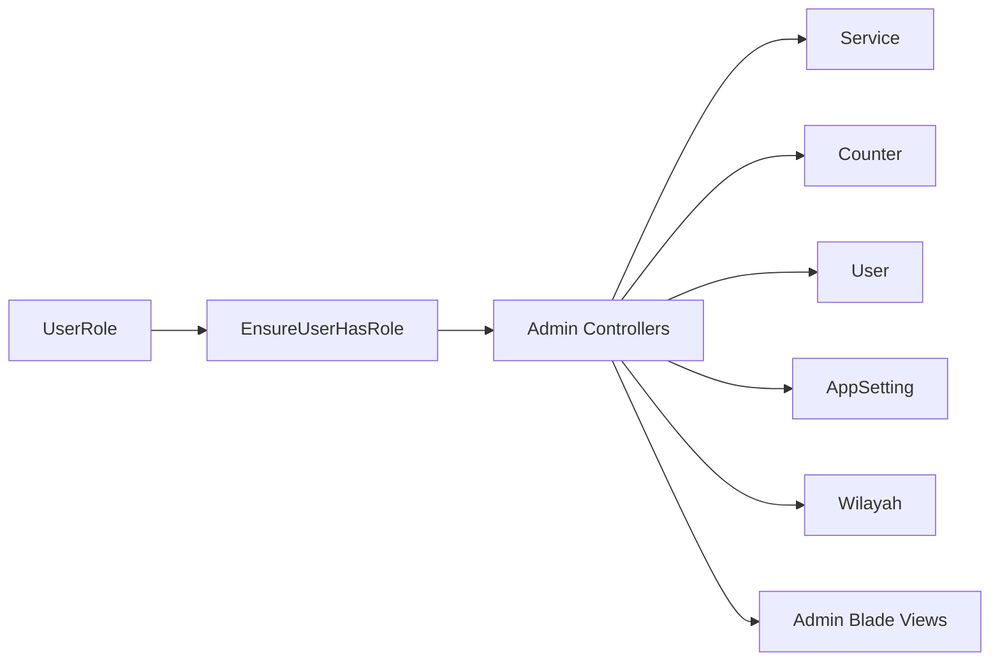

# Administrative Functions

<cite>
**Referenced Files in This Document**
- [app/Http/Controllers/Admin/ServiceManagementController.php](file://app/Http/Controllers/Admin/ServiceManagementController.php)
- [app/Http/Controllers/Admin/CounterManagementController.php](file://app/Http/Controllers/Admin/CounterManagementController.php)
- [app/Http/Controllers/Admin/UserManagementController.php](file://app/Http/Controllers/Admin/UserManagementController.php)
- [app/Http/Controllers/Admin/WilayahSettingController.php](file://app/Http/Controllers/Admin/WilayahSettingController.php)
- [app/Http/Middleware/EnsureUserHasRole.php](file://app/Http/Middleware/EnsureUserHasRole.php)
- [app/Models/Service.php](file://app/Models/Service.php)
- [app/Models/Counter.php](file://app/Models/Counter.php)
- [app/Models/User.php](file://app/Models/User.php)
- [app/Models/AppSetting.php](file://app/Models/AppSetting.php)
- [app/Models/Wilayah.php](file://app/Models/Wilayah.php)
- [app/Enums/UserRole.php](file://app/Enums/UserRole.php)
- [routes/web.php](file://routes/web.php)
- [resources/views/pages/admin/layanan/index.blade.php](file://resources/views/pages/admin/layanan/index.blade.php)
- [resources/views/pages/admin/loket/index.blade.php](file://resources/views/pages/admin/loket/index.blade.php)
- [resources/views/pages/admin/users/index.blade.php](file://resources/views/pages/admin/users/index.blade.php)
- [resources/views/pages/admin/wilayah/index.blade.php](file://resources/views/pages/admin/wilayah/index.blade.php)
- [storage/framework/views/95163b97e54a409c5c6c64694ab4f6d7.php](file://storage/framework/views/95163b97e54a409c5c6c64694ab4f6d7.php)
- [tests/Feature/Admin/ManageServicesTest.php](file://tests/Feature/Admin/ManageServicesTest.php)
- [tests/Feature/Admin/ManageWilayahSettingTest.php](file://tests/Feature/Admin/ManageWilayahSettingTest.php)
- [docs/plans/2026-03-07-role-based-dashboard-redesign.md](file://docs/plans/2026-03-07-role-based-dashboard-redesign.md)
- [docs/demo10/forms/editors.html](file://docs/demo10/forms/editors.html)
</cite>

## Table of Contents
1. [Introduction](#introduction)
2. [Project Structure](#project-structure)
3. [Core Components](#core-components)
4. [Architecture Overview](#architecture-overview)
5. [Detailed Component Analysis](#detailed-component-analysis)
6. [Dependency Analysis](#dependency-analysis)
7. [Performance Considerations](#performance-considerations)
8. [Troubleshooting Guide](#troubleshooting-guide)
9. [Conclusion](#conclusion)
10. [Appendices](#appendices)

## Introduction
This document explains the administrative functions in the PTSP system, focusing on the administrative dashboard and role-based variations, service management (creation, modification, deletion with capacity and scheduling controls), counter administration (location setup, capacity management, operational hours), user management (role assignment, permissions, access control), geographic scope configuration (Wilayah), institutional settings, system configuration options, backup procedures, and administrative reporting capabilities. It synthesizes code-level behavior, routing, middleware enforcement, and UI templates to present a practical guide for administrators and developers.

## Project Structure
Administrative features are primarily implemented via controllers under the Admin namespace, supported by models, enums, middleware, and Blade views. Routes delegate to these controllers, while middleware enforces role-based access. The dashboard displays role-specific widgets and navigation.

**Diagram sources**
- [routes/web.php](file://routes/web.php)
- [app/Http/Controllers/Admin/ServiceManagementController.php](file://app/Http/Controllers/Admin/ServiceManagementController.php)
- [app/Http/Controllers/Admin/CounterManagementController.php](file://app/Http/Controllers/Admin/CounterManagementController.php)
- [app/Http/Controllers/Admin/UserManagementController.php](file://app/Http/Controllers/Admin/UserManagementController.php)
- [app/Http/Controllers/Admin/WilayahSettingController.php](file://app/Http/Controllers/Admin/WilayahSettingController.php)
- [app/Models/Service.php](file://app/Models/Service.php)
- [app/Models/Counter.php](file://app/Models/Counter.php)
- [app/Models/User.php](file://app/Models/User.php)
- [app/Models/AppSetting.php](file://app/Models/AppSetting.php)
- [app/Models/Wilayah.php](file://app/Models/Wilayah.php)
- [resources/views/pages/admin/layanan/index.blade.php](file://resources/views/pages/admin/layanan/index.blade.php)
- [resources/views/pages/admin/loket/index.blade.php](file://resources/views/pages/admin/loket/index.blade.php)
- [resources/views/pages/admin/users/index.blade.php](file://resources/views/pages/admin/users/index.blade.php)
- [resources/views/pages/admin/wilayah/index.blade.php](file://resources/views/pages/admin/wilayah/index.blade.php)
- [storage/framework/views/95163b97e54a409c5c6c64694ab4f6d7.php](file://storage/framework/views/95163b97e54a409c5c6c64694ab4f6d7.php)

**Section sources**
- [routes/web.php](file://routes/web.php)
- [app/Http/Middleware/EnsureUserHasRole.php](file://app/Http/Middleware/EnsureUserHasRole.php)

## Core Components
- Service Management Controller: CRUD for services, capacity control, and pool assignment.
- Counter Management Controller: CRUD for counters, pool assignment, and officer assignment.
- User Management Controller: User lifecycle, role assignment, and service permissions for officers.
- Wilayah Setting Controller: Geographic scope selection and persistence.
- Middleware: Enforces role-based access for admin-only routes.
- Models: Service, Counter, User, AppSetting, Wilayah define domain and constraints.
- Views: Admin pages for services, counters, users, and Wilayah settings.

**Section sources**
- [app/Http/Controllers/Admin/ServiceManagementController.php:1-75](file://app/Http/Controllers/Admin/ServiceManagementController.php#L1-L75)
- [app/Http/Controllers/Admin/CounterManagementController.php:1-51](file://app/Http/Controllers/Admin/CounterManagementController.php#L1-L51)
- [app/Http/Controllers/Admin/UserManagementController.php:1-102](file://app/Http/Controllers/Admin/UserManagementController.php#L1-L102)
- [app/Http/Controllers/Admin/WilayahSettingController.php:1-53](file://app/Http/Controllers/Admin/WilayahSettingController.php#L1-L53)
- [app/Models/Service.php:1-101](file://app/Models/Service.php#L1-L101)
- [app/Models/Counter.php:1-53](file://app/Models/Counter.php#L1-L53)
- [app/Models/User.php:1-99](file://app/Models/User.php#L1-L99)
- [app/Models/AppSetting.php:1-34](file://app/Models/AppSetting.php#L1-L34)
- [app/Models/Wilayah.php:1-24](file://app/Models/Wilayah.php#L1-L24)

## Architecture Overview
Administrative functions are exposed via web routes and handled by dedicated controllers. Access is controlled by middleware that checks roles. Data is persisted through Eloquent models and paginated or filtered in controllers before rendering Blade views.

**Diagram sources**
- [routes/web.php](file://routes/web.php)
- [app/Http/Controllers/Admin/ServiceManagementController.php:1-75](file://app/Http/Controllers/Admin/ServiceManagementController.php#L1-L75)
- [app/Http/Controllers/Admin/CounterManagementController.php:1-51](file://app/Http/Controllers/Admin/CounterManagementController.php#L1-L51)
- [app/Http/Controllers/Admin/UserManagementController.php:1-102](file://app/Http/Controllers/Admin/UserManagementController.php#L1-L102)
- [app/Http/Controllers/Admin/WilayahSettingController.php:1-53](file://app/Http/Controllers/Admin/WilayahSettingController.php#L1-L53)
- [resources/views/pages/admin/layanan/index.blade.php](file://resources/views/pages/admin/layanan/index.blade.php)
- [resources/views/pages/admin/loket/index.blade.php](file://resources/views/pages/admin/loket/index.blade.php)
- [resources/views/pages/admin/users/index.blade.php](file://resources/views/pages/admin/users/index.blade.php)
- [resources/views/pages/admin/wilayah/index.blade.php](file://resources/views/pages/admin/wilayah/index.blade.php)

## Detailed Component Analysis

### Administrative Dashboard and Role-Based Variations
- Role-based dashboard rendering is implemented in the dashboard layout, selecting a role-specific widget based on the current user’s role.
- Admins can switch roles to preview or operate under another role context.
- The dashboard plan documents KPIs, quick actions, and live updates for admin health and monitor dashboards.

**Diagram sources**
- [storage/framework/views/95163b97e54a409c5c6c64694ab4f6d7.php:41-52](file://storage/framework/views/95163b97e54a409c5c6c64694ab4f6d7.php#L41-L52)
- [docs/plans/2026-03-07-role-based-dashboard-redesign.md:251-294](file://docs/plans/2026-03-07-role-based-dashboard-redesign.md#L251-L294)

**Section sources**
- [storage/framework/views/95163b97e54a409c5c6c64694ab4f6d7.php:41-52](file://storage/framework/views/95163b97e54a409c5c6c64694ab4f6d7.php#L41-L52)
- [docs/plans/2026-03-07-role-based-dashboard-redesign.md:251-294](file://docs/plans/2026-03-07-role-based-dashboard-redesign.md#L251-L294)

### Service Management
- Purpose: Create, update, delete services; configure booking enablement, walk-in enablement, daily quotas, and pool assignment.
- Capacity and scheduling controls:
  - Daily quota enforcement via model helpers to compute remaining quota and detect full capacity.
  - Pool assignment ensures services belong to an active queue pool.
- Controller responsibilities:
  - Index with search and pagination.
  - Store validates and persists new services.
  - Update validates and persists changes.
  - Destroy prevents deletion if active tickets exist; clears related tickets before deletion.

**Diagram sources**
- [app/Http/Controllers/Admin/ServiceManagementController.php:1-75](file://app/Http/Controllers/Admin/ServiceManagementController.php#L1-L75)
- [app/Models/Service.php:69-100](file://app/Models/Service.php#L69-L100)
- [resources/views/pages/admin/layanan/index.blade.php](file://resources/views/pages/admin/layanan/index.blade.php)

**Section sources**
- [app/Http/Controllers/Admin/ServiceManagementController.php:17-75](file://app/Http/Controllers/Admin/ServiceManagementController.php#L17-L75)
- [app/Models/Service.php:69-100](file://app/Models/Service.php#L69-L100)
- [tests/Feature/Admin/ManageServicesTest.php:37-75](file://tests/Feature/Admin/ManageServicesTest.php#L37-L75)

### Counter Administration
- Purpose: Manage counters (location setup), assign to queue pools, and assign officers to active sessions.
- Controller responsibilities:
  - Index lists counters with pool names, available officers, and active sessions.
  - Supports pool assignment and officer assignment flows.
- Operational hours and capacity:
  - Counters expose is_active and sort_order for visibility and ordering.
  - Sessions track open/close status and assigners.

**Diagram sources**
- [app/Http/Controllers/Admin/CounterManagementController.php:1-51](file://app/Http/Controllers/Admin/CounterManagementController.php#L1-L51)
- [resources/views/pages/admin/loket/index.blade.php](file://resources/views/pages/admin/loket/index.blade.php)

**Section sources**
- [app/Http/Controllers/Admin/CounterManagementController.php:20-51](file://app/Http/Controllers/Admin/CounterManagementController.php#L20-L51)
- [app/Models/Counter.php:15-53](file://app/Models/Counter.php#L15-L53)

### User Management Workflows
- Purpose: Create, update, and delete users; assign roles; manage officer permissions to services.
- Controller responsibilities:
  - Index lists users and services; supports tabbed views.
  - Store creates users, hashes passwords, and syncs service permissions for officers.
  - Update modifies profile and role; syncs service permissions for officers or detaches for others.
  - Destroy enforces safety checks: cannot delete self; cannot delete if user has active tickets created by them.
- Access control:
  - Middleware ensures only authorized roles can access admin routes.

**Diagram sources**
- [app/Http/Controllers/Admin/UserManagementController.php:1-102](file://app/Http/Controllers/Admin/UserManagementController.php#L1-L102)
- [app/Http/Middleware/EnsureUserHasRole.php:1-37](file://app/Http/Middleware/EnsureUserHasRole.php#L1-L37)
- [resources/views/pages/admin/users/index.blade.php](file://resources/views/pages/admin/users/index.blade.php)

**Section sources**
- [app/Http/Controllers/Admin/UserManagementController.php:19-102](file://app/Http/Controllers/Admin/UserManagementController.php#L19-L102)
- [app/Http/Middleware/EnsureUserHasRole.php:16-35](file://app/Http/Middleware/EnsureUserHasRole.php#L16-L35)
- [app/Models/User.php:93-97](file://app/Models/User.php#L93-L97)

### Geographic Scope Configuration (Wilayah)
- Purpose: Select and persist the target kabupaten/kota scope for the system.
- Controller responsibilities:
  - Index lists kabupaten with search and pagination; shows currently selected scope.
  - Update validates and sets the scope key in AppSetting.
- Data model:
  - Wilayah table stores hierarchical codes and names; AppSetting persists key-value pairs with caching.

**Diagram sources**
- [app/Http/Controllers/Admin/WilayahSettingController.php:15-53](file://app/Http/Controllers/Admin/WilayahSettingController.php#L15-L53)
- [app/Models/AppSetting.php:15-32](file://app/Models/AppSetting.php#L15-L32)
- [app/Models/Wilayah.php:1-24](file://app/Models/Wilayah.php#L1-L24)
- [resources/views/pages/admin/wilayah/index.blade.php](file://resources/views/pages/admin/wilayah/index.blade.php)

**Section sources**
- [app/Http/Controllers/Admin/WilayahSettingController.php:15-53](file://app/Http/Controllers/Admin/WilayahSettingController.php#L15-L53)
- [app/Models/AppSetting.php:15-32](file://app/Models/AppSetting.php#L15-L32)
- [app/Models/Wilayah.php:9-22](file://app/Models/Wilayah.php#L9-L22)
- [tests/Feature/Admin/ManageWilayahSettingTest.php:8-57](file://tests/Feature/Admin/ManageWilayahSettingTest.php#L8-L57)

### Institutional Settings
- AppSetting model provides a generic key-value store for system configuration, cached for performance.
- Examples include geographic scope keys and can be extended for institutional policies.

**Section sources**
- [app/Models/AppSetting.php:15-32](file://app/Models/AppSetting.php#L15-L32)

### System Configuration Options
- Role-based navigation and dashboard widgets are driven by the user’s active role and session overrides for admins.
- Enum defines roles and labels/colors for UI consistency.

**Section sources**
- [app/Models/User.php:81-91](file://app/Models/User.php#L81-L91)
- [app/Enums/UserRole.php:1-32](file://app/Enums/UserRole.php#L1-L32)

### Backup Procedures
- Documentation references a “Database Backup Process Completed” notice pattern, instructing administrators to verify data integrity after backups.
- This indicates a documented procedure for administrators to follow post-backup.

**Section sources**
- [docs/demo10/forms/editors.html:5750-5770](file://docs/demo10/forms/editors.html#L5750-L5770)

### Administrative Reporting Capabilities
- The dashboard redesign plan outlines monitor and admin dashboards with KPIs, trends, and quick actions.
- Admin dashboard includes health metrics, user activity summaries, and failure observations.

**Section sources**
- [docs/plans/2026-03-07-role-based-dashboard-redesign.md:218-294](file://docs/plans/2026-03-07-role-based-dashboard-redesign.md#L218-L294)

## Dependency Analysis
- Controllers depend on models for persistence and on views for rendering.
- Middleware depends on the request user and role enum for access control.
- Views depend on controller-provided data and role-aware rendering logic.

**Diagram sources**
- [app/Http/Middleware/EnsureUserHasRole.php:16-35](file://app/Http/Middleware/EnsureUserHasRole.php#L16-L35)
- [app/Enums/UserRole.php:1-32](file://app/Enums/UserRole.php#L1-L32)
- [app/Http/Controllers/Admin/ServiceManagementController.php:1-75](file://app/Http/Controllers/Admin/ServiceManagementController.php#L1-L75)
- [app/Http/Controllers/Admin/CounterManagementController.php:1-51](file://app/Http/Controllers/Admin/CounterManagementController.php#L1-L51)
- [app/Http/Controllers/Admin/UserManagementController.php:1-102](file://app/Http/Controllers/Admin/UserManagementController.php#L1-L102)
- [app/Http/Controllers/Admin/WilayahSettingController.php:1-53](file://app/Http/Controllers/Admin/WilayahSettingController.php#L1-L53)
- [app/Models/Service.php:1-101](file://app/Models/Service.php#L1-L101)
- [app/Models/Counter.php:1-53](file://app/Models/Counter.php#L1-L53)
- [app/Models/User.php:1-99](file://app/Models/User.php#L1-L99)
- [app/Models/AppSetting.php:1-34](file://app/Models/AppSetting.php#L1-L34)
- [app/Models/Wilayah.php:1-24](file://app/Models/Wilayah.php#L1-L24)

**Section sources**
- [app/Http/Middleware/EnsureUserHasRole.php:16-35](file://app/Http/Middleware/EnsureUserHasRole.php#L16-L35)
- [app/Enums/UserRole.php:1-32](file://app/Enums/UserRole.php#L1-L32)

## Performance Considerations
- Use eager loading in controllers to avoid N+1 queries when fetching related data (e.g., counters with pools, users with services).
- Pagination for large datasets (services, counters, users) reduces memory footprint.
- Caching of AppSetting values minimizes repeated DB reads for configuration.

[No sources needed since this section provides general guidance]

## Troubleshooting Guide
- Service deletion blocked: If deletion fails due to active tickets, review the service’s related queue tickets and statuses before retrying.
- User deletion blocked: Cannot delete self or users with active tickets they created; adjust or cancel tickets first.
- Role access denied: Middleware returns 403 if the user lacks the required role; ensure the route is guarded by the appropriate role middleware.
- Wilayah scope update: Ensure the selected kabupaten code exists in the Wilayah table and that the AppSetting key is set correctly.

**Section sources**
- [app/Http/Controllers/Admin/ServiceManagementController.php:55-73](file://app/Http/Controllers/Admin/ServiceManagementController.php#L55-L73)
- [app/Http/Controllers/Admin/UserManagementController.php:76-100](file://app/Http/Controllers/Admin/UserManagementController.php#L76-L100)
- [app/Http/Middleware/EnsureUserHasRole.php:30-32](file://app/Http/Middleware/EnsureUserHasRole.php#L30-L32)
- [tests/Feature/Admin/ManageWilayahSettingTest.php:47-57](file://tests/Feature/Admin/ManageWilayahSettingTest.php#L47-L57)

## Conclusion
The PTSP administrative subsystem provides robust controls for managing services, counters, users, and geographic scope, enforced by role-based middleware and backed by strongly-typed models. The dashboard adapts to roles, and reporting capabilities are being designed to surface health and throughput metrics for administrators and monitors.

[No sources needed since this section summarizes without analyzing specific files]

## Appendices
- Administrative routes are defined in the web routes file and dispatched to Admin controllers.
- UI templates for admin pages render lists, forms, and role-specific widgets.

**Section sources**
- [routes/web.php](file://routes/web.php)
- [resources/views/pages/admin/layanan/index.blade.php](file://resources/views/pages/admin/layanan/index.blade.php)
- [resources/views/pages/admin/loket/index.blade.php](file://resources/views/pages/admin/loket/index.blade.php)
- [resources/views/pages/admin/users/index.blade.php](file://resources/views/pages/admin/users/index.blade.php)
- [resources/views/pages/admin/wilayah/index.blade.php](file://resources/views/pages/admin/wilayah/index.blade.php)