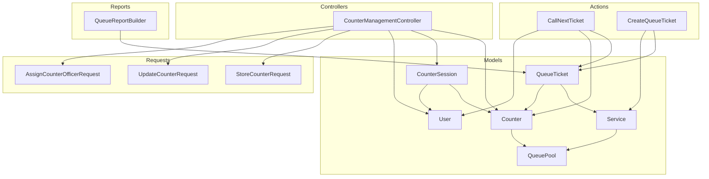
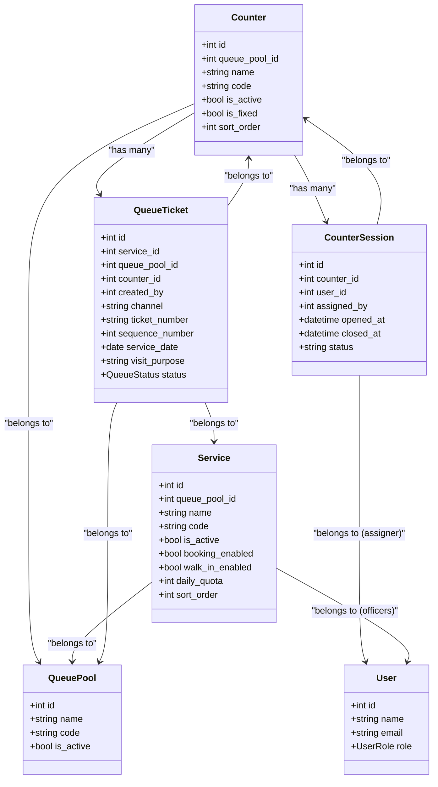
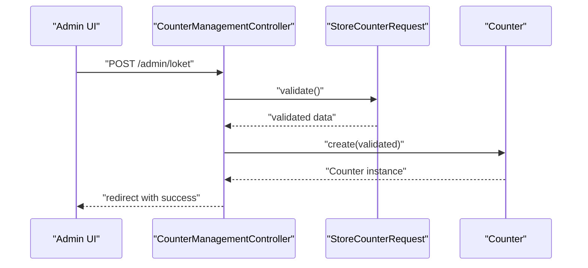
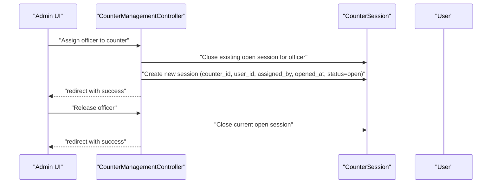
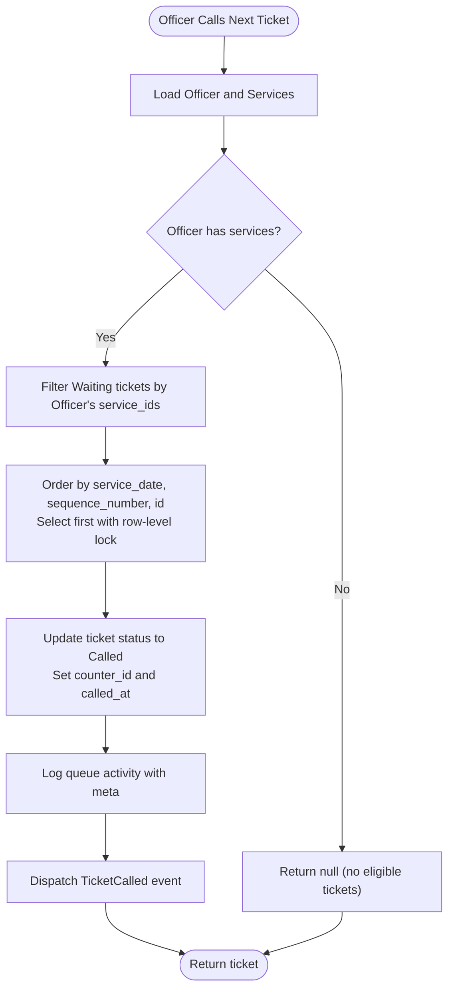
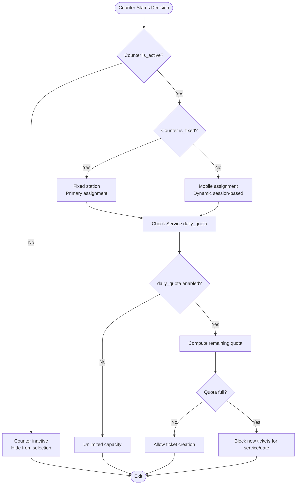
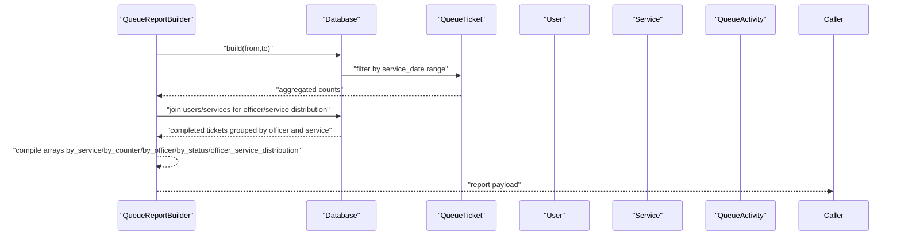
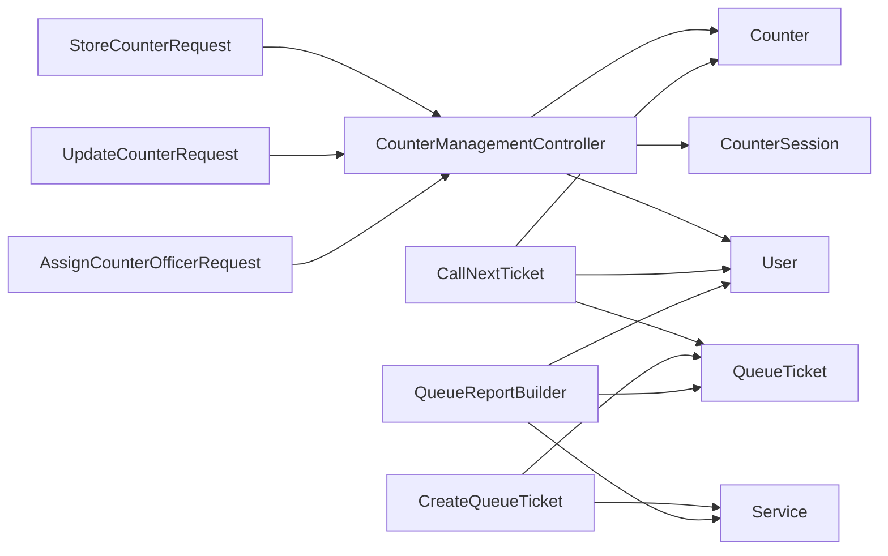

# Counter Management

<cite>
**Referenced Files in This Document**
- [Counter.php](file://app/Models/Counter.php)
- [CounterSession.php](file://app/Models/CounterSession.php)
- [Service.php](file://app/Models/Service.php)
- [User.php](file://app/Models/User.php)
- [QueueTicket.php](file://app/Models/QueueTicket.php)
- [QueuePool.php](file://app/Models/QueuePool.php)
- [CounterManagementController.php](file://app/Http/Controllers/Admin/CounterManagementController.php)
- [StoreCounterRequest.php](file://app/Http/Requests/StoreCounterRequest.php)
- [UpdateCounterRequest.php](file://app/Http/Requests/UpdateCounterRequest.php)
- [AssignCounterOfficerRequest.php](file://app/Http/Requests/AssignCounterOfficerRequest.php)
- [CallNextTicket.php](file://app/Actions/Queue/CallNextTicket.php)
- [CreateQueueTicket.php](file://app/Actions/Queue/CreateQueueTicket.php)
- [QueueReportBuilder.php](file://app/Support/Reports/QueueReportBuilder.php)
- [2026_03_06_015236_create_counters_table.php](file://database/migrations/2026_03_06_015236_create_counters_table.php)
- [2026_03_06_015237_create_counter_sessions_table.php](file://database/migrations/2026_03_06_015237_create_counter_sessions_table.php)
- [2026_03_30_181555_add_visit_purpose_to_queue_tickets_and_is_fixed_to_counters_and_assigned_by_to_counter_sessions.php](file://database/migrations/2026_03_30_181555_add_visit_purpose_to_queue_tickets_and_is_fixed_to_counters_and_assigned_by_to_counter_sessions.php)
</cite>

## Table of Contents
1. [Introduction](#introduction)
2. [Project Structure](#project-structure)
3. [Core Components](#core-components)
4. [Architecture Overview](#architecture-overview)
5. [Detailed Component Analysis](#detailed-component-analysis)
6. [Dependency Analysis](#dependency-analysis)
7. [Performance Considerations](#performance-considerations)
8. [Troubleshooting Guide](#troubleshooting-guide)
9. [Conclusion](#conclusion)
10. [Appendices](#appendices)

## Introduction
This document describes the Counter Management system within the queue management platform. It covers:
- Counter administration: physical location setup, capacity configuration via services, and operational assignment
- Counter session management: shift scheduling, officer assignments, and session tracking
- Counter-user relationship mapping and service assignment capabilities
- Counter status management, maintenance modes, and capacity utilization monitoring
- Counter configuration options: fixed counters, mobile assignments, and visit purpose tracking
- Counter performance metrics and reporting features

## Project Structure
The Counter Management system spans models, controllers, requests, actions, and reports:
- Models define entities (Counter, CounterSession, Service, User, QueueTicket, QueuePool)
- Controllers orchestrate administrative operations (create/update/delete counters, assign/release officers)
- Requests validate inputs for counter creation and updates
- Actions encapsulate queue operations (creating tickets, calling next ticket)
- Reports aggregate performance metrics across services, counters, officers, and statuses

**Diagram sources**
- [Counter.php:10-52](file://app/Models/Counter.php#L10-L52)
- [CounterSession.php:9-45](file://app/Models/CounterSession.php#L9-L45)
- [Service.php:12-100](file://app/Models/Service.php#L12-L100)
- [User.php:14-98](file://app/Models/User.php#L14-L98)
- [QueueTicket.php:12-120](file://app/Models/QueueTicket.php#L12-L120)
- [QueuePool.php:9-42](file://app/Models/QueuePool.php#L9-L42)
- [CounterManagementController.php:18-124](file://app/Http/Controllers/Admin/CounterManagementController.php#L18-L124)
- [StoreCounterRequest.php:7-32](file://app/Http/Requests/StoreCounterRequest.php#L7-L32)
- [UpdateCounterRequest.php:7-32](file://app/Http/Requests/UpdateCounterRequest.php#L7-L32)
- [AssignCounterOfficerRequest.php:7-20](file://app/Http/Requests/AssignCounterOfficerRequest.php#L7-L20)
- [CallNextTicket.php:13-79](file://app/Actions/Queue/CallNextTicket.php#L13-L79)
- [CreateQueueTicket.php:13-89](file://app/Actions/Queue/CreateQueueTicket.php#L13-L89)
- [QueueReportBuilder.php:9-96](file://app/Support/Reports/QueueReportBuilder.php#L9-L96)

**Section sources**
- [Counter.php:10-52](file://app/Models/Counter.php#L10-L52)
- [CounterSession.php:9-45](file://app/Models/CounterSession.php#L9-L45)
- [Service.php:12-100](file://app/Models/Service.php#L12-L100)
- [User.php:14-98](file://app/Models/User.php#L14-L98)
- [QueueTicket.php:12-120](file://app/Models/QueueTicket.php#L12-L120)
- [QueuePool.php:9-42](file://app/Models/QueuePool.php#L9-L42)
- [CounterManagementController.php:18-124](file://app/Http/Controllers/Admin/CounterManagementController.php#L18-L124)
- [StoreCounterRequest.php:7-32](file://app/Http/Requests/StoreCounterRequest.php#L7-L32)
- [UpdateCounterRequest.php:7-32](file://app/Http/Requests/UpdateCounterRequest.php#L7-L32)
- [AssignCounterOfficerRequest.php:7-20](file://app/Http/Requests/AssignCounterOfficerRequest.php#L7-L20)
- [CallNextTicket.php:13-79](file://app/Actions/Queue/CallNextTicket.php#L13-L79)
- [CreateQueueTicket.php:13-89](file://app/Actions/Queue/CreateQueueTicket.php#L13-L89)
- [QueueReportBuilder.php:9-96](file://app/Support/Reports/QueueReportBuilder.php#L9-L96)

## Core Components
- Counter: Represents a physical or logical service station with attributes like name, code, activation status, fixed/mobile mode, and ordering. It belongs to a QueuePool and relates to QueueTickets and CounterSessions.
- CounterSession: Tracks officer-to-counter assignments with timestamps, status, and who assigned the session.
- Service: Defines service offerings with booking/walk-in enablement, daily quotas, and relationships to Users (officers) and QueueTickets.
- User: Holds officer profiles and roles; officers can be mapped to services.
- QueueTicket: Captures ticket lifecycle per service date, including visit purpose and status transitions.
- QueuePool: Logical grouping of services and counters.

Key relationships:
- Counter belongs to QueuePool
- Counter has many CounterSessions and QueueTickets
- CounterSession belongs to Counter and User (assigner)
- Service belongs to QueuePool and connects to Users (officers)
- QueueTicket belongs to Service, Counter, and QueuePool

**Section sources**
- [Counter.php:10-52](file://app/Models/Counter.php#L10-L52)
- [CounterSession.php:9-45](file://app/Models/CounterSession.php#L9-L45)
- [Service.php:12-100](file://app/Models/Service.php#L12-L100)
- [User.php:14-98](file://app/Models/User.php#L14-L98)
- [QueueTicket.php:12-120](file://app/Models/QueueTicket.php#L12-L120)
- [QueuePool.php:9-42](file://app/Models/QueuePool.php#L9-L42)

## Architecture Overview
The system separates concerns across models, controllers, requests, actions, and reports. Administrative operations are handled by the Counter Management Controller, while queue operations are encapsulated in dedicated actions. Reporting aggregates data across tickets and activities.

**Diagram sources**
- [Counter.php:10-52](file://app/Models/Counter.php#L10-L52)
- [CounterSession.php:9-45](file://app/Models/CounterSession.php#L9-L45)
- [Service.php:12-100](file://app/Models/Service.php#L12-L100)
- [User.php:14-98](file://app/Models/User.php#L14-L98)
- [QueueTicket.php:12-120](file://app/Models/QueueTicket.php#L12-L120)
- [QueuePool.php:9-42](file://app/Models/QueuePool.php#L9-L42)

## Detailed Component Analysis

### Counter Administration
Counter administration supports:
- Physical location setup: name, code, queue pool association, sort order
- Activation/deactivation: is_active flag
- Fixed vs mobile: is_fixed flag introduced via migration
- Capacity configuration: indirectly via Service.daily_quota and Service.is_active controls

Administrative operations:
- Create: validated via StoreCounterRequest
- Update: validated via UpdateCounterRequest
- Delete: guarded against active tickets

**Diagram sources**
- [CounterManagementController.php:61-67](file://app/Http/Controllers/Admin/CounterManagementController.php#L61-L67)
- [StoreCounterRequest.php:7-32](file://app/Http/Requests/StoreCounterRequest.php#L7-L32)
- [Counter.php:10-52](file://app/Models/Counter.php#L10-L52)

**Section sources**
- [Counter.php:10-52](file://app/Models/Counter.php#L10-L52)
- [CounterManagementController.php:20-51](file://app/Http/Controllers/Admin/CounterManagementController.php#L20-L51)
- [StoreCounterRequest.php:7-32](file://app/Http/Requests/StoreCounterRequest.php#L7-L32)
- [UpdateCounterRequest.php:7-32](file://app/Http/Requests/UpdateCounterRequest.php#L7-L32)
- [2026_03_30_181555_add_visit_purpose_to_queue_tickets_and_is_fixed_to_counters_and_assigned_by_to_counter_sessions.php:18-20](file://database/migrations/2026_03_30_181555_add_visit_purpose_to_queue_tickets_and_is_fixed_to_counters_and_assigned_by_to_counter_sessions.php#L18-L20)

### Counter Session Management
Counter sessions manage shift scheduling and officer assignments:
- Open/close sessions with timestamps and status
- Track who assigned the session (assigned_by)
- Enforce single active session per officer per day
- Release officers by closing current open session

**Diagram sources**
- [CounterManagementController.php:86-123](file://app/Http/Controllers/Admin/CounterManagementController.php#L86-L123)
- [CounterSession.php:9-45](file://app/Models/CounterSession.php#L9-L45)
- [User.php:14-98](file://app/Models/User.php#L14-L98)

**Section sources**
- [CounterSession.php:9-45](file://app/Models/CounterSession.php#L9-L45)
- [CounterManagementController.php:86-123](file://app/Http/Controllers/Admin/CounterManagementController.php#L86-L123)
- [2026_03_30_181555_add_visit_purpose_to_queue_tickets_and_is_fixed_to_counters_and_assigned_by_to_counter_sessions.php:22-24](file://database/migrations/2026_03_30_181555_add_visit_purpose_to_queue_tickets_and_is_fixed_to_counters_and_assigned_by_to_counter_sessions.php#L22-L24)

### Counter-User Relationship and Service Assignment
- Officers (Users) are linked to Services via a many-to-many relationship
- When an officer calls the next ticket, only tickets for services they are authorized to serve are considered
- Visit purpose is tracked per ticket for reporting and analytics

**Diagram sources**
- [CallNextTicket.php:19-78](file://app/Actions/Queue/CallNextTicket.php#L19-L78)
- [Service.php:53-57](file://app/Models/Service.php#L53-L57)
- [User.php:93-97](file://app/Models/User.php#L93-L97)

**Section sources**
- [Service.php:53-57](file://app/Models/Service.php#L53-L57)
- [User.php:93-97](file://app/Models/User.php#L93-L97)
- [CallNextTicket.php:19-78](file://app/Actions/Queue/CallNextTicket.php#L19-L78)
- [QueueTicket.php:17-51](file://app/Models/QueueTicket.php#L17-L51)

### Counter Status Management and Maintenance Modes
- Counter activation: is_active toggles visibility and eligibility
- Fixed counters: is_fixed distinguishes permanent stations from mobile assignments
- Session status: open/closed indicates current availability
- Capacity monitoring: daily_quota per Service limits bookings and walk-ins

**Diagram sources**
- [Counter.php:15-31](file://app/Models/Counter.php#L15-L31)
- [Service.php:73-99](file://app/Models/Service.php#L73-L99)
- [2026_03_30_181555_add_visit_purpose_to_queue_tickets_and_is_fixed_to_counters_and_assigned_by_to_counter_sessions.php:18-20](file://database/migrations/2026_03_30_181555_add_visit_purpose_to_queue_tickets_and_is_fixed_to_counters_and_assigned_by_to_counter_sessions.php#L18-L20)

**Section sources**
- [Counter.php:15-31](file://app/Models/Counter.php#L15-L31)
- [Service.php:73-99](file://app/Models/Service.php#L73-L99)
- [2026_03_30_181555_add_visit_purpose_to_queue_tickets_and_is_fixed_to_counters_and_assigned_by_to_counter_sessions.php:18-20](file://database/migrations/2026_03_30_181555_add_visit_purpose_to_queue_tickets_and_is_fixed_to_counters_and_assigned_by_to_counter_sessions.php#L18-L20)

### Counter Configuration Options
- Fixed counters: is_fixed flag enables persistent station identity
- Mobile assignments: managed via CounterSession records without fixed station binding
- Visit purpose tracking: visit_purpose stored on QueueTicket for analytics

**Section sources**
- [Counter.php:15-31](file://app/Models/Counter.php#L15-L31)
- [CounterSession.php:14-21](file://app/Models/CounterSession.php#L14-L21)
- [QueueTicket.php:17-38](file://app/Models/QueueTicket.php#L17-L38)
- [2026_03_30_181555_add_visit_purpose_to_queue_tickets_and_is_fixed_to_counters_and_assigned_by_to_counter_sessions.php:14-16](file://database/migrations/2026_03_30_181555_add_visit_purpose_to_queue_tickets_and_is_fixed_to_counters_and_assigned_by_to_counter_sessions.php#L14-L16)

### Counter Performance Metrics and Reporting
The reporting engine aggregates:
- Count by service
- Count by counter
- Count by officer
- Count by status
- Officer-service distribution for completed tickets

**Diagram sources**
- [QueueReportBuilder.php:20-95](file://app/Support/Reports/QueueReportBuilder.php#L20-L95)
- [QueueTicket.php:17-51](file://app/Models/QueueTicket.php#L17-L51)

**Section sources**
- [QueueReportBuilder.php:20-95](file://app/Support/Reports/QueueReportBuilder.php#L20-L95)
- [QueueTicket.php:17-51](file://app/Models/QueueTicket.php#L17-L51)

## Dependency Analysis
- Controllers depend on Models and Requests for validation and persistence
- Actions encapsulate domain logic for queue operations and are reused by controllers
- Reports depend on Models and raw DB queries for aggregated insights
- Migrations define schema and constraints for counters, sessions, and additional fields

**Diagram sources**
- [CounterManagementController.php:18-124](file://app/Http/Controllers/Admin/CounterManagementController.php#L18-L124)
- [StoreCounterRequest.php:7-32](file://app/Http/Requests/StoreCounterRequest.php#L7-L32)
- [UpdateCounterRequest.php:7-32](file://app/Http/Requests/UpdateCounterRequest.php#L7-L32)
- [AssignCounterOfficerRequest.php:7-20](file://app/Http/Requests/AssignCounterOfficerRequest.php#L7-L20)
- [CallNextTicket.php:13-79](file://app/Actions/Queue/CallNextTicket.php#L13-L79)
- [CreateQueueTicket.php:13-89](file://app/Actions/Queue/CreateQueueTicket.php#L13-L89)
- [QueueReportBuilder.php:9-96](file://app/Support/Reports/QueueReportBuilder.php#L9-L96)

**Section sources**
- [CounterManagementController.php:18-124](file://app/Http/Controllers/Admin/CounterManagementController.php#L18-L124)
- [CallNextTicket.php:13-79](file://app/Actions/Queue/CallNextTicket.php#L13-L79)
- [CreateQueueTicket.php:13-89](file://app/Actions/Queue/CreateQueueTicket.php#L13-L89)
- [QueueReportBuilder.php:9-96](file://app/Support/Reports/QueueReportBuilder.php#L9-L96)

## Performance Considerations
- Indexes on counter_id/status and user_id/status in counter_sessions improve session queries
- Row-level locking in CallNextTicket prevents race conditions during ticket assignment
- Aggregation queries in QueueReportBuilder use joins and grouped selects; ensure appropriate indexing on service_date and foreign keys
- Daily quota checks in Service are O(n) per date; consider caching or materialized summaries for high-volume scenarios

[No sources needed since this section provides general guidance]

## Troubleshooting Guide
Common issues and resolutions:
- Cannot delete a counter with active tickets: The system prevents deletion if any Waiting or Called tickets exist for the counter
- Officer cannot call tickets: The officer must be assigned services; otherwise, no eligible tickets are returned
- Duplicate counter code: Validation enforces unique codes per counter
- Session conflicts: Assigning an officer closes their previous open session for the day

**Section sources**
- [CounterManagementController.php:69-84](file://app/Http/Controllers/Admin/CounterManagementController.php#L69-L84)
- [CallNextTicket.php:29-38](file://app/Actions/Queue/CallNextTicket.php#L29-L38)
- [StoreCounterRequest.php:24-30](file://app/Http/Requests/StoreCounterRequest.php#L24-L30)
- [CounterManagementController.php:91-97](file://app/Http/Controllers/Admin/CounterManagementController.php#L91-L97)

## Conclusion
The Counter Management system integrates counter administration, session tracking, and service-based capacity control with robust reporting. Its modular design separates validation, persistence, and domain logic, enabling maintainable enhancements such as mobile assignments, fixed stations, and detailed analytics.

[No sources needed since this section summarizes without analyzing specific files]

## Appendices

### Schema Highlights
- Counters table: queue_pool_id, name, code (unique), is_active, is_fixed, sort_order
- Counter sessions table: counter_id, user_id, assigned_by, opened_at, closed_at, status
- Queue tickets table: visit_purpose added; service_id, counter_id, status, service_date

**Section sources**
- [2026_03_06_015236_create_counters_table.php:14-24](file://database/migrations/2026_03_06_015236_create_counters_table.php#L14-L24)
- [2026_03_06_015237_create_counter_sessions_table.php:21-32](file://database/migrations/2026_03_06_015237_create_counter_sessions_table.php#L21-L32)
- [2026_03_30_181555_add_visit_purpose_to_queue_tickets_and_is_fixed_to_counters_and_assigned_by_to_counter_sessions.php:14-24](file://database/migrations/2026_03_30_181555_add_visit_purpose_to_queue_tickets_and_is_fixed_to_counters_and_assigned_by_to_counter_sessions.php#L14-L24)