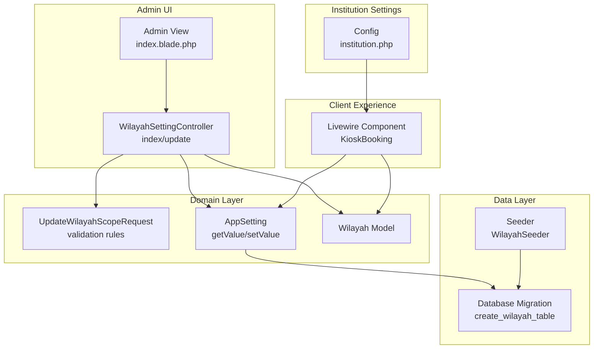
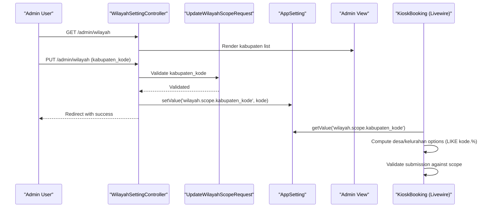
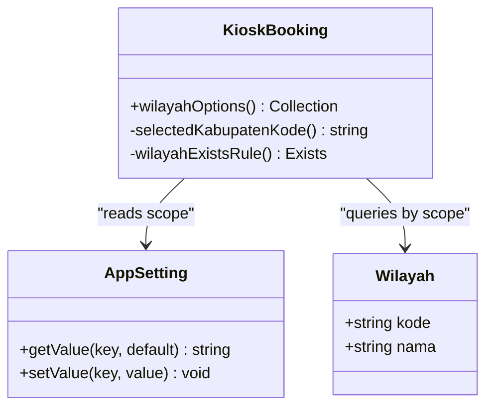
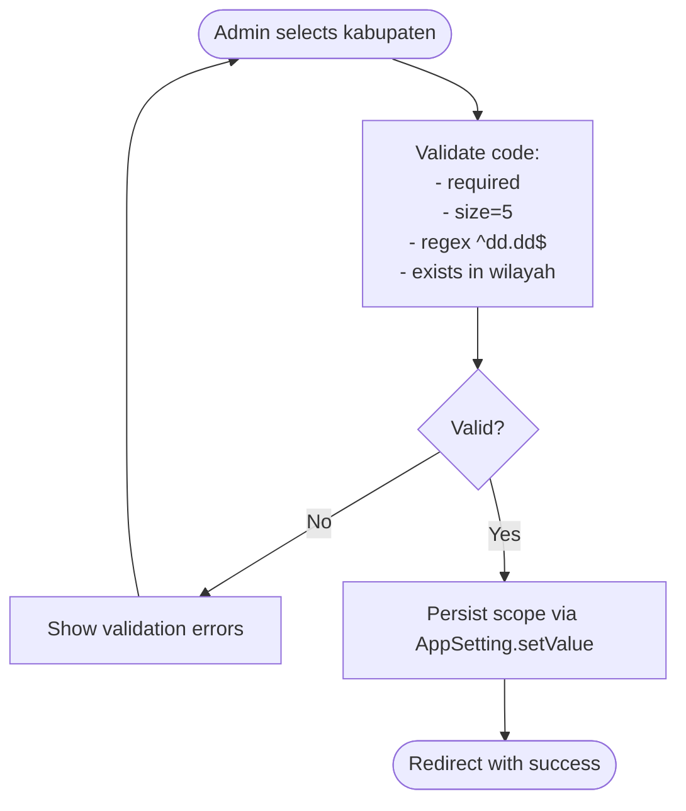
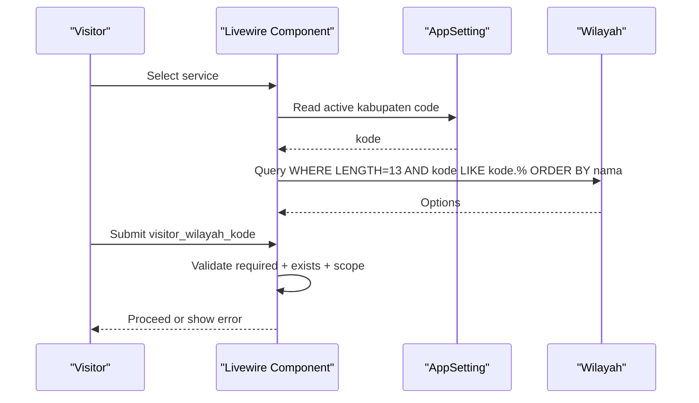
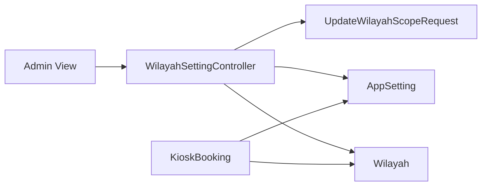

# Geographic Scope Configuration

<cite>
**Referenced Files in This Document**
- [Wilayah.php](file://app/Models/Wilayah.php)
- [AppSetting.php](file://app/Models/AppSetting.php)
- [2026_03_11_072249_create_wilayah_table.php](file://database/migrations/2026_03_11_072249_create_wilayah_table.php)
- [WilayahSeeder.php](file://database/seeders/WilayahSeeder.php)
- [WilayahSettingController.php](file://app/Http/Controllers/Admin/WilayahSettingController.php)
- [UpdateWilayahScopeRequest.php](file://app/Http/Requests/UpdateWilayahScopeRequest.php)
- [index.blade.php](file://resources/views/pages/admin/wilayah/index.blade.php)
- [KioskBooking.php](file://app/Livewire/KioskBooking.php)
- [institution.php](file://config/institution.php)
- [ManageWilayahSettingTest.php](file://tests/Feature/Admin/ManageWilayahSettingTest.php)
- [KioskBookingTest.php](file://tests/Feature/Kiosk/KioskBookingTest.php)
</cite>

## Table of Contents
1. [Introduction](#introduction)
2. [Project Structure](#project-structure)
3. [Core Components](#core-components)
4. [Architecture Overview](#architecture-overview)
5. [Detailed Component Analysis](#detailed-component-analysis)
6. [Dependency Analysis](#dependency-analysis)
7. [Performance Considerations](#performance-considerations)
8. [Troubleshooting Guide](#troubleshooting-guide)
9. [Conclusion](#conclusion)

## Introduction
This document explains the Geographic Scope Configuration system that governs how PTSP services are scoped to specific administrative areas. It covers:
- Establishment of geographic hierarchy and boundary definitions
- Administrative unit assignments and validation
- Institutional settings and their relationship to geographic scope
- How geographic scope affects service availability, user access, and reporting zones
- Geographic data import/export capabilities and visualization features

The system centers around a compact geographic model with a five-part numeric code representing province, city, and district levels, and uses a single configurable “active kabupaten” scope to constrain downstream selections in kiosks and reporting.

## Project Structure
The Geographic Scope Configuration spans models, migrations, controllers, requests, Livewire components, configuration, and tests. The key files are organized as follows:
- Data model and migration define the geographic table and indexing
- Seeder loads initial geographic data from SQL
- Controller and request handle admin configuration updates
- Livewire component enforces scope during kiosk booking
- Institution configuration provides organizational context
- Tests validate behavior and access controls

**Diagram sources**
- [WilayahSettingController.php:15-52](file://app/Http/Controllers/Admin/WilayahSettingController.php#L15-L52)
- [UpdateWilayahScopeRequest.php:23-33](file://app/Http/Requests/UpdateWilayahScopeRequest.php#L23-L33)
- [AppSetting.php:15-32](file://app/Models/AppSetting.php#L15-L32)
- [Wilayah.php:7-23](file://app/Models/Wilayah.php#L7-L23)
- [2026_03_11_072249_create_wilayah_table.php:14-19](file://database/migrations/2026_03_11_072249_create_wilayah_table.php#L14-L19)
- [WilayahSeeder.php:14-31](file://database/seeders/WilayahSeeder.php#L14-L31)
- [index.blade.php:15-42](file://resources/views/pages/admin/wilayah/index.blade.php#L15-L42)
- [KioskBooking.php:74-87](file://app/Livewire/KioskBooking.php#L74-L87)
- [institution.php:3-9](file://config/institution.php#L3-L9)

**Section sources**
- [Wilayah.php:7-23](file://app/Models/Wilayah.php#L7-L23)
- [2026_03_11_072249_create_wilayah_table.php:14-19](file://database/migrations/2026_03_11_072249_create_wilayah_table.php#L14-L19)
- [WilayahSeeder.php:14-31](file://database/seeders/WilayahSeeder.php#L14-L31)
- [WilayahSettingController.php:15-52](file://app/Http/Controllers/Admin/WilayahSettingController.php#L15-L52)
- [UpdateWilayahScopeRequest.php:23-33](file://app/Http/Requests/UpdateWilayahScopeRequest.php#L23-L33)
- [index.blade.php:15-42](file://resources/views/pages/admin/wilayah/index.blade.php#L15-L42)
- [KioskBooking.php:74-87](file://app/Livewire/KioskBooking.php#L74-L87)
- [institution.php:3-9](file://config/institution.php#L3-L9)

## Core Components
- Geographic model and table
  - The geographic table stores administrative units with a primary key of a five-part numeric code and a name field. Indexing supports efficient lookups by name.
  - The model defines a string primary key and disables auto-incrementing behavior.

- AppSetting for scope persistence
  - Stores the active kabupaten code under a dedicated key. Retrieval is cached for performance; writes invalidate the cache to keep reads fresh.

- Admin controller and request
  - The controller lists kabupaten-level units, supports search by name or code, and paginates results. It also persists the selected kabupaten code via the request validator.
  - The request validates that the chosen code exists in the geographic table, matches the required format, and is exactly five characters long.

- Kiosk booking Livewire component
  - Computes selectable desa/kelurahan options filtered by the active kabupaten scope.
  - Validates that submitted desa/kelurahan codes belong to the active kabupaten and are exactly thirteen characters long.

- Institution configuration
  - Provides organizational branding and operational details (name, address, phone, operating hours) used across public-facing pages.

**Section sources**
- [Wilayah.php:7-23](file://app/Models/Wilayah.php#L7-L23)
- [2026_03_11_072249_create_wilayah_table.php:14-19](file://database/migrations/2026_03_11_072249_create_wilayah_table.php#L14-L19)
- [AppSetting.php:15-32](file://app/Models/AppSetting.php#L15-L32)
- [WilayahSettingController.php:15-52](file://app/Http/Controllers/Admin/WilayahSettingController.php#L15-L52)
- [UpdateWilayahScopeRequest.php:23-33](file://app/Http/Requests/UpdateWilayahScopeRequest.php#L23-L33)
- [KioskBooking.php:74-87](file://app/Livewire/KioskBooking.php#L74-L87)
- [institution.php:3-9](file://config/institution.php#L3-L9)

## Architecture Overview
The Geographic Scope Configuration architecture connects admin configuration, geographic data, and client experiences:

**Diagram sources**
- [WilayahSettingController.php:15-52](file://app/Http/Controllers/Admin/WilayahSettingController.php#L15-L52)
- [UpdateWilayahScopeRequest.php:23-33](file://app/Http/Requests/UpdateWilayahScopeRequest.php#L23-L33)
- [AppSetting.php:24-32](file://app/Models/AppSetting.php#L24-L32)
- [index.blade.php:72-101](file://resources/views/pages/admin/wilayah/index.blade.php#L72-L101)
- [KioskBooking.php:74-87](file://app/Livewire/KioskBooking.php#L74-L87)

## Detailed Component Analysis

### Geographic Model and Table
- Design
  - Single table with a composite code representing hierarchical administrative units.
  - Primary key is a string code; no auto-incrementing ID.
  - Name indexed for fast filtering and search.

- Implications
  - Efficient queries for kabupaten-level listings and desa/kelurahan scoping.
  - Clear separation between administrative boundaries and service logic.

**Diagram sources**
- [Wilayah.php:7-23](file://app/Models/Wilayah.php#L7-L23)
- [AppSetting.php:15-32](file://app/Models/AppSetting.php#L15-L32)
- [KioskBooking.php:74-87](file://app/Livewire/KioskBooking.php#L74-L87)

**Section sources**
- [Wilayah.php:7-23](file://app/Models/Wilayah.php#L7-L23)
- [2026_03_11_072249_create_wilayah_table.php:14-19](file://database/migrations/2026_03_11_072249_create_wilayah_table.php#L14-L19)

### Admin Configuration Workflow
- Listing and selection
  - Admins browse kabupaten units, optionally filtered by name or code.
  - The current active scope is highlighted and can be changed via a simple form.

- Validation and persistence
  - The request enforces:
    - Presence of the code
    - Exact length of five characters
    - Format matching a two-dot-two numeric pattern
    - Existence in the geographic table
  - On success, the active kabupaten code is stored in settings.

**Diagram sources**
- [WilayahSettingController.php:44-52](file://app/Http/Controllers/Admin/WilayahSettingController.php#L44-L52)
- [UpdateWilayahScopeRequest.php:23-33](file://app/Http/Requests/UpdateWilayahScopeRequest.php#L23-L33)
- [index.blade.php:72-101](file://resources/views/pages/admin/wilayah/index.blade.php#L72-L101)

**Section sources**
- [WilayahSettingController.php:15-52](file://app/Http/Controllers/Admin/WilayahSettingController.php#L15-L52)
- [UpdateWilayahScopeRequest.php:23-33](file://app/Http/Requests/UpdateWilayahScopeRequest.php#L23-L33)
- [index.blade.php:15-42](file://resources/views/pages/admin/wilayah/index.blade.php#L15-L42)

### Kiosk Booking and Geographic Scope Enforcement
- Scope-driven option generation
  - Desa/kelurahan options are computed by selecting units whose codes:
    - Are exactly thirteen characters long
    - Start with the active kabupaten code
    - Are ordered by name

- Submission validation
  - The desa/kelurahan code is validated to:
    - Be required
    - Exist in the geographic table
    - Match the length and scope constraints

- User feedback
  - If no options are available, the kiosk displays a warning prompting admins to configure the active kabupaten.

**Diagram sources**
- [KioskBooking.php:74-87](file://app/Livewire/KioskBooking.php#L74-L87)
- [KioskBooking.php:126-142](file://app/Livewire/KioskBooking.php#L126-L142)
- [KioskBooking.php:269-286](file://app/Livewire/KioskBooking.php#L269-L286)

**Section sources**
- [KioskBooking.php:74-87](file://app/Livewire/KioskBooking.php#L74-L87)
- [KioskBooking.php:126-142](file://app/Livewire/KioskBooking.php#L126-L142)
- [KioskBooking.php:269-286](file://app/Livewire/KioskBooking.php#L269-L286)

### Geographic Data Import/Export and Visualization
- Import
  - The seeder checks for a SQL file containing INSERT statements and executes them to populate the geographic table, but only if the table is empty. This enables bulk loading of administrative boundaries.

- Export
  - There is no explicit export mechanism in the current codebase. To export geographic data, administrators would need to use external database tools or scripts to dump the wilayah table.

- Visualization
  - The admin interface lists kabupaten units with search and pagination.
  - The kiosk interface displays desa/kelurahan options filtered by scope.
  - No in-app map rendering or boundary visualization is present.

**Section sources**
- [WilayahSeeder.php:14-31](file://database/seeders/WilayahSeeder.php#L14-L31)
- [index.blade.php:64-118](file://resources/views/pages/admin/wilayah/index.blade.php#L64-L118)
- [KioskBooking.php:74-87](file://app/Livewire/KioskBooking.php#L74-L87)

### Institutional Settings Management
- Configuration
  - Institution name, address, phone, operating hours, and logo path are configured via environment-backed config.
- Relationship to geographic scope
  - While not directly bound to scope, institution settings appear on public pages and inform visitors about operational context. Geographic scope indirectly influences which services are offered and where visitors originate.

**Section sources**
- [institution.php:3-9](file://config/institution.php#L3-L9)

## Dependency Analysis
- Coupling and cohesion
  - The kiosk component depends on AppSetting for scope and Wilayah for options, maintaining low coupling to domain logic.
  - The controller depends on the request validator and AppSetting, keeping presentation and validation cohesive.

- External dependencies
  - Database schema and seeder for geographic data.
  - Livewire runtime for reactive UI behavior.

- Potential circular dependencies
  - None observed among the analyzed components.

**Diagram sources**
- [WilayahSettingController.php:15-52](file://app/Http/Controllers/Admin/WilayahSettingController.php#L15-L52)
- [UpdateWilayahScopeRequest.php:23-33](file://app/Http/Requests/UpdateWilayahScopeRequest.php#L23-L33)
- [AppSetting.php:15-32](file://app/Models/AppSetting.php#L15-L32)
- [Wilayah.php:7-23](file://app/Models/Wilayah.php#L7-L23)
- [index.blade.php:15-42](file://resources/views/pages/admin/wilayah/index.blade.php#L15-L42)
- [KioskBooking.php:74-87](file://app/Livewire/KioskBooking.php#L74-L87)

**Section sources**
- [WilayahSettingController.php:15-52](file://app/Http/Controllers/Admin/WilayahSettingController.php#L15-L52)
- [KioskBooking.php:74-87](file://app/Livewire/KioskBooking.php#L74-L87)

## Performance Considerations
- Caching
  - AppSetting.getValue caches resolved values forever until manually invalidated after a write. This reduces database hits for scope reads.
- Indexing
  - The geographic table includes an index on the name column, aiding search and listing performance.
- Query patterns
  - Kabupaten listing uses a fixed-length filter and optional LIKE search; desa/kelurahan queries use a prefix match and length constraint, both benefiting from appropriate indexing.

Recommendations
- Add an index on the code column for faster exact lookups and scope enforcement.
- Consider caching the computed desa/kelurahan options in Livewire for repeated steps to reduce database queries.

**Section sources**
- [AppSetting.php:15-32](file://app/Models/AppSetting.php#L15-L32)
- [2026_03_11_072249_create_wilayah_table.php:18-18](file://database/migrations/2026_03_11_072249_create_wilayah_table.php#L18-L18)
- [KioskBooking.php:74-87](file://app/Livewire/KioskBooking.php#L74-L87)

## Troubleshooting Guide
Common issues and resolutions
- No desa/kelurahan options in kiosk
  - Cause: Active kabupaten scope not set.
  - Resolution: Admin must select a kabupaten via the admin panel.

- Validation errors when submitting a desa/kelurahan
  - Cause: Code does not match scope or does not exist.
  - Resolution: Ensure the desa/kelurahan code starts with the active kabupaten code and is exactly thirteen characters long.

- Access denied to admin routes
  - Cause: Non-admin user attempts to access admin routes.
  - Resolution: Confirm user role and permissions.

- Geographic data missing
  - Cause: Seeding did not run or SQL file not found.
  - Resolution: Verify the presence of the SQL file and run the seeder.

**Section sources**
- [index.blade.php:72-101](file://resources/views/pages/admin/wilayah/index.blade.php#L72-L101)
- [KioskBooking.php:126-142](file://app/Livewire/KioskBooking.php#L126-L142)
- [ManageWilayahSettingTest.php:47-57](file://tests/Feature/Admin/ManageWilayahSettingTest.php#L47-L57)
- [KioskBookingTest.php:133-149](file://tests/Feature/Kiosk/KioskBookingTest.php#L133-L149)
- [WilayahSeeder.php:14-31](file://database/seeders/WilayahSeeder.php#L14-L31)

## Conclusion
The Geographic Scope Configuration system provides a clean, efficient way to limit service availability and user selections to a defined administrative area. By centralizing the active kabupaten scope in AppSetting and enforcing it across kiosk submissions, the system ensures consistent behavior for both public-facing services and internal administration. Extending the system with export capabilities, boundary visualization, and richer administrative reporting would further enhance its utility for PTSP operations.