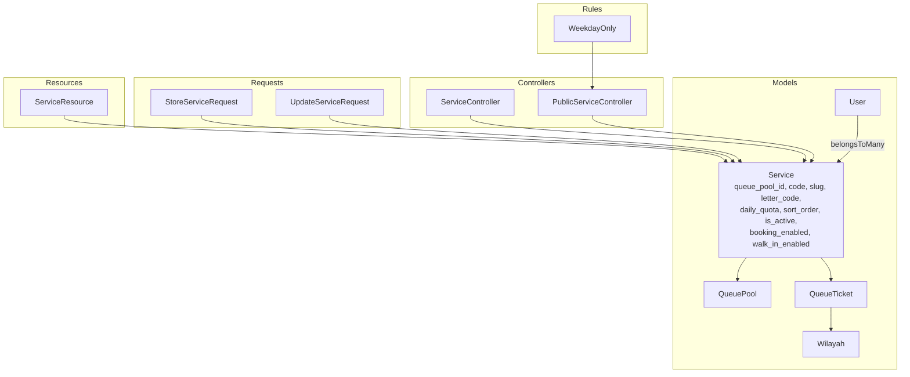
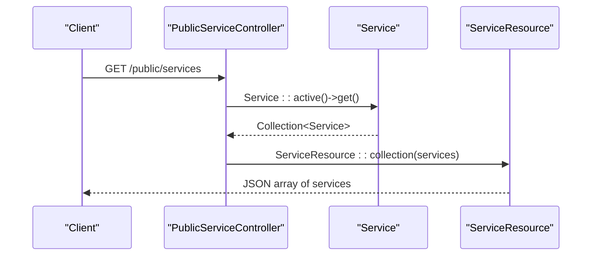
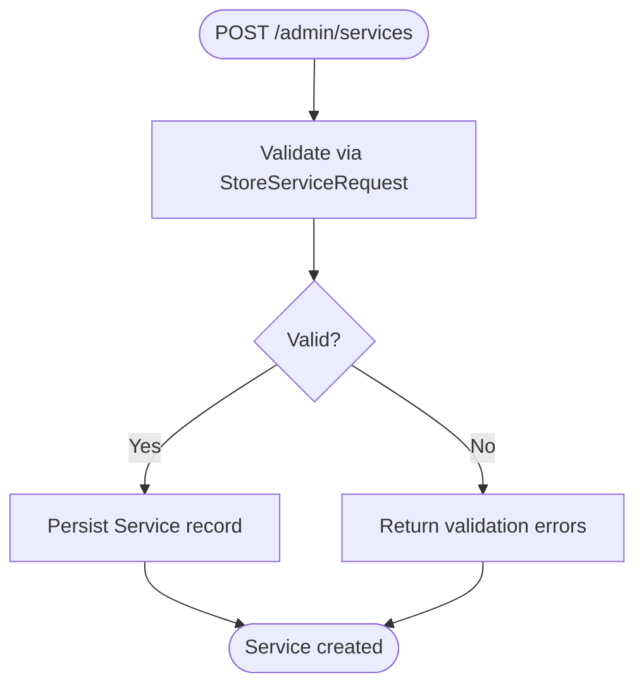
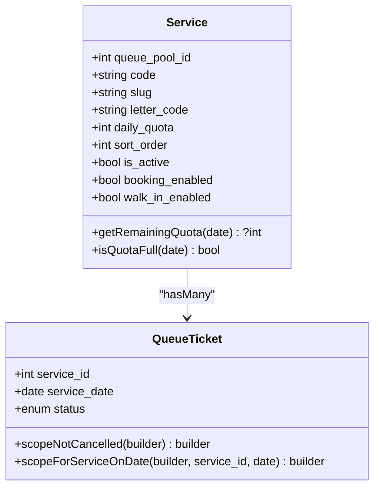
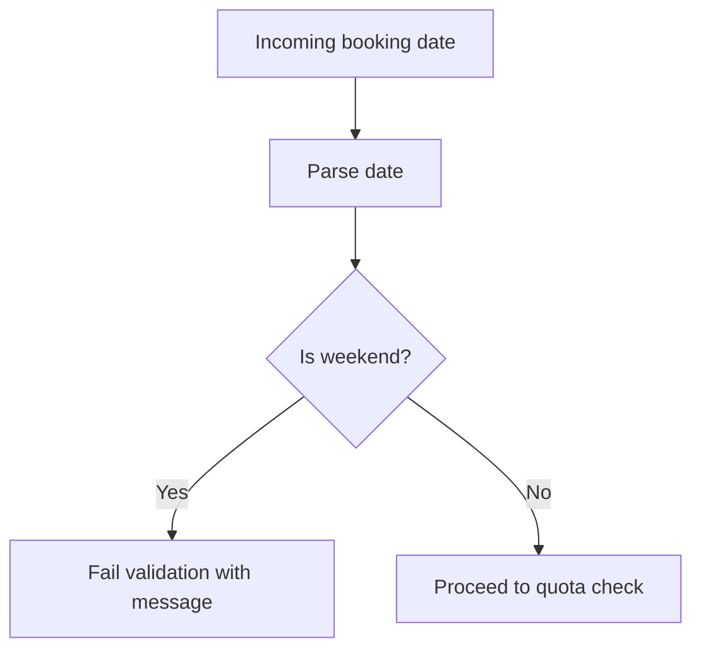
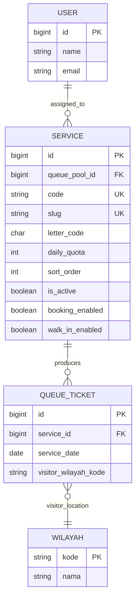
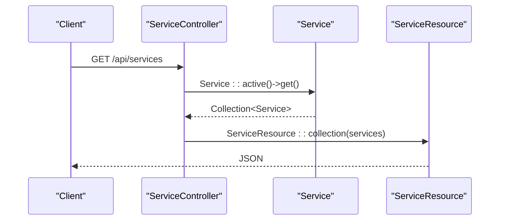
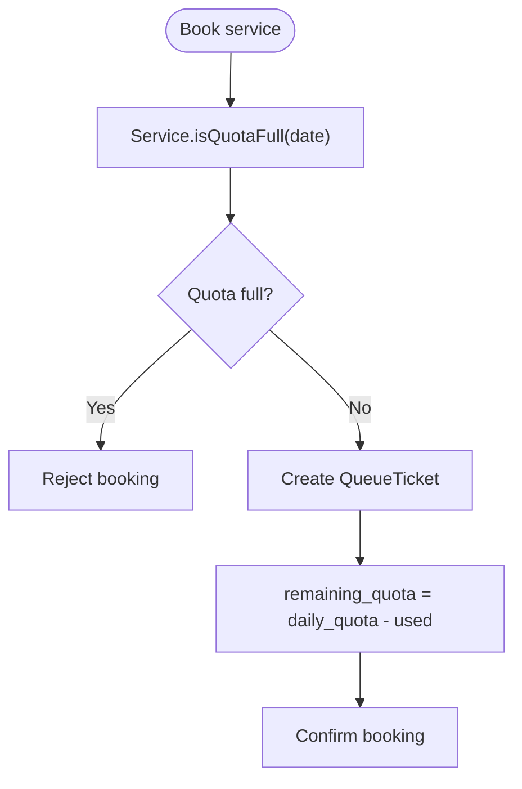
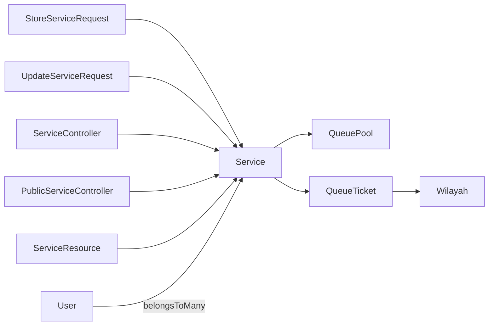

# Service Management

<cite>
**Referenced Files in This Document**
- [Service.php](file://app/Models/Service.php)
- [ServiceController.php](file://app/Http/Controllers/Api/ServiceController.php)
- [PublicServiceController.php](file://app/Http/Controllers/Api/PublicServiceController.php)
- [ServiceResource.php](file://app/Http/Resources/ServiceResource.php)
- [StoreServiceRequest.php](file://app/Http/Requests/StoreServiceRequest.php)
- [UpdateServiceRequest.php](file://app/Http/Requests/UpdateServiceRequest.php)
- [create_services_table.php](file://database/migrations/2026_03_06_015235_create_services_table.php)
- [add_letter_code_to_services_table.php](file://database/migrations/2026_03_07_075319_add_letter_code_to_services_table.php)
- [WeekdayOnly.php](file://app/Rules/WeekdayOnly.php)
- [QueueTicket.php](file://app/Models/QueueTicket.php)
- [QueuePool.php](file://app/Models/QueuePool.php)
- [User.php](file://app/Models/User.php)
- [Wilayah.php](file://app/Models/Wilayah.php)
- [2026_03_11_072249_create_wilayah_table.php](file://database/migrations/2026_03_11_072249_create_wilayah_table.php)
</cite>

## Table of Contents
1. [Introduction](#introduction)
2. [Project Structure](#project-structure)
3. [Core Components](#core-components)
4. [Architecture Overview](#architecture-overview)
5. [Detailed Component Analysis](#detailed-component-analysis)
6. [Dependency Analysis](#dependency-analysis)
7. [Performance Considerations](#performance-considerations)
8. [Troubleshooting Guide](#troubleshooting-guide)
9. [Conclusion](#conclusion)

## Introduction
This document describes the Service Management system within the PTSP queue management application. It covers service catalog administration (creation, modification, deletion), service properties (capacity limits, scheduling constraints, weekday-only restrictions, letter code assignments), validation and business rules enforcement, service assignment to users, geographic scope configurations, listing/search/filter capabilities, and capacity management including peak handling and quota enforcement.

## Project Structure
The Service Management system spans models, requests, controllers, resources, migrations, and validation rules. The primary domain model is Service, which belongs to a QueuePool, produces QueueTickets, and can be assigned to Users. Supporting components include form requests for validation, controllers for API endpoints, resources for serialization, and migrations for schema evolution.

**Diagram sources**
- [Service.php:12-101](file://app/Models/Service.php#L12-L101)
- [QueuePool.php:9-43](file://app/Models/QueuePool.php#L9-L43)
- [QueueTicket.php:12-121](file://app/Models/QueueTicket.php#L12-L121)
- [User.php:14-99](file://app/Models/User.php#L14-L99)
- [Wilayah.php:7-24](file://app/Models/Wilayah.php#L7-L24)
- [ServiceController.php:9-33](file://app/Http/Controllers/Api/ServiceController.php#L9-L33)
- [PublicServiceController.php:11-42](file://app/Http/Controllers/Api/PublicServiceController.php#L11-L42)
- [ServiceResource.php:8-25](file://app/Http/Resources/ServiceResource.php#L8-L25)
- [StoreServiceRequest.php:8-44](file://app/Http/Requests/StoreServiceRequest.php#L8-L44)
- [UpdateServiceRequest.php:8-60](file://app/Http/Requests/UpdateServiceRequest.php#L8-L60)
- [WeekdayOnly.php:9-33](file://app/Rules/WeekdayOnly.php#L9-L33)

**Section sources**
- [Service.php:12-101](file://app/Models/Service.php#L12-L101)
- [ServiceController.php:9-33](file://app/Http/Controllers/Api/ServiceController.php#L9-L33)
- [PublicServiceController.php:11-42](file://app/Http/Controllers/Api/PublicServiceController.php#L11-L42)
- [ServiceResource.php:8-25](file://app/Http/Resources/ServiceResource.php#L8-L25)
- [StoreServiceRequest.php:8-44](file://app/Http/Requests/StoreServiceRequest.php#L8-L44)
- [UpdateServiceRequest.php:8-60](file://app/Http/Requests/UpdateServiceRequest.php#L8-L60)
- [create_services_table.php:7-41](file://database/migrations/2026_03_06_015235_create_services_table.php#L7-L41)
- [add_letter_code_to_services_table.php:7-29](file://database/migrations/2026_03_07_075319_add_letter_code_to_services_table.php#L7-L29)
- [WeekdayOnly.php:9-33](file://app/Rules/WeekdayOnly.php#L9-L33)
- [QueueTicket.php:12-121](file://app/Models/QueueTicket.php#L12-L121)
- [QueuePool.php:9-43](file://app/Models/QueuePool.php#L9-L43)
- [User.php:14-99](file://app/Models/User.php#L14-L99)
- [Wilayah.php:7-24](file://app/Models/Wilayah.php#L7-L24)

## Core Components
- Service model: central entity representing a queueable service with properties for availability, quotas, ordering, and optional letter code. Provides scopes and helpers for remaining quota calculation and quota-full checks.
- QueuePool: grouping of services and counters; services belong to a queue pool.
- QueueTicket: records of individual visits per service/date/channel; connects services to visitors and geographic scope via wilayah code.
- User: officers who can be assigned to services via a many-to-many relationship.
- Wilayah: geographic administrative unit used to scope visitor location.
- Controllers: API endpoints for listing and retrieving services (both internal and public).
- Requests: validation rules for creating/updating services and enforcing weekday-only constraints for bookings.
- Resource: standardized JSON representation of services, including computed remaining quota.

Key responsibilities:
- Service catalog administration: create, update, delete services via validated requests.
- Capacity management: enforce daily quotas per service and compute remaining capacity.
- Listing and search: active services listing, slug-based lookup, and public institution metadata.
- Geographic scope: visitor wilayah linkage through QueueTicket.
- Business rules: weekday-only booking restriction via custom validation rule.

**Section sources**
- [Service.php:12-101](file://app/Models/Service.php#L12-L101)
- [QueuePool.php:9-43](file://app/Models/QueuePool.php#L9-L43)
- [QueueTicket.php:12-121](file://app/Models/QueueTicket.php#L12-L121)
- [User.php:93-99](file://app/Models/User.php#L93-L99)
- [Wilayah.php:7-24](file://app/Models/Wilayah.php#L7-L24)
- [ServiceController.php:9-33](file://app/Http/Controllers/Api/ServiceController.php#L9-L33)
- [PublicServiceController.php:11-42](file://app/Http/Controllers/Api/PublicServiceController.php#L11-L42)
- [ServiceResource.php:8-25](file://app/Http/Resources/ServiceResource.php#L8-L25)
- [StoreServiceRequest.php:8-44](file://app/Http/Requests/StoreServiceRequest.php#L8-L44)
- [UpdateServiceRequest.php:8-60](file://app/Http/Requests/UpdateServiceRequest.php#L8-L60)
- [WeekdayOnly.php:9-33](file://app/Rules/WeekdayOnly.php#L9-L33)

## Architecture Overview
The Service Management subsystem follows a layered architecture:
- Presentation: API controllers expose endpoints for internal and public consumption.
- Application: controllers coordinate retrieval, validation, and resource transformation.
- Domain: models encapsulate business logic (quota computation, relations).
- Persistence: Eloquent models mapped to database tables via migrations.

**Diagram sources**
- [PublicServiceController.php:26-31](file://app/Http/Controllers/Api/PublicServiceController.php#L26-L31)
- [Service.php:62-67](file://app/Models/Service.php#L62-L67)
- [ServiceResource.php:10-23](file://app/Http/Resources/ServiceResource.php#L10-L23)

## Detailed Component Analysis

### Service Catalog Administration
- Creation: validated via StoreServiceRequest, ensuring queue pool existence, uniqueness of code and slug, and sensible defaults for booleans and integers.
- Modification: validated via UpdateServiceRequest, allowing partial updates with unique constraints adjusted for existing records.
- Deletion: not explicitly implemented in the analyzed controllers; deletion would typically cascade through foreign keys to dependent QueueTickets and associations.

**Diagram sources**
- [StoreServiceRequest.php:23-42](file://app/Http/Requests/StoreServiceRequest.php#L23-L42)
- [create_services_table.php:14-30](file://database/migrations/2026_03_06_015235_create_services_table.php#L14-L30)

**Section sources**
- [StoreServiceRequest.php:8-44](file://app/Http/Requests/StoreServiceRequest.php#L8-L44)
- [UpdateServiceRequest.php:8-60](file://app/Http/Requests/UpdateServiceRequest.php#L8-L60)
- [create_services_table.php:7-41](file://database/migrations/2026_03_06_015235_create_services_table.php#L7-L41)

### Service Properties and Constraints
- Capacity limits: daily_quota stored on Service; remaining quota computed by counting non-cancelled tickets for the target date.
- Scheduling constraints: booking_enabled and walk_in_enabled flags control channel availability.
- Weekday-only restrictions: custom validation rule rejects weekend dates for bookings.
- Letter code assignments: letter_code column supports categorization and display.

**Diagram sources**
- [Service.php:17-41](file://app/Models/Service.php#L17-L41)
- [Service.php:73-99](file://app/Models/Service.php#L73-L99)
- [QueueTicket.php:99-111](file://app/Models/QueueTicket.php#L99-L111)

**Section sources**
- [Service.php:17-41](file://app/Models/Service.php#L17-L41)
- [Service.php:73-99](file://app/Models/Service.php#L73-L99)
- [QueueTicket.php:99-111](file://app/Models/QueueTicket.php#L99-L111)
- [add_letter_code_to_services_table.php:14-16](file://database/migrations/2026_03_07_075319_add_letter_code_to_services_table.php#L14-L16)
- [WeekdayOnly.php:16-31](file://app/Rules/WeekdayOnly.php#L16-L31)

### Service Request Validation and Business Rules
- StoreServiceRequest enforces:
  - queue_pool_id exists in active queue pools.
  - name, code, slug constraints.
  - boolean flags for activation and channel enablement.
  - daily_quota min 1 when present.
  - sort_order non-negative.
- UpdateServiceRequest enforces similar rules with optional presence and unique constraints adjusted for existing records.
- WeekdayOnly rule ensures visit dates fall on weekdays for booking scenarios.

**Diagram sources**
- [WeekdayOnly.php:16-31](file://app/Rules/WeekdayOnly.php#L16-L31)

**Section sources**
- [StoreServiceRequest.php:23-42](file://app/Http/Requests/StoreServiceRequest.php#L23-L42)
- [UpdateServiceRequest.php:23-58](file://app/Http/Requests/UpdateServiceRequest.php#L23-L58)
- [WeekdayOnly.php:9-33](file://app/Rules/WeekdayOnly.php#L9-L33)

### Service Assignment to Users and Geographic Scope
- User-service assignment: Many-to-many relationship via pivot table, enabling officers to handle specific services.
- Geographic scope: QueueTicket stores visitor_wilayah_kode linking to Wilayah table, enabling regional reporting and filtering.

**Diagram sources**
- [Service.php:48-57](file://app/Models/Service.php#L48-L57)
- [User.php:93-97](file://app/Models/User.php#L93-L97)
- [QueueTicket.php:29](file://app/Models/QueueTicket.php#L29)
- [Wilayah.php:19-22](file://app/Models/Wilayah.php#L19-L22)

**Section sources**
- [Service.php:48-57](file://app/Models/Service.php#L48-L57)
- [User.php:93-97](file://app/Models/User.php#L93-L97)
- [QueueTicket.php:29](file://app/Models/QueueTicket.php#L29)
- [Wilayah.php:19-22](file://app/Models/Wilayah.php#L19-L22)

### Service Listing Interface, Search, and Filtering
- Internal listing: ServiceController@index returns active services ordered by sort_order and name.
- Public listing: PublicServiceController@index mirrors active services for public consumption.
- Search and filter: Services are retrieved via active scope and slug-based lookup; additional filters can be added to controllers as needed.

**Diagram sources**
- [ServiceController.php:14-19](file://app/Http/Controllers/Api/ServiceController.php#L14-L19)
- [Service.php:62-67](file://app/Models/Service.php#L62-L67)
- [ServiceResource.php:10-23](file://app/Http/Resources/ServiceResource.php#L10-L23)

**Section sources**
- [ServiceController.php:14-19](file://app/Http/Controllers/Api/ServiceController.php#L14-L19)
- [PublicServiceController.php:26-31](file://app/Http/Controllers/Api/PublicServiceController.php#L26-L31)
- [Service.php:62-67](file://app/Models/Service.php#L62-L67)

### Capacity Management, Peak Hour Handling, and Quota Enforcement
- Daily quota enforcement: Service::isQuotaFull(date) determines if capacity is reached; Service::getRemainingQuota(date) computes available slots.
- Non-cancelled ticket counting: QueueTicket scopes exclude cancelled entries to reflect actual capacity usage.
- Peak handling: while not explicitly modeled, remaining quota can inform UI prompts and scheduling decisions; peak hours could be managed by adjusting daily_quota or introducing additional constraints in future iterations.

**Diagram sources**
- [Service.php:92-99](file://app/Models/Service.php#L92-L99)
- [Service.php:73-86](file://app/Models/Service.php#L73-L86)
- [QueueTicket.php:99-102](file://app/Models/QueueTicket.php#L99-L102)

**Section sources**
- [Service.php:73-99](file://app/Models/Service.php#L73-L99)
- [QueueTicket.php:99-111](file://app/Models/QueueTicket.php#L99-L111)

## Dependency Analysis
- Service depends on QueuePool (belongsTo), QueueTicket (hasMany), and User (belongsToMany).
- QueueTicket depends on Service, QueuePool, Counter, User (creator), and Wilayah.
- Controllers depend on Service and ServiceResource; PublicServiceController also reads institution configuration.
- Requests depend on Service and external queue pool existence checks.

**Diagram sources**
- [StoreServiceRequest.php:8-44](file://app/Http/Requests/StoreServiceRequest.php#L8-L44)
- [UpdateServiceRequest.php:8-60](file://app/Http/Requests/UpdateServiceRequest.php#L8-L60)
- [ServiceController.php:9-33](file://app/Http/Controllers/Api/ServiceController.php#L9-L33)
- [PublicServiceController.php:11-42](file://app/Http/Controllers/Api/PublicServiceController.php#L11-L42)
- [ServiceResource.php:8-25](file://app/Http/Resources/ServiceResource.php#L8-L25)
- [Service.php:43-57](file://app/Models/Service.php#L43-L57)
- [QueueTicket.php:54-72](file://app/Models/QueueTicket.php#L54-L72)
- [User.php:93-97](file://app/Models/User.php#L93-L97)
- [Wilayah.php:7-24](file://app/Models/Wilayah.php#L7-L24)

**Section sources**
- [Service.php:43-57](file://app/Models/Service.php#L43-L57)
- [QueueTicket.php:54-72](file://app/Models/QueueTicket.php#L54-L72)
- [User.php:93-97](file://app/Models/User.php#L93-L97)
- [Wilayah.php:7-24](file://app/Models/Wilayah.php#L7-L24)

## Performance Considerations
- Indexing: services table includes an index on (queue_pool_id, is_active) to optimize active service queries.
- Scopes: use of scopes (active, notCancelled, forServiceOnDate) reduces repeated query logic and improves readability.
- Computed fields: remaining_quota is computed on demand; caching or materialized views could reduce repeated counts under high load.
- Pagination: consider adding pagination to listing endpoints for large catalogs.

**Section sources**
- [create_services_table.php:29](file://database/migrations/2026_03_06_015235_create_services_table.php#L29)
- [Service.php:62-67](file://app/Models/Service.php#L62-L67)
- [QueueTicket.php:99-111](file://app/Models/QueueTicket.php#L99-L111)

## Troubleshooting Guide
- Validation failures during service creation/modification:
  - Verify queue_pool_id exists and is active.
  - Ensure code and slug are unique and within length limits.
  - Confirm daily_quota is null or >= 1.
- Quota exhaustion:
  - Check Service::isQuotaFull(date) and remaining_quota computation.
  - Confirm cancellation status does not count toward quota.
- Weekday-only constraint:
  - Ensure booking dates are weekdays; weekend dates will fail validation.
- Geographic scope issues:
  - Verify visitor_wilayah_kode matches Wilayah.kode.

**Section sources**
- [StoreServiceRequest.php:23-42](file://app/Http/Requests/StoreServiceRequest.php#L23-L42)
- [UpdateServiceRequest.php:23-58](file://app/Http/Requests/UpdateServiceRequest.php#L23-L58)
- [Service.php:73-99](file://app/Models/Service.php#L73-L99)
- [WeekdayOnly.php:16-31](file://app/Rules/WeekdayOnly.php#L16-L31)
- [Wilayah.php:19-22](file://app/Models/Wilayah.php#L19-L22)

## Conclusion
The Service Management system provides a robust foundation for managing services, enforcing capacity and scheduling constraints, and exposing curated service catalogs to internal and public consumers. The design leverages Eloquent models, validation requests, and resource serialization to maintain clean separation of concerns while supporting essential business rules like weekday-only bookings and daily quota enforcement.