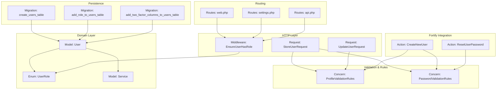
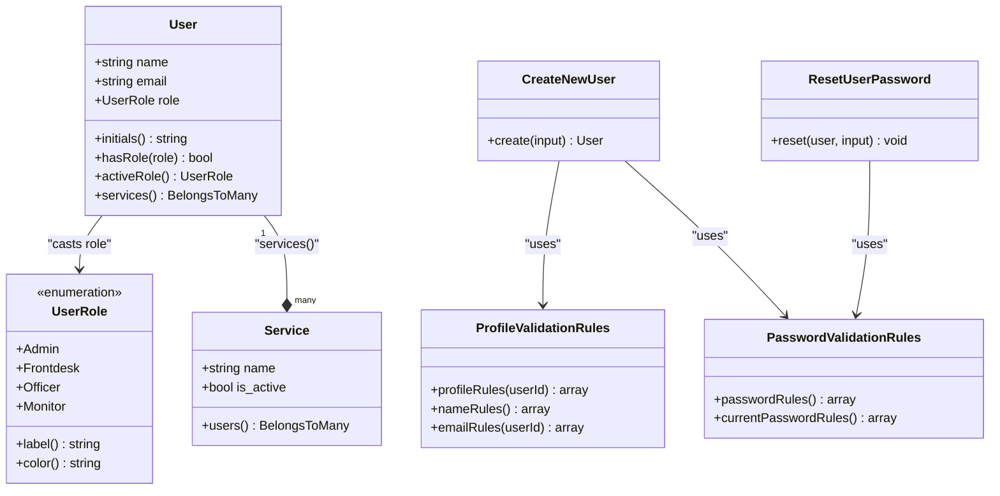
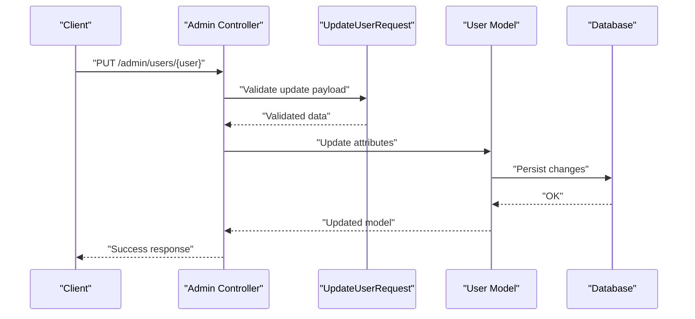
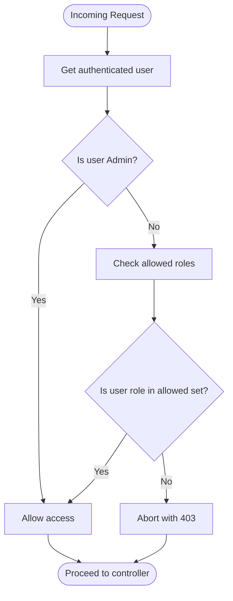
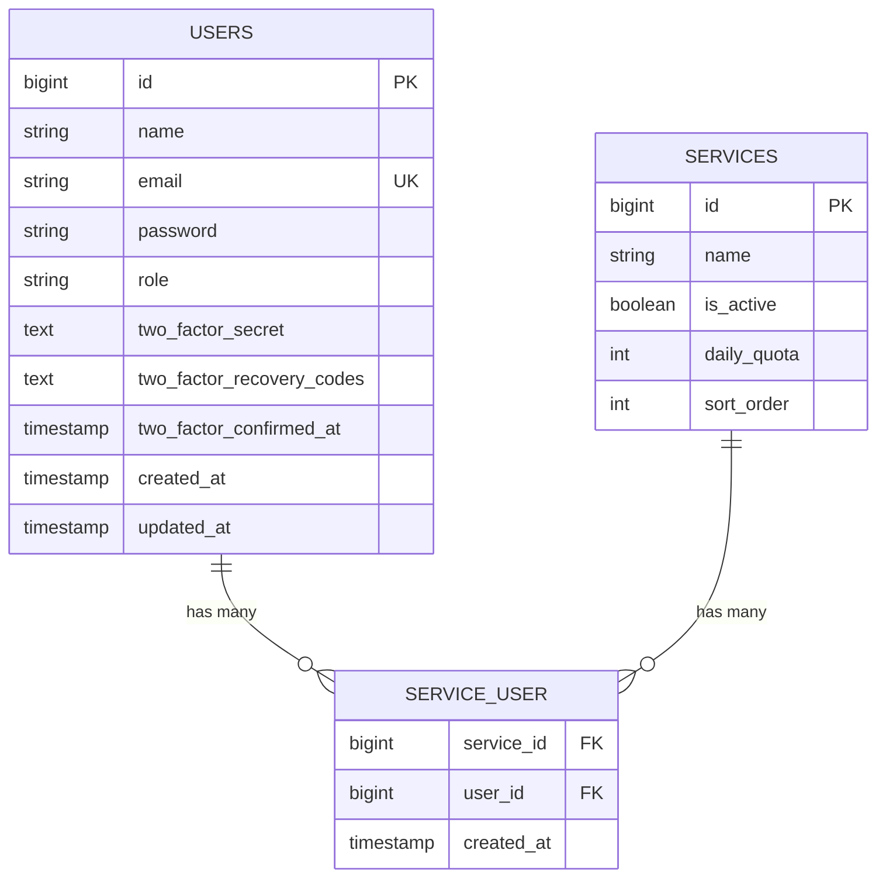
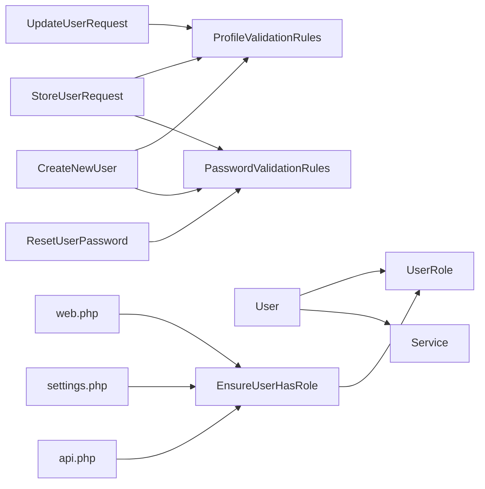

# User Management

<cite>
**Referenced Files in This Document**
- [User.php](file://app/Models/User.php)
- [UserRole.php](file://app/Enums/UserRole.php)
- [StoreUserRequest.php](file://app/Http/Requests/StoreUserRequest.php)
- [UpdateUserRequest.php](file://app/Http/Requests/UpdateUserRequest.php)
- [EnsureUserHasRole.php](file://app/Http/Middleware/EnsureUserHasRole.php)
- [CreateNewUser.php](file://app/Actions/Fortify/CreateNewUser.php)
- [ResetUserPassword.php](file://app/Actions/Fortify/ResetUserPassword.php)
- [PasswordValidationRules.php](file://app/Concerns/PasswordValidationRules.php)
- [ProfileValidationRules.php](file://app/Concerns/ProfileValidationRules.php)
- [create_users_table.php](file://database/migrations/0001_01_01_000000_create_users_table.php)
- [add_role_to_users_table.php](file://database/migrations/2026_03_06_024605_add_role_to_users_table.php)
- [add_two_factor_columns_to_users_table.php](file://database/migrations/2025_08_14_170933_add_two_factor_columns_to_users_table.php)
- [Service.php](file://app/Models/Service.php)
- [web.php](file://routes/web.php)
- [settings.php](file://routes/settings.php)
- [api.php](file://routes/api.php)
</cite>

## Table of Contents
1. [Introduction](#introduction)
2. [Project Structure](#project-structure)
3. [Core Components](#core-components)
4. [Architecture Overview](#architecture-overview)
5. [Detailed Component Analysis](#detailed-component-analysis)
6. [Dependency Analysis](#dependency-analysis)
7. [Performance Considerations](#performance-considerations)
8. [Troubleshooting Guide](#troubleshooting-guide)
9. [Conclusion](#conclusion)
10. [Appendices](#appendices)

## Introduction
This document describes the User Management system implemented in the application. It covers user lifecycle operations (creation, modification, deletion), role-based access control (RBAC), profile and authentication settings, two-factor authentication (2FA), user-service relationships, middleware enforcement, and supporting infrastructure such as validation rules, migrations, and Fortify actions. It also outlines search and filtering capabilities, bulk operations, audit trail, provisioning workflows, and integration points with external identity systems.

## Project Structure
The User Management system spans models, enums, requests, middleware, actions, concerns, migrations, and routes. The following diagram shows how these pieces fit together:

**Diagram sources**
- [User.php:14-98](file://app/Models/User.php#L14-L98)
- [UserRole.php:5-31](file://app/Enums/UserRole.php#L5-L31)
- [StoreUserRequest.php:24-37](file://app/Http/Requests/StoreUserRequest.php#L24-L37)
- [UpdateUserRequest.php:24-42](file://app/Http/Requests/UpdateUserRequest.php#L24-L42)
- [EnsureUserHasRole.php:16-35](file://app/Http/Middleware/EnsureUserHasRole.php#L16-L35)
- [CreateNewUser.php:20-32](file://app/Actions/Fortify/CreateNewUser.php#L20-L32)
- [ResetUserPassword.php:19-28](file://app/Actions/Fortify/ResetUserPassword.php#L19-L28)
- [ProfileValidationRules.php:15-49](file://app/Concerns/ProfileValidationRules.php#L15-L49)
- [PasswordValidationRules.php:15-28](file://app/Concerns/PasswordValidationRules.php#L15-L28)
- [create_users_table.php:14-22](file://database/migrations/0001_01_01_000000_create_users_table.php#L14-L22)
- [add_role_to_users_table.php:14-16](file://database/migrations/2026_03_06_024605_add_role_to_users_table.php#L14-L16)
- [add_two_factor_columns_to_users_table.php:14-18](file://database/migrations/2025_08_14_170933_add_two_factor_columns_to_users_table.php#L14-L18)
- [Service.php:53-57](file://app/Models/Service.php#L53-L57)
- [web.php](file://routes/web.php)
- [settings.php](file://routes/settings.php)
- [api.php](file://routes/api.php)

**Section sources**
- [User.php:14-98](file://app/Models/User.php#L14-L98)
- [UserRole.php:5-31](file://app/Enums/UserRole.php#L5-L31)
- [StoreUserRequest.php:24-37](file://app/Http/Requests/StoreUserRequest.php#L24-L37)
- [UpdateUserRequest.php:24-42](file://app/Http/Requests/UpdateUserRequest.php#L24-L42)
- [EnsureUserHasRole.php:16-35](file://app/Http/Middleware/EnsureUserHasRole.php#L16-L35)
- [CreateNewUser.php:20-32](file://app/Actions/Fortify/CreateNewUser.php#L20-L32)
- [ResetUserPassword.php:19-28](file://app/Actions/Fortify/ResetUserPassword.php#L19-L28)
- [ProfileValidationRules.php:15-49](file://app/Concerns/ProfileValidationRules.php#L15-L49)
- [PasswordValidationRules.php:15-28](file://app/Concerns/PasswordValidationRules.php#L15-L28)
- [create_users_table.php:14-22](file://database/migrations/0001_01_01_000000_create_users_table.php#L14-L22)
- [add_role_to_users_table.php:14-16](file://database/migrations/2026_03_06_024605_add_role_to_users_table.php#L14-L16)
- [add_two_factor_columns_to_users_table.php:14-18](file://database/migrations/2025_08_14_170933_add_two_factor_columns_to_users_table.php#L14-L18)
- [Service.php:53-57](file://app/Models/Service.php#L53-L57)
- [web.php](file://routes/web.php)
- [settings.php](file://routes/settings.php)
- [api.php](file://routes/api.php)

## Core Components
- User model: central entity with role casting, 2FA support, and a many-to-many relationship with services.
- UserRole enum: defines roles and provides label/color helpers.
- Validation concerns: shared rules for profile and password validation.
- Fortify actions: user creation and password reset implementations.
- HTTP requests: validation contracts for creating and updating users.
- Middleware: enforces role-based access control.
- Migrations: define the users table, role column, and 2FA columns.

Key responsibilities:
- User lifecycle: creation via Fortify, updates via requests, deletion handled by application flows.
- RBAC: role checks and admin override via active role switching.
- Authentication: password hashing, 2FA secret/recovery/confimation.
- User-service relationships: officers can be scoped to services; filters for active services.
- Routing: middleware applied across web, settings, and API routes.

**Section sources**
- [User.php:14-98](file://app/Models/User.php#L14-L98)
- [UserRole.php:5-31](file://app/Enums/UserRole.php#L5-L31)
- [ProfileValidationRules.php:15-49](file://app/Concerns/ProfileValidationRules.php#L15-L49)
- [PasswordValidationRules.php:15-28](file://app/Concerns/PasswordValidationRules.php#L15-L28)
- [CreateNewUser.php:20-32](file://app/Actions/Fortify/CreateNewUser.php#L20-L32)
- [ResetUserPassword.php:19-28](file://app/Actions/Fortify/ResetUserPassword.php#L19-L28)
- [StoreUserRequest.php:24-37](file://app/Http/Requests/StoreUserRequest.php#L24-L37)
- [UpdateUserRequest.php:24-42](file://app/Http/Requests/UpdateUserRequest.php#L24-L42)
- [EnsureUserHasRole.php:16-35](file://app/Http/Middleware/EnsureUserHasRole.php#L16-L35)
- [create_users_table.php:14-22](file://database/migrations/0001_01_01_000000_create_users_table.php#L14-L22)
- [add_role_to_users_table.php:14-16](file://database/migrations/2026_03_06_024605_add_role_to_users_table.php#L14-L16)
- [add_two_factor_columns_to_users_table.php:14-18](file://database/migrations/2025_08_14_170933_add_two_factor_columns_to_users_table.php#L14-L18)

## Architecture Overview
The system follows a layered architecture:
- Domain: User and Service models with relationships and scopes.
- Validation: Reusable concerns for consistent rules.
- Application: Fortify actions for user creation/reset.
- HTTP: Requests for validation, middleware for RBAC, routes for exposure.
- Persistence: Migrations define schema including role and 2FA fields.

**Diagram sources**
- [User.php:14-98](file://app/Models/User.php#L14-L98)
- [UserRole.php:5-31](file://app/Enums/UserRole.php#L5-L31)
- [Service.php:53-57](file://app/Models/Service.php#L53-L57)
- [ProfileValidationRules.php:15-49](file://app/Concerns/ProfileValidationRules.php#L15-L49)
- [PasswordValidationRules.php:15-28](file://app/Concerns/PasswordValidationRules.php#L15-L28)
- [CreateNewUser.php:20-32](file://app/Actions/Fortify/CreateNewUser.php#L20-L32)
- [ResetUserPassword.php:19-28](file://app/Actions/Fortify/ResetUserPassword.php#L19-L28)

## Detailed Component Analysis

### User Lifecycle: Creation, Modification, Deletion
- Creation: Fortify action validates profile and password rules, then persists a new user record.
- Modification: Update request validates name, email uniqueness (excluding current user), role, and optional service assignments.
- Deletion: Not explicitly shown in the provided files; typical Laravel pattern would involve controller actions and route bindings.

**Diagram sources**
- [UpdateUserRequest.php:24-42](file://app/Http/Requests/UpdateUserRequest.php#L24-L42)
- [User.php:14-98](file://app/Models/User.php#L14-L98)

**Section sources**
- [CreateNewUser.php:20-32](file://app/Actions/Fortify/CreateNewUser.php#L20-L32)
- [ProfileValidationRules.php:15-49](file://app/Concerns/ProfileValidationRules.php#L15-L49)
- [PasswordValidationRules.php:15-28](file://app/Concerns/PasswordValidationRules.php#L15-L28)
- [UpdateUserRequest.php:24-42](file://app/Http/Requests/UpdateUserRequest.php#L24-L42)

### Role-Based Access Control (RBAC)
- Roles are defined in an enum with labels/colors.
- Middleware enforces allowed roles per route; admin bypasses restrictions.
- Active role switching for admins allows temporary impersonation of other roles.

**Diagram sources**
- [EnsureUserHasRole.php:16-35](file://app/Http/Middleware/EnsureUserHasRole.php#L16-L35)
- [UserRole.php:5-31](file://app/Enums/UserRole.php#L5-L31)
- [User.php:81-91](file://app/Models/User.php#L81-L91)

**Section sources**
- [UserRole.php:5-31](file://app/Enums/UserRole.php#L5-L31)
- [EnsureUserHasRole.php:16-35](file://app/Http/Middleware/EnsureUserHasRole.php#L16-L35)
- [User.php:81-91](file://app/Models/User.php#L81-L91)

### User Profile Management
- Personal information: validated via profile rules (name, email).
- Authentication settings: password hashing via model casts; password reset via Fortify action.
- Two-factor authentication: dedicated columns for secret, recovery codes, and confirmation timestamp.

**Diagram sources**
- [create_users_table.php:14-22](file://database/migrations/0001_01_01_000000_create_users_table.php#L14-L22)
- [add_role_to_users_table.php:14-16](file://database/migrations/2026_03_06_024605_add_role_to_users_table.php#L14-L16)
- [add_two_factor_columns_to_users_table.php:14-18](file://database/migrations/2025_08_14_170933_add_two_factor_columns_to_users_table.php#L14-L18)
- [Service.php:53-57](file://app/Models/Service.php#L53-L57)

**Section sources**
- [User.php:24-55](file://app/Models/User.php#L24-L55)
- [PasswordValidationRules.php:15-28](file://app/Concerns/PasswordValidationRules.php#L15-L28)
- [ResetUserPassword.php:19-28](file://app/Actions/Fortify/ResetUserPassword.php#L19-L28)
- [add_two_factor_columns_to_users_table.php:14-18](file://database/migrations/2025_08_14_170933_add_two_factor_columns_to_users_table.php#L14-L18)

### User Status Management and Access Restriction
- Role determines functional access; middleware blocks unauthorized users.
- Admin role can override restrictions and switch active role during sessions.
- Email verification exists in schema but is not enforced in the provided files.

**Section sources**
- [EnsureUserHasRole.php:16-35](file://app/Http/Middleware/EnsureUserHasRole.php#L16-L35)
- [User.php:81-91](file://app/Models/User.php#L81-L91)
- [create_users_table.php:14-22](file://database/migrations/0001_01_01_000000_create_users_table.php#L14-L22)

### User Search and Filtering
- Service scope provides an “active” filter for services; similar scopes can be added to User for common filters (e.g., by role, status).
- Current requests validate inputs but do not implement server-side search/filter; UI-level filtering is typical for admin listings.

**Section sources**
- [Service.php:62-67](file://app/Models/Service.php#L62-L67)
- [StoreUserRequest.php:24-37](file://app/Http/Requests/StoreUserRequest.php#L24-L37)
- [UpdateUserRequest.php:24-42](file://app/Http/Requests/UpdateUserRequest.php#L24-L42)

### Bulk Operations
- No explicit bulk endpoints found in the provided files. Bulk operations typically involve batch APIs and queues; implement via controllers and jobs if needed.

[No sources needed since this section does not analyze specific files]

### Audit Trail Functionality
- No dedicated audit log model or observer found in the provided files. Audit trails commonly track user changes via events/listeners or dedicated audit tables.

[No sources needed since this section does not analyze specific files]

### Provisioning Workflows and External Identity Integration
- No SSO or external identity provider integration found in the provided files. Provisioning workflows often rely on LDAP/SAML/OAuth adapters; Fortify supports multiple providers but none are configured here.

[No sources needed since this section does does not analyze specific files]

## Dependency Analysis
- User depends on UserRole enum and Service model via many-to-many.
- Requests depend on concerns for validation rules.
- Fortify actions depend on concerns for consistent validation.
- Middleware depends on user role and route parameters.
- Routes apply middleware to restrict access.

**Diagram sources**
- [StoreUserRequest.php:24-37](file://app/Http/Requests/StoreUserRequest.php#L24-L37)
- [UpdateUserRequest.php:24-42](file://app/Http/Requests/UpdateUserRequest.php#L24-L42)
- [ProfileValidationRules.php:15-49](file://app/Concerns/ProfileValidationRules.php#L15-L49)
- [PasswordValidationRules.php:15-28](file://app/Concerns/PasswordValidationRules.php#L15-L28)
- [CreateNewUser.php:20-32](file://app/Actions/Fortify/CreateNewUser.php#L20-L32)
- [ResetUserPassword.php:19-28](file://app/Actions/Fortify/ResetUserPassword.php#L19-L28)
- [User.php:14-98](file://app/Models/User.php#L14-L98)
- [UserRole.php:5-31](file://app/Enums/UserRole.php#L5-L31)
- [Service.php:53-57](file://app/Models/Service.php#L53-L57)
- [EnsureUserHasRole.php:16-35](file://app/Http/Middleware/EnsureUserHasRole.php#L16-L35)
- [web.php](file://routes/web.php)
- [settings.php](file://routes/settings.php)
- [api.php](file://routes/api.php)

**Section sources**
- [StoreUserRequest.php:24-37](file://app/Http/Requests/StoreUserRequest.php#L24-L37)
- [UpdateUserRequest.php:24-42](file://app/Http/Requests/UpdateUserRequest.php#L24-L42)
- [ProfileValidationRules.php:15-49](file://app/Concerns/ProfileValidationRules.php#L15-L49)
- [PasswordValidationRules.php:15-28](file://app/Concerns/PasswordValidationRules.php#L15-L28)
- [CreateNewUser.php:20-32](file://app/Actions/Fortify/CreateNewUser.php#L20-L32)
- [ResetUserPassword.php:19-28](file://app/Actions/Fortify/ResetUserPassword.php#L19-L28)
- [User.php:14-98](file://app/Models/User.php#L14-L98)
- [UserRole.php:5-31](file://app/Enums/UserRole.php#L5-L31)
- [Service.php:53-57](file://app/Models/Service.php#L53-L57)
- [EnsureUserHasRole.php:16-35](file://app/Http/Middleware/EnsureUserHasRole.php#L16-L35)
- [web.php](file://routes/web.php)
- [settings.php](file://routes/settings.php)
- [api.php](file://routes/api.php)

## Performance Considerations
- Use database indexes on frequently filtered columns (e.g., role, email).
- Leverage eager loading for user-service relationships in listings.
- Batch operations for bulk updates to minimize round trips.
- Cache role and active role decisions where appropriate.

[No sources needed since this section provides general guidance]

## Troubleshooting Guide
- Validation failures: check request rules and ensure profile/password rules align with concerns.
- Role enforcement errors: confirm middleware is applied to routes and user role matches allowed roles.
- 2FA issues: verify presence of 2FA columns and proper confirmation timestamps.
- Email uniqueness conflicts: ensure unique constraint is respected during updates.

**Section sources**
- [StoreUserRequest.php:24-37](file://app/Http/Requests/StoreUserRequest.php#L24-L37)
- [UpdateUserRequest.php:24-42](file://app/Http/Requests/UpdateUserRequest.php#L24-L42)
- [ProfileValidationRules.php:15-49](file://app/Concerns/ProfileValidationRules.php#L15-L49)
- [PasswordValidationRules.php:15-28](file://app/Concerns/PasswordValidationRules.php#L15-L28)
- [EnsureUserHasRole.php:16-35](file://app/Http/Middleware/EnsureUserHasRole.php#L16-L35)
- [add_two_factor_columns_to_users_table.php:14-18](file://database/migrations/2025_08_14_170933_add_two_factor_columns_to_users_table.php#L14-L18)

## Conclusion
The User Management system integrates a robust model-layer with role-based access control, strong validation, and 2FA support. RBAC is enforced via middleware, while user-service relationships enable targeted officer scoping. The schema and requests provide a solid foundation for user administration, with room to extend search/filtering, bulk operations, audit trails, and external identity integrations.

[No sources needed since this section summarizes without analyzing specific files]

## Appendices
- Additional routes and controllers may expose user CRUD endpoints; ensure middleware alignment and consistent validation.
- Consider adding service quotas and remaining quota calculations to refine officer capacity management.

[No sources needed since this section does not analyze specific files]