# Authentication Flow

<cite>
**Referenced Files in This Document**
- [auth.php](file://config/auth.php)
- [fortify.php](file://config/fortify.php)
- [FortifyServiceProvider.php](file://app/Providers/FortifyServiceProvider.php)
- [PasswordValidationRules.php](file://app/Concerns/PasswordValidationRules.php)
- [ProfileValidationRules.php](file://app/Concerns/ProfileValidationRules.php)
- [CreateNewUser.php](file://app/Actions/Fortify/CreateNewUser.php)
- [ResetUserPassword.php](file://app/Actions/Fortify/ResetUserPassword.php)
- [web.php](file://routes/web.php)
- [EnsureUserHasRole.php](file://app/Http/Middleware/EnsureUserHasRole.php)
- [CheckModulePassword.php](file://app/Http/Middleware/CheckModulePassword.php)
- [login.blade.php](file://resources/views/pages/auth/login.blade.php)
- [register.blade.php](file://resources/views/pages/auth/register.blade.php)
- [User.php](file://app/Models/User.php)
- [2025_08_14_170933_add_two_factor_columns_to_users_table.php](file://database/migrations/2025_08_14_170933_add_two_factor_columns_to_users_table.php)
</cite>

## Table of Contents
1. [Introduction](#introduction)
2. [Project Structure](#project-structure)
3. [Core Components](#core-components)
4. [Architecture Overview](#architecture-overview)
5. [Detailed Component Analysis](#detailed-component-analysis)
6. [Dependency Analysis](#dependency-analysis)
7. [Performance Considerations](#performance-considerations)
8. [Troubleshooting Guide](#troubleshooting-guide)
9. [Conclusion](#conclusion)

## Introduction
This document explains the authentication flow for the application, focusing on Laravel Fortify integration and custom authentication actions. It covers the login process, password validation rules, two-factor authentication setup, registration workflow, password reset procedures, and email verification. It also documents session management, CSRF protection, rate limiting, and middleware chains. Finally, it outlines the PasswordValidationRules and ProfileValidationRules concerns and shows how to customize authentication behavior and extend security features.

## Project Structure
Authentication is implemented using Laravel Fortify with custom actions and Blade views. The configuration files define guards, providers, password reset behavior, and rate limiters. The Fortify service provider wires custom actions and view resolvers. Validation concerns encapsulate reusable validation rules for passwords and profiles. Middleware enforces roles and module-specific session checks. The User model integrates Fortify’s two-factor capabilities.

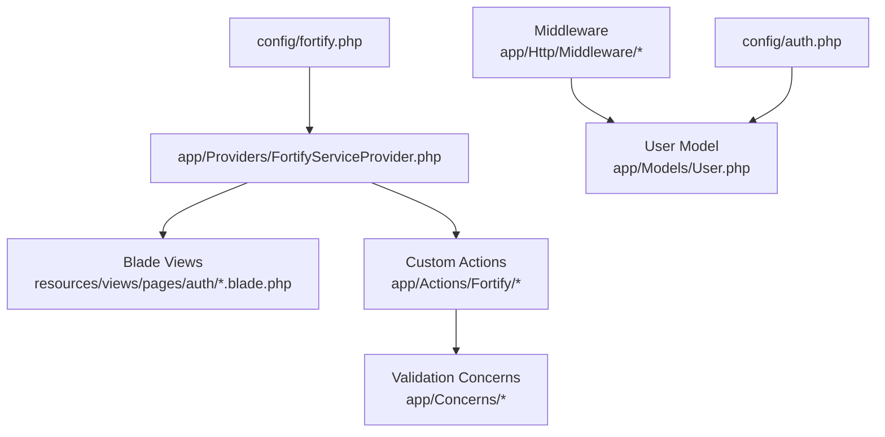

**Diagram sources**
- [auth.php:1-118](file://config/auth.php#L1-L118)
- [fortify.php:1-158](file://config/fortify.php#L1-L158)
- [FortifyServiceProvider.php:1-73](file://app/Providers/FortifyServiceProvider.php#L1-L73)
- [login.blade.php:1-60](file://resources/views/pages/auth/login.blade.php#L1-L60)
- [register.blade.php:1-68](file://resources/views/pages/auth/register.blade.php#L1-L68)
- [CreateNewUser.php:1-34](file://app/Actions/Fortify/CreateNewUser.php#L1-L34)
- [ResetUserPassword.php:1-30](file://app/Actions/Fortify/ResetUserPassword.php#L1-L30)
- [PasswordValidationRules.php:1-30](file://app/Concerns/PasswordValidationRules.php#L1-L30)
- [ProfileValidationRules.php:1-51](file://app/Concerns/ProfileValidationRules.php#L1-L51)
- [EnsureUserHasRole.php:1-37](file://app/Http/Middleware/EnsureUserHasRole.php#L1-L37)
- [CheckModulePassword.php:1-68](file://app/Http/Middleware/CheckModulePassword.php#L1-L68)
- [User.php:1-99](file://app/Models/User.php#L1-L99)

**Section sources**
- [auth.php:1-118](file://config/auth.php#L1-L118)
- [fortify.php:1-158](file://config/fortify.php#L1-L158)
- [FortifyServiceProvider.php:1-73](file://app/Providers/FortifyServiceProvider.php#L1-L73)
- [login.blade.php:1-60](file://resources/views/pages/auth/login.blade.php#L1-L60)
- [register.blade.php:1-68](file://resources/views/pages/auth/register.blade.php#L1-L68)
- [User.php:1-99](file://app/Models/User.php#L1-L99)

## Core Components
- Authentication configuration: Defines guards, providers, password reset broker, and timeouts.
- Fortify configuration: Selects guard and broker, sets username/email fields, home path, middleware, rate limiters, and enabled features.
- Fortify service provider: Registers custom actions (create user, reset password), view resolvers, and rate limiters.
- Validation concerns: Provide reusable password and profile validation rules.
- Custom actions: Implement registration and password reset logic with validation.
- Middleware: Enforce authentication, email verification, roles, and module session checks.
- User model: Integrates Fortify two-factor authentication and role casting.

**Section sources**
- [auth.php:18-115](file://config/auth.php#L18-L115)
- [fortify.php:18-155](file://config/fortify.php#L18-L155)
- [FortifyServiceProvider.php:37-71](file://app/Providers/FortifyServiceProvider.php#L37-L71)
- [PasswordValidationRules.php:8-29](file://app/Concerns/PasswordValidationRules.php#L8-L29)
- [ProfileValidationRules.php:8-49](file://app/Concerns/ProfileValidationRules.php#L8-L49)
- [CreateNewUser.php:11-32](file://app/Actions/Fortify/CreateNewUser.php#L11-L32)
- [ResetUserPassword.php:10-28](file://app/Actions/Fortify/ResetUserPassword.php#L10-L28)
- [EnsureUserHasRole.php:9-35](file://app/Http/Middleware/EnsureUserHasRole.php#L9-L35)
- [CheckModulePassword.php:10-33](file://app/Http/Middleware/CheckModulePassword.php#L10-L33)
- [User.php:14-55](file://app/Models/User.php#L14-L55)

## Architecture Overview
The authentication architecture combines Laravel Fortify with custom actions and middleware. Fortify handles standard flows (login, registration, password reset, email verification, two-factor challenge). The application augments these flows with custom actions and views, and adds role-based and module-specific session controls.

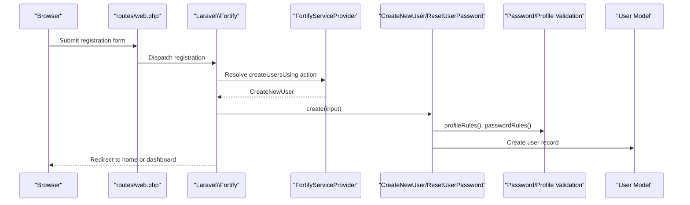

**Diagram sources**
- [web.php:1-127](file://routes/web.php#L1-L127)
- [FortifyServiceProvider.php:37-41](file://app/Providers/FortifyServiceProvider.php#L37-L41)
- [CreateNewUser.php:20-32](file://app/Actions/Fortify/CreateNewUser.php#L20-L32)
- [PasswordValidationRules.php:15-18](file://app/Concerns/PasswordValidationRules.php#L15-L18)
- [ProfileValidationRules.php:15-21](file://app/Concerns/ProfileValidationRules.php#L15-L21)
- [User.php:24-31](file://app/Models/User.php#L24-L31)

## Detailed Component Analysis

### Authentication Guards and Providers
- Guard: "web" driver "session" with provider "users".
- Provider: "users" driver "eloquent" using the User model.
- Password broker: "users" with token table and expiration/throttle settings.
- Password confirmation timeout: configurable seconds.

These settings establish the foundation for session-based authentication and password reset workflows.

**Section sources**
- [auth.php:40-74](file://config/auth.php#L40-L74)
- [auth.php:95-102](file://config/auth.php#L95-L102)
- [auth.php:115-115](file://config/auth.php#L115-L115)

### Fortify Integration and Custom Actions
- Guard and broker selection align with the auth configuration.
- Enabled features include registration, reset passwords, email verification, and two-factor authentication with confirmation and password requirement.
- Custom actions:
  - CreateNewUser validates profile and password rules, then creates a user.
  - ResetUserPassword validates the new password and updates the user record.
- View resolvers map Fortify views to application Blade templates.

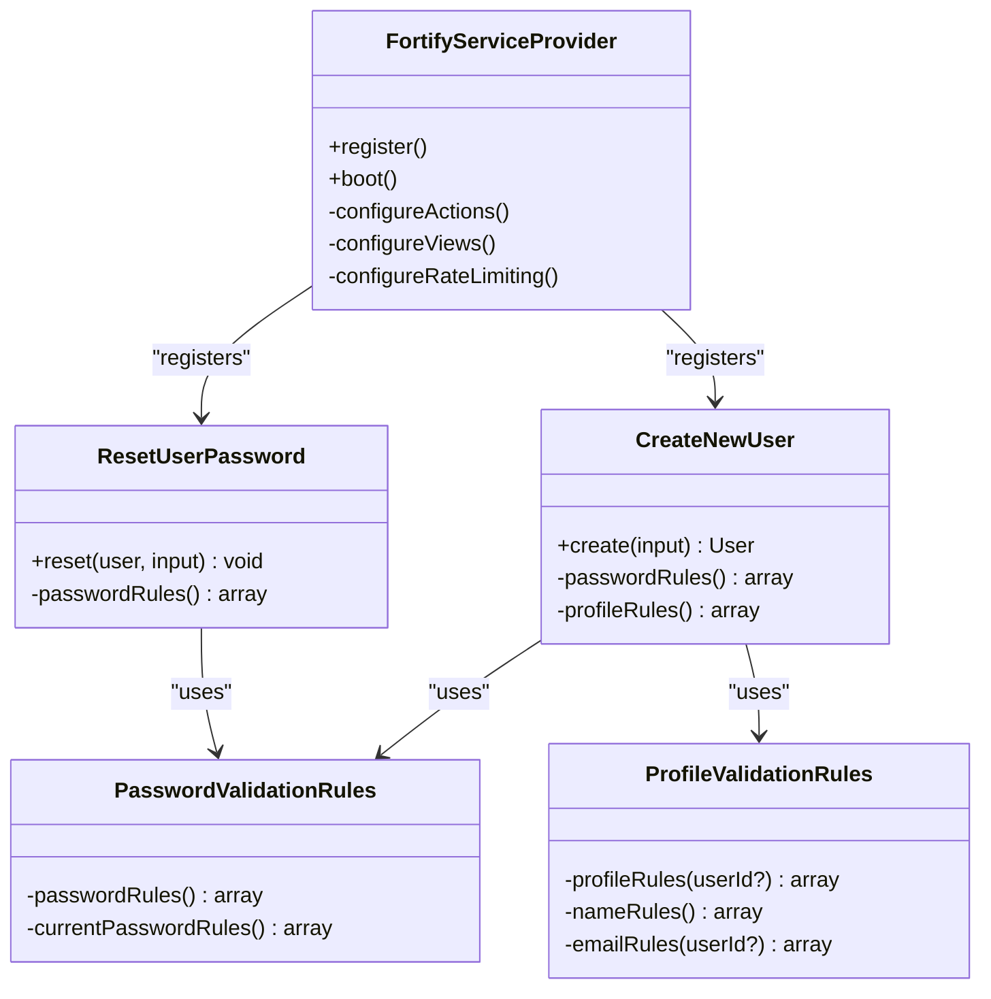

**Diagram sources**
- [FortifyServiceProvider.php:27-55](file://app/Providers/FortifyServiceProvider.php#L27-L55)
- [CreateNewUser.php:11-32](file://app/Actions/Fortify/CreateNewUser.php#L11-L32)
- [ResetUserPassword.php:10-28](file://app/Actions/Fortify/ResetUserPassword.php#L10-L28)
- [PasswordValidationRules.php:8-29](file://app/Concerns/PasswordValidationRules.php#L8-L29)
- [ProfileValidationRules.php:8-49](file://app/Concerns/ProfileValidationRules.php#L8-L49)

**Section sources**
- [fortify.php:18-31](file://config/fortify.php#L18-L31)
- [fortify.php:146-155](file://config/fortify.php#L146-L155)
- [FortifyServiceProvider.php:37-55](file://app/Providers/FortifyServiceProvider.php#L37-L55)
- [CreateNewUser.php:20-32](file://app/Actions/Fortify/CreateNewUser.php#L20-L32)
- [ResetUserPassword.php:19-28](file://app/Actions/Fortify/ResetUserPassword.php#L19-L28)

### Login Process
- The login view includes CSRF protection and submits to a named route.
- Fortify manages the authentication flow, honoring the configured guard and rate limiter keys.
- Successful login redirects to the configured home path.

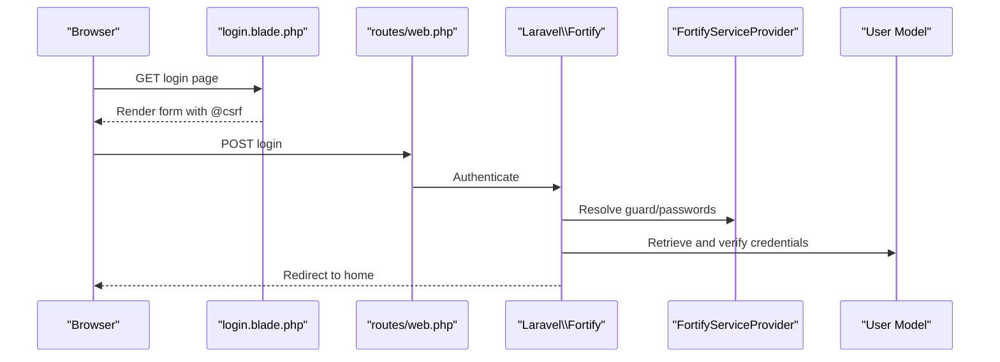

**Diagram sources**
- [login.blade.php:8-50](file://resources/views/pages/auth/login.blade.php#L8-L50)
- [web.php:1-127](file://routes/web.php#L1-L127)
- [FortifyServiceProvider.php:27-32](file://app/Providers/FortifyServiceProvider.php#L27-L32)
- [auth.php:18-21](file://config/auth.php#L18-L21)

**Section sources**
- [login.blade.php:8-50](file://resources/views/pages/auth/login.blade.php#L8-L50)
- [web.php:1-127](file://routes/web.php#L1-L127)
- [auth.php:76-76](file://config/auth.php#L76-L76)

### Registration Workflow
- The registration view collects name, email, and password confirmation.
- The CreateNewUser action validates inputs using profile and password rules, then persists the user.
- Fortify’s registration feature is enabled, and the register view resolver is set.

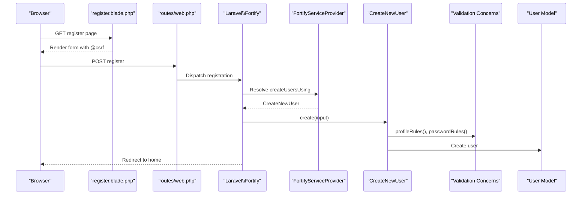

**Diagram sources**
- [register.blade.php:8-60](file://resources/views/pages/auth/register.blade.php#L8-L60)
- [web.php:1-127](file://routes/web.php#L1-L127)
- [FortifyServiceProvider.php:37-41](file://app/Providers/FortifyServiceProvider.php#L37-L41)
- [CreateNewUser.php:20-32](file://app/Actions/Fortify/CreateNewUser.php#L20-L32)
- [PasswordValidationRules.php:15-18](file://app/Concerns/PasswordValidationRules.php#L15-L18)
- [ProfileValidationRules.php:15-21](file://app/Concerns/ProfileValidationRules.php#L15-L21)

**Section sources**
- [register.blade.php:8-60](file://resources/views/pages/auth/register.blade.php#L8-L60)
- [CreateNewUser.php:20-32](file://app/Actions/Fortify/CreateNewUser.php#L20-L32)
- [FortifyServiceProvider.php:52-52](file://app/Providers/FortifyServiceProvider.php#L52-L52)

### Password Reset Procedures
- The reset password feature is enabled in Fortify.
- The ResetUserPassword action validates the new password using shared rules and saves it to the user.
- The auth configuration defines the password broker, token table, expiry, and throttle.

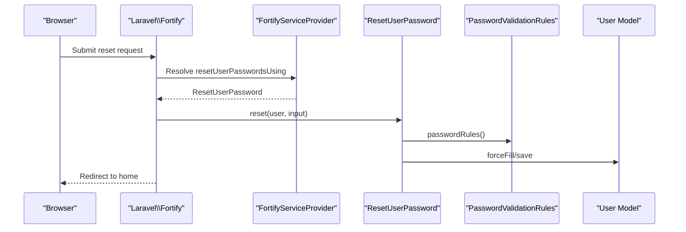

**Diagram sources**
- [fortify.php:148-148](file://config/fortify.php#L148-L148)
- [auth.php:95-102](file://config/auth.php#L95-L102)
- [FortifyServiceProvider.php:39-39](file://app/Providers/FortifyServiceProvider.php#L39-L39)
- [ResetUserPassword.php:19-28](file://app/Actions/Fortify/ResetUserPassword.php#L19-L28)
- [PasswordValidationRules.php:15-18](file://app/Concerns/PasswordValidationRules.php#L15-L18)

**Section sources**
- [fortify.php:148-148](file://config/fortify.php#L148-L148)
- [auth.php:95-102](file://config/auth.php#L95-L102)
- [ResetUserPassword.php:19-28](file://app/Actions/Fortify/ResetUserPassword.php#L19-L28)

### Email Verification Processes
- The email verification feature is enabled in Fortify.
- The Fortify service provider registers the verification view resolver.
- The auth configuration defines the password reset broker; email verification uses the same provider.

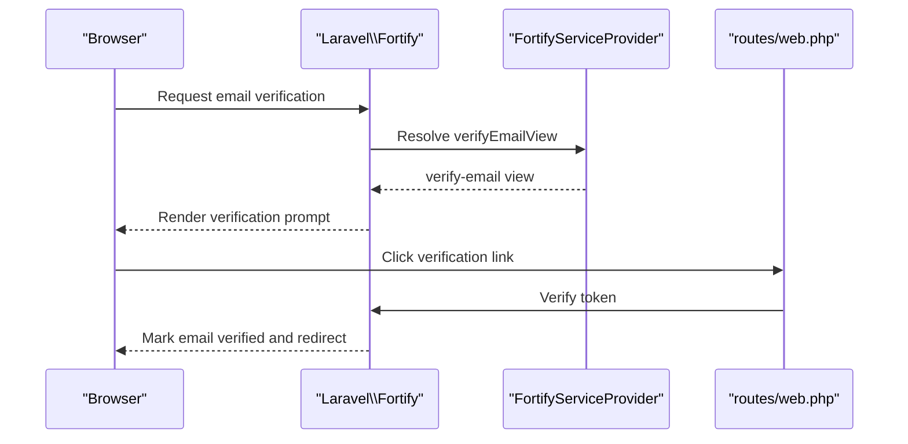

**Diagram sources**
- [fortify.php:149-149](file://config/fortify.php#L149-L149)
- [FortifyServiceProvider.php:49-49](file://app/Providers/FortifyServiceProvider.php#L49-L49)
- [web.php:28-40](file://routes/web.php#L28-L40)

**Section sources**
- [fortify.php:149-149](file://config/fortify.php#L149-L149)
- [FortifyServiceProvider.php:49-49](file://app/Providers/FortifyServiceProvider.php#L49-L49)

### Two-Factor Authentication Setup
- Two-factor authentication is enabled in Fortify with confirmation and password requirement.
- The User model uses Fortify’s TwoFactorAuthenticatable trait and includes migration fields for two-factor secret, recovery codes, and confirmation timestamp.
- Rate limiting for two-factor challenges is configured.

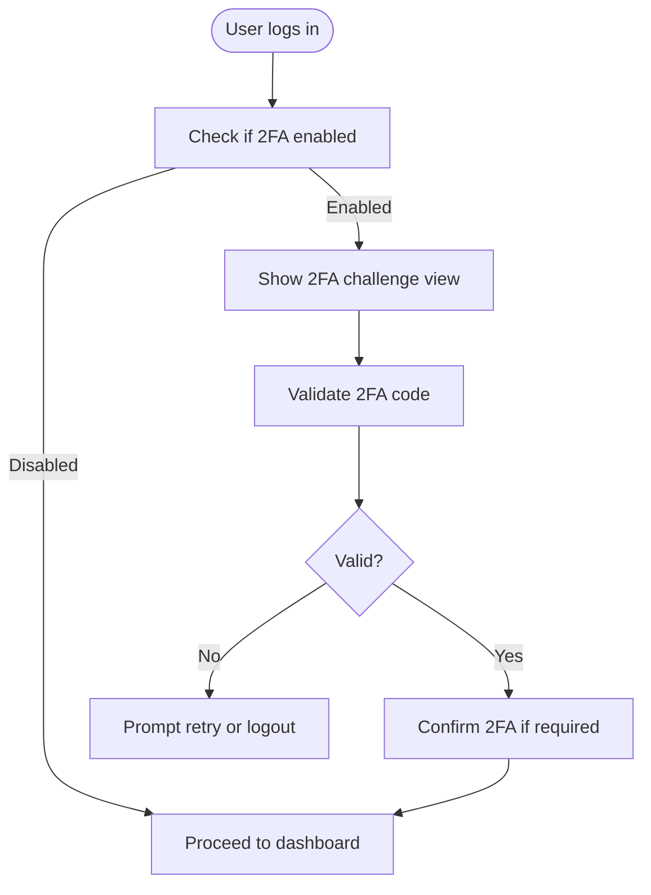

**Diagram sources**
- [fortify.php:150-154](file://config/fortify.php#L150-L154)
- [User.php:14-17](file://app/Models/User.php#L14-L17)
- [2025_08_14_170933_add_two_factor_columns_to_users_table.php:14-18](file://database/migrations/2025_08_14_170933_add_two_factor_columns_to_users_table.php#L14-L18)
- [FortifyServiceProvider.php:62-70](file://app/Providers/FortifyServiceProvider.php#L62-L70)

**Section sources**
- [fortify.php:150-154](file://config/fortify.php#L150-L154)
- [User.php:14-17](file://app/Models/User.php#L14-L17)
- [2025_08_14_170933_add_two_factor_columns_to_users_table.php:14-18](file://database/migrations/2025_08_14_170933_add_two_factor_columns_to_users_table.php#L14-L18)
- [FortifyServiceProvider.php:62-70](file://app/Providers/FortifyServiceProvider.php#L62-L70)

### Session Management and CSRF Protection
- CSRF protection is included in authentication forms.
- Session-based authentication uses the "web" guard with the "users" provider.
- Role-based access control middleware ensures authorized roles can access protected routes.
- Module-specific session middleware maintains separate authenticated sessions for kiosk and TV display modules with lifetime checks.

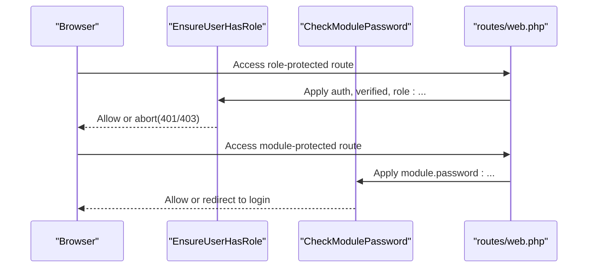

**Diagram sources**
- [web.php:28-90](file://routes/web.php#L28-L90)
- [EnsureUserHasRole.php:16-35](file://app/Http/Middleware/EnsureUserHasRole.php#L16-L35)
- [CheckModulePassword.php:17-33](file://app/Http/Middleware/CheckModulePassword.php#L17-L33)

**Section sources**
- [login.blade.php:9-9](file://resources/views/pages/auth/login.blade.php#L9-L9)
- [register.blade.php:9-9](file://resources/views/pages/auth/register.blade.php#L9-L9)
- [web.php:28-90](file://routes/web.php#L28-L90)
- [EnsureUserHasRole.php:16-35](file://app/Http/Middleware/EnsureUserHasRole.php#L16-L35)
- [CheckModulePassword.php:17-33](file://app/Http/Middleware/CheckModulePassword.php#L17-L33)

### Rate Limiting Mechanisms
- Fortify uses named limiters for login and two-factor challenges.
- Login limiter throttles by a composite key of normalized username and IP.
- Two-factor limiter throttles by the authenticated user ID stored in the session.

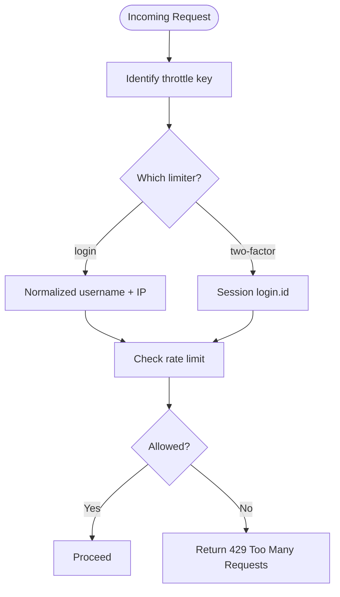

**Diagram sources**
- [fortify.php:117-120](file://config/fortify.php#L117-L120)
- [FortifyServiceProvider.php:62-70](file://app/Providers/FortifyServiceProvider.php#L62-L70)

**Section sources**
- [fortify.php:117-120](file://config/fortify.php#L117-L120)
- [FortifyServiceProvider.php:62-70](file://app/Providers/FortifyServiceProvider.php#L62-L70)

### PasswordValidationRules and ProfileValidationRules Concerns
- PasswordValidationRules:
  - Provides password validation rules including a strong password policy and confirmation.
  - Provides current password validation for password confirmation steps.
- ProfileValidationRules:
  - Provides profile validation rules for name and email.
  - Ensures email uniqueness, with support for ignoring a specific user ID during updates.

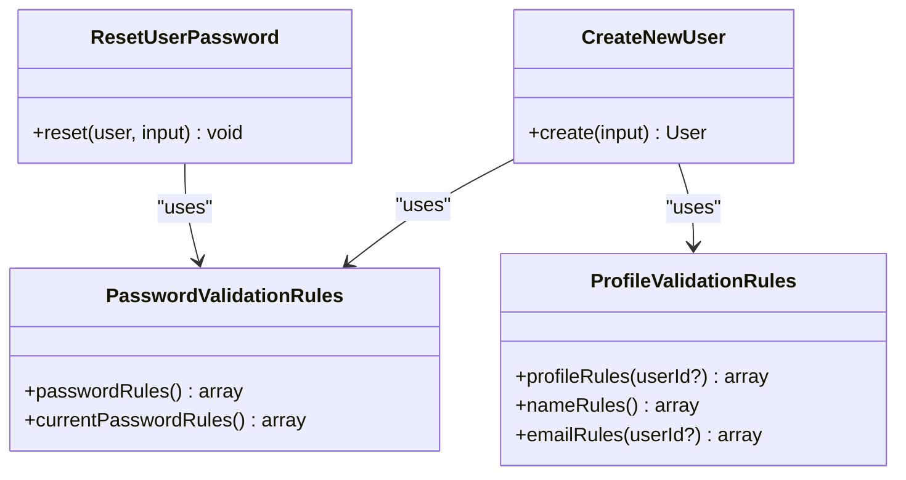

**Diagram sources**
- [PasswordValidationRules.php:8-29](file://app/Concerns/PasswordValidationRules.php#L8-L29)
- [ProfileValidationRules.php:8-49](file://app/Concerns/ProfileValidationRules.php#L8-L49)
- [CreateNewUser.php:13-13](file://app/Actions/Fortify/CreateNewUser.php#L13-L13)
- [ResetUserPassword.php:12-12](file://app/Actions/Fortify/ResetUserPassword.php#L12-L12)

**Section sources**
- [PasswordValidationRules.php:15-28](file://app/Concerns/PasswordValidationRules.php#L15-L28)
- [ProfileValidationRules.php:15-49](file://app/Concerns/ProfileValidationRules.php#L15-L49)
- [CreateNewUser.php:22-25](file://app/Actions/Fortify/CreateNewUser.php#L22-L25)
- [ResetUserPassword.php:21-23](file://app/Actions/Fortify/ResetUserPassword.php#L21-L23)

### Authentication Guards, Providers, and Middleware Chains
- Guards and providers:
  - "web" guard with "session" driver and "users" provider using the User model.
- Middleware chains:
  - Global "web" middleware group applies to Fortify routes.
  - Route groups apply "auth", "verified", and role-based middleware for protected areas.
  - Module-specific middleware enforces session-based authentication for kiosk and TV display.

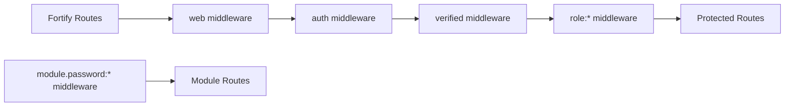

**Diagram sources**
- [fortify.php:104-104](file://config/fortify.php#L104-L104)
- [web.php:28-90](file://routes/web.php#L28-L90)
- [EnsureUserHasRole.php:16-35](file://app/Http/Middleware/EnsureUserHasRole.php#L16-L35)
- [CheckModulePassword.php:17-33](file://app/Http/Middleware/CheckModulePassword.php#L17-L33)

**Section sources**
- [auth.php:40-74](file://config/auth.php#L40-L74)
- [web.php:28-90](file://routes/web.php#L28-L90)
- [EnsureUserHasRole.php:16-35](file://app/Http/Middleware/EnsureUserHasRole.php#L16-L35)
- [CheckModulePassword.php:17-33](file://app/Http/Middleware/CheckModulePassword.php#L17-L33)

## Dependency Analysis
The authentication system exhibits clear separation of concerns:
- Fortify configuration depends on auth configuration for guard and broker.
- Fortify service provider depends on custom actions and Blade view resolvers.
- Custom actions depend on validation concerns.
- Middleware depends on the User model and configuration values.
- The User model integrates Fortify traits and database schema for two-factor authentication.

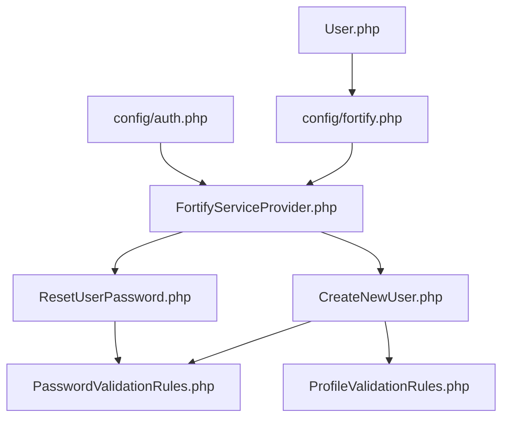

**Diagram sources**
- [fortify.php:1-158](file://config/fortify.php#L1-L158)
- [auth.php:1-118](file://config/auth.php#L1-L118)
- [FortifyServiceProvider.php:1-73](file://app/Providers/FortifyServiceProvider.php#L1-L73)
- [CreateNewUser.php:1-34](file://app/Actions/Fortify/CreateNewUser.php#L1-L34)
- [ResetUserPassword.php:1-30](file://app/Actions/Fortify/ResetUserPassword.php#L1-L30)
- [PasswordValidationRules.php:1-30](file://app/Concerns/PasswordValidationRules.php#L1-L30)
- [ProfileValidationRules.php:1-51](file://app/Concerns/ProfileValidationRules.php#L1-L51)
- [User.php:1-99](file://app/Models/User.php#L1-L99)

**Section sources**
- [fortify.php:1-158](file://config/fortify.php#L1-L158)
- [auth.php:1-118](file://config/auth.php#L1-L118)
- [FortifyServiceProvider.php:1-73](file://app/Providers/FortifyServiceProvider.php#L1-L73)
- [CreateNewUser.php:1-34](file://app/Actions/Fortify/CreateNewUser.php#L1-L34)
- [ResetUserPassword.php:1-30](file://app/Actions/Fortify/ResetUserPassword.php#L1-L30)
- [PasswordValidationRules.php:1-30](file://app/Concerns/PasswordValidationRules.php#L1-L30)
- [ProfileValidationRules.php:1-51](file://app/Concerns/ProfileValidationRules.php#L1-L51)
- [User.php:1-99](file://app/Models/User.php#L1-L99)

## Performance Considerations
- Rate limiting reduces brute-force login attempts and protects two-factor challenge flows.
- Using hashed passwords and validated inputs minimizes overhead and improves security.
- Blade views with minimal logic keep rendering efficient.
- Consider enabling caching for frequently accessed user roles and permissions to reduce middleware overhead.

## Troubleshooting Guide
- Login failures:
  - Verify rate limiter thresholds and keys; check normalized username and IP composition.
  - Ensure the "web" guard and "users" provider are correctly configured.
- Two-factor issues:
  - Confirm two-factor fields exist in the users table and the User model uses the appropriate trait.
  - Check two-factor rate limiter key resolution against the session-stored user identifier.
- Email verification:
  - Confirm the verification view resolver is registered and the password broker provider matches the users provider.
- Role-based access errors:
  - Validate role middleware parameters and ensure the User model role casting is correct.
- Module session issues:
  - Verify module-specific session keys and timestamps; confirm session lifetime configuration and middleware application.

**Section sources**
- [FortifyServiceProvider.php:62-70](file://app/Providers/FortifyServiceProvider.php#L62-L70)
- [2025_08_14_170933_add_two_factor_columns_to_users_table.php:14-18](file://database/migrations/2025_08_14_170933_add_two_factor_columns_to_users_table.php#L14-L18)
- [User.php:14-17](file://app/Models/User.php#L14-L17)
- [auth.php:95-102](file://config/auth.php#L95-L102)
- [EnsureUserHasRole.php:16-35](file://app/Http/Middleware/EnsureUserHasRole.php#L16-L35)
- [CheckModulePassword.php:17-33](file://app/Http/Middleware/CheckModulePassword.php#L17-L33)

## Conclusion
The authentication system leverages Laravel Fortify with custom actions and robust validation concerns. It provides secure login, registration, password reset, email verification, and two-factor authentication flows. Session management, CSRF protection, and rate limiting are integrated across the stack. Middleware enforces role-based access and module-specific sessions. The modular design allows straightforward customization and extension of security features.