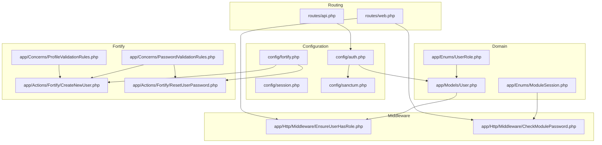
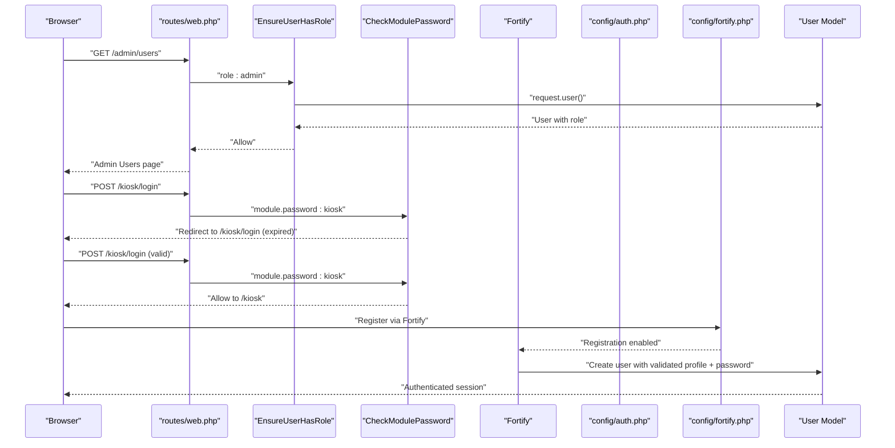
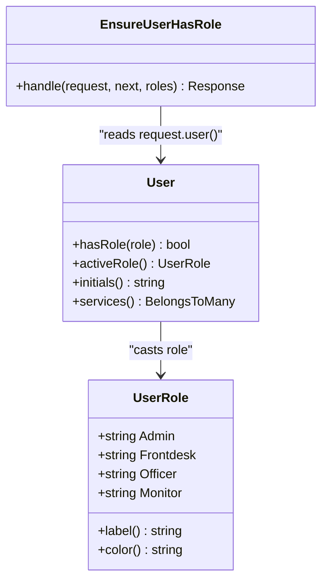
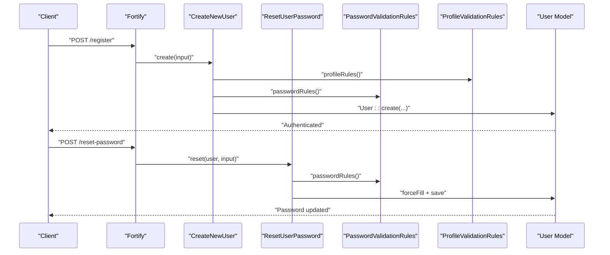
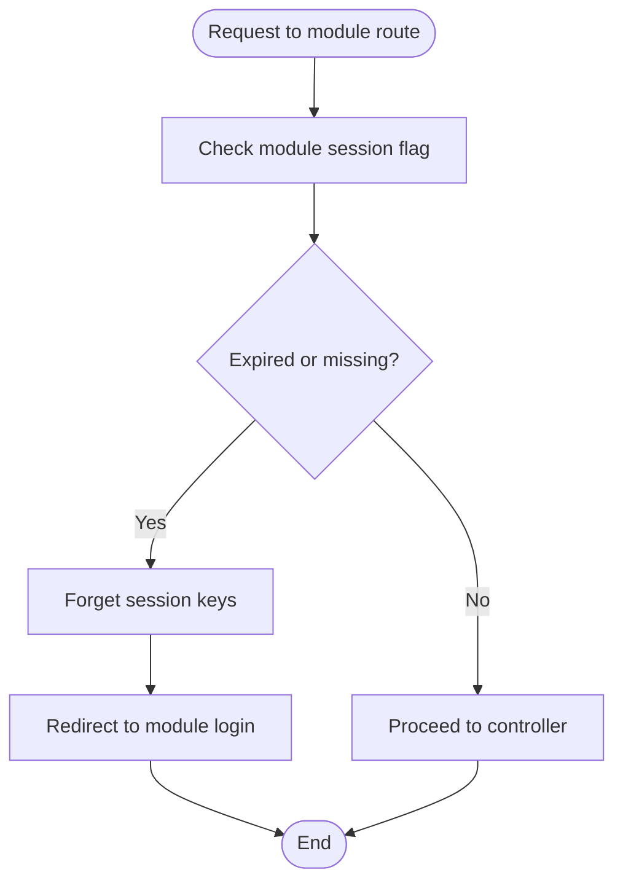
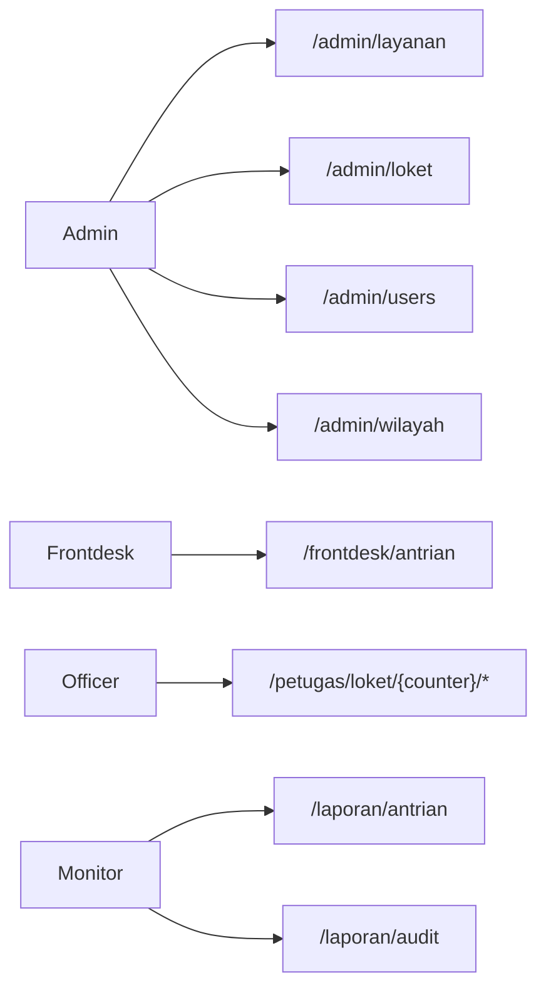
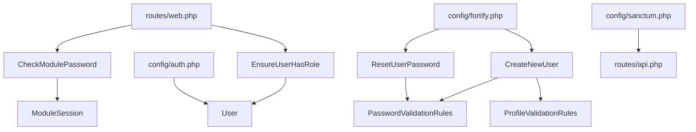

# Authentication and Authorization

<cite>
**Referenced Files in This Document**
- [UserRole.php](file://app/Enums/UserRole.php)
- [User.php](file://app/Models/User.php)
- [EnsureUserHasRole.php](file://app/Http/Middleware/EnsureUserHasRole.php)
- [CheckModulePassword.php](file://app/Http/Middleware/CheckModulePassword.php)
- [ModuleSession.php](file://app/Enums/ModuleSession.php)
- [CreateNewUser.php](file://app/Actions/Fortify/CreateNewUser.php)
- [ResetUserPassword.php](file://app/Actions/Fortify/ResetUserPassword.php)
- [PasswordValidationRules.php](file://app/Concerns/PasswordValidationRules.php)
- [ProfileValidationRules.php](file://app/Concerns/ProfileValidationRules.php)
- [auth.php](file://config/auth.php)
- [fortify.php](file://config/fortify.php)
- [session.php](file://config/session.php)
- [sanctum.php](file://config/sanctum.php)
- [web.php](file://routes/web.php)
- [api.php](file://routes/api.php)
</cite>

## Table of Contents
1. [Introduction](#introduction)
2. [Project Structure](#project-structure)
3. [Core Components](#core-components)
4. [Architecture Overview](#architecture-overview)
5. [Detailed Component Analysis](#detailed-component-analysis)
6. [Dependency Analysis](#dependency-analysis)
7. [Performance Considerations](#performance-considerations)
8. [Troubleshooting Guide](#troubleshooting-guide)
9. [Conclusion](#conclusion)

## Introduction
This document explains the PTSP authentication and authorization system. It covers role-based access control (RBAC) using a dedicated enum and middleware enforcement, Laravel Fortify integration for authentication and two-factor authentication, password reset, and session management. It also documents user registration, password validation rules, profile management, permissions for roles (administrator, frontdesk, officer, monitor), security considerations, rate limiting, session handling, API authentication methods, and administrative controls.

## Project Structure
The authentication and authorization system spans several layers:
- Enumerations define roles and module session keys
- Middleware enforces roles and module-specific password sessions
- Fortify actions and validation traits govern registration and password resets
- Eloquent model integrates Fortify’s two-factor capability and role casting
- Configuration files define guards, rate limits, session lifetime, and Sanctum behavior
- Routes apply middleware to protect features and enforce role-based visibility

**Diagram sources**
- [auth.php:1-118](file://config/auth.php#L1-L118)
- [fortify.php:1-158](file://config/fortify.php#L1-L158)
- [session.php:1-218](file://config/session.php#L1-L218)
- [sanctum.php:1-85](file://config/sanctum.php#L1-L85)
- [UserRole.php:1-32](file://app/Enums/UserRole.php#L1-L32)
- [ModuleSession.php:1-15](file://app/Enums/ModuleSession.php#L1-L15)
- [User.php:1-99](file://app/Models/User.php#L1-L99)
- [CreateNewUser.php:1-34](file://app/Actions/Fortify/CreateNewUser.php#L1-L34)
- [ResetUserPassword.php:1-30](file://app/Actions/Fortify/ResetUserPassword.php#L1-L30)
- [PasswordValidationRules.php:1-30](file://app/Concerns/PasswordValidationRules.php#L1-L30)
- [ProfileValidationRules.php:1-51](file://app/Concerns/ProfileValidationRules.php#L1-L51)
- [EnsureUserHasRole.php:1-37](file://app/Http/Middleware/EnsureUserHasRole.php#L1-L37)
- [CheckModulePassword.php:1-68](file://app/Http/Middleware/CheckModulePassword.php#L1-L68)
- [web.php:1-127](file://routes/web.php#L1-L127)
- [api.php:1-23](file://routes/api.php#L1-L23)

**Section sources**
- [auth.php:1-118](file://config/auth.php#L1-L118)
- [fortify.php:1-158](file://config/fortify.php#L1-L158)
- [session.php:1-218](file://config/session.php#L1-L218)
- [sanctum.php:1-85](file://config/sanctum.php#L1-L85)
- [UserRole.php:1-32](file://app/Enums/UserRole.php#L1-L32)
- [ModuleSession.php:1-15](file://app/Enums/ModuleSession.php#L1-L15)
- [User.php:1-99](file://app/Models/User.php#L1-L99)
- [CreateNewUser.php:1-34](file://app/Actions/Fortify/CreateNewUser.php#L1-L34)
- [ResetUserPassword.php:1-30](file://app/Actions/Fortify/ResetUserPassword.php#L1-L30)
- [PasswordValidationRules.php:1-30](file://app/Concerns/PasswordValidationRules.php#L1-L30)
- [ProfileValidationRules.php:1-51](file://app/Concerns/ProfileValidationRules.php#L1-L51)
- [EnsureUserHasRole.php:1-37](file://app/Http/Middleware/EnsureUserHasRole.php#L1-L37)
- [CheckModulePassword.php:1-68](file://app/Http/Middleware/CheckModulePassword.php#L1-L68)
- [web.php:1-127](file://routes/web.php#L1-L127)
- [api.php:1-23](file://routes/api.php#L1-L23)

## Core Components
- Role enumeration defines roles and convenience helpers for labels and colors.
- User model integrates Fortify two-factor, casts role to enum, exposes helpers for role checks and active role resolution, and defines service relationships.
- Role enforcement middleware validates authenticated user and ensures role membership, with special bypass for administrators.
- Module password middleware manages non-web module sessions (kiosk, TV display) with separate session keys and lifetime checks.
- Fortify actions combine validation traits to enforce strong password and profile rules during registration and password reset.
- Configuration files define authentication guards, password reset policies, rate limiters, session lifetime, and Sanctum behavior.

**Section sources**
- [UserRole.php:1-32](file://app/Enums/UserRole.php#L1-L32)
- [User.php:1-99](file://app/Models/User.php#L1-L99)
- [EnsureUserHasRole.php:1-37](file://app/Http/Middleware/EnsureUserHasRole.php#L1-L37)
- [CheckModulePassword.php:1-68](file://app/Http/Middleware/CheckModulePassword.php#L1-L68)
- [CreateNewUser.php:1-34](file://app/Actions/Fortify/CreateNewUser.php#L1-L34)
- [ResetUserPassword.php:1-30](file://app/Actions/Fortify/ResetUserPassword.php#L1-L30)
- [PasswordValidationRules.php:1-30](file://app/Concerns/PasswordValidationRules.php#L1-L30)
- [ProfileValidationRules.php:1-51](file://app/Concerns/ProfileValidationRules.php#L1-L51)
- [auth.php:1-118](file://config/auth.php#L1-L118)
- [fortify.php:1-158](file://config/fortify.php#L1-L158)
- [session.php:1-218](file://config/session.php#L1-L218)
- [sanctum.php:1-85](file://config/sanctum.php#L1-L85)

## Architecture Overview
The system combines Laravel’s session-based web authentication with Fortify for registration, password reset, and two-factor authentication. Non-web modules (kiosk, TV display) use a separate password-based session mechanism enforced by middleware. API authentication leverages Sanctum with stateful guard configuration.

**Diagram sources**
- [web.php:62-90](file://routes/web.php#L62-L90)
- [EnsureUserHasRole.php:16-35](file://app/Http/Middleware/EnsureUserHasRole.php#L16-L35)
- [CheckModulePassword.php:17-33](file://app/Http/Middleware/CheckModulePassword.php#L17-L33)
- [fortify.php:146-155](file://config/fortify.php#L146-L155)
- [auth.php:40-45](file://config/auth.php#L40-L45)
- [User.php:14-55](file://app/Models/User.php#L14-L55)

## Detailed Component Analysis

### Role-Based Access Control (RBAC)
- Roles are defined as a string-backed enum with label and color helpers.
- The middleware accepts a variadic list of allowed roles and denies access otherwise. Administrators bypass role checks.
- The User model exposes a method to check role equality and resolves an “active role” from session for administrators, enabling role switching without re-authentication.

**Diagram sources**
- [UserRole.php:5-31](file://app/Enums/UserRole.php#L5-L31)
- [EnsureUserHasRole.php:16-35](file://app/Http/Middleware/EnsureUserHasRole.php#L16-L35)
- [User.php:69-97](file://app/Models/User.php#L69-L97)

**Section sources**
- [UserRole.php:1-32](file://app/Enums/UserRole.php#L1-L32)
- [EnsureUserHasRole.php:1-37](file://app/Http/Middleware/EnsureUserHasRole.php#L1-L37)
- [User.php:1-99](file://app/Models/User.php#L1-L99)

### Authentication Flow and Fortify Integration
- Fortify is configured as the primary guard and password broker, enabling registration, password reset, email verification, and two-factor authentication with confirmation and password prompts.
- Registration uses a dedicated action that validates profile and password rules before creating a user.
- Password reset uses a dedicated action that validates the new password against the same rules and persists it.

**Diagram sources**
- [fortify.php:18-31](file://config/fortify.php#L18-L31)
- [CreateNewUser.php:20-32](file://app/Actions/Fortify/CreateNewUser.php#L20-L32)
- [ResetUserPassword.php:19-28](file://app/Actions/Fortify/ResetUserPassword.php#L19-L28)
- [PasswordValidationRules.php:15-18](file://app/Concerns/PasswordValidationRules.php#L15-L18)
- [ProfileValidationRules.php:15-21](file://app/Concerns/ProfileValidationRules.php#L15-L21)
- [User.php:14-55](file://app/Models/User.php#L14-L55)

**Section sources**
- [fortify.php:1-158](file://config/fortify.php#L1-L158)
- [CreateNewUser.php:1-34](file://app/Actions/Fortify/CreateNewUser.php#L1-L34)
- [ResetUserPassword.php:1-30](file://app/Actions/Fortify/ResetUserPassword.php#L1-L30)
- [PasswordValidationRules.php:1-30](file://app/Concerns/PasswordValidationRules.php#L1-L30)
- [ProfileValidationRules.php:1-51](file://app/Concerns/ProfileValidationRules.php#L1-L51)

### Two-Factor Authentication
- Two-factor authentication is enabled via Fortify features with confirmation and password prompt options. The User model includes the two-factor trait, integrating with Fortify’s mechanisms.

**Section sources**
- [fortify.php:150-154](file://config/fortify.php#L150-L154)
- [User.php:12-17](file://app/Models/User.php#L12-L17)

### Password Reset
- Password reset is governed by the authentication configuration with a token table, expiration window, and throttling. Fortify handles the lifecycle, while the reset action enforces password validation rules.

**Section sources**
- [auth.php:95-102](file://config/auth.php#L95-L102)
- [ResetUserPassword.php:1-30](file://app/Actions/Fortify/ResetUserPassword.php#L1-L30)

### Session Management
- Web sessions use the session driver with configurable lifetime and cookie attributes. Sessions are used for standard web authentication and module-specific sessions for kiosk and TV display.
- Module password middleware maintains separate authenticated flags and timestamps per module, enforcing session lifetime and redirecting to login when expired.

**Diagram sources**
- [CheckModulePassword.php:17-33](file://app/Http/Middleware/CheckModulePassword.php#L17-L33)
- [ModuleSession.php:8-14](file://app/Enums/ModuleSession.php#L8-L14)
- [session.php:35-37](file://config/session.php#L35-L37)

**Section sources**
- [session.php:1-218](file://config/session.php#L1-L218)
- [CheckModulePassword.php:1-68](file://app/Http/Middleware/CheckModulePassword.php#L1-L68)
- [ModuleSession.php:1-15](file://app/Enums/ModuleSession.php#L1-L15)

### API Authentication with Sanctum
- API endpoints require Sanctum authentication. The configuration specifies stateful domains and guards, ensuring compatibility with SPA and web flows. An endpoint exposes the authenticated user when authenticated.

**Section sources**
- [sanctum.php:18-37](file://config/sanctum.php#L18-L37)
- [api.php:20-22](file://routes/api.php#L20-L22)

### User Registration, Password Validation, and Profile Management
- Registration enforces profile rules (name, email uniqueness) and password rules (strong password, confirmation). Password rules reuse a shared trait.
- Profile rules enforce name length and email format/uniqueness, with ignore support for updates.

**Section sources**
- [CreateNewUser.php:20-32](file://app/Actions/Fortify/CreateNewUser.php#L20-L32)
- [PasswordValidationRules.php:15-18](file://app/Concerns/PasswordValidationRules.php#L15-L18)
- [ProfileValidationRules.php:15-49](file://app/Concerns/ProfileValidationRules.php#L15-L49)

### Permission System and Role-Based Feature Access
- Routes group endpoints by roles using the role middleware. Administrators gain broad access; others are restricted to their designated areas.
- The active role resolution enables administrators to switch roles within their session without re-authentication.

**Diagram sources**
- [web.php:42-90](file://routes/web.php#L42-L90)
- [User.php:81-91](file://app/Models/User.php#L81-L91)

**Section sources**
- [web.php:1-127](file://routes/web.php#L1-L127)
- [User.php:1-99](file://app/Models/User.php#L1-L99)

## Dependency Analysis
- Fortify actions depend on validation traits for consistent rules.
- Middleware depends on the User model for role checks and on configuration for session lifetimes.
- Routes depend on middleware for enforcement and on the User model for active role resolution.
- Configuration files define the foundational behavior for authentication, rate limiting, sessions, and Sanctum.

**Diagram sources**
- [CreateNewUser.php:1-34](file://app/Actions/Fortify/CreateNewUser.php#L1-L34)
- [ResetUserPassword.php:1-30](file://app/Actions/Fortify/ResetUserPassword.php#L1-L30)
- [PasswordValidationRules.php:1-30](file://app/Concerns/PasswordValidationRules.php#L1-L30)
- [ProfileValidationRules.php:1-51](file://app/Concerns/ProfileValidationRules.php#L1-L51)
- [EnsureUserHasRole.php:1-37](file://app/Http/Middleware/EnsureUserHasRole.php#L1-L37)
- [CheckModulePassword.php:1-68](file://app/Http/Middleware/CheckModulePassword.php#L1-L68)
- [ModuleSession.php:1-15](file://app/Enums/ModuleSession.php#L1-L15)
- [web.php:1-127](file://routes/web.php#L1-L127)
- [api.php:1-23](file://routes/api.php#L1-L23)
- [auth.php:1-118](file://config/auth.php#L1-L118)
- [fortify.php:1-158](file://config/fortify.php#L1-L158)
- [sanctum.php:1-85](file://config/sanctum.php#L1-L85)

**Section sources**
- [CreateNewUser.php:1-34](file://app/Actions/Fortify/CreateNewUser.php#L1-L34)
- [ResetUserPassword.php:1-30](file://app/Actions/Fortify/ResetUserPassword.php#L1-L30)
- [PasswordValidationRules.php:1-30](file://app/Concerns/PasswordValidationRules.php#L1-L30)
- [ProfileValidationRules.php:1-51](file://app/Concerns/ProfileValidationRules.php#L1-L51)
- [EnsureUserHasRole.php:1-37](file://app/Http/Middleware/EnsureUserHasRole.php#L1-L37)
- [CheckModulePassword.php:1-68](file://app/Http/Middleware/CheckModulePassword.php#L1-L68)
- [ModuleSession.php:1-15](file://app/Enums/ModuleSession.php#L1-L15)
- [web.php:1-127](file://routes/web.php#L1-L127)
- [api.php:1-23](file://routes/api.php#L1-L23)
- [auth.php:1-118](file://config/auth.php#L1-L118)
- [fortify.php:1-158](file://config/fortify.php#L1-L158)
- [sanctum.php:1-85](file://config/sanctum.php#L1-L85)

## Performance Considerations
- Rate limiting: Fortify applies rate limiters for login and two-factor attempts. Public endpoints use throttle middleware to constrain booking and lookup operations.
- Session lifetime: Web session lifetime is configurable; module sessions enforce shorter lifetimes controlled by configuration.
- Two-factor overhead: Enabling two-factor adds cryptographic operations; confirmations and password prompts incur additional round-trips.

[No sources needed since this section provides general guidance]

## Troubleshooting Guide
- Unauthorized access errors:
  - Verify the user is authenticated and verified before role checks.
  - Confirm the route is wrapped with the appropriate role middleware and that the user’s role matches the allowed roles.
- Role enforcement failures:
  - Administrators bypass role checks; ensure the user’s role is not admin if expecting strict role gating.
  - Check that the role enum values align with route definitions.
- Module session timeouts:
  - When redirected to the module login, confirm the session lifetime configuration and that timestamps are recorded upon successful authentication.
- API authentication failures:
  - Ensure the request includes a valid Sanctum token or stateful cookie from a configured stateful domain.
- Password reset issues:
  - Confirm the reset token table exists and that the token has not expired or exceeded throttle limits.

**Section sources**
- [EnsureUserHasRole.php:16-35](file://app/Http/Middleware/EnsureUserHasRole.php#L16-L35)
- [CheckModulePassword.php:17-33](file://app/Http/Middleware/CheckModulePassword.php#L17-L33)
- [auth.php:95-102](file://config/auth.php#L95-L102)
- [sanctum.php:18-37](file://config/sanctum.php#L18-L37)

## Conclusion
The PTSP system implements a robust RBAC model with clear separation between web and non-web modules. Fortify provides secure registration, password reset, and two-factor authentication, while middleware and configuration enforce session management and rate limiting. Administrators enjoy broad access with role switching capabilities, while other roles are scoped to their responsibilities. Sanctum enables secure API authentication compatible with SPA environments.