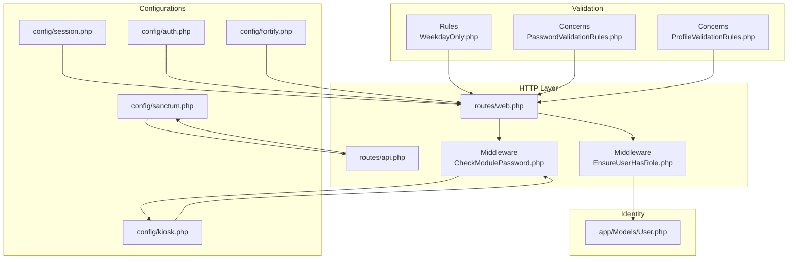
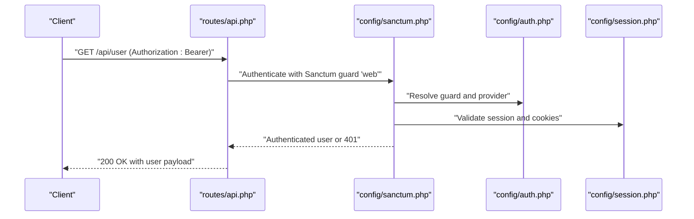
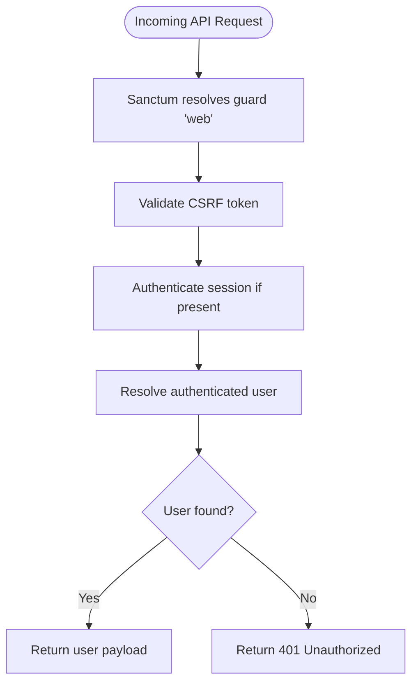
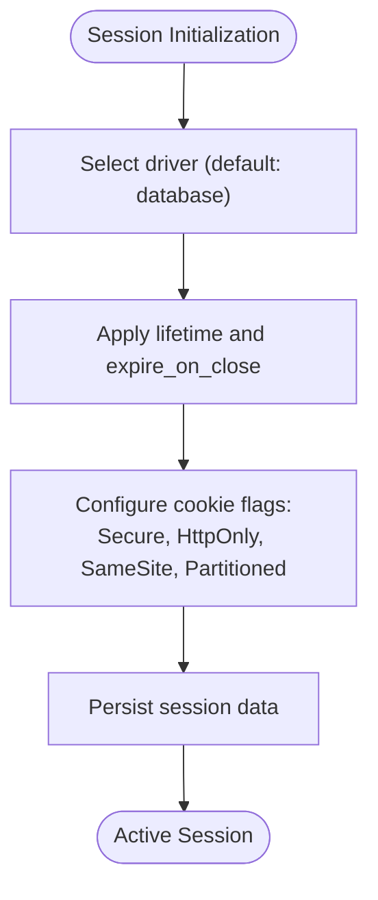
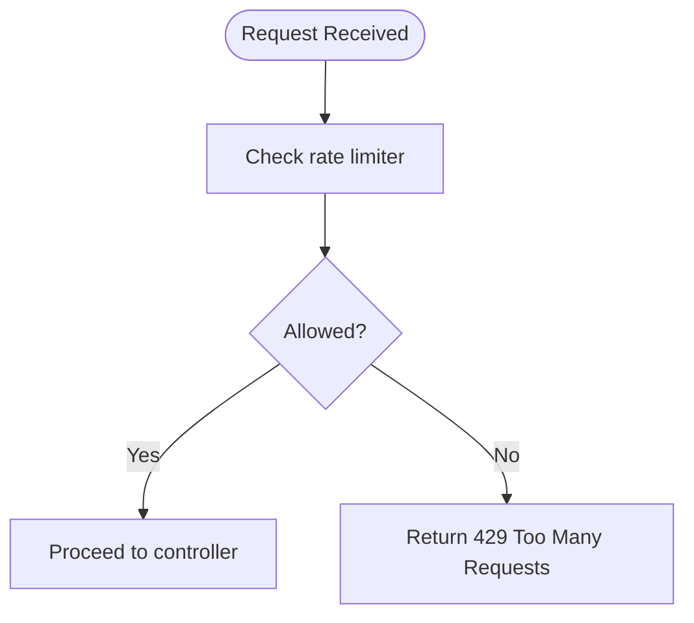
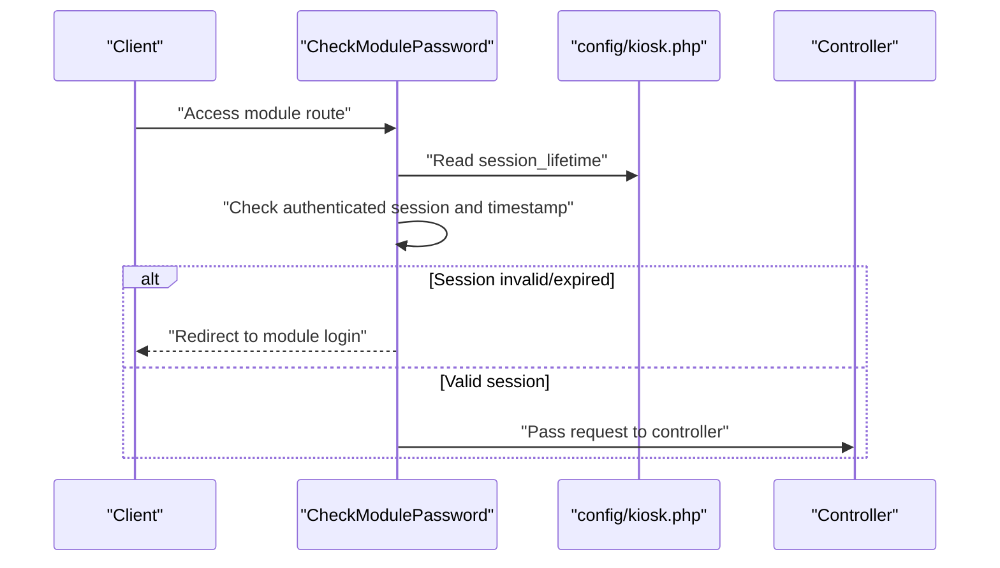
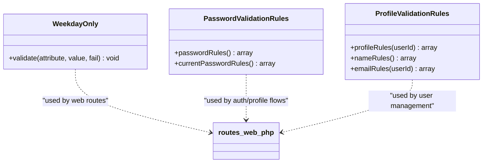
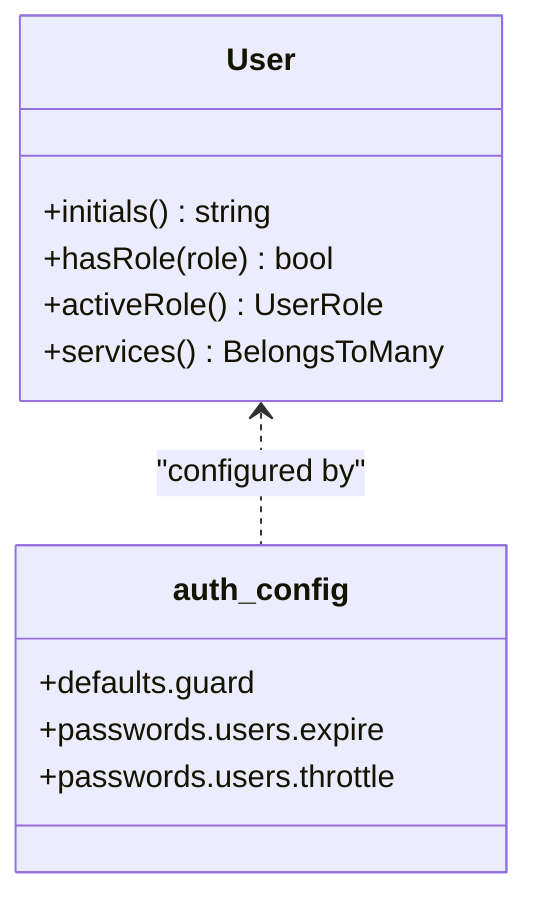
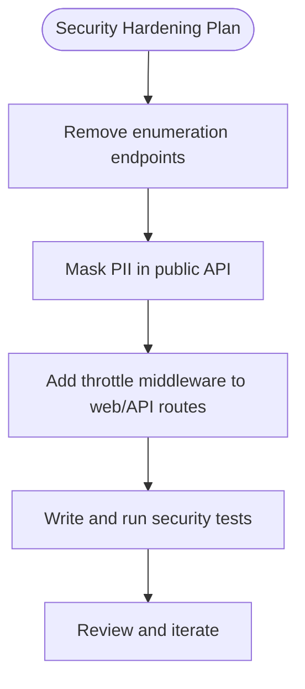
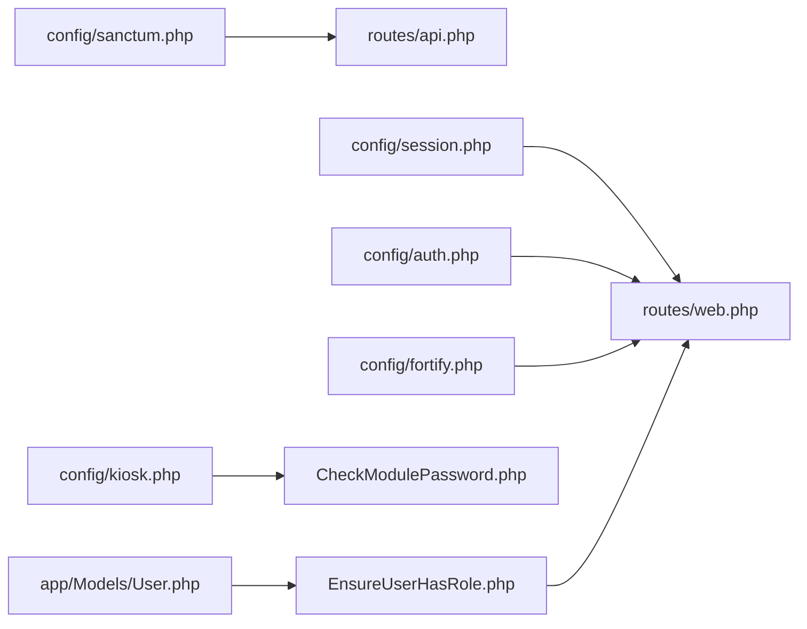

# Security Measures

<cite>
**Referenced Files in This Document**
- [sanctum.php](file://config/sanctum.php)
- [session.php](file://config/session.php)
- [auth.php](file://config/auth.php)
- [fortify.php](file://config/fortify.php)
- [EnsureUserHasRole.php](file://app/Http/Middleware/EnsureUserHasRole.php)
- [CheckModulePassword.php](file://app/Http/Middleware/CheckModulePassword.php)
- [WeekdayOnly.php](file://app/Rules/WeekdayOnly.php)
- [PasswordValidationRules.php](file://app/Concerns/PasswordValidationRules.php)
- [ProfileValidationRules.php](file://app/Concerns/ProfileValidationRules.php)
- [web.php](file://routes/web.php)
- [api.php](file://routes/api.php)
- [User.php](file://app/Models/User.php)
- [kiosk.php](file://config/kiosk.php)
- [2026-03-14-public-module-security-hardening.md](file://docs/superpowers/plans/2026-03-14-public-module-security-hardening.md)
</cite>

## Table of Contents
1. [Introduction](#introduction)
2. [Project Structure](#project-structure)
3. [Core Components](#core-components)
4. [Architecture Overview](#architecture-overview)
5. [Detailed Component Analysis](#detailed-component-analysis)
6. [Dependency Analysis](#dependency-analysis)
7. [Performance Considerations](#performance-considerations)
8. [Troubleshooting Guide](#troubleshooting-guide)
9. [Conclusion](#conclusion)
10. [Appendices](#appendices)

## Introduction
This document consolidates the security posture of the PTSP queue management system with a focus on authentication, session security, CSRF protection, rate limiting, brute-force mitigation, middleware enforcement, input validation, and security testing practices. It explains how Laravel Sanctum, session configuration, Fortify, and custom middleware contribute to defense-in-depth, and outlines practical guidance for XSS, SQL injection, and other common threat mitigations.

## Project Structure
Security-related configurations and components are distributed across configuration files, middleware, validation traits/rules, routes, and models. The following diagram highlights the primary security touchpoints.

**Diagram sources**
- [sanctum.php:1-85](file://config/sanctum.php#L1-L85)
- [session.php:1-218](file://config/session.php#L1-L218)
- [auth.php:1-118](file://config/auth.php#L1-L118)
- [fortify.php:1-158](file://config/fortify.php#L1-L158)
- [kiosk.php:1-8](file://config/kiosk.php#L1-L8)
- [web.php:1-127](file://routes/web.php#L1-L127)
- [api.php:1-23](file://routes/api.php#L1-L23)
- [EnsureUserHasRole.php:1-37](file://app/Http/Middleware/EnsureUserHasRole.php#L1-L37)
- [CheckModulePassword.php:1-68](file://app/Http/Middleware/CheckModulePassword.php#L1-L68)
- [WeekdayOnly.php:1-33](file://app/Rules/WeekdayOnly.php#L1-L33)
- [PasswordValidationRules.php:1-30](file://app/Concerns/PasswordValidationRules.php#L1-L30)
- [ProfileValidationRules.php:1-51](file://app/Concerns/ProfileValidationRules.php#L1-L51)
- [User.php:1-99](file://app/Models/User.php#L1-L99)

**Section sources**
- [sanctum.php:1-85](file://config/sanctum.php#L1-L85)
- [session.php:1-218](file://config/session.php#L1-L218)
- [auth.php:1-118](file://config/auth.php#L1-L118)
- [fortify.php:1-158](file://config/fortify.php#L1-L158)
- [kiosk.php:1-8](file://config/kiosk.php#L1-L8)
- [web.php:1-127](file://routes/web.php#L1-L127)
- [api.php:1-23](file://routes/api.php#L1-L23)
- [EnsureUserHasRole.php:1-37](file://app/Http/Middleware/EnsureUserHasRole.php#L1-L37)
- [CheckModulePassword.php:1-68](file://app/Http/Middleware/CheckModulePassword.php#L1-L68)
- [WeekdayOnly.php:1-33](file://app/Rules/WeekdayOnly.php#L1-L33)
- [PasswordValidationRules.php:1-30](file://app/Concerns/PasswordValidationRules.php#L1-L30)
- [ProfileValidationRules.php:1-51](file://app/Concerns/ProfileValidationRules.php#L1-L51)
- [User.php:1-99](file://app/Models/User.php#L1-L99)

## Core Components
- Laravel Sanctum API token authentication: Configured with stateful domains, guards, expiration, token prefix, and middleware stack including CSRF validation and session authentication.
- Session security: Centralized in session.php with lifetime, encryption, cookie flags (Secure, HttpOnly, SameSite), and partitioned cookies.
- Authentication and password reset: Defined in auth.php with guarded sessions and password reset policies.
- Fortify integration: Provides two-factor authentication, email verification, registration, and configurable rate limiters.
- Role-based access control: Middleware ensures authorized roles for protected routes.
- Module-specific session timeouts: Middleware enforces module password sessions with configurable lifetimes.
- Input validation: Custom rule for weekday-only booking dates and reusable validation traits for passwords and profiles.
- Rate limiting and brute-force protection: Applied at web and API boundaries via throttle middleware and Fortify’s limiters.
- Security testing: Planned hardening includes removal of enumeration endpoints and masking of PII in public APIs.

**Section sources**
- [sanctum.php:18-82](file://config/sanctum.php#L18-L82)
- [session.php:35-202](file://config/session.php#L35-L202)
- [auth.php:18-115](file://config/auth.php#L18-L115)
- [fortify.php:117-120](file://config/fortify.php#L117-L120)
- [EnsureUserHasRole.php:16-35](file://app/Http/Middleware/EnsureUserHasRole.php#L16-L35)
- [CheckModulePassword.php:17-33](file://app/Http/Middleware/CheckModulePassword.php#L17-L33)
- [WeekdayOnly.php:16-31](file://app/Rules/WeekdayOnly.php#L16-L31)
- [PasswordValidationRules.php:15-28](file://app/Concerns/PasswordValidationRules.php#L15-L28)
- [ProfileValidationRules.php:15-49](file://app/Concerns/ProfileValidationRules.php#L15-L49)
- [web.php:24-26](file://routes/web.php#L24-L26)
- [api.php:8-18](file://routes/api.php#L8-L18)
- [2026-03-14-public-module-security-hardening.md:214-244](file://docs/superpowers/plans/2026-03-14-public-module-security-hardening.md#L214-L244)

## Architecture Overview
The security architecture integrates configuration-driven controls with runtime enforcement via middleware and validation. The diagram below maps the flow for authenticated API access and role-gated routes.

**Diagram sources**
- [api.php:20-22](file://routes/api.php#L20-L22)
- [sanctum.php:37-40](file://config/sanctum.php#L37-L40)
- [auth.php:18-21](file://config/auth.php#L18-L21)
- [session.php:172-185](file://config/session.php#L172-L185)

## Detailed Component Analysis

### Laravel Sanctum API Token Authentication
- Stateful domains: Explicitly define trusted origins for stateful cookie authentication.
- Guards: Uses the 'web' guard to authenticate incoming requests.
- Expiration: Tokens do not auto-expire globally; relies on application logic and token attributes.
- Token prefix: Optional prefix to aid secret scanning detection.
- Middleware stack: Includes session authentication, cookie encryption, and CSRF token validation.

**Diagram sources**
- [sanctum.php:37-82](file://config/sanctum.php#L37-L82)
- [api.php:20-22](file://routes/api.php#L20-L22)

**Section sources**
- [sanctum.php:18-82](file://config/sanctum.php#L18-L82)
- [api.php:20-22](file://routes/api.php#L20-L22)

### Session Security Configurations
- Driver and persistence: Database driver is default; encryption flag is configurable.
- Lifetime and idle behavior: Configurable lifetime in minutes; optional immediate expiration on browser close.
- Cookie policy: Secure flag, HttpOnly, SameSite (default 'lax'), optional partitioned cookies.
- Domain/path scoping: Cookie domain and path are configurable.

**Diagram sources**
- [session.php:21-202](file://config/session.php#L21-L202)

**Section sources**
- [session.php:21-218](file://config/session.php#L21-L218)

### CSRF Protection
- CSRF middleware is included in Sanctum’s middleware stack, ensuring token validation for stateful requests.
- Web forms rely on CSRF tokens; API requests use bearer tokens.

**Section sources**
- [sanctum.php:78-82](file://config/sanctum.php#L78-L82)

### Rate Limiting and Brute Force Protection
- Fortify limiters: Default throttling for login and two-factor authentication attempts.
- Web routes: Public booking and lookup endpoints apply throttle middleware to mitigate abuse.
- API routes: Public endpoints enforce throttling to prevent scraping and enumeration.
- Module login routes: Kiosk and TV display login endpoints are rate-limited to deter brute-force.

**Diagram sources**
- [fortify.php:117-120](file://config/fortify.php#L117-L120)
- [web.php:24-26](file://routes/web.php#L24-L26)
- [api.php:8-18](file://routes/api.php#L8-L18)

**Section sources**
- [fortify.php:117-120](file://config/fortify.php#L117-L120)
- [web.php:24-26](file://routes/web.php#L24-L26)
- [api.php:8-18](file://routes/api.php#L8-L18)

### Security Middleware
- EnsureUserHasRole: Enforces role-based access control; denies unauthorized users with 403 and rejects unauthenticated requests with 401.
- CheckModulePassword: Validates module-specific session and timestamp; enforces session lifetime and redirects to login when expired.

**Diagram sources**
- [CheckModulePassword.php:17-33](file://app/Http/Middleware/CheckModulePassword.php#L17-L33)
- [kiosk.php:6-6](file://config/kiosk.php#L6-L6)

**Section sources**
- [EnsureUserHasRole.php:16-35](file://app/Http/Middleware/EnsureUserHasRole.php#L16-L35)
- [CheckModulePassword.php:17-33](file://app/Http/Middleware/CheckModulePassword.php#L17-L33)
- [kiosk.php:6-6](file://config/kiosk.php#L6-L6)

### Input Validation Rules
- WeekdayOnly: Custom validation rule that rejects weekend dates for booking.
- PasswordValidationRules: Standardized password rules including confirmation and current password checks.
- ProfileValidationRules: Reusable rules for name and email uniqueness with optional ignore for updates.

**Diagram sources**
- [WeekdayOnly.php:9-32](file://app/Rules/WeekdayOnly.php#L9-L32)
- [PasswordValidationRules.php:8-29](file://app/Concerns/PasswordValidationRules.php#L8-L29)
- [ProfileValidationRules.php:8-50](file://app/Concerns/ProfileValidationRules.php#L8-L50)
- [web.php:1-127](file://routes/web.php#L1-L127)

**Section sources**
- [WeekdayOnly.php:16-31](file://app/Rules/WeekdayOnly.php#L16-L31)
- [PasswordValidationRules.php:15-28](file://app/Concerns/PasswordValidationRules.php#L15-L28)
- [ProfileValidationRules.php:15-49](file://app/Concerns/ProfileValidationRules.php#L15-L49)

### Authentication and Identity
- Authentication defaults: Session-based guard with Eloquent provider.
- Password reset: Configurable expiry and throttle for reset tokens.
- User model: Hidden sensitive fields, hashed passwords, and two-factor authentication support.

**Diagram sources**
- [User.php:14-99](file://app/Models/User.php#L14-L99)
- [auth.php:18-115](file://config/auth.php#L18-L115)

**Section sources**
- [auth.php:18-115](file://config/auth.php#L18-L115)
- [User.php:36-55](file://app/Models/User.php#L36-L55)

### Security Testing Practices and Vulnerability Prevention Strategies
- Planned hardening removes unauthenticated enumeration endpoints and masks PII in public API responses.
- Tests verify rate limiting for module logins and public web submissions.
- Recommended practices include validating CSRF tokens, enforcing strict SameSite policies, and applying rate limits consistently across endpoints.

**Diagram sources**
- [2026-03-14-public-module-security-hardening.md:214-244](file://docs/superpowers/plans/2026-03-14-public-module-security-hardening.md#L214-L244)
- [2026-03-14-public-module-security-hardening.md:520-572](file://docs/superpowers/plans/2026-03-14-public-module-security-hardening.md#L520-L572)

**Section sources**
- [2026-03-14-public-module-security-hardening.md:214-244](file://docs/superpowers/plans/2026-03-14-public-module-security-hardening.md#L214-L244)
- [2026-03-14-public-module-security-hardening.md:520-572](file://docs/superpowers/plans/2026-03-14-public-module-security-hardening.md#L520-L572)

## Dependency Analysis
The following diagram illustrates how security components depend on configuration and middleware.

**Diagram sources**
- [sanctum.php:1-85](file://config/sanctum.php#L1-L85)
- [session.php:1-218](file://config/session.php#L1-L218)
- [auth.php:1-118](file://config/auth.php#L1-L118)
- [fortify.php:1-158](file://config/fortify.php#L1-L158)
- [kiosk.php:1-8](file://config/kiosk.php#L1-L8)
- [web.php:1-127](file://routes/web.php#L1-L127)
- [api.php:1-23](file://routes/api.php#L1-L23)
- [EnsureUserHasRole.php:1-37](file://app/Http/Middleware/EnsureUserHasRole.php#L1-L37)
- [CheckModulePassword.php:1-68](file://app/Http/Middleware/CheckModulePassword.php#L1-L68)
- [User.php:1-99](file://app/Models/User.php#L1-L99)

**Section sources**
- [sanctum.php:1-85](file://config/sanctum.php#L1-L85)
- [session.php:1-218](file://config/session.php#L1-L218)
- [auth.php:1-118](file://config/auth.php#L1-L118)
- [fortify.php:1-158](file://config/fortify.php#L1-L158)
- [kiosk.php:1-8](file://config/kiosk.php#L1-L8)
- [web.php:1-127](file://routes/web.php#L1-L127)
- [api.php:1-23](file://routes/api.php#L1-L23)
- [EnsureUserHasRole.php:1-37](file://app/Http/Middleware/EnsureUserHasRole.php#L1-L37)
- [CheckModulePassword.php:1-68](file://app/Http/Middleware/CheckModulePassword.php#L1-L68)
- [User.php:1-99](file://app/Models/User.php#L1-L99)

## Performance Considerations
- Session storage: Database-backed sessions incur IO overhead; consider Redis for high-throughput deployments.
- Rate limiting: Use centralized stores (Redis) for accurate counters across instances.
- Sanctum token validation: Prefer bearer tokens for stateless APIs to reduce session lookups.
- Validation rules: Keep custom rules efficient; avoid expensive operations per request.

## Troubleshooting Guide
- 401 Unauthorized on API calls: Verify Sanctum guard configuration and presence of Authorization header.
- 403 Forbidden on role-gated routes: Confirm user role assignment and EnsureUserHasRole middleware invocation.
- Session timeout in modules: Adjust module session lifetime in kiosk configuration and ensure timestamp checks.
- CSRF failures: Ensure CSRF middleware is active and forms include tokens; for API, use bearer tokens instead.
- Rate limiting errors: Confirm throttle middleware is applied and Redis is configured for shared counters.

**Section sources**
- [sanctum.php:37-82](file://config/sanctum.php#L37-L82)
- [EnsureUserHasRole.php:16-35](file://app/Http/Middleware/EnsureUserHasRole.php#L16-L35)
- [CheckModulePassword.php:17-33](file://app/Http/Middleware/CheckModulePassword.php#L17-L33)
- [kiosk.php:6-6](file://config/kiosk.php#L6-L6)
- [web.php:24-26](file://routes/web.php#L24-L26)
- [api.php:20-22](file://routes/api.php#L20-L22)

## Conclusion
The PTSP system employs a layered security approach combining Sanctum for API authentication, robust session configuration, CSRF safeguards, role-based middleware, and validated input constraints. Planned hardening further strengthens defenses against enumeration and brute-force attacks. Consistent application of rate limiting, secure cookie settings, and strong validation rules ensures resilience against common threats.

## Appendices
- XSS prevention: Enforce Content-Security-Policy headers, escape output in views, and sanitize user-generated content.
- SQL injection protection: Use Eloquent ORM, parameterized queries, and avoid raw SQL; validate and whitelist inputs.
- Additional recommendations: Enable two-factor authentication, rotate secrets regularly, monitor logs, and conduct periodic security audits.