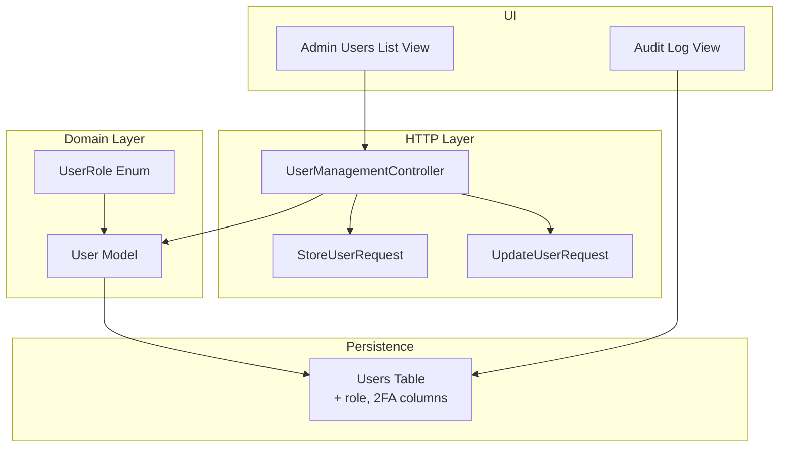
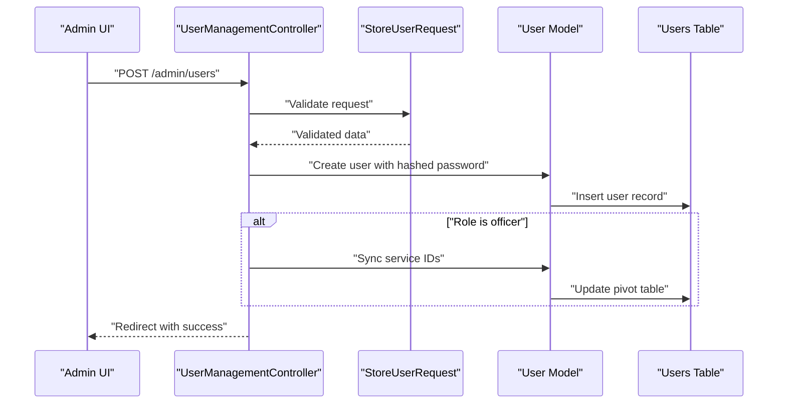
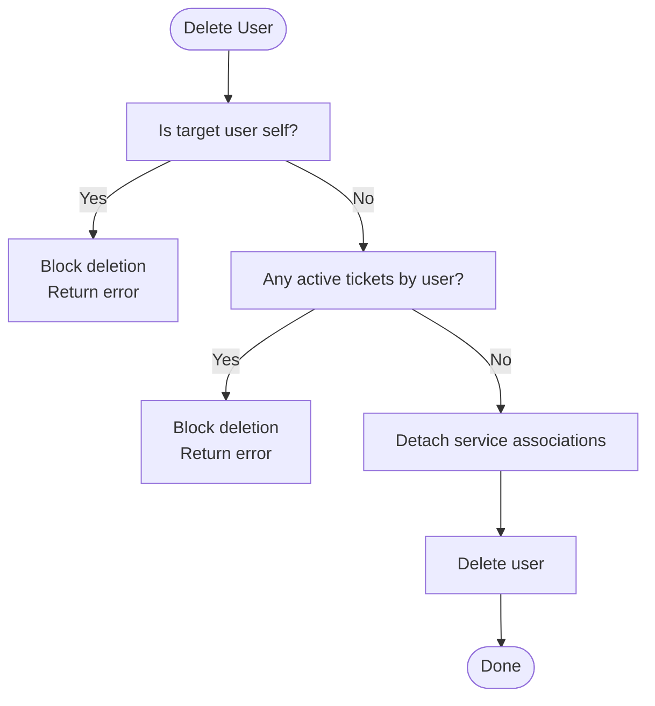
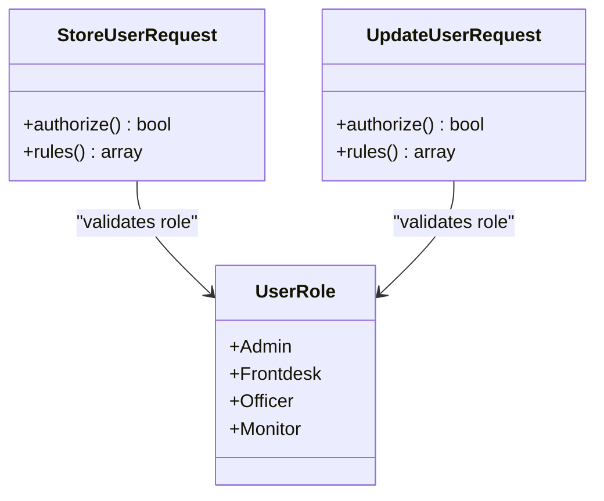
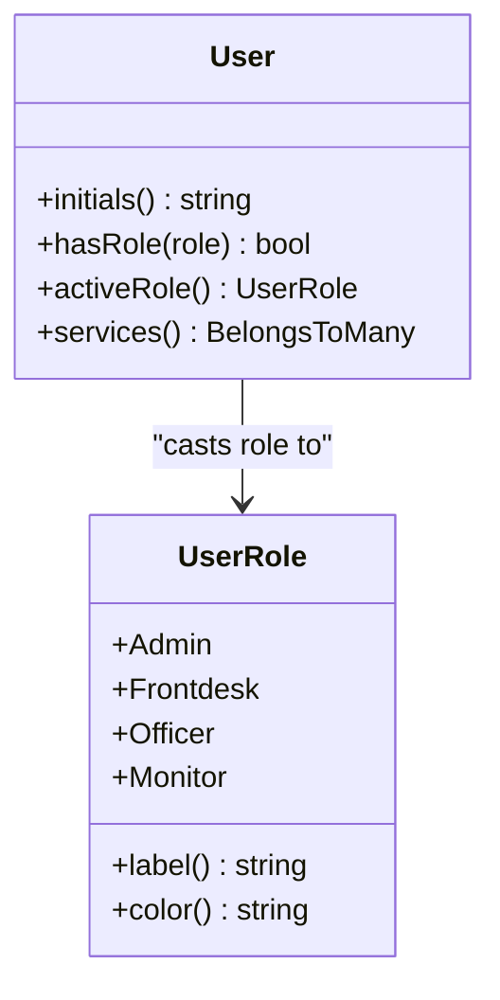
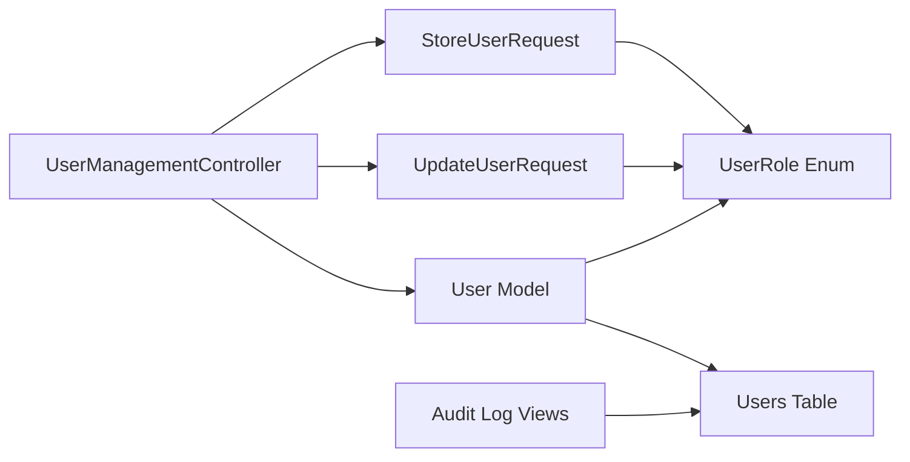

# User Management

<cite>
**Referenced Files in This Document**
- [UserManagementController.php](file://app/Http/Controllers/Admin/UserManagementController.php)
- [StoreUserRequest.php](file://app/Http/Requests/StoreUserRequest.php)
- [UpdateUserRequest.php](file://app/Http/Requests/UpdateUserRequest.php)
- [User.php](file://app/Models/User.php)
- [UserRole.php](file://app/Enums/UserRole.php)
- [ResetUserPassword.php](file://app/Actions/Fortify/ResetUserPassword.php)
- [PasswordValidationRules.php](file://app/Concerns/PasswordValidationRules.php)
- [2026_03_06_024605_add_role_to_users_table.php](file://database/migrations/2026_03_06_024605_add_role_to_users_table.php)
- [2025_08_14_170933_add_two_factor_columns_to_users_table.php](file://database/migrations/2025_08_14_170933_add_two_factor_columns_to_users_table.php)
- [index.blade.php](file://resources/views/pages/admin/users/index.blade.php)
- [audit/index.blade.php](file://resources/views/pages/laporan/audit/index.blade.php)
- [PRODUCT_SPECIFICATION.md](file://docs/PRODUCT_SPECIFICATION.md)
</cite>

## Table of Contents
1. [Introduction](#introduction)
2. [Project Structure](#project-structure)
3. [Core Components](#core-components)
4. [Architecture Overview](#architecture-overview)
5. [Detailed Component Analysis](#detailed-component-analysis)
6. [Dependency Analysis](#dependency-analysis)
7. [Performance Considerations](#performance-considerations)
8. [Troubleshooting Guide](#troubleshooting-guide)
9. [Conclusion](#conclusion)
10. [Appendices](#appendices)

## Introduction
This document provides comprehensive documentation for user management functionality. It covers controller methods for CRUD operations, user creation and role assignment, validation rules and business logic, profile management, password updates, two-factor authentication configuration, user search and filtering capabilities, bulk operations, activation/deactivation workflows, administrative controls, data privacy and GDPR considerations, audit logging for user activities, and examples of programmatic user management and integration with external identity systems.

## Project Structure
User management spans several layers:
- Controllers handle HTTP requests and orchestrate operations.
- Requests define validation rules for creating and updating users.
- Models encapsulate user data, roles, and relationships.
- Migrations define schema changes for roles and two-factor authentication.
- Views render admin UI for user listing and management.
- Policies and middleware enforce role-based access control.
- Audit logging captures significant user-related actions.

**Diagram sources**
- [UserManagementController.php:17-102](file://app/Http/Controllers/Admin/UserManagementController.php#L17-L102)
- [StoreUserRequest.php:9-39](file://app/Http/Requests/StoreUserRequest.php#L9-L39)
- [UpdateUserRequest.php:9-45](file://app/Http/Requests/UpdateUserRequest.php#L9-L45)
- [User.php:14-99](file://app/Models/User.php#L14-L99)
- [UserRole.php:5-32](file://app/Enums/UserRole.php#L5-L32)
- [2026_03_06_024605_add_role_to_users_table.php:14-16](file://database/migrations/2026_03_06_024605_add_role_to_users_table.php#L14-L16)
- [2025_08_14_170933_add_two_factor_columns_to_users_table.php:14-18](file://database/migrations/2025_08_14_170933_add_two_factor_columns_to_users_table.php#L14-L18)
- [index.blade.php](file://resources/views/pages/admin/users/index.blade.php)
- [audit/index.blade.php](file://resources/views/pages/laporan/audit/index.blade.php)

**Section sources**
- [UserManagementController.php:17-102](file://app/Http/Controllers/Admin/UserManagementController.php#L17-L102)
- [StoreUserRequest.php:9-39](file://app/Http/Requests/StoreUserRequest.php#L9-L39)
- [UpdateUserRequest.php:9-45](file://app/Http/Requests/UpdateUserRequest.php#L9-L45)
- [User.php:14-99](file://app/Models/User.php#L14-L99)
- [UserRole.php:5-32](file://app/Enums/UserRole.php#L5-L32)
- [2026_03_06_024605_add_role_to_users_table.php:14-16](file://database/migrations/2026_03_06_024605_add_role_to_users_table.php#L14-L16)
- [2025_08_14_170933_add_two_factor_columns_to_users_table.php:14-18](file://database/migrations/2025_08_14_170933_add_two_factor_columns_to_users_table.php#L14-L18)
- [index.blade.php](file://resources/views/pages/admin/users/index.blade.php)
- [audit/index.blade.php](file://resources/views/pages/laporan/audit/index.blade.php)

## Core Components
- UserManagementController: Implements index, store, update, and destroy operations with role-aware logic and service assignments for officers.
- StoreUserRequest: Validates user creation inputs including name, email uniqueness, role enumeration, password length, and optional service associations.
- UpdateUserRequest: Validates user updates with unique email exclusion for the current user, role enumeration, and optional service arrays.
- User Model: Defines fillable attributes, hidden fields, casts including role enum, service relationship, and helper methods for roles and initials.
- UserRole Enum: Provides role constants, labels, and colors for UI rendering.
- Password Reset Action and Validation Trait: Centralized password validation rules and reset logic.
- Migrations: Add role column to users and two-factor authentication columns.

Key responsibilities:
- Enforce role-based access control and administrative safeguards.
- Manage service associations for officers.
- Maintain data privacy by hiding sensitive fields.
- Provide robust validation and error handling.

**Section sources**
- [UserManagementController.php:17-102](file://app/Http/Controllers/Admin/UserManagementController.php#L17-L102)
- [StoreUserRequest.php:9-39](file://app/Http/Requests/StoreUserRequest.php#L9-L39)
- [UpdateUserRequest.php:9-45](file://app/Http/Requests/UpdateUserRequest.php#L9-L45)
- [User.php:14-99](file://app/Models/User.php#L14-L99)
- [UserRole.php:5-32](file://app/Enums/UserRole.php#L5-L32)
- [ResetUserPassword.php:10-30](file://app/Actions/Fortify/ResetUserPassword.php#L10-L30)
- [PasswordValidationRules.php:8-30](file://app/Concerns/PasswordValidationRules.php#L8-L30)
- [2026_03_06_024605_add_role_to_users_table.php:14-16](file://database/migrations/2026_03_06_024605_add_role_to_users_table.php#L14-L16)
- [2025_08_14_170933_add_two_factor_columns_to_users_table.php:14-18](file://database/migrations/2025_08_14_170933_add_two_factor_columns_to_users_table.php#L14-L18)

## Architecture Overview
The user management subsystem follows a layered architecture:
- HTTP requests are validated by dedicated FormRequest classes.
- Controllers coordinate model operations and relationships.
- Models encapsulate domain logic and persistence.
- Views present admin interfaces for listing and managing users.
- Audit logging captures user-related activities.

**Diagram sources**
- [UserManagementController.php:35-53](file://app/Http/Controllers/Admin/UserManagementController.php#L35-L53)
- [StoreUserRequest.php:24-37](file://app/Http/Requests/StoreUserRequest.php#L24-L37)
- [User.php:14-99](file://app/Models/User.php#L14-L99)

## Detailed Component Analysis

### UserManagementController
Responsibilities:
- Index: Lists users with related services and active services for UI context.
- Store: Creates a new user, hashes the password, assigns role, and syncs services for officers.
- Update: Updates user profile and role; manages service associations for officers; detaches services otherwise.
- Destroy: Safeguards self-deletion and prevents deletion of users with active tickets; cleans up service associations before deletion.

Business logic highlights:
- Role-aware service synchronization for officers.
- Self-protection against accidental self-deletion.
- Prevention of deletion when user has active queue tickets.

**Diagram sources**
- [UserManagementController.php:76-100](file://app/Http/Controllers/Admin/UserManagementController.php#L76-L100)

**Section sources**
- [UserManagementController.php:19-33](file://app/Http/Controllers/Admin/UserManagementController.php#L19-L33)
- [UserManagementController.php:35-53](file://app/Http/Controllers/Admin/UserManagementController.php#L35-L53)
- [UserManagementController.php:55-74](file://app/Http/Controllers/Admin/UserManagementController.php#L55-L74)
- [UserManagementController.php:76-100](file://app/Http/Controllers/Admin/UserManagementController.php#L76-L100)

### StoreUserRequest and UpdateUserRequest
Validation rules:
- Name: Required, string, max length.
- Email: Required, email format, max length, unique on create; on update, unique excluding current user ID.
- Role: Required, must be one of the defined UserRole enum values.
- Password: Required on create, minimum length.
- Services: Optional array of integers that exist as service IDs.

Business logic:
- Role enforcement ensures only valid roles are accepted.
- Service association is optional and enforced only for specific roles during creation/update.

**Diagram sources**
- [StoreUserRequest.php:9-39](file://app/Http/Requests/StoreUserRequest.php#L9-L39)
- [UpdateUserRequest.php:9-45](file://app/Http/Requests/UpdateUserRequest.php#L9-L45)
- [UserRole.php:5-32](file://app/Enums/UserRole.php#L5-L32)

**Section sources**
- [StoreUserRequest.php:24-37](file://app/Http/Requests/StoreUserRequest.php#L24-L37)
- [UpdateUserRequest.php:24-42](file://app/Http/Requests/UpdateUserRequest.php#L24-L42)

### User Model and UserRole Enum
Model highlights:
- Fillable attributes include name, email, role, and password.
- Hidden attributes include sensitive fields for security.
- Casts role to enum and password to hashed.
- Helper methods for role checks and active role resolution (including admin role switching).
- Relationship to services via belongsToMany with timestamps.

Enum highlights:
- Provides role constants, labels, and colors for UI.

**Diagram sources**
- [User.php:14-99](file://app/Models/User.php#L14-L99)
- [UserRole.php:5-32](file://app/Enums/UserRole.php#L5-L32)

**Section sources**
- [User.php:24-55](file://app/Models/User.php#L24-L55)
- [User.php:69-97](file://app/Models/User.php#L69-L97)
- [UserRole.php:12-30](file://app/Enums/UserRole.php#L12-L30)

### Password Management
Password reset action and validation rules:
- ResetUserPassword validates incoming password using centralized rules and persists it.
- PasswordValidationRules trait defines password and current password validation rules.

Integration points:
- Can be invoked by admin to reset a user’s password programmatically.
- Ensures strong password policies and confirmation.

**Section sources**
- [ResetUserPassword.php:19-28](file://app/Actions/Fortify/ResetUserPassword.php#L19-L28)
- [PasswordValidationRules.php:15-28](file://app/Concerns/PasswordValidationRules.php#L15-L28)

### Two-Factor Authentication Configuration
Schema:
- Two-factor columns are added to the users table to support secret storage, recovery codes, and confirmation timestamps.

Model integration:
- User model uses TwoFactorAuthenticatable trait enabling two-factor capabilities.

Operational guidance:
- Administrators can configure two-factor settings for users via UI flows.
- Recovery codes and secret management are handled by the underlying authentication system.

**Section sources**
- [2025_08_14_170933_add_two_factor_columns_to_users_table.php:14-18](file://database/migrations/2025_08_14_170933_add_two_factor_columns_to_users_table.php#L14-L18)
- [User.php:12-17](file://app/Models/User.php#L12-L17)

### User Search, Filtering, and Bulk Operations
Current implementation:
- Listing retrieves all users ordered by name and eager loads services.
- No explicit search or filter parameters are processed in the controller index method.
- Bulk operations are not implemented in the controller.

Recommendations:
- Add query parameters for name/email filters and pagination.
- Introduce bulk actions (activate/deactivate, delete) with confirmation and audit logging.
- Implement CSV export for user listings.

**Section sources**
- [UserManagementController.php:19-33](file://app/Http/Controllers/Admin/UserManagementController.php#L19-L33)

### Activation/Deactivation Workflows and Administrative Controls
Observations:
- The current destroy method blocks deletion under specific conditions but does not expose explicit activation/deactivation toggles.
- Administrative controls are role-based via enums and middleware.

Proposed enhancements:
- Add activate/deactivate endpoints with audit logging.
- Implement soft deletes or status field for deactivated users.
- Provide admin role switching and session-based active role resolution.

**Section sources**
- [UserManagementController.php:76-100](file://app/Http/Controllers/Admin/UserManagementController.php#L76-L100)
- [User.php:81-91](file://app/Models/User.php#L81-L91)

### Data Privacy and GDPR Compliance Considerations
- Hidden sensitive fields in the User model prevent unintentional exposure.
- Passwords are hashed via model casts.
- Two-factor secrets and recovery codes are hidden.
- Audit logging records significant user actions for traceability.

Recommendations:
- Implement data retention policies and right-to-be-forgotten procedures.
- Add consent management for data processing.
- Ensure secure deletion of personal data and logs.

**Section sources**
- [User.php:36-41](file://app/Models/User.php#L36-L41)
- [User.php:50-54](file://app/Models/User.php#L50-L54)
- [audit/index.blade.php:104-130](file://resources/views/pages/laporan/audit/index.blade.php#L104-L130)

### Audit Logging for User Activities
- Product specification documents audit trail requirements for queue-related activities.
- Audit logs capture actor, timestamp, action, location, and metadata.
- Apply similar patterns for user management actions (create, update, delete, password reset, 2FA enable/disable).

**Section sources**
- [PRODUCT_SPECIFICATION.md:660-677](file://docs/PRODUCT_SPECIFICATION.md#L660-L677)

### Programmatic User Management and External Identity Integration
Programmatic examples:
- Create user: Use StoreUserRequest validated data to instantiate and persist a User model.
- Update user: Use UpdateUserRequest validated data to update attributes and manage service associations.
- Reset password: Invoke ResetUserPassword action with validated password input.
- Configure 2FA: Use model relationships and authentication traits to enable/disable two-factor.

External identity integration:
- Integrate with external identity providers for user provisioning and synchronization.
- Map external roles to internal UserRole enum values.
- Synchronize service associations for officers based on external entitlements.

## Dependency Analysis

**Diagram sources**
- [UserManagementController.php:7-15](file://app/Http/Controllers/Admin/UserManagementController.php#L7-L15)
- [StoreUserRequest.php:5-7](file://app/Http/Requests/StoreUserRequest.php#L5-L7)
- [UpdateUserRequest.php:5-7](file://app/Http/Requests/UpdateUserRequest.php#L5-L7)
- [User.php:5-12](file://app/Models/User.php#L5-L12)
- [UserRole.php:5](file://app/Enums/UserRole.php#L5)
- [audit/index.blade.php](file://resources/views/pages/laporan/audit/index.blade.php)

**Section sources**
- [UserManagementController.php:7-15](file://app/Http/Controllers/Admin/UserManagementController.php#L7-L15)
- [StoreUserRequest.php:5-7](file://app/Http/Requests/StoreUserRequest.php#L5-L7)
- [UpdateUserRequest.php:5-7](file://app/Http/Requests/UpdateUserRequest.php#L5-L7)
- [User.php:5-12](file://app/Models/User.php#L5-L12)
- [UserRole.php:5](file://app/Enums/UserRole.php#L5)

## Performance Considerations
- Use eager loading for related services in listing operations to avoid N+1 queries.
- Add database indexes on frequently filtered columns (email, role).
- Paginate large user lists to reduce memory usage.
- Cache role and service metadata where appropriate.

## Troubleshooting Guide
Common issues and resolutions:
- Validation failures on create/update: Ensure email uniqueness and role enumeration match supported values.
- Service association not applied: Verify role is set to officer; only officers receive service sync.
- Deletion blocked: Confirm user is not self and has no active tickets.
- Password reset errors: Validate password meets policy requirements and confirmation matches.

**Section sources**
- [StoreUserRequest.php:26-36](file://app/Http/Requests/StoreUserRequest.php#L26-L36)
- [UpdateUserRequest.php:28-42](file://app/Http/Requests/UpdateUserRequest.php#L28-L42)
- [UserManagementController.php:78-93](file://app/Http/Controllers/Admin/UserManagementController.php#L78-L93)
- [PasswordValidationRules.php:15-28](file://app/Concerns/PasswordValidationRules.php#L15-L28)

## Conclusion
The user management subsystem provides a solid foundation for CRUD operations, role-based access control, and service associations. Enhancements in search/filtering, bulk operations, activation/deactivation workflows, and comprehensive audit logging will further strengthen administrative capabilities while maintaining data privacy and compliance.

## Appendices
- UI References:
  - Admin users listing view: [index.blade.php](file://resources/views/pages/admin/users/index.blade.php)
  - Audit log view: [audit/index.blade.php](file://resources/views/pages/laporan/audit/index.blade.php)
- Schema References:
  - Add role to users: [2026_03_06_024605_add_role_to_users_table.php](file://database/migrations/2026_03_06_024605_add_role_to_users_table.php)
  - Add two-factor columns: [2025_08_14_170933_add_two_factor_columns_to_users_table.php](file://database/migrations/2025_08_14_170933_add_two_factor_columns_to_users_table.php)
- Specification Reference:
  - Audit and logging requirements: [PRODUCT_SPECIFICATION.md](file://docs/PRODUCT_SPECIFICATION.md)