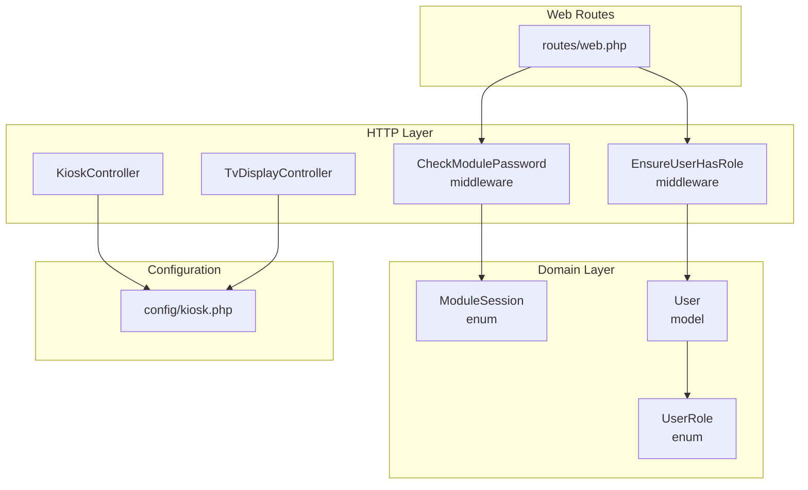
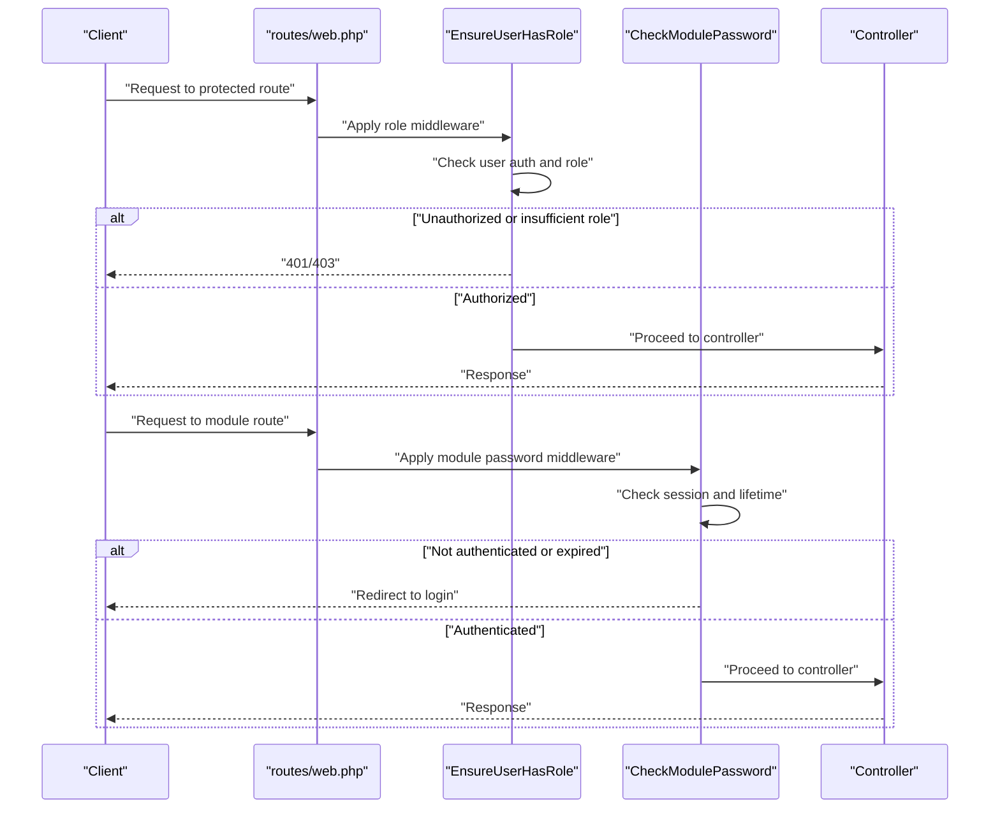
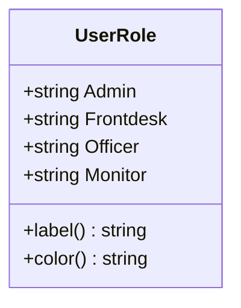
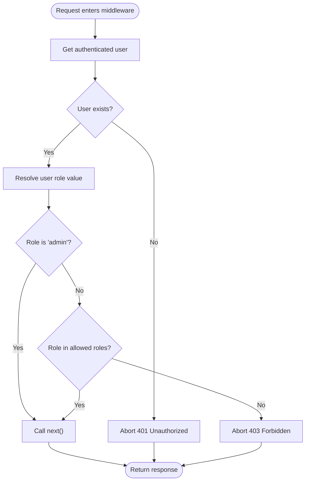
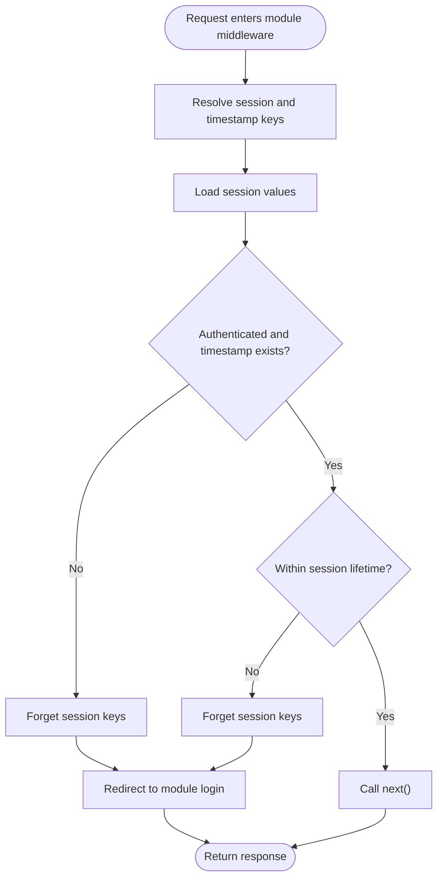
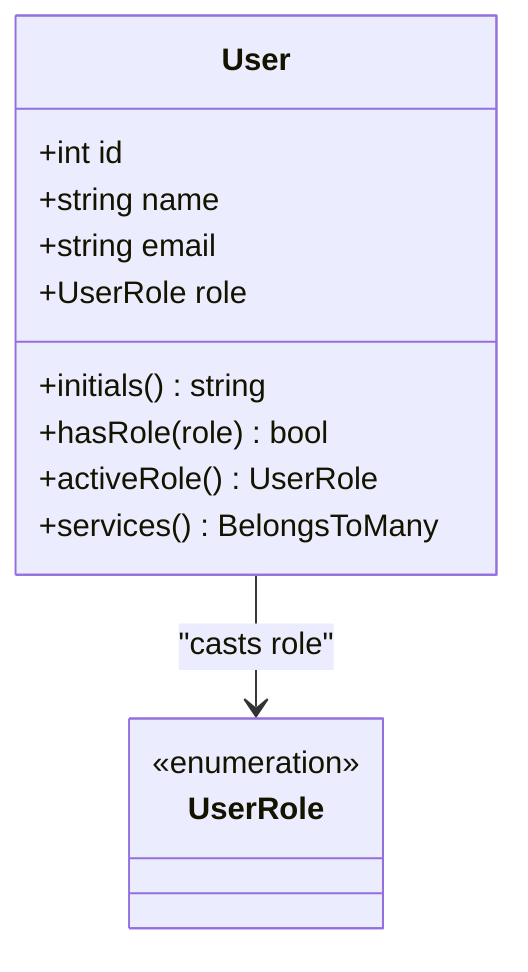
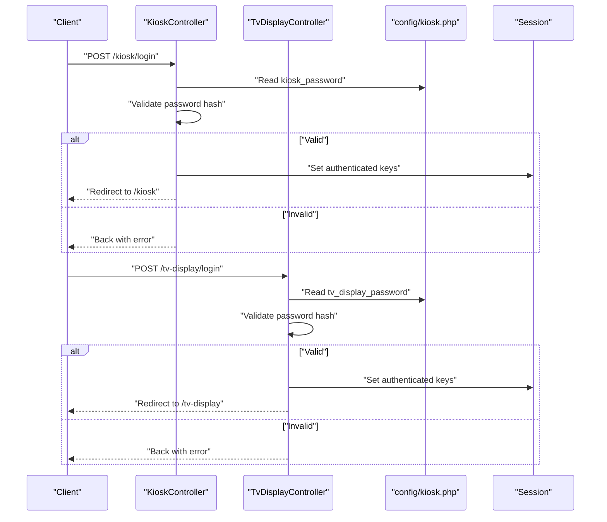
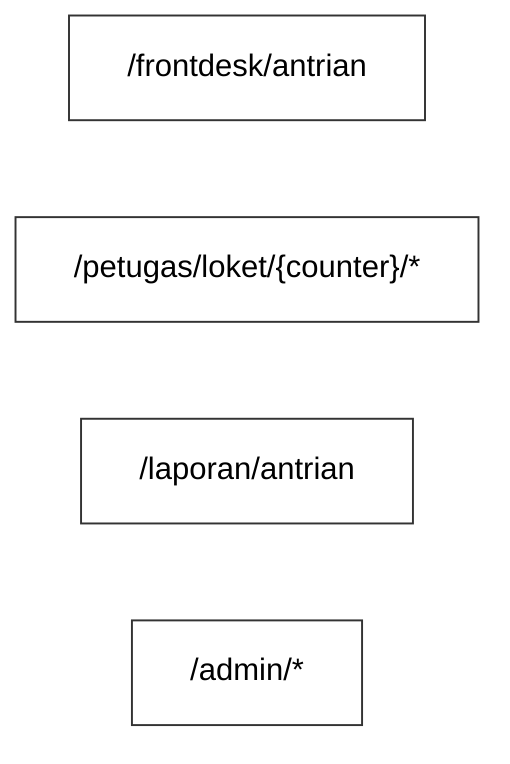
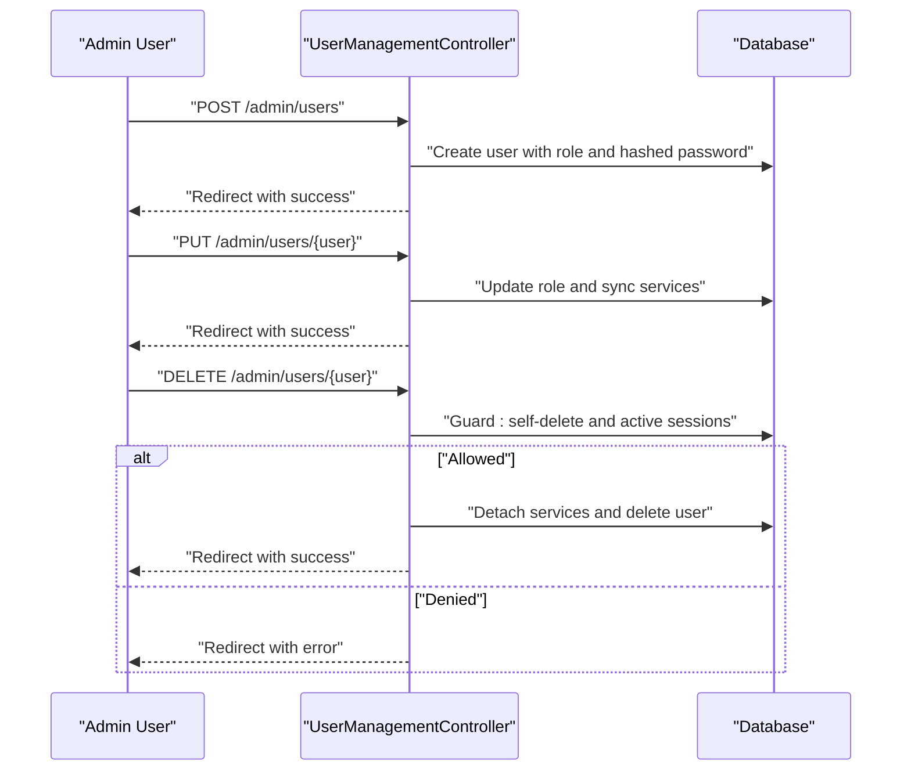
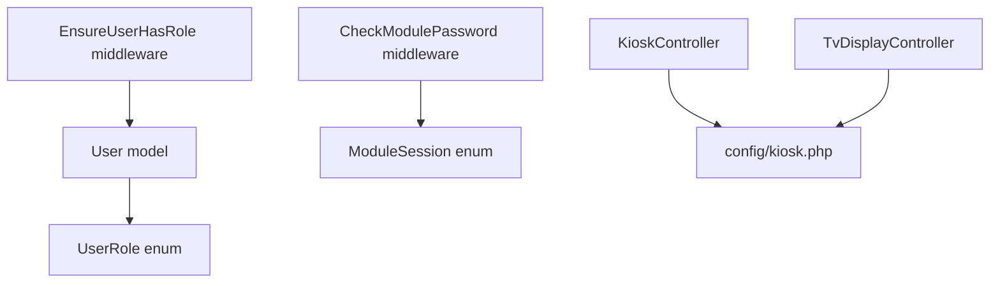

# User Roles and Permissions

<cite>
**Referenced Files in This Document**
- [UserRole.php](file://app/Enums/UserRole.php)
- [EnsureUserHasRole.php](file://app/Http/Middleware/EnsureUserHasRole.php)
- [CheckModulePassword.php](file://app/Http/Middleware/CheckModulePassword.php)
- [ModuleSession.php](file://app/Enums/ModuleSession.php)
- [User.php](file://app/Models/User.php)
- [2026_03_06_024605_add_role_to_users_table.php](file://database/migrations/2026_03_06_024605_add_role_to_users_table.php)
- [web.php](file://routes/web.php)
- [app.php](file://bootstrap/app.php)
- [UserManagementController.php](file://app/Http/Controllers/Admin/UserManagementController.php)
- [KioskController.php](file://app/Http/Controllers/KioskController.php)
- [TvDisplayController.php](file://app/Http/Controllers/TvDisplayController.php)
- [kiosk.php](file://config/kiosk.php)
- [CreateNewUser.php](file://app/Actions/Fortify/CreateNewUser.php)
</cite>

## Table of Contents
1. [Introduction](#introduction)
2. [Project Structure](#project-structure)
3. [Core Components](#core-components)
4. [Architecture Overview](#architecture-overview)
5. [Detailed Component Analysis](#detailed-component-analysis)
6. [Dependency Analysis](#dependency-analysis)
7. [Performance Considerations](#performance-considerations)
8. [Troubleshooting Guide](#troubleshooting-guide)
9. [Conclusion](#conclusion)

## Introduction
This document describes the user role and permission system used by the application. It covers the role enumeration, middleware enforcement mechanisms, module-specific authentication, and administrative user management. The system supports four primary roles: Admin, Frontdesk, Officer, and Monitor. Administrative users can manage roles and permissions through dedicated routes and controllers, while operational modules (Kiosk and TV Display) use a separate password-based session mechanism.

## Project Structure
The role and permission system spans several layers:
- Enumerations define role values and metadata
- Middleware enforces role-based access control for authenticated routes
- Controllers implement module-specific authentication and business logic
- Routes group endpoints by role requirements
- Models and migrations define the persisted role data
- Configuration governs module passwords and session lifetimes

**Diagram sources**
- [web.php:1-127](file://routes/web.php#L1-L127)
- [EnsureUserHasRole.php:1-37](file://app/Http/Middleware/EnsureUserHasRole.php#L1-L37)
- [CheckModulePassword.php:1-68](file://app/Http/Middleware/CheckModulePassword.php#L1-L68)
- [UserRole.php:1-32](file://app/Enums/UserRole.php#L1-L32)
- [ModuleSession.php:1-15](file://app/Enums/ModuleSession.php#L1-L15)
- [User.php:1-99](file://app/Models/User.php#L1-L99)
- [KioskController.php:1-144](file://app/Http/Controllers/KioskController.php#L1-L144)
- [TvDisplayController.php:1-144](file://app/Http/Controllers/TvDisplayController.php#L1-L144)
- [kiosk.php:1-8](file://config/kiosk.php#L1-L8)

**Section sources**
- [web.php:1-127](file://routes/web.php#L1-L127)
- [app.php:1-31](file://bootstrap/app.php#L1-L31)

## Core Components
- UserRole enum defines the supported roles and provides helper methods for labels and colors.
- EnsureUserHasRole middleware enforces role-based access control for authenticated routes.
- CheckModulePassword middleware enforces module-specific password authentication and session lifetime.
- User model persists role data and exposes helper methods for role checks and active role resolution.
- Migration adds the role column to the users table with a default value.
- Controllers implement module login/logout flows and maintain module-specific session keys.

**Section sources**
- [UserRole.php:1-32](file://app/Enums/UserRole.php#L1-L32)
- [EnsureUserHasRole.php:1-37](file://app/Http/Middleware/EnsureUserHasRole.php#L1-L37)
- [CheckModulePassword.php:1-68](file://app/Http/Middleware/CheckModulePassword.php#L1-L68)
- [User.php:1-99](file://app/Models/User.php#L1-L99)
- [2026_03_06_024605_add_role_to_users_table.php:1-29](file://database/migrations/2026_03_06_024605_add_role_to_users_table.php#L1-L29)

## Architecture Overview
The system enforces two distinct access control mechanisms:
- Role-based access control (RBAC) for authenticated routes using the EnsureUserHasRole middleware.
- Module password authentication for unauthenticated modules (Kiosk and TV Display) using CheckModulePassword middleware.

**Diagram sources**
- [web.php:28-90](file://routes/web.php#L28-L90)
- [EnsureUserHasRole.php:16-35](file://app/Http/Middleware/EnsureUserHasRole.php#L16-L35)
- [CheckModulePassword.php:17-33](file://app/Http/Middleware/CheckModulePassword.php#L17-L33)

## Detailed Component Analysis

### UserRole Enum
The UserRole enum defines the supported roles and provides convenience methods for labels and colors. The enum values are mapped to string identifiers stored in the database.

**Diagram sources**
- [UserRole.php:5-31](file://app/Enums/UserRole.php#L5-L31)

**Section sources**
- [UserRole.php:1-32](file://app/Enums/UserRole.php#L1-L32)

### EnsureUserHasRole Middleware
The EnsureUserHasRole middleware enforces role-based access control:
- Denies access if the user is not authenticated (401).
- Allows access for Admin users regardless of required roles.
- Compares the user's role against the allowed roles list; denies if not matched (403).
- Proceeds to the next middleware/controller if authorized.

**Diagram sources**
- [EnsureUserHasRole.php:16-35](file://app/Http/Middleware/EnsureUserHasRole.php#L16-L35)

**Section sources**
- [EnsureUserHasRole.php:1-37](file://app/Http/Middleware/EnsureUserHasRole.php#L1-L37)
- [app.php:20-23](file://bootstrap/app.php#L20-L23)

### CheckModulePassword Middleware
The CheckModulePassword middleware enforces module-specific authentication:
- Resolves session keys and timestamp keys based on the module name.
- Checks if the user is authenticated and within the session lifetime.
- Redirects to the appropriate login route if authentication is missing or expired.
- Maintains separate session keys for Kiosk and TV Display modules.

**Diagram sources**
- [CheckModulePassword.php:17-33](file://app/Http/Middleware/CheckModulePassword.php#L17-L33)
- [ModuleSession.php:8-14](file://app/Enums/ModuleSession.php#L8-L14)

**Section sources**
- [CheckModulePassword.php:1-68](file://app/Http/Middleware/CheckModulePassword.php#L1-L68)
- [ModuleSession.php:1-15](file://app/Enums/ModuleSession.php#L1-L15)
- [kiosk.php:1-8](file://config/kiosk.php#L1-L8)

### User Model and Role Assignment
The User model:
- Casts the role attribute to the UserRole enum.
- Provides helper methods for role checks and active role resolution.
- Supports service assignments for Officer users.

Role assignment during user registration:
- The default CreateNewUser action does not set a role; it only hashes the password.
- Administrative user management via UserManagementController assigns roles and service permissions.

**Diagram sources**
- [User.php:14-99](file://app/Models/User.php#L14-L99)
- [UserRole.php:5-31](file://app/Enums/UserRole.php#L5-L31)

**Section sources**
- [User.php:1-99](file://app/Models/User.php#L1-L99)
- [CreateNewUser.php:1-34](file://app/Actions/Fortify/CreateNewUser.php#L1-L34)
- [UserManagementController.php:35-74](file://app/Http/Controllers/Admin/UserManagementController.php#L35-L74)

### Module-Specific Authentication Controllers
KioskController and TvDisplayController implement:
- Login with password validation against configuration values.
- Session management using ModuleSession keys.
- Logout that clears module-specific session data.
- Index pages for authenticated module access.

**Diagram sources**
- [KioskController.php:25-52](file://app/Http/Controllers/KioskController.php#L25-L52)
- [TvDisplayController.php:23-43](file://app/Http/Controllers/TvDisplayController.php#L23-L43)
- [kiosk.php:3-6](file://config/kiosk.php#L3-L6)

**Section sources**
- [KioskController.php:1-144](file://app/Http/Controllers/KioskController.php#L1-L144)
- [TvDisplayController.php:1-144](file://app/Http/Controllers/TvDisplayController.php#L1-L144)
- [kiosk.php:1-8](file://config/kiosk.php#L1-L8)

### Role-Based Routing and Access Control Patterns
Routes are grouped by role requirements:
- Frontdesk and Admin routes require Frontdesk or Admin roles.
- Officer routes require Officer role.
- Monitor routes require Monitor role.
- Admin routes require Admin role and include administrative endpoints.

**Diagram sources**
- [web.php:42-90](file://routes/web.php#L42-L90)

**Section sources**
- [web.php:28-90](file://routes/web.php#L28-L90)

### Role Hierarchy and Permission Inheritance
- Admin has implicit access to all routes and can override role checks.
- Other roles (Frontdesk, Officer, Monitor) have explicit access to their designated routes.
- Officer users may be scoped to specific services via service assignments.

**Section sources**
- [EnsureUserHasRole.php:24-34](file://app/Http/Middleware/EnsureUserHasRole.php#L24-L34)
- [User.php:69-76](file://app/Models/User.php#L69-L76)
- [UserManagementController.php:46-70](file://app/Http/Controllers/Admin/UserManagementController.php#L46-L70)

### Examples of Role-Based Protection
- Controller method protection: Apply the role middleware to route groups to restrict access to specific roles.
- View rendering restrictions: Use the active role to conditionally render UI elements in views.
- Role switching: Admin users can switch roles using session-based role switching.

**Section sources**
- [web.php:28-90](file://routes/web.php#L28-L90)
- [User.php:81-91](file://app/Models/User.php#L81-L91)

### Administrative User Management
Administrative users can:
- Create users with assigned roles.
- Update user roles and service permissions.
- Delete users with safeguards (preventing self-deletion and users with active sessions).
- Manage services and counters through dedicated controllers.

**Diagram sources**
- [UserManagementController.php:35-100](file://app/Http/Controllers/Admin/UserManagementController.php#L35-L100)

**Section sources**
- [UserManagementController.php:1-102](file://app/Http/Controllers/Admin/UserManagementController.php#L1-L102)

## Dependency Analysis
The following diagram shows key dependencies among components:

**Diagram sources**
- [UserRole.php:5-31](file://app/Enums/UserRole.php#L5-L31)
- [User.php:52-54](file://app/Models/User.php#L52-L54)
- [EnsureUserHasRole.php:16-24](file://app/Http/Middleware/EnsureUserHasRole.php#L16-L24)
- [CheckModulePassword.php:17-24](file://app/Http/Middleware/CheckModulePassword.php#L17-L24)
- [ModuleSession.php:8-14](file://app/Enums/ModuleSession.php#L8-L14)
- [KioskController.php:31-42](file://app/Http/Controllers/KioskController.php#L31-L42)
- [TvDisplayController.php:29-40](file://app/Http/Controllers/TvDisplayController.php#L29-L40)
- [kiosk.php:3-6](file://config/kiosk.php#L3-L6)

**Section sources**
- [app.php:20-23](file://bootstrap/app.php#L20-L23)
- [web.php:1-127](file://routes/web.php#L1-L127)

## Performance Considerations
- Middleware evaluation occurs early in the request lifecycle; keep role checks lightweight.
- Session-based module authentication avoids repeated password hashing for subsequent requests.
- Use enum casting for role comparisons to minimize string operations.

## Troubleshooting Guide
Common issues and resolutions:
- 401 Unauthorized: Ensure the user is authenticated before accessing role-protected routes.
- 403 Forbidden: Verify the user's role matches the required roles for the route.
- Module login failures: Confirm module passwords in configuration and that the session keys are being set correctly.
- Session expiration: Check module session lifetime configuration and ensure clients refresh sessions before expiry.

**Section sources**
- [EnsureUserHasRole.php:20-34](file://app/Http/Middleware/EnsureUserHasRole.php#L20-L34)
- [CheckModulePassword.php:22-30](file://app/Http/Middleware/CheckModulePassword.php#L22-L30)
- [kiosk.php:6-7](file://config/kiosk.php#L6-L7)

## Conclusion
The application implements a clear separation between authenticated RBAC and module-specific password authentication. Roles are enforced at the routing layer using middleware, while modules maintain independent session lifetimes. Administrative users can manage roles and permissions centrally, ensuring secure and flexible access control across the system.