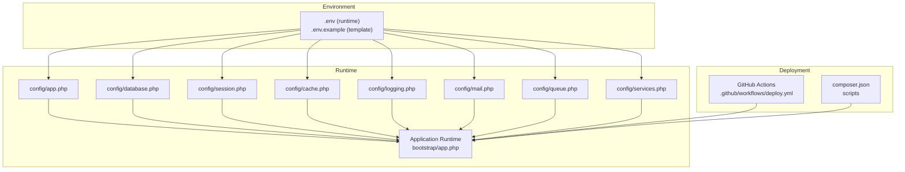
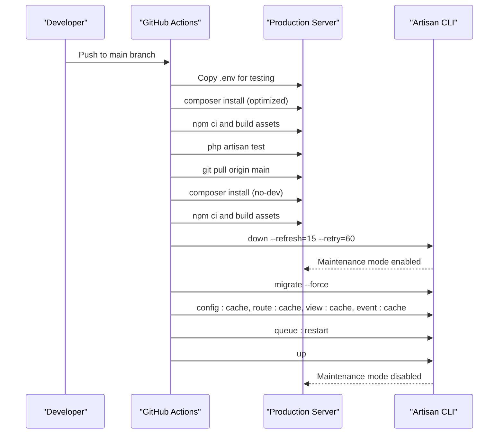
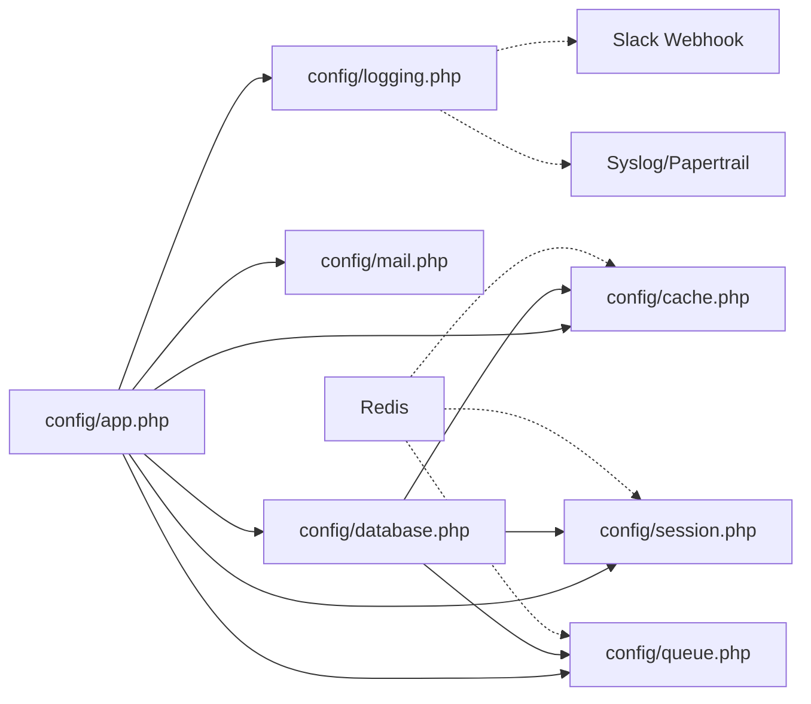

# Application Configuration

<cite>
**Referenced Files in This Document**
- [config/app.php](file://config/app.php)
- [config/database.php](file://config/database.php)
- [config/session.php](file://config/session.php)
- [config/cache.php](file://config/cache.php)
- [config/logging.php](file://config/logging.php)
- [config/mail.php](file://config/mail.php)
- [config/queue.php](file://config/queue.php)
- [config/services.php](file://config/services.php)
- [bootstrap/app.php](file://bootstrap/app.php)
- [composer.json](file://composer.json)
- [.github/workflows/deploy.yml](file://.github/workflows/deploy.yml)
- [2026-03-14-public-module-security-hardening.md](file://docs/superpowers/plans/2026-03-14-public-module-security-hardening.md)
</cite>

## Table of Contents
1. [Introduction](#introduction)
2. [Project Structure](#project-structure)
3. [Core Components](#core-components)
4. [Architecture Overview](#architecture-overview)
5. [Detailed Component Analysis](#detailed-component-analysis)
6. [Dependency Analysis](#dependency-analysis)
7. [Performance Considerations](#performance-considerations)
8. [Troubleshooting Guide](#troubleshooting-guide)
9. [Conclusion](#conclusion)
10. [Appendices](#appendices)

## Introduction
This document explains the Application Configuration for the PTSP system built on Laravel. It covers environment-driven settings for the application core (name, environment, URL, timezone, locale, debug mode), database connectivity, session and cache drivers, logging, mailers, queues, and third-party services. It also documents environment variable structure, .env management, security settings, maintenance mode, application key management, and deployment-specific configurations for development, staging, and production. Practical scenarios and troubleshooting guidance are included to help operators configure and operate the system reliably.

## Project Structure
The configuration is primarily managed through Laravel’s config files under the config directory and environment variables loaded via the env helper. Deployment automation is handled by a GitHub Actions workflow that orchestrates maintenance mode, migrations, caching, and restarts.

**Diagram sources**
- [bootstrap/app.php:1-32](file://bootstrap/app.php#L1-L32)
- [config/app.php:1-127](file://config/app.php#L1-L127)
- [config/database.php:1-185](file://config/database.php#L1-L185)
- [config/session.php:1-218](file://config/session.php#L1-L218)
- [config/cache.php:1-118](file://config/cache.php#L1-L118)
- [config/logging.php:1-133](file://config/logging.php#L1-L133)
- [config/mail.php:1-119](file://config/mail.php#L1-L119)
- [config/queue.php:1-130](file://config/queue.php#L1-L130)
- [config/services.php:1-61](file://config/services.php#L1-L61)
- [.github/workflows/deploy.yml:1-79](file://.github/workflows/deploy.yml#L1-L79)
- [composer.json:1-118](file://composer.json#L1-L118)

**Section sources**
- [bootstrap/app.php:1-32](file://bootstrap/app.php#L1-L32)
- [composer.json:1-118](file://composer.json#L1-L118)
- [.github/workflows/deploy.yml:1-79](file://.github/workflows/deploy.yml#L1-L79)

## Core Components
- Application identity and runtime behavior: name, environment, debug flag, URL, timezone, locale, fallback locale, faker locale, cipher, application key, previous keys, and maintenance driver/store.
- Database connections (sqlite, mysql, mariadb, pgsql, sqlsrv), migration table, and Redis client options.
- Session driver, lifetime, encryption, cookie attributes, and store selection.
- Cache store defaults, multiple backends (array, database, file, memcached, redis, dynamodb, octane, failover), and key prefixing.
- Logging channels (stack, single, daily, slack, syslog, stderr, papertrail, errorlog, null) and deprecation logging.
- Mailers (smtp, ses, postmark, resend, sendmail, log, array, failover, roundrobin) and global From address.
- Queues (sync, database, beanstalkd, sqs, redis, deferred, background, failover) and failed job storage.
- Third-party services (Postmark, SES, Slack, Thermal Printer, MiniMax TTS) and their configuration keys.

**Section sources**
- [config/app.php:1-127](file://config/app.php#L1-L127)
- [config/database.php:1-185](file://config/database.php#L1-L185)
- [config/session.php:1-218](file://config/session.php#L1-L218)
- [config/cache.php:1-118](file://config/cache.php#L1-L118)
- [config/logging.php:1-133](file://config/logging.php#L1-L133)
- [config/mail.php:1-119](file://config/mail.php#L1-L119)
- [config/queue.php:1-130](file://config/queue.php#L1-L130)
- [config/services.php:1-61](file://config/services.php#L1-L61)

## Architecture Overview
The configuration architecture is environment-variable-driven with centralized configuration files. The runtime is bootstrapped via bootstrap/app.php, which wires routing, middleware, and exception handling. Deployment is automated to enable maintenance mode, run migrations, cache configuration/routing/views/events, restart queue workers, and disable maintenance mode.

**Diagram sources**
- [.github/workflows/deploy.yml:1-79](file://.github/workflows/deploy.yml#L1-L79)

**Section sources**
- [.github/workflows/deploy.yml:1-79](file://.github/workflows/deploy.yml#L1-L79)

## Detailed Component Analysis

### Application Core Settings
- Identity and environment: name, environment, debug flag, URL, timezone, locale, fallback locale, faker locale.
- Encryption: cipher and application key with previous keys support.
- Maintenance mode: driver and store selection.

Key behaviors:
- Debug mode is environment-driven and should be disabled in production.
- URL must reflect the actual base URL for correct asset and route generation.
- Timezone is set to UTC by default; adjust per operational region.
- Locale and fallback locale drive internationalization.
- Maintenance driver supports file or cache; cache driver enables multi-node coordination.

**Section sources**
- [config/app.php:16-124](file://config/app.php#L16-L124)

### Database Configuration
- Default connection is sqlite by default; override with DB_CONNECTION.
- Supported drivers: sqlite, mysql, mariadb, pgsql, sqlsrv.
- Connection parameters include host, port, database, username, password, charset, collation, SSL options for MySQL/MariaDB, and pgsql search_path.
- Redis client options include cluster, prefix, persistent connections, and retry/backoff tuning.
- Foreign key constraints for sqlite can be toggled.

Operational guidance:
- For local development, sqlite is convenient; for production, prefer mysql/mariadb/pgsql/sqlsrv.
- Use DB_URL for URL-style connection strings when supported by drivers.
- Configure SSL CA for MySQL/MariaDB when required by your infrastructure.

**Section sources**
- [config/database.php:20-182](file://config/database.php#L20-L182)

### Session Configuration
- Default driver is database; alternatives include file, cookie, memcached, redis, dynamodb, array.
- Lifetime in minutes and optional expiration on browser close.
- Optional encryption of session data.
- Cookie customization: name, path, domain, secure, http-only, same-site, partitioned.
- Store selection for cache-backed drivers and database table for database-backed sessions.
- Connection selection for database/redis-backed sessions.

Security recommendations:
- Enable encryption for session data in production.
- Set secure cookies and appropriate same-site policy.
- Use database or redis-backed sessions for distributed deployments.

**Section sources**
- [config/session.php:21-217](file://config/session.php#L21-L217)

### Cache Configuration
- Default store is database; alternatives include array, file, memcached, redis, dynamodb, octane, failover, null.
- Database cache store supports separate lock connection/table.
- File cache path and lock path are configurable.
- Memcached servers and SASL credentials are configurable.
- Redis cache connection and lock connection are configurable.
- DynamoDB cache credentials and table are configurable.
- Key prefixing helps avoid collisions across applications.

**Section sources**
- [config/cache.php:18-117](file://config/cache.php#L18-L117)

### Logging Configuration
- Default channel is stack; channels include single, daily, slack, syslog, stderr, papertrail, errorlog, and null.
- Deprecations logging can be routed to a dedicated channel with optional stack traces.
- Daily logs support retention days.
- Slack notifications require webhook URL and optional username/emoji.
- Papertrail uses syslog UDP handler with host/port and connection string.
- Stderr channel supports custom formatter processor.
- Emergency log path is defined for minimal writes.

**Section sources**
- [config/logging.php:21-130](file://config/logging.php#L21-L130)

### Mail Configuration
- Default mailer is log; supported transports include smtp, ses, postmark, resend, sendmail, log, array, failover, roundrobin.
- SMTP settings include scheme/url/host/port/username/password/local domain derived from APP_URL.
- SES, Postmark, Resend rely on service-specific credentials.
- Sendmail path is configurable.
- Failover and roundrobin strategies distribute load or retries across multiple mailers.
- Global From address/name are configurable.

**Section sources**
- [config/mail.php:17-118](file://config/mail.php#L17-L118)

### Queue Configuration
- Default connection is database; alternatives include sync, database, beanstalkd, sqs, redis, deferred, background, failover.
- Database queue supports custom connection/table/queue/retry_after and after_commit behavior.
- Beanstalkd queue supports host, queue, retry_after, block_for, after_commit.
- SQS queue supports key/secret/prefix/queue/suffix/region.
- Redis queue supports connection/queue/retry_after/block_for/after_commit.
- Failed job storage supports database-uuids/dynamodb/file/null drivers and table specification.

**Section sources**
- [config/queue.php:16-127](file://config/queue.php#L16-L127)

### Third-Party Services
- Postmark, Resend, SES credentials for transactional integrations.
- Slack notifications bot token and default channel.
- Thermal printer service configuration for printing tickets.
- MiniMax TTS service configuration including API key, voice, model, strategy, language boost, speed, volume, pitch, async polling parameters, and cache settings.

**Section sources**
- [config/services.php:17-60](file://config/services.php#L17-L60)

### Environment Variables and .env Management
- Environment variables are loaded via env helper in configuration files.
- composer.json scripts ensure .env exists and generate APP_KEY during setup.
- The deployment workflow copies .env from the target server for testing and then deploys with maintenance mode.

Common variables (non-exhaustive):
- Application: APP_NAME, APP_ENV, APP_DEBUG, APP_URL, APP_LOCALE, APP_FALLBACK_LOCALE, APP_FAKER_LOCALE, APP_KEY, APP_PREVIOUS_KEYS, APP_MAINTENANCE_DRIVER, APP_MAINTENANCE_STORE.
- Database: DB_CONNECTION, DB_URL, DB_HOST, DB_PORT, DB_DATABASE, DB_USERNAME, DB_PASSWORD, DB_SOCKET, DB_CHARSET, DB_COLLATION, MYSQL_ATTR_SSL_CA, DB_QUEUE_CONNECTION, DB_QUEUE_TABLE, DB_QUEUE, DB_QUEUE_RETRY_AFTER, DB_CACHE_CONNECTION, DB_CACHE_TABLE, DB_CACHE_LOCK_CONNECTION, DB_CACHE_LOCK_TABLE, DB_ENCRYPT, DB_TRUST_SERVER_CERTIFICATE, DB_SSLMODE.
- Redis: REDIS_CLIENT, REDIS_CLUSTER, REDIS_PREFIX, REDIS_PERSISTENT, REDIS_URL, REDIS_HOST, REDIS_USERNAME, REDIS_PASSWORD, REDIS_PORT, REDIS_DB, REDIS_MAX_RETRIES, REDIS_BACKOFF_ALGORITHM, REDIS_BACKOFF_BASE, REDIS_BACKOFF_CAP, REDIS_CACHE_CONNECTION, REDIS_CACHE_DB, REDIS_QUEUE_CONNECTION, REDIS_QUEUE.
- Sessions: SESSION_DRIVER, SESSION_LIFETIME, SESSION_EXPIRE_ON_CLOSE, SESSION_ENCRYPT, SESSION_CONNECTION, SESSION_TABLE, SESSION_STORE, SESSION_COOKIE, SESSION_PATH, SESSION_DOMAIN, SESSION_SECURE_COOKIE, SESSION_HTTP_ONLY, SESSION_SAME_SITE, SESSION_PARTITIONED_COOKIE.
- Cache: CACHE_STORE, CACHE_PREFIX, MEMCACHED_PERSISTENT_ID, MEMCACHED_USERNAME, MEMCACHED_PASSWORD, MEMCACHED_HOST, MEMCACHED_PORT.
- Logging: LOG_CHANNEL, LOG_DEPRECATIONS_CHANNEL, LOG_DEPRECATIONS_TRACE, LOG_LEVEL, LOG_STACK, LOG_DAILY_DAYS, LOG_SLACK_WEBHOOK_URL, LOG_SLACK_USERNAME, LOG_SLACK_EMOJI, LOG_STDERR_FORMATTER, PAPERTRAIL_URL, PAPERTRAIL_PORT, LOG_SYSLOG_FACILITY.
- Mail: MAIL_MAILER, MAIL_URL, MAIL_SCHEME, MAIL_HOST, MAIL_PORT, MAIL_USERNAME, MAIL_PASSWORD, MAIL_EHLO_DOMAIN, MAIL_SENDMAIL_PATH, MAIL_LOG_CHANNEL, POSTMARK_API_KEY, RESEND_API_KEY, AWS_ACCESS_KEY_ID, AWS_SECRET_ACCESS_KEY, AWS_DEFAULT_REGION, SLACK_BOT_USER_OAUTH_TOKEN, SLACK_BOT_USER_DEFAULT_CHANNEL.
- Queues: QUEUE_CONNECTION, BEANSTALKD_QUEUE_HOST, BEANSTALKD_QUEUE, BEANSTALKD_QUEUE_RETRY_AFTER, SQS_PREFIX, SQS_QUEUE, SQS_SUFFIX, SQS_REGION, REDIS_QUEUE_CONNECTION, REDIS_QUEUE, REDIS_QUEUE_RETRY_AFTER.
- Services: THERMAL_PRINTER_ENABLED, THERMAL_PRINTER_IP, THERMAL_PRINTER_PORT, THERMAL_PRINTER_DEVICE_ID, MINIMAX_API_KEY, MINIMAX_VOICE_ID, MINIMAX_MODEL, MINIMAX_STRATEGY, MINIMAX_LANGUAGE_BOOST, MINIMAX_SPEED, MINIMAX_VOL, MINIMAX_PITCH, MINIMAX_ASYNC_POLL_ATTEMPTS, MINIMAX_ASYNC_POLL_INTERVAL_MS, MINIMAX_CACHE_DISK, MINIMAX_CACHE_PREFIX.

**Section sources**
- [config/app.php:16-124](file://config/app.php#L16-L124)
- [config/database.php:20-182](file://config/database.php#L20-L182)
- [config/session.php:21-217](file://config/session.php#L21-L217)
- [config/cache.php:18-117](file://config/cache.php#L18-L117)
- [config/logging.php:21-130](file://config/logging.php#L21-L130)
- [config/mail.php:17-118](file://config/mail.php#L17-L118)
- [config/queue.php:16-127](file://config/queue.php#L16-L127)
- [config/services.php:17-60](file://config/services.php#L17-L60)
- [composer.json:54-96](file://composer.json#L54-L96)
- [.github/workflows/deploy.yml:20-21](file://.github/workflows/deploy.yml#L20-L21)

### Security Settings
- Application key management: APP_KEY and APP_PREVIOUS_KEYS support rolling key rotation.
- Maintenance mode: APP_MAINTENANCE_DRIVER and APP_MAINTENANCE_STORE enable coordinated maintenance across nodes.
- Session security: SESSION_ENCRYPT, SESSION_SECURE_COOKIE, SESSION_HTTP_ONLY, SESSION_SAME_SITE, and partitioned cookies.
- Module passwords and session lifetime for specialized modules (as documented in project docs).
- Middleware trust proxies and CORS are configured at bootstrap.

Recommended production settings:
- Disable APP_DEBUG.
- Set APP_URL to HTTPS endpoint.
- Enable SESSION_ENCRYPT and SESSION_SECURE_COOKIE.
- Use cache-based maintenance driver for multi-node deployments.
- Rotate APP_KEY periodically and populate APP_PREVIOUS_KEYS during transitions.

**Section sources**
- [config/app.php:42-124](file://config/app.php#L42-L124)
- [config/session.php:50-217](file://config/session.php#L50-L217)
- [bootstrap/app.php:17-28](file://bootstrap/app.php#L17-L28)
- [2026-03-14-public-module-security-hardening.md:830-860](file://docs/superpowers/plans/2026-03-14-public-module-security-hardening.md#L830-L860)

### Maintenance Mode Configuration
- Maintenance driver defaults to file; cache driver allows multi-node coordination.
- Store selection influences where maintenance mode state is persisted.
- Deployment workflow enables maintenance mode before migrations and disables it afterward.

**Section sources**
- [config/app.php:121-124](file://config/app.php#L121-L124)
- [.github/workflows/deploy.yml:60-76](file://.github/workflows/deploy.yml#L60-L76)

### Application Key Management
- APP_KEY is required for encryption and signed state.
- APP_PREVIOUS_KEYS supports key rotation without downtime.
- composer.json scripts generate APP_KEY during initial setup.

**Section sources**
- [config/app.php:98-106](file://config/app.php#L98-L106)
- [composer.json:56-58](file://composer.json#L56-L58)

### Deployment-Specific Configurations
- Development:
  - Use sqlite for simplicity.
  - Keep APP_DEBUG enabled.
  - Use file-based maintenance mode.
  - Use database sessions and cache for local development.
- Staging:
  - Mirror production database and cache.
  - Enable maintenance mode during deployments.
  - Validate logging and queue connectivity.
- Production:
  - Use external databases (mysql/mariadb/pgsql/sqlsrv).
  - Enable cache-based maintenance mode.
  - Secure cookies and encryption for sessions.
  - Use queue workers and monitor failed jobs.
  - Configure logging channels (daily/slack/syslog) and Papertrail as needed.

**Section sources**
- [config/database.php:20-182](file://config/database.php#L20-L182)
- [config/session.php:21-217](file://config/session.php#L21-L217)
- [config/cache.php:18-117](file://config/cache.php#L18-L117)
- [config/logging.php:21-130](file://config/logging.php#L21-L130)
- [config/queue.php:16-127](file://config/queue.php#L16-L127)
- [.github/workflows/deploy.yml:60-76](file://.github/workflows/deploy.yml#L60-L76)

## Dependency Analysis
Configuration dependencies across components:

**Diagram sources**
- [config/app.php:1-127](file://config/app.php#L1-L127)
- [config/database.php:1-185](file://config/database.php#L1-L185)
- [config/session.php:1-218](file://config/session.php#L1-L218)
- [config/cache.php:1-118](file://config/cache.php#L1-L118)
- [config/logging.php:1-133](file://config/logging.php#L1-L133)
- [config/mail.php:1-119](file://config/mail.php#L1-L119)
- [config/queue.php:1-130](file://config/queue.php#L1-L130)

**Section sources**
- [config/app.php:1-127](file://config/app.php#L1-L127)
- [config/database.php:1-185](file://config/database.php#L1-L185)
- [config/session.php:1-218](file://config/session.php#L1-L218)
- [config/cache.php:1-118](file://config/cache.php#L1-L118)
- [config/logging.php:1-133](file://config/logging.php#L1-L133)
- [config/mail.php:1-119](file://config/mail.php#L1-L119)
- [config/queue.php:1-130](file://config/queue.php#L1-L130)

## Performance Considerations
- Prefer cache-backed stores (redis, memcached) for sessions and cache in production to reduce disk I/O.
- Use database-backed cache with separate lock connections for consistency.
- Tune Redis backoff and retry parameters to handle transient failures gracefully.
- Enable queue workers and monitor failed job tables to prevent backlog growth.
- Use daily logs with appropriate retention to balance insight and disk usage.
- Minimize debug logging in production; switch to info/warning/critical as needed.

## Troubleshooting Guide
Common configuration issues and resolutions:
- Application crashes or blank pages:
  - Verify APP_DEBUG is disabled in production.
  - Confirm APP_KEY is set and not empty.
  - Ensure config is cached only after environment variables are finalized.
- Incorrect URLs or redirects:
  - Set APP_URL to the correct base URL (including scheme).
  - Ensure reverse proxy headers are trusted in bootstrap middleware.
- Database connection errors:
  - Validate DB_CONNECTION and DB_* variables.
  - For MySQL/MariaDB, confirm SSL CA path if using URL-style connections.
  - Check DB_QUEUE_CONNECTION and DB_CACHE_CONNECTION if using separate connections.
- Session not persisting:
  - Switch to database or redis driver for multi-node setups.
  - Enable SESSION_ENCRYPT and set SESSION_SECURE_COOKIE for HTTPS.
  - Verify SESSION_DOMAIN and SESSION_SAME_SITE for cross-domain contexts.
- Cache misses or collisions:
  - Set CACHE_PREFIX to a unique value per environment.
  - Use cache-backed stores (redis/memcached) for distributed systems.
- Logging not captured:
  - Set LOG_CHANNEL to the desired channel.
  - For Slack, ensure LOG_SLACK_WEBHOOK_URL is configured.
  - For syslog/Papertrail, verify host/port and credentials.
- Queue jobs not processed:
  - Confirm QUEUE_CONNECTION and worker availability.
  - Check failed job storage driver and table existence.
- Deployment fails or remains in maintenance mode:
  - Ensure maintenance mode is disabled after migrations.
  - Verify config/route/view/event caches are rebuilt after deployment.

**Section sources**
- [config/app.php:42-124](file://config/app.php#L42-L124)
- [config/database.php:20-182](file://config/database.php#L20-L182)
- [config/session.php:21-217](file://config/session.php#L21-L217)
- [config/cache.php:18-117](file://config/cache.php#L18-L117)
- [config/logging.php:21-130](file://config/logging.php#L21-L130)
- [config/queue.php:16-127](file://config/queue.php#L16-L127)
- [.github/workflows/deploy.yml:60-76](file://.github/workflows/deploy.yml#L60-L76)

## Conclusion
The PTSP application relies on environment-driven configuration to adapt across development, staging, and production. Correctly setting application identity, database connectivity, session and cache drivers, logging, mailers, queues, and third-party services ensures reliability and operability. Security and maintenance mode configurations are essential for safe operations. The deployment workflow automates maintenance mode, migrations, caching, and restarts, reducing human error during releases.

## Appendices

### Environment Variable Reference
- Application: APP_NAME, APP_ENV, APP_DEBUG, APP_URL, APP_LOCALE, APP_FALLBACK_LOCALE, APP_FAKER_LOCALE, APP_KEY, APP_PREVIOUS_KEYS, APP_MAINTENANCE_DRIVER, APP_MAINTENANCE_STORE
- Database: DB_CONNECTION, DB_URL, DB_HOST, DB_PORT, DB_DATABASE, DB_USERNAME, DB_PASSWORD, DB_SOCKET, DB_CHARSET, DB_COLLATION, MYSQL_ATTR_SSL_CA, DB_QUEUE_CONNECTION, DB_QUEUE_TABLE, DB_QUEUE, DB_QUEUE_RETRY_AFTER, DB_CACHE_CONNECTION, DB_CACHE_TABLE, DB_CACHE_LOCK_CONNECTION, DB_CACHE_LOCK_TABLE, DB_ENCRYPT, DB_TRUST_SERVER_CERTIFICATE, DB_SSLMODE
- Redis: REDIS_CLIENT, REDIS_CLUSTER, REDIS_PREFIX, REDIS_PERSISTENT, REDIS_URL, REDIS_HOST, REDIS_USERNAME, REDIS_PASSWORD, REDIS_PORT, REDIS_DB, REDIS_MAX_RETRIES, REDIS_BACKOFF_ALGORITHM, REDIS_BACKOFF_BASE, REDIS_BACKOFF_CAP, REDIS_CACHE_CONNECTION, REDIS_CACHE_DB, REDIS_QUEUE_CONNECTION, REDIS_QUEUE
- Sessions: SESSION_DRIVER, SESSION_LIFETIME, SESSION_EXPIRE_ON_CLOSE, SESSION_ENCRYPT, SESSION_CONNECTION, SESSION_TABLE, SESSION_STORE, SESSION_COOKIE, SESSION_PATH, SESSION_DOMAIN, SESSION_SECURE_COOKIE, SESSION_HTTP_ONLY, SESSION_SAME_SITE, SESSION_PARTITIONED_COOKIE
- Cache: CACHE_STORE, CACHE_PREFIX, MEMCACHED_PERSISTENT_ID, MEMCACHED_USERNAME, MEMCACHED_PASSWORD, MEMCACHED_HOST, MEMCACHED_PORT
- Logging: LOG_CHANNEL, LOG_DEPRECATIONS_CHANNEL, LOG_DEPRECATIONS_TRACE, LOG_LEVEL, LOG_STACK, LOG_DAILY_DAYS, LOG_SLACK_WEBHOOK_URL, LOG_SLACK_USERNAME, LOG_SLACK_EMOJI, LOG_STDERR_FORMATTER, PAPERTRAIL_URL, PAPERTRAIL_PORT, LOG_SYSLOG_FACILITY
- Mail: MAIL_MAILER, MAIL_URL, MAIL_SCHEME, MAIL_HOST, MAIL_PORT, MAIL_USERNAME, MAIL_PASSWORD, MAIL_EHLO_DOMAIN, MAIL_SENDMAIL_PATH, MAIL_LOG_CHANNEL, POSTMARK_API_KEY, RESEND_API_KEY, AWS_ACCESS_KEY_ID, AWS_SECRET_ACCESS_KEY, AWS_DEFAULT_REGION, SLACK_BOT_USER_OAUTH_TOKEN, SLACK_BOT_USER_DEFAULT_CHANNEL
- Queues: QUEUE_CONNECTION, BEANSTALKD_QUEUE_HOST, BEANSTALKD_QUEUE, BEANSTALKD_QUEUE_RETRY_AFTER, SQS_PREFIX, SQS_QUEUE, SQS_SUFFIX, SQS_REGION, REDIS_QUEUE_CONNECTION, REDIS_QUEUE, REDIS_QUEUE_RETRY_AFTER
- Services: THERMAL_PRINTER_ENABLED, THERMAL_PRINTER_IP, THERMAL_PRINTER_PORT, THERMAL_PRINTER_DEVICE_ID, MINIMAX_API_KEY, MINIMAX_VOICE_ID, MINIMAX_MODEL, MINIMAX_STRATEGY, MINIMAX_LANGUAGE_BOOST, MINIMAX_SPEED, MINIMAX_VOL, MINIMAX_PITCH, MINIMAX_ASYNC_POLL_ATTEMPTS, MINIMAX_ASYNC_POLL_INTERVAL_MS, MINIMAX_CACHE_DISK, MINIMAX_CACHE_PREFIX

### Typical Configuration Scenarios
- Local development with sqlite and file-based sessions:
  - DB_CONNECTION=sqlite
  - SESSION_DRIVER=file
  - APP_DEBUG=true
  - APP_URL=http://localhost
- Production with MySQL and cache-based maintenance:
  - DB_CONNECTION=mysql
  - DB_HOST, DB_PORT, DB_DATABASE, DB_USERNAME, DB_PASSWORD
  - APP_MAINTENANCE_DRIVER=cache
  - APP_MAINTENANCE_STORE=database
  - SESSION_ENCRYPT=true
  - SESSION_SECURE_COOKIE=true
- Redis-backed cache and queues:
  - CACHE_STORE=redis
  - QUEUE_CONNECTION=redis
  - REDIS_CACHE_CONNECTION=cache
  - REDIS_QUEUE_CONNECTION=default