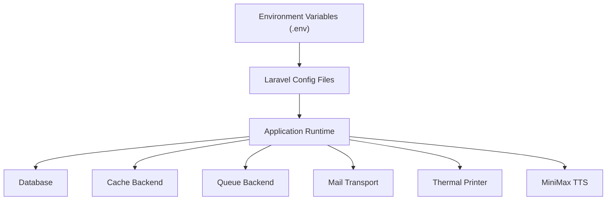
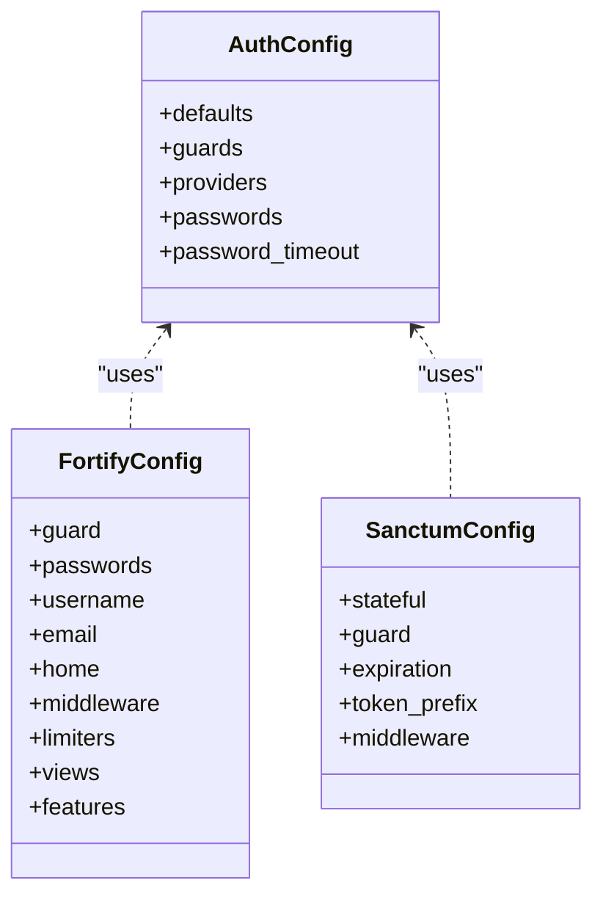
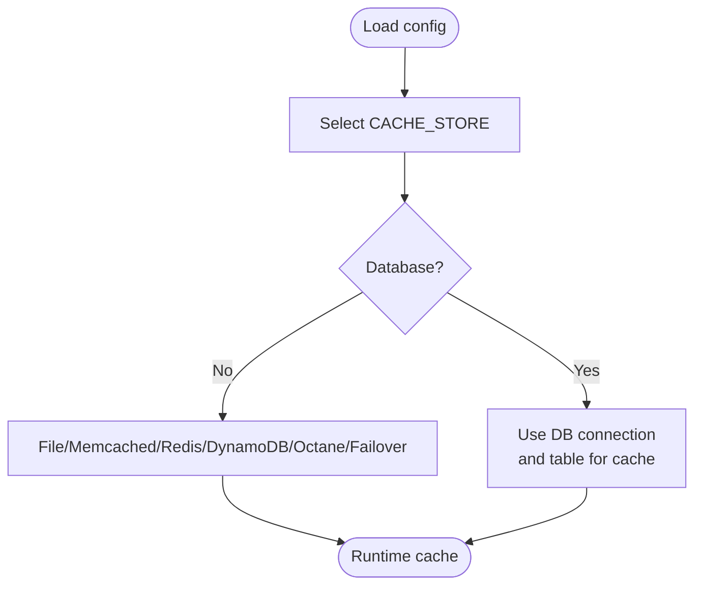
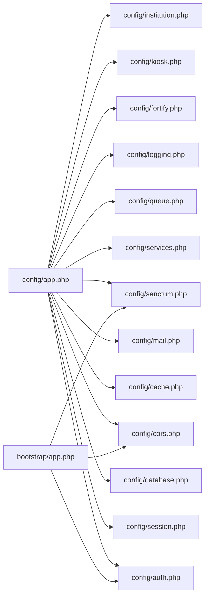

# Configuration Management

<cite>
**Referenced Files in This Document**
- [app.php](file://config/app.php)
- [auth.php](file://config/auth.php)
- [database.php](file://config/database.php)
- [cache.php](file://config/cache.php)
- [session.php](file://config/session.php)
- [services.php](file://config/services.php)
- [kiosk.php](file://config/kiosk.php)
- [institution.php](file://config/institution.php)
- [mail.php](file://config/mail.php)
- [queue.php](file://config/queue.php)
- [logging.php](file://config/logging.php)
- [cors.php](file://config/cors.php)
- [sanctum.php](file://config/sanctum.php)
- [fortify.php](file://config/fortify.php)
- [app.php](file://bootstrap/app.php)
- [deploy.yml](file://.github/workflows/deploy.yml)
</cite>

## Table of Contents
1. [Introduction](#introduction)
2. [Project Structure](#project-structure)
3. [Core Components](#core-components)
4. [Architecture Overview](#architecture-overview)
5. [Detailed Component Analysis](#detailed-component-analysis)
6. [Dependency Analysis](#dependency-analysis)
7. [Performance Considerations](#performance-considerations)
8. [Troubleshooting Guide](#troubleshooting-guide)
9. [Conclusion](#conclusion)
10. [Appendices](#appendices)

## Introduction
This document explains the Configuration Management system in the PTSP system built on Laravel. It covers how configuration is organized using Laravel’s config files and environment variables, and how these settings govern application behavior, service integrations, module authentication, and operational characteristics. It also documents environment-specific configurations for development, staging, and production, along with caching, deployment considerations, and security best practices for sensitive settings.

## Project Structure
The configuration system is primarily defined in the config directory, with environment variables supplied via .env files and CI/CD pipelines. The bootstrap/app.php file wires routing and middleware that rely on configuration values.

```mermaid
graph TB
cfg_app["config/app.php"]
cfg_auth["config/auth.php"]
cfg_db["config/database.php"]
cfg_cache["config/cache.php"]
cfg_sess["config/session.php"]
cfg_svc["config/services.php"]
cfg_kiosk["config/kiosk.php"]
cfg_inst["config/institution.php"]
cfg_mail["config/mail.php"]
cfg_queue["config/queue.php"]
cfg_log["config/logging.php"]
cfg_cors["config/cors.php"]
cfg_sanctum["config/sanctum.php"]
cfg_fortify["config/fortify.php"]
boot_app["bootstrap/app.php"]
cfg_app --> cfg_auth
cfg_app --> cfg_db
cfg_app --> cfg_cache
cfg_app --> cfg_sess
cfg_app --> cfg_svc
cfg_app --> cfg_kiosk
cfg_app --> cfg_inst
cfg_app --> cfg_mail
cfg_app --> cfg_queue
cfg_app --> cfg_log
cfg_app --> cfg_cors
cfg_app --> cfg_sanctum
cfg_app --> cfg_fortify
boot_app --> cfg_cors
boot_app --> cfg_auth
boot_app --> cfg_sanctum
```

**Diagram sources**
- [app.php:1-127](file://config/app.php#L1-L127)
- [auth.php:1-118](file://config/auth.php#L1-L118)
- [database.php:1-185](file://config/database.php#L1-L185)
- [cache.php:1-118](file://config/cache.php#L1-L118)
- [session.php:1-218](file://config/session.php#L1-L218)
- [services.php:1-61](file://config/services.php#L1-L61)
- [kiosk.php:1-8](file://config/kiosk.php#L1-L8)
- [institution.php:1-10](file://config/institution.php#L1-L10)
- [mail.php:1-119](file://config/mail.php#L1-L119)
- [queue.php:1-130](file://config/queue.php#L1-L130)
- [logging.php:1-133](file://config/logging.php#L1-L133)
- [cors.php:1-20](file://config/cors.php#L1-L20)
- [sanctum.php:1-85](file://config/sanctum.php#L1-L85)
- [fortify.php:1-158](file://config/fortify.php#L1-L158)
- [app.php:1-32](file://bootstrap/app.php#L1-L32)

**Section sources**
- [app.php:1-127](file://config/app.php#L1-L127)
- [app.php:1-32](file://bootstrap/app.php#L1-L32)

## Core Components
- Application identity, environment, debug mode, URL, timezone, locale, encryption key, and maintenance driver.
- Authentication defaults, guards, providers, password resets, and timeouts.
- Database connections (SQLite, MySQL/MariaDB, PostgreSQL, SQL Server), migration table, and Redis options.
- Cache stores (array, database, file, memcached, redis, dynamodb, octane, failover), lock settings, and key prefix.
- Session driver, lifetime, encryption, cookie attributes, and store mapping.
- Third-party services (Postmark, Resend, SES, Slack, Thermal Printer, MiniMax TTS).
- Kiosk and TV display module passwords, and module session lifetime.
- Institution branding and operational details.
- Mail transport configuration (SMTP, SES, Postmark, Resend, Sendmail, Log, Array, Failover, Round-robin), global sender.
- Queue backends (sync, database, beanstalkd, SQS, redis), batching, and failed job storage.
- Logging channels (stack, single, daily, slack, syslog, stderr, papertrail, null), levels, and retention.
- CORS policy for API paths and origins.
- Sanctum stateful domains, guards, expiration, token prefix, and middleware.
- Fortify features (registration, password reset, email verification, two-factor authentication).

**Section sources**
- [app.php:1-127](file://config/app.php#L1-L127)
- [auth.php:1-118](file://config/auth.php#L1-L118)
- [database.php:1-185](file://config/database.php#L1-L185)
- [cache.php:1-118](file://config/cache.php#L1-L118)
- [session.php:1-218](file://config/session.php#L1-L218)
- [services.php:1-61](file://config/services.php#L1-L61)
- [kiosk.php:1-8](file://config/kiosk.php#L1-L8)
- [institution.php:1-10](file://config/institution.php#L1-L10)
- [mail.php:1-119](file://config/mail.php#L1-L119)
- [queue.php:1-130](file://config/queue.php#L1-L130)
- [logging.php:1-133](file://config/logging.php#L1-L133)
- [cors.php:1-20](file://config/cors.php#L1-L20)
- [sanctum.php:1-85](file://config/sanctum.php#L1-L85)
- [fortify.php:1-158](file://config/fortify.php#L1-L158)

## Architecture Overview
Configuration values are resolved from environment variables with sensible defaults embedded in config files. Runtime behavior is shaped by these values across application, infrastructure, and integration layers.

[No sources needed since this diagram shows conceptual workflow, not actual code structure]

## Detailed Component Analysis

### Application Settings
- Identity and environment: name, environment, debug flag, base URL, timezone, locales, cipher, encryption key, previous keys, maintenance driver/store.
- Purpose: centralize application identity and operational mode; encryption key must be set for secure operations.

**Section sources**
- [app.php:1-127](file://config/app.php#L1-L127)

### Authentication and Security
- Defaults: guard and password broker.
- Guards: session-based web guard.
- Providers: Eloquent user provider with configurable model.
- Password resets: table, expiry, throttle.
- Password confirmation timeout.
- Fortify features: registration, password reset, email verification, two-factor authentication.
- Sanctum: stateful domains, guards, expiration, token prefix, middleware.

**Diagram sources**
- [auth.php:1-118](file://config/auth.php#L1-L118)
- [fortify.php:1-158](file://config/fortify.php#L1-L158)
- [sanctum.php:1-85](file://config/sanctum.php#L1-L85)

**Section sources**
- [auth.php:1-118](file://config/auth.php#L1-L118)
- [fortify.php:1-158](file://config/fortify.php#L1-L158)
- [sanctum.php:1-85](file://config/sanctum.php#L1-L85)

### Database and Caching
- Database connections: SQLite, MySQL/MariaDB, PostgreSQL, SQL Server with URL, host/port, credentials, charset/collation, SSL CA, foreign key constraints.
- Redis client, cluster, prefix, persistence, retry/backoff policies.
- Cache stores: array, database, file, memcached, redis, dynamodb, octane, failover, with lock connections and prefixes.
- Cache key prefix derived from app name.

**Diagram sources**
- [cache.php:1-118](file://config/cache.php#L1-L118)
- [database.php:1-185](file://config/database.php#L1-L185)

**Section sources**
- [database.php:1-185](file://config/database.php#L1-L185)
- [cache.php:1-118](file://config/cache.php#L1-L118)

### Sessions
- Driver selection, lifetime, encryption, file location, database/table mapping, cache store, cookie name/path/domain/secure/http_only/same_site/partitioned.
- Impacts stateful authentication and user session continuity.

**Section sources**
- [session.php:1-218](file://config/session.php#L1-L218)

### Service Integrations
- Postmark, Resend, SES (AWS), Slack notifications.
- Thermal printer: enablement, IP, port, device ID.
- MiniMax TTS: API key, voice, model, async polling attempts/intervals, speed/volume/pitch, cache disk/prefix.

**Section sources**
- [services.php:1-61](file://config/services.php#L1-L61)

### Mail Delivery
- Default mailer, mailers: SMTP, SES, Postmark, Resend, Sendmail, Log, Array, Failover, Round-robin.
- Global From address/name, EHLO domain from APP_URL.

**Section sources**
- [mail.php:1-119](file://config/mail.php#L1-L119)

### Queues
- Default connection and supported drivers: sync, database, beanstalkd, SQS, redis, deferred, background, failover.
- Database connection/table/queue/retry_after, SQS prefix/queue/region, Redis connection/queue/retry_after, batch and failed job configuration.

**Section sources**
- [queue.php:1-130](file://config/queue.php#L1-L130)

### Logging
- Default channel, deprecation channel/tracing.
- Channels: stack, single, daily (with retention days), slack, syslog, stderr, papertrail, null.
- Levels and processors.

**Section sources**
- [logging.php:1-133](file://config/logging.php#L1-L133)

### CORS Policy
- Paths, allowed methods/origins/headers, credentials support, max age.

**Section sources**
- [cors.php:1-20](file://config/cors.php#L1-L20)

### Module Authentication (Kiosk and TV Display)
- Kiosk password and TV display password, with fallback to a shared module password variable.
- Module session lifetime.

**Section sources**
- [kiosk.php:1-8](file://config/kiosk.php#L1-L8)

### Institution Branding
- Name, address, phone, operating hours, logo path.

**Section sources**
- [institution.php:1-10](file://config/institution.php#L1-L10)

### Bootstrap Integration
- Routing (web/api/commands/channels), middleware (CORS prepended to API), proxy trust, alias for role and module.password checks.

**Section sources**
- [app.php:1-32](file://bootstrap/app.php#L1-L32)

## Dependency Analysis
Configuration dependencies across modules:

**Diagram sources**
- [app.php:1-127](file://config/app.php#L1-L127)
- [auth.php:1-118](file://config/auth.php#L1-L118)
- [session.php:1-218](file://config/session.php#L1-L218)
- [database.php:1-185](file://config/database.php#L1-L185)
- [cache.php:1-118](file://config/cache.php#L1-L118)
- [mail.php:1-119](file://config/mail.php#L1-L119)
- [services.php:1-61](file://config/services.php#L1-L61)
- [queue.php:1-130](file://config/queue.php#L1-L130)
- [logging.php:1-133](file://config/logging.php#L1-L133)
- [cors.php:1-20](file://config/cors.php#L1-L20)
- [sanctum.php:1-85](file://config/sanctum.php#L1-L85)
- [fortify.php:1-158](file://config/fortify.php#L1-L158)
- [kiosk.php:1-8](file://config/kiosk.php#L1-L8)
- [institution.php:1-10](file://config/institution.php#L1-L10)
- [app.php:1-32](file://bootstrap/app.php#L1-L32)

**Section sources**
- [app.php:1-127](file://config/app.php#L1-L127)
- [app.php:1-32](file://bootstrap/app.php#L1-L32)

## Performance Considerations
- Prefer Redis or database cache stores for distributed environments; tune Redis backoff and retry parameters.
- Use database-backed sessions for multi-node deployments; adjust session lifetime and cookie attributes for performance and security.
- Select appropriate queue drivers (database vs. redis/SQS) based on throughput and latency requirements.
- Enable maintenance mode driver suitable for multi-node deployments (e.g., cache driver).
- Use daily log rotation with retention to control disk usage.

[No sources needed since this section provides general guidance]

## Troubleshooting Guide
Common configuration issues and resolutions:
- Encryption key missing or invalid: set APP_KEY to a 32-character string; rotate previous keys safely.
- Database connectivity failures: verify DB_* variables and SSL CA path; confirm driver matches connection.
- Session cookie not persisting: check SESSION_DOMAIN, SESSION_SECURE_COOKIE, SESSION_SAME_SITE, and APP_URL.
- Mail delivery errors: select a working MAIL_MAILER, configure credentials, and validate FROM address.
- Queue jobs not processed: confirm QUEUE_CONNECTION and backend credentials; inspect failed job storage.
- CORS blocked requests: align FRONTEND_URL with allowed origins and enable credentials if needed.
- Sanctum authentication failures: ensure SANCTUM_STATEFUL_DOMAINS includes frontend origin and port.
- MiniMax TTS errors: validate MINIMAX_API_KEY and async polling settings; confirm cache disk availability.

**Section sources**
- [app.php:1-127](file://config/app.php#L1-L127)
- [database.php:1-185](file://config/database.php#L1-L185)
- [session.php:1-218](file://config/session.php#L1-L218)
- [mail.php:1-119](file://config/mail.php#L1-L119)
- [queue.php:1-130](file://config/queue.php#L1-L130)
- [cors.php:1-20](file://config/cors.php#L1-L20)
- [sanctum.php:1-85](file://config/sanctum.php#L1-L85)
- [services.php:1-61](file://config/services.php#L1-L61)

## Conclusion
The PTSP system leverages Laravel’s robust configuration system to separate environment-specific settings from application logic. By combining well-defined config files with environment variables, the system achieves flexibility across environments, clear separation of concerns, and strong security posture. Proper validation, defaults, and override mechanisms ensure reliable operation, while deployment and caching strategies support scalable and maintainable operations.

[No sources needed since this section summarizes without analyzing specific files]

## Appendices

### Environment-Specific Guidance
- Development
  - APP_ENV=development
  - APP_DEBUG=true
  - LOG_LEVEL=debug
  - CACHE_STORE=file or array
  - QUEUE_CONNECTION=sync for local testing
  - FRONTEND_URL=http://localhost:3000
- Staging
  - APP_ENV=staging
  - APP_DEBUG=false
  - LOG_LEVEL=info
  - CACHE_STORE=redis or database
  - QUEUE_CONNECTION=redis or database
  - FRONTEND_URL=https://staging.example.com
- Production
  - APP_ENV=production
  - APP_DEBUG=false
  - LOG_LEVEL=warning or error
  - CACHE_STORE=redis or database
  - QUEUE_CONNECTION=redis or database
  - FRONTEND_URL=https://app.example.com

[No sources needed since this section provides general guidance]

### Configuration Caching and Deployment
- Pre-deployment steps
  - Generate and store APP_KEY securely.
  - Run configuration cache generation and route/model caches as part of build pipeline.
  - Validate environment variables in CI before deployment.
- Deployment considerations
  - Use CI/CD to inject environment variables per environment.
  - Ensure cache and log directories are writable.
  - For multi-node deployments, use cache-backed maintenance mode and shared cache/queue backends.
- Security best practices
  - Never commit secrets to source control; use CI/CD secret managers.
  - Rotate APP_KEY and previous keys during deployments.
  - Restrict access to logs and cache directories.
  - Enforce HTTPS and secure cookie flags in production.

**Section sources**
- [app.php:1-127](file://config/app.php#L1-L127)
- [deploy.yml](file://.github/workflows/deploy.yml)

### Configuration Validation and Defaults
- Defaults are embedded in config files with env() wrappers to supply fallbacks.
- Validation occurs at runtime when values are read; ensure required keys (e.g., APP_KEY, database credentials) are present in the target environment.
- Override mechanism: environment variables take precedence over config defaults.

**Section sources**
- [app.php:1-127](file://config/app.php#L1-L127)
- [database.php:1-185](file://config/database.php#L1-L185)
- [cache.php:1-118](file://config/cache.php#L1-L118)
- [session.php:1-218](file://config/session.php#L1-L218)
- [mail.php:1-119](file://config/mail.php#L1-L119)
- [queue.php:1-130](file://config/queue.php#L1-L130)
- [logging.php:1-133](file://config/logging.php#L1-L133)
- [cors.php:1-20](file://config/cors.php#L1-L20)
- [sanctum.php:1-85](file://config/sanctum.php#L1-L85)
- [services.php:1-61](file://config/services.php#L1-L61)
- [kiosk.php:1-8](file://config/kiosk.php#L1-L8)
- [institution.php:1-10](file://config/institution.php#L1-L10)
- [auth.php:1-118](file://config/auth.php#L1-L118)
- [fortify.php:1-158](file://config/fortify.php#L1-L158)