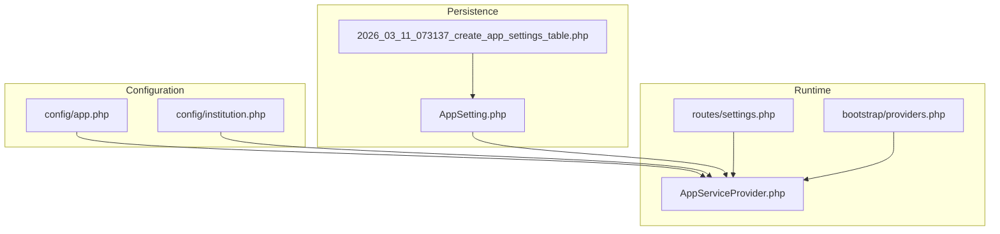
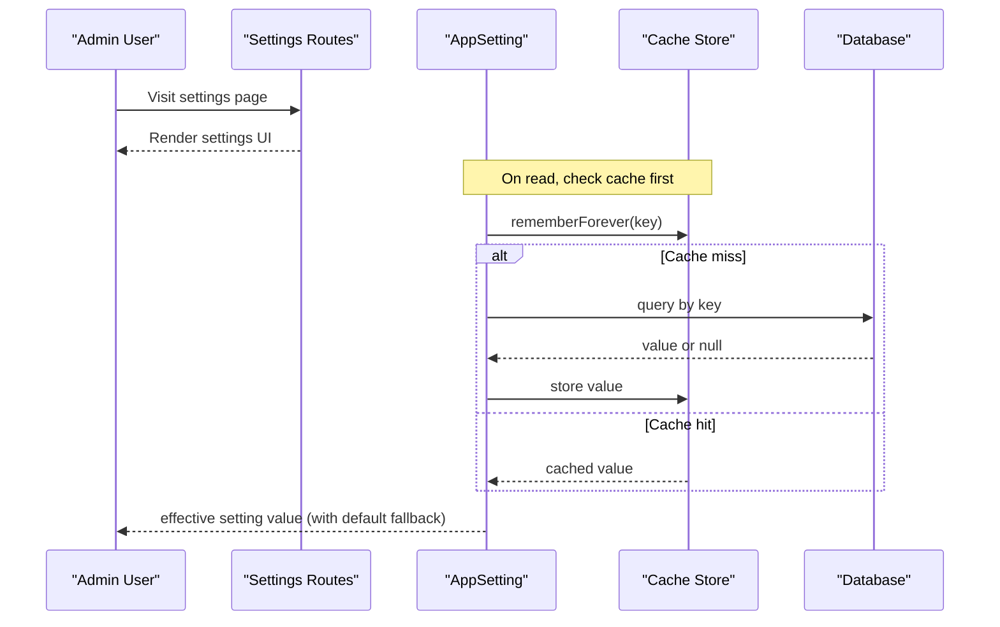
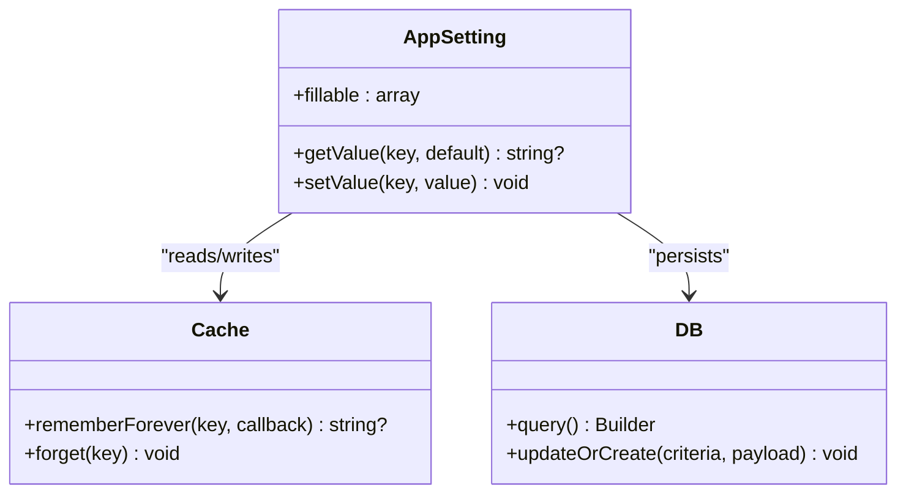
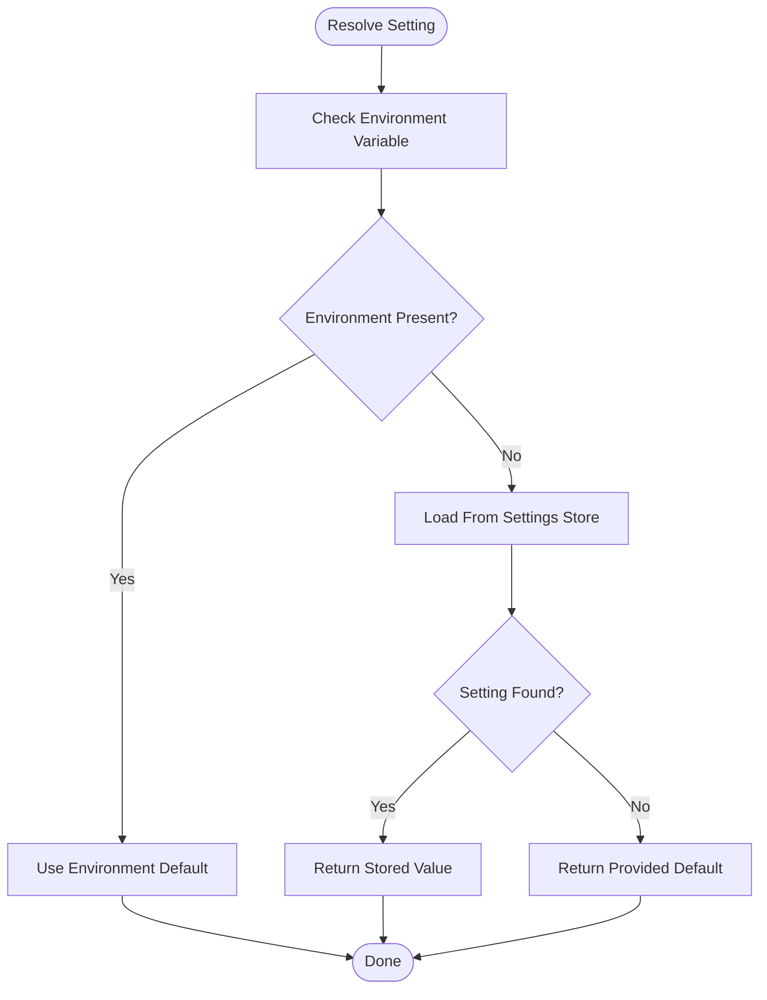
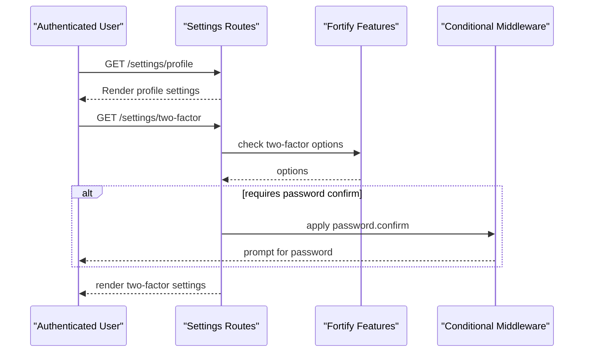
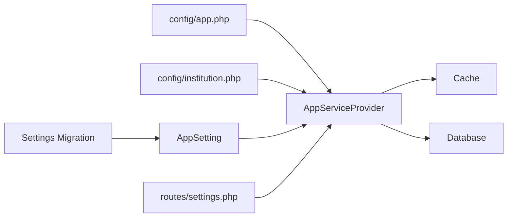

# Feature Flags and Settings

<cite>
**Referenced Files in This Document**
- [AppSetting.php](file://app/Models/AppSetting.php)
- [2026_03_11_073137_create_app_settings_table.php](file://database/migrations/2026_03_11_073137_create_app_settings_table.php)
- [app.php](file://config/app.php)
- [institution.php](file://config/institution.php)
- [settings.php](file://routes/settings.php)
- [AppServiceProvider.php](file://app/Providers/AppServiceProvider.php)
- [providers.php](file://bootstrap/providers.php)
- [2026-03-07_ui_ux_overhaul_feature_track_metadata.json](file://conductor/tracks/ui_ux_overhaul_20260307/metadata.json)
</cite>

## Table of Contents
1. [Introduction](#introduction)
2. [Project Structure](#project-structure)
3. [Core Components](#core-components)
4. [Architecture Overview](#architecture-overview)
5. [Detailed Component Analysis](#detailed-component-analysis)
6. [Dependency Analysis](#dependency-analysis)
7. [Performance Considerations](#performance-considerations)
8. [Troubleshooting Guide](#troubleshooting-guide)
9. [Conclusion](#conclusion)
10. [Appendices](#appendices)

## Introduction
This document explains how Feature Flags and Settings are configured and managed in the PTSP system. It covers:
- Application settings persistence and retrieval
- Runtime feature switching via cached settings
- Institution-specific configuration
- Environment-aware behavior
- Deployment strategies for gradual rollouts and A/B testing
- Validation, defaults, and backward compatibility considerations

The system centers around a lightweight settings store persisted in the database and cached in-memory for fast reads. Administrators can toggle features at runtime, while environment variables provide sensible defaults and institutional branding overrides.

## Project Structure
Key areas involved in feature flags and settings:
- Database migration defines the settings table schema
- Eloquent model encapsulates CRUD and caching
- Configuration files define environment and institution defaults
- Routes expose user-facing settings pages
- Service provider registers application-level bindings

**Diagram sources**
- [app.php:1-127](file://config/app.php#L1-L127)
- [institution.php:1-10](file://config/institution.php#L1-L10)
- [2026_03_11_073137_create_app_settings_table.php:1-30](file://database/migrations/2026_03_11_073137_create_app_settings_table.php#L1-L30)
- [AppSetting.php:1-34](file://app/Models/AppSetting.php#L1-L34)
- [settings.php:1-27](file://routes/settings.php#L1-L27)
- [AppServiceProvider.php](file://app/Providers/AppServiceProvider.php)
- [providers.php:1-10](file://bootstrap/providers.php#L1-L10)

**Section sources**
- [app.php:1-127](file://config/app.php#L1-L127)
- [institution.php:1-10](file://config/institution.php#L1-L10)
- [2026_03_11_073137_create_app_settings_table.php:1-30](file://database/migrations/2026_03_11_073137_create_app_settings_table.php#L1-L30)
- [AppSetting.php:1-34](file://app/Models/AppSetting.php#L1-L34)
- [settings.php:1-27](file://routes/settings.php#L1-L27)
- [providers.php:1-10](file://bootstrap/providers.php#L1-L10)

## Core Components
- Settings table and model
  - Schema: unique key, nullable text value, timestamps
  - Methods: get value with caching, set/update value with cache invalidation
- Configuration defaults
  - Application-level environment and locale settings
  - Institution branding and operational hours
- Routes for settings pages
  - Protected routes for profile, password, appearance, two-factor settings
  - Conditional middleware for two-factor based on Fortify features

Operational behavior:
- Reads are cached forever until the setting is updated
- Writes invalidate the cache for that key
- Defaults can be supplied by callers when a setting is missing

**Section sources**
- [2026_03_11_073137_create_app_settings_table.php:14-19](file://database/migrations/2026_03_11_073137_create_app_settings_table.php#L14-L19)
- [AppSetting.php:15-32](file://app/Models/AppSetting.php#L15-L32)
- [app.php:81-85](file://config/app.php#L81-L85)
- [institution.php:4-8](file://config/institution.php#L4-L8)
- [settings.php:6-26](file://routes/settings.php#L6-L26)

## Architecture Overview
The settings subsystem integrates configuration, persistence, caching, and presentation:

**Diagram sources**
- [AppSetting.php:15-22](file://app/Models/AppSetting.php#L15-L22)
- [settings.php:6-10](file://routes/settings.php#L6-L10)

## Detailed Component Analysis

### Settings Persistence and Retrieval
- Purpose: centralize application-wide feature flags and module toggles
- Schema: unique key, optional value, timestamps
- Behavior:
  - getValue(key, default): returns cached value or queries DB; stores result in cache
  - setValue(key, value): upserts setting; invalidates cache for that key

**Diagram sources**
- [AppSetting.php:10-32](file://app/Models/AppSetting.php#L10-L32)
- [2026_03_11_073137_create_app_settings_table.php:14-19](file://database/migrations/2026_03_11_073137_create_app_settings_table.php#L14-L19)

**Section sources**
- [AppSetting.php:15-32](file://app/Models/AppSetting.php#L15-L32)
- [2026_03_11_073137_create_app_settings_table.php:14-19](file://database/migrations/2026_03_11_073137_create_app_settings_table.php#L14-L19)

### Configuration Defaults and Environment Awareness
- Application defaults:
  - Locale and fallback locale
  - Cipher and key management
  - Maintenance driver/store
- Institution defaults:
  - Name, address, phone, operating hours, logo path
- Usage pattern:
  - Use environment variables to supply defaults
  - Override at runtime via settings store for feature flags

**Diagram sources**
- [app.php:81-85](file://config/app.php#L81-L85)
- [institution.php:4-8](file://config/institution.php#L4-L8)
- [AppSetting.php:15-21](file://app/Models/AppSetting.php#L15-L21)

**Section sources**
- [app.php:81-85](file://config/app.php#L81-L85)
- [institution.php:4-8](file://config/institution.php#L4-L8)
- [AppSetting.php:15-21](file://app/Models/AppSetting.php#L15-L21)

### Settings Pages and Access Control
- Protected routes:
  - Profile, password, appearance require authentication
  - Two-factor settings require verification based on Fortify features
- Conditional middleware:
  - Two-factor route applies password.confirm middleware when enabled in Fortify

**Diagram sources**
- [settings.php:6-26](file://routes/settings.php#L6-L26)

**Section sources**
- [settings.php:6-26](file://routes/settings.php#L6-L26)

### Feature Flagging and Experimental Features
- Conceptual usage:
  - Define feature keys (e.g., "experimental.new-ui", "module.public.enabled")
  - Retrieve with default=false to disable by default
  - Toggle via settings UI or admin API
- Example keys (conceptual):
  - "feature.ui.flux-integration"
  - "module.public.booking.enabled"
  - "experiment.audience.alpha.enabled"
- Backward compatibility:
  - New features default to disabled
  - Remove or rename keys carefully with migration-like strategies

Note: The repository includes a feature track indicating a UI/UX overhaul, which can serve as a real-world example of an experimental feature being introduced and rolled out.

**Section sources**
- [2026-03-07_ui_ux_overhaul_feature_track_metadata.json:1-8](file://conductor/tracks/ui_ux_overhaul_20260307/metadata.json#L1-L8)

## Dependency Analysis
- AppSetting depends on:
  - Cache facade for fast reads
  - Database query builder for persistence
- Configuration files influence:
  - Locale and fallback locale used across the app
  - Institution branding visible in UI
- Routes depend on:
  - Authentication and verification middleware
  - Fortify feature flags for conditional behavior
- Service provider ties configuration and settings together during boot

**Diagram sources**
- [app.php:1-127](file://config/app.php#L1-L127)
- [institution.php:1-10](file://config/institution.php#L1-L10)
- [2026_03_11_073137_create_app_settings_table.php:1-30](file://database/migrations/2026_03_11_073137_create_app_settings_table.php#L1-L30)
- [AppSetting.php:1-34](file://app/Models/AppSetting.php#L1-L34)
- [settings.php:1-27](file://routes/settings.php#L1-L27)
- [AppServiceProvider.php](file://app/Providers/AppServiceProvider.php)
- [providers.php:1-10](file://bootstrap/providers.php#L1-L10)

**Section sources**
- [providers.php:1-10](file://bootstrap/providers.php#L1-L10)
- [AppServiceProvider.php](file://app/Providers/AppServiceProvider.php)

## Performance Considerations
- Caching strategy:
  - Values are cached forever and invalidated on write
  - This minimizes DB load for frequent reads
- Recommendations:
  - Keep the number of distinct keys manageable
  - Use hierarchical keys (e.g., "feature.module.flag") for organization
  - Consider cache tagging or prefixing for bulk invalidation if needed
- Memory footprint:
  - Cached values remain in memory until process restart or explicit forget
  - For very large datasets, consider paginated reads or TTL-based caching

[No sources needed since this section provides general guidance]

## Troubleshooting Guide
- Symptom: Feature flag not taking effect
  - Verify key spelling and casing
  - Confirm default fallback is intended
  - Check cache invalidation after updates
- Symptom: Two-factor settings inaccessible
  - Ensure Fortify two-factor options are enabled
  - Confirm password.confirm middleware is applied when required
- Symptom: Institution branding not appearing
  - Check environment variables for institution settings
  - Confirm values are present in settings store if overridden

**Section sources**
- [AppSetting.php:15-32](file://app/Models/AppSetting.php#L15-L32)
- [settings.php:16-25](file://routes/settings.php#L16-L25)
- [institution.php:4-8](file://config/institution.php#L4-L8)

## Conclusion
The PTSP system provides a simple yet powerful mechanism for managing feature flags and application settings:
- A dedicated settings store with caching ensures low-latency reads
- Environment variables and configuration files supply sensible defaults
- Settings pages offer a secure interface for administrators
- Gradual rollouts and A/B testing are achievable by toggling keys at runtime

Adopting consistent key naming, default-to-disabled policies, and careful cache invalidation will help maintain reliability during feature deployments.

[No sources needed since this section summarizes without analyzing specific files]

## Appendices

### A. Configuration Keys and Examples
- Feature flags
  - "feature.ui.flux-integration" (boolean)
  - "module.public.booking.enabled" (boolean)
  - "experiment.audience.alpha.enabled" (boolean)
- Module enable/disable
  - "module.frontdesk.enabled"
  - "module.tv-display.enabled"
- Institution branding
  - "institution.name"
  - "institution.operating_hours"
  - "institution.logo_path"

[No sources needed since this section provides general guidance]

### B. Deployment Strategies
- Gradual rollout
  - Start with default=false
  - Incrementally increase percentage via external targeting or separate keys
- A/B testing
  - Use separate keys per variant (e.g., "variant.A.enabled", "variant.B.enabled")
  - Track metrics and switch traffic accordingly
- Environment-specific flags
  - Use environment variables for staging vs production differences
  - Override in settings store for hot-fixes or emergency toggles

[No sources needed since this section provides general guidance]