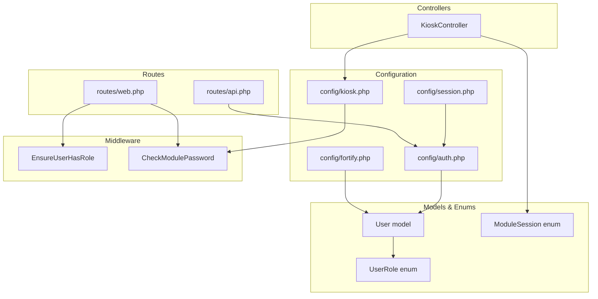
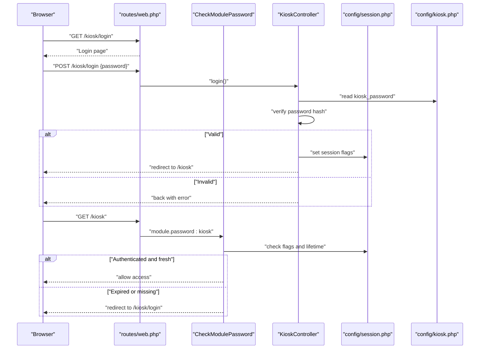
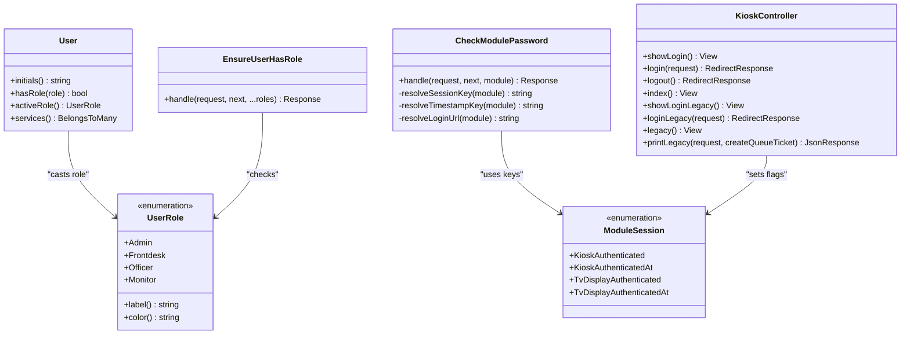
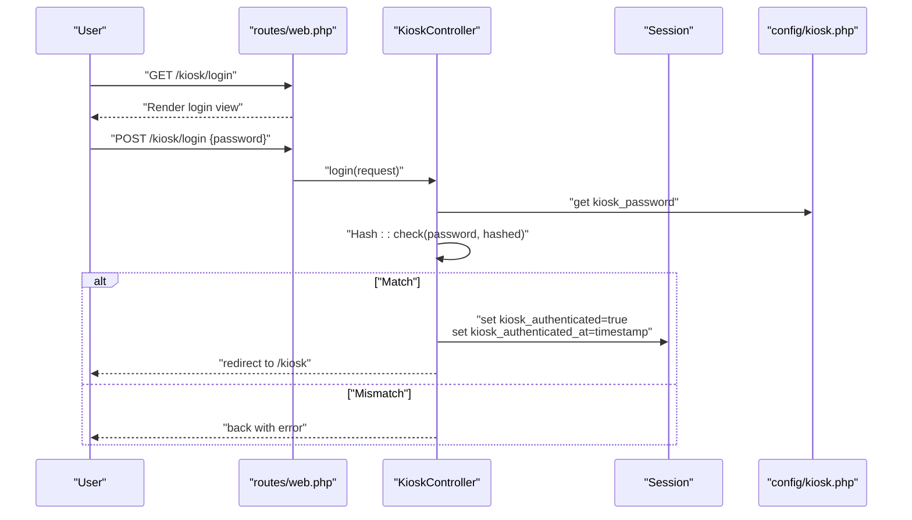
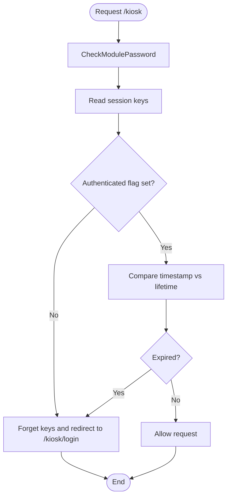
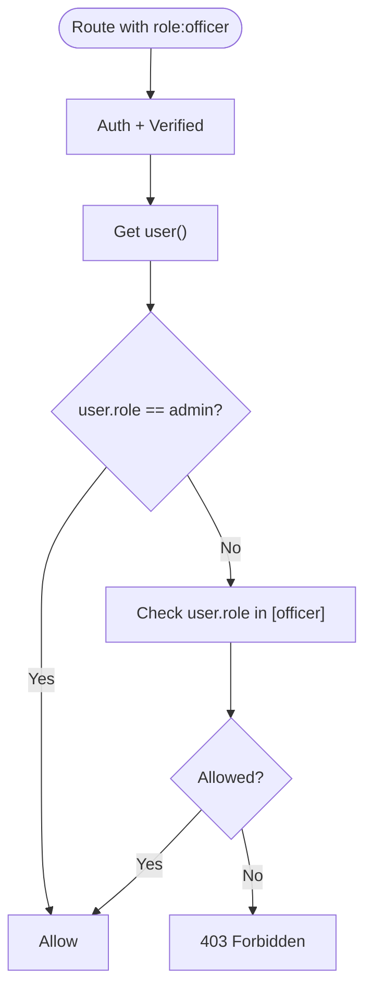
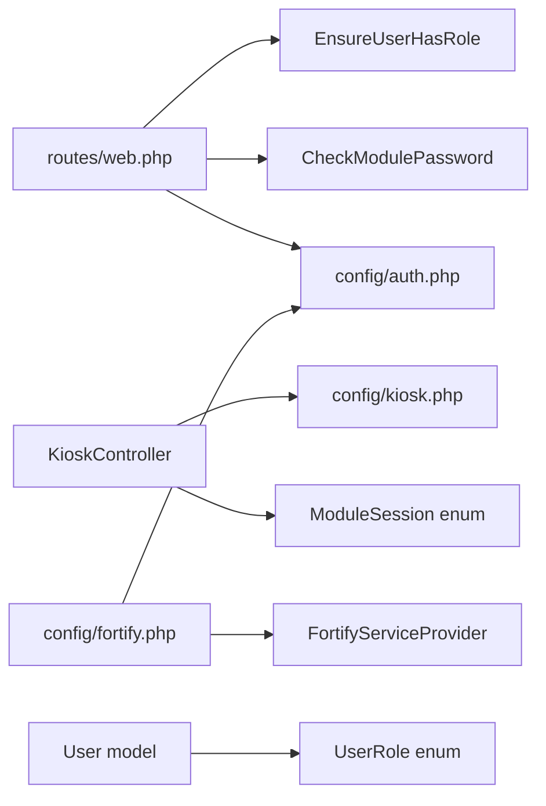

# Module Authentication

<cite>
**Referenced Files in This Document**
- [config/auth.php](file://config/auth.php)
- [config/kiosk.php](file://config/kiosk.php)
- [config/fortify.php](file://config/fortify.php)
- [config/session.php](file://config/session.php)
- [app/Http/Middleware/EnsureUserHasRole.php](file://app/Http/Middleware/EnsureUserHasRole.php)
- [app/Http/Middleware/CheckModulePassword.php](file://app/Http/Middleware/CheckModulePassword.php)
- [app/Enums/UserRole.php](file://app/Enums/UserRole.php)
- [app/Enums/ModuleSession.php](file://app/Enums/ModuleSession.php)
- [app/Models/User.php](file://app/Models/User.php)
- [app/Providers/FortifyServiceProvider.php](file://app/Providers/FortifyServiceProvider.php)
- [routes/web.php](file://routes/web.php)
- [routes/api.php](file://routes/api.php)
- [app/Http/Controllers/KioskController.php](file://app/Http/Controllers/KioskController.php)
- [app/Concerns/PasswordValidationRules.php](file://app/Concerns/PasswordValidationRules.php)
</cite>

## Table of Contents
1. [Introduction](#introduction)
2. [Project Structure](#project-structure)
3. [Core Components](#core-components)
4. [Architecture Overview](#architecture-overview)
5. [Detailed Component Analysis](#detailed-component-analysis)
6. [Dependency Analysis](#dependency-analysis)
7. [Performance Considerations](#performance-considerations)
8. [Troubleshooting Guide](#troubleshooting-guide)
9. [Conclusion](#conclusion)

## Introduction
This document describes the Module Authentication configuration for the PTSP system. It focuses on:
- Kiosk module authentication settings and session management
- Role-based access control (RBAC) configuration
- Multi-factor authentication (MFA) setup via Laravel Fortify
- Authentication guards and middleware configuration
- Session management for different user roles (citizens, frontdesk, officers, administrators)
- Password policies and API token configuration
- Authentication flow diagrams, security considerations, and troubleshooting

## Project Structure
Authentication and authorization in PTSP are implemented across configuration files, middleware, route groups, controllers, and models. The system uses:
- Laravel’s default session-based guard for web users
- Fortify for password reset, email verification, and MFA
- Custom middleware for module-level password checks (kiosk and TV display)
- Role-based middleware to gate routes by user role
- Enumerations for user roles and module session keys

**Diagram sources**
- [config/auth.php:1-118](file://config/auth.php#L1-L118)
- [config/fortify.php:1-158](file://config/fortify.php#L1-L158)
- [config/session.php:1-218](file://config/session.php#L1-L218)
- [config/kiosk.php:1-8](file://config/kiosk.php#L1-L8)
- [app/Http/Middleware/EnsureUserHasRole.php:1-37](file://app/Http/Middleware/EnsureUserHasRole.php#L1-L37)
- [app/Http/Middleware/CheckModulePassword.php:1-68](file://app/Http/Middleware/CheckModulePassword.php#L1-L68)
- [routes/web.php:1-127](file://routes/web.php#L1-L127)
- [routes/api.php:1-23](file://routes/api.php#L1-L23)
- [app/Http/Controllers/KioskController.php:1-144](file://app/Http/Controllers/KioskController.php#L1-L144)
- [app/Models/User.php:1-99](file://app/Models/User.php#L1-L99)
- [app/Enums/UserRole.php:1-32](file://app/Enums/UserRole.php#L1-L32)
- [app/Enums/ModuleSession.php:1-15](file://app/Enums/ModuleSession.php#L1-L15)

**Section sources**
- [config/auth.php:1-118](file://config/auth.php#L1-L118)
- [config/fortify.php:1-158](file://config/fortify.php#L1-L158)
- [config/session.php:1-218](file://config/session.php#L1-L218)
- [config/kiosk.php:1-8](file://config/kiosk.php#L1-L8)
- [routes/web.php:1-127](file://routes/web.php#L1-L127)
- [routes/api.php:1-23](file://routes/api.php#L1-L23)

## Core Components
- Authentication guards and providers: The application uses a session-based guard for web users and an Eloquent provider for the User model.
- Fortify integration: Provides password reset, email verification, and two-factor authentication features.
- Session configuration: Controls driver, lifetime, cookie attributes, and encryption.
- Kiosk and TV display module authentication: Uses module-specific passwords and session flags managed by dedicated middleware.
- Role-based access control: Middleware enforces allowed roles per route group.
- User model and enums: Centralized role typing and MFA support.

**Section sources**
- [config/auth.php:18-74](file://config/auth.php#L18-L74)
- [config/fortify.php:18-31](file://config/fortify.php#L18-L31)
- [config/session.php:21-216](file://config/session.php#L21-L216)
- [app/Http/Middleware/CheckModulePassword.php:17-33](file://app/Http/Middleware/CheckModulePassword.php#L17-L33)
- [app/Http/Middleware/EnsureUserHasRole.php:16-35](file://app/Http/Middleware/EnsureUserHasRole.php#L16-L35)
- [app/Models/User.php:14-98](file://app/Models/User.php#L14-L98)
- [app/Enums/UserRole.php:5-31](file://app/Enums/UserRole.php#L5-L31)
- [app/Enums/ModuleSession.php:8-14](file://app/Enums/ModuleSession.php#L8-L14)

## Architecture Overview
The authentication architecture separates concerns:
- Web users: authenticated via the session guard and Fortify features.
- Modules (kiosk, TV display): authenticated via module-specific passwords and session flags.
- Authorization: enforced by role-based middleware attached to route groups.
- Sessions: managed by the configured driver with cookie and encryption options.

**Diagram sources**
- [routes/web.php:92-98](file://routes/web.php#L92-L98)
- [app/Http/Middleware/CheckModulePassword.php:17-33](file://app/Http/Middleware/CheckModulePassword.php#L17-L33)
- [app/Http/Controllers/KioskController.php:25-45](file://app/Http/Controllers/KioskController.php#L25-L45)
- [config/kiosk.php:4-6](file://config/kiosk.php#L4-L6)
- [config/session.php:35-37](file://config/session.php#L35-L37)

## Detailed Component Analysis

### Authentication Guards and Providers
- Guard: session-based web guard with Eloquent user provider.
- Provider: Eloquent model binding to the User class.
- Password reset broker: configured for the users provider.
- Password confirmation timeout: configurable in minutes.

Security implications:
- Using a session guard ensures stateful authentication for web users.
- Eloquent provider enables role and MFA fields from the User model.

**Section sources**
- [config/auth.php:18-74](file://config/auth.php#L18-L74)
- [config/auth.php:95-115](file://config/auth.php#L95-L115)

### Fortify Configuration (Multi-Factor Authentication)
- Guard and password broker align with the auth configuration.
- Views mapped for login, email verification, 2FA challenge, password confirmation, registration, reset, and forgot-password.
- Rate limiters for login and two-factor challenges.
- Features enabled include registration, reset passwords, email verification, and two-factor authentication with confirmation.

Security implications:
- Two-factor authentication is mandatory for password confirmation.
- Throttling mitigates brute-force attempts.

**Section sources**
- [config/fortify.php:18-31](file://config/fortify.php#L18-L31)
- [config/fortify.php:48-76](file://config/fortify.php#L48-L76)
- [config/fortify.php:104-120](file://config/fortify.php#L104-L120)
- [config/fortify.php:146-155](file://config/fortify.php#L146-L155)
- [app/Providers/FortifyServiceProvider.php:46-55](file://app/Providers/FortifyServiceProvider.php#L46-L55)
- [app/Providers/FortifyServiceProvider.php:62-71](file://app/Providers/FortifyServiceProvider.php#L62-L71)

### Session Management
- Driver: defaults to database; configurable via environment.
- Lifetime: configurable minutes; default 120.
- Cookie attributes: name, path, domain, secure, http-only, same-site, partitioned.
- Encryption: off by default; can be enabled.

Security implications:
- Database driver centralizes session storage.
- Secure and http-only cookie flags reduce XSS risk.
- Same-site policy mitigates CSRF.

**Section sources**
- [config/session.php:21-216](file://config/session.php#L21-L216)

### Kiosk Module Authentication
- Configuration:
  - Module passwords for kiosk and TV display.
  - Session lifetime multiplier (minutes).
- Controller logic:
  - Validates password input.
  - Compares hashed module password from configuration.
  - On success, sets authentication flags and timestamp in session.
  - On failure, returns back with error.
- Middleware logic:
  - Resolves module-specific session keys and login URLs.
  - Checks authentication flag and timestamp against configured lifetime.
  - Redirects to module login if invalid or expired.

Security implications:
- Module passwords are hashed and validated server-side.
- Session flags prevent unauthorized access after expiration.

**Section sources**
- [config/kiosk.php:4-6](file://config/kiosk.php#L4-L6)
- [app/Http/Controllers/KioskController.php:25-45](file://app/Http/Controllers/KioskController.php#L25-L45)
- [app/Http/Middleware/CheckModulePassword.php:17-33](file://app/Http/Middleware/CheckModulePassword.php#L17-L33)
- [app/Enums/ModuleSession.php:10-13](file://app/Enums/ModuleSession.php#L10-L13)

### Role-Based Access Control (RBAC)
- Middleware: Ensures the authenticated user’s role matches allowed roles.
- Special handling: Admin users bypass role checks.
- Route groups:
  - Frontdesk routes require frontdesk or admin.
  - Officer routes require officer.
  - Monitor routes require monitor.
  - Admin routes require admin.

Security implications:
- Explicit role gates protect sensitive administrative endpoints.
- Admins can switch roles via session, enabling flexible access.

**Section sources**
- [app/Http/Middleware/EnsureUserHasRole.php:16-35](file://app/Http/Middleware/EnsureUserHasRole.php#L16-L35)
- [routes/web.php:42-90](file://routes/web.php#L42-L90)
- [app/Models/User.php:81-91](file://app/Models/User.php#L81-L91)
- [app/Enums/UserRole.php:7-10](file://app/Enums/UserRole.php#L7-L10)

### User Model and Two-Factor Authentication
- Uses Laravel Fortify’s TwoFactorAuthenticatable trait.
- Hidden sensitive fields: password hash, two-factor secrets, recovery codes, remember tokens.
- Role casting to UserRole enum.
- Active role resolution considers admin session override.

Security implications:
- Two-factor fields are excluded from serialization.
- Role casting ensures consistent role comparisons.

**Section sources**
- [app/Models/User.php:14-17](file://app/Models/User.php#L14-L17)
- [app/Models/User.php:36-41](file://app/Models/User.php#L36-L41)
- [app/Models/User.php:52-54](file://app/Models/User.php#L52-L54)
- [app/Models/User.php:81-91](file://app/Models/User.php#L81-L91)

### Password Policies
- Password validation rules use Laravel’s default password rule with confirmation.
- Current password validation requires the existing password for sensitive operations.

Security implications:
- Enforces strong password requirements and confirmation.
- Prevents misuse by requiring current password for updates.

**Section sources**
- [app/Concerns/PasswordValidationRules.php:15-28](file://app/Concerns/PasswordValidationRules.php#L15-L28)

### API Token Configuration
- API user endpoint requires Sanctum guard.
- Public APIs are throttled separately.

Security implications:
- Sanctum provides stateless token authentication for API clients.
- Throttling protects public endpoints from abuse.

**Section sources**
- [routes/api.php:20-22](file://routes/api.php#L20-L22)
- [config/auth.php:18-21](file://config/auth.php#L18-L21)

## Architecture Overview

**Diagram sources**
- [app/Models/User.php:14-98](file://app/Models/User.php#L14-L98)
- [app/Enums/UserRole.php:5-31](file://app/Enums/UserRole.php#L5-L31)
- [app/Enums/ModuleSession.php:8-14](file://app/Enums/ModuleSession.php#L8-L14)
- [app/Http/Middleware/EnsureUserHasRole.php:16-35](file://app/Http/Middleware/EnsureUserHasRole.php#L16-L35)
- [app/Http/Middleware/CheckModulePassword.php:17-66](file://app/Http/Middleware/CheckModulePassword.php#L17-L66)
- [app/Http/Controllers/KioskController.php:18-144](file://app/Http/Controllers/KioskController.php#L18-L144)

## Detailed Component Analysis

### Authentication Flow: Kiosk Login

**Diagram sources**
- [routes/web.php:93-95](file://routes/web.php#L93-L95)
- [app/Http/Controllers/KioskController.php:25-45](file://app/Http/Controllers/KioskController.php#L25-L45)
- [config/kiosk.php:4](file://config/kiosk.php#L4)

### Authentication Flow: Module Access Control

**Diagram sources**
- [app/Http/Middleware/CheckModulePassword.php:17-33](file://app/Http/Middleware/CheckModulePassword.php#L17-L33)
- [config/kiosk.php:6](file://config/kiosk.php#L6)

### RBAC Enforcement

**Diagram sources**
- [routes/web.php:48-55](file://routes/web.php#L48-L55)
- [app/Http/Middleware/EnsureUserHasRole.php:16-35](file://app/Http/Middleware/EnsureUserHasRole.php#L16-L35)

## Dependency Analysis
- Web routes depend on:
  - Role middleware for access control
  - Module password middleware for kiosk/TV display
  - Auth guard for session-based web users
- Controllers depend on:
  - Configuration for module passwords and session flags
  - Enums for session key constants
- Fortify depends on:
  - Auth configuration for guard and broker
  - Rate limiters for login and 2FA
- User model integrates:
  - Two-factor trait and role casting

**Diagram sources**
- [routes/web.php:1-127](file://routes/web.php#L1-L127)
- [app/Http/Middleware/EnsureUserHasRole.php:1-37](file://app/Http/Middleware/EnsureUserHasRole.php#L1-L37)
- [app/Http/Middleware/CheckModulePassword.php:1-68](file://app/Http/Middleware/CheckModulePassword.php#L1-L68)
- [config/auth.php:1-118](file://config/auth.php#L1-L118)
- [app/Http/Controllers/KioskController.php:1-144](file://app/Http/Controllers/KioskController.php#L1-L144)
- [config/kiosk.php:1-8](file://config/kiosk.php#L1-L8)
- [app/Enums/ModuleSession.php:1-15](file://app/Enums/ModuleSession.php#L1-L15)
- [config/fortify.php:1-158](file://config/fortify.php#L1-L158)
- [app/Providers/FortifyServiceProvider.php:1-73](file://app/Providers/FortifyServiceProvider.php#L1-L73)
- [app/Models/User.php:1-99](file://app/Models/User.php#L1-L99)
- [app/Enums/UserRole.php:1-32](file://app/Enums/UserRole.php#L1-L32)

**Section sources**
- [routes/web.php:1-127](file://routes/web.php#L1-L127)
- [app/Http/Middleware/EnsureUserHasRole.php:1-37](file://app/Http/Middleware/EnsureUserHasRole.php#L1-L37)
- [app/Http/Middleware/CheckModulePassword.php:1-68](file://app/Http/Middleware/CheckModulePassword.php#L1-L68)
- [config/auth.php:1-118](file://config/auth.php#L1-L118)
- [config/fortify.php:1-158](file://config/fortify.php#L1-L158)
- [config/session.php:1-218](file://config/session.php#L1-L218)
- [config/kiosk.php:1-8](file://config/kiosk.php#L1-L8)
- [app/Http/Controllers/KioskController.php:1-144](file://app/Http/Controllers/KioskController.php#L1-L144)
- [app/Models/User.php:1-99](file://app/Models/User.php#L1-L99)
- [app/Enums/UserRole.php:1-32](file://app/Enums/UserRole.php#L1-L32)
- [app/Enums/ModuleSession.php:1-15](file://app/Enums/ModuleSession.php#L1-L15)

## Performance Considerations
- Session driver selection impacts scalability; database driver centralizes state but may require indexing.
- Throttling limits reduce load during login attempts and 2FA challenges.
- Two-factor confirmation adds latency; ensure adequate server resources for MFA operations.
- Module password checks are lightweight but should avoid unnecessary hashing loops.

## Troubleshooting Guide
Common issues and resolutions:
- Kiosk login fails with invalid password:
  - Verify the module password configuration and hashing.
  - Confirm the controller validates input and compares against the hashed value.
- Kiosk session expires unexpectedly:
  - Check module session lifetime configuration and server time synchronization.
  - Ensure authentication timestamp is set upon successful login.
- Unauthorized access to role-protected routes:
  - Confirm the role middleware receives the correct roles and that the user’s role is properly cast.
  - Verify admin session override for active role switching.
- Two-factor authentication errors:
  - Confirm Fortify’s two-factor challenge view and rate limiter configuration.
  - Ensure the user has enabled two-factor and has access to recovery codes.
- API authentication failures:
  - Confirm the client sends a valid Sanctum token for the user endpoint.
  - Review throttle limits for API endpoints.

**Section sources**
- [app/Http/Controllers/KioskController.php:25-45](file://app/Http/Controllers/KioskController.php#L25-L45)
- [app/Http/Middleware/CheckModulePassword.php:17-33](file://app/Http/Middleware/CheckModulePassword.php#L17-L33)
- [app/Http/Middleware/EnsureUserHasRole.php:16-35](file://app/Http/Middleware/EnsureUserHasRole.php#L16-L35)
- [config/fortify.php:146-155](file://config/fortify.php#L146-L155)
- [routes/api.php:20-22](file://routes/api.php#L20-L22)

## Conclusion
PTSP’s authentication system combines Laravel’s session guard for web users with Fortify’s MFA capabilities, while kiosk and TV display modules use dedicated password-based sessions. Role-based middleware enforces access control across functional areas. Proper configuration of session drivers, cookie attributes, and rate limiting ensures robust security and performance. Adhering to the documented flows and troubleshooting steps will maintain reliable authentication across all modules.