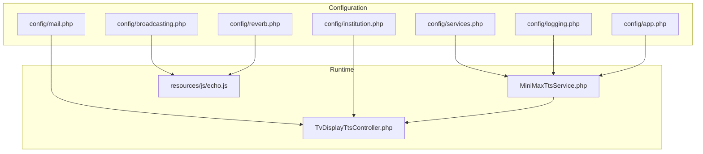
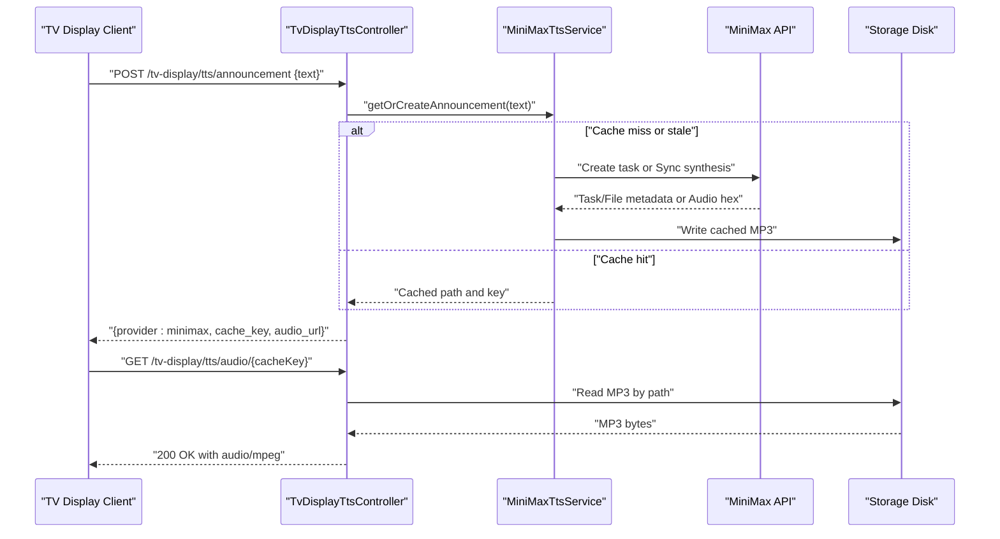
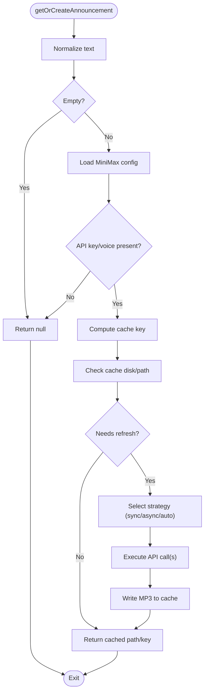
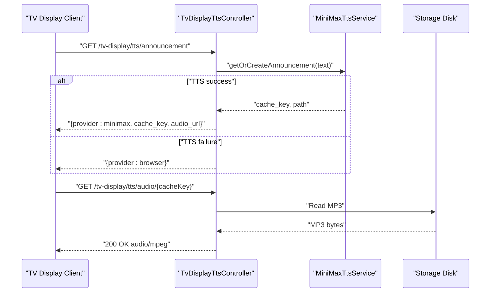
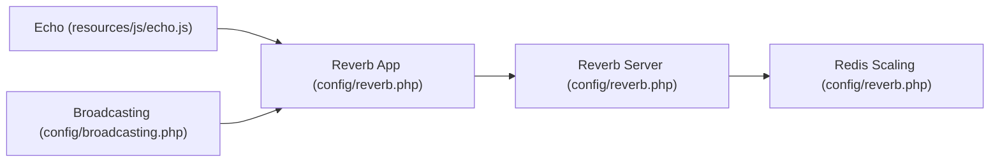
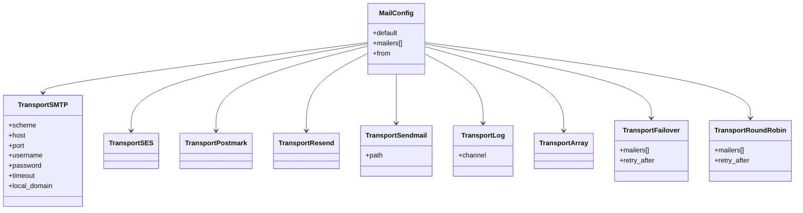
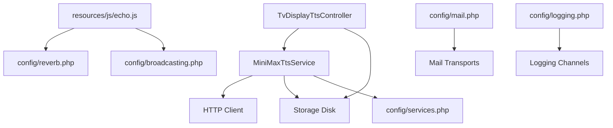

# Service Integrations

<cite>
**Referenced Files in This Document**
- [services.php](file://config/services.php)
- [broadcasting.php](file://config/broadcasting.php)
- [mail.php](file://config/mail.php)
- [reverb.php](file://config/reverb.php)
- [logging.php](file://config/logging.php)
- [app.php](file://config/app.php)
- [MiniMaxTtsService.php](file://app/Services/Tts/MiniMaxTtsService.php)
- [TvDisplayTtsController.php](file://app/Http/Controllers/TvDisplayTtsController.php)
- [echo.js](file://resources/js/echo.js)
- [institution.php](file://config/institution.php)
- [MiniMaxTtsServiceTest.php](file://tests/Feature/Tts/MiniMaxTtsServiceTest.php)
</cite>

## Table of Contents
1. [Introduction](#introduction)
2. [Project Structure](#project-structure)
3. [Core Components](#core-components)
4. [Architecture Overview](#architecture-overview)
5. [Detailed Component Analysis](#detailed-component-analysis)
6. [Dependency Analysis](#dependency-analysis)
7. [Performance Considerations](#performance-considerations)
8. [Troubleshooting Guide](#troubleshooting-guide)
9. [Conclusion](#conclusion)
10. [Appendices](#appendices)

## Introduction
This document describes Service Integrations configuration for the PTSP system, focusing on external service integrations used by the platform. It covers:
- Text-to-Speech (TTS) via MiniMax, including API keys, endpoints, timeouts, caching, and fallback strategies
- WebSocket broadcasting with Laravel Reverb and client-side Echo configuration
- Email service configuration supporting multiple transports and failover/round-robin strategies
- Institutional branding and configuration settings
- Health checks, fallback mechanisms, error handling, and monitoring/logging for external interactions

## Project Structure
Service integrations are primarily configured through Laravel’s configuration files under config/, with runtime behavior implemented in dedicated service classes and controllers. Key areas:
- External service credentials and options: config/services.php
- Broadcasting driver and Reverb server/client options: config/broadcasting.php and config/reverb.php
- Email transports and global sender identity: config/mail.php
- Logging channels and levels: config/logging.php
- Application-wide settings affecting integrations: config/app.php
- Institutional branding: config/institution.php
- TTS service implementation and controller: app/Services/Tts/MiniMaxTtsService.php and app/Http/Controllers/TvDisplayTtsController.php
- Client-side Echo configuration for Reverb: resources/js/echo.js
- Tests validating TTS behavior and error handling: tests/Feature/Tts/MiniMaxTtsServiceTest.php

**Diagram sources**
- [services.php:1-61](file://config/services.php#L1-L61)
- [broadcasting.php:1-83](file://config/broadcasting.php#L1-L83)
- [reverb.php:1-103](file://config/reverb.php#L1-L103)
- [mail.php:1-119](file://config/mail.php#L1-L119)
- [logging.php:1-133](file://config/logging.php#L1-L133)
- [app.php:42-81](file://config/app.php#L42-L81)
- [institution.php:1-10](file://config/institution.php#L1-L10)
- [MiniMaxTtsService.php:1-312](file://app/Services/Tts/MiniMaxTtsService.php#L1-L312)
- [TvDisplayTtsController.php:1-62](file://app/Http/Controllers/TvDisplayTtsController.php#L1-L62)
- [echo.js:1-14](file://resources/js/echo.js#L1-L14)

**Section sources**
- [services.php:1-61](file://config/services.php#L1-L61)
- [broadcasting.php:1-83](file://config/broadcasting.php#L1-L83)
- [reverb.php:1-103](file://config/reverb.php#L1-L103)
- [mail.php:1-119](file://config/mail.php#L1-L119)
- [logging.php:1-133](file://config/logging.php#L1-L133)
- [app.php:42-81](file://config/app.php#L42-L81)
- [institution.php:1-10](file://config/institution.php#L1-L10)
- [MiniMaxTtsService.php:1-312](file://app/Services/Tts/MiniMaxTtsService.php#L1-L312)
- [TvDisplayTtsController.php:1-62](file://app/Http/Controllers/TvDisplayTtsController.php#L1-L62)
- [echo.js:1-14](file://resources/js/echo.js#L1-L14)

## Core Components
- MiniMax TTS Service: Implements synchronous, asynchronous, and automatic strategies for generating speech, with caching, retry/fallback logic, and robust error handling.
- TV Display TTS Controller: Exposes endpoints to generate announcements and serve cached audio, with graceful fallback to browser playback when external TTS is unavailable.
- Broadcasting (Reverb): Provides WebSocket broadcasting with configurable server and client options.
- Email Service: Supports multiple transports (SMTP, SES, Postmark, Resend, Sendmail, Log, Array) with failover and round-robin strategies.
- Logging: Centralized logging channels for structured monitoring and alerting.
- Institutional Settings: Environment-driven branding and operational details.

**Section sources**
- [MiniMaxTtsService.php:11-312](file://app/Services/Tts/MiniMaxTtsService.php#L11-L312)
- [TvDisplayTtsController.php:12-62](file://app/Http/Controllers/TvDisplayTtsController.php#L12-L62)
- [broadcasting.php:17-82](file://config/broadcasting.php#L17-L82)
- [reverb.php:16-102](file://config/reverb.php#L16-L102)
- [mail.php:38-118](file://config/mail.php#L38-L118)
- [logging.php:53-133](file://config/logging.php#L53-L133)
- [institution.php:3-9](file://config/institution.php#L3-L9)

## Architecture Overview
The system integrates external services through configuration-driven components:
- TTS requests are handled by a controller that delegates to a service class. The service interacts with the MiniMax API, caches results, and serves them via the controller.
- Broadcasting leverages Laravel Reverb with a client-side Echo configuration for real-time updates.
- Email delivery is abstracted through Laravel’s mailer system with multiple transport options and resilience strategies.
- Logging captures errors and operational events for monitoring and diagnostics.

**Diagram sources**
- [TvDisplayTtsController.php:14-60](file://app/Http/Controllers/TvDisplayTtsController.php#L14-L60)
- [MiniMaxTtsService.php:16-44](file://app/Services/Tts/MiniMaxTtsService.php#L16-L44)
- [MiniMaxTtsService.php:53-180](file://app/Services/Tts/MiniMaxTtsService.php#L53-L180)
- [MiniMaxTtsService.php:182-220](file://app/Services/Tts/MiniMaxTtsService.php#L182-L220)

## Detailed Component Analysis

### MiniMax TTS Service
- Purpose: Generate speech from text using MiniMax, cache results, and serve audio to clients.
- Strategies:
  - sync: Direct synthesis endpoint with fixed timeout.
  - async: Task creation, polling with configurable attempts/intervals, and file retrieval/download.
  - auto: Attempt async first; fall back to sync if async fails.
- Caching: Uses a disk and path prefix configured via services.minimax.*. Detects stale tar archives and refreshes cache.
- Error handling: Validates API responses, decodes hex audio, extracts MP3 from tar archives, and throws descriptive exceptions.
- Timeouts: HTTP client timeouts applied per request; polling interval and max attempts configurable.

**Diagram sources**
- [MiniMaxTtsService.php:16-44](file://app/Services/Tts/MiniMaxTtsService.php#L16-L44)
- [MiniMaxTtsService.php:53-180](file://app/Services/Tts/MiniMaxTtsService.php#L53-L180)
- [MiniMaxTtsService.php:246-255](file://app/Services/Tts/MiniMaxTtsService.php#L246-L255)

**Section sources**
- [MiniMaxTtsService.php:11-312](file://app/Services/Tts/MiniMaxTtsService.php#L11-L312)
- [services.php:45-58](file://config/services.php#L45-L58)
- [MiniMaxTtsServiceTest.php:31-305](file://tests/Feature/Tts/MiniMaxTtsServiceTest.php#L31-L305)

### TV Display TTS Controller
- Endpoint: Generates announcements and returns either external TTS metadata or falls back to browser playback.
- Audio serving: Validates cache key, reads from configured storage disk, and returns MP3 with appropriate headers.
- Fallback behavior: On TTS failure or missing cache, responds with provider browser to play synthesized audio in the browser.

**Diagram sources**
- [TvDisplayTtsController.php:14-60](file://app/Http/Controllers/TvDisplayTtsController.php#L14-L60)
- [MiniMaxTtsService.php:16-44](file://app/Services/Tts/MiniMaxTtsService.php#L16-L44)

**Section sources**
- [TvDisplayTtsController.php:12-62](file://app/Http/Controllers/TvDisplayTtsController.php#L12-L62)
- [MiniMaxTtsService.php:11-312](file://app/Services/Tts/MiniMaxTtsService.php#L11-L312)

### Broadcasting with Laravel Reverb
- Driver selection: Broadcasting default connection is configurable; Reverb is supported with TLS/host/port/scheme options.
- Server configuration: Reverb server host/port/path, scaling via Redis, ingestion intervals, and rate limiting.
- Client configuration: Echo initialized with broadcaster, app key, host, port, TLS mode, and transport protocols.

**Diagram sources**
- [echo.js:6-14](file://resources/js/echo.js#L6-L14)
- [reverb.php:29-99](file://config/reverb.php#L29-L99)
- [broadcasting.php:33-47](file://config/broadcasting.php#L33-L47)

**Section sources**
- [broadcasting.php:17-82](file://config/broadcasting.php#L17-L82)
- [reverb.php:16-102](file://config/reverb.php#L16-L102)
- [echo.js:1-14](file://resources/js/echo.js#L1-L14)

### Email Service Configuration
- Transports: SMTP, SES, Postmark, Resend, Sendmail, Log, Array, Failover, RoundRobin.
- Failover: Retries across configured mailers with retry intervals.
- RoundRobin: Distributes load across multiple providers.
- Global sender identity: From address and name configured centrally.

**Diagram sources**
- [mail.php:38-118](file://config/mail.php#L38-L118)

**Section sources**
- [mail.php:17-118](file://config/mail.php#L17-L118)

### Institutional API Settings
- Institutional branding and operational details are driven by environment variables for name, address, phone, operating hours, and logo path.

**Section sources**
- [institution.php:3-9](file://config/institution.php#L3-L9)

## Dependency Analysis
- MiniMax TTS depends on:
  - HTTP client for API calls
  - Storage disk for caching
  - Configuration values for API key, voice/model, strategy, and cache settings
- TV Display TTS Controller depends on:
  - MiniMax TTS service for audio generation
  - Storage disk for serving cached audio
- Broadcasting depends on:
  - Reverb server configuration and scaling
  - Echo client configuration
- Email depends on:
  - Selected transport configuration
  - Optional failover/round-robin chain
- Logging depends on:
  - Channel configuration and levels

**Diagram sources**
- [MiniMaxTtsService.php:5-11](file://app/Services/Tts/MiniMaxTtsService.php#L5-L11)
- [TvDisplayTtsController.php:5-10](file://app/Http/Controllers/TvDisplayTtsController.php#L5-L10)
- [services.php:45-58](file://config/services.php#L45-L58)
- [broadcasting.php:33-47](file://config/broadcasting.php#L33-L47)
- [reverb.php:74-99](file://config/reverb.php#L74-L99)
- [mail.php:38-118](file://config/mail.php#L38-L118)
- [logging.php:53-133](file://config/logging.php#L53-L133)

**Section sources**
- [MiniMaxTtsService.php:1-312](file://app/Services/Tts/MiniMaxTtsService.php#L1-L312)
- [TvDisplayTtsController.php:1-62](file://app/Http/Controllers/TvDisplayTtsController.php#L1-L62)
- [broadcasting.php:1-83](file://config/broadcasting.php#L1-L83)
- [reverb.php:1-103](file://config/reverb.php#L1-L103)
- [mail.php:1-119](file://config/mail.php#L1-L119)
- [logging.php:1-133](file://config/logging.php#L1-L133)
- [services.php:1-61](file://config/services.php#L1-L61)

## Performance Considerations
- TTS caching: Reduce repeated API calls by leveraging cache_disk and cache_prefix; ensure cache refresh logic handles stale tar archives.
- Async strategy: Configure async_poll_attempts and async_poll_interval_ms to balance latency and reliability; tune timeouts for network conditions.
- Storage I/O: Choose a performant disk backend for cache_disk; monitor disk usage and rotation policies.
- Broadcasting: Adjust Reverb server scaling and Redis settings for concurrent connections and message throughput.
- Email throughput: Use roundrobin or failover strategies to distribute load and improve resilience; set retry_after appropriately.

[No sources needed since this section provides general guidance]

## Troubleshooting Guide
Common issues and resolutions:
- TTS generation failures:
  - Verify MINIMAX_API_KEY and MINIMAX_VOICE_ID are set.
  - Check strategy configuration (sync vs async vs auto) and adjust timeouts.
  - Inspect cache_disk and cache_prefix; ensure storage permissions.
  - Review API response validation and error messages for root cause.
- TV display audio not playing:
  - Confirm cache_key format and existence on cache_disk.
  - Validate audio URL routing and response headers.
- Broadcasting not connecting:
  - Verify REVERB_APP_KEY/SECRET/ID and host/port/scheme.
  - Ensure Echo client matches server configuration (host, port, TLS).
- Email delivery problems:
  - Select appropriate mailer transport and credentials.
  - Enable failover or roundrobin to mitigate provider outages.
  - Check global from address and name configuration.

**Section sources**
- [MiniMaxTtsService.php:232-244](file://app/Services/Tts/MiniMaxTtsService.php#L232-L244)
- [TvDisplayTtsController.php:41-60](file://app/Http/Controllers/TvDisplayTtsController.php#L41-L60)
- [broadcasting.php:33-47](file://config/broadcasting.php#L33-L47)
- [reverb.php:74-99](file://config/reverb.php#L74-L99)
- [mail.php:82-98](file://config/mail.php#L82-L98)

## Conclusion
The PTSP system integrates external services through configurable components:
- MiniMax TTS provides flexible synthesis strategies with caching and robust error handling.
- Laravel Reverb enables scalable WebSocket broadcasting with client-side Echo.
- Email delivery is resilient through multiple transports and failover strategies.
- Logging and configuration ensure observability and operability across environments.

[No sources needed since this section summarizes without analyzing specific files]

## Appendices

### Configuration Reference

- MiniMax TTS
  - Keys: MINIMAX_API_KEY, MINIMAX_VOICE_ID
  - Options: MINIMAX_MODEL, MINIMAX_STRATEGY, MINIMAX_LANGUAGE_BOOST, MINIMAX_SPEED, MINIMAX_VOL, MINIMAX_PITCH
  - Async tuning: MINIMAX_ASYNC_POLL_ATTEMPTS, MINIMAX_ASYNC_POLL_INTERVAL_MS
  - Cache: MINIMAX_CACHE_DISK, MINIMAX_CACHE_PREFIX

- Broadcasting (Reverb)
  - Driver: BROADCAST_CONNECTION
  - Server: REVERB_SERVER, REVERB_SERVER_HOST, REVERB_SERVER_PORT, REVERB_SERVER_PATH
  - App: REVERB_APP_KEY, REVERB_APP_SECRET, REVERB_APP_ID, REVERB_HOST, REVERB_PORT, REVERB_SCHEME
  - Scaling: REVERB_SCALING_ENABLED, REDIS_URL/HOST/PORT/USERNAME/PASSWORD/DB/TIMEOUT
  - Rate limiting: REVERB_APP_RATE_LIMITING_ENABLED, REVERB_APP_RATE_LIMIT_MAX_ATTEMPTS, REVERB_APP_RATE_LIMIT_DECAY_SECONDS, REVERB_APP_RATE_LIMIT_TERMINATE

- Email
  - Default: MAIL_MAILER
  - SMTP: MAIL_SCHEME, MAIL_URL, MAIL_HOST, MAIL_PORT, MAIL_USERNAME, MAIL_PASSWORD, MAIL_EHLO_DOMAIN
  - SES/Postmark/Resend: Provider-specific keys
  - Sendmail: MAIL_SENDMAIL_PATH
  - Log: MAIL_LOG_CHANNEL
  - Failover/RoundRobin: retry_after and mailers arrays

- Logging
  - Channel: LOG_CHANNEL, LOG_STACK, LOG_LEVEL
  - Slack/Papertrail/syslog/errorlog/stderr: Related environment variables

- Application
  - Debug: APP_DEBUG
  - URL/timezone/locale: APP_URL, APP_TIMEZONE, APP_LOCALE

- Institutional
  - INSTITUTION_NAME, INSTITUTION_ADDRESS, INSTITUTION_PHONE, OPERATING_HOURS, INSTITUTION_LOGO_PATH

**Section sources**
- [services.php:45-58](file://config/services.php#L45-L58)
- [broadcasting.php:18,33-47](file://config/broadcasting.php#L18,L33-L47)
- [reverb.php:16,29-99](file://config/reverb.php#L16,L29-L99)
- [mail.php:17,38-118](file://config/mail.php#L17,L38-L118)
- [logging.php:21,53-133](file://config/logging.php#L21,L53-133)
- [app.php:42,55,68,81](file://config/app.php#L42,L55,L68,L81)
- [institution.php:3-9](file://config/institution.php#L3-L9)

### Environment Alternatives and Examples
- TTS Strategy Alternatives:
  - sync: Immediate response; higher risk of timeout under load.
  - async: Better for long texts; requires polling configuration tuning.
  - auto: Recommended default; tries async first, falls back to sync.
- Email Transport Alternatives:
  - SMTP for self-hosted mail servers.
  - SES/Postmark/Resend for cloud providers.
  - Failover/roundrobin for redundancy and load distribution.
- Broadcasting Alternatives:
  - Pusher/Ably for managed WebSocket services.
  - Redis for custom pub/sub patterns (requires additional configuration).

[No sources needed since this section provides general guidance]

### Monitoring and Logging for External Services
- Logging channels:
  - single, daily, slack, papertrail, stderr, syslog, errorlog, stack, null
  - Configure LOG_CHANNEL, LOG_STACK, LOG_LEVEL, and provider-specific variables
- Observability hooks:
  - Capture TTS API response codes and messages
  - Track cache hit/miss ratios and storage I/O
  - Monitor broadcasting connection counts and rate limits
  - Record email delivery outcomes and transport errors

**Section sources**
- [logging.php:53-133](file://config/logging.php#L53-L133)
- [MiniMaxTtsService.php:232-244](file://app/Services/Tts/MiniMaxTtsService.php#L232-L244)
- [reverb.php:74-99](file://config/reverb.php#L74-L99)
- [mail.php:82-98](file://config/mail.php#L82-L98)