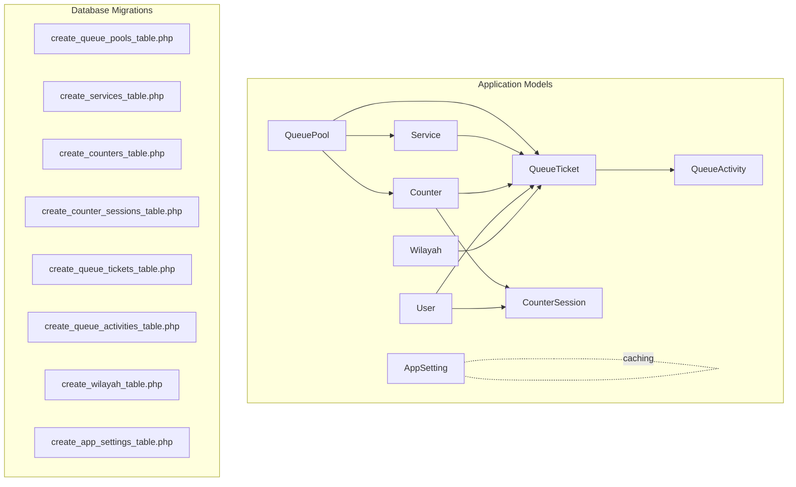
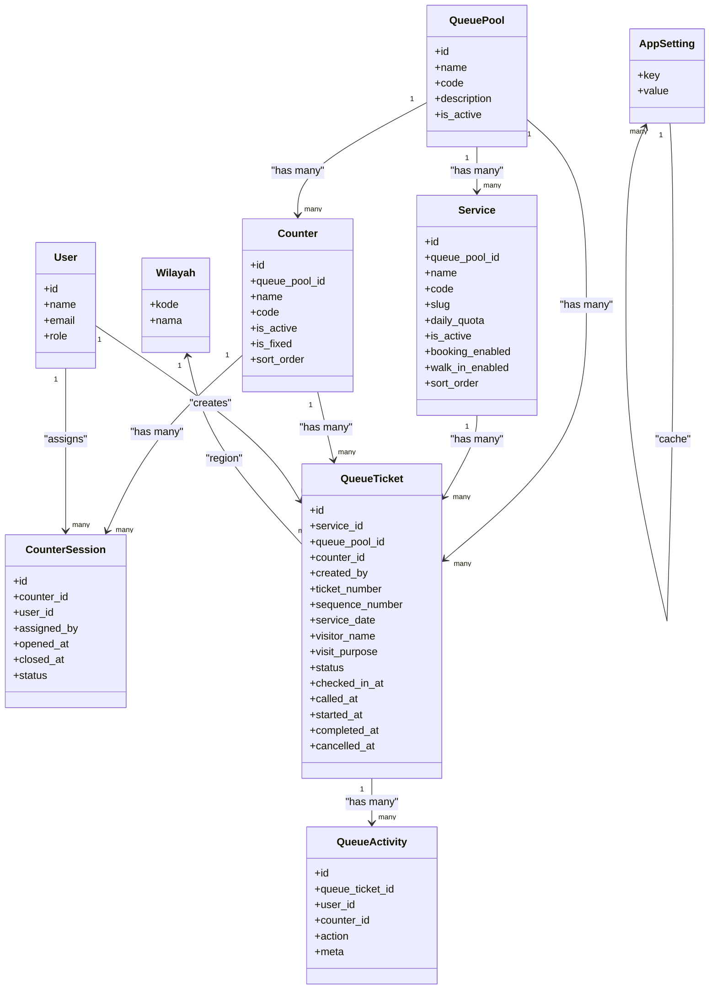
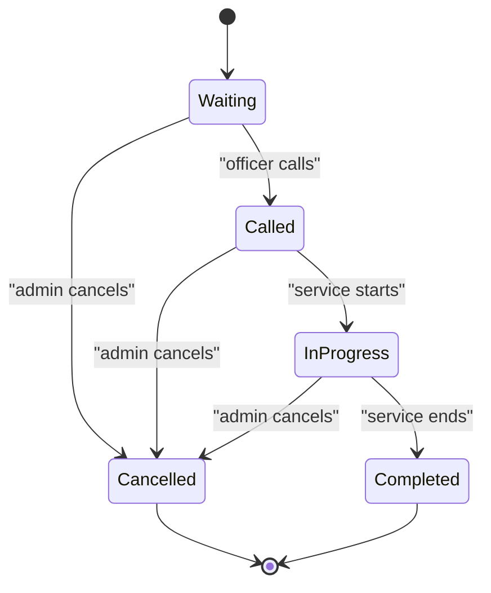
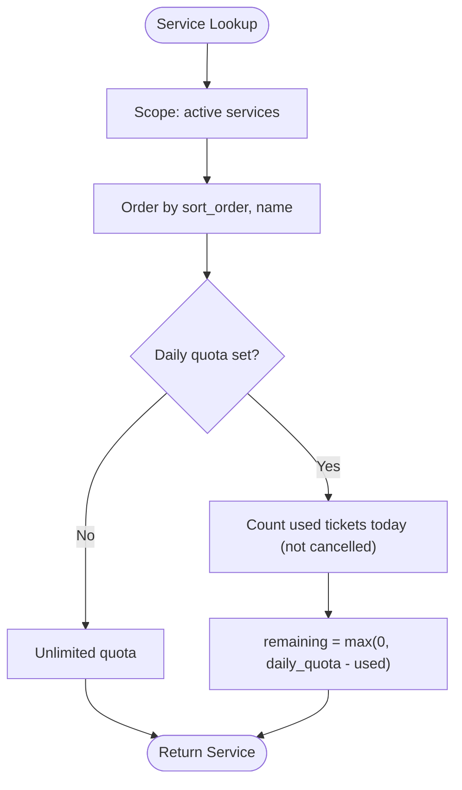
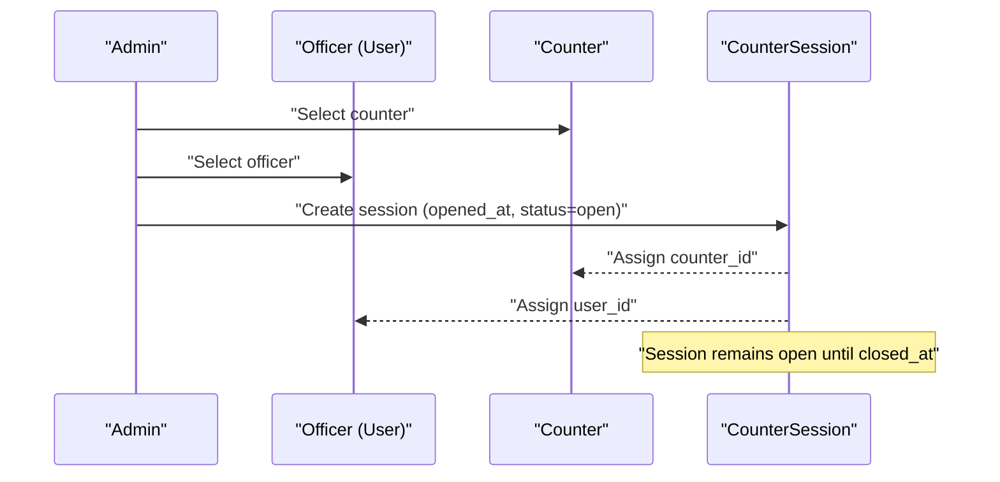
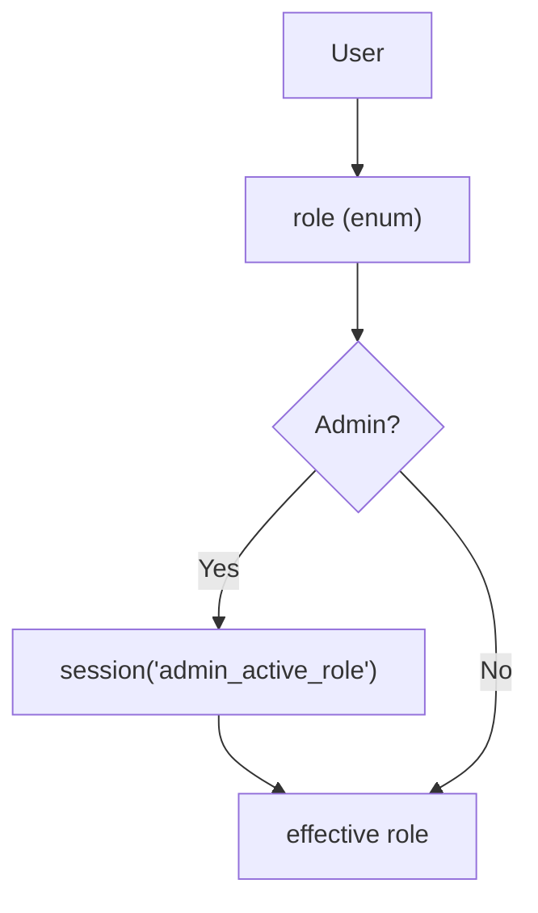
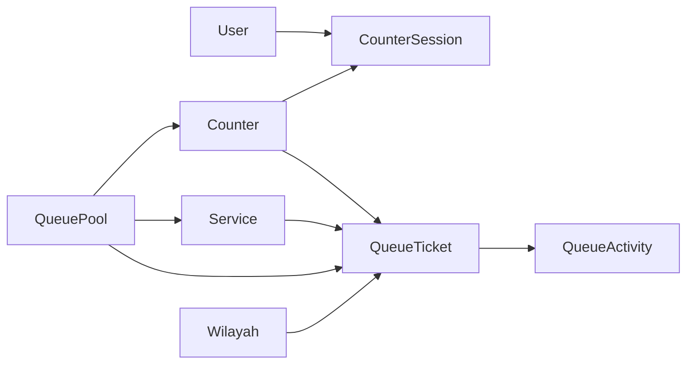
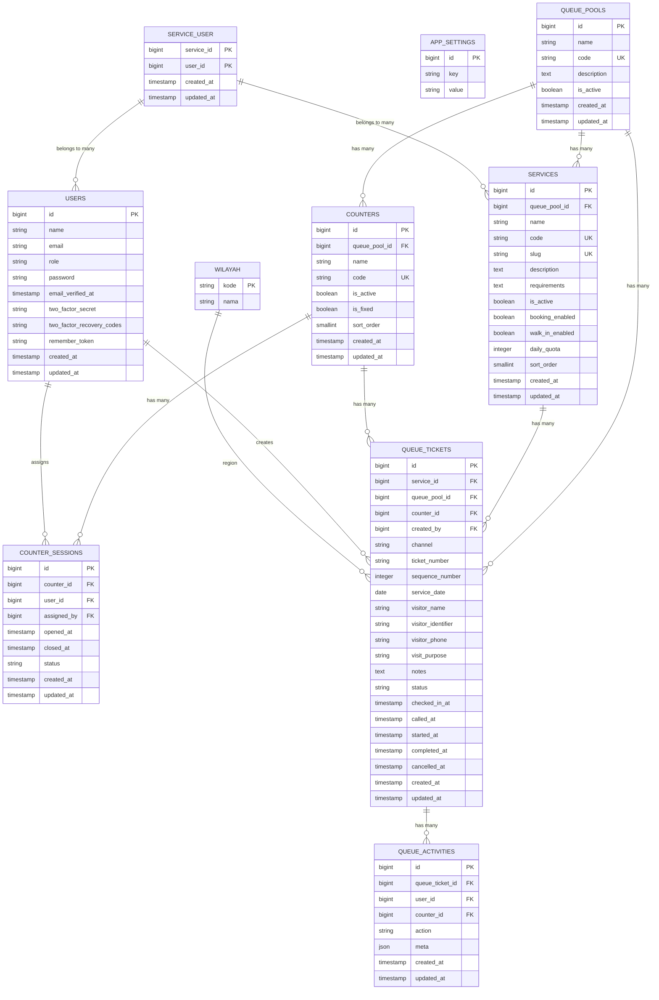

# Core Models and Database

<cite>
**Referenced Files in This Document**
- [QueueTicket.php](file://app/Models/QueueTicket.php)
- [Service.php](file://app/Models/Service.php)
- [Counter.php](file://app/Models/Counter.php)
- [User.php](file://app/Models/User.php)
- [CounterSession.php](file://app/Models/CounterSession.php)
- [QueuePool.php](file://app/Models/QueuePool.php)
- [QueueActivity.php](file://app/Models/QueueActivity.php)
- [Wilayah.php](file://app/Models/Wilayah.php)
- [AppSetting.php](file://app/Models/AppSetting.php)
- [create_queue_pools_table.php](file://database/migrations/2026_03_06_015234_create_queue_pools_table.php)
- [create_services_table.php](file://database/migrations/2026_03_06_015235_create_services_table.php)
- [create_counters_table.php](file://database/migrations/2026_03_06_015236_create_counters_table.php)
- [create_counter_sessions_table.php](file://database/migrations/2026_03_06_015237_create_counter_sessions_table.php)
- [create_queue_tickets_table.php](file://database/migrations/2026_03_06_015238_create_queue_tickets_table.php)
- [create_queue_activities_table.php](file://database/migrations/2026_03_06_015239_create_queue_activities_table.php)
- [add_role_to_users_table.php](file://database/migrations/2026_03_06_024605_add_role_to_users_table.php)
- [add_letter_code_to_services_table.php](file://database/migrations/2026_03_07_075319_add_letter_code_to_services_table.php)
- [update_queue_tickets_unique_indexes.php](file://database/migrations/2026_03_07_075319_update_queue_tickets_unique_indexes.php)
- [create_service_user_table.php](file://database/migrations/2026_03_11_073137_create_service_user_table.php)
- [add_visitor_address_and_wilayah_to_queue_tickets_table.php](file://database/migrations/2026_03_11_072249_add_visitor_address_and_wilayah_to_queue_tickets_table.php)
- [create_wilayah_table.php](file://database/migrations/2026_03_11_072249_create_wilayah_table.php)
- [create_app_settings_table.php](file://database/migrations/2026_03_11_073137_create_app_settings_table.php)
- [drop_visitor_address_from_queue_tickets_table.php](file://database/migrations/2026_03_11_074346_drop_visitor_address_from_queue_tickets_table.php)
- [add_user_id_created_at_index_to_queue_activities_table.php](file://database/migrations/2026_03_13_143634_add_user_id_created_at_index_to_queue_activities_table.php)
- [add_visit_purpose_to_queue_tickets_and_is_fixed_to_counters_and_assigned_by_to_counter_sessions.php](file://database/migrations/2026_03_30_181555_add_visit_purpose_to_queue_tickets_and_is_fixed_to_counters_and_assigned_by_to_counter_sessions.php)
- [QueueTicketFactory.php](file://database/factories/QueueTicketFactory.php)
- [ServiceFactory.php](file://database/factories/ServiceFactory.php)
- [CounterFactory.php](file://database/factories/CounterFactory.php)
- [UserFactory.php](file://database/factories/UserFactory.php)
- [CounterSessionFactory.php](file://database/factories/CounterSessionFactory.php)
- [QueueActivityFactory.php](file://database/factories/QueueActivityFactory.php)
- [QueueMvpSeeder.php](file://database/seeders/QueueMvpSeeder.php)
- [WilayahSeeder.php](file://database/seeders/WilayahSeeder.php)
- [DatabaseSeeder.php](file://database/seeders/DatabaseSeeder.php)
- [QueueStatus.php](file://app/Enums/QueueStatus.php)
- [UserRole.php](file://app/Enums/UserRole.php)
</cite>

## Table of Contents
1. [Introduction](#introduction)
2. [Project Structure](#project-structure)
3. [Core Components](#core-components)
4. [Architecture Overview](#architecture-overview)
5. [Detailed Component Analysis](#detailed-component-analysis)
6. [Dependency Analysis](#dependency-analysis)
7. [Performance Considerations](#performance-considerations)
8. [Troubleshooting Guide](#troubleshooting-guide)
9. [Conclusion](#conclusion)
10. [Appendices](#appendices)

## Introduction
This document provides comprehensive data model documentation for the PTSP Queue Management System. It details the core entities (QueueTicket, Service, Counter, User, CounterSession, QueuePool, QueueActivity, Wilayah, AppSetting), their relationships, field definitions, data types, primary/foreign keys, indexes, constraints, and validation rules. It also explains the queue ticket lifecycle, service hierarchies, counter assignments, user role-based access patterns, data access patterns via Eloquent, query optimization strategies, data lifecycle management, audit trails, and migration and seeding processes.

## Project Structure
The data model spans application models under app/Models and database schema definitions under database/migrations. Factories under database/factories support testing and seeding, while seeders populate initial data. Enumerations define domain-specific statuses and roles.

**Diagram sources**
- [QueuePool.php:1-43](file://app/Models/QueuePool.php#L1-L43)
- [Service.php:1-101](file://app/Models/Service.php#L1-L101)
- [Counter.php:1-53](file://app/Models/Counter.php#L1-L53)
- [CounterSession.php:1-46](file://app/Models/CounterSession.php#L1-L46)
- [QueueTicket.php:1-121](file://app/Models/QueueTicket.php#L1-L121)
- [QueueActivity.php:1-44](file://app/Models/QueueActivity.php#L1-L44)
- [User.php:1-99](file://app/Models/User.php#L1-L99)
- [Wilayah.php:1-24](file://app/Models/Wilayah.php#L1-L24)
- [AppSetting.php:1-34](file://app/Models/AppSetting.php#L1-L34)
- [create_queue_pools_table.php:1-32](file://database/migrations/2026_03_06_015234_create_queue_pools_table.php#L1-L32)
- [create_services_table.php:1-41](file://database/migrations/2026_03_06_015235_create_services_table.php#L1-L41)
- [create_counters_table.php:1-35](file://database/migrations/2026_03_06_015236_create_counters_table.php#L1-L35)
- [create_counter_sessions_table.php:1-90](file://database/migrations/2026_03_06_015237_create_counter_sessions_table.php#L1-L90)
- [create_queue_tickets_table.php:1-52](file://database/migrations/2026_03_06_015238_create_queue_tickets_table.php#L1-L52)
- [create_queue_activities_table.php:1-36](file://database/migrations/2026_03_06_015239_create_queue_activities_table.php#L1-L36)
- [create_wilayah_table.php:1-24](file://database/migrations/2026_03_11_072249_create_wilayah_table.php#L1-L24)
- [create_app_settings_table.php:1-34](file://database/migrations/2026_03_11_073137_create_app_settings_table.php#L1-L34)

**Section sources**
- [QueuePool.php:1-43](file://app/Models/QueuePool.php#L1-L43)
- [Service.php:1-101](file://app/Models/Service.php#L1-L101)
- [Counter.php:1-53](file://app/Models/Counter.php#L1-L53)
- [CounterSession.php:1-46](file://app/Models/CounterSession.php#L1-L46)
- [QueueTicket.php:1-121](file://app/Models/QueueTicket.php#L1-L121)
- [QueueActivity.php:1-44](file://app/Models/QueueActivity.php#L1-L44)
- [User.php:1-99](file://app/Models/User.php#L1-L99)
- [Wilayah.php:1-24](file://app/Models/Wilayah.php#L1-L24)
- [AppSetting.php:1-34](file://app/Models/AppSetting.php#L1-L34)

## Core Components
This section documents the core entities, their fields, relationships, and constraints.

- QueuePool
  - Purpose: Logical grouping of services, counters, and tickets.
  - Fields: id, name, code (unique), description, is_active, timestamps.
  - Relationships: Has many services, counters, queueTickets.
  - Indexes: None explicitly defined in model; migration creates code uniqueness and optional pool+active index.

- Service
  - Purpose: Defines available services with quotas and availability modes.
  - Fields: id, queue_pool_id (FK), name, code (unique), slug (unique), description, requirements, is_active, booking_enabled, walk_in_enabled, daily_quota (nullable), sort_order, letter_code (added later), timestamps.
  - Relationships: Belongs to queuePool, has many queueTickets, belongs to many users.
  - Indexes: pool+active composite index; unique constraints on code and slug.
  - Constraints: daily_quota integer; booleans; sort_order small integer.

- Counter
  - Purpose: Physical or logical service counters.
  - Fields: id, queue_pool_id (FK), name, code (unique), is_active, is_fixed, sort_order, timestamps.
  - Relationships: Belongs to queuePool, has many queueTickets, has many sessions, has many activities.
  - Indexes: pool+active composite index; unique code.
  - Constraints: booleans; sort_order small integer.

- CounterSession
  - Purpose: Tracks which officer worked at which counter and when.
  - Fields: id, counter_id (FK), user_id (FK), assigned_by (FK to users), opened_at, closed_at, status, timestamps.
  - Relationships: Belongs to counter, user, assigner (user).
  - Indexes: counter_id+status, user_id+status.
  - Constraints: status string; timestamps; foreign keys with cascade updates.

- QueueTicket
  - Purpose: Individual queue entries for visitors.
  - Fields: id, service_id (FK), queue_pool_id (FK), counter_id (FK, nullable), created_by (FK to users), channel, ticket_number, sequence_number, service_date, visitor_name, visitor_identifier, visitor_phone, visit_purpose, notes, status, checked_in_at, called_at, started_at, completed_at, cancelled_at, timestamps.
  - Relationships: Belongs to service, queuePool, counter, creator (user), has many activities.
  - Indexes: date+status, pool+date+status, service_id+service_date; unique constraints on pool+date+sequence and pool+date+ticket_number.
  - Constraints: status enum; sequence_number unsigned integer; dates/timestamps; nullable fields for optional visitor info and counter assignment.

- QueueActivity
  - Purpose: Audit trail for ticket actions.
  - Fields: id, queue_ticket_id (FK), user_id (nullable), counter_id (nullable), action, meta (JSON), timestamps.
  - Relationships: Belongs to queueTicket, user, counter.
  - Indexes: ticket_id+created_at, action+created_at.
  - Constraints: action string; meta JSON; cascade on update; null on delete for user/counter.

- User
  - Purpose: System users (officers, admins).
  - Fields: id, name, email, role (enum), password, two-factor fields, remember_token, timestamps.
  - Relationships: Belongs to many services.
  - Constraints: role enum; hashed password; hidden sensitive fields; helpers for initials and role checks.

- Wilayah
  - Purpose: Geographic administrative regions.
  - Fields: kode (PK, string), nama, timestamps.
  - Notes: Non-incrementing primary key; table name differs from typical pluralization.

- AppSetting
  - Purpose: Application-wide settings cached in memory.
  - Fields: id, key, value.
  - Access pattern: Static methods getValue/setValue with cache persistence.

**Section sources**
- [QueuePool.php:14-42](file://app/Models/QueuePool.php#L14-L42)
- [Service.php:17-41](file://app/Models/Service.php#L17-L41)
- [Counter.php:15-31](file://app/Models/Counter.php#L15-L31)
- [CounterSession.php:14-29](file://app/Models/CounterSession.php#L14-L29)
- [QueueTicket.php:17-52](file://app/Models/QueueTicket.php#L17-L52)
- [QueueActivity.php:14-27](file://app/Models/QueueActivity.php#L14-L27)
- [User.php:24-55](file://app/Models/User.php#L24-L55)
- [Wilayah.php:9-23](file://app/Models/Wilayah.php#L9-L23)
- [AppSetting.php:10-32](file://app/Models/AppSetting.php#L10-L32)

## Architecture Overview
The system follows a pool-based queue architecture:
- QueuePool groups related services and counters.
- Service defines offerings and capacity (daily quota).
- Counter represents service points.
- QueueTicket represents individual visits with lifecycle timestamps and status.
- QueueActivity records all actions for audit.
- CounterSession links users to counters for work shifts.
- User holds roles and permissions.
- Wilayah supports region-aware visitor data.
- AppSetting centralizes configurable values with caching.

**Diagram sources**
- [QueuePool.php:28-41](file://app/Models/QueuePool.php#L28-L41)
- [Service.php:43-57](file://app/Models/Service.php#L43-L57)
- [Counter.php:33-51](file://app/Models/Counter.php#L33-L51)
- [CounterSession.php:31-44](file://app/Models/CounterSession.php#L31-L44)
- [QueueTicket.php:54-77](file://app/Models/QueueTicket.php#L54-L77)
- [QueueActivity.php:29-42](file://app/Models/QueueActivity.php#L29-L42)
- [User.php:93-97](file://app/Models/User.php#L93-L97)
- [Wilayah.php:9-23](file://app/Models/Wilayah.php#L9-L23)
- [AppSetting.php:8-33](file://app/Models/AppSetting.php#L8-L33)

## Detailed Component Analysis

### QueueTicket Lifecycle
QueueTicket captures the end-to-end journey of a visitor:
- Creation: via front desk or kiosk; assigns service, pool, date, sequence number, and ticket number.
- Status transitions: Waiting → Called → In Progress → Completed or Cancelled.
- Check-in: marks visitor arrival time.
- Counter assignment: optional during creation or later.
- Audit: every state change recorded in QueueActivity.

**Diagram sources**
- [QueueTicket.php:82-94](file://app/Models/QueueTicket.php#L82-L94)
- [QueueActivity.php:29-42](file://app/Models/QueueActivity.php#L29-L42)

**Section sources**
- [QueueTicket.php:54-77](file://app/Models/QueueTicket.php#L54-L77)
- [QueueTicket.php:82-112](file://app/Models/QueueTicket.php#L82-L112)
- [QueueActivity.php:29-42](file://app/Models/QueueActivity.php#L29-L42)

### Service Hierarchies and Quotas
Services are grouped under QueuePool and can be filtered by activity and ordering. Daily quotas are enforced per service per day.

**Diagram sources**
- [Service.php:62-67](file://app/Models/Service.php#L62-L67)
- [Service.php:73-99](file://app/Models/Service.php#L73-L99)
- [QueueTicket.php:99-111](file://app/Models/QueueTicket.php#L99-L111)

**Section sources**
- [Service.php:43-57](file://app/Models/Service.php#L43-L57)
- [Service.php:62-67](file://app/Models/Service.php#L62-L67)
- [Service.php:73-99](file://app/Models/Service.php#L73-L99)

### Counter Assignments and Sessions
Officers are assigned to counters via sessions. Fixed counters can be designated for specific services or users.

**Diagram sources**
- [CounterSession.php:31-44](file://app/Models/CounterSession.php#L31-L44)
- [Counter.php:33-51](file://app/Models/Counter.php#L33-L51)
- [User.php:93-97](file://app/Models/User.php#L93-L97)

**Section sources**
- [CounterSession.php:31-44](file://app/Models/CounterSession.php#L31-L44)
- [Counter.php:33-51](file://app/Models/Counter.php#L33-L51)
- [User.php:93-97](file://app/Models/User.php#L93-L97)

### User Role-Based Access Patterns
Users have enumerated roles. Admins can switch roles during sessions, affecting dashboard and actions.

**Diagram sources**
- [User.php:69-91](file://app/Models/User.php#L69-L91)
- [UserRole.php](file://app/Enums/UserRole.php)

**Section sources**
- [User.php:69-91](file://app/Models/User.php#L69-L91)
- [UserRole.php](file://app/Enums/UserRole.php)

### Data Access Patterns and Eloquent Relationships
- Eager loading recommended for reporting and list views to avoid N+1 queries.
- Scopes encapsulate common filters (e.g., not cancelled, for service on date).
- Pivot tables (service_user) enable role-based service access.

**Section sources**
- [QueueTicket.php:99-111](file://app/Models/QueueTicket.php#L99-L111)
- [Service.php:53-57](file://app/Models/Service.php#L53-L57)
- [create_service_user_table.php](file://database/migrations/2026_03_11_073137_create_service_user_table.php)

### Audit Trails and QueueActivity
QueueActivity records all actions against tickets with timestamps and optional user/counter context. Indexes optimize lookups by ticket and action.

**Section sources**
- [QueueActivity.php:29-42](file://app/Models/QueueActivity.php#L29-L42)
- [create_queue_activities_table.php:23-24](file://database/migrations/2026_03_06_015239_create_queue_activities_table.php#L23-L24)

### Database Schema and Constraints
- Unique indexes ensure no duplicate sequences or ticket numbers per pool/date.
- Foreign keys maintain referential integrity across entities.
- Nullable fields accommodate optional visitor data and counter-less states.
- Additional columns added later (e.g., visit_purpose, is_fixed, assigned_by) reflect evolving requirements.

**Section sources**
- [create_queue_tickets_table.php:36-41](file://database/migrations/2026_03_06_015238_create_queue_tickets_table.php#L36-L41)
- [create_services_table.php:16-30](file://database/migrations/2026_03_06_015235_create_services_table.php#L16-L30)
- [create_counters_table.php:16-24](file://database/migrations/2026_03_06_015236_create_counters_table.php#L16-L24)
- [create_counter_sessions_table.php:21-32](file://database/migrations/2026_03_06_015237_create_counter_sessions_table.php#L21-L32)
- [create_queue_activities_table.php:16-21](file://database/migrations/2026_03_06_015239_create_queue_activities_table.php#L16-L21)
- [update_queue_tickets_unique_indexes.php](file://database/migrations/2026_03_07_075319_update_queue_tickets_unique_indexes.php)
- [add_visit_purpose_to_queue_tickets_and_is_fixed_to_counters_and_assigned_by_to_counter_sessions.php](file://database/migrations/2026_03_30_181555_add_visit_purpose_to_queue_tickets_and_is_fixed_to_counters_and_assigned_by_to_counter_sessions.php)

### Sample Data Structures
Representative rows for each table (field names only):
- QueuePool: id, name, code, description, is_active, timestamps
- Service: id, queue_pool_id, name, code, slug, description, requirements, is_active, booking_enabled, walk_in_enabled, daily_quota, sort_order, timestamps
- Counter: id, queue_pool_id, name, code, is_active, is_fixed, sort_order, timestamps
- CounterSession: id, counter_id, user_id, assigned_by, opened_at, closed_at, status, timestamps
- QueueTicket: id, service_id, queue_pool_id, counter_id, created_by, channel, ticket_number, sequence_number, service_date, visitor_name, visitor_identifier, visitor_phone, visit_purpose, notes, status, checked_in_at, called_at, started_at, completed_at, cancelled_at, timestamps
- QueueActivity: id, queue_ticket_id, user_id, counter_id, action, meta, timestamps
- User: id, name, email, role, password, two_factor fields, remember_token, timestamps
- Wilayah: kode, nama
- AppSetting: id, key, value

**Section sources**
- [QueuePool.php:14-26](file://app/Models/QueuePool.php#L14-L26)
- [Service.php:17-41](file://app/Models/Service.php#L17-L41)
- [Counter.php:15-31](file://app/Models/Counter.php#L15-L31)
- [CounterSession.php:14-29](file://app/Models/CounterSession.php#L14-L29)
- [QueueTicket.php:17-52](file://app/Models/QueueTicket.php#L17-L52)
- [QueueActivity.php:14-27](file://app/Models/QueueActivity.php#L14-L27)
- [User.php:24-55](file://app/Models/User.php#L24-L55)
- [Wilayah.php:19-22](file://app/Models/Wilayah.php#L19-L22)
- [AppSetting.php:10-13](file://app/Models/AppSetting.php#L10-L13)

## Dependency Analysis
The models form a tightly integrated graph with clear foreign key dependencies and shared pool semantics.

**Diagram sources**
- [User.php:93-97](file://app/Models/User.php#L93-L97)
- [CounterSession.php:31-44](file://app/Models/CounterSession.php#L31-L44)
- [Counter.php:33-51](file://app/Models/Counter.php#L33-L51)
- [QueueTicket.php:54-77](file://app/Models/QueueTicket.php#L54-L77)
- [QueuePool.php:28-41](file://app/Models/QueuePool.php#L28-L41)
- [QueueActivity.php:29-42](file://app/Models/QueueActivity.php#L29-L42)
- [Wilayah.php:9-23](file://app/Models/Wilayah.php#L9-L23)

**Section sources**
- [User.php:93-97](file://app/Models/User.php#L93-L97)
- [CounterSession.php:31-44](file://app/Models/CounterSession.php#L31-L44)
- [Counter.php:33-51](file://app/Models/Counter.php#L33-L51)
- [QueueTicket.php:54-77](file://app/Models/QueueTicket.php#L54-L77)
- [QueuePool.php:28-41](file://app/Models/QueuePool.php#L28-L41)
- [QueueActivity.php:29-42](file://app/Models/QueueActivity.php#L29-L42)
- [Wilayah.php:9-23](file://app/Models/Wilayah.php#L9-L23)

## Performance Considerations
- Indexes
  - QueueTicket: date+status, pool+date+status, service_id+service_date; unique(pool,date,sequence) and unique(pool,date,ticket_number).
  - QueueActivity: ticket_id+created_at, action+created_at.
  - CounterSession: counter_id+status, user_id+status.
  - Service/Counter: pool+is_active for fast filtering.
- Scopes and Queries
  - Use scopes (e.g., notCancelled, forServiceOnDate) to encapsulate filters and leverage indexes.
  - Prefer batch operations for bulk updates (e.g., status transitions).
- Caching
  - AppSetting leverages cache for settings retrieval; invalidate cache on updates.
- Eager Loading
  - Always eager load relationships (activities, creator, counter) for list/report views to prevent N+1 queries.
- Partitioning and Archival
  - Consider partitioning QueueTicket by service_date for very large datasets.
- Monitoring
  - Track slow queries and missing index usage via database profiling.

**Section sources**
- [create_queue_tickets_table.php:38-41](file://database/migrations/2026_03_06_015238_create_queue_tickets_table.php#L38-L41)
- [create_queue_activities_table.php:23-24](file://database/migrations/2026_03_06_015239_create_queue_activities_table.php#L23-L24)
- [create_counter_sessions_table.php:30-31](file://database/migrations/2026_03_06_015237_create_counter_sessions_table.php#L30-L31)
- [create_services_table.php:29](file://database/migrations/2026_03_06_015235_create_services_table.php#L29)
- [create_counters_table.php:23](file://database/migrations/2026_03_06_015236_create_counters_table.php#L23)
- [AppSetting.php:15-32](file://app/Models/AppSetting.php#L15-L32)

## Troubleshooting Guide
- Duplicate Ticket Numbers
  - Symptom: Integrity constraint violation on unique pool+date+ticket_number.
  - Resolution: Ensure ticket generation uses unique ticket_number per pool+date; verify generator logic.
- Missing Counter Assignment
  - Symptom: QueueTicket.counter_id remains null.
  - Resolution: Verify session exists and status is open; ensure officer is assigned to the counter.
- Exceeded Daily Quota
  - Symptom: Booking rejected when daily_quota reached.
  - Resolution: Check Service.getRemainingQuota and Service.isQuotaFull; adjust quotas or inform user.
- Audit Trail Gaps
  - Symptom: Missing actions in QueueActivity.
  - Resolution: Confirm actions call LogQueueActivity and that queue_ticket_id is present.
- Role-Based Access Issues
  - Symptom: Officers cannot access certain services.
  - Resolution: Confirm pivot service_user relationship and User.hasRole/activeRole logic.
- Region Data
  - Symptom: Visitor region not found.
  - Resolution: Ensure Wilayah kode matches visitor_wilayah_kode; seed WilayahSeeder if needed.

**Section sources**
- [QueueTicket.php:99-111](file://app/Models/QueueTicket.php#L99-L111)
- [Service.php:73-99](file://app/Models/Service.php#L73-L99)
- [CounterSession.php:31-44](file://app/Models/CounterSession.php#L31-L44)
- [QueueActivity.php:29-42](file://app/Models/QueueActivity.php#L29-L42)
- [User.php:69-91](file://app/Models/User.php#L69-L91)
- [Wilayah.php:9-23](file://app/Models/Wilayah.php#L9-L23)

## Conclusion
The PTSP Queue Management System employs a robust, pool-centric data model with clear relationships, strong constraints, and comprehensive audit trails. By leveraging scopes, indexes, and caching, the system supports efficient queue operations and reporting. Role-based access and session management ensure secure and traceable officer interactions. The documented lifecycle, hierarchies, and access patterns provide a blueprint for extending functionality while maintaining data integrity.

## Appendices

### Database Schema Diagram

**Diagram sources**
- [create_queue_pools_table.php:14-21](file://database/migrations/2026_03_06_015234_create_queue_pools_table.php#L14-L21)
- [create_services_table.php:14-27](file://database/migrations/2026_03_06_015235_create_services_table.php#L14-L27)
- [create_counters_table.php:14-21](file://database/migrations/2026_03_06_015236_create_counters_table.php#L14-L21)
- [create_counter_sessions_table.php:21-28](file://database/migrations/2026_03_06_015237_create_counter_sessions_table.php#L21-L28)
- [create_queue_tickets_table.php:14-34](file://database/migrations/2026_03_06_015238_create_queue_tickets_table.php#L14-L34)
- [create_queue_activities_table.php:14-21](file://database/migrations/2026_03_06_015239_create_queue_activities_table.php#L14-L21)
- [create_wilayah_table.php:9-17](file://database/migrations/2026_03_11_072249_create_wilayah_table.php#L9-L17)
- [create_app_settings_table.php:10-13](file://database/migrations/2026_03_11_073137_create_app_settings_table.php#L10-L13)
- [create_service_user_table.php](file://database/migrations/2026_03_11_073137_create_service_user_table.php)

### Migration Strategies and Data Seeding
- Migration Strategy
  - Incremental migrations preserve schema evolution; verify foreign key existence before adding constraints.
  - Use syncExistingTable for backward compatibility in counter_sessions.
- Seeding
  - DatabaseSeeder orchestrates initial population.
  - QueueMvpSeeder seeds core entities (pools, services, counters, users).
  - WilayahSeeder populates geographic regions.
  - Factory classes (QueueTicketFactory, ServiceFactory, CounterFactory, UserFactory, CounterSessionFactory, QueueActivityFactory) support deterministic test data.

**Section sources**
- [create_counter_sessions_table.php:35-80](file://database/migrations/2026_03_06_015237_create_counter_sessions_table.php#L35-L80)
- [DatabaseSeeder.php](file://database/seeders/DatabaseSeeder.php)
- [QueueMvpSeeder.php](file://database/seeders/QueueMvpSeeder.php)
- [WilayahSeeder.php](file://database/seeders/WilayahSeeder.php)
- [QueueTicketFactory.php](file://database/factories/QueueTicketFactory.php)
- [ServiceFactory.php](file://database/factories/ServiceFactory.php)
- [CounterFactory.php](file://database/factories/CounterFactory.php)
- [UserFactory.php](file://database/factories/UserFactory.php)
- [CounterSessionFactory.php](file://database/factories/CounterSessionFactory.php)
- [QueueActivityFactory.php](file://database/factories/QueueActivityFactory.php)