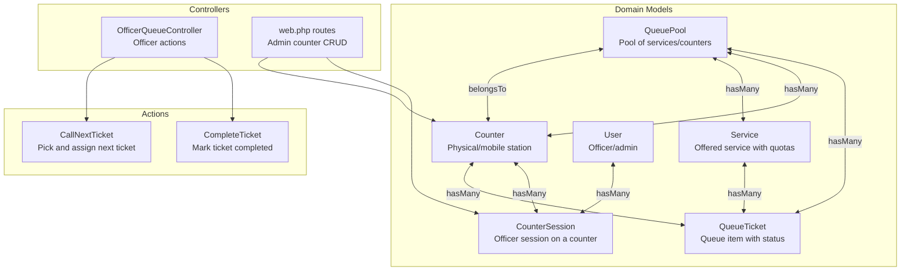
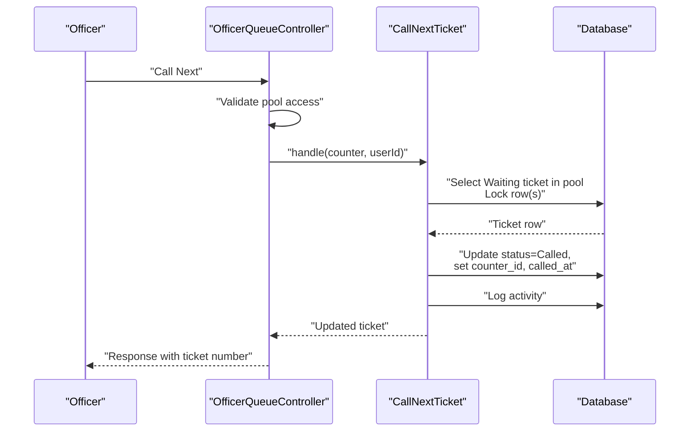
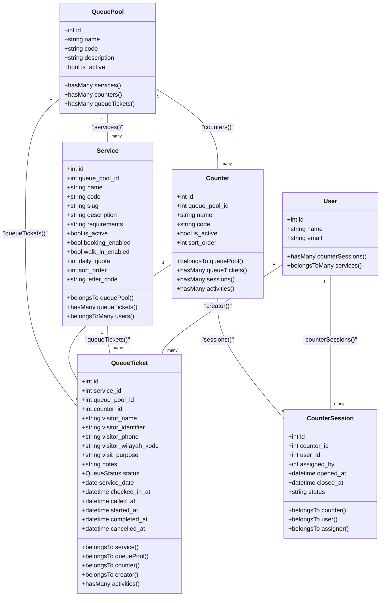

# Counter Model

<cite>
**Referenced Files in This Document**
- [Counter.php](file://app/Models/Counter.php)
- [CounterSession.php](file://app/Models/CounterSession.php)
- [Service.php](file://app/Models/Service.php)
- [QueuePool.php](file://app/Models/QueuePool.php)
- [QueueTicket.php](file://app/Models/QueueTicket.php)
- [StoreCounterRequest.php](file://app/Http/Requests/StoreCounterRequest.php)
- [UpdateCounterRequest.php](file://app/Http/Requests/UpdateCounterRequest.php)
- [CounterFactory.php](file://database/factories/CounterFactory.php)
- [CounterSessionFactory.php](file://database/factories/CounterSessionFactory.php)
- [2026_03_06_015236_create_counters_table.php](file://database/migrations/2026_03_06_015236_create_counters_table.php)
- [2026_03_06_015237_create_counter_sessions_table.php](file://database/migrations/2026_03_06_015237_create_counter_sessions_table.php)
- [OfficerQueueController.php](file://app/Http/Controllers/OfficerQueueController.php)
- [CallNextTicket.php](file://app/Actions/Queue/CallNextTicket.php)
- [CompleteTicket.php](file://app/Actions/Queue/CompleteTicket.php)
- [web.php](file://routes/web.php)
- [QueueMvpSeeder.php](file://database/seeders/QueueMvpSeeder.php)
</cite>

## Table of Contents
1. [Introduction](#introduction)
2. [Project Structure](#project-structure)
3. [Core Components](#core-components)
4. [Architecture Overview](#architecture-overview)
5. [Detailed Component Analysis](#detailed-component-analysis)
6. [Dependency Analysis](#dependency-analysis)
7. [Performance Considerations](#performance-considerations)
8. [Troubleshooting Guide](#troubleshooting-guide)
9. [Conclusion](#conclusion)

## Introduction
This document describes the Counter model and its ecosystem for managing physical counter operations and session tracking within the queue management system. It explains how counters are assigned to services, how geographic and pool-based scope limitations apply, and how operational constraints are enforced. It also documents the relationship between counters and CounterSession for tracking active officer sessions, counter configuration options (fixed vs. mobile), service-specific capabilities, queue ticket assignment, availability checks, capacity management via service quotas, and performance metrics collection through queue activities.

## Project Structure
The Counter model sits at the center of the queue domain, bridging queue pools, services, tickets, and officer sessions. Administrative and officer-facing controllers orchestrate operations such as assigning officers to counters, calling the next ticket, and completing service.

**Diagram sources**
- [Counter.php:33-46](file://app/Models/Counter.php#L33-L46)
- [CounterSession.php:31-44](file://app/Models/CounterSession.php#L31-L44)
- [Service.php:43-57](file://app/Models/Service.php#L43-L57)
- [QueuePool.php:28-41](file://app/Models/QueuePool.php#L28-L41)
- [QueueTicket.php:54-77](file://app/Models/QueueTicket.php#L54-L77)
- [OfficerQueueController.php:18-95](file://app/Http/Controllers/OfficerQueueController.php#L18-L95)
- [CallNextTicket.php:19-78](file://app/Actions/Queue/CallNextTicket.php#L19-L78)
- [CompleteTicket.php:17-47](file://app/Actions/Queue/CompleteTicket.php#L17-L47)
- [web.php:62-75](file://routes/web.php#L62-L75)

**Section sources**
- [Counter.php:10-52](file://app/Models/Counter.php#L10-L52)
- [CounterSession.php:9-45](file://app/Models/CounterSession.php#L9-L45)
- [Service.php:12-100](file://app/Models/Service.php#L12-L100)
- [QueuePool.php:9-42](file://app/Models/QueuePool.php#L9-L42)
- [QueueTicket.php:12-120](file://app/Models/QueueTicket.php#L12-L120)
- [web.php:62-75](file://routes/web.php#L62-L75)

## Core Components
- Counter: Represents a physical or mobile station within a queue pool. It maintains activation state, display order, and links to queue tickets and sessions.
- CounterSession: Tracks officer assignments to counters, including open/close timestamps and status.
- Service: Defines offered services with quotas, booking/walk-in enablement, and relationships to tickets.
- QueuePool: Logical grouping of services/counters/tickets.
- QueueTicket: Represents individual queue items with status transitions and timing fields.
- OfficerQueueController: Enforces pool-based access and delegates queue actions to action classes.
- CallNextTicket: Selects and assigns the next eligible ticket to a counter with transactional safety and activity logging.
- CompleteTicket: Finalizes a ticket after it has been called, ensuring proper state transitions and logging.

**Section sources**
- [Counter.php:10-52](file://app/Models/Counter.php#L10-L52)
- [CounterSession.php:9-45](file://app/Models/CounterSession.php#L9-L45)
- [Service.php:12-100](file://app/Models/Service.php#L12-L100)
- [QueuePool.php:9-42](file://app/Models/QueuePool.php#L9-L42)
- [QueueTicket.php:12-120](file://app/Models/QueueTicket.php#L12-L120)
- [OfficerQueueController.php:16-95](file://app/Http/Controllers/OfficerQueueController.php#L16-L95)
- [CallNextTicket.php:13-79](file://app/Actions/Queue/CallNextTicket.php#L13-L79)
- [CompleteTicket.php:11-48](file://app/Actions/Queue/CompleteTicket.php#L11-L48)

## Architecture Overview
The system enforces scope-based access and operational constraints through model relationships and controller logic. Officers can only act on counters within the queue pools they are authorized to serve. Ticket selection respects service authorizations and pool boundaries, while session tracking ensures accountability for counter usage.

**Diagram sources**
- [OfficerQueueController.php:40-49](file://app/Http/Controllers/OfficerQueueController.php#L40-L49)
- [CallNextTicket.php:19-78](file://app/Actions/Queue/CallNextTicket.php#L19-L78)

## Detailed Component Analysis

### Counter Model
- Purpose: Represents a physical or mobile station within a queue pool.
- Key attributes: queue_pool_id, name, code, is_active, is_fixed (added in migration), sort_order.
- Relationships:
  - Belongs to QueuePool
  - Has many QueueTickets
  - Has many CounterSessions
  - Has many QueueActivities
- Configuration options:
  - is_active toggles visibility/enrollment in operations.
  - is_fixed is present in the migration but not in the model fillable list; it is not part of the Counter model attributes.
  - sort_order controls ordering within a pool.
- Validation and persistence:
  - Creation validated by StoreCounterRequest.
  - Updates validated by UpdateCounterRequest.
  - Factories generate realistic defaults for queue_pool_id, name, code, is_active, sort_order.

Operational constraints and scope:
- Counter belongs to a QueuePool; all ticket operations are scoped to that pool.
- Officer access is enforced per pool via OfficerQueueController.

**Section sources**
- [Counter.php:15-31](file://app/Models/Counter.php#L15-L31)
- [Counter.php:33-51](file://app/Models/Counter.php#L33-L51)
- [2026_03_06_015236_create_counters_table.php:14-24](file://database/migrations/2026_03_06_015236_create_counters_table.php#L14-L24)
- [StoreCounterRequest.php:22-31](file://app/Http/Requests/StoreCounterRequest.php#L22-L31)
- [UpdateCounterRequest.php:21-31](file://app/Http/Requests/UpdateCounterRequest.php#L21-L31)
- [CounterFactory.php:18-27](file://database/factories/CounterFactory.php#L18-L27)

### CounterSession Model
- Purpose: Tracks officer assignments to counters with open/close lifecycle and status.
- Key attributes: counter_id, user_id, assigned_by, opened_at, closed_at, status.
- Relationships:
  - Belongs to Counter
  - Belongs to User (assignee)
  - Belongs to User (assigner via assigned_by)
- Indexes: composite indexes on (counter_id, status) and (user_id, status) improve query performance for active sessions.

Integration with Counter and User:
- Sessions define who is currently serving at a given counter and by whom they were assigned.

**Section sources**
- [CounterSession.php:14-29](file://app/Models/CounterSession.php#L14-L29)
- [CounterSession.php:31-44](file://app/Models/CounterSession.php#L31-L44)
- [2026_03_06_015237_create_counter_sessions_table.php:21-32](file://database/migrations/2026_03_06_015237_create_counter_sessions_table.php#L21-L32)

### Service Model and Capacity Management
- Purpose: Defines services offered to the public, including quotas and eligibility flags.
- Key attributes: queue_pool_id, name, code, slug, description, requirements, is_active, booking_enabled, walk_in_enabled, daily_quota, sort_order, letter_code.
- Methods:
  - getRemainingQuota(date): Computes remaining daily quota for a service on a given date.
  - isQuotaFull(date): Checks if daily quota is exhausted.
- Relationships:
  - Belongs to QueuePool
  - Has many QueueTickets
  - Many-to-many with User (authorized officers/services).

Capacity management:
- daily_quota governs maximum tickets per day per service.
- getRemainingQuota and isQuotaFull enable availability checks prior to ticket creation.

**Section sources**
- [Service.php:17-41](file://app/Models/Service.php#L17-L41)
- [Service.php:73-99](file://app/Models/Service.php#L73-L99)
- [Service.php:43-57](file://app/Models/Service.php#L43-L57)

### QueueTicket and Counter Assignment
- Purpose: Represents individual queue items with status transitions and timing.
- Key attributes: service_id, queue_pool_id, counter_id, visitor details, status, timestamps.
- Relationships:
  - Belongs to Service, QueuePool, Counter, Creator (User).
  - Has many QueueActivities.
- Availability and assignment:
  - OfficerQueueController ensures the ticket’s queue_pool_id matches the counter’s queue_pool_id.
  - CallNextTicket selects the next Waiting ticket within the counter’s pool and locks it for update before assignment.

**Section sources**
- [QueueTicket.php:17-52](file://app/Models/QueueTicket.php#L17-L52)
- [QueueTicket.php:54-77](file://app/Models/QueueTicket.php#L54-L77)
- [OfficerQueueController.php:91-94](file://app/Http/Controllers/OfficerQueueController.php#L91-L94)
- [CallNextTicket.php:19-78](file://app/Actions/Queue/CallNextTicket.php#L19-L78)

### Officer Access Control and Session Tracking
- Pool-scoped access:
  - OfficerQueueController restricts officer actions to counters within their authorized queue pools.
- Session lifecycle:
  - CounterSession records who is assigned to a counter, when they started, and whether they are still active.
  - Admin routes support assigning and releasing officers to counters.

**Section sources**
- [OfficerQueueController.php:24-31](file://app/Http/Controllers/OfficerQueueController.php#L24-L31)
- [web.php:69-75](file://routes/web.php#L69-L75)
- [CounterSession.php:31-44](file://app/Models/CounterSession.php#L31-L44)

### Examples

#### Creating a Counter
- Use StoreCounterRequest validation to ensure required fields (name, code, queue_pool_id) and optional flags (is_active, sort_order).
- Factories can be used to generate realistic defaults during seeding or testing.

References:
- [StoreCounterRequest.php:22-31](file://app/Http/Requests/StoreCounterRequest.php#L22-L31)
- [CounterFactory.php:18-27](file://database/factories/CounterFactory.php#L18-L27)

#### Assigning an Officer to a Counter
- Admin routes expose assign/release endpoints for counters.
- CounterSession captures the assignment with timestamps and status.

References:
- [web.php:69-75](file://routes/web.php#L69-L75)
- [CounterSession.php:14-29](file://app/Models/CounterSession.php#L14-L29)

#### Calling the Next Ticket at a Counter
- OfficerQueueController validates pool access and delegates to CallNextTicket.
- CallNextTicket selects the next Waiting ticket in the counter’s pool, locks it, updates status, and logs activity.

References:
- [OfficerQueueController.php:40-49](file://app/Http/Controllers/OfficerQueueController.php#L40-L49)
- [CallNextTicket.php:19-78](file://app/Actions/Queue/CallNextTicket.php#L19-L78)

#### Completing a Ticket
- CompleteTicket requires the ticket to be in Called status and updates completion timestamps and status, logging the activity.

References:
- [CompleteTicket.php:17-47](file://app/Actions/Queue/CompleteTicket.php#L17-L47)

#### Checking Counter Availability and Service Quotas
- Service.getRemainingQuota(date) and Service.isQuotaFull(date) provide capacity insights for administrators and booking systems.

References:
- [Service.php:73-99](file://app/Models/Service.php#L73-L99)

### Counter Configuration Options
- Fixed vs. Mobile Counters:
  - The Counter model fillable list does not include is_fixed; however, the migration defines is_fixed for counters. This indicates a potential mismatch between persisted schema and model attributes. Administrators should align model fillable attributes with the intended configuration surface.
- Other options:
  - is_active: enables/disables a counter in operations.
  - sort_order: determines presentation order within a pool.
  - code: unique identifier for the counter.

References:
- [Counter.php:15-31](file://app/Models/Counter.php#L15-L31)
- [2026_03_06_015236_create_counters_table.php:14-24](file://database/migrations/2026_03_06_015236_create_counters_table.php#L14-L24)

### Counter Hierarchy, Branch Locations, and Administrative Oversight
- QueuePool acts as a logical grouping for counters and services; it can represent branches or departments.
- Administrators manage counters and sessions via admin routes.
- Seeding demonstrates pool-based organization with multiple counters per pool.

References:
- [QueuePool.php:28-41](file://app/Models/QueuePool.php#L28-L41)
- [web.php:69-75](file://routes/web.php#L69-L75)
- [QueueMvpSeeder.php:97-112](file://database/seeders/QueueMvpSeeder.php#L97-L112)

## Dependency Analysis

**Diagram sources**
- [Counter.php:33-51](file://app/Models/Counter.php#L33-L51)
- [CounterSession.php:31-44](file://app/Models/CounterSession.php#L31-L44)
- [Service.php:43-57](file://app/Models/Service.php#L43-L57)
- [QueuePool.php:28-41](file://app/Models/QueuePool.php#L28-L41)
- [QueueTicket.php:54-77](file://app/Models/QueueTicket.php#L54-L77)

**Section sources**
- [Counter.php:33-51](file://app/Models/Counter.php#L33-L51)
- [CounterSession.php:31-44](file://app/Models/CounterSession.php#L31-L44)
- [Service.php:43-57](file://app/Models/Service.php#L43-L57)
- [QueuePool.php:28-41](file://app/Models/QueuePool.php#L28-L41)
- [QueueTicket.php:54-77](file://app/Models/QueueTicket.php#L54-L77)

## Performance Considerations
- Indexes:
  - counters(queue_pool_id, is_active) improves filtering of active counters within a pool.
  - counter_sessions(counter_id, status) and counter_sessions(user_id, status) optimize active session queries.
- Transactions and row-level locking:
  - CallNextTicket uses lockForUpdate() to prevent race conditions when selecting the next ticket.
- Status casting:
  - QueueTicket.status is cast to an enum, ensuring consistent state transitions and reducing invalid-state errors.

[No sources needed since this section provides general guidance]

## Troubleshooting Guide
- Officer cannot call next ticket:
  - Verify the officer’s authorized services match the ticket’s service and that the ticket’s queue_pool_id equals the counter’s queue_pool_id.
  - Ensure the ticket status is Waiting and that the counter is active.
- Counter not appearing in UI:
  - Confirm is_active is true and sort_order is set appropriately.
- Session tracking issues:
  - Check that CounterSession entries have correct counter_id and user_id and that status is open for active sessions.
- Capacity errors:
  - Use Service.getRemainingQuota(date) to confirm daily_quota availability before booking.

**Section sources**
- [OfficerQueueController.php:24-31](file://app/Http/Controllers/OfficerQueueController.php#L24-L31)
- [OfficerQueueController.php:91-94](file://app/Http/Controllers/OfficerQueueController.php#L91-L94)
- [CallNextTicket.php:19-78](file://app/Actions/Queue/CallNextTicket.php#L19-L78)
- [Service.php:73-99](file://app/Models/Service.php#L73-L99)
- [CounterSession.php:31-44](file://app/Models/CounterSession.php#L31-L44)

## Conclusion
The Counter model, together with CounterSession, Service, QueuePool, and QueueTicket, provides a robust foundation for managing physical and mobile counters, enforcing pool-based access, and tracking officer sessions. Administrative and officer workflows integrate seamlessly through controllers and action classes, while database indexes and transactions ensure reliability. Administrators should align model attributes with the intended configuration surface (e.g., is_fixed) and leverage service quotas and session tracking for effective oversight and performance monitoring.