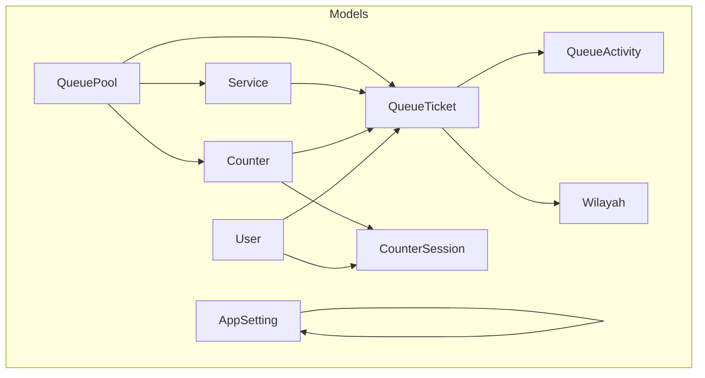
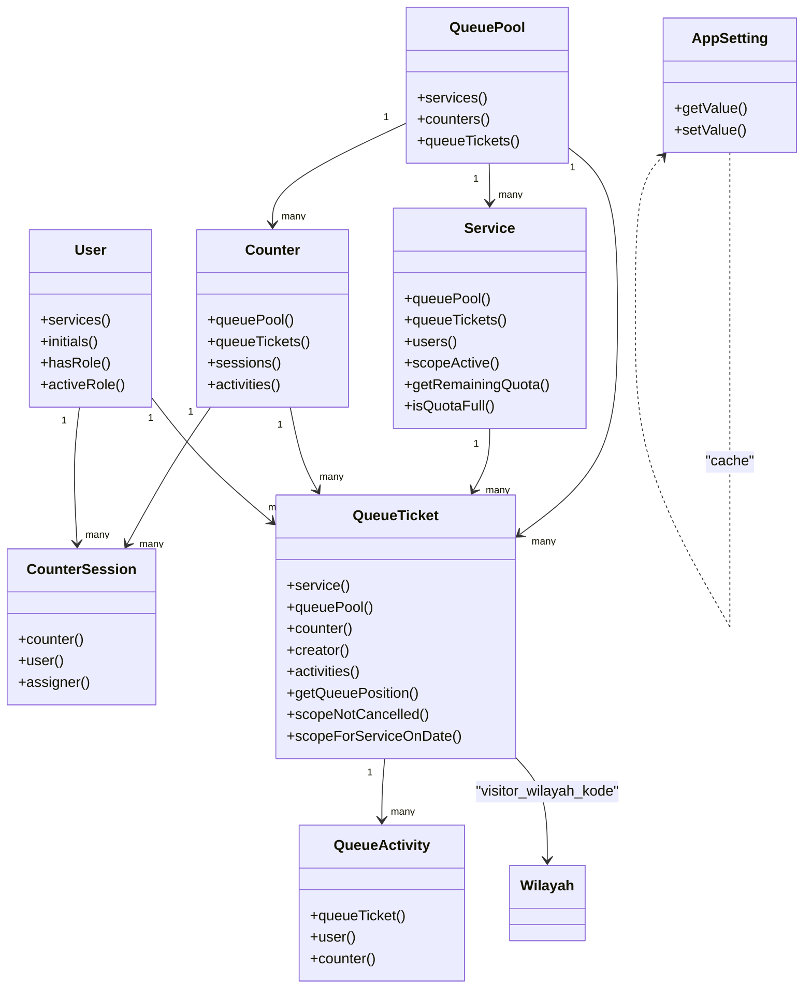
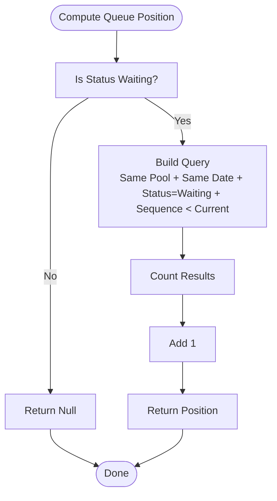
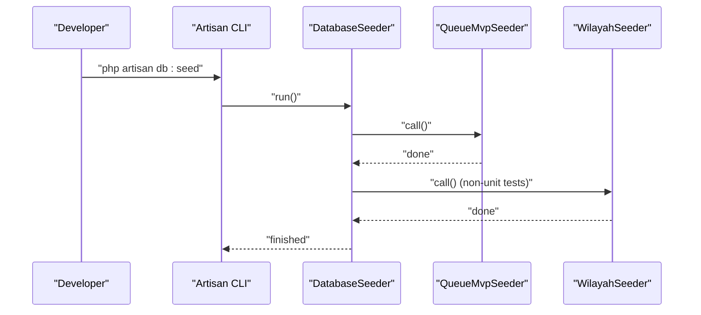
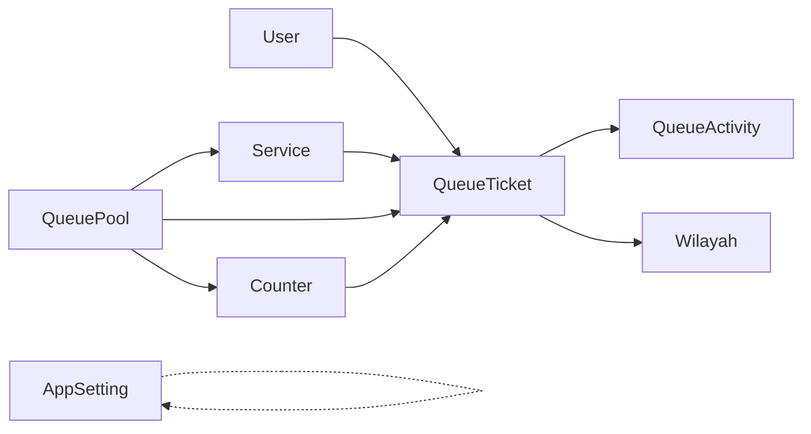

# Data Access Patterns and Query Optimization

<cite>
**Referenced Files in This Document**
- [QueueTicket.php](file://app/Models/QueueTicket.php)
- [Service.php](file://app/Models/Service.php)
- [Counter.php](file://app/Models/Counter.php)
- [CounterSession.php](file://app/Models/CounterSession.php)
- [QueuePool.php](file://app/Models/QueuePool.php)
- [QueueActivity.php](file://app/Models/QueueActivity.php)
- [User.php](file://app/Models/User.php)
- [Wilayah.php](file://app/Models/Wilayah.php)
- [AppSetting.php](file://app/Models/AppSetting.php)
- [QueueTicketFactory.php](file://database/factories/QueueTicketFactory.php)
- [2026_03_06_015238_create_queue_tickets_table.php](file://database/migrations/2026_03_06_015238_create_queue_tickets_table.php)
- [2026_03_06_015239_create_queue_activities_table.php](file://database/migrations/2026_03_06_015239_create_queue_activities_table.php)
- [DatabaseSeeder.php](file://database/seeders/DatabaseSeeder.php)
- [QueueMvpSeeder.php](file://database/seeders/QueueMvpSeeder.php)
- [WilayahSeeder.php](file://database/seeders/WilayahSeeder.php)
</cite>

## Table of Contents
1. [Introduction](#introduction)
2. [Project Structure](#project-structure)
3. [Core Components](#core-components)
4. [Architecture Overview](#architecture-overview)
5. [Detailed Component Analysis](#detailed-component-analysis)
6. [Dependency Analysis](#dependency-analysis)
7. [Performance Considerations](#performance-considerations)
8. [Troubleshooting Guide](#troubleshooting-guide)
9. [Conclusion](#conclusion)
10. [Appendices](#appendices)

## Introduction
This document explains the data access patterns and query optimization strategies used in the PTSP queue system. It covers Eloquent relationship definitions, eager loading strategies, query scopes, custom accessors/mutators, model events, complex queries, pagination, indexing, queue operations optimization, caching, and development environment setup via factories and seeders.

## Project Structure
The data layer centers around queue-related models and their relationships, with supporting models for users, counters, services, pools, activities, regions, and application settings. Migrations define the schema and indexes. Factories and seeders populate test and initial data.

**Diagram sources**
- [QueuePool.php:9-42](file://app/Models/QueuePool.php#L9-L42)
- [Service.php:12-100](file://app/Models/Service.php#L12-L100)
- [Counter.php:10-52](file://app/Models/Counter.php#L10-L52)
- [CounterSession.php:9-45](file://app/Models/CounterSession.php#L9-L45)
- [QueueTicket.php:12-120](file://app/Models/QueueTicket.php#L12-L120)
- [QueueActivity.php:9-43](file://app/Models/QueueActivity.php#L9-L43)
- [User.php:14-98](file://app/Models/User.php#L14-L98)
- [Wilayah.php:7-23](file://app/Models/Wilayah.php#L7-L23)
- [AppSetting.php:8-33](file://app/Models/AppSetting.php#L8-L33)

**Section sources**
- [QueuePool.php:9-42](file://app/Models/QueuePool.php#L9-L42)
- [Service.php:12-100](file://app/Models/Service.php#L12-L100)
- [Counter.php:10-52](file://app/Models/Counter.php#L10-L52)
- [CounterSession.php:9-45](file://app/Models/CounterSession.php#L9-L45)
- [QueueTicket.php:12-120](file://app/Models/QueueTicket.php#L12-L120)
- [QueueActivity.php:9-43](file://app/Models/QueueActivity.php#L9-L43)
- [User.php:14-98](file://app/Models/User.php#L14-L98)
- [Wilayah.php:7-23](file://app/Models/Wilayah.php#L7-L23)
- [AppSetting.php:8-33](file://app/Models/AppSetting.php#L8-L33)

## Core Components
- QueueTicket: central entity representing a visitor’s ticket; includes relationships to Service, QueuePool, Counter, Creator (User), and QueueActivity; defines scopes and position calculation.
- Service: belongs to QueuePool, connects to QueueTicket and User; exposes quota computation helpers and an active scope.
- Counter: belongs to QueuePool, connects to QueueTicket, CounterSession, and QueueActivity.
- CounterSession: links Counter and User with timestamps and status.
- QueuePool: aggregates Services, Counters, and QueueTickets.
- QueueActivity: records actions tied to a QueueTicket, User, and optional Counter.
- User: authentication model with roles and helper accessors.
- Wilayah: region table with string primary key and non-incrementing ID.
- AppSetting: key-value settings cached with cache invalidation on updates.

**Section sources**
- [QueueTicket.php:12-120](file://app/Models/QueueTicket.php#L12-L120)
- [Service.php:12-100](file://app/Models/Service.php#L12-L100)
- [Counter.php:10-52](file://app/Models/Counter.php#L10-L52)
- [CounterSession.php:9-45](file://app/Models/CounterSession.php#L9-L45)
- [QueuePool.php:9-42](file://app/Models/QueuePool.php#L9-L42)
- [QueueActivity.php:9-43](file://app/Models/QueueActivity.php#L9-L43)
- [User.php:14-98](file://app/Models/User.php#L14-L98)
- [Wilayah.php:7-23](file://app/Models/Wilayah.php#L7-L23)
- [AppSetting.php:8-33](file://app/Models/AppSetting.php#L8-L33)

## Architecture Overview
The system uses Eloquent ORM with carefully defined relationships and indexes to optimize queue operations. Scopes encapsulate common filters. Factories and seeders provide deterministic test data and initial environments.

**Diagram sources**
- [QueuePool.php:28-41](file://app/Models/QueuePool.php#L28-L41)
- [Service.php:43-57](file://app/Models/Service.php#L43-L57)
- [Counter.php:33-51](file://app/Models/Counter.php#L33-L51)
- [CounterSession.php:31-44](file://app/Models/CounterSession.php#L31-L44)
- [QueueTicket.php:54-77](file://app/Models/QueueTicket.php#L54-L77)
- [QueueActivity.php:29-42](file://app/Models/QueueActivity.php#L29-L42)
- [User.php:93-97](file://app/Models/User.php#L93-L97)
- [Wilayah.php:9-22](file://app/Models/Wilayah.php#L9-L22)
- [AppSetting.php:15-32](file://app/Models/AppSetting.php#L15-L32)

## Detailed Component Analysis

### Eloquent Relationships and Accessors/Mutators
- Relationships are defined using typed return annotations for clarity and IDE support.
- Accessors/mutators:
  - Service: computed helpers for remaining quota and quota-full checks.
  - User: initials(), role checks, and active role resolution.
  - AppSetting: cached getter/setter with cache invalidation.
- Enums and casting:
  - QueueTicket and Service use enum casting for status and booleans.
  - AppSetting stores values with cache-backed retrieval.

**Section sources**
- [Service.php:73-99](file://app/Models/Service.php#L73-L99)
- [User.php:60-91](file://app/Models/User.php#L60-L91)
- [AppSetting.php:15-32](file://app/Models/AppSetting.php#L15-L32)
- [QueueTicket.php:40-52](file://app/Models/QueueTicket.php#L40-L52)
- [Service.php:32-41](file://app/Models/Service.php#L32-L41)

### Query Scopes and Complex Queries
- QueueTicket scopes:
  - Not cancelled filter.
  - Service and date filter.
- Service scopes:
  - Active ordering by sort order and name.
- Position calculation:
  - Computes queue position among Waiting tickets for the same pool/date using count with where conditions.

**Diagram sources**
- [QueueTicket.php:82-94](file://app/Models/QueueTicket.php#L82-L94)

**Section sources**
- [QueueTicket.php:99-111](file://app/Models/QueueTicket.php#L99-L111)
- [Service.php:62-67](file://app/Models/Service.php#L62-L67)
- [QueueTicket.php:82-94](file://app/Models/QueueTicket.php#L82-L94)

### Eager Loading Strategies
- Use withRelationships when loading QueueTicket with related entities (service, queuePool, counter, creator, activities) to prevent N+1 queries.
- Prefer loading only required relations to minimize memory and SQL overhead.
- For reporting and dashboard views, batch-load counters/services with eager loads and apply scopes to reduce round trips.

[No sources needed since this section provides general guidance]

### Pagination Strategies
- Paginate QueueTicket collections filtered by scopes (e.g., not cancelled, by service and date).
- Combine with eager loading to avoid lazy-loading overhead during iteration.
- Use cursor-based pagination for large datasets when appropriate.

[No sources needed since this section provides general guidance]

### Indexing Strategies
- queue_tickets:
  - Unique composite indexes on (pool, date, sequence) and (pool, date, ticket_number).
  - Composite indexes on (service_date, status), (pool_id, service_date, status), and (service_id, service_date).
- queue_activities:
  - Composite indexes on (queue_ticket_id, created_at) and (action, created_at).

These indexes support frequent queries by date/status, pool filtering, and activity timeline retrieval.

**Section sources**
- [2026_03_06_015238_create_queue_tickets_table.php:36-41](file://database/migrations/2026_03_06_015238_create_queue_tickets_table.php#L36-L41)
- [2026_03_06_015239_create_queue_activities_table.php:23-24](file://database/migrations/2026_03_06_015239_create_queue_activities_table.php#L23-L24)

### Queue Operations Optimization
- Use scopes to encapsulate filters and keep queries DRY.
- For position calculation, leverage indexed fields and minimal selects.
- Batch operations for queue state transitions (check-in, call, start, complete) to reduce individual round trips.

[No sources needed since this section provides general guidance]

### Caching Strategies
- AppSetting uses a cache-backed getter with a namespaced key and cache invalidation on update.
- Consider caching frequently accessed configuration or derived metrics (e.g., daily quotas per service) with appropriate TTLs.

**Section sources**
- [AppSetting.php:15-32](file://app/Models/AppSetting.php#L15-L32)

### Test Data Generation and Seeding
- Factories:
  - QueueTicketFactory creates realistic tickets with foreign keys to Service, QueuePool, Counter, and User, and randomized identifiers and statuses.
- Seeders:
  - DatabaseSeeder orchestrates QueueMvpSeeder and WilayahSeeder, and ensures demo users are present outside unit tests.
  - QueueMvpSeeder initializes QueuePool, Service, and Counter entries for a minimal viable queue setup.
  - WilayahSeeder conditionally loads region data from an external SQL dump if not already present.

**Diagram sources**
- [DatabaseSeeder.php:15-44](file://database/seeders/DatabaseSeeder.php#L15-L44)
- [QueueMvpSeeder.php:15-128](file://database/seeders/QueueMvpSeeder.php#L15-L128)
- [WilayahSeeder.php:14-31](file://database/seeders/WilayahSeeder.php#L14-L31)

**Section sources**
- [QueueTicketFactory.php:22-44](file://database/factories/QueueTicketFactory.php#L22-L44)
- [DatabaseSeeder.php:15-44](file://database/seeders/DatabaseSeeder.php#L15-L44)
- [QueueMvpSeeder.php:15-128](file://database/seeders/QueueMvpSeeder.php#L15-L128)
- [WilayahSeeder.php:14-31](file://database/seeders/WilayahSeeder.php#L14-L31)

### Model Event Handling
- No explicit model observers or events are defined in the referenced models. If future enhancements require audit trails or notifications, attach model events (creating, updating, deleting) to dispatch jobs or log activities.

[No sources needed since this section provides general guidance]

## Dependency Analysis
The models form a cohesive graph centered on QueueTicket, with Service and Counter as primary anchors. AppSetting and Wilayah provide cross-cutting concerns.

**Diagram sources**
- [QueueTicket.php:54-77](file://app/Models/QueueTicket.php#L54-L77)
- [Service.php:43-51](file://app/Models/Service.php#L43-L51)
- [Counter.php:33-41](file://app/Models/Counter.php#L33-L41)
- [QueuePool.php:28-41](file://app/Models/QueuePool.php#L28-L41)
- [QueueActivity.php:29-32](file://app/Models/QueueActivity.php#L29-L32)
- [User.php:93-97](file://app/Models/User.php#L93-L97)
- [Wilayah.php:9-22](file://app/Models/Wilayah.php#L9-L22)
- [AppSetting.php:15-32](file://app/Models/AppSetting.php#L15-L32)

**Section sources**
- [QueueTicket.php:54-77](file://app/Models/QueueTicket.php#L54-L77)
- [Service.php:43-51](file://app/Models/Service.php#L43-L51)
- [Counter.php:33-41](file://app/Models/Counter.php#L33-L41)
- [QueuePool.php:28-41](file://app/Models/QueuePool.php#L28-L41)
- [QueueActivity.php:29-32](file://app/Models/QueueActivity.php#L29-L32)
- [User.php:93-97](file://app/Models/User.php#L93-L97)
- [Wilayah.php:9-22](file://app/Models/Wilayah.php#L9-L22)
- [AppSetting.php:15-32](file://app/Models/AppSetting.php#L15-L32)

## Performance Considerations
- Indexing:
  - Maintain existing indexes on queue_tickets and queue_activities to accelerate date/status filters and activity timelines.
- Query scopes:
  - Encapsulate filters to reuse optimized WHERE clauses and reduce duplication.
- Eager loading:
  - Load only necessary relations to avoid N+1 queries and excessive memory usage.
- Enum casting:
  - Keep status and boolean fields strongly typed to prevent implicit conversions and improve readability.
- Caching:
  - Cache infrequent reads (e.g., app settings) with cache invalidation on writes.
- Pagination:
  - Use cursor-based pagination for large datasets to reduce offset costs.
- Queue-specific:
  - For position calculations, ensure the underlying query leverages indexes on sequence_number and date fields.

[No sources needed since this section provides general guidance]

## Troubleshooting Guide
- Missing or incorrect indexes:
  - Symptoms: slow date/status queries, long-running activity timelines.
  - Action: verify migration indexes exist and rebuild if needed.
- N+1 queries:
  - Symptoms: exponential DB load when rendering lists.
  - Action: add eager loads for related models.
- Incorrect positions:
  - Symptoms: wrong queue order after check-ins.
  - Action: confirm position logic uses correct pool/date/status and sequence_number ordering.
- Cache stale settings:
  - Symptoms: old configuration values after updates.
  - Action: ensure cache invalidation runs after AppSetting updates.

**Section sources**
- [2026_03_06_015238_create_queue_tickets_table.php:36-41](file://database/migrations/2026_03_06_015238_create_queue_tickets_table.php#L36-L41)
- [2026_03_06_015239_create_queue_activities_table.php:23-24](file://database/migrations/2026_03_06_015239_create_queue_activities_table.php#L23-L24)
- [QueueTicket.php:82-94](file://app/Models/QueueTicket.php#L82-L94)
- [AppSetting.php:31-32](file://app/Models/AppSetting.php#L31-L32)

## Conclusion
The PTSP system employs clean Eloquent relationships, targeted indexes, and scoped queries to support efficient queue operations. Factories and seeders streamline development and testing. Adopting eager loading, pagination, and caching further improves performance. The documented patterns provide a strong foundation for scaling and maintaining the queue subsystem.

## Appendices
- Development environment setup:
  - Run database migrations and seeders to initialize queue pools, services, counters, and demo users.
  - Use factories to generate test tickets and related entities for feature tests.

**Section sources**
- [DatabaseSeeder.php:15-44](file://database/seeders/DatabaseSeeder.php#L15-L44)
- [QueueMvpSeeder.php:15-128](file://database/seeders/QueueMvpSeeder.php#L15-L128)
- [QueueTicketFactory.php:22-44](file://database/factories/QueueTicketFactory.php#L22-L44)