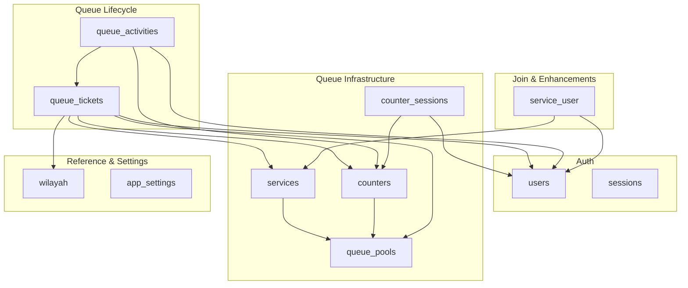
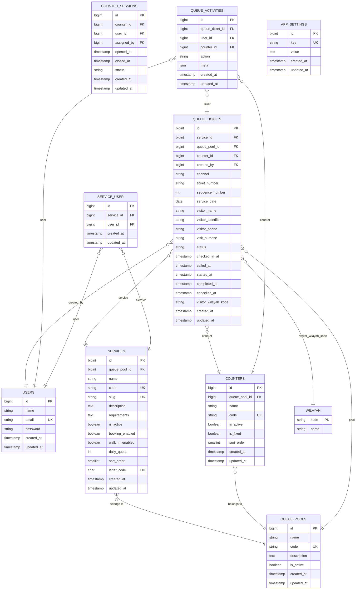
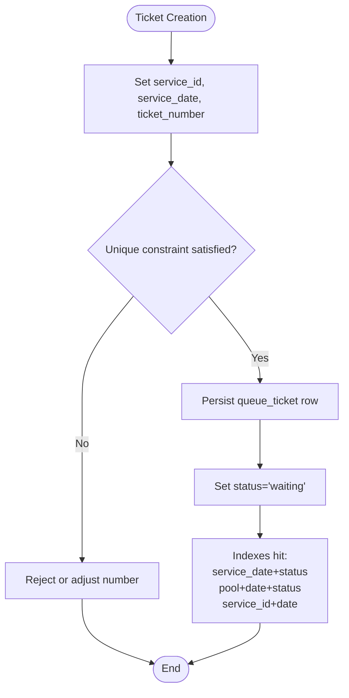
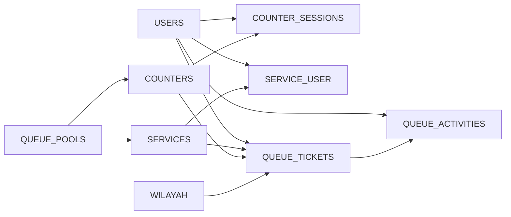

# Database Schema Overview

<cite>
**Referenced Files in This Document**
- [0001_01_01_000000_create_users_table.php](file://database/migrations/0001_01_01_000000_create_users_table.php)
- [2026_03_06_015234_create_queue_pools_table.php](file://database/migrations/2026_03_06_015234_create_queue_pools_table.php)
- [2026_03_06_015235_create_services_table.php](file://database/migrations/2026_03_06_015235_create_services_table.php)
- [2026_03_06_015236_create_counters_table.php](file://database/migrations/2026_03_06_015236_create_counters_table.php)
- [2026_03_06_015237_create_counter_sessions_table.php](file://database/migrations/2026_03_06_015237_create_counter_sessions_table.php)
- [2026_03_06_015238_create_queue_tickets_table.php](file://database/migrations/2026_03_06_015238_create_queue_tickets_table.php)
- [2026_03_06_015239_create_queue_activities_table.php](file://database/migrations/2026_03_06_015239_create_queue_activities_table.php)
- [2026_03_07_075319_add_letter_code_to_services_table.php](file://database/migrations/2026_03_07_075319_add_letter_code_to_services_table.php)
- [2026_03_07_075319_update_queue_tickets_unique_indexes.php](file://database/migrations/2026_03_07_075319_update_queue_tickets_unique_indexes.php)
- [2026_03_07_113021_create_service_user_table.php](file://database/migrations/2026_03_07_113021_create_service_user_table.php)
- [2026_03_11_072249_create_wilayah_table.php](file://database/migrations/2026_03_11_072249_create_wilayah_table.php)
- [2026_03_11_072249_add_visitor_address_and_wilayah_to_queue_tickets_table.php](file://database/migrations/2026_03_11_072249_add_visitor_address_and_wilayah_to_queue_tickets_table.php)
- [2026_03_11_074346_drop_visitor_address_from_queue_tickets_table.php](file://database/migrations/2026_03_11_074346_drop_visitor_address_from_queue_tickets_table.php)
- [2026_03_11_073137_create_app_settings_table.php](file://database/migrations/2026_03_11_073137_create_app_settings_table.php)
- [2026_03_13_143634_add_user_id_created_at_index_to_queue_activities_table.php](file://database/migrations/2026_03_13_143634_add_user_id_created_at_index_to_queue_activities_table.php)
- [2026_03_30_181555_add_visit_purpose_to_queue_tickets_and_is_fixed_to_counters_and_assigned_by_to_counter_sessions.php](file://database/migrations/2026_03_30_181555_add_visit_purpose_to_queue_tickets_and_is_fixed_to_counters_and_assigned_by_to_counter_sessions.php)
</cite>

## Table of Contents
1. [Introduction](#introduction)
2. [Project Structure](#project-structure)
3. [Core Components](#core-components)
4. [Architecture Overview](#architecture-overview)
5. [Detailed Component Analysis](#detailed-component-analysis)
6. [Dependency Analysis](#dependency-analysis)
7. [Performance Considerations](#performance-considerations)
8. [Troubleshooting Guide](#troubleshooting-guide)
9. [Conclusion](#conclusion)

## Introduction
This document provides a comprehensive database schema overview for the PTSP Queue Management System. It documents the complete structure of migration-defined tables, their relationships, primary and foreign keys, indexes, and constraints. It also traces the evolution of the schema from initial setup to the current state, explains design decisions (including normalization and indexing), and highlights key business concepts such as queue pools, service hierarchies, and geographic scoping via the Wilayah table. The goal is to enable both technical and non-technical stakeholders to understand how data is modeled and how queries are expected to perform.

## Project Structure
The database schema is defined through Laravel migrations under database/migrations. The migrations are grouped by logical domains:
- Authentication and sessions (users, sessions)
- Queue infrastructure (queue_pools, services, counters, counter_sessions)
- Queue lifecycle (queue_tickets, queue_activities)
- Reference data (wilayah, app_settings)
- Cross-cutting enhancements (service_user join table, visitor attributes, indexes)

**Diagram sources**
- [0001_01_01_000000_create_users_table.php:14-37](file://database/migrations/0001_01_01_000000_create_users_table.php#L14-L37)
- [2026_03_06_015234_create_queue_pools_table.php:14-21](file://database/migrations/2026_03_06_015234_create_queue_pools_table.php#L14-L21)
- [2026_03_06_015235_create_services_table.php:14-30](file://database/migrations/2026_03_06_015235_create_services_table.php#L14-L30)
- [2026_03_06_015236_create_counters_table.php:14-24](file://database/migrations/2026_03_06_015236_create_counters_table.php#L14-L24)
- [2026_03_06_015237_create_counter_sessions_table.php:21-32](file://database/migrations/2026_03_06_015237_create_counter_sessions_table.php#L21-L32)
- [2026_03_06_015238_create_queue_tickets_table.php:14-41](file://database/migrations/2026_03_06_015238_create_queue_tickets_table.php#L14-L41)
- [2026_03_06_015239_create_queue_activities_table.php:14-25](file://database/migrations/2026_03_06_015239_create_queue_activities_table.php#L14-L25)
- [2026_03_07_113021_create_service_user_table.php:14-21](file://database/migrations/2026_03_07_113021_create_service_user_table.php#L14-L21)
- [2026_03_11_072249_create_wilayah_table.php:14-19](file://database/migrations/2026_03_11_072249_create_wilayah_table.php#L14-L19)
- [2026_03_11_073137_create_app_settings_table.php:14-19](file://database/migrations/2026_03_11_073137_create_app_settings_table.php#L14-L19)

**Section sources**
- [0001_01_01_000000_create_users_table.php:1-50](file://database/migrations/0001_01_01_000000_create_users_table.php#L1-L50)
- [2026_03_06_015234_create_queue_pools_table.php:1-32](file://database/migrations/2026_03_06_015234_create_queue_pools_table.php#L1-L32)
- [2026_03_06_015235_create_services_table.php:1-41](file://database/migrations/2026_03_06_015235_create_services_table.php#L1-L41)
- [2026_03_06_015236_create_counters_table.php:1-35](file://database/migrations/2026_03_06_015236_create_counters_table.php#L1-L35)
- [2026_03_06_015237_create_counter_sessions_table.php:1-90](file://database/migrations/2026_03_06_015237_create_counter_sessions_table.php#L1-L90)
- [2026_03_06_015238_create_queue_tickets_table.php:1-52](file://database/migrations/2026_03_06_015238_create_queue_tickets_table.php#L1-L52)
- [2026_03_06_015239_create_queue_activities_table.php:1-36](file://database/migrations/2026_03_06_015239_create_queue_activities_table.php#L1-L36)
- [2026_03_11_072249_create_wilayah_table.php:1-30](file://database/migrations/2026_03_11_072249_create_wilayah_table.php#L1-L30)
- [2026_03_11_073137_create_app_settings_table.php:1-30](file://database/migrations/2026_03_11_073137_create_app_settings_table.php#L1-L30)

## Core Components
This section summarizes each table’s purpose, primary keys, and key constraints.

- users
  - Purpose: Authentication and profile storage for system users.
  - Primary key: id
  - Notable columns: name, email (unique), password, rememberToken, timestamps
  - Related tables: queue_activities.created_by, counter_sessions.user_id, service_user.user_id

- queue_pools
  - Purpose: Logical grouping of services and counters for queue segmentation.
  - Primary key: id
  - Unique: code
  - Columns: name, code, description, is_active, timestamps

- services
  - Purpose: Define queueable services with quotas and availability flags.
  - Primary key: id
  - Foreign key: queue_pool_id → queue_pools.id (cascadeOnUpdate)
  - Unique: code, slug
  - Optional: letter_code (char, unique)
  - Flags: is_active, booking_enabled, walk_in_enabled
  - Constraints: daily_quota unsigned integer
  - Index: (queue_pool_id, is_active)

- counters
  - Purpose: Physical or logical service counters.
  - Primary key: id
  - Foreign key: queue_pool_id → queue_pools.id (cascadeOnUpdate)
  - Unique: code
  - Flags: is_active, is_fixed, sort_order
  - Index: (queue_pool_id, is_active)

- counter_sessions
  - Purpose: Tracks who is currently serving at a counter and session lifecycle.
  - Primary key: id
  - Foreign keys: counter_id → counters.id, user_id → users.id, assigned_by → users.id (nullable)
  - Columns: opened_at, closed_at, status (default open), timestamps
  - Indexes: (counter_id, status), (user_id, status)

- queue_tickets
  - Purpose: Core queue record for each visitor/service interaction.
  - Primary key: id
  - Foreign keys:
    - service_id → services.id (cascadeOnUpdate)
    - queue_pool_id → queue_pools.id (cascadeOnUpdate)
    - counter_id → counters.id (nullOnDelete, cascadeOnUpdate)
    - created_by → users.id (nullOnDelete, cascadeOnUpdate)
  - Identifiers: channel, ticket_number, sequence_number, service_date
  - Visitor info: visitor_name, visitor_identifier, visitor_phone, visit_purpose
  - Status and timestamps: status, checked_in_at, called_at, started_at, completed_at, cancelled_at
  - Uniques:
    - (service_id, service_date, ticket_number) [updated migration]
    - (queue_pool_id, service_date, sequence_number)
  - Indexes:
    - (service_date, status)
    - (queue_pool_id, service_date, status)
    - (service_id, service_date)
    - visitor_wilayah_kode (added later)

- queue_activities
  - Purpose: Audit trail of queue actions performed by users.
  - Primary key: id
  - Foreign keys: queue_ticket_id → queue_tickets.id (cascadeOnDelete), user_id → users.id (nullOnDelete), counter_id → counters.id (nullOnDelete)
  - Columns: action (string), meta (JSON), timestamps
  - Indexes: (queue_ticket_id, created_at), (action, created_at), (user_id, created_at) [added later]

- wilayah
  - Purpose: Geographic administrative boundaries for visitor scoping.
  - Primary key: kode (string length 13)
  - Columns: nama (indexed)
  - Relationship: queue_tickets.visitor_wilayah_kode references wilayah.kode

- app_settings
  - Purpose: Global system configuration key-value store.
  - Primary key: id
  - Unique: key
  - Columns: key, value (text), timestamps

- service_user (join table)
  - Purpose: Associates users with services they can serve.
  - Primary key: id
  - Foreign keys: service_id → services.id (cascadeOnUpdate, cascadeOnDelete), user_id → users.id (cascadeOnUpdate, cascadeOnDelete)
  - Unique: (service_id, user_id)

**Section sources**
- [0001_01_01_000000_create_users_table.php:14-37](file://database/migrations/0001_01_01_000000_create_users_table.php#L14-L37)
- [2026_03_06_015234_create_queue_pools_table.php:14-21](file://database/migrations/2026_03_06_015234_create_queue_pools_table.php#L14-L21)
- [2026_03_06_015235_create_services_table.php:14-30](file://database/migrations/2026_03_06_015235_create_services_table.php#L14-L30)
- [2026_03_06_015236_create_counters_table.php:14-24](file://database/migrations/2026_03_06_015236_create_counters_table.php#L14-L24)
- [2026_03_06_015237_create_counter_sessions_table.php:21-32](file://database/migrations/2026_03_06_015237_create_counter_sessions_table.php#L21-L32)
- [2026_03_06_015238_create_queue_tickets_table.php:14-41](file://database/migrations/2026_03_06_015238_create_queue_tickets_table.php#L14-L41)
- [2026_03_06_015239_create_queue_activities_table.php:14-25](file://database/migrations/2026_03_06_015239_create_queue_activities_table.php#L14-L25)
- [2026_03_11_072249_create_wilayah_table.php:14-19](file://database/migrations/2026_03_11_072249_create_wilayah_table.php#L14-L19)
- [2026_03_11_073137_create_app_settings_table.php:14-19](file://database/migrations/2026_03_11_073137_create_app_settings_table.php#L14-L19)
- [2026_03_07_113021_create_service_user_table.php:14-21](file://database/migrations/2026_03_07_113021_create_service_user_table.php#L14-L21)

## Architecture Overview
The schema is designed around a queue-centric model with clear separation of concerns:
- Queue pools segment services and counters for different operational areas.
- Services define what can be queued, including quotas and availability.
- Counters represent service points; sessions tie users to counters during work periods.
- Tickets capture each visitor’s journey with status and timing.
- Activities track who did what and when.
- Wilayah scopes visitors geographically.
- App settings centralizes configuration.
- service_user enables role-based assignment of users to services.

**Diagram sources**
- [0001_01_01_000000_create_users_table.php:14-37](file://database/migrations/0001_01_01_000000_create_users_table.php#L14-L37)
- [2026_03_06_015234_create_queue_pools_table.php:14-21](file://database/migrations/2026_03_06_015234_create_queue_pools_table.php#L14-L21)
- [2026_03_06_015235_create_services_table.php:14-30](file://database/migrations/2026_03_06_015235_create_services_table.php#L14-L30)
- [2026_03_06_015236_create_counters_table.php:14-24](file://database/migrations/2026_03_06_015236_create_counters_table.php#L14-L24)
- [2026_03_06_015237_create_counter_sessions_table.php:21-32](file://database/migrations/2026_03_06_015237_create_counter_sessions_table.php#L21-L32)
- [2026_03_06_015238_create_queue_tickets_table.php:14-41](file://database/migrations/2026_03_06_015238_create_queue_tickets_table.php#L14-L41)
- [2026_03_06_015239_create_queue_activities_table.php:14-25](file://database/migrations/2026_03_06_015239_create_queue_activities_table.php#L14-L25)
- [2026_03_11_072249_create_wilayah_table.php:14-19](file://database/migrations/2026_03_11_072249_create_wilayah_table.php#L14-L19)
- [2026_03_07_113021_create_service_user_table.php:14-21](file://database/migrations/2026_03_07_113021_create_service_user_table.php#L14-L21)

## Detailed Component Analysis

### Queue Pool Concept
- Purpose: Segmentation of queues by operational area or branch.
- Design: Minimal schema with activation flag and ordering.
- Impact: All services and counters belong to a pool; tickets reference the pool for scoping.

**Section sources**
- [2026_03_06_015234_create_queue_pools_table.php:14-21](file://database/migrations/2026_03_06_015234_create_queue_pools_table.php#L14-L21)

### Service Hierarchies and Attributes
- Services are grouped by queue_pool_id and indexed by (queue_pool_id, is_active) for fast filtering.
- Unique identifiers: code, slug; optional letter_code for human-friendly prefixes.
- Availability flags: booking_enabled, walk_in_enabled; daily_quota enforces per-service capacity.
- Sort order supports presentation ordering.

**Section sources**
- [2026_03_06_015235_create_services_table.php:14-30](file://database/migrations/2026_03_06_015235_create_services_table.php#L14-L30)
- [2026_03_07_075319_add_letter_code_to_services_table.php:14-16](file://database/migrations/2026_03_07_075319_add_letter_code_to_services_table.php#L14-L16)

### Counter Management and Sessions
- Counters belong to a queue pool and can be fixed or flexible.
- counter_sessions tracks who is currently serving (user_id) and when (opened_at/closed_at), with status and optional assignment by another user.
- Indexes on (counter_id, status) and (user_id, status) optimize active session queries.

**Section sources**
- [2026_03_06_015236_create_counters_table.php:14-24](file://database/migrations/2026_03_06_015236_create_counters_table.php#L14-L24)
- [2026_03_06_015237_create_counter_sessions_table.php:21-32](file://database/migrations/2026_03_06_015237_create_counter_sessions_table.php#L21-L32)
- [2026_03_30_181555_add_visit_purpose_to_queue_tickets_and_is_fixed_to_counters_and_assigned_by_to_counter_sessions.php:18-24](file://database/migrations/2026_03_30_181555_add_visit_purpose_to_queue_tickets_and_is_fixed_to_counters_and_assigned_by_to_counter_sessions.php#L18-L24)

### Queue Ticket Lifecycle and Uniqueness
- Tickets are uniquely identified by (service_id, service_date, ticket_number) after a schema update.
- Alternative pool-scoped uniqueness uses (queue_pool_id, service_date, sequence_number) to maintain ordering per pool.
- Status and timestamps track check-in, call, start, completion, and cancellation.
- Indexes optimized for:
  - Status filtering by date
  - Pool+date+status aggregation
  - Service+date lookups

**Diagram sources**
- [2026_03_06_015238_create_queue_tickets_table.php:14-41](file://database/migrations/2026_03_06_015238_create_queue_tickets_table.php#L14-L41)
- [2026_03_07_075319_update_queue_tickets_unique_indexes.php:14-17](file://database/migrations/2026_03_07_075319_update_queue_tickets_unique_indexes.php#L14-L17)

**Section sources**
- [2026_03_06_015238_create_queue_tickets_table.php:14-41](file://database/migrations/2026_03_06_015238_create_queue_tickets_table.php#L14-L41)
- [2026_03_07_075319_update_queue_tickets_unique_indexes.php:14-17](file://database/migrations/2026_03_07_075319_update_queue_tickets_unique_indexes.php#L14-L17)

### Activity Tracking and Auditing
- queue_activities records actions against tickets with optional user and counter context.
- Indexes on (queue_ticket_id, created_at) and (action, created_at) support timeline queries.
- A specialized index on (user_id, created_at) was added to optimize user-specific activity reports.

**Section sources**
- [2026_03_06_015239_create_queue_activities_table.php:14-25](file://database/migrations/2026_03_06_015239_create_queue_activities_table.php#L14-L25)
- [2026_03_13_143634_add_user_id_created_at_index_to_queue_activities_table.php:14-16](file://database/migrations/2026_03_13_143634_add_user_id_created_at_index_to_queue_activities_table.php#L14-L16)

### Geographic Scope via Wilayah
- wilayah defines hierarchical administrative regions with kode (PK, length 13) and nama.
- queue_tickets includes visitor_wilayah_kode to associate visitors with regions.
- An index on visitor_wilayah_kode supports region-based reporting and filtering.

**Section sources**
- [2026_03_11_072249_create_wilayah_table.php:14-19](file://database/migrations/2026_03_11_072249_create_wilayah_table.php#L14-L19)
- [2026_03_11_072249_add_visitor_address_and_wilayah_to_queue_tickets_table.php:14-19](file://database/migrations/2026_03_11_072249_add_visitor_address_and_wilayah_to_queue_tickets_table.php#L14-L19)

### Role-Based Service Assignment
- service_user links users to services they can serve, enforcing role-based access to specific queues.
- Composite unique index ensures one user-service pairing.

**Section sources**
- [2026_03_07_113021_create_service_user_table.php:14-21](file://database/migrations/2026_03_07_113021_create_service_user_table.php#L14-L21)

### Application Settings
- app_settings stores global configuration keyed by unique key, enabling dynamic system behavior without code changes.

**Section sources**
- [2026_03_11_073137_create_app_settings_table.php:14-19](file://database/migrations/2026_03_11_073137_create_app_settings_table.php#L14-L19)

## Dependency Analysis
This section maps foreign key dependencies and highlights potential circularities (none present).

**Diagram sources**
- [0001_01_01_000000_create_users_table.php:14-37](file://database/migrations/0001_01_01_000000_create_users_table.php#L14-L37)
- [2026_03_06_015234_create_queue_pools_table.php:14-21](file://database/migrations/2026_03_06_015234_create_queue_pools_table.php#L14-L21)
- [2026_03_06_015235_create_services_table.php:14-30](file://database/migrations/2026_03_06_015235_create_services_table.php#L14-L30)
- [2026_03_06_015236_create_counters_table.php:14-24](file://database/migrations/2026_03_06_015236_create_counters_table.php#L14-L24)
- [2026_03_06_015237_create_counter_sessions_table.php:21-32](file://database/migrations/2026_03_06_015237_create_counter_sessions_table.php#L21-L32)
- [2026_03_06_015238_create_queue_tickets_table.php:14-41](file://database/migrations/2026_03_06_015238_create_queue_tickets_table.php#L14-L41)
- [2026_03_06_015239_create_queue_activities_table.php:14-25](file://database/migrations/2026_03_06_015239_create_queue_activities_table.php#L14-L25)
- [2026_03_11_072249_create_wilayah_table.php:14-19](file://database/migrations/2026_03_11_072249_create_wilayah_table.php#L14-L19)
- [2026_03_07_113021_create_service_user_table.php:14-21](file://database/migrations/2026_03_07_113021_create_service_user_table.php#L14-L21)

**Section sources**
- [2026_03_06_015238_create_queue_tickets_table.php:14-41](file://database/migrations/2026_03_06_015238_create_queue_tickets_table.php#L14-L41)
- [2026_03_06_015239_create_queue_activities_table.php:14-25](file://database/migrations/2026_03_06_015239_create_queue_activities_table.php#L14-L25)
- [2026_03_06_015237_create_counter_sessions_table.php:21-32](file://database/migrations/2026_03_06_015237_create_counter_sessions_table.php#L21-L32)
- [2026_03_07_113021_create_service_user_table.php:14-21](file://database/migrations/2026_03_07_113021_create_service_user_table.php#L14-L21)

## Performance Considerations
- Index coverage
  - queue_tickets: (service_date, status), (queue_pool_id, service_date, status), (service_id, service_date)
  - queue_activities: (queue_ticket_id, created_at), (action, created_at), (user_id, created_at)
  - counters/services: (queue_pool_id, is_active)
  - counter_sessions: (counter_id, status), (user_id, status)
  - wilayah: (nama)
- Unique constraints
  - Prevent duplicates and enforce business rules at the database level.
- Partitioning and range scans
  - service_date and created_at are frequently used for range queries; consider date-partitioning strategies if volumes grow large.
- Denormalized scoping
  - queue_tickets holds queue_pool_id alongside service_id to simplify pool-level analytics and reduce joins.
- Query patterns
  - Today’s queue lists by status and date
  - User activity timelines
  - Service quota enforcement via daily_quota and unique ticket_number per service_date

[No sources needed since this section provides general guidance]

## Troubleshooting Guide
- Duplicate ticket_number errors
  - Cause: Unique constraint on (service_id, service_date, ticket_number).
  - Resolution: Adjust generation logic or increment sequence_number.
  - Evidence: [2026_03_07_075319_update_queue_tickets_unique_indexes.php:14-17](file://database/migrations/2026_03_07_075319_update_queue_tickets_unique_indexes.php#L14-L17)
- Missing foreign keys in counter_sessions
  - Cause: Legacy schema or migration run order.
  - Resolution: Rerun migration; it includes a sync routine to add missing FKs and indexes.
  - Evidence: [2026_03_06_015237_create_counter_sessions_table.php:35-80](file://database/migrations/2026_03_06_015237_create_counter_sessions_table.php#L35-L80)
- Region lookup failures
  - Cause: visitor_wilayah_kode mismatch with wilayah.kode.
  - Resolution: Ensure kode matches wilayah.kode and index is present.
  - Evidence: [2026_03_11_072249_add_visitor_address_and_wilayah_to_queue_tickets_table.php:14-19](file://database/migrations/2026_03_11_072249_add_visitor_address_and_wilayah_to_queue_tickets_table.php#L14-L19)
- User-service assignment issues
  - Cause: Missing service_user row or duplicate pairing.
  - Resolution: Verify unique (service_id, user_id) and proper FKs.
  - Evidence: [2026_03_07_113021_create_service_user_table.php:14-21](file://database/migrations/2026_03_07_113021_create_service_user_table.php#L14-L21)

**Section sources**
- [2026_03_07_075319_update_queue_tickets_unique_indexes.php:14-17](file://database/migrations/2026_03_07_075319_update_queue_tickets_unique_indexes.php#L14-L17)
- [2026_03_06_015237_create_counter_sessions_table.php:35-80](file://database/migrations/2026_03_06_015237_create_counter_sessions_table.php#L35-L80)
- [2026_03_11_072249_add_visitor_address_and_wilayah_to_queue_tickets_table.php:14-19](file://database/migrations/2026_03_11_072249_add_visitor_address_and_wilayah_to_queue_tickets_table.php#L14-L19)
- [2026_03_07_113021_create_service_user_table.php:14-21](file://database/migrations/2026_03_07_113021_create_service_user_table.php#L14-L21)

## Conclusion
The PTSP Queue Management System employs a normalized, queue-first schema with deliberate indexing and unique constraints to enforce business rules and support high-performance queries. The design cleanly separates pools, services, counters, and tickets while enabling auditability via queue_activities. Geographic scoping through wilayah and role-based assignments via service_user further tailor the system to institutional needs. The documented evolution shows incremental improvements to uniqueness, indexing, and referential integrity, aligning with operational requirements.