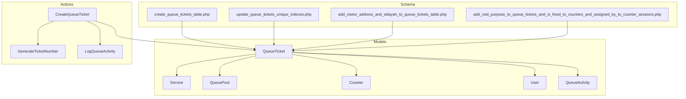
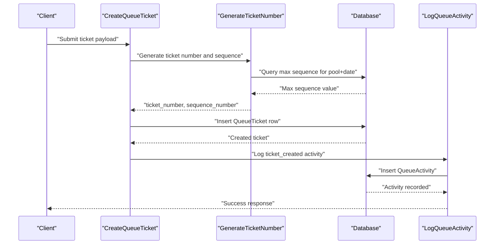
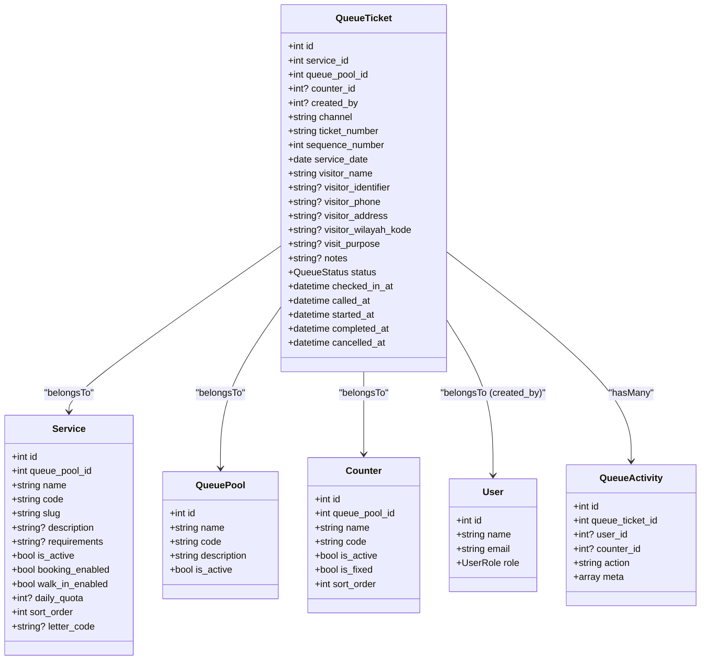
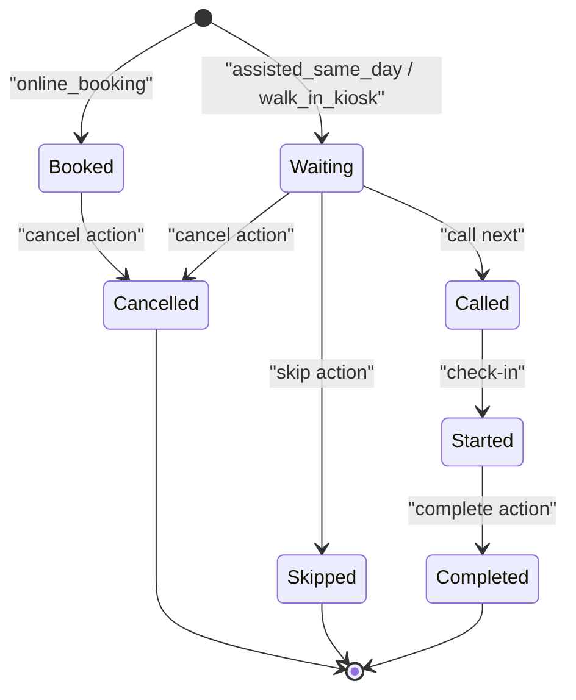
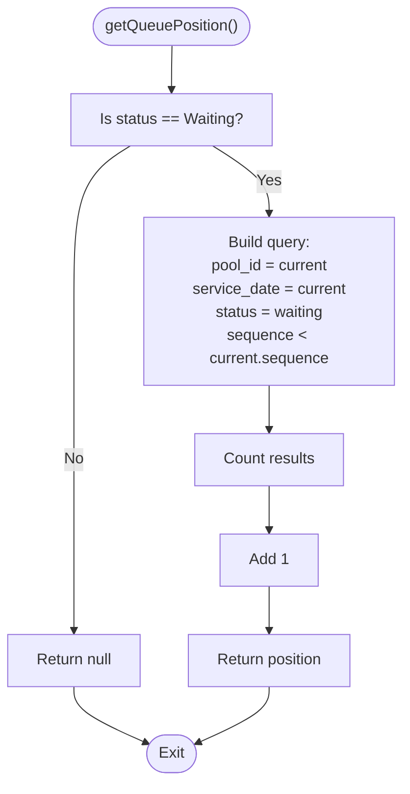
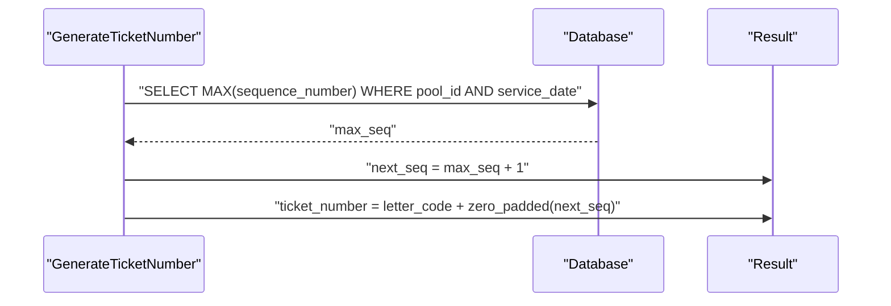
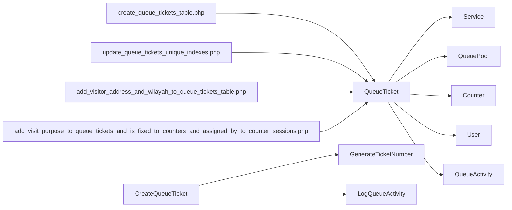

# QueueTicket Model

<cite>
**Referenced Files in This Document**
- [QueueTicket.php](file://app/Models/QueueTicket.php)
- [QueueStatus.php](file://app/Enums/QueueStatus.php)
- [Service.php](file://app/Models/Service.php)
- [QueuePool.php](file://app/Models/QueuePool.php)
- [Counter.php](file://app/Models/Counter.php)
- [User.php](file://app/Models/User.php)
- [QueueActivity.php](file://app/Models/QueueActivity.php)
- [CreateQueueTicket.php](file://app/Actions/Queue/CreateQueueTicket.php)
- [GenerateTicketNumber.php](file://app/Actions/Queue/GenerateTicketNumber.php)
- [LogQueueActivity.php](file://app/Actions/Queue/LogQueueActivity.php)
- [create_queue_tickets_table.php](file://database/migrations/2026_03_06_015238_create_queue_tickets_table.php)
- [update_queue_tickets_unique_indexes.php](file://database/migrations/2026_03_07_075319_update_queue_tickets_unique_indexes.php)
- [add_visitor_address_and_wilayah_to_queue_tickets_table.php](file://database/migrations/2026_03_11_072249_add_visitor_address_and_wilayah_to_queue_tickets_table.php)
- [add_visit_purpose_to_queue_tickets_and_is_fixed_to_counters_and_assigned_by_to_counter_sessions.php](file://database/migrations/2026_03_30_181555_add_visit_purpose_to_queue_tickets_and_is_fixed_to_counters_and_assigned_by_to_counter_sessions.php)
- [QueueTicketFactory.php](file://database/factories/QueueTicketFactory.php)
</cite>

## Table of Contents
1. [Introduction](#introduction)
2. [Project Structure](#project-structure)
3. [Core Components](#core-components)
4. [Architecture Overview](#architecture-overview)
5. [Detailed Component Analysis](#detailed-component-analysis)
6. [Dependency Analysis](#dependency-analysis)
7. [Performance Considerations](#performance-considerations)
8. [Troubleshooting Guide](#troubleshooting-guide)
9. [Conclusion](#conclusion)

## Introduction
This document provides comprehensive documentation for the QueueTicket model, focusing on lifecycle management, status transitions, queue position calculation, numbering and sequence management, unique constraints, and integration with queue activities and audit trails. It also covers Eloquent relationships, query scopes, and practical examples for creating tickets, updating statuses, and querying positions.

## Project Structure
The QueueTicket model is part of the queue management subsystem and integrates with related models and actions:
- Core model: QueueTicket
- Related models: Service, QueuePool, Counter, User, QueueActivity
- Supporting actions: CreateQueueTicket, GenerateTicketNumber, LogQueueActivity
- Enumerations: QueueStatus
- Database schema: Migrations define table structure, indexes, and unique constraints
- Factories: QueueTicketFactory for seeding and testing

**Diagram sources**
- [QueueTicket.php:12-121](file://app/Models/QueueTicket.php#L12-L121)
- [Service.php:12-101](file://app/Models/Service.php#L12-L101)
- [QueuePool.php:9-43](file://app/Models/QueuePool.php#L9-L43)
- [Counter.php:10-53](file://app/Models/Counter.php#L10-L53)
- [User.php:14-99](file://app/Models/User.php#L14-L99)
- [QueueActivity.php:9-44](file://app/Models/QueueActivity.php#L9-L44)
- [CreateQueueTicket.php:13-91](file://app/Actions/Queue/CreateQueueTicket.php#L13-L91)
- [GenerateTicketNumber.php:10-31](file://app/Actions/Queue/GenerateTicketNumber.php#L10-L31)
- [LogQueueActivity.php:8-29](file://app/Actions/Queue/LogQueueActivity.php#L8-L29)
- [create_queue_tickets_table.php:14-41](file://database/migrations/2026_03_06_015238_create_queue_tickets_table.php#L14-L41)
- [update_queue_tickets_unique_indexes.php:14-17](file://database/migrations/2026_03_07_075319_update_queue_tickets_unique_indexes.php#L14-L17)
- [add_visitor_address_and_wilayah_to_queue_tickets_table.php:14-19](file://database/migrations/2026_03_11_072249_add_visitor_address_and_wilayah_to_queue_tickets_table.php#L14-L19)
- [add_visit_purpose_to_queue_tickets_and_is_fixed_to_counters_and_assigned_by_to_counter_sessions.php:14-16](file://database/migrations/2026_03_30_181555_add_visit_purpose_to_queue_tickets_and_is_fixed_to_counters_and_assigned_by_to_counter_sessions.php#L14-L16)

**Section sources**
- [QueueTicket.php:12-121](file://app/Models/QueueTicket.php#L12-L121)
- [create_queue_tickets_table.php:14-41](file://database/migrations/2026_03_06_015238_create_queue_tickets_table.php#L14-L41)

## Core Components
- QueueTicket model encapsulates ticket data, lifecycle timestamps, visitor information, and status tracking.
- Eloquent relationships connect QueueTicket to Service, QueuePool, Counter, User (creator), and QueueActivity.
- Query scopes provide filtering for non-cancelled tickets and service/date combinations.
- Position calculation determines queue order among waiting tickets for the same pool and date.
- Numbering and sequence generation produce unique ticket numbers per service and date.

**Section sources**
- [QueueTicket.php:17-52](file://app/Models/QueueTicket.php#L17-L52)
- [QueueTicket.php:54-77](file://app/Models/QueueTicket.php#L54-L77)
- [QueueTicket.php:99-111](file://app/Models/QueueTicket.php#L99-L111)
- [QueueTicket.php:82-94](file://app/Models/QueueTicket.php#L82-L94)
- [GenerateTicketNumber.php:15-29](file://app/Actions/Queue/GenerateTicketNumber.php#L15-L29)

## Architecture Overview
The QueueTicket model participates in a transactional creation flow that generates a ticket number, persists the ticket, and logs an activity record. Status transitions are managed via actions and enums, while position calculation relies on database queries optimized by strategic indexes.

**Diagram sources**
- [CreateQueueTicket.php:34-89](file://app/Actions/Queue/CreateQueueTicket.php#L34-L89)
- [GenerateTicketNumber.php:15-29](file://app/Actions/Queue/GenerateTicketNumber.php#L15-L29)
- [LogQueueActivity.php:13-27](file://app/Actions/Queue/LogQueueActivity.php#L13-L27)

## Detailed Component Analysis

### Model Attributes and Casting
- Fillable attributes include identifiers (service_id, queue_pool_id, counter_id, created_by), channel, ticket_number, sequence_number, service_date, visitor information, visit purpose, notes, status, and lifecycle timestamps.
- Casts ensure typed handling for integers, dates, datetimes, and enum status.
- Additional visitor-related fields were introduced via migrations: address, wilayah code, and visit purpose.

**Section sources**
- [QueueTicket.php:17-52](file://app/Models/QueueTicket.php#L17-L52)
- [add_visitor_address_and_wilayah_to_queue_tickets_table.php:14-19](file://database/migrations/2026_03_11_072249_add_visitor_address_and_wilayah_to_queue_tickets_table.php#L14-L19)
- [add_visit_purpose_to_queue_tickets_and_is_fixed_to_counters_and_assigned_by_to_counter_sessions.php:14-16](file://database/migrations/2026_03_30_181555_add_visit_purpose_to_queue_tickets_and_is_fixed_to_counters_and_assigned_by_to_counter_sessions.php#L14-L16)

### Eloquent Relationships
- belongsTo Service: Links ticket to a service for quota and reporting.
- belongsTo QueuePool: Groups tickets by pool for numbering and position calculation.
- belongsTo Counter: Optional assignment to a counter during service.
- belongsTo User (creator): Tracks who created the ticket.
- hasMany QueueActivity: Records all lifecycle events and actions.

**Diagram sources**
- [QueueTicket.php:54-77](file://app/Models/QueueTicket.php#L54-L77)
- [Service.php:48-51](file://app/Models/Service.php#L48-L51)
- [QueuePool.php:38-41](file://app/Models/QueuePool.php#L38-L41)
- [Counter.php:38-41](file://app/Models/Counter.php#L38-L41)
- [User.php:93-97](file://app/Models/User.php#L93-L97)
- [QueueActivity.php:29-32](file://app/Models/QueueActivity.php#L29-L32)

**Section sources**
- [QueueTicket.php:54-77](file://app/Models/QueueTicket.php#L54-L77)
- [Service.php:48-51](file://app/Models/Service.php#L48-L51)
- [QueuePool.php:38-41](file://app/Models/QueuePool.php#L38-L41)
- [Counter.php:38-41](file://app/Models/Counter.php#L38-L41)
- [User.php:93-97](file://app/Models/User.php#L93-L97)
- [QueueActivity.php:29-32](file://app/Models/QueueActivity.php#L29-L32)

### Ticket Lifecycle Management and Status Transitions
- Status values are defined by QueueStatus enum: booked, waiting, called, completed, cancelled, skipped.
- Creation logic sets initial status based on channel: online_booking becomes booked; assisted_same_day and walk_in_kiosk become waiting.
- Position calculation is only meaningful for waiting tickets and counts preceding tickets with lower sequence numbers.

**Diagram sources**
- [CreateQueueTicket.php:42-46](file://app/Actions/Queue/CreateQueueTicket.php#L42-L46)
- [QueueStatus.php:5-37](file://app/Enums/QueueStatus.php#L5-L37)
- [QueueTicket.php:82-94](file://app/Models/QueueTicket.php#L82-L94)

**Section sources**
- [CreateQueueTicket.php:42-46](file://app/Actions/Queue/CreateQueueTicket.php#L42-L46)
- [QueueStatus.php:5-37](file://app/Enums/QueueStatus.php#L5-L37)

### Queue Position Calculation Algorithm
- The position is computed only for tickets with status waiting.
- It counts all waiting tickets in the same queue_pool_id and service_date with a smaller sequence_number and adds one.
- This algorithm assumes sequence_number is unique per pool and date and monotonically increasing.

**Diagram sources**
- [QueueTicket.php:82-94](file://app/Models/QueueTicket.php#L82-L94)

**Section sources**
- [QueueTicket.php:82-94](file://app/Models/QueueTicket.php#L82-L94)

### Ticket Numbering System and Sequence Management
- Sequence number is generated by querying the maximum existing sequence for the same pool and service date, then incrementing by one.
- Ticket number is composed from the service's letter_code concatenated with the zero-padded sequence number.
- Unique constraints ensure uniqueness across pool/date/sequence and pool/date/ticket_number (later updated to service/date/ticket_number).

**Diagram sources**
- [GenerateTicketNumber.php:17-23](file://app/Actions/Queue/GenerateTicketNumber.php#L17-L23)
- [create_queue_tickets_table.php:36-37](file://database/migrations/2026_03_06_015238_create_queue_tickets_table.php#L36-L37)
- [update_queue_tickets_unique_indexes.php:15-16](file://database/migrations/2026_03_07_075319_update_queue_tickets_unique_indexes.php#L15-L16)

**Section sources**
- [GenerateTicketNumber.php:15-29](file://app/Actions/Queue/GenerateTicketNumber.php#L15-L29)
- [create_queue_tickets_table.php:36-37](file://database/migrations/2026_03_06_015238_create_queue_tickets_table.php#L36-L37)
- [update_queue_tickets_unique_indexes.php:15-16](file://database/migrations/2026_03_07_075319_update_queue_tickets_unique_indexes.php#L15-L16)

### Query Scopes
- notCancelled: Filters out tickets with status Cancelled.
- forServiceOnDate: Filters tickets by service_id and date equality on service_date.

**Section sources**
- [QueueTicket.php:99-111](file://app/Models/QueueTicket.php#L99-L111)

### Integration with Queue Activities and Audit Trails
- Creation action logs a ticket_created activity with metadata including channel, service_id, queue_pool_id, and status.
- QueueActivity records user_id, counter_id, action, and optional meta for auditability.

**Section sources**
- [CreateQueueTicket.php:74-85](file://app/Actions/Queue/CreateQueueTicket.php#L74-L85)
- [LogQueueActivity.php:13-27](file://app/Actions/Queue/LogQueueActivity.php#L13-L27)
- [QueueActivity.php:29-32](file://app/Models/QueueActivity.php#L29-L32)

### Practical Examples

#### Creating a Ticket
- Payload includes service_id, channel, service_date, visitor details, optional identifiers, purpose, notes, and created_by.
- Channel determines initial status; online_booking sets booked; assisted/walk-in sets waiting.
- Transaction ensures atomicity of creation and activity logging.

References:
- [CreateQueueTicket.php:34-89](file://app/Actions/Queue/CreateQueueTicket.php#L34-L89)
- [GenerateTicketNumber.php:15-29](file://app/Actions/Queue/GenerateTicketNumber.php#L15-L29)
- [LogQueueActivity.php:13-27](file://app/Actions/Queue/LogQueueActivity.php#L13-L27)

#### Updating Status and Position Queries
- Use notCancelled scope to exclude cancelled tickets when reporting.
- Use forServiceOnDate to filter by service and date.
- Call getQueuePosition on a waiting ticket to compute its position.

References:
- [QueueTicket.php:99-111](file://app/Models/QueueTicket.php#L99-L111)
- [QueueTicket.php:82-94](file://app/Models/QueueTicket.php#L82-L94)

#### Visitor Information Fields
- Visitor fields include name, identifier, phone, address, wilayah code, and visit purpose.
- Index on visitor_wilayah_kode supports efficient filtering by region.

References:
- [QueueTicket.php:26-30](file://app/Models/QueueTicket.php#L26-L30)
- [add_visitor_address_and_wilayah_to_queue_tickets_table.php:14-19](file://database/migrations/2026_03_11_072249_add_visitor_address_and_wilayah_to_queue_tickets_table.php#L14-L19)
- [add_visit_purpose_to_queue_tickets_and_is_fixed_to_counters_and_assigned_by_to_counter_sessions.php:14-16](file://database/migrations/2026_03_30_181555_add_visit_purpose_to_queue_tickets_and_is_fixed_to_counters_and_assigned_by_to_counter_sessions.php#L14-L16)

## Dependency Analysis
QueueTicket depends on Service, QueuePool, Counter, User, and QueueActivity. Its creation and numbering rely on actions and migrations. Indexes and unique constraints ensure data integrity and query performance.

**Diagram sources**
- [QueueTicket.php:54-77](file://app/Models/QueueTicket.php#L54-L77)
- [CreateQueueTicket.php:15-18](file://app/Actions/Queue/CreateQueueTicket.php#L15-L18)
- [GenerateTicketNumber.php:15-29](file://app/Actions/Queue/GenerateTicketNumber.php#L15-L29)
- [LogQueueActivity.php:13-27](file://app/Actions/Queue/LogQueueActivity.php#L13-L27)
- [create_queue_tickets_table.php:36-41](file://database/migrations/2026_03_06_015238_create_queue_tickets_table.php#L36-L41)
- [update_queue_tickets_unique_indexes.php:15-17](file://database/migrations/2026_03_07_075319_update_queue_tickets_unique_indexes.php#L15-L17)
- [add_visitor_address_and_wilayah_to_queue_tickets_table.php:14-19](file://database/migrations/2026_03_11_072249_add_visitor_address_and_wilayah_to_queue_tickets_table.php#L14-L19)
- [add_visit_purpose_to_queue_tickets_and_is_fixed_to_counters_and_assigned_by_to_counter_sessions.php:14-16](file://database/migrations/2026_03_30_181555_add_visit_purpose_to_queue_tickets_and_is_fixed_to_counters_and_assigned_by_to_counter_sessions.php#L14-L16)

**Section sources**
- [QueueTicket.php:54-77](file://app/Models/QueueTicket.php#L54-L77)
- [create_queue_tickets_table.php:36-41](file://database/migrations/2026_03_06_015238_create_queue_tickets_table.php#L36-L41)

## Performance Considerations
- Indexes on service_date and status, queue_pool_id and service_date with status, and service_id with service_date optimize filtering and counting operations.
- Unique constraints on pool/date/sequence and service/date/ticket_number prevent duplicates and support fast lookups.
- Position calculation performs a count with indexed filters; ensure indexes remain aligned with usage patterns.

Recommendations:
- Monitor slow query logs for position calculations and quota checks.
- Consider partitioning or materialized aggregates if queues grow very large.
- Keep indexes updated after bulk operations.

**Section sources**
- [create_queue_tickets_table.php:38-40](file://database/migrations/2026_03_06_015238_create_queue_tickets_table.php#L38-L40)
- [update_queue_tickets_unique_indexes.php:15-16](file://database/migrations/2026_03_07_075319_update_queue_tickets_unique_indexes.php#L15-L16)

## Troubleshooting Guide
Common issues and resolutions:
- Position returns null: Occurs when ticket status is not waiting; verify status transitions.
- Duplicate ticket_number or sequence errors: Ensure unique constraints are intact and numbering logic runs within transactions.
- Incorrect position: Verify sequence_number increments correctly and no gaps exist; check indexes for performance.
- Activity not logged: Confirm LogQueueActivity is invoked after ticket creation.

**Section sources**
- [QueueTicket.php:84-86](file://app/Models/QueueTicket.php#L84-L86)
- [create_queue_tickets_table.php:36-37](file://database/migrations/2026_03_06_015238_create_queue_tickets_table.php#L36-L37)
- [CreateQueueTicket.php:74-85](file://app/Actions/Queue/CreateQueueTicket.php#L74-L85)

## Conclusion
The QueueTicket model provides a robust foundation for queue management with clear lifecycle states, efficient position calculation, and strong data integrity through indexes and unique constraints. Its relationships and actions integrate seamlessly with services, pools, counters, users, and activity logging, enabling comprehensive auditability and scalable performance.