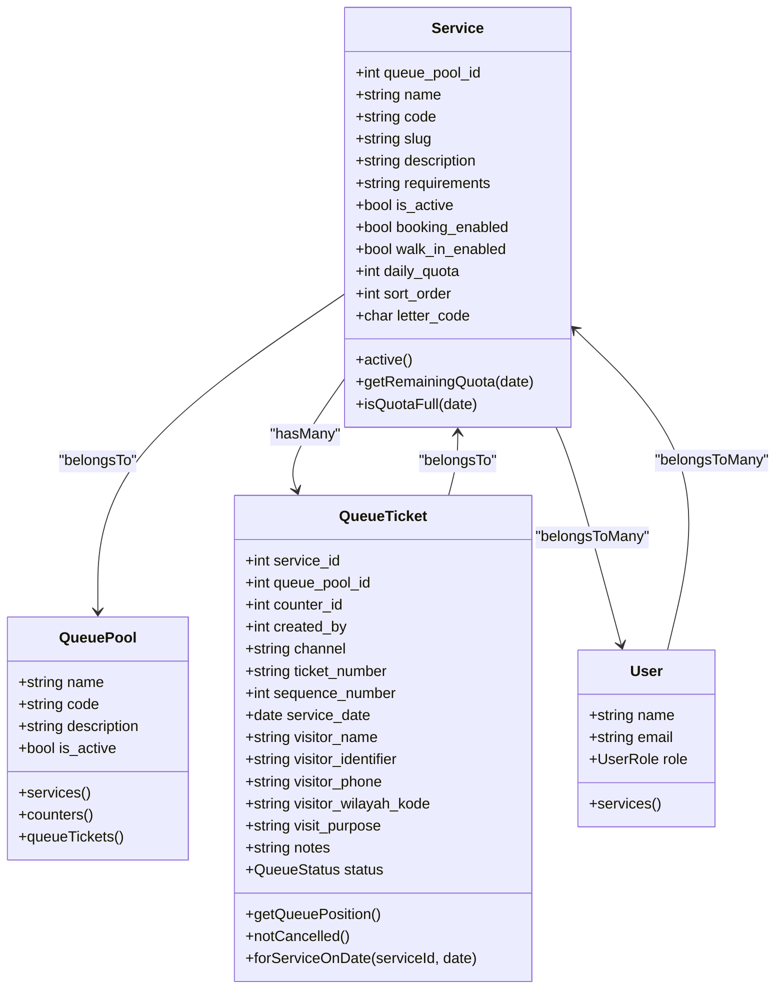
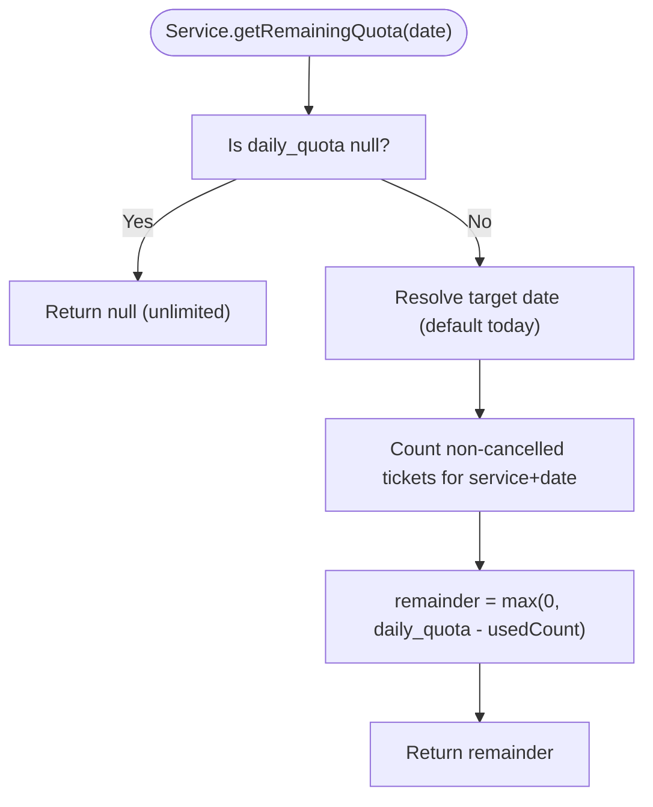
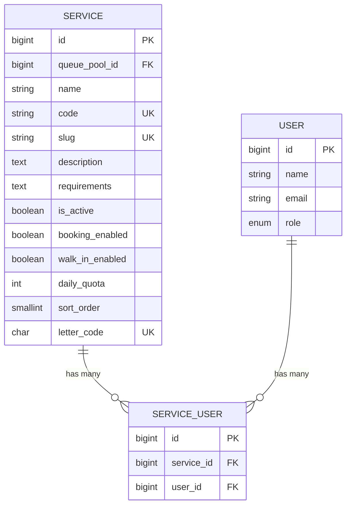
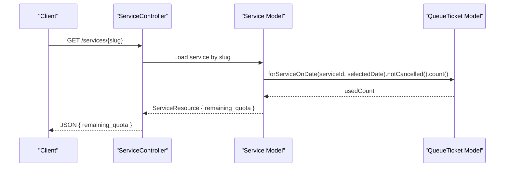
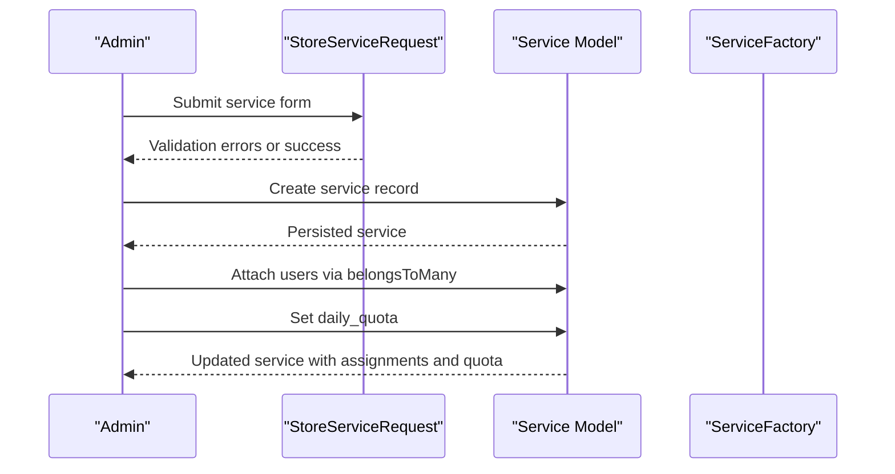
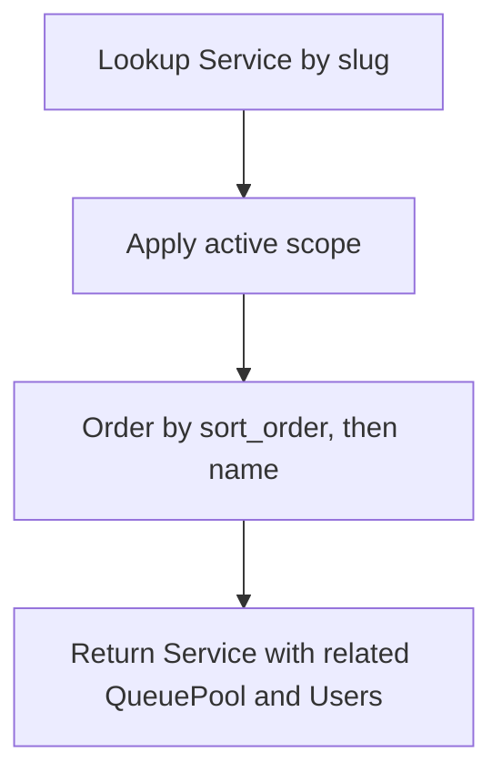
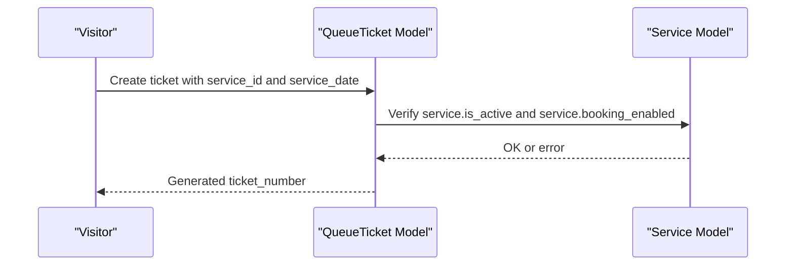
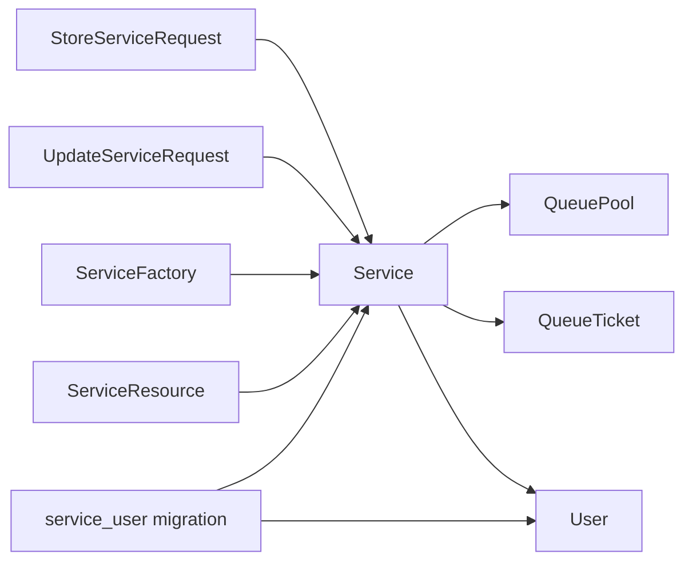

# Service Model

<cite>
**Referenced Files in This Document**
- [Service.php](file://app/Models/Service.php)
- [User.php](file://app/Models/User.php)
- [QueueTicket.php](file://app/Models/QueueTicket.php)
- [QueuePool.php](file://app/Models/QueuePool.php)
- [ServiceFactory.php](file://database/factories/ServiceFactory.php)
- [StoreServiceRequest.php](file://app/Http/Requests/StoreServiceRequest.php)
- [UpdateServiceRequest.php](file://app/Http/Requests/UpdateServiceRequest.php)
- [ServiceResource.php](file://app/Http/Resources/ServiceResource.php)
- [create_services_table.php](file://database/migrations/2026_03_06_015235_create_services_table.php)
- [add_letter_code_to_services_table.php](file://database/migrations/2026_03_07_075319_add_letter_code_to_services_table.php)
- [create_service_user_table.php](file://database/migrations/2026_03_07_113021_create_service_user_table.php)
- [PRODUCT_SPECIFICATION.md](file://docs/PRODUCT_SPECIFICATION.md)
</cite>

## Table of Contents
1. [Introduction](#introduction)
2. [Project Structure](#project-structure)
3. [Core Components](#core-components)
4. [Architecture Overview](#architecture-overview)
5. [Detailed Component Analysis](#detailed-component-analysis)
6. [Dependency Analysis](#dependency-analysis)
7. [Performance Considerations](#performance-considerations)
8. [Troubleshooting Guide](#troubleshooting-guide)
9. [Conclusion](#conclusion)

## Introduction
This document provides comprehensive documentation for the Service model, focusing on service catalog management and hierarchical service structures within the queue management system. It covers service definition fields (including letter codes), operational parameters, many-to-many relationships with users for service officer assignments, service quotas and daily capacity limits, geographic considerations, service lookup mechanisms, availability checking, and integration with queue ticket generation and service-specific configurations.

## Project Structure
The Service model is part of the core domain models alongside QueuePool, QueueTicket, and User. It integrates with validation requests, factory seeding, resource transformation, and pivot table management for service-user assignments.

```mermaid
graph TB
ServiceModel["Service Model<br/>app/Models/Service.php"]
QueuePoolModel["QueuePool Model<br/>app/Models/QueuePool.php"]
UserModel["User Model<br/>app/Models/User.php"]
QueueTicketModel["QueueTicket Model<br/>app/Models/QueueTicket.php"]
ServiceFactory["Service Factory<br/>database/factories/ServiceFactory.php"]
StoreServiceReq["StoreServiceRequest<br/>app/Http/Requests/StoreServiceRequest.php"]
UpdateServiceReq["UpdateServiceRequest<br/>app/Http/Requests/UpdateServiceRequest.php"]
ServiceResource["ServiceResource<br/>app/Http/Resources/ServiceResource.php"]
MigrateServices["create_services_table.php<br/>database/migrations/..._create_services_table.php"]
MigrateLetterCode["add_letter_code_to_services_table.php<br/>database/migrations/..._add_letter_code_to_services_table.php"]
MigrateServiceUser["create_service_user_table.php<br/>database/migrations/..._create_service_user_table.php"]
ServiceModel --> QueuePoolModel
ServiceModel --> QueueTicketModel
ServiceModel --> UserModel
ServiceFactory --> ServiceModel
StoreServiceReq --> ServiceModel
UpdateServiceReq --> ServiceModel
ServiceResource --> ServiceModel
MigrateServices --> ServiceModel
MigrateLetterCode --> ServiceModel
MigrateServiceUser --> ServiceModel
```

**Diagram sources**
- [Service.php:12-101](file://app/Models/Service.php#L12-L101)
- [QueuePool.php:9-43](file://app/Models/QueuePool.php#L9-L43)
- [User.php:14-99](file://app/Models/User.php#L14-L99)
- [QueueTicket.php:12-121](file://app/Models/QueueTicket.php#L12-L121)
- [ServiceFactory.php:12-38](file://database/factories/ServiceFactory.php#L12-L38)
- [StoreServiceRequest.php:8-44](file://app/Http/Requests/StoreServiceRequest.php#L8-L44)
- [UpdateServiceRequest.php:8-60](file://app/Http/Requests/UpdateServiceRequest.php#L8-L60)
- [ServiceResource.php:8-25](file://app/Http/Resources/ServiceResource.php#L8-L25)
- [create_services_table.php:7-41](file://database/migrations/2026_03_06_015235_create_services_table.php#L7-L41)
- [add_letter_code_to_services_table.php:7-29](file://database/migrations/2026_03_07_075319_add_letter_code_to_services_table.php#L7-L29)
- [create_service_user_table.php:7-32](file://database/migrations/2026_03_07_113021_create_service_user_table.php#L7-L32)

**Section sources**
- [Service.php:12-101](file://app/Models/Service.php#L12-L101)
- [QueuePool.php:9-43](file://app/Models/QueuePool.php#L9-L43)
- [User.php:14-99](file://app/Models/User.php#L14-L99)
- [QueueTicket.php:12-121](file://app/Models/QueueTicket.php#L12-L121)
- [ServiceFactory.php:12-38](file://database/factories/ServiceFactory.php#L12-L38)
- [StoreServiceRequest.php:8-44](file://app/Http/Requests/StoreServiceRequest.php#L8-L44)
- [UpdateServiceRequest.php:8-60](file://app/Http/Requests/UpdateServiceRequest.php#L8-L60)
- [ServiceResource.php:8-25](file://app/Http/Resources/ServiceResource.php#L8-L25)
- [create_services_table.php:7-41](file://database/migrations/2026_03_06_015235_create_services_table.php#L7-L41)
- [add_letter_code_to_services_table.php:7-29](file://database/migrations/2026_03_07_075319_add_letter_code_to_services_table.php#L7-L29)
- [create_service_user_table.php:7-32](file://database/migrations/2026_03_07_113021_create_service_user_table.php#L7-L32)

## Core Components
This section documents the Service model's fields, relationships, scopes, and quota management capabilities, along with supporting components.

- Service definition fields:
  - queue_pool_id: Foreign key linking to QueuePool
  - name: Human-readable service name
  - code: Unique alphanumeric service code
  - slug: URL-friendly unique identifier
  - description: Optional textual description
  - requirements: Optional prerequisites or documentation needed
  - is_active: Visibility toggle for service catalogs
  - booking_enabled: Allows online booking
  - walk_in_enabled: Allows walk-in registration
  - daily_quota: Daily capacity limit (nullable for unlimited)
  - sort_order: Display ordering within a pool
  - letter_code: Single-character unique code (e.g., A, B, C) for categorization

- Operational parameters:
  - Active scope orders services by sort_order and name
  - Remaining quota calculation counts non-cancelled tickets for a given date
  - Quota full check returns false when daily_quota is null (unlimited)

- Many-to-many relationship with users:
  - Service belongsToMany User via service_user pivot table
  - User belongsToMany Service via same pivot table
  - Pivot table enforces unique combinations of service_id and user_id

- Geographic considerations:
  - QueueTicket includes visitor_wilayah_kode for regional booking and reporting
  - Service itself does not directly store geographic restrictions; these are enforced at the ticket level

- Resource representation:
  - ServiceResource exposes id, name, code, slug, description, requirements, booking_enabled, daily_quota, and computed remaining_quota

**Section sources**
- [Service.php:17-41](file://app/Models/Service.php#L17-L41)
- [Service.php:43-57](file://app/Models/Service.php#L43-L57)
- [Service.php:62-67](file://app/Models/Service.php#L62-L67)
- [Service.php:73-99](file://app/Models/Service.php#L73-L99)
- [ServiceResource.php:10-23](file://app/Http/Resources/ServiceResource.php#L10-L23)
- [create_services_table.php:14-30](file://database/migrations/2026_03_06_015235_create_services_table.php#L14-L30)
- [add_letter_code_to_services_table.php:14-16](file://database/migrations/2026_03_07_075319_add_letter_code_to_services_table.php#L14-L16)
- [create_service_user_table.php:14-21](file://database/migrations/2026_03_07_113021_create_service_user_table.php#L14-L21)
- [QueueTicket.php:17-52](file://app/Models/QueueTicket.php#L17-L52)

## Architecture Overview
The Service model participates in a broader queue management architecture. Services belong to QueuePools, generate QueueTickets, and are associated with Users through a pivot table for officer assignments. Validation requests govern creation and updates, while factories seed realistic data for development and testing.

**Diagram sources**
- [Service.php:12-101](file://app/Models/Service.php#L12-L101)
- [QueuePool.php:9-43](file://app/Models/QueuePool.php#L9-L43)
- [User.php:14-99](file://app/Models/User.php#L14-L99)
- [QueueTicket.php:12-121](file://app/Models/QueueTicket.php#L12-L121)

## Detailed Component Analysis

### Service Model Fields and Relationships
- Fillable attributes define the mutable properties for service records.
- Casts ensure boolean and integer fields are properly typed.
- Relationships:
  - queuePool: belongsTo QueuePool
  - queueTickets: hasMany QueueTicket
  - users: belongsToMany User via service_user pivot
- Scopes:
  - active: filters active services and sorts by sort_order then name
- Quota utilities:
  - getRemainingQuota: computes remaining capacity for a given date; returns null for unlimited
  - isQuotaFull: checks if daily quota is exhausted for a given date

**Diagram sources**
- [Service.php:73-86](file://app/Models/Service.php#L73-L86)

**Section sources**
- [Service.php:17-41](file://app/Models/Service.php#L17-L41)
- [Service.php:43-57](file://app/Models/Service.php#L43-L57)
- [Service.php:62-67](file://app/Models/Service.php#L62-L67)
- [Service.php:73-99](file://app/Models/Service.php#L73-L99)

### Many-to-Many Relationship with Users (Service Officers)
- Service and User share a many-to-many relationship via the service_user pivot table.
- The pivot table ensures uniqueness of (service_id, user_id) combinations and tracks timestamps.
- Both Service and User expose a belongsToMany relationship method configured with timestamps.

**Diagram sources**
- [create_services_table.php:14-30](file://database/migrations/2026_03_06_015235_create_services_table.php#L14-L30)
- [add_letter_code_to_services_table.php:14-16](file://database/migrations/2026_03_07_075319_add_letter_code_to_services_table.php#L14-L16)
- [create_service_user_table.php:14-21](file://database/migrations/2026_03_07_113021_create_service_user_table.php#L14-L21)
- [Service.php:53-57](file://app/Models/Service.php#L53-L57)
- [User.php:93-97](file://app/Models/User.php#L93-L97)

**Section sources**
- [Service.php:53-57](file://app/Models/Service.php#L53-L57)
- [User.php:93-97](file://app/Models/User.php#L93-L97)
- [create_service_user_table.php:14-21](file://database/migrations/2026_03_07_113021_create_service_user_table.php#L14-L21)

### Service Quotas, Daily Capacity Limits, and Availability Checking
- Daily quota enforcement:
  - getRemainingQuota(date) returns null for unlimited quotas and a non-negative integer otherwise.
  - isQuotaFull(date) returns false when daily_quota is null.
- Availability checking:
  - ServiceResource exposes remaining_quota to clients for real-time availability display.
  - Frontend logic considers remaining_quota only for the current day to avoid blocking future bookings.

**Diagram sources**
- [Service.php:73-86](file://app/Models/Service.php#L73-L86)
- [QueueTicket.php:107-111](file://app/Models/QueueTicket.php#L107-L111)
- [ServiceResource.php:10-23](file://app/Http/Resources/ServiceResource.php#L10-L23)

**Section sources**
- [Service.php:73-99](file://app/Models/Service.php#L73-L99)
- [ServiceResource.php:10-23](file://app/Http/Resources/ServiceResource.php#L10-L23)
- [QueueTicket.php:99-111](file://app/Models/QueueTicket.php#L99-L111)

### Service Creation, Assignment to Users, and Quota Management
- Creating services:
  - Validation rules enforce unique code and slug, required fields, and numeric constraints.
  - Factory seeds realistic default values for quick prototyping.
- Assigning service officers:
  - Use the belongsToMany relationship on both Service and User to attach users to services.
- Managing quotas:
  - Set daily_quota during creation/update; null indicates unlimited capacity.
  - Use ServiceResource to surface remaining_quota for client-side availability.

**Diagram sources**
- [StoreServiceRequest.php:23-42](file://app/Http/Requests/StoreServiceRequest.php#L23-L42)
- [ServiceFactory.php:19-36](file://database/factories/ServiceFactory.php#L19-L36)
- [Service.php:17-30](file://app/Models/Service.php#L17-L30)
- [Service.php:53-57](file://app/Models/Service.php#L53-L57)

**Section sources**
- [StoreServiceRequest.php:23-42](file://app/Http/Requests/StoreServiceRequest.php#L23-L42)
- [UpdateServiceRequest.php:24-58](file://app/Http/Requests/UpdateServiceRequest.php#L24-L58)
- [ServiceFactory.php:19-36](file://database/factories/ServiceFactory.php#L19-L36)
- [Service.php:17-30](file://app/Models/Service.php#L17-L30)
- [Service.php:53-57](file://app/Models/Service.php#L53-L57)

### Service Lookup Mechanisms and Hierarchical Organization
- Lookup:
  - Services are identified by slug for friendly URLs and API endpoints.
  - Active scope ensures only visible services are returned in listings.
- Hierarchical organization:
  - Services belong to QueuePools, enabling categorization (e.g., General, Payment, POS).
  - Sort order controls display priority within pools.
- Letter codes:
  - Optional single-character letter_code field supports categorical grouping and labeling.

**Diagram sources**
- [Service.php:62-67](file://app/Models/Service.php#L62-L67)
- [create_services_table.php:29-30](file://database/migrations/2026_03_06_015235_create_services_table.php#L29-L30)
- [add_letter_code_to_services_table.php:14-16](file://database/migrations/2026_03_07_075319_add_letter_code_to_services_table.php#L14-L16)

**Section sources**
- [Service.php:62-67](file://app/Models/Service.php#L62-L67)
- [create_services_table.php:14-30](file://database/migrations/2026_03_06_015235_create_services_table.php#L14-L30)
- [add_letter_code_to_services_table.php:14-16](file://database/migrations/2026_03_07_075319_add_letter_code_to_services_table.php#L14-L16)

### Integration with Queue Ticket Generation and Service-Specific Configurations
- Service drives ticket generation:
  - Each QueueTicket belongs to a Service and a QueuePool.
  - Ticket creation respects service operational flags (booking_enabled, walk_in_enabled).
- Service-specific configurations:
  - daily_quota limits daily capacity.
  - booking_enabled and walk_in_enabled control entry channels.
  - requirements can guide pre-check and document collection workflows.

**Diagram sources**
- [QueueTicket.php:54-77](file://app/Models/QueueTicket.php#L54-L77)
- [Service.php:17-30](file://app/Models/Service.php#L17-L30)

**Section sources**
- [QueueTicket.php:54-77](file://app/Models/QueueTicket.php#L54-L77)
- [Service.php:17-30](file://app/Models/Service.php#L17-L30)

## Dependency Analysis
The Service model depends on QueuePool for categorization, QueueTicket for quota computation, and User for officer assignments. Validation requests and factories shape creation and seeding behavior. The pivot table mediates the many-to-many relationship.

**Diagram sources**
- [StoreServiceRequest.php:8-44](file://app/Http/Requests/StoreServiceRequest.php#L8-L44)
- [UpdateServiceRequest.php:8-60](file://app/Http/Requests/UpdateServiceRequest.php#L8-L60)
- [ServiceFactory.php:12-38](file://database/factories/ServiceFactory.php#L12-L38)
- [Service.php:12-101](file://app/Models/Service.php#L12-L101)
- [QueuePool.php:9-43](file://app/Models/QueuePool.php#L9-L43)
- [QueueTicket.php:12-121](file://app/Models/QueueTicket.php#L12-L121)
- [User.php:14-99](file://app/Models/User.php#L14-L99)
- [ServiceResource.php:8-25](file://app/Http/Resources/ServiceResource.php#L8-L25)
- [create_service_user_table.php:7-32](file://database/migrations/2026_03_07_113021_create_service_user_table.php#L7-L32)

**Section sources**
- [StoreServiceRequest.php:8-44](file://app/Http/Requests/StoreServiceRequest.php#L8-L44)
- [UpdateServiceRequest.php:8-60](file://app/Http/Requests/UpdateServiceRequest.php#L8-L60)
- [ServiceFactory.php:12-38](file://database/factories/ServiceFactory.php#L12-L38)
- [Service.php:12-101](file://app/Models/Service.php#L12-L101)
- [QueuePool.php:9-43](file://app/Models/QueuePool.php#L9-L43)
- [QueueTicket.php:12-121](file://app/Models/QueueTicket.php#L12-L121)
- [User.php:14-99](file://app/Models/User.php#L14-L99)
- [ServiceResource.php:8-25](file://app/Http/Resources/ServiceResource.php#L8-L25)
- [create_service_user_table.php:7-32](file://database/migrations/2026_03_07_113021_create_service_user_table.php#L7-L32)

## Performance Considerations
- Indexing:
  - Composite index on (queue_pool_id, is_active) improves filtering and sorting of active services within pools.
- Quota calculations:
  - getRemainingQuota performs a count query per service and date; consider caching or materialized aggregates for high-volume scenarios.
- Resource exposure:
  - ServiceResource includes remaining_quota; ensure efficient database queries and avoid N+1 when loading collections.

[No sources needed since this section provides general guidance]

## Troubleshooting Guide
- Unavailable services:
  - Verify is_active is true and service exists by slug.
  - Confirm active scope is applied in listings.
- Quota confusion:
  - Remember remaining_quota is null for unlimited quotas and zero or positive integers otherwise.
  - Ensure date resolution aligns with local timezone expectations.
- Officer assignment issues:
  - Confirm unique (service_id, user_id) constraint is not violated.
  - Use belongsToMany sync/attach/detach methods appropriately.
- Geographic restrictions:
  - Service does not enforce location; ensure QueueTicket visitor_wilayah_kode is set correctly for regional policies.

**Section sources**
- [Service.php:62-67](file://app/Models/Service.php#L62-L67)
- [Service.php:73-99](file://app/Models/Service.php#L73-L99)
- [create_service_user_table.php:20-21](file://database/migrations/2026_03_07_113021_create_service_user_table.php#L20-L21)

## Conclusion
The Service model encapsulates service catalog management, operational flags, and quota mechanics, while integrating tightly with QueuePool, QueueTicket, and User. Its many-to-many relationship with users enables flexible service officer assignments, and its resource representation facilitates real-time availability display. Proper indexing, thoughtful quota handling, and clear operational flag usage ensure reliable queue operations across booking and walk-in channels.