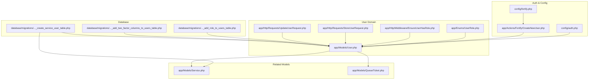
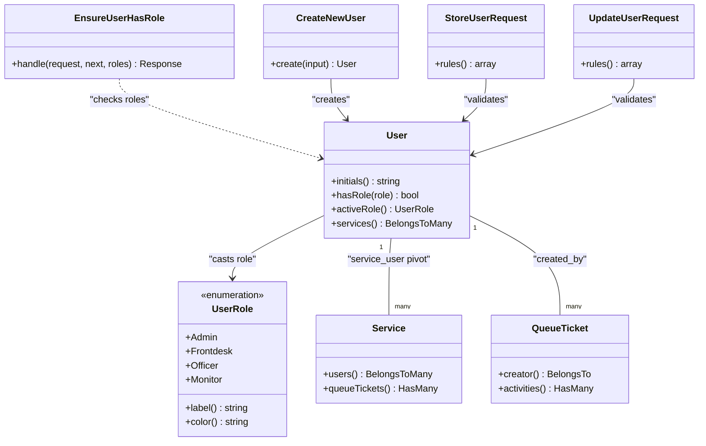
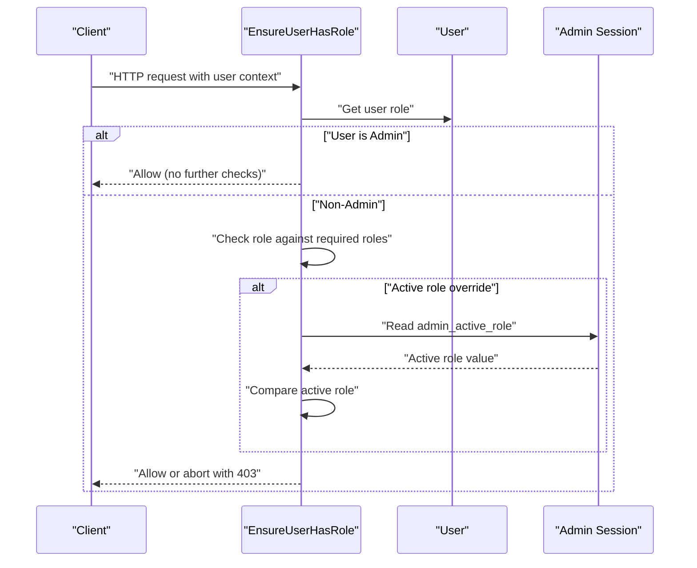
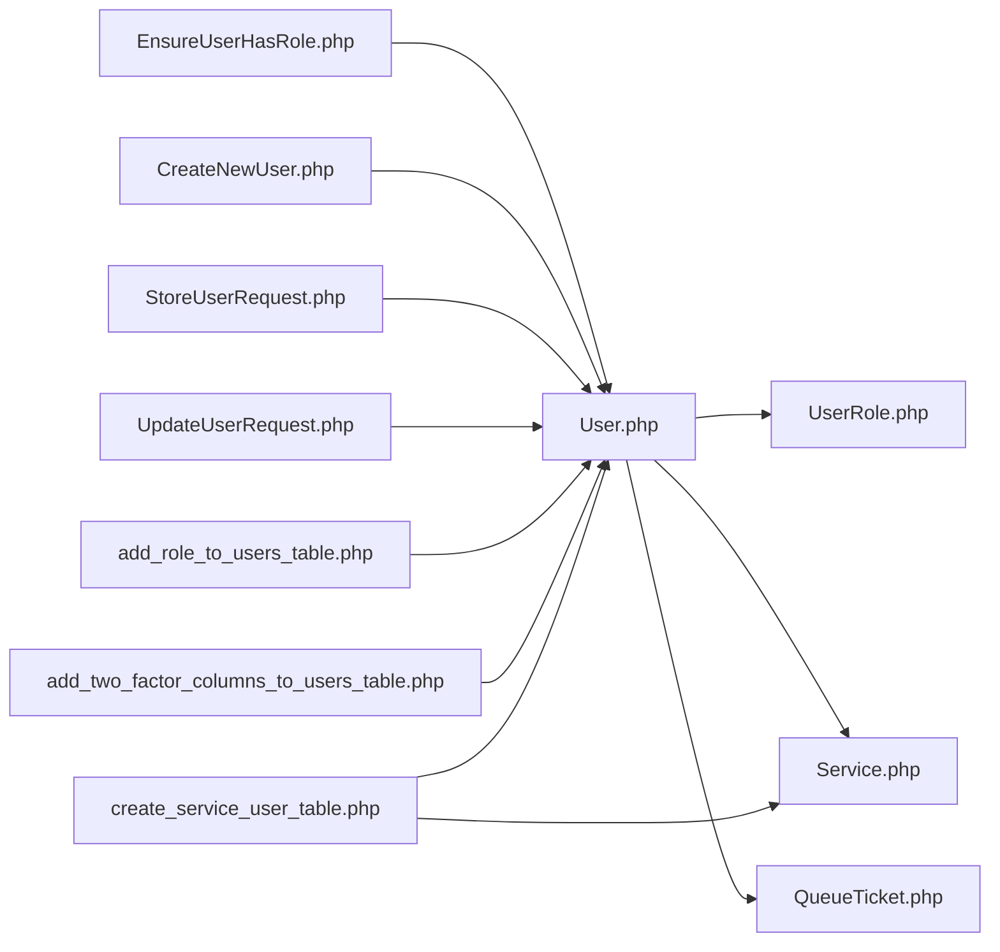

# User Model

<cite>
**Referenced Files in This Document**
- [User.php](file://app/Models/User.php)
- [UserRole.php](file://app/Enums/UserRole.php)
- [EnsureUserHasRole.php](file://app/Http/Middleware/EnsureUserHasRole.php)
- [CreateNewUser.php](file://app/Actions/Fortify/CreateNewUser.php)
- [StoreUserRequest.php](file://app/Http/Requests/StoreUserRequest.php)
- [UpdateUserRequest.php](file://app/Http/Requests/UpdateUserRequest.php)
- [auth.php](file://config/auth.php)
- [fortify.php](file://config/fortify.php)
- [2026_03_06_024605_add_role_to_users_table.php](file://database/migrations/2026_03_06_024605_add_role_to_users_table.php)
- [2025_08_14_170933_add_two_factor_columns_to_users_table.php](file://database/migrations/2025_08_14_170933_add_two_factor_columns_to_users_table.php)
- [2026_03_07_113021_create_service_user_table.php](file://database/migrations/2026_03_07_113021_create_service_user_table.php)
- [Service.php](file://app/Models/Service.php)
- [QueueTicket.php](file://app/Models/QueueTicket.php)
</cite>

## Table of Contents
1. [Introduction](#introduction)
2. [Project Structure](#project-structure)
3. [Core Components](#core-components)
4. [Architecture Overview](#architecture-overview)
5. [Detailed Component Analysis](#detailed-component-analysis)
6. [Dependency Analysis](#dependency-analysis)
7. [Performance Considerations](#performance-considerations)
8. [Troubleshooting Guide](#troubleshooting-guide)
9. [Conclusion](#conclusion)

## Introduction
This document provides comprehensive documentation for the User model, focusing on role-based access control (RBAC), multi-role user management, authentication and two-factor authentication (2FA), service officer capabilities via the service_user pivot table, user profile management, and security considerations. It also covers integration with queue ticket creation and user-specific operations, along with administrative controls, role hierarchy, and relationships with related models such as services and queue tickets.

## Project Structure
The User model is part of the application’s core domain and integrates with:
- Authentication and registration via Laravel Fortify
- Role-based middleware for authorization
- Request validation for user creation and updates
- Database migrations defining roles, 2FA fields, and the service_user pivot table
- Related models for services and queue tickets

**Diagram sources**
- [auth.php:1-118](file://config/auth.php#L1-L118)
- [fortify.php:1-158](file://config/fortify.php#L1-L158)
- [CreateNewUser.php:1-34](file://app/Actions/Fortify/CreateNewUser.php#L1-L34)
- [User.php:1-99](file://app/Models/User.php#L1-L99)
- [UserRole.php:1-32](file://app/Enums/UserRole.php#L1-L32)
- [EnsureUserHasRole.php:1-37](file://app/Http/Middleware/EnsureUserHasRole.php#L1-L37)
- [StoreUserRequest.php:1-39](file://app/Http/Requests/StoreUserRequest.php#L1-L39)
- [UpdateUserRequest.php:1-45](file://app/Http/Requests/UpdateUserRequest.php#L1-L45)
- [2026_03_06_024605_add_role_to_users_table.php:1-29](file://database/migrations/2026_03_06_024605_add_role_to_users_table.php#L1-L29)
- [2025_08_14_170933_add_two_factor_columns_to_users_table.php:1-35](file://database/migrations/2025_08_14_170933_add_two_factor_columns_to_users_table.php#L1-L35)
- [2026_03_07_113021_create_service_user_table.php:1-32](file://database/migrations/2026_03_07_113021_create_service_user_table.php#L1-L32)
- [Service.php:1-101](file://app/Models/Service.php#L1-L101)
- [QueueTicket.php:1-121](file://app/Models/QueueTicket.php#L1-L121)

**Section sources**
- [User.php:1-99](file://app/Models/User.php#L1-L99)
- [UserRole.php:1-32](file://app/Enums/UserRole.php#L1-L32)
- [EnsureUserHasRole.php:1-37](file://app/Http/Middleware/EnsureUserHasRole.php#L1-L37)
- [CreateNewUser.php:1-34](file://app/Actions/Fortify/CreateNewUser.php#L1-L34)
- [StoreUserRequest.php:1-39](file://app/Http/Requests/StoreUserRequest.php#L1-L39)
- [UpdateUserRequest.php:1-45](file://app/Http/Requests/UpdateUserRequest.php#L1-L45)
- [auth.php:1-118](file://config/auth.php#L1-L118)
- [fortify.php:1-158](file://config/fortify.php#L1-L158)
- [2026_03_06_024605_add_role_to_users_table.php:1-29](file://database/migrations/2026_03_06_024605_add_role_to_users_table.php#L1-L29)
- [2025_08_14_170933_add_two_factor_columns_to_users_table.php:1-35](file://database/migrations/2025_08_14_170933_add_two_factor_columns_to_users_table.php#L1-L35)
- [2026_03_07_113021_create_service_user_table.php:1-32](file://database/migrations/2026_03_07_113021_create_service_user_table.php#L1-L32)
- [Service.php:1-101](file://app/Models/Service.php#L1-L101)
- [QueueTicket.php:1-121](file://app/Models/QueueTicket.php#L1-L121)

## Core Components
- User model with RBAC and 2FA support, including role casting, hidden attributes, and helper methods for initials, role checks, and active role resolution.
- UserRole enum providing role constants, labels, and colors.
- Middleware for enforcing role-based access control.
- Fortify-based user creation action with validation.
- Request classes for storing and updating users, including role and service assignments.
- Database migrations supporting role, 2FA fields, and the service_user pivot table.
- Relationships with Service (officer capability) and QueueTicket (creator).

**Section sources**
- [User.php:14-99](file://app/Models/User.php#L14-L99)
- [UserRole.php:5-31](file://app/Enums/UserRole.php#L5-L31)
- [EnsureUserHasRole.php:16-35](file://app/Http/Middleware/EnsureUserHasRole.php#L16-L35)
- [CreateNewUser.php:20-32](file://app/Actions/Fortify/CreateNewUser.php#L20-L32)
- [StoreUserRequest.php:24-36](file://app/Http/Requests/StoreUserRequest.php#L24-L36)
- [UpdateUserRequest.php:24-42](file://app/Http/Requests/UpdateUserRequest.php#L24-L42)
- [2026_03_06_024605_add_role_to_users_table.php:14-16](file://database/migrations/2026_03_06_024605_add_role_to_users_table.php#L14-L16)
- [2025_08_14_170933_add_two_factor_columns_to_users_table.php:14-18](file://database/migrations/2025_08_14_170933_add_two_factor_columns_to_users_table.php#L14-L18)
- [2026_03_07_113021_create_service_user_table.php:14-21](file://database/migrations/2026_03_07_113021_create_service_user_table.php#L14-L21)
- [Service.php:53-57](file://app/Models/Service.php#L53-L57)
- [QueueTicket.php:69-72](file://app/Models/QueueTicket.php#L69-L72)

## Architecture Overview
The User model participates in a layered architecture:
- Presentation and validation via Form Requests
- Application actions via Fortify CreateNewUser
- Authorization via EnsureUserHasRole middleware
- Persistence via Eloquent relationships and migrations
- Integration with Service and QueueTicket models

**Diagram sources**
- [User.php:60-97](file://app/Models/User.php#L60-L97)
- [UserRole.php:5-31](file://app/Enums/UserRole.php#L5-L31)
- [Service.php:53-57](file://app/Models/Service.php#L53-L57)
- [QueueTicket.php:69-72](file://app/Models/QueueTicket.php#L69-L72)
- [EnsureUserHasRole.php:16-35](file://app/Http/Middleware/EnsureUserHasRole.php#L16-L35)
- [CreateNewUser.php:20-32](file://app/Actions/Fortify/CreateNewUser.php#L20-L32)
- [StoreUserRequest.php:24-36](file://app/Http/Requests/StoreUserRequest.php#L24-L36)
- [UpdateUserRequest.php:24-42](file://app/Http/Requests/UpdateUserRequest.php#L24-L42)

## Detailed Component Analysis

### User Model
- Role-based access control:
  - Role is stored as a string with a cast to UserRole enum.
  - hasRole method grants Admin universal access and otherwise compares the requested role.
  - activeRole resolves admin switching between roles using a session variable.
- Two-factor authentication:
  - Uses Laravel Fortify’s TwoFactorAuthenticatable trait.
  - Hidden sensitive fields include password hash, 2FA secret, recovery codes, and remember token.
- Relationships:
  - services(): BelongsToMany through the service_user pivot table.
  - QueueTicket creator relationship via created_by foreign key.
- Additional helpers:
  - initials(): Computes user initials from the name.

Security and privacy considerations:
- Passwords are hashed via cast.
- Sensitive 2FA fields are hidden from serialization.
- Email uniqueness enforced at DB level via migration.

**Section sources**
- [User.php:19-55](file://app/Models/User.php#L19-L55)
- [User.php:69-97](file://app/Models/User.php#L69-L97)
- [2026_03_06_024605_add_role_to_users_table.php:14-16](file://database/migrations/2026_03_06_024605_add_role_to_users_table.php#L14-L16)
- [2025_08_14_170933_add_two_factor_columns_to_users_table.php:14-18](file://database/migrations/2025_08_14_170933_add_two_factor_columns_to_users_table.php#L14-L18)

### UserRole Enum
- Defines four roles: Admin, Frontdesk, Officer, Monitor.
- Provides label() and color() helpers for UI rendering and theming.

**Section sources**
- [UserRole.php:5-31](file://app/Enums/UserRole.php#L5-L31)

### Middleware: EnsureUserHasRole
- Enforces role-based access:
  - Aborts unauthorized requests with 401.
  - Grants Admin unrestricted access.
  - Compares user role against required roles list and aborts with 403 if mismatch.

**Section sources**
- [EnsureUserHasRole.php:16-35](file://app/Http/Middleware/EnsureUserHasRole.php#L16-L35)

### Authentication and Registration
- Authentication guard and provider are configured in config/auth.php, pointing to the User model.
- Fortify configuration in config/fortify.php enables two-factor authentication with confirmation and password verification.
- CreateNewUser action validates profile and password rules and creates a User instance.

**Section sources**
- [auth.php:40-74](file://config/auth.php#L40-L74)
- [fortify.php:146-155](file://config/fortify.php#L146-L155)
- [CreateNewUser.php:20-32](file://app/Actions/Fortify/CreateNewUser.php#L20-L32)

### User Creation and Updates
- StoreUserRequest:
  - Validates name, email uniqueness, role inclusion, password length, and optional services array.
- UpdateUserRequest:
  - Similar validation with email uniqueness ignoring current user ID.
- Both requests support assigning services to users via the service_user pivot.

**Section sources**
- [StoreUserRequest.php:24-36](file://app/Http/Requests/StoreUserRequest.php#L24-L36)
- [UpdateUserRequest.php:24-42](file://app/Http/Requests/UpdateUserRequest.php#L24-L42)

### Database Migrations
- Role column addition to users table with default value.
- Two-factor columns (secret, recovery codes, confirmed timestamp) added to users table.
- service_user pivot table created with unique constraint on (service_id, user_id) and cascading updates/deletes.

**Section sources**
- [2026_03_06_024605_add_role_to_users_table.php:14-16](file://database/migrations/2026_03_06_024605_add_role_to_users_table.php#L14-L16)
- [2025_08_14_170933_add_two_factor_columns_to_users_table.php:14-18](file://database/migrations/2025_08_14_170933_add_two_factor_columns_to_users_table.php#L14-L18)
- [2026_03_07_113021_create_service_user_table.php:14-21](file://database/migrations/2026_03_07_113021_create_service_user_table.php#L14-L21)

### Service Officer Capabilities
- Users can be linked to services via the service_user pivot table.
- Service model exposes users() relationship; User model exposes services() relationship.
- This enables role-based access for officers to specific services.

**Section sources**
- [Service.php:53-57](file://app/Models/Service.php#L53-L57)
- [User.php:93-97](file://app/Models/User.php#L93-L97)
- [2026_03_07_113021_create_service_user_table.php:14-21](file://database/migrations/2026_03_07_113021_create_service_user_table.php#L14-L21)

### Queue Ticket Creator Relationship
- QueueTicket has a creator relationship pointing to User via created_by.
- This supports user-specific operations such as who created a ticket.

**Section sources**
- [QueueTicket.php:69-72](file://app/Models/QueueTicket.php#L69-L72)

### Role Hierarchy and Administrative Controls
- Admin role overrides all role checks.
- activeRole allows administrators to switch roles during a session, with the active role persisted in session storage.
- Middleware EnsureUserHasRole enforces role constraints across routes.

**Section sources**
- [User.php:81-91](file://app/Models/User.php#L81-L91)
- [EnsureUserHasRole.php:24-32](file://app/Http/Middleware/EnsureUserHasRole.php#L24-L32)

### Permission Checking Workflow

**Diagram sources**
- [EnsureUserHasRole.php:16-35](file://app/Http/Middleware/EnsureUserHasRole.php#L16-L35)
- [User.php:81-91](file://app/Models/User.php#L81-L91)

### User Provisioning and Multi-Role Assignment
- Provisioning:
  - Use CreateNewUser action to register users with validated profile and password.
  - StoreUserRequest and UpdateUserRequest enforce validation rules and role constraints.
- Multi-role assignment:
  - Roles are represented by the UserRole enum; each user holds a single role value.
  - Officers can be associated with multiple services via the service_user pivot.

**Section sources**
- [CreateNewUser.php:20-32](file://app/Actions/Fortify/CreateNewUser.php#L20-L32)
- [StoreUserRequest.php:24-36](file://app/Http/Requests/StoreUserRequest.php#L24-L36)
- [UpdateUserRequest.php:24-42](file://app/Http/Requests/UpdateUserRequest.php#L24-L42)
- [Service.php:53-57](file://app/Models/Service.php#L53-L57)
- [User.php:93-97](file://app/Models/User.php#L93-L97)

### Examples

- Creating a user:
  - Use the CreateNewUser action with validated input containing name, email, and password.
  - Reference: [CreateNewUser.php:20-32](file://app/Actions/Fortify/CreateNewUser.php#L20-L32)

- Assigning a role:
  - Validation ensures role is one of the allowed values from UserRole.
  - Reference: [StoreUserRequest.php:29-32](file://app/Http/Requests/StoreUserRequest.php#L29-L32), [UpdateUserRequest.php:36-39](file://app/Http/Requests/UpdateUserRequest.php#L36-L39)

- Assigning services to an officer:
  - Pass services array in the request; pivot entries are created accordingly.
  - References: [StoreUserRequest.php:34-35](file://app/Http/Requests/StoreUserRequest.php#L34-L35), [2026_03_07_113021_create_service_user_table.php:14-21](file://database/migrations/2026_03_07_113021_create_service_user_table.php#L14-L21)

- Checking permissions:
  - Middleware EnsureUserHasRole enforces role checks; Admin bypasses checks.
  - References: [EnsureUserHasRole.php:24-32](file://app/Http/Middleware/EnsureUserHasRole.php#L24-L32), [User.php:69-76](file://app/Models/User.php#L69-L76)

- Creating a queue ticket with user context:
  - QueueTicket creator relationship references User via created_by.
  - References: [QueueTicket.php:69-72](file://app/Models/QueueTicket.php#L69-L72)

## Dependency Analysis
- User depends on:
  - UserRole enum for role representation and UI helpers.
  - Fortify for 2FA and authentication lifecycle.
  - Request classes for validation.
  - Service and QueueTicket models for relationships.
- Middleware depends on User role and session for active role resolution.
- Migrations define schema dependencies for roles, 2FA, and pivot table.

**Diagram sources**
- [User.php:14-99](file://app/Models/User.php#L14-L99)
- [UserRole.php:5-31](file://app/Enums/UserRole.php#L5-L31)
- [Service.php:53-57](file://app/Models/Service.php#L53-L57)
- [QueueTicket.php:69-72](file://app/Models/QueueTicket.php#L69-L72)
- [EnsureUserHasRole.php:16-35](file://app/Http/Middleware/EnsureUserHasRole.php#L16-L35)
- [CreateNewUser.php:20-32](file://app/Actions/Fortify/CreateNewUser.php#L20-L32)
- [StoreUserRequest.php:24-36](file://app/Http/Requests/StoreUserRequest.php#L24-L36)
- [UpdateUserRequest.php:24-42](file://app/Http/Requests/UpdateUserRequest.php#L24-L42)
- [2026_03_06_024605_add_role_to_users_table.php:14-16](file://database/migrations/2026_03_06_024605_add_role_to_users_table.php#L14-L16)
- [2025_08_14_170933_add_two_factor_columns_to_users_table.php:14-18](file://database/migrations/2025_08_14_170933_add_two_factor_columns_to_users_table.php#L14-L18)
- [2026_03_07_113021_create_service_user_table.php:14-21](file://database/migrations/2026_03_07_113021_create_service_user_table.php#L14-L21)

**Section sources**
- [User.php:14-99](file://app/Models/User.php#L14-L99)
- [EnsureUserHasRole.php:16-35](file://app/Http/Middleware/EnsureUserHasRole.php#L16-L35)
- [CreateNewUser.php:20-32](file://app/Actions/Fortify/CreateNewUser.php#L20-L32)
- [StoreUserRequest.php:24-36](file://app/Http/Requests/StoreUserRequest.php#L24-L36)
- [UpdateUserRequest.php:24-42](file://app/Http/Requests/UpdateUserRequest.php#L24-L42)
- [2026_03_06_024605_add_role_to_users_table.php:14-16](file://database/migrations/2026_03_06_024605_add_role_to_users_table.php#L14-L16)
- [2025_08_14_170933_add_two_factor_columns_to_users_table.php:14-18](file://database/migrations/2025_08_14_170933_add_two_factor_columns_to_users_table.php#L14-L18)
- [2026_03_07_113021_create_service_user_table.php:14-21](file://database/migrations/2026_03_07_113021_create_service_user_table.php#L14-L21)
- [Service.php:53-57](file://app/Models/Service.php#L53-L57)
- [QueueTicket.php:69-72](file://app/Models/QueueTicket.php#L69-L72)

## Performance Considerations
- Role checks are O(1) comparisons; ensure minimal middleware overhead by avoiding redundant role evaluations.
- Two-factor fields are hidden to reduce payload sizes; keep queries scoped to avoid unnecessary selects.
- Pivot table indexing via unique constraint on (service_id, user_id) optimizes lookups for officer-service assignments.

## Troubleshooting Guide
- Authentication failures:
  - Verify Fortify two-factor settings and confirm password policies.
  - References: [fortify.php:146-155](file://config/fortify.php#L146-L155)
- Authorization errors:
  - Ensure the user role matches required roles; Admin bypass applies universally.
  - References: [EnsureUserHasRole.php:24-32](file://app/Http/Middleware/EnsureUserHasRole.php#L24-L32)
- Role mismatches:
  - Confirm role values align with UserRole enum; validation enforces allowed values.
  - References: [StoreUserRequest.php:29-32](file://app/Http/Requests/StoreUserRequest.php#L29-L32), [UpdateUserRequest.php:36-39](file://app/Http/Requests/UpdateUserRequest.php#L36-L39)
- 2FA issues:
  - Confirm two-factor columns exist and secrets/recovery codes are handled by Fortify.
  - References: [2025_08_14_170933_add_two_factor_columns_to_users_table.php:14-18](file://database/migrations/2025_08_14_170933_add_two_factor_columns_to_users_table.php#L14-L18)
- Service-officer linkage:
  - Ensure pivot entries exist for officer-service pairs; unique constraint prevents duplicates.
  - References: [2026_03_07_113021_create_service_user_table.php:14-21](file://database/migrations/2026_03_07_113021_create_service_user_table.php#L14-L21)

**Section sources**
- [fortify.php:146-155](file://config/fortify.php#L146-L155)
- [EnsureUserHasRole.php:24-32](file://app/Http/Middleware/EnsureUserHasRole.php#L24-L32)
- [StoreUserRequest.php:29-32](file://app/Http/Requests/StoreUserRequest.php#L29-L32)
- [UpdateUserRequest.php:36-39](file://app/Http/Requests/UpdateUserRequest.php#L36-L39)
- [2025_08_14_170933_add_two_factor_columns_to_users_table.php:14-18](file://database/migrations/2025_08_14_170933_add_two_factor_columns_to_users_table.php#L14-L18)
- [2026_03_07_113021_create_service_user_table.php:14-21](file://database/migrations/2026_03_07_113021_create_service_user_table.php#L14-L21)

## Conclusion
The User model provides a robust foundation for role-based access control, two-factor authentication, and service-officer relationships. Combined with middleware, request validation, and migrations, it supports secure, scalable user provisioning and operational workflows across queue ticketing and service management.