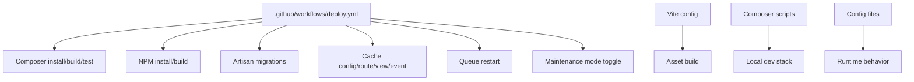
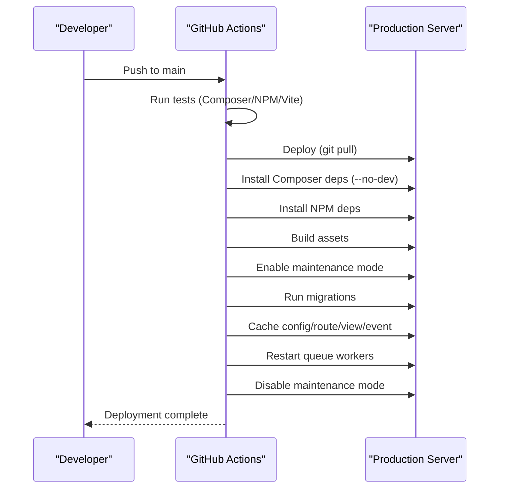
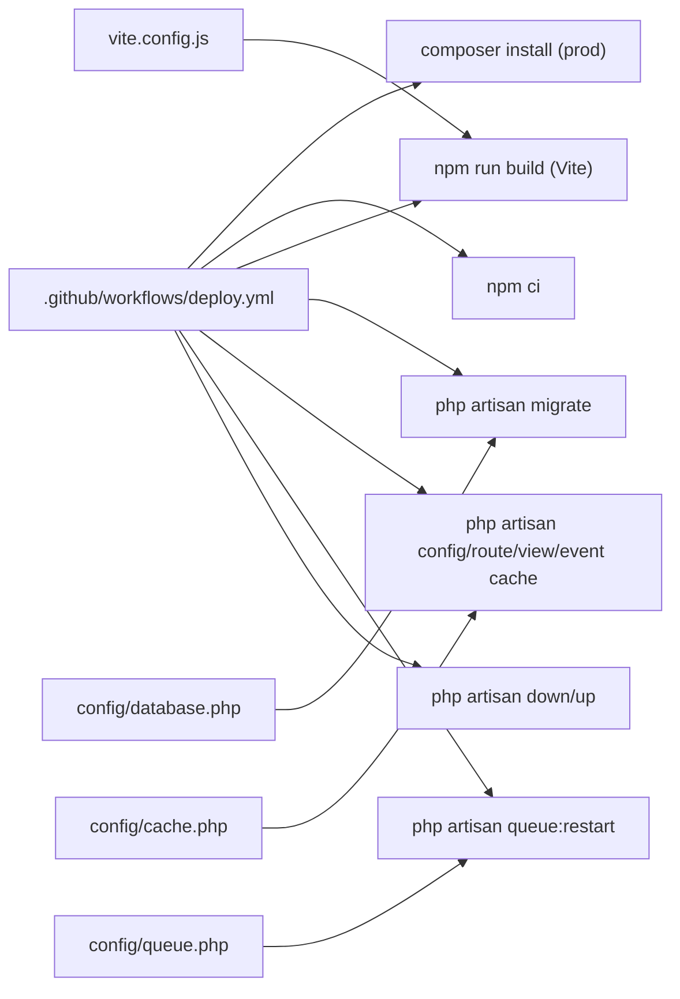

# Deployment and Operations

<cite>
**Referenced Files in This Document**
- [deploy.yml](file://.github/workflows/deploy.yml)
- [composer.json](file://composer.json)
- [package.json](file://package.json)
- [vite.config.js](file://vite.config.js)
- [app.php](file://config/app.php)
- [database.php](file://config/database.php)
- [logging.php](file://config/logging.php)
- [queue.php](file://config/queue.php)
- [cache.php](file://config/cache.php)
- [session.php](file://config/session.php)
- [2026_03_06_015234_create_queue_pools_table.php](file://database/migrations/2026_03_06_015234_create_queue_pools_table.php)
- [2026_03_06_015238_create_queue_tickets_table.php](file://database/migrations/2026_03_06_015238_create_queue_tickets_table.php)
- [2026_03_11_073137_create_app_settings_table.php](file://database/migrations/2026_03_11_073137_create_app_settings_table.php)
</cite>

## Table of Contents
1. [Introduction](#introduction)
2. [Project Structure](#project-structure)
3. [Core Components](#core-components)
4. [Architecture Overview](#architecture-overview)
5. [Detailed Component Analysis](#detailed-component-analysis)
6. [Dependency Analysis](#dependency-analysis)
7. [Performance Considerations](#performance-considerations)
8. [Troubleshooting Guide](#troubleshooting-guide)
9. [Conclusion](#conclusion)
10. [Appendices](#appendices)

## Introduction
This document provides comprehensive deployment and operations guidance for the PTSP system. It covers production deployment steps, CI/CD automation, infrastructure requirements, performance tuning, monitoring and alerting, backups and recovery, security hardening, and operational maintenance. The content is grounded in the repository’s configuration and workflow files to ensure accuracy and reproducibility.

## Project Structure
The PTSP system is a Laravel-based application with a modern frontend built using Vite. The repository includes:
- Laravel application code under app/, bootstrap/, config/, database/, routes/, and storage/.
- Asset pipeline managed by Vite with TailwindCSS integration.
- CI/CD pipeline defined in .github/workflows/deploy.yml.
- Composer and NPM scripts for local development and automated tasks.

**Diagram sources**
- [deploy.yml:11-79](file://.github/workflows/deploy.yml#L11-L79)
- [vite.config.js:1-37](file://vite.config.js#L1-L37)
- [composer.json:53-100](file://composer.json#L53-L100)

**Section sources**
- [.github/workflows/deploy.yml:1-79](file://.github/workflows/deploy.yml#L1-L79)
- [composer.json:1-118](file://composer.json#L1-L118)
- [package.json:1-28](file://package.json#L1-L28)
- [vite.config.js:1-37](file://vite.config.js#L1-L37)

## Core Components
- CI/CD Pipeline: Automated testing and deployment triggered on pushes to the main branch. It installs dependencies, builds assets, runs tests, migrates the database, caches configuration, and restarts queue workers.
- Asset Pipeline: Vite with Laravel Vite Plugin and TailwindCSS for building CSS/JS bundles.
- Runtime Configuration: Application, database, logging, cache, session, and queue configurations are environment-driven.
- Database Migrations: Queue pools, tickets, and app settings tables define the core data model.

Key operational commands and scripts are defined in Composer and NPM configuration files for local development and CI compatibility.

**Section sources**
- [.github/workflows/deploy.yml:11-79](file://.github/workflows/deploy.yml#L11-L79)
- [composer.json:53-100](file://composer.json#L53-L100)
- [package.json:5-8](file://package.json#L5-L8)
- [vite.config.js:8-22](file://vite.config.js#L8-L22)

## Architecture Overview
The deployment architecture integrates CI/CD, asset compilation, database migrations, and runtime configuration caching. The pipeline ensures zero-downtime deployments by enabling maintenance mode during updates and restarting queue workers afterward.

**Diagram sources**
- [deploy.yml:16-76](file://.github/workflows/deploy.yml#L16-L76)

## Detailed Component Analysis

### CI/CD Pipeline
- Trigger: Push to main branch.
- Test job: Installs Composer and Node dependencies, builds assets, runs code style checks, and executes tests.
- Deploy job: Pulls latest code, installs production dependencies, builds assets, enables maintenance mode, runs migrations, caches configuration, restarts queue workers, and disables maintenance mode.

Operational notes:
- Uses a self-hosted runner for the test job and a production environment for the deploy job.
- Maintains a configurable application path via APP_PATH variable.
- Uses maintenance mode with refresh and retry parameters to minimize downtime.

**Section sources**
- [.github/workflows/deploy.yml:3-79](file://.github/workflows/deploy.yml#L3-L79)

### Asset Compilation and Build
- Vite configuration registers multiple entry points for app, TV display, kiosk, and thermal printer assets.
- Laravel Vite Plugin integrates with Blade templates and enables HMR in development.
- NPM scripts define build and dev commands; Composer scripts orchestrate local development stacks.

Best practices:
- Keep Vite entries aligned with frontend components.
- Use production builds for releases; avoid HMR in production.

**Section sources**
- [vite.config.js:8-22](file://vite.config.js#L8-L22)
- [package.json:5-8](file://package.json#L5-L8)
- [composer.json:62-65](file://composer.json#L62-L65)

### Database and Migrations
- Default connection is environment-driven; SQLite is default locally, while production typically uses MySQL/MariaDB/PostgreSQL.
- Migrations define queue pools, queue tickets, and app settings tables with appropriate indexes and constraints.
- Redis is configured for queues and caching; queue connections include database, beanstalkd, SQS, and Redis.

Operational guidance:
- Ensure the target database is provisioned and credentials are set in environment variables.
- Run migrations after pulling code and before disabling maintenance mode.
- Monitor failed jobs and tune retry windows per environment.

**Section sources**
- [database.php:20-184](file://config/database.php#L20-L184)
- [queue.php:16-129](file://config/queue.php#L16-L129)
- [2026_03_06_015234_create_queue_pools_table.php:14-21](file://database/migrations/2026_03_06_015234_create_queue_pools_table.php#L14-L21)
- [2026_03_06_015238_create_queue_tickets_table.php:14-41](file://database/migrations/2026_03_06_015238_create_queue_tickets_table.php#L14-L41)
- [2026_03_11_073137_create_app_settings_table.php:14-19](file://database/migrations/2026_03_11_073137_create_app_settings_table.php#L14-L19)

### Logging and Monitoring
- Default log channel is stack; individual channels include single, daily, Slack, syslog, stderr, and Papertrail.
- Slack and Papertrail integrations are configurable via environment variables.
- For production, consider centralized logging and structured log formats.

Recommendations:
- Route critical events to Slack or Papertrail for alerting.
- Rotate logs and monitor disk usage.
- Use application metrics and queue monitoring alongside logs.

**Section sources**
- [logging.php:21-132](file://config/logging.php#L21-L132)

### Cache and Sessions
- Cache default store is database; supports file, memcached, redis, dynamodb, and octane.
- Session driver defaults to database; supports file, cookie, database, memcached, redis, and dynamodb.
- Prefixes and lock configurations are environment-driven.

Recommendations:
- Use Redis for cache and sessions in production for performance and scalability.
- Configure cache prefixes per environment to avoid collisions.

**Section sources**
- [cache.php:18-117](file://config/cache.php#L18-L117)
- [session.php:21-217](file://config/session.php#L21-L217)

### Application Configuration
- Application name, environment, debug flag, URL, timezone, locale, encryption key, and maintenance driver/store are environment-driven.
- Maintenance mode driver supports file and cache; cache store recommended for multi-node deployments.

Recommendations:
- Set APP_ENV to production and APP_DEBUG to false in production.
- Ensure APP_KEY is generated and stored securely.

**Section sources**
- [app.php:16-124](file://config/app.php#L16-L124)

## Dependency Analysis
The deployment pipeline orchestrates Composer and NPM dependencies, asset builds, and Laravel Artisan commands. The runtime relies on database connectivity, queue backends, and cache stores.

**Diagram sources**
- [deploy.yml:44-76](file://.github/workflows/deploy.yml#L44-L76)
- [database.php:20-184](file://config/database.php#L20-L184)
- [cache.php:18-117](file://config/cache.php#L18-L117)
- [queue.php:16-129](file://config/queue.php#L16-L129)
- [vite.config.js:8-22](file://vite.config.js#L8-L22)

**Section sources**
- [.github/workflows/deploy.yml:44-76](file://.github/workflows/deploy.yml#L44-L76)
- [database.php:20-184](file://config/database.php#L20-L184)
- [cache.php:18-117](file://config/cache.php#L18-L117)
- [queue.php:16-129](file://config/queue.php#L16-L129)
- [vite.config.js:8-22](file://vite.config.js#L8-L22)

## Performance Considerations
- Use production-ready queue backends (Redis/SQS) and scale workers horizontally.
- Enable cache stores (Redis) and tune retry windows for long-running jobs.
- Pre-warm configuration caches and route caches in CI/CD to reduce first-request latency.
- Optimize database indexes on frequently queried columns (e.g., queue tickets indices).
- Serve static assets via CDN and enable HTTP caching headers.

[No sources needed since this section provides general guidance]

## Troubleshooting Guide
Common deployment and operational issues:

- Composer/NPM dependency failures
  - Verify PHP version and network access to packagist and npm registries.
  - Use --no-dev and --prefer-dist flags in production deployments.

- Asset build errors
  - Ensure Node.js version compatibility and run npm ci for deterministic builds.
  - Confirm Vite entry points match frontend components.

- Database migration errors
  - Check DB credentials and connection type.
  - Review migration-specific constraints and indexes.

- Queue worker issues
  - Confirm queue connection settings and backend availability.
  - Inspect failed jobs table and adjust retry policies.

- Maintenance mode and downtime
  - Use maintenance mode with refresh and retry parameters to minimize impact.
  - Verify cache clearing and recomputation after migrations.

**Section sources**
- [.github/workflows/deploy.yml:44-76](file://.github/workflows/deploy.yml#L44-L76)
- [database.php:20-184](file://config/database.php#L20-L184)
- [queue.php:16-129](file://config/queue.php#L16-L129)
- [vite.config.js:8-22](file://vite.config.js#L8-L22)

## Conclusion
The PTSP system’s deployment and operations model leverages a robust CI/CD pipeline, asset pipeline, and environment-driven configuration. By following the outlined procedures for environment preparation, migrations, asset compilation, service configuration, monitoring, and maintenance, teams can achieve reliable, scalable, and secure operations.

[No sources needed since this section summarizes without analyzing specific files]

## Appendices

### A. Production Deployment Checklist
- Prepare environment variables (database, cache, queue, logging).
- Provision database and Redis instances.
- Configure reverse proxy and SSL termination.
- Set up monitoring and alerting channels.
- Run CI/CD pipeline and verify health endpoints.

[No sources needed since this section provides general guidance]

### B. Backup and Recovery Procedures
- Database backups: Schedule regular logical backups of MySQL/MariaDB/PostgreSQL; test restore procedures periodically.
- File backups: Back up application path and storage/app/public for uploaded assets.
- Recovery: Restore database, redeploy application, re-run migrations if schema changed, rebuild assets, and restart services.

[No sources needed since this section provides general guidance]

### C. Security Hardening Measures
- Set APP_ENV=production and APP_DEBUG=false.
- Rotate APP_KEY regularly and store secrets securely.
- Enforce HTTPS, secure cookies, and CSRF protections.
- Restrict file permissions and restrict access to sensitive directories.
- Keep dependencies updated and scan for vulnerabilities.

[No sources needed since this section provides general guidance]

### D. Maintenance Schedules
- Weekly: Dependency updates, security scans, and log rotation.
- Monthly: Capacity planning, performance profiling, and disaster recovery drills.
- Quarterly: Security audits, compliance reviews, and infrastructure upgrades.

[No sources needed since this section provides general guidance]