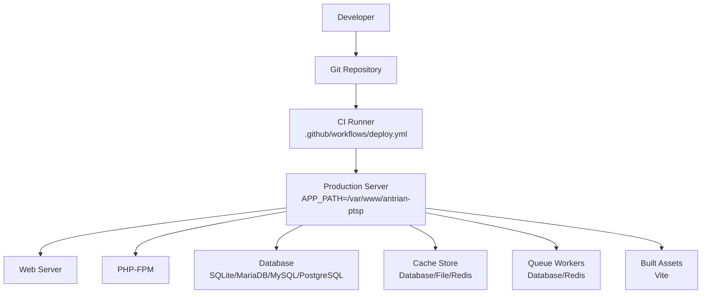
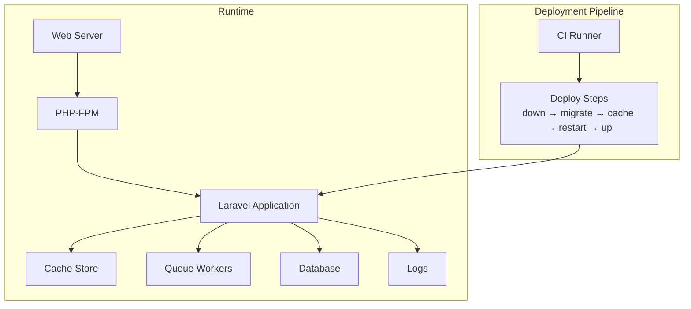
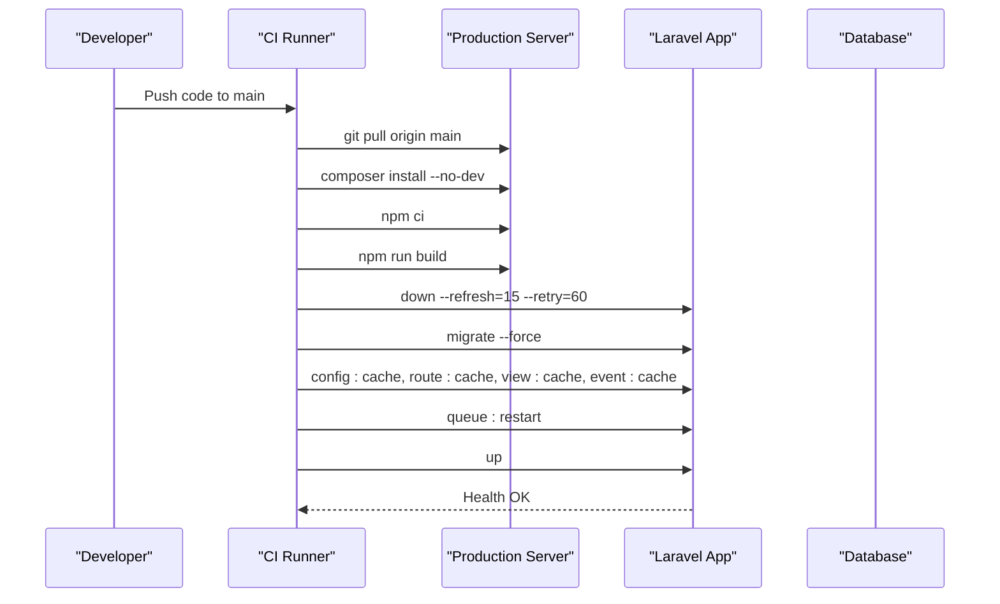
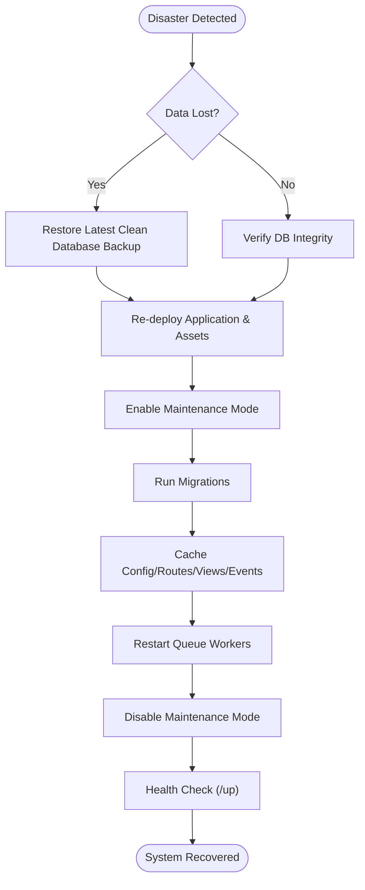
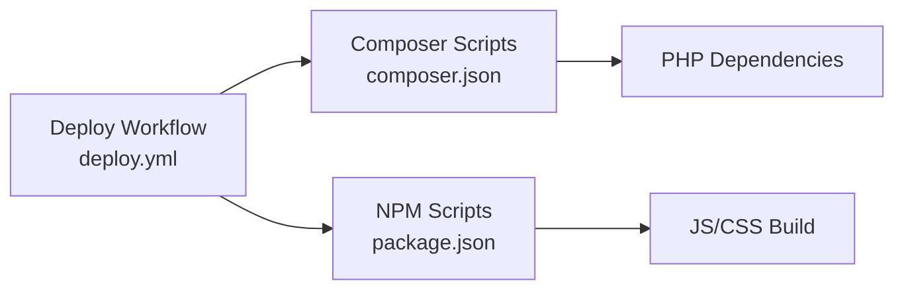

# Maintenance Procedures

<cite>
**Referenced Files in This Document**
- [composer.json](file://composer.json)
- [package.json](file://package.json)
- [deploy.yml](file://.github/workflows/deploy.yml)
- [app.php](file://bootstrap/app.php)
- [logging.php](file://config/logging.php)
- [cache.php](file://config/cache.php)
- [database.php](file://config/database.php)
- [queue.php](file://config/queue.php)
- [maintenance-mode.stub](file://vendor/laravel/framework/src/Illuminate/Foundation/Console/stubs/maintenance-mode.stub)
- [health-up.blade.php](file://vendor/laravel/framework/src/Illuminate/Foundation/resources/health-up.blade.php)
- [console.php](file://routes/console.php)
- [resolve_conflicts.sh](file://resolve_conflicts.sh)
</cite>

## Table of Contents
1. [Introduction](#introduction)
2. [Project Structure](#project-structure)
3. [Core Components](#core-components)
4. [Architecture Overview](#architecture-overview)
5. [Detailed Component Analysis](#detailed-component-analysis)
6. [Dependency Analysis](#dependency-analysis)
7. [Performance Considerations](#performance-considerations)
8. [Troubleshooting Guide](#troubleshooting-guide)
9. [Conclusion](#conclusion)
10. [Appendices](#appendices)

## Introduction
This document provides comprehensive maintenance procedures for the PTSP system. It covers routine tasks such as log rotation, cache clearing, and database optimization; backup strategies for database, application files, and configuration settings; update and patch management; disaster recovery; preventive maintenance schedules; health checks; capacity planning; and emergency response procedures for critical failures and security incidents.

## Project Structure
The PTSP system is a Laravel-based application with integrated frontend assets built via Vite. Deployment is automated using a GitHub Actions workflow that pulls code, installs dependencies, builds assets, migrates the database, caches configuration, and restarts queue workers while enabling maintenance mode during updates.

**Diagram sources**
- [deploy.yml:11-79](file://.github/workflows/deploy.yml#L11-L79)
- [database.php:33-117](file://config/database.php#L33-L117)
- [cache.php:35-102](file://config/cache.php#L35-L102)
- [queue.php:32-92](file://config/queue.php#L32-L92)
- [package.json:5-8](file://package.json#L5-L8)

**Section sources**
- [deploy.yml:11-79](file://.github/workflows/deploy.yml#L11-L79)
- [package.json:1-28](file://package.json#L1-28)

## Core Components
- Logging subsystem configured for daily rotation and multiple channels.
- Cache subsystem supporting database, file, Redis, and failover stores.
- Queue subsystem supporting database, Redis, SQS, and Beanstalkd backends.
- Database connectivity supporting SQLite, MySQL/MariaDB, PostgreSQL, and SQL Server.
- Maintenance mode handling via a stub that serves a prerendered template and respects exclusions and secret bypass.
- Health endpoint routing configured at /up.

**Section sources**
- [logging.php:53-130](file://config/logging.php#L53-L130)
- [cache.php:18-117](file://config/cache.php#L18-L117)
- [queue.php:16-129](file://config/queue.php#L16-L129)
- [database.php:20-117](file://config/database.php#L20-L117)
- [maintenance-mode.stub:1-79](file://vendor/laravel/framework/src/Illuminate/Foundation/Console/stubs/maintenance-mode.stub#L1-L79)
- [app.php:15](file://bootstrap/app.php#L15)

## Architecture Overview
The system’s runtime architecture integrates web requests, queues, cache, and database layers. The deployment pipeline ensures minimal downtime by enabling maintenance mode, applying migrations, caching configuration, and restarting queue workers.

**Diagram sources**
- [deploy.yml:60-76](file://.github/workflows/deploy.yml#L60-L76)
- [cache.php:35-102](file://config/cache.php#L35-L102)
- [queue.php:32-92](file://config/queue.php#L32-L92)
- [database.php:33-117](file://config/database.php#L33-L117)
- [logging.php:53-130](file://config/logging.php#L53-L130)

## Detailed Component Analysis

### Routine Maintenance Tasks

#### Log Rotation
- Daily rotation is enabled with a retention period configurable via environment variables.
- Recommended schedule: Weekly review of retention and cleanup of stale log archives.
- Operational steps:
  - Verify LOG_CHANNEL and LOG_LEVEL settings.
  - Confirm LOG_DAILY_DAYS aligns with compliance requirements.
  - Archive and purge logs outside the retention window on a weekly basis.

**Section sources**
- [logging.php:68-74](file://config/logging.php#L68-L74)

#### Cache Clearing and Optimization
- Cache stores include database, file, Redis, DynamoDB, and failover configurations.
- Recommended schedule: Monthly cache flush and key-space inspection for Redis.
- Operational steps:
  - Clear application cache after deployments.
  - Optimize cache keys by reviewing CACHE_PREFIX and store-specific tuning.
  - For Redis, monitor memory usage and evictions; consider periodic key expiration reviews.

**Section sources**
- [cache.php:18-117](file://config/cache.php#L18-L117)

#### Database Optimization
- Supports SQLite, MySQL/MariaDB, PostgreSQL, and SQL Server.
- Recommended schedule: Bi-weekly vacuum/analyze and index checks; monthly full optimization.
- Operational steps:
  - Run database-specific optimization commands (e.g., VACUUM/ANALYZE).
  - Review slow query logs and optimize indexes.
  - Monitor connection counts and pool sizes against Redis and database limits.

**Section sources**
- [database.php:33-117](file://config/database.php#L33-L117)

### Backup Procedures

#### Database Backups
- SQLite: Back up the SQLite file located under the configured database path.
- MySQL/MariaDB: Use logical backups (mysqldump) or physical backups (Percona XtraBackup).
- PostgreSQL: Use pg_dumplogical or base backups.
- Retention: Maintain 30-day daily, 12-week weekly, and 12-monthly snapshots.

#### Application Files and Configuration Backups
- Source code: Full repository snapshot including .env.
- Built assets: Preserve Vite build outputs.
- Configuration: Back up config files and environment variables separately.

#### Backup Validation and Restoration
- Monthly restore drills to validate backup integrity.
- Documented restoration steps per technology stack.

[No sources needed since this section provides general guidance]

### Update and Patch Management

#### Dependency Updates
- Composer dependencies: Use composer update and review changelogs.
- Node dependencies: Use npm ci for deterministic installs; update and rebuild.
- Post-update hooks: Ensure vendor publishing and framework updates are applied.

#### Security Patches
- Monitor advisories for Laravel, PHP, and third-party packages.
- Apply patches promptly; test in staging before production deployment.

#### Deployment Workflow
- The CI pipeline automates safe updates with maintenance mode, migrations, caching, and worker restarts.

**Diagram sources**
- [deploy.yml:44-79](file://.github/workflows/deploy.yml#L44-L79)

**Section sources**
- [deploy.yml:44-79](file://.github/workflows/deploy.yml#L44-L79)
- [composer.json:53-100](file://composer.json#L53-L100)
- [package.json:5-8](file://package.json#L5-L8)

### Disaster Recovery Procedures

#### Data Restoration
- Restore database from the latest clean backup.
- Re-run migrations to align schema with current code.
- Recreate cache and queue configurations.

#### System Recovery
- Re-deploy application binaries and assets.
- Re-enable maintenance mode during recovery, apply migrations, cache configuration, and restart workers.
- Validate service health via the /up endpoint.

**Diagram sources**
- [deploy.yml:60-76](file://.github/workflows/deploy.yml#L60-L76)
- [health-up.blade.php:1-47](file://vendor/laravel/framework/src/Illuminate/Foundation/resources/health-up.blade.php#L1-L47)

**Section sources**
- [deploy.yml:60-76](file://.github/workflows/deploy.yml#L60-L76)
- [health-up.blade.php:1-47](file://vendor/laravel/framework/src/Illuminate/Foundation/resources/health-up.blade.php#L1-L47)

### Preventive Maintenance Schedules
- Daily:
  - Monitor logs and alert thresholds.
  - Check queue backlog and failed jobs.
- Weekly:
  - Rotate logs and archive older entries.
  - Inspect cache utilization and tune prefixes.
  - Validate database connection health.
- Monthly:
  - Perform cache flush and key-space audit.
  - Run database optimization and index analysis.
  - Validate backup integrity with restore drills.
- Quarterly:
  - Review and update maintenance procedures.
  - Assess capacity trends and scaling needs.

[No sources needed since this section provides general guidance]

### Health Check Procedures
- Endpoint: The application exposes a health endpoint routed at /up.
- Verification: Access the endpoint to confirm application readiness and response time.
- Monitoring: Integrate with external monitoring systems to track uptime and latency.

**Section sources**
- [app.php:15](file://bootstrap/app.php#L15)
- [health-up.blade.php:32-40](file://vendor/laravel/framework/src/Illuminate/Foundation/resources/health-up.blade.php#L32-L40)

### Capacity Planning Guidelines
- Track queue length and retry timing to anticipate load spikes.
- Monitor cache hit rates and memory usage; scale Redis or increase cache TTLs as needed.
- Evaluate database I/O and connection pooling; provision additional CPU/memory/storage accordingly.
- Plan asset build times and CDN caching to reduce server load.

[No sources needed since this section provides general guidance]

### Emergency Response Procedures
- Critical Failure:
  - Enable maintenance mode immediately.
  - Roll back to the last known good deployment if necessary.
  - Investigate recent changes and revert problematic commits.
- Security Incident:
  - Rotate secrets and invalidate tokens.
  - Review logs for suspicious activity.
  - Apply security patches and re-validate system integrity.

**Section sources**
- [maintenance-mode.stub:1-79](file://vendor/laravel/framework/src/Illuminate/Foundation/Console/stubs/maintenance-mode.stub#L1-L79)
- [deploy.yml:60-76](file://.github/workflows/deploy.yml#L60-L76)

## Dependency Analysis
The application depends on Composer and NPM for PHP and frontend assets respectively. The deployment workflow orchestrates Composer and NPM operations, ensuring consistent environments across stages.

**Diagram sources**
- [composer.json:53-100](file://composer.json#L53-L100)
- [package.json:5-8](file://package.json#L5-L8)
- [deploy.yml:23-58](file://.github/workflows/deploy.yml#L23-L58)

**Section sources**
- [composer.json:53-100](file://composer.json#L53-L100)
- [package.json:5-8](file://package.json#L5-L8)
- [deploy.yml:23-58](file://.github/workflows/deploy.yml#L23-L58)

## Performance Considerations
- Use database-backed cache and queue for horizontal scalability.
- Tune retry-after and queue visibility timeouts to balance throughput and latency.
- Monitor and cap log verbosity in production to reduce I/O overhead.
- Keep Composer autoload optimized and avoid unnecessary package installations in production.

[No sources needed since this section provides general guidance]

## Troubleshooting Guide
- Maintenance Mode Bypass:
  - The maintenance stub supports secret bypass and exclusion patterns; verify configuration and cookies if users cannot access during maintenance.
- Health Endpoint:
  - The health-up.blade.php template renders a simple status page; confirm routing and middleware alignment.
- Conflict Resolution:
  - Use the provided shell script to resolve merge conflicts in selected files.

**Section sources**
- [maintenance-mode.stub:16-55](file://vendor/laravel/framework/src/Illuminate/Foundation/Console/stubs/maintenance-mode.stub#L16-L55)
- [health-up.blade.php:25-42](file://vendor/laravel/framework/src/Illuminate/Foundation/resources/health-up.blade.php#L25-L42)
- [resolve_conflicts.sh:1-14](file://resolve_conflicts.sh#L1-L14)

## Conclusion
By following the procedures outlined—routine maintenance, robust backup strategies, disciplined update and patch management, comprehensive disaster recovery, preventive schedules, health checks, capacity planning, and emergency response—you can maintain a reliable, secure, and scalable PTSP system.

## Appendices
- Maintenance Mode Behavior:
  - The maintenance stub evaluates exclusions, secret bypass, and cookie-based bypass; ensure these are configured appropriately for operational needs.

**Section sources**
- [maintenance-mode.stub:1-79](file://vendor/laravel/framework/src/Illuminate/Foundation/Console/stubs/maintenance-mode.stub#L1-L79)