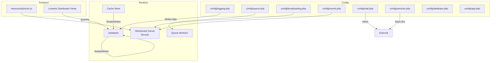
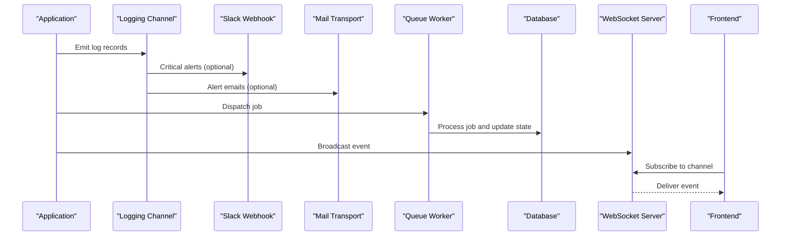
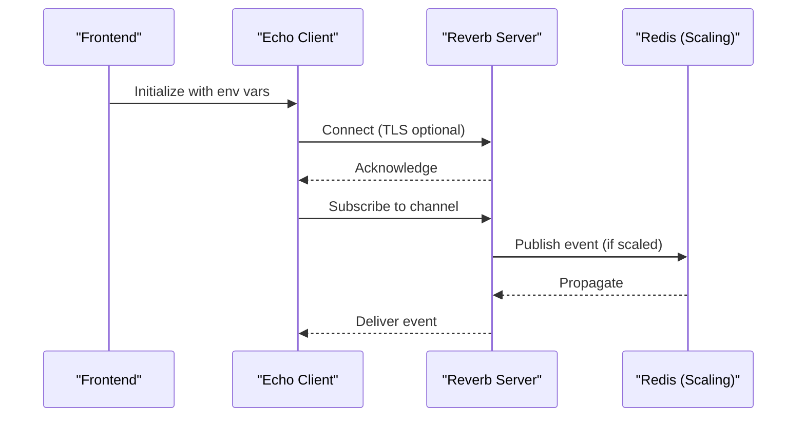
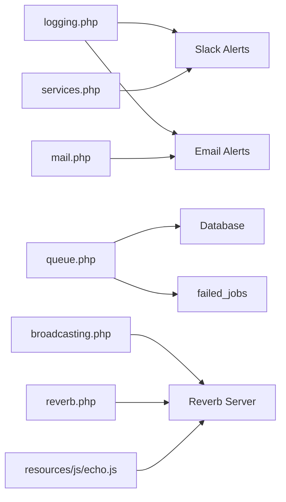

# Monitoring and Logging

<cite>
**Referenced Files in This Document**
- [logging.php](file://config/logging.php)
- [queue.php](file://config/queue.php)
- [broadcasting.php](file://config/broadcasting.php)
- [reverb.php](file://config/reverb.php)
- [mail.php](file://config/mail.php)
- [services.php](file://config/services.php)
- [database.php](file://config/database.php)
- [app.php](file://config/app.php)
- [channels.php](file://routes/channels.php)
- [echo.js](file://resources/js/echo.js)
- [MonitorStats.php](file://app/Support/Dashboard/MonitorStats.php)
- [monitor-dashboard.blade.php](file://resources/views/components/dashboard/monitor-dashboard.blade.php)
- [2026-03-13-performance-optimization.md](file://docs/superpowers/plans/2026-03-13-performance-optimization.md)
</cite>

## Table of Contents
1. [Introduction](#introduction)
2. [Project Structure](#project-structure)
3. [Core Components](#core-components)
4. [Architecture Overview](#architecture-overview)
5. [Detailed Component Analysis](#detailed-component-analysis)
6. [Dependency Analysis](#dependency-analysis)
7. [Performance Considerations](#performance-considerations)
8. [Troubleshooting Guide](#troubleshooting-guide)
9. [Conclusion](#conclusion)

## Introduction
This document provides comprehensive monitoring and logging guidance for the PTSP system. It covers logging configuration (levels, rotation, storage), performance monitoring using Laravel’s built-in capabilities and external tools, error tracking and alerting (email and Slack), queue monitoring for job processing and worker health, real-time monitoring of WebSocket connections and broadcast events, and practical troubleshooting workflows for performance bottlenecks and system issues.

## Project Structure
The monitoring and logging ecosystem spans configuration files, runtime components, and frontend integrations:
- Logging and alerting configuration under config/.
- Queue and failed job handling under config/queue.php.
- Real-time broadcasting under config/broadcasting.php and config/reverb.php, with frontend integration in resources/js/echo.js.
- Metrics aggregation via app/Support/Dashboard/MonitorStats.php and Livewire dashboard components.
- Database and cache configuration impacting performance and observability.

**Diagram sources**
- [logging.php:1-133](file://config/logging.php#L1-L133)
- [queue.php:1-130](file://config/queue.php#L1-L130)
- [broadcasting.php:1-83](file://config/broadcasting.php#L1-L83)
- [reverb.php:1-103](file://config/reverb.php#L1-L103)
- [mail.php:1-119](file://config/mail.php#L1-L119)
- [services.php:1-61](file://config/services.php#L1-L61)
- [database.php:1-185](file://config/database.php#L1-L185)
- [app.php:1-127](file://config/app.php#L1-L127)
- [echo.js:1-14](file://resources/js/echo.js#L1-L14)

**Section sources**
- [logging.php:1-133](file://config/logging.php#L1-L133)
- [queue.php:1-130](file://config/queue.php#L1-L130)
- [broadcasting.php:1-83](file://config/broadcasting.php#L1-L83)
- [reverb.php:1-103](file://config/reverb.php#L1-L103)
- [mail.php:1-119](file://config/mail.php#L1-L119)
- [services.php:1-61](file://config/services.php#L1-L61)
- [database.php:1-185](file://config/database.php#L1-L185)
- [app.php:1-127](file://config/app.php#L1-L127)
- [echo.js:1-14](file://resources/js/echo.js#L1-L14)

## Core Components
- Logging configuration: Centralized in config/logging.php with channels for single-file, daily rotation, Slack, syslog, stderr, and Papertrail. Default channel and deprecation logging are configurable.
- Queue configuration: Centralized in config/queue.php with multiple drivers (database, Redis, SQS, Beanstalkd) and failed job handling.
- Broadcasting and WebSocket: Configured in config/broadcasting.php and config/reverb.php; frontend integration in resources/js/echo.js.
- Email and Slack alerting: Configured in config/mail.php and config/services.php for SMTP/log transports and Slack bot credentials.
- Metrics aggregation: app/Support/Dashboard/MonitorStats.php computes dashboard metrics; Livewire views render the dashboard.

**Section sources**
- [logging.php:53-130](file://config/logging.php#L53-L130)
- [queue.php:32-127](file://config/queue.php#L32-L127)
- [broadcasting.php:31-80](file://config/broadcasting.php#L31-L80)
- [reverb.php:29-100](file://config/reverb.php#L29-L100)
- [mail.php:38-118](file://config/mail.php#L38-L118)
- [services.php:31-36](file://config/services.php#L31-L36)
- [MonitorStats.php:21-80](file://app/Support/Dashboard/MonitorStats.php#L21-L80)

## Architecture Overview
The monitoring architecture integrates logging, queue processing, real-time broadcasting, and alerting. Logs are emitted to configured channels; queue workers process jobs and persist failures; WebSocket connections stream events to clients; and alerting is triggered via email or Slack.

**Diagram sources**
- [logging.php:76-83](file://config/logging.php#L76-L83)
- [mail.php:38-118](file://config/mail.php#L38-L118)
- [services.php:31-36](file://config/services.php#L31-L36)
- [queue.php:32-90](file://config/queue.php#L32-L90)
- [broadcasting.php:31-80](file://config/broadcasting.php#L31-L80)
- [reverb.php:29-55](file://config/reverb.php#L29-L55)
- [echo.js:6-14](file://resources/js/echo.js#L6-L14)

## Detailed Component Analysis

### Logging Configuration
- Default channel: stack by default, composed of configured channels.
- Single and daily rotation: single writes to a single file; daily rotates by day with retention days configurable.
- Slack channel: sends critical severity logs to a Slack webhook.
- Papertrail channel: forwards logs via syslog UDP handler.
- Stderr and syslog channels: for container/stdout and system logging.
- Emergency channel: fallback file path.

Operational guidance:
- Set LOG_CHANNEL to select the primary channel (e.g., stack, daily).
- Configure LOG_LEVEL to control verbosity (e.g., debug, info, warning, error, critical).
- For production, prefer daily with appropriate LOG_DAILY_DAYS and LOG_LEVEL.
- Enable LOG_SLACK_WEBHOOK_URL and LOG_LEVEL=critical for urgent alerts.
- For centralized logging, enable Papertrail handler with host/port.

**Section sources**
- [logging.php:21-21](file://config/logging.php#L21-L21)
- [logging.php:55-74](file://config/logging.php#L55-L74)
- [logging.php:76-83](file://config/logging.php#L76-L83)
- [logging.php:85-95](file://config/logging.php#L85-L95)
- [logging.php:97-113](file://config/logging.php#L97-L113)
- [logging.php:126-128](file://config/logging.php#L126-L128)

### Performance Monitoring Setup
- Built-in metrics: Laravel provides request timing, memory usage, and SQL profiling via Telescope and Pulse integrations (see ingest intervals in Reverb configuration).
- Database and cache stores: config/database.php and config/cache.php define stores and prefixes; tune cache TTL and key prefixes for performance.
- Livewire polling overhead: The performance optimization plan documents reducing repeated queries and adding caching in Livewire components.

Recommended steps:
- Enable Telescope/Pulse ingestion intervals aligned with REVERB_TELESCOPE_INGEST_INTERVAL and REVERB_PULSE_INGEST_INTERVAL.
- Use database-backed cache for frequently accessed metrics.
- Apply caching and consolidation strategies outlined in the performance plan.

**Section sources**
- [reverb.php:53-54](file://config/reverb.php#L53-L54)
- [database.php:146-182](file://config/database.php#L146-L182)
- [cache.php:35-102](file://config/cache.php#L35-L102)
- [2026-03-13-performance-optimization.md:13-24](file://docs/superpowers/plans/2026-03-13-performance-optimization.md#L13-L24)

### Error Tracking and Alerting
- Email transport: config/mail.php supports SMTP, SES, Postmark, Resend, Sendmail, log, array, failover, and roundrobin transports. Configure MAIL_MAILER and credentials.
- Global sender: MAIL_FROM_ADDRESS and MAIL_FROM_NAME define the sender identity.
- Slack integration: config/services.php includes Slack bot credentials for notifications.

Implementation tips:
- For development, use log mailer to capture emails without sending.
- For production, configure SMTP or cloud providers; set APP_ENV=production and APP_DEBUG=false.
- To receive critical alerts, configure LOG_SLACK_WEBHOOK_URL and LOG_LEVEL=critical in logging.php.

**Section sources**
- [mail.php:17-17](file://config/mail.php#L17-L17)
- [mail.php:38-118](file://config/mail.php#L38-L118)
- [services.php:31-36](file://config/services.php#L31-L36)
- [logging.php:76-83](file://config/logging.php#L76-L83)
- [app.php:29-42](file://config/app.php#L29-L42)

### Queue Monitoring
- Connections: database, redis, sqs, beanstalkd, sync, and failover configurations.
- Retry and timeouts: retry_after and block_for tuning per driver.
- Failed jobs: failed driver selection and table mapping.

Monitoring checklist:
- Confirm QUEUE_CONNECTION matches your deployment (e.g., database or redis).
- Track failed_jobs table for persistent failures.
- Monitor queue latency and retry patterns; adjust retry_after and worker concurrency.
- Use database jobs table to inspect pending jobs and queue depth.

**Section sources**
- [queue.php:16-16](file://config/queue.php#L16-L16)
- [queue.php:32-90](file://config/queue.php#L32-L90)
- [queue.php:123-127](file://config/queue.php#L123-L127)

### Real-Time Monitoring of WebSocket Connections and Broadcast Events
- Broadcasting driver: reverb, pusher, ably, log, or null.
- Reverb server: host, port, TLS, scaling via Redis, and ingest intervals.
- Frontend integration: resources/js/echo.js connects to Reverb using environment variables.
- Private channels: routes/channels.php restricts access to authenticated users.

Monitoring checklist:
- Verify REVERB_APP_KEY, REVERB_APP_SECRET, REVERB_APP_ID, REVERB_HOST, REVERB_PORT, REVERB_SCHEME.
- Ensure clients subscribe to the intended channels and handle connection errors.
- Observe Reverb scaling settings for multi-instance deployments.

**Diagram sources**
- [reverb.php:29-55](file://config/reverb.php#L29-L55)
- [echo.js:6-14](file://resources/js/echo.js#L6-L14)
- [broadcasting.php:31-47](file://config/broadcasting.php#L31-L47)
- [channels.php:5-7](file://routes/channels.php#L5-L7)

**Section sources**
- [broadcasting.php:18-18](file://config/broadcasting.php#L18-L18)
- [broadcasting.php:31-80](file://config/broadcasting.php#L31-L80)
- [reverb.php:29-100](file://config/reverb.php#L29-L100)
- [echo.js:1-14](file://resources/js/echo.js#L1-L14)
- [channels.php:5-7](file://routes/channels.php#L5-L7)

### Metrics and Dashboard Monitoring
- MonitorStats aggregates:
  - Total served today
  - Throughput today
  - Backlog by service
  - Served by officer
  - Officer-service matrix

- Livewire dashboard renders metrics and trends.

Recommendations:
- Use MonitorStats in Livewire components to reduce client-side computation.
- Cache heavy aggregations to minimize database load.
- Align dashboard polling intervals with performance goals.

**Section sources**
- [MonitorStats.php:21-80](file://app/Support/Dashboard/MonitorStats.php#L21-L80)
- [monitor-dashboard.blade.php:1-9](file://resources/views/components/dashboard/monitor-dashboard.blade.php#L1-L9)

## Dependency Analysis
The monitoring stack depends on configuration choices and external services:
- Logging depends on channel drivers and environment variables.
- Queue depends on database/Redis/SQS connectivity and failed job storage.
- Broadcasting depends on Reverb/Pusher/Ably availability and frontend Echo configuration.
- Alerting depends on mailer configuration and Slack bot credentials.

**Diagram sources**
- [logging.php:76-83](file://config/logging.php#L76-L83)
- [mail.php:38-118](file://config/mail.php#L38-L118)
- [services.php:31-36](file://config/services.php#L31-L36)
- [queue.php:123-127](file://config/queue.php#L123-L127)
- [broadcasting.php:31-80](file://config/broadcasting.php#L31-L80)
- [reverb.php:29-55](file://config/reverb.php#L29-L55)
- [echo.js:6-14](file://resources/js/echo.js#L6-L14)

**Section sources**
- [logging.php:76-83](file://config/logging.php#L76-L83)
- [mail.php:38-118](file://config/mail.php#L38-L118)
- [services.php:31-36](file://config/services.php#L31-L36)
- [queue.php:123-127](file://config/queue.php#L123-L127)
- [broadcasting.php:31-80](file://config/broadcasting.php#L31-L80)
- [reverb.php:29-55](file://config/reverb.php#L29-L55)
- [echo.js:6-14](file://resources/js/echo.js#L6-L14)

## Performance Considerations
- Database query optimization: Consolidate queries and add caching in Livewire components to reduce polling overhead.
- Indexing: Ensure proper indexes on queue and activity tables to speed up lookups.
- Asset bundling: Optimize frontend bundles to reduce load times.
- Aggregation layer: Move expensive computations to the database layer where feasible.

Actionable tasks:
- Review the performance optimization plan for Livewire polling components and database migrations.
- Add caching around MonitorStats to reduce repeated database scans.
- Tune queue retry_after and worker concurrency to balance throughput and latency.

**Section sources**
- [2026-03-13-performance-optimization.md:13-24](file://docs/superpowers/plans/2026-03-13-performance-optimization.md#L13-L24)
- [MonitorStats.php:21-80](file://app/Support/Dashboard/MonitorStats.php#L21-L80)

## Troubleshooting Guide
Common issues and resolutions:
- Logs not rotating or missing:
  - Verify LOG_CHANNEL and LOG_LEVEL.
  - For daily rotation, confirm LOG_DAILY_DAYS and writable storage path.
- Slack alerts not received:
  - Check LOG_SLACK_WEBHOOK_URL and LOG_LEVEL=critical.
  - Validate webhook URL and network access.
- Email alerts not delivered:
  - Set MAIL_MAILER and credentials appropriately.
  - For development, use log mailer to inspect messages.
- Queue jobs stuck or failing:
  - Inspect failed_jobs table and adjust retry_after.
  - Confirm queue connection settings and database/Redis availability.
- WebSocket connection failures:
  - Validate REVERB_APP_* and scheme/host/port.
  - Ensure Echo client uses matching TLS settings.
  - Check private channel authorization in routes/channels.php.
- Dashboard performance degradation:
  - Apply caching and query consolidation as per the performance plan.
  - Reduce polling frequency or leverage server-sent updates.

**Section sources**
- [logging.php:21-21](file://config/logging.php#L21-L21)
- [logging.php:68-74](file://config/logging.php#L68-L74)
- [logging.php:76-83](file://config/logging.php#L76-L83)
- [mail.php:17-17](file://config/mail.php#L17-L17)
- [services.php:31-36](file://config/services.php#L31-L36)
- [queue.php:123-127](file://config/queue.php#L123-L127)
- [reverb.php:34-43](file://config/reverb.php#L34-L43)
- [echo.js:6-14](file://resources/js/echo.js#L6-L14)
- [channels.php:5-7](file://routes/channels.php#L5-L7)
- [2026-03-13-performance-optimization.md:13-24](file://docs/superpowers/plans/2026-03-13-performance-optimization.md#L13-L24)

## Conclusion
The PTSP system provides a flexible monitoring and logging foundation through Laravel’s configuration-driven approach. By aligning logging channels, queue drivers, and WebSocket broadcasting with environment-specific settings, teams can achieve robust observability. Integrating alerting via email and Slack, optimizing Livewire polling, and leveraging Reverb’s ingest intervals enables effective real-time monitoring. Use the troubleshooting workflows to diagnose and resolve performance bottlenecks and system issues efficiently.