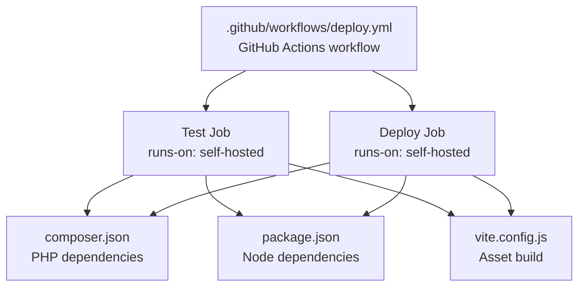
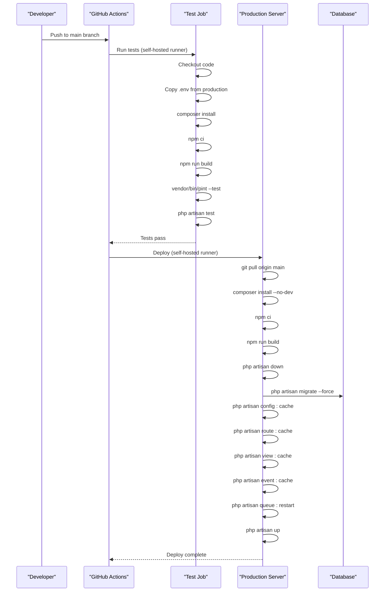
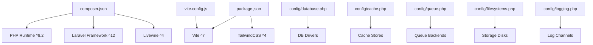

# Production Deployment

<cite>
**Referenced Files in This Document**
- [deploy.yml](file://.github/workflows/deploy.yml)
- [composer.json](file://composer.json)
- [package.json](file://package.json)
- [vite.config.js](file://vite.config.js)
- [app.php](file://config/app.php)
- [database.php](file://config/database.php)
- [cache.php](file://config/cache.php)
- [queue.php](file://config/queue.php)
- [filesystems.php](file://config/filesystems.php)
- [logging.php](file://config/logging.php)
- [app.php](file://bootstrap/app.php)
- [phpunit.xml](file://phpunit.xml)
- [workflow.md](file://conductor/workflow.md)
</cite>

## Table of Contents
1. [Introduction](#introduction)
2. [Project Structure](#project-structure)
3. [Core Components](#core-components)
4. [Architecture Overview](#architecture-overview)
5. [Detailed Component Analysis](#detailed-component-analysis)
6. [Dependency Analysis](#dependency-analysis)
7. [Performance Considerations](#performance-considerations)
8. [Troubleshooting Guide](#troubleshooting-guide)
9. [Conclusion](#conclusion)
10. [Appendices](#appendices)

## Introduction
This document provides comprehensive production deployment guidance for the PTSP system. It explains the CI/CD pipeline using GitHub Actions, covering automated testing and deployment steps. It details the end-to-end deployment workflow from code checkout to production activation, environment preparation, dependency installation, asset compilation, cache optimization, maintenance mode procedures, database migration strategies, service restart protocols, troubleshooting, and rollback procedures.

## Project Structure
The PTSP system is a Laravel application with Vite-based asset building. The deployment pipeline is defined in a GitHub Actions workflow that runs two jobs: a test job and a deploy job. Dependencies are managed via Composer and npm, with Vite used for asset compilation.

**Diagram sources**
- [deploy.yml:1-79](file://.github/workflows/deploy.yml#L1-L79)
- [composer.json:1-118](file://composer.json#L1-L118)
- [package.json:1-28](file://package.json#L1-L28)
- [vite.config.js:1-37](file://vite.config.js#L1-L37)

**Section sources**
- [deploy.yml:1-79](file://.github/workflows/deploy.yml#L1-L79)
- [composer.json:1-118](file://composer.json#L1-L118)
- [package.json:1-28](file://package.json#L1-L28)
- [vite.config.js:1-37](file://vite.config.js#L1-L37)

## Core Components
- CI/CD Pipeline: Automated testing and deployment orchestrated by GitHub Actions.
- Dependency Management: Composer for PHP packages and npm for JavaScript packages.
- Asset Compilation: Vite with Laravel Vite Plugin and TailwindCSS integration.
- Configuration Caching: Laravel configuration, route, view, and event caching for performance.
- Maintenance Mode: Controlled downtime during deployments using Laravel’s maintenance mode.
- Database Migrations: Structured schema updates applied during deployment.
- Queue Workers: Restarted after deployment to ensure background tasks continue.

**Section sources**
- [deploy.yml:12-37](file://.github/workflows/deploy.yml#L12-L37)
- [deploy.yml:38-79](file://.github/workflows/deploy.yml#L38-L79)
- [composer.json:24-34](file://composer.json#L24-L34)
- [package.json:5-8](file://package.json#L5-L8)
- [vite.config.js:8-22](file://vite.config.js#L8-L22)
- [app.php:121-124](file://config/app.php#L121-L124)

## Architecture Overview
The deployment architecture consists of a CI/CD workflow that validates changes in a test job and applies them in a production deploy job. The deploy job pulls the latest code, installs dependencies, compiles assets, enables maintenance mode, migrates the database, caches configuration, restarts queue workers, and disables maintenance mode.

**Diagram sources**
- [deploy.yml:12-37](file://.github/workflows/deploy.yml#L12-L37)
- [deploy.yml:38-79](file://.github/workflows/deploy.yml#L38-L79)

## Detailed Component Analysis

### CI/CD Pipeline: GitHub Actions
- Trigger: Push to main branch.
- Environment variable: APP_PATH defaults to a production directory path.
- Jobs:
  - Test job: Installs Composer and Node dependencies, builds assets, runs code style checks, and executes tests.
  - Deploy job: Depends on the test job, performs production deployment steps.

Key steps in the deploy job:
- Pull latest code from origin/main.
- Install Composer dependencies without development packages.
- Install Node dependencies.
- Build assets with Vite.
- Enable maintenance mode with refresh and retry intervals.
- Run database migrations.
- Clear and cache configuration, routes, views, and events.
- Restart queue workers.
- Disable maintenance mode.

**Section sources**
- [deploy.yml:3-10](file://.github/workflows/deploy.yml#L3-L10)
- [deploy.yml:12-37](file://.github/workflows/deploy.yml#L12-L37)
- [deploy.yml:38-79](file://.github/workflows/deploy.yml#L38-L79)

### Environment Preparation and Dependency Installation
- PHP runtime and extensions: The project requires PHP 8.2+.
- Composer dependencies: Installed in both test and deploy stages; production uses --no-dev for optimized installs.
- Node dependencies: Installed via npm ci for deterministic builds.
- Environment variables: The test job copies the production .env file into the repository for testing.

Recommended production environment variables (derived from configuration):
- Database: sqlite, mysql, mariadb, pgsql, or sqlsrv; defaults to sqlite unless overridden.
- Cache: database, file, redis, dynamodb, etc.; defaults to database.
- Queue: sync, database, beanstalkd, sqs, redis, etc.; defaults to database.
- Filesystems: local, public, s3; defaults to local.
- Logging: stack, single, daily, slack, syslog, stderr, etc.; defaults to stack.

**Section sources**
- [composer.json:11-23](file://composer.json#L11-L23)
- [composer.json:24-34](file://composer.json#L24-L34)
- [deploy.yml:20-21](file://.github/workflows/deploy.yml#L20-L21)
- [database.php:20](file://config/database.php#L20)
- [cache.php:18](file://config/cache.php#L18)
- [queue.php:16](file://config/queue.php#L16)
- [filesystems.php:16](file://config/filesystems.php#L16)
- [logging.php:21](file://config/logging.php#L21)

### Asset Compilation and Build Process
- Vite configuration defines input entries for CSS/JS assets and integrates TailwindCSS.
- Build script uses vite build; development script uses vite dev.
- The deploy workflow runs npm run build to compile assets for production.

Optimization tips:
- Use production builds (npm run build) in CI/CD.
- Ensure Vite output directory alignment with Laravel’s asset publishing expectations.
- Consider enabling minification and hashing in production environments.

**Section sources**
- [vite.config.js:8-22](file://vite.config.js#L8-L22)
- [package.json:5-8](file://package.json#L5-L8)
- [deploy.yml:29-30](file://.github/workflows/deploy.yml#L29-L30)

### Cache Optimization
- Configuration caching: config:cache improves application boot performance.
- Route caching: route:cache reduces routing overhead.
- View caching: view:cache precompiles templates.
- Event caching: event:cache optimizes event discovery.

These commands are executed in the deploy job to optimize performance post-deployment.

**Section sources**
- [deploy.yml:66-70](file://.github/workflows/deploy.yml#L66-L70)

### Maintenance Mode Procedures
- Enable maintenance mode: down with refresh and retry parameters to handle concurrent requests gracefully.
- Disable maintenance mode: up to restore normal operations.

Maintenance mode driver and store are configurable in application configuration.

**Section sources**
- [deploy.yml:60-61](file://.github/workflows/deploy.yml#L60-L61)
- [deploy.yml:75-76](file://.github/workflows/deploy.yml#L75-L76)
- [app.php:121-124](file://config/app.php#L121-L124)

### Database Migration Strategies
- Migrations are run with force to apply pending schema changes in production.
- The database configuration supports multiple drivers; ensure the production database matches the configured driver and credentials.

Best practices:
- Review migration order and dependencies.
- Back up the database before running migrations in production.
- Use atomic migrations where possible to minimize downtime.

**Section sources**
- [deploy.yml:63-64](file://.github/workflows/deploy.yml#L63-L64)
- [database.php:33-116](file://config/database.php#L33-L116)

### Service Restart Protocols
- Queue workers are restarted after deployment to ensure background jobs are processed with updated code.
- Ensure queue worker processes are monitored and restarted automatically if they crash.

**Section sources**
- [deploy.yml:72-73](file://.github/workflows/deploy.yml#L72-L73)
- [queue.php:32-92](file://config/queue.php#L32-L92)

### Testing Phase Details
- Code style: Pint is run in test mode to enforce style standards.
- Tests: Laravel’s test suite is executed with compact output.
- Test environment: PHPUnit configuration sets environment variables for testing, including memory database and array caches.

**Section sources**
- [deploy.yml:32-36](file://.github/workflows/deploy.yml#L32-L36)
- [phpunit.xml:20-34](file://phpunit.xml#L20-L34)

### Step-by-Step Deployment Workflow
1. Developer pushes to main branch.
2. GitHub Actions triggers the workflow.
3. Test job:
   - Checks out code.
   - Copies production .env for testing.
   - Installs Composer dependencies.
   - Installs Node dependencies.
   - Builds assets.
   - Runs Pint (style check).
   - Executes Laravel tests.
4. Deploy job (only if tests pass):
   - Pulls latest code from origin/main.
   - Installs Composer dependencies without dev packages.
   - Installs Node dependencies.
   - Builds assets.
   - Enables maintenance mode.
   - Runs database migrations.
   - Clears and caches configuration, routes, views, and events.
   - Restarts queue workers.
   - Disables maintenance mode.
   - Marks deployment complete.

**Section sources**
- [deploy.yml:12-37](file://.github/workflows/deploy.yml#L12-L37)
- [deploy.yml:38-79](file://.github/workflows/deploy.yml#L38-L79)

### Rollback Procedures
Recommended rollback steps:
- Re-run the previous successful deployment tag or commit hash.
- If database migrations were applied, roll back to the last known good migration.
- Restore backups if data corruption is suspected.
- Monitor logs and metrics post-rollback.
- Communicate status to stakeholders and document the incident.

Note: The current workflow does not include automatic rollback; implement manual rollback steps as part of your operational procedures.

**Section sources**
- [workflow.md:277-319](file://conductor/workflow.md#L277-L319)

## Dependency Analysis
The deployment relies on:
- PHP runtime and Composer-managed packages.
- Node/npm ecosystem for asset building.
- Laravel configuration for database, cache, queue, filesystems, and logging.
- Vite for asset bundling.

**Diagram sources**
- [composer.json:11-23](file://composer.json#L11-L23)
- [composer.json:24-34](file://composer.json#L24-L34)
- [package.json:9-26](file://package.json#L9-L26)
- [vite.config.js:8-22](file://vite.config.js#L8-L22)
- [database.php:33-116](file://config/database.php#L33-L116)
- [cache.php:35-102](file://config/cache.php#L35-L102)
- [queue.php:32-92](file://config/queue.php#L32-L92)
- [filesystems.php:31-80](file://config/filesystems.php#L31-L80)
- [logging.php:53-132](file://config/logging.php#L53-L132)

**Section sources**
- [composer.json:11-23](file://composer.json#L11-L23)
- [composer.json:24-34](file://composer.json#L24-L34)
- [package.json:9-26](file://package.json#L9-L26)
- [vite.config.js:8-22](file://vite.config.js#L8-L22)
- [database.php:33-116](file://config/database.php#L33-L116)
- [cache.php:35-102](file://config/cache.php#L35-L102)
- [queue.php:32-92](file://config/queue.php#L32-L92)
- [filesystems.php:31-80](file://config/filesystems.php#L31-L80)
- [logging.php:53-132](file://config/logging.php#L53-L132)

## Performance Considerations
- Use production builds for assets (npm run build).
- Enable configuration and route caching in production.
- Choose appropriate cache and queue drivers for scale (e.g., Redis).
- Monitor queue backlog and adjust worker scaling.
- Keep dependencies updated and prune unused packages regularly.

[No sources needed since this section provides general guidance]

## Troubleshooting Guide
Common deployment failures and resolutions:
- Composer install failures:
  - Ensure PHP version compatibility and network connectivity.
  - Clear Composer cache if needed.
- npm ci failures:
  - Verify Node.js version and registry accessibility.
  - Delete node_modules and reinstall if lockfile conflicts occur.
- Asset build failures:
  - Check Vite configuration and missing dependencies.
  - Ensure output directory permissions.
- Maintenance mode stuck:
  - Manually disable maintenance mode using the up command.
- Database migration errors:
  - Review migration scripts and database permissions.
  - Apply fixes and rerun migrations.
- Queue workers not processing jobs:
  - Restart workers and verify queue backend connectivity.
- Test failures:
  - Inspect test logs and environment variables.
  - Confirm database and cache configuration for testing.

**Section sources**
- [deploy.yml:23-30](file://.github/workflows/deploy.yml#L23-L30)
- [deploy.yml:60-76](file://.github/workflows/deploy.yml#L60-L76)
- [phpunit.xml:20-34](file://phpunit.xml#L20-L34)

## Conclusion
The PTSP production deployment leverages a robust GitHub Actions pipeline that validates changes in a test job and safely deploys to production. By following the documented steps—environment preparation, dependency installation, asset compilation, cache optimization, maintenance mode, migrations, and service restarts—you can achieve reliable, repeatable deployments. Incorporate monitoring, backups, and rollback procedures to further strengthen operational resilience.

[No sources needed since this section summarizes without analyzing specific files]

## Appendices

### Appendix A: Environment Variables Reference
- APP_PATH: Directory where the application is deployed (defaults to a production path).
- Database: DB_CONNECTION, DB_HOST, DB_PORT, DB_DATABASE, DB_USERNAME, DB_PASSWORD, DB_URL, DB_* (driver-specific).
- Cache: CACHE_STORE, DB_CACHE_CONNECTION, DB_CACHE_TABLE, REDIS_*.
- Queue: QUEUE_CONNECTION, DB_QUEUE_CONNECTION, DB_QUEUE_TABLE, REDIS_QUEUE_*.
- Filesystems: FILESYSTEM_DISK, AWS_*.
- Logging: LOG_CHANNEL, LOG_STACK, LOG_LEVEL, LOG_*.
- Application: APP_ENV, APP_DEBUG, APP_URL, APP_KEY, APP_MAINTENANCE_DRIVER, APP_MAINTENANCE_STORE.

**Section sources**
- [deploy.yml:8-9](file://.github/workflows/deploy.yml#L8-L9)
- [database.php:20-116](file://config/database.php#L20-L116)
- [cache.php:18, 42-48, 75-79](file://config/cache.php#L18, 42-48, 75-79)
- [queue.php:16, 38-45, 67-74](file://config/queue.php#L16, 38-45, 67-74)
- [filesystems.php:16, 31-62](file://config/filesystems.php#L16, 31-62)
- [logging.php:21, 53-132](file://config/logging.php#L21, 53-132)
- [app.php:29, 42, 55, 100, 121-124](file://config/app.php#L29, 42, 55, 100, 121-124)

### Appendix B: Deployment Checklist
- Pre-deployment:
  - All tests passing.
  - Code coverage meets requirements.
  - No linting errors.
  - Environment variables configured.
  - Database migrations ready.
  - Backups created.
- Post-deployment:
  - Verify application health endpoint.
  - Test critical paths.
  - Monitor logs and metrics.
  - Document deployment.

**Section sources**
- [workflow.md:303-325](file://conductor/workflow.md#L303-L325)