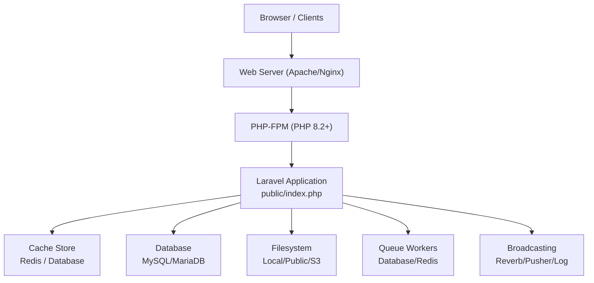
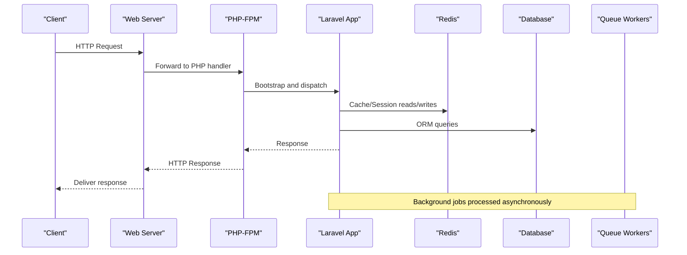
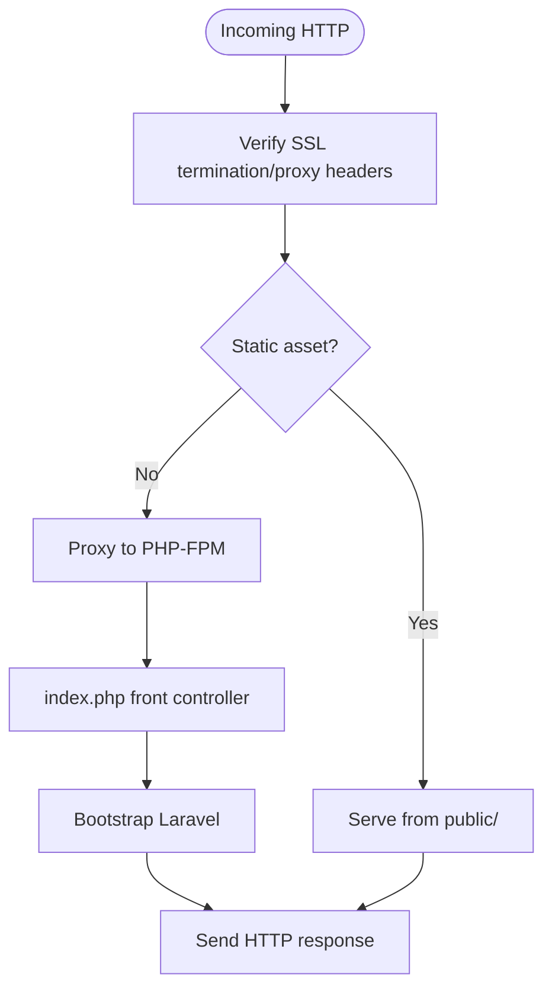
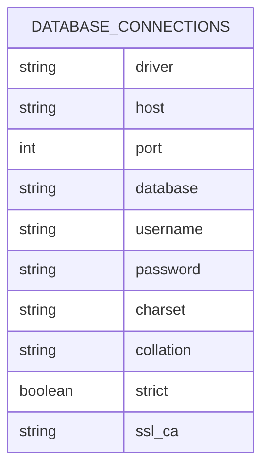
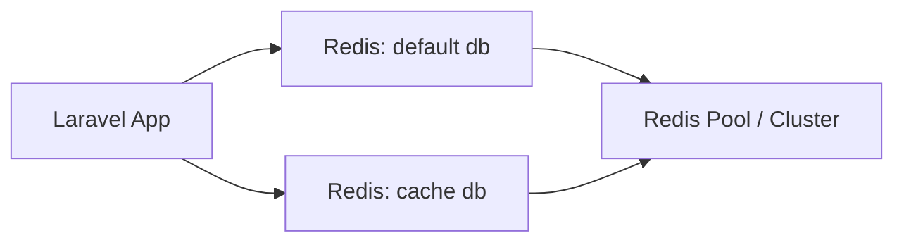
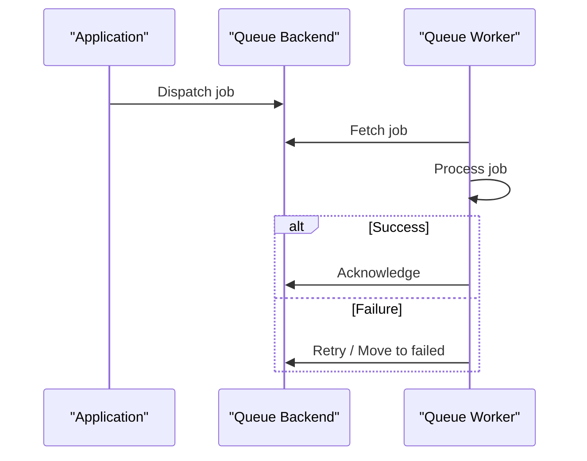
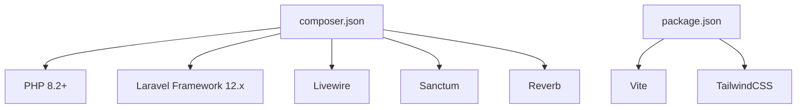

# Server Configuration

<cite>
**Referenced Files in This Document**
- [composer.json](file://composer.json)
- [public/.htaccess](file://public/.htaccess)
- [public/index.php](file://public/index.php)
- [config/app.php](file://config/app.php)
- [config/database.php](file://config/database.php)
- [config/cache.php](file://config/cache.php)
- [config/session.php](file://config/session.php)
- [config/queue.php](file://config/queue.php)
- [config/broadcasting.php](file://config/broadcasting.php)
- [config/services.php](file://config/services.php)
- [config/filesystems.php](file://config/filesystems.php)
- [vite.config.js](file://vite.config.js)
- [package.json](file://package.json)
- [.github/workflows/deploy.yml](file://.github/workflows/deploy.yml)
- [docs/superpowers/plans/2026-03-14-public-module-security-hardening.md](file://docs/superpowers/plans/2026-03-14-public-module-security-hardening.md)
</cite>

## Table of Contents
1. [Introduction](#introduction)
2. [Project Structure](#project-structure)
3. [Core Components](#core-components)
4. [Architecture Overview](#architecture-overview)
5. [Detailed Component Analysis](#detailed-component-analysis)
6. [Dependency Analysis](#dependency-analysis)
7. [Performance Considerations](#performance-considerations)
8. [Troubleshooting Guide](#troubleshooting-guide)
9. [Conclusion](#conclusion)
10. [Appendices](#appendices)

## Introduction
This document provides comprehensive server configuration guidance for the PTSP system. It covers minimum server requirements (PHP version, extensions, and system resources), web server configuration for Apache/Nginx (including SSL, proxy, and static asset serving), database configuration for MySQL/MariaDB (connection pooling and optimization), Redis configuration for caching and sessions, security hardening, firewall rules, file permissions, and performance tuning for high-traffic deployments.

## Project Structure
The PTSP system is a Laravel 12 application with Livewire UI components. The runtime entrypoint is the public/index.php front controller, which delegates to the Laravel application bootstrapping process. Static assets are built via Vite and served through the web server. Environment-driven configuration is centralized in config/*.php files.

**Diagram sources**
- [public/index.php:1-21](file://public/index.php#L1-L21)
- [config/database.php:1-185](file://config/database.php#L1-L185)
- [config/cache.php:1-118](file://config/cache.php#L1-L118)
- [config/session.php:1-218](file://config/session.php#L1-L218)
- [config/queue.php:1-130](file://config/queue.php#L1-L130)
- [config/broadcasting.php:1-83](file://config/broadcasting.php#L1-L83)
- [config/filesystems.php:1-81](file://config/filesystems.php#L1-L81)

**Section sources**
- [public/index.php:1-21](file://public/index.php#L1-L21)
- [vite.config.js:1-37](file://vite.config.js#L1-L37)

## Core Components
- PHP runtime and extensions
  - Minimum PHP version is 8.2 as declared in composer.json.
  - Required extensions for PDO MySQL/MariaDB are indicated in the database configuration.
- Web server
  - Apache rewrite rules in public/.htaccess route requests to index.php.
  - Nginx configuration is not included in the repository; refer to the Nginx section for recommended directives.
- Database
  - Supports SQLite, MySQL, MariaDB, PostgreSQL, SQL Server. MySQL/MariaDB defaults are provided.
- Cache and Sessions
  - Cache supports database, file, memcached, redis, dynamodb, octane, failover, null.
  - Sessions support file, cookie, database, memcached, redis, dynamodb, array.
- Queues
  - Supports sync, database, beanstalkd, sqs, redis, deferred, background, failover, null.
- Broadcasting
  - Supports reverb, pusher, ably, log, null.
- Filesystems
  - Local, public storage, and S3 are supported.

**Section sources**
- [composer.json:11-23](file://composer.json#L11-L23)
- [public/.htaccess:1-26](file://public/.htaccess#L1-L26)
- [config/database.php:47-85](file://config/database.php#L47-L85)
- [config/cache.php:29-32](file://config/cache.php#L29-L32)
- [config/session.php:16-18](file://config/session.php#L16-L18)
- [config/queue.php:27-29](file://config/queue.php#L27-L29)
- [config/broadcasting.php:14-15](file://config/broadcasting.php#L14-L15)
- [config/filesystems.php:27-28](file://config/filesystems.php#L27-L28)

## Architecture Overview
The application uses a traditional MVC pattern behind a front controller. Requests are routed through Apache/Nginx to PHP-FPM, which executes Laravel. Caching and sessions leverage Redis or database backends. Queues are processed by dedicated workers. Broadcasting integrates with Reverb or Pusher.

**Diagram sources**
- [public/index.php:16-21](file://public/index.php#L16-L21)
- [config/cache.php:75-79](file://config/cache.php#L75-L79)
- [config/session.php:21-21](file://config/session.php#L21-L21)
- [config/queue.php:32-92](file://config/queue.php#L32-L92)
- [config/database.php:146-182](file://config/database.php#L146-L182)

## Detailed Component Analysis

### PHP and Extensions
- PHP version requirement
  - The project requires PHP 8.2+ as per composer.json.
- PDO and MySQL/MariaDB
  - The database configuration enables PDO options for MySQL/MariaDB when the pdo_mysql extension is loaded.
- Additional PHP extensions commonly used by Laravel
  - json, xml, ctype, tokenizer, mbstring, openssl, pdo, pdo_mysql, pdo_sqlite, sqlite3, pcntl, posix, gd, imagick, zip, curl, bcmath, intl, opcache, apcu.

**Section sources**
- [composer.json:12-12](file://composer.json#L12-L12)
- [config/database.php:62-64](file://config/database.php#L62-L64)
- [config/database.php:82-84](file://config/database.php#L82-L84)

### Web Server Configuration (Apache/Nginx)
- Apache
  - Enable mod_rewrite and mod_negotiation.
  - Use public/.htaccess to redirect to index.php and normalize Authorization/X-XSRF-Token headers.
- Nginx (recommended directives)
  - Disable directory listing and indexing.
  - Proxy PHP files to PHP-FPM unix socket or TCP.
  - Serve static assets from the public directory.
  - Configure SSL with strong ciphers and TLS 1.2+.
  - Set proxy timeouts and buffer sizes appropriate for streaming and uploads.
  - Deny access to .env, storage/framework, and other sensitive directories.
- Static assets
  - Build assets with Vite and serve built files from the public directory.
  - Ensure proper MIME types for JS/CSS and fonts.

**Section sources**
- [public/.htaccess:1-26](file://public/.htaccess#L1-L26)
- [public/index.php:1-21](file://public/index.php#L1-L21)
- [vite.config.js:10-22](file://vite.config.js#L10-L22)

### Database Configuration (MySQL/MariaDB)
- Supported drivers
  - sqlite, mysql, mariadb, pgsql, sqlsrv.
- Connection parameters
  - Host, port, database, username, password, charset, collation, strict mode, SSL CA for PDO.
- SSL/TLS
  - SSL CA path can be configured via environment variable for PDO connections.
- Recommended settings
  - Use utf8mb4 charset and unicode_ci collation.
  - Enable strict mode for data integrity.
  - Tune innodb settings and connection limits based on workload.
- Connection pooling
  - Use persistent connections cautiously; prefer application-level pooling or external proxies for high concurrency.

**Diagram sources**
- [config/database.php:47-85](file://config/database.php#L47-L85)

**Section sources**
- [config/database.php:47-85](file://config/database.php#L47-L85)

### Redis Configuration (Caching and Sessions)
- Clients and clustering
  - Client type and cluster prefix are configurable.
- Connections
  - Separate default and cache connections; configure host, port, database, password, prefix.
- Retry/backoff
  - Max retries and backoff algorithm/base/cap are configurable.
- Sessions and cache
  - Use redis driver for both cache and session backends for low-latency shared state.
- Scaling
  - Consider Redis Sentinel or Redis Cluster for HA and sharding.

**Diagram sources**
- [config/database.php:146-182](file://config/database.php#L146-L182)
- [config/cache.php:75-79](file://config/cache.php#L75-L79)
- [config/session.php:21-21](file://config/session.php#L21-L21)

**Section sources**
- [config/database.php:146-182](file://config/database.php#L146-L182)
- [config/cache.php:75-79](file://config/cache.php#L75-L79)
- [config/session.php:21-21](file://config/session.php#L21-L21)

### Queues and Background Processing
- Default driver
  - database by default; redis is also supported.
- Retry and block settings
  - retry_after and block_for are configurable per driver.
- Failed jobs
  - Supported drivers include database-uuids, dynamodb, file, null.
- Deployment
  - Restart queue workers during deployments to avoid stale handlers.

**Diagram sources**
- [config/queue.php:32-92](file://config/queue.php#L32-L92)
- [.github/workflows/deploy.yml:72-73](file://.github/workflows/deploy.yml#L72-L73)

**Section sources**
- [config/queue.php:16-16](file://config/queue.php#L16-L16)
- [config/queue.php:67-74](file://config/queue.php#L67-L74)
- [config/queue.php:123-127](file://config/queue.php#L123-L127)
- [.github/workflows/deploy.yml:72-73](file://.github/workflows/deploy.yml#L72-L73)

### Broadcasting
- Default broadcaster
  - null by default; reverb or pusher are supported.
- Reverb configuration
  - TLS scheme, host, port, and useTLS derived from scheme.
- Pusher configuration
  - Cluster, host, port, scheme, and TLS usage configurable.

**Section sources**
- [config/broadcasting.php:18-18](file://config/broadcasting.php#L18-L18)
- [config/broadcasting.php:33-47](file://config/broadcasting.php#L33-L47)
- [config/broadcasting.php:49-65](file://config/broadcasting.php#L49-L65)

### Filesystem and Static Assets
- Disks
  - local (private), public, s3.
- Public storage URL
  - Derived from APP_URL and configured base URL.
- Asset pipeline
  - Vite builds assets; ensure public/ is served statically.

**Section sources**
- [config/filesystems.php:31-62](file://config/filesystems.php#L31-L62)
- [config/filesystems.php:42-48](file://config/filesystems.php#L42-L48)
- [vite.config.js:10-22](file://vite.config.js#L10-L22)

### Security Hardening and Permissions
- Rate limiting for module logins
  - Throttle middleware applied to kiosk and tv-display login routes to prevent brute force.
- Environment variables for module passwords and session security
  - KIOSK_PASSWORD, TV_DISPLAY_PASSWORD, MODULE_SESSION_LIFETIME, SESSION_ENCRYPT, SESSION_SECURE_COOKIE.
- Firewall rules
  - Allow inbound traffic on required ports (e.g., 80/443 for web, 22 for SSH, 6379 for Redis, 3306 for MySQL).
  - Restrict administrative access to trusted networks.
- File permissions
  - Set ownership to web server user; restrict write permissions to storage/ and bootstrap/cache/.
  - Ensure .env is readable only by the owner and not deployed to the web root.

**Section sources**
- [docs/superpowers/plans/2026-03-14-public-module-security-hardening.md:253-273](file://docs/superpowers/plans/2026-03-14-public-module-security-hardening.md#L253-L273)
- [docs/superpowers/plans/2026-03-14-public-module-security-hardening.md:839-848](file://docs/superpowers/plans/2026-03-14-public-module-security-hardening.md#L839-L848)

## Dependency Analysis
- Runtime dependencies
  - PHP 8.2+, Laravel Framework 12.x, Livewire, Sanctum, Reverb, and optional development tools.
- Build dependencies
  - Vite, TailwindCSS, and related tooling for asset compilation.
- Configuration dependencies
  - Environment variables drive database, cache, session, queue, broadcasting, and filesystem behavior.

**Diagram sources**
- [composer.json:11-23](file://composer.json#L11-L23)
- [package.json:9-26](file://package.json#L9-L26)

**Section sources**
- [composer.json:11-23](file://composer.json#L11-L23)
- [package.json:9-26](file://package.json#L9-L26)

## Performance Considerations
- PHP runtime
  - Enable OPcache and APCu for opcode and user caching.
  - Use PHP-FPM with dynamic process manager and tuned pm settings.
- Database
  - Use prepared statements, connection pooling, and read replicas for scale.
  - Optimize slow queries and add appropriate indexes.
- Cache
  - Prefer Redis for cache and sessions; enable key prefixes to avoid collisions.
  - Use cache tagging and TTL strategies aligned with business logic.
- Queues
  - Scale workers horizontally; use Redis queues for low latency.
  - Batch jobs where possible to reduce overhead.
- Web server
  - Enable gzip/deflate and HTTP/2.
  - Use reverse proxy (Nginx/Apache) with keep-alive and optimized timeouts.
- Assets
  - Serve built assets with far-future cache headers; use CDN for global distribution.
- Monitoring
  - Track queue backlog, cache hit rates, database query times, and response latencies.

[No sources needed since this section provides general guidance]

## Troubleshooting Guide
- Maintenance mode during deployment
  - Use down/up commands to enable/disable maintenance mode during migrations and cache warmup.
- Queue worker restart
  - Restart queue workers after deployments to ensure new code is used.
- Logging
  - Configure appropriate log channels and levels; use daily rotation for production.
- Health checks
  - Verify database connectivity, Redis availability, and filesystem write permissions.

**Section sources**
- [.github/workflows/deploy.yml:60-77](file://.github/workflows/deploy.yml#L60-L77)
- [config/logging.php:53-131](file://config/logging.php#L53-L131)

## Conclusion
The PTSP system is designed for modern PHP environments with Laravel 12 and Livewire. Proper server configuration involves meeting the PHP 8.2+ requirement, configuring Apache/Nginx with SSL and static asset handling, selecting robust database and Redis backends, applying security hardening, and tuning performance for high-traffic scenarios. Use the provided configuration references and operational practices to deploy reliably and scale effectively.

[No sources needed since this section summarizes without analyzing specific files]

## Appendices

### Appendix A: Minimum Server Requirements
- PHP: 8.2+
- Extensions: pdo, pdo_mysql, openssl, tokenizer, mbstring, xml, ctype, json, zip, curl, bcmath, gd, imagick, intl, pcntl, posix
- Web server: Apache 2.4+ or Nginx 1.21+ with PHP-FPM
- Database: MySQL 8+/MariaDB 10.5+ or PostgreSQL 13+
- Redis: 6+ (for cache/session/queue)
- OS: Linux distributions with kernel 5.4+ recommended

**Section sources**
- [composer.json:12-12](file://composer.json#L12-L12)
- [config/database.php:62-64](file://config/database.php#L62-L64)
- [config/database.php:82-84](file://config/database.php#L82-L84)

### Appendix B: Environment Variables Reference
- Database
  - DB_CONNECTION, DB_HOST, DB_PORT, DB_DATABASE, DB_USERNAME, DB_PASSWORD, DB_URL, DB_CHARSET, DB_COLLATION, MYSQL_ATTR_SSL_CA
- Cache
  - CACHE_STORE, CACHE_PREFIX, REDIS_CACHE_CONNECTION, REDIS_CACHE_LOCK_CONNECTION
- Session
  - SESSION_DRIVER, SESSION_LIFETIME, SESSION_CONNECTION, SESSION_TABLE, SESSION_STORE, SESSION_SECURE_COOKIE, SESSION_HTTP_ONLY, SESSION_SAME_SITE
- Queue
  - QUEUE_CONNECTION, DB_QUEUE_CONNECTION, DB_QUEUE_TABLE, DB_QUEUE, DB_QUEUE_RETRY_AFTER, REDIS_QUEUE_CONNECTION, REDIS_QUEUE, REDIS_QUEUE_RETRY_AFTER
- Redis
  - REDIS_CLIENT, REDIS_CLUSTER, REDIS_PREFIX, REDIS_HOST, REDIS_PORT, REDIS_DB, REDIS_CACHE_DB, REDIS_USERNAME, REDIS_PASSWORD, REDIS_MAX_RETRIES, REDIS_BACKOFF_ALGORITHM, REDIS_BACKOFF_BASE, REDIS_BACKOFF_CAP
- Broadcasting
  - BROADCAST_CONNECTION, REVERB_APP_KEY, REVERB_APP_SECRET, REVERB_APP_ID, REVERB_HOST, REVERB_PORT, REVERB_SCHEME, PUSHER_APP_KEY, PUSHER_APP_SECRET, PUSHER_APP_CLUSTER, PUSHER_HOST, PUSHER_PORT, PUSHER_SCHEME
- Filesystem
  - FILESYSTEM_DISK, AWS_ACCESS_KEY_ID, AWS_SECRET_ACCESS_KEY, AWS_DEFAULT_REGION, AWS_BUCKET, AWS_URL, AWS_ENDPOINT, AWS_USE_PATH_STYLE_ENDPOINT
- Services
  - MINIMAX_API_KEY, MINIMAX_VOICE_ID, MINIMAX_MODEL, MINIMAX_STRATEGY, MINIMAX_LANGUAGE_BOOST, MINIMAX_SPEED, MINIMAX_VOL, MINIMAX_PITCH, MINIMAX_ASYNC_POLL_ATTEMPTS, MINIMAX_ASYNC_POLL_INTERVAL_MS, MINIMAX_CACHE_DISK, MINIMAX_CACHE_PREFIX
- Security
  - KIOSK_PASSWORD, TV_DISPLAY_PASSWORD, MODULE_SESSION_LIFETIME, SESSION_ENCRYPT, SESSION_SECURE_COOKIE

**Section sources**
- [config/database.php:20-20](file://config/database.php#L20-L20)
- [config/database.php:47-85](file://config/database.php#L47-L85)
- [config/cache.php:18-18](file://config/cache.php#L18-L18)
- [config/cache.php:115-115](file://config/cache.php#L115-L115)
- [config/session.php:21-21](file://config/session.php#L21-L21)
- [config/session.php:35-35](file://config/session.php#L35-L35)
- [config/session.php:76-76](file://config/session.php#L76-L76)
- [config/session.php:104-104](file://config/session.php#L104-L104)
- [config/session.php:172-172](file://config/session.php#L172-L172)
- [config/queue.php:16-16](file://config/queue.php#L16-L16)
- [config/queue.php:40-44](file://config/queue.php#L40-L44)
- [config/queue.php:67-74](file://config/queue.php#L67-L74)
- [config/database.php:146-182](file://config/database.php#L146-L182)
- [config/broadcasting.php:18-18](file://config/broadcasting.php#L18-L18)
- [config/broadcasting.php:35-47](file://config/broadcasting.php#L35-L47)
- [config/broadcasting.php:51-65](file://config/broadcasting.php#L51-L65)
- [config/filesystems.php:16-16](file://config/filesystems.php#L16-L16)
- [config/filesystems.php:50-61](file://config/filesystems.php#L50-L61)
- [config/services.php:45-58](file://config/services.php#L45-L58)
- [docs/superpowers/plans/2026-03-14-public-module-security-hardening.md:839-848](file://docs/superpowers/plans/2026-03-14-public-module-security-hardening.md#L839-L848)