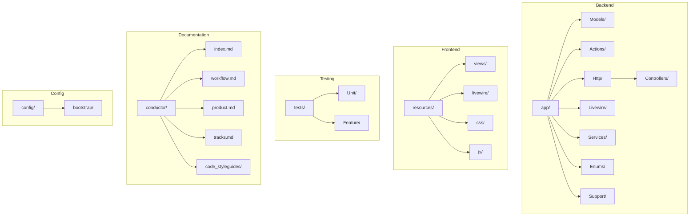
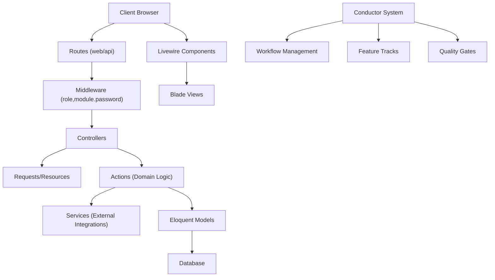
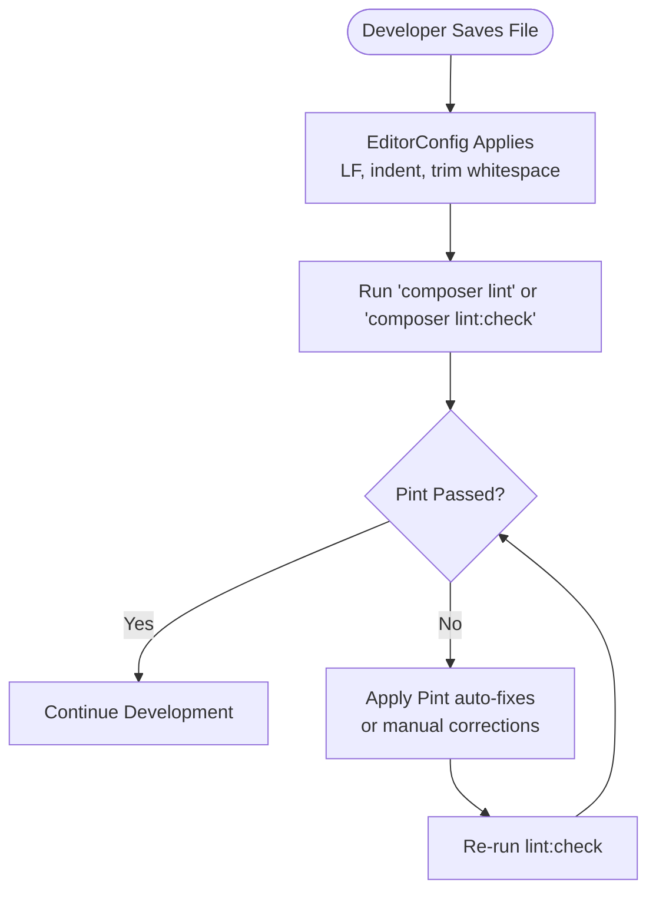
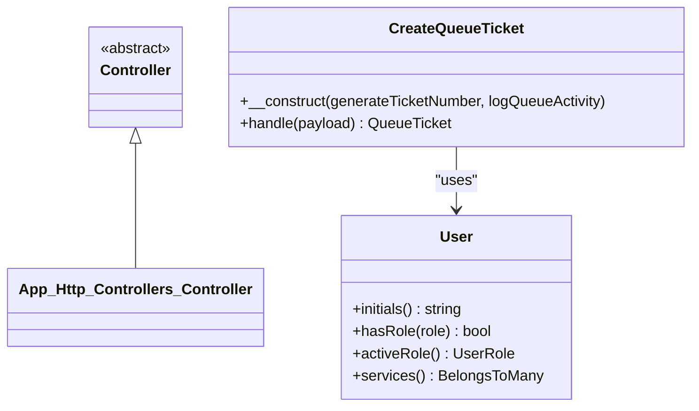
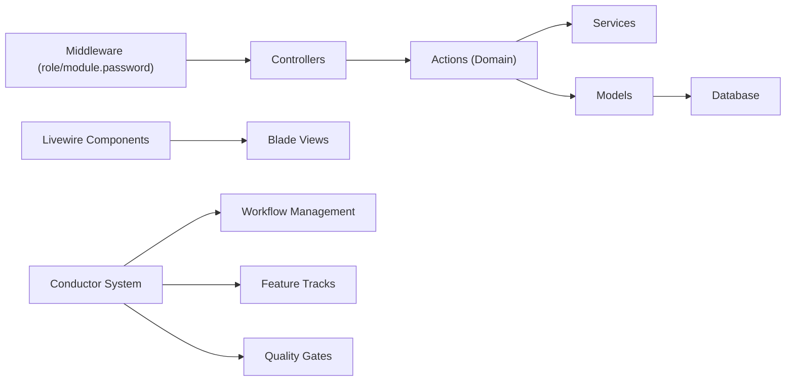
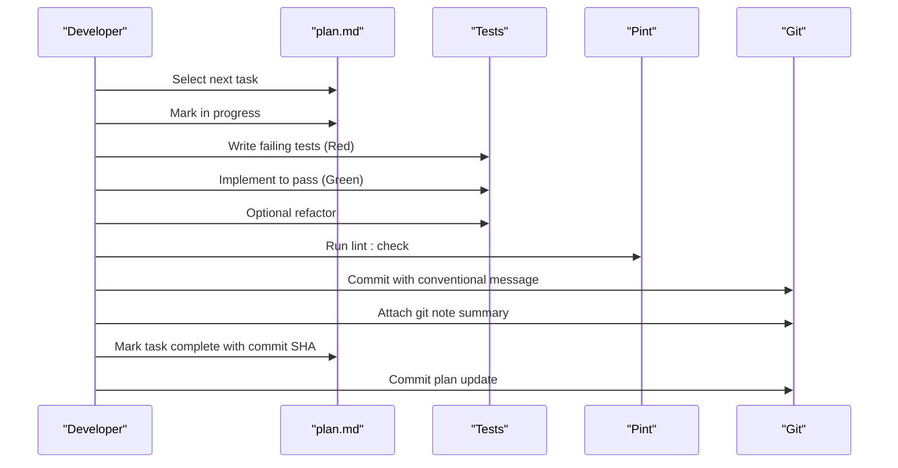
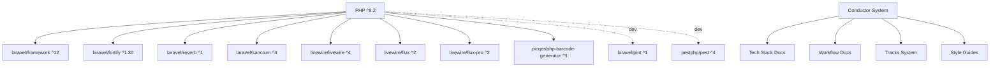

# Development Guidelines

<cite>
**Referenced Files in This Document**
- [pint.json](file://pint.json)
- [composer.json](file://composer.json)
- [package.json](file://package.json)
- [phpunit.xml](file://phpunit.xml)
- [conductor/index.md](file://conductor/index.md)
- [conductor/product.md](file://conductor/product.md)
- [conductor/workflow.md](file://conductor/workflow.md)
- [conductor/tech-stack.md](file://conductor/tech-stack.md)
- [conductor/product-guidelines.md](file://conductor/product-guidelines.md)
- [conductor/tracks.md](file://conductor/tracks.md)
- [conductor/code_styleguides/general.md](file://conductor/code_styleguides/general.md)
- [conductor/code_styleguides/html-css.md](file://conductor/code_styleguides/html-css.md)
- [conductor/code_styleguides/javascript.md](file://conductor/code_styleguides/javascript.md)
- [conductor/tracks/ui_ux_overhaul_20260307/plan.md](file://conductor/tracks/ui_ux_overhaul_20260307/plan.md)
- [conductor/tracks/ui_ux_overhaul_20260307/spec.md](file://conductor/tracks/ui_ux_overhaul_20260307/spec.md)
- [conductor/tracks/feature_notifikasi_pesan_20260307/spec.md](file://conductor/tracks/feature_notifikasi_pesan_20260307/spec.md)
- [conductor/tracks/feature_survey_ikm_20260307/spec.md](file://conductor/tracks/feature_survey_ikm_20260307/spec.md)
- [bootstrap/app.php](file://bootstrap/app.php)
- [config/fortify.php](file://config/fortify.php)
- [app/Http/Controllers/Controller.php](file://app/Http/Controllers/Controller.php)
- [app/Models/User.php](file://app/Models/User.php)
- [app/Actions/Queue/CreateQueueTicket.php](file://app/Actions/Queue/CreateQueueTicket.php)
- [.editorconfig](file://.editorconfig)
</cite>

## Update Summary
**Changes Made**
- Enhanced conductor documentation system established as central hub for development guidelines
- Added comprehensive Product Definition and Product Guidelines documentation
- Integrated Workflow processes with detailed task lifecycle and quality gates
- Implemented Management tracking system with tracks registry and individual feature tracks
- Expanded code style guides with specialized documentation for different technologies
- Added technical stack documentation and setup state tracking

## Table of Contents
1. [Introduction](#introduction)
2. [Conductor Documentation System](#conductor-documentation-system)
3. [Product Definition and Guidelines](#product-definition-and-guidelines)
4. [Project Structure](#project-structure)
5. [Core Components](#core-components)
6. [Architecture Overview](#architecture-overview)
7. [Detailed Component Analysis](#detailed-component-analysis)
8. [Dependency Analysis](#dependency-analysis)
9. [Performance Considerations](#performance-considerations)
10. [Troubleshooting Guide](#troubleshooting-guide)
11. [Conclusion](#conclusion)
12. [Appendices](#appendices)

## Introduction
This document provides comprehensive development guidelines for the PTSP system, centered around an enhanced conductor documentation system that serves as the central hub for all development processes. The system consolidates code style standards, naming conventions, file organization patterns, architectural principles, contribution and review processes, documentation and commit conventions, testing and quality gates, and guidance for extending the system while maintaining backward compatibility.

**Updated** Enhanced conductor documentation system now provides centralized management of all development processes, including product definition, workflow management, and feature tracking.

## Conductor Documentation System
The PTSP system now features a comprehensive conductor documentation system that serves as the central hub for all development guidelines and processes. This system establishes a structured approach to project management, quality assurance, and team collaboration.

### Central Documentation Hub
The conductor system organizes development knowledge into three primary domains:

```mermaid
graph TB
subgraph "Conductor Documentation System"
INDEX["index.md"]
PRODUCT["product.md"]
WORKFLOW["workflow.md"]
TECH["tech-stack.md"]
GUIDELINES["product-guidelines.md"]
TRACKS["tracks.md"]
STYLE["code_styleguides/"]
END
INDEX --> PRODUCT
INDEX --> WORKFLOW
INDEX --> TECH
INDEX --> GUIDELINES
INDEX --> TRACKS
INDEX --> STYLE
STYLE --> GENERAL["general.md"]
STYLE --> HTMLCSS["html-css.md"]
STYLE --> JAVASCRIPT["javascript.md"]
```

**Diagram sources**
- [conductor/index.md:1-14](file://conductor/index.md#L1-L14)
- [conductor/product.md:1-16](file://conductor/product.md#L1-L16)
- [conductor/workflow.md:1-334](file://conductor/workflow.md#L1-L334)
- [conductor/tech-stack.md:1-15](file://conductor/tech-stack.md#L1-L15)
- [conductor/product-guidelines.md:1-13](file://conductor/product-guidelines.md#L1-L13)
- [conductor/tracks.md:1-14](file://conductor/tracks.md#L1-L14)

**Section sources**
- [conductor/index.md:1-14](file://conductor/index.md#L1-L14)
- [conductor/product.md:1-16](file://conductor/product.md#L1-L16)
- [conductor/workflow.md:1-334](file://conductor/workflow.md#L1-L334)
- [conductor/tech-stack.md:1-15](file://conductor/tech-stack.md#L1-L15)
- [conductor/product-guidelines.md:1-13](file://conductor/product-guidelines.md#L1-L13)
- [conductor/tracks.md:1-14](file://conductor/tracks.md#L1-L14)

## Product Definition and Guidelines
The product definition establishes the foundational understanding of the PTSP system's purpose, target users, and core value propositions, while product guidelines ensure consistent user experience across all interfaces.

### Product Definition
The PTSP (Antrian PTSP) system is designed as a comprehensive queue management solution that handles citizen queuing, officer call management, information display systems, and service performance reporting. The system targets three primary user groups:

- **Public Citizens**: General citizens seeking to obtain queue numbers either online or offline
- **Frontdesk Officers**: Desk officers who serve and call queue numbers
- **Management/Admin**: Management monitoring overall queue performance and reports

**Core Value**: The system aims to significantly reduce physical crowding and waiting time in PTSP waiting rooms through digital queue processing integration.

**Future Scope**: 
- **Message Notification**: WhatsApp or SMS integration for automatic queue call notifications
- **Community Satisfaction Survey (IKM)**: Integrated Community Satisfaction Index (IKM) survey system

### Product Guidelines
The product guidelines establish consistent standards for user experience and interface design:

#### Tone & Style
- **Language Style**: Casual and friendly communication that maintains professionalism while creating a modern, approachable user experience
- **Microcopy**: Instructions, error messages, and notifications should be easily understandable, avoiding technical jargon that confuses citizens

#### UI/UX Principles
- **Flux UI Pro Consistency**: Strict use of Flux UI components throughout the application to maintain visual and functional consistency
- **High Accessibility**: Prioritizing good color contrast and readable text sizes suitable for all age demographics
- **Minimalist Design**: Clean, simple interface with ample whitespace focusing user attention on primary actions

#### Component Development
- **Strict Flux UI Usage**: Prioritize built-in Flux UI Pro components (`<flux:...>`) over custom Tailwind classes
- **Layout Exceptions**: Only use custom Tailwind classes when necessary for advanced layout scenarios not covered by Flux

**Section sources**
- [conductor/product.md:1-16](file://conductor/product.md#L1-L16)
- [conductor/product-guidelines.md:1-13](file://conductor/product-guidelines.md#L1-L13)

## Project Structure
The PTSP system follows a Laravel 12 application layout with a clear separation of concerns, enhanced by the conductor documentation system that provides centralized management and tracking capabilities:

- **Backend**: Laravel application under app/, controllers under app/Http/Controllers, models under app/Models, actions under app/Actions, Livewire components under app/Livewire, services under app/Services, enums under app/Enums, and supporting classes under app/Support
- **Frontend**: Livewire 4 with Flux UI Pro 2 and Tailwind CSS 4, with Vite-based asset pipeline
- **Testing**: PestPHP-based test suites under tests/, with both Unit and Feature categories
- **Configuration**: Laravel configuration under config/, Composer scripts for setup and linting, and PHPUnit configuration for test execution and coverage
- **Documentation**: Comprehensive conductor system under conductor/ with product definition, workflow, tracks, and style guides



**Diagram sources**
- [composer.json:41-52](file://composer.json#L41-L52)
- [bootstrap/app.php:9-32](file://bootstrap/app.php#L9-L32)
- [config/fortify.php:1-158](file://config/fortify.php#L1-L158)
- [conductor/index.md:1-14](file://conductor/index.md#L1-L14)

**Section sources**
- [composer.json:41-52](file://composer.json#L41-L52)
- [bootstrap/app.php:9-32](file://bootstrap/app.php#L9-L32)
- [config/fortify.php:1-158](file://config/fortify.php#L1-L158)
- [conductor/index.md:1-14](file://conductor/index.md#L1-L14)

## Core Components
The enhanced conductor system provides comprehensive infrastructure for managing the PTSP development process:

- **Code style enforcement** uses Laravel Pint with the laravel preset. The project includes a dedicated lint script and a lint:check script for CI
- **EditorConfig** enforces consistent line endings, indentation, and whitespace trimming across files
- **Laravel configuration** sets timezone, locale, and maintenance mode drivers
- **Authentication** is provided by Laravel Fortify with registration, password reset, email verification, and two-factor authentication enabled
- **Conductor system** provides centralized documentation, workflow management, and feature tracking
- **Technical stack** documentation ensures deliberate technology choices and implementation planning

**Section sources**
- [pint.json:1-4](file://pint.json#L1-L4)
- [composer.json:66-71](file://composer.json#L66-L71)
- [.editorconfig:1-19](file://.editorconfig#L1-L19)
- [config/app.php:67-124](file://config/app.php#L67-L124)
- [config/fortify.php:146-155](file://config/fortify.php#L146-L155)
- [conductor/tech-stack.md:1-15](file://conductor/tech-stack.md#L1-L15)

## Architecture Overview
The system architecture centers around a comprehensive conductor-driven development approach that integrates MVC-like HTTP layer with enhanced workflow management and feature tracking:

- MVC-like HTTP layer with controllers and requests/resources
- Domain actions encapsulating business logic (e.g., queue ticket creation)
- Eloquent models with typed enums and relationships
- Livewire components for reactive frontend experiences
- Middleware for role-based access and module password checks
- Services abstraction for external integrations (e.g., TTS)
- Conductor system managing workflow, quality gates, and feature development



**Diagram sources**
- [bootstrap/app.php:17-28](file://bootstrap/app.php#L17-L28)
- [app/Http/Controllers/Controller.php:1-9](file://app/Http/Controllers/Controller.php#L1-L9)
- [app/Actions/Queue/CreateQueueTicket.php:1-91](file://app/Actions/Queue/CreateQueueTicket.php#L1-L91)
- [app/Models/User.php:1-99](file://app/Models/User.php#L1-L99)
- [conductor/workflow.md:137-150](file://conductor/workflow.md#L137-L150)

**Section sources**
- [bootstrap/app.php:17-28](file://bootstrap/app.php#L17-L28)
- [app/Actions/Queue/CreateQueueTicket.php:13-18](file://app/Actions/Queue/CreateQueueTicket.php#L13-L18)
- [app/Models/User.php:14-17](file://app/Models/User.php#L14-L17)
- [conductor/workflow.md:137-150](file://conductor/workflow.md#L137-L150)

## Detailed Component Analysis

### Code Style Standards and Formatting
The conductor system provides comprehensive code style guidance through specialized documentation:

- **PHP formatting**: Laravel Pint with the laravel preset is configured and integrated via Composer scripts for parallel linting and check-only mode for CI
- **EditorConfig** settings enforce UTF-8, LF line endings, 4-space indentation for most files, trimming trailing whitespace, and special handling for Markdown and YAML
- **JavaScript and CSS style guidance** is derived from the Google style guides summarized in the project's code style guides, covering formatting, naming, and best practices
- **General principles** emphasize readability, consistency, simplicity, maintainability, and documentation



**Diagram sources**
- [.editorconfig:3-19](file://.editorconfig#L3-L19)
- [pint.json:1-4](file://pint.json#L1-L4)
- [composer.json:66-71](file://composer.json#L66-L71)

**Section sources**
- [pint.json:1-4](file://pint.json#L1-L4)
- [composer.json:66-71](file://composer.json#L66-L71)
- [.editorconfig:1-19](file://.editorconfig#L1-L19)
- [conductor/code_styleguides/general.md:1-24](file://conductor/code_styleguides/general.md#L1-L24)
- [conductor/code_styleguides/html-css.md:1-50](file://conductor/code_styleguides/html-css.md#L1-L50)
- [conductor/code_styleguides/javascript.md:1-52](file://conductor/code_styleguides/javascript.md#L1-L52)

### Naming Conventions and File Organization
The conductor system enhances file organization through structured documentation and workflow management:

- **PHP namespaces and PSR-4 autoloading** are defined in Composer configuration, mapping app/, database/factories/, database/seeders/, and tests/
- **Controllers** follow Laravel conventions and extend a base controller class
- **Actions** encapsulate domain-specific operations (e.g., CreateQueueTicket)
- **Models** use Eloquent with typed enum casts and relationships
- **Middleware aliases** are registered in the bootstrap application configuration
- **Track organization** provides structured feature development with specifications and implementation plans



**Diagram sources**
- [app/Http/Controllers/Controller.php:1-9](file://app/Http/Controllers/Controller.php#L1-L9)
- [app/Actions/Queue/CreateQueueTicket.php:13-18](file://app/Actions/Queue/CreateQueueTicket.php#L13-L18)
- [app/Models/User.php:14-17](file://app/Models/User.php#L14-L17)

**Section sources**
- [composer.json:41-52](file://composer.json#L41-L52)
- [app/Http/Controllers/Controller.php:1-9](file://app/Http/Controllers/Controller.php#L1-L9)
- [app/Actions/Queue/CreateQueueTicket.php:13-18](file://app/Actions/Queue/CreateQueueTicket.php#L13-L18)
- [app/Models/User.php:14-17](file://app/Models/User.php#L14-L17)
- [bootstrap/app.php:20-23](file://bootstrap/app.php#L20-L23)

### Architectural Principles
The conductor system establishes comprehensive architectural principles through structured workflow management:

- **Layered architecture**: HTTP layer (controllers, requests), domain actions, persistence (models), and services
- **Middleware-driven access control** with role and module password checks
- **Enumerations for domain constants** (e.g., user roles, queue statuses)
- **Livewire components** for interactive UI with Blade templates
- **Track-based feature development** with structured phases and checkpoints
- **Quality gates** ensuring comprehensive testing, coverage, and documentation



**Diagram sources**
- [bootstrap/app.php:17-28](file://bootstrap/app.php#L17-L28)
- [app/Actions/Queue/CreateQueueTicket.php:13-18](file://app/Actions/Queue/CreateQueueTicket.php#L13-L18)
- [app/Models/User.php:14-17](file://app/Models/User.php#L14-L17)
- [conductor/workflow.md:137-150](file://conductor/workflow.md#L137-L150)

**Section sources**
- [bootstrap/app.php:17-28](file://bootstrap/app.php#L17-L28)
- [app/Models/User.php:52-55](file://app/Models/User.php#L52-L55)
- [conductor/workflow.md:137-150](file://conductor/workflow.md#L137-L150)

### Contribution Guidelines, Code Review, and Workflow
The conductor system provides a comprehensive workflow management framework that governs all development activities:

#### Guiding Principles
1. **The Plan is the Source of Truth**: All work must be tracked in `plan.md`
2. **The Tech Stack is Deliberate**: Changes to the tech stack must be documented in `tech-stack.md` before implementation
3. **Test-Driven Development**: Write unit tests before implementing functionality
4. **High Code Coverage**: Aim for >80% code coverage for all modules
5. **User Experience First**: Every decision should prioritize user experience
6. **Non-Interactive & CI-Aware**: Prefer non-interactive commands. Use `CI=true` for watch-mode tools to ensure single execution

#### Task Workflow Lifecycle
All tasks follow a strict lifecycle with comprehensive quality gates and documentation requirements:



**Diagram sources**
- [conductor/workflow.md:16-68](file://conductor/workflow.md#L16-L68)
- [composer.json:66-71](file://composer.json#L66-L71)

#### Quality Gates
Before marking any task complete, verify:
- [ ] All tests pass
- [ ] Code coverage meets requirements (>80%)
- [ ] Code follows project's code style guidelines
- [ ] All public functions/methods are documented
- [ ] Type safety is enforced
- [ ] No linting or static analysis errors
- [ ] Works correctly on mobile (if applicable)
- [ ] Documentation updated if needed
- [ ] No security vulnerabilities introduced

**Section sources**
- [conductor/workflow.md:1-334](file://conductor/workflow.md#L1-L334)
- [composer.json:66-71](file://composer.json#L66-L71)

### Documentation Standards, Commit Messages, and Version Control Practices
The conductor system establishes comprehensive documentation and version control practices:

#### Documentation Standards
- **Product guidelines** emphasize clarity, consistency, and user-centric microcopy
- **UI/UX principles** prioritize Flux UI Pro consistency, accessibility, and minimalism
- **Conductor documentation** provides structured knowledge management with centralized access

#### Commit Message Conventions
Commit messages follow a conventional format with type, scope, and description:
- `feat(scope): description` - New feature
- `fix(scope): description` - Bug fix  
- `docs(scope): description` - Documentation only
- `style(scope): description` - Formatting changes
- `refactor(scope): description` - Code changes without bug fixes
- `test(scope): description` - Adding missing tests
- `chore(scope): description` - Maintenance tasks

#### Version Control Practices
- **Git notes** for task summaries and verification reports
- **Plan updates** with completion hashes for auditability
- **Checkpoint commits** for phase completion verification

**Section sources**
- [conductor/product-guidelines.md:1-13](file://conductor/product-guidelines.md#L1-L13)
- [conductor/workflow.md:235-261](file://conductor/workflow.md#L235-L261)

### Testing Requirements, Coverage Expectations, and Quality Gates
The conductor system establishes comprehensive testing and quality assurance protocols:

#### Testing Framework
- **Testing framework** is PestPHP with separate Unit and Feature suites
- **PHPUnit configuration** sets environment variables for testing, including SQLite in-memory database and reduced bcrypt cost for faster runs

#### Quality Gates
- **Coverage requirements** exceed 80% code coverage for new code
- **Comprehensive testing** includes unit, integration, and mobile testing
- **Automated verification** with manual verification protocols for phase completion


**Diagram sources**
- [composer.json:76-80](file://composer.json#L76-L80)
- [phpunit.xml:15-34](file://phpunit.xml#L15-L34)
- [conductor/workflow.md:137-150](file://conductor/workflow.md#L137-L150)

**Section sources**
- [composer.json:76-80](file://composer.json#L76-L80)
- [phpunit.xml:15-34](file://phpunit.xml#L15-L34)
- [conductor/workflow.md:137-150](file://conductor/workflow.md#L137-L150)

### Management Tracking System
The conductor system implements a comprehensive management tracking system for feature development and project oversight:

#### Tracks Registry
The system manages three primary feature tracks with detailed specifications and implementation plans:

- **UI/UX Overhaul**: Integration of Flux UI Pro on all core domain pages
- **Message Notification**: WhatsApp/SMS integration for queue call notifications  
- **Community Satisfaction Survey (IKM)**: Integrated satisfaction rating system

#### Track Structure
Each track follows a standardized structure with:
- **Specification documents** defining objectives, scope, and technical constraints
- **Implementation plans** with phased development and checkpoint markers
- **Metadata** tracking creation dates, status, and descriptions

**Section sources**
- [conductor/tracks.md:1-14](file://conductor/tracks.md#L1-L14)
- [conductor/tracks/ui_ux_overhaul_20260307/plan.md:1-23](file://conductor/tracks/ui_ux_overhaul_20260307/plan.md#L1-L23)
- [conductor/tracks/ui_ux_overhaul_20260307/spec.md:1-17](file://conductor/tracks/ui_ux_overhaul_20260307/spec.md#L1-L17)
- [conductor/tracks/feature_notifikasi_pesan_20260307/spec.md:1-15](file://conductor/tracks/feature_notifikasi_pesan_20260307/spec.md#L1-L15)
- [conductor/tracks/feature_survey_ikm_20260307/spec.md:1-15](file://conductor/tracks/feature_survey_ikm_20260307/spec.md#L1-L15)

### Extending the System, Adding Features, and Backward Compatibility
The conductor system provides structured guidelines for system extension and feature development:

- **Use domain actions** for new business logic to keep controllers thin and reusable
- **Introduce new models** with typed enum casts and appropriate relationships
- **Add Livewire components** for interactive UI and Blade templates for rendering
- **Follow track-based development** for major feature implementations
- **Maintain backward compatibility** by avoiding breaking changes to public APIs
- **Ensure migrations** handle schema evolution gracefully

**Section sources**
- [app/Actions/Queue/CreateQueueTicket.php:13-18](file://app/Actions/Queue/CreateQueueTicket.php#L13-L18)
- [app/Models/User.php:48-55](file://app/Models/User.php#L48-L55)

## Dependency Analysis
The project's runtime and development dependencies are declared in Composer and NPM, with the conductor system providing comprehensive documentation and management infrastructure:



**Diagram sources**
- [composer.json:11-34](file://composer.json#L11-L34)
- [package.json:9-26](file://package.json#L9-L26)
- [conductor/tech-stack.md:1-15](file://conductor/tech-stack.md#L1-L15)

**Section sources**
- [composer.json:11-34](file://composer.json#L11-L34)
- [package.json:9-26](file://package.json#L9-L26)
- [conductor/tech-stack.md:1-15](file://conductor/tech-stack.md#L1-L15)

## Performance Considerations
The conductor system emphasizes performance optimization through structured development practices:

- **Database indexing** appropriately (as seen in migrations) to optimize query performance
- **Eager loading** relationships to avoid N+1 query problems
- **Caching strategies** for frequently accessed configuration and counters
- **Lightweight middleware** and selective global middleware registration
- **Mobile-first development** with Flux UI Pro ensuring optimal performance across devices

## Troubleshooting Guide
The conductor system provides comprehensive troubleshooting guidance through structured documentation and workflow management:

- **Conductor system issues**: Ensure the conductor documentation is properly organized and accessible
- **Workflow conflicts**: Verify that all work is tracked in plan.md and follows the established task lifecycle
- **Quality gate failures**: Check that all quality gates are met before marking tasks complete
- **Documentation gaps**: Ensure all changes are reflected in the appropriate conductor documentation files

**Section sources**
- [conductor/workflow.md:137-150](file://conductor/workflow.md#L137-L150)
- [conductor/index.md:1-14](file://conductor/index.md#L1-L14)

## Conclusion
The enhanced conductor documentation system transforms the PTSP development process by establishing a comprehensive, centralized hub for all development guidelines, workflow management, and feature tracking. This system ensures consistent code quality, maintainable architecture, and efficient collaboration while providing structured approaches to product definition, quality assurance, and continuous improvement.

The conductor system's integration of product definition, workflow management, tracks registry, and style guides creates a unified development environment that supports both individual contributors and team collaboration. By following the established patterns and quality gates, developers can contribute effectively to the PTSP system while maintaining architectural integrity and user experience standards.

## Appendices
- **Conductor System Resources**:
  - Centralized documentation hub with product definition, workflow, and management tracking
  - Comprehensive code style guides for general, HTML/CSS, and JavaScript practices
  - Structured workflow management with quality gates and verification protocols
  - Feature tracking system with detailed specifications and implementation plans
  - Technical stack documentation ensuring deliberate technology choices

**Section sources**
- [conductor/index.md:1-14](file://conductor/index.md#L1-L14)
- [conductor/tech-stack.md:1-15](file://conductor/tech-stack.md#L1-L15)
- [conductor/product-guidelines.md:1-13](file://conductor/product-guidelines.md#L1-L13)
- [conductor/code_styleguides/general.md:1-24](file://conductor/code_styleguides/general.md#L1-L24)
- [conductor/code_styleguides/html-css.md:1-50](file://conductor/code_styleguides/html-css.md#L1-L50)
- [conductor/code_styleguides/javascript.md:1-52](file://conductor/code_styleguides/javascript.md#L1-L52)
- [conductor/tracks.md:1-14](file://conductor/tracks.md#L1-L14)