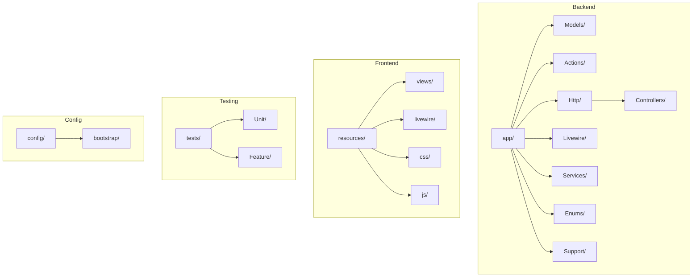
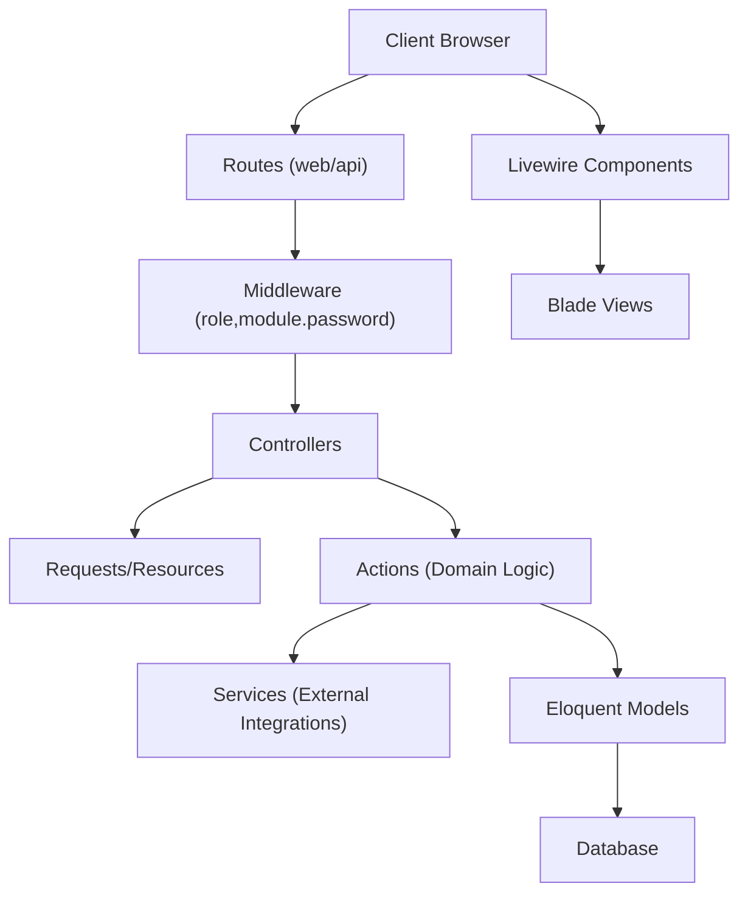
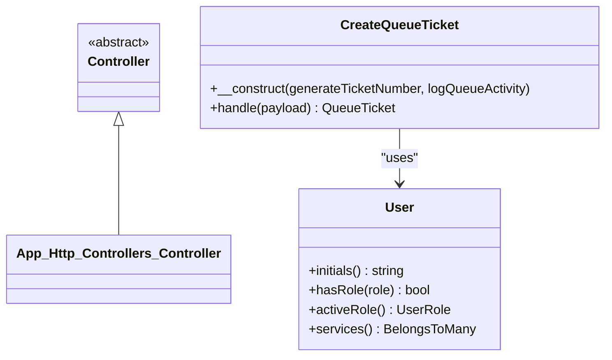
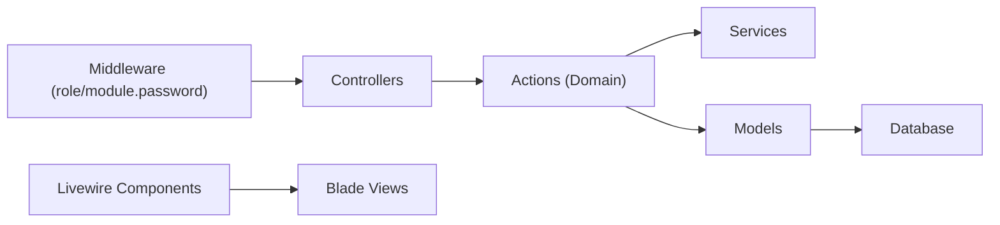
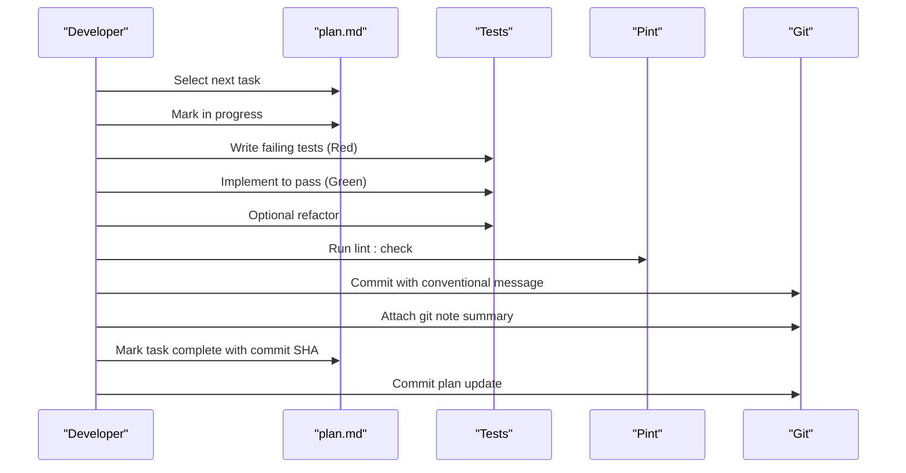
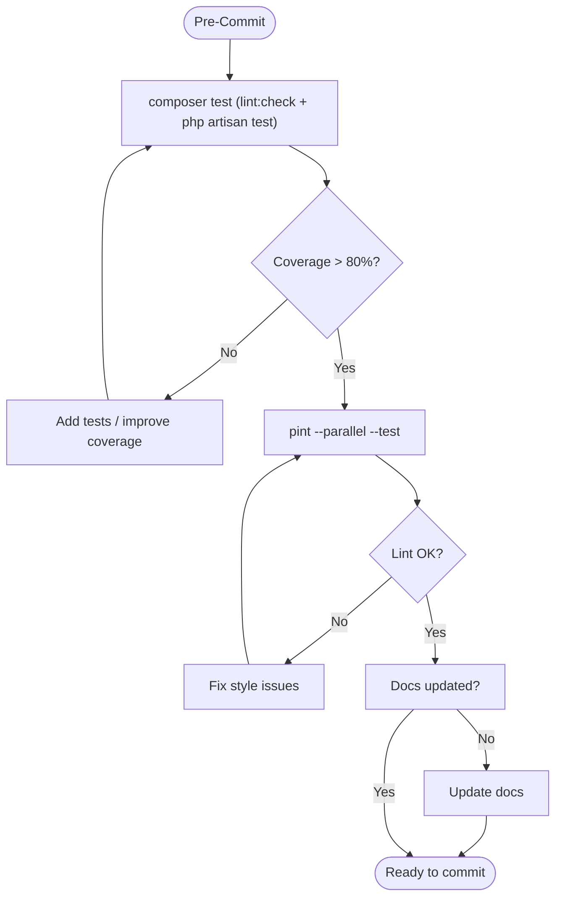
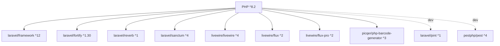

# Development Guidelines

<cite>
**Referenced Files in This Document**
- [pint.json](file://pint.json)
- [composer.json](file://composer.json)
- [package.json](file://package.json)
- [phpunit.xml](file://phpunit.xml)
- [conductor/workflow.md](file://conductor/workflow.md)
- [conductor/tech-stack.md](file://conductor/tech-stack.md)
- [conductor/product-guidelines.md](file://conductor/product-guidelines.md)
- [conductor/code_styleguides/general.md](file://conductor/code_styleguides/general.md)
- [conductor/code_styleguides/html-css.md](file://conductor/code_styleguides/html-css.md)
- [conductor/code_styleguides/javascript.md](file://conductor/code_styleguides/javascript.md)
- [bootstrap/app.php](file://bootstrap/app.php)
- [config/fortify.php](file://config/fortify.php)
- [app/Http/Controllers/Controller.php](file://app/Http/Controllers/Controller.php)
- [app/Models/User.php](file://app/Models/User.php)
- [app/Actions/Queue/CreateQueueTicket.php](file://app/Actions/Queue/CreateQueueTicket.php)
- [.editorconfig](file://.editorconfig)
</cite>

## Table of Contents
1. [Introduction](#introduction)
2. [Project Structure](#project-structure)
3. [Core Components](#core-components)
4. [Architecture Overview](#architecture-overview)
5. [Detailed Component Analysis](#detailed-component-analysis)
6. [Dependency Analysis](#dependency-analysis)
7. [Performance Considerations](#performance-considerations)
8. [Troubleshooting Guide](#troubleshooting-guide)
9. [Conclusion](#conclusion)
10. [Appendices](#appendices)

## Introduction
This document provides comprehensive development guidelines for the PTSP system. It consolidates code style standards, naming conventions, file organization patterns, architectural principles, contribution and review processes, documentation and commit conventions, testing and quality gates, and guidance for extending the system while maintaining backward compatibility.

## Project Structure
The PTSP system follows a Laravel 12 application layout with a clear separation of concerns:
- Backend: Laravel application under app/, controllers under app/Http/Controllers, models under app/Models, actions under app/Actions, Livewire components under app/Livewire, services under app/Services, enums under app/Enums, and supporting classes under app/Support.
- Frontend: Livewire 4 with Flux UI Pro 2 and Tailwind CSS 4, with Vite-based asset pipeline.
- Testing: PestPHP-based test suites under tests/, with both Unit and Feature categories.
- Configuration: Laravel configuration under config/, Composer scripts for setup and linting, and PHPUnit configuration for test execution and coverage.

**Diagram sources**
- [composer.json:41-52](file://composer.json#L41-L52)
- [bootstrap/app.php:9-32](file://bootstrap/app.php#L9-L32)
- [config/fortify.php:1-158](file://config/fortify.php#L1-L158)

**Section sources**
- [composer.json:41-52](file://composer.json#L41-L52)
- [bootstrap/app.php:9-32](file://bootstrap/app.php#L9-L32)
- [config/fortify.php:1-158](file://config/fortify.php#L1-L158)

## Core Components
- Code style enforcement uses Laravel Pint with the laravel preset. The project includes a dedicated lint script and a lint:check script for CI.
- EditorConfig enforces consistent line endings, indentation, and whitespace trimming across files.
- Laravel configuration sets timezone, locale, and maintenance mode drivers.
- Authentication is provided by Laravel Fortify with registration, password reset, email verification, and two-factor authentication enabled.

**Section sources**
- [pint.json:1-4](file://pint.json#L1-L4)
- [composer.json:66-71](file://composer.json#L66-L71)
- [.editorconfig:1-19](file://.editorconfig#L1-L19)
- [config/app.php:67-124](file://config/app.php#L67-L124)
- [config/fortify.php:146-155](file://config/fortify.php#L146-L155)

## Architecture Overview
The system architecture centers around:
- MVC-like HTTP layer with controllers and requests/resources.
- Domain actions encapsulating business logic (e.g., queue ticket creation).
- Eloquent models with typed enums and relationships.
- Livewire components for reactive frontend experiences.
- Middleware for role-based access and module password checks.
- Services abstraction for external integrations (e.g., TTS).

**Diagram sources**
- [bootstrap/app.php:17-28](file://bootstrap/app.php#L17-L28)
- [app/Http/Controllers/Controller.php:1-9](file://app/Http/Controllers/Controller.php#L1-L9)
- [app/Actions/Queue/CreateQueueTicket.php:1-91](file://app/Actions/Queue/CreateQueueTicket.php#L1-L91)
- [app/Models/User.php:1-99](file://app/Models/User.php#L1-L99)

**Section sources**
- [bootstrap/app.php:17-28](file://bootstrap/app.php#L17-L28)
- [app/Actions/Queue/CreateQueueTicket.php:13-18](file://app/Actions/Queue/CreateQueueTicket.php#L13-L18)
- [app/Models/User.php:14-17](file://app/Models/User.php#L14-L17)

## Detailed Component Analysis

### Code Style Standards and Formatting
- PHP formatting: Laravel Pint with the laravel preset is configured and integrated via Composer scripts for parallel linting and check-only mode for CI.
- EditorConfig settings enforce UTF-8, LF line endings, 4-space indentation for most files, trimming trailing whitespace, and special handling for Markdown and YAML.
- JavaScript and CSS style guidance is derived from the Google style guides summarized in the project’s code style guides, covering formatting, naming, and best practices.

**Diagram sources**
- [.editorconfig:3-19](file://.editorconfig#L3-L19)
- [pint.json:1-4](file://pint.json#L1-L4)
- [composer.json:66-71](file://composer.json#L66-L71)

**Section sources**
- [pint.json:1-4](file://pint.json#L1-L4)
- [composer.json:66-71](file://composer.json#L66-L71)
- [.editorconfig:1-19](file://.editorconfig#L1-L19)
- [conductor/code_styleguides/general.md:1-24](file://conductor/code_styleguides/general.md#L1-L24)
- [conductor/code_styleguides/html-css.md:1-50](file://conductor/code_styleguides/html-css.md#L1-L50)
- [conductor/code_styleguides/javascript.md:1-52](file://conductor/code_styleguides/javascript.md#L1-L52)

### Naming Conventions and File Organization
- PHP namespaces and PSR-4 autoloading are defined in Composer configuration, mapping app/, database/factories/, database/seeders/, and tests/.
- Controllers follow Laravel conventions and extend a base controller class.
- Actions encapsulate domain-specific operations (e.g., CreateQueueTicket).
- Models use Eloquent with typed enum casts and relationships.
- Middleware aliases are registered in the bootstrap application configuration.

**Diagram sources**
- [app/Http/Controllers/Controller.php:1-9](file://app/Http/Controllers/Controller.php#L1-L9)
- [app/Actions/Queue/CreateQueueTicket.php:13-18](file://app/Actions/Queue/CreateQueueTicket.php#L13-L18)
- [app/Models/User.php:14-17](file://app/Models/User.php#L14-L17)

**Section sources**
- [composer.json:41-52](file://composer.json#L41-L52)
- [app/Http/Controllers/Controller.php:1-9](file://app/Http/Controllers/Controller.php#L1-L9)
- [app/Actions/Queue/CreateQueueTicket.php:13-18](file://app/Actions/Queue/CreateQueueTicket.php#L13-L18)
- [app/Models/User.php:14-17](file://app/Models/User.php#L14-L17)
- [bootstrap/app.php:20-23](file://bootstrap/app.php#L20-L23)

### Architectural Principles
- Layered architecture: HTTP layer (controllers, requests), domain actions, persistence (models), and services.
- Middleware-driven access control with role and module password checks.
- Enumerations for domain constants (e.g., user roles, queue statuses).
- Livewire components for interactive UI with Blade templates.

**Diagram sources**
- [bootstrap/app.php:17-28](file://bootstrap/app.php#L17-L28)
- [app/Actions/Queue/CreateQueueTicket.php:13-18](file://app/Actions/Queue/CreateQueueTicket.php#L13-L18)
- [app/Models/User.php:14-17](file://app/Models/User.php#L14-L17)

**Section sources**
- [bootstrap/app.php:17-28](file://bootstrap/app.php#L17-L28)
- [app/Models/User.php:52-55](file://app/Models/User.php#L52-L55)

### Contribution Guidelines, Code Review, and Workflow
- The project follows a deliberate tech stack policy and a plan-driven workflow. Tasks are tracked in plan.md and follow a strict lifecycle with TDD, refactoring, coverage verification, and git notes for audibility.
- Quality gates include passing tests, coverage thresholds, adherence to style guides, documentation completeness, type safety, linting/static analysis, mobile compatibility, and security checks.
- Commit messages follow a conventional format with type, scope, and description.

**Diagram sources**
- [conductor/workflow.md:16-68](file://conductor/workflow.md#L16-L68)
- [composer.json:66-71](file://composer.json#L66-L71)

**Section sources**
- [conductor/workflow.md:1-334](file://conductor/workflow.md#L1-L334)
- [composer.json:66-71](file://composer.json#L66-L71)

### Documentation Standards, Commit Messages, and Version Control Practices
- Documentation standards emphasize clarity, consistency, and user-centric microcopy. UI/UX principles prioritize Flux UI Pro consistency, accessibility, and minimalism.
- Commit message conventions use type(scope): description with optional body/footer.
- Version control practices include attaching git notes for task summaries and updating plan.md with completion hashes.

**Section sources**
- [conductor/product-guidelines.md:1-13](file://conductor/product-guidelines.md#L1-L13)
- [conductor/workflow.md:235-261](file://conductor/workflow.md#L235-L261)

### Testing Requirements, Coverage Expectations, and Quality Gates
- Testing framework is PestPHP with separate Unit and Feature suites.
- PHPUnit configuration sets environment variables for testing, including SQLite in-memory database and reduced bcrypt cost for faster runs.
- Quality gates require >80% code coverage for new code, passing tests, linting, and documentation updates.

**Diagram sources**
- [composer.json:76-80](file://composer.json#L76-L80)
- [phpunit.xml:15-34](file://phpunit.xml#L15-L34)
- [conductor/workflow.md:137-150](file://conductor/workflow.md#L137-L150)

**Section sources**
- [composer.json:76-80](file://composer.json#L76-L80)
- [phpunit.xml:15-34](file://phpunit.xml#L15-L34)
- [conductor/workflow.md:137-150](file://conductor/workflow.md#L137-L150)

### Extending the System, Adding Features, and Backward Compatibility
- Use domain actions for new business logic to keep controllers thin and reusable.
- Introduce new models with typed enum casts and appropriate relationships.
- Add Livewire components for interactive UI and Blade templates for rendering.
- Maintain backward compatibility by avoiding breaking changes to public APIs and ensuring migrations handle schema evolution gracefully.

**Section sources**
- [app/Actions/Queue/CreateQueueTicket.php:13-18](file://app/Actions/Queue/CreateQueueTicket.php#L13-L18)
- [app/Models/User.php:48-55](file://app/Models/User.php#L48-L55)

## Dependency Analysis
The project’s runtime and development dependencies are declared in Composer and NPM. Laravel Pint is included as a development dependency and wired into Composer scripts for linting. PestPHP is configured for testing. The tech stack is explicitly documented.

**Diagram sources**
- [composer.json:11-34](file://composer.json#L11-L34)
- [package.json:9-26](file://package.json#L9-L26)
- [conductor/tech-stack.md:1-15](file://conductor/tech-stack.md#L1-L15)

**Section sources**
- [composer.json:11-34](file://composer.json#L11-L34)
- [package.json:9-26](file://package.json#L9-L26)
- [conductor/tech-stack.md:1-15](file://conductor/tech-stack.md#L1-L15)

## Performance Considerations
- Use database indexes appropriately (as seen in migrations) to optimize query performance.
- Prefer eager loading relationships to avoid N+1 query problems.
- Leverage caching strategies for frequently accessed configuration and counters.
- Keep middleware lightweight and only register necessary global middleware.

## Troubleshooting Guide
- If linting fails locally but passes in CI, ensure the local environment uses the same Pint version and configuration.
- For test failures, verify the SQLite in-memory database configuration and reduced bcrypt cost settings.
- If authentication issues arise, review Fortify configuration for guards, passwords, and enabled features.

**Section sources**
- [composer.json:66-71](file://composer.json#L66-L71)
- [phpunit.xml:20-34](file://phpunit.xml#L20-L34)
- [config/fortify.php:18-155](file://config/fortify.php#L18-L155)

## Conclusion
These guidelines consolidate the PTSP system’s development practices, ensuring consistent code quality, maintainable architecture, and efficient collaboration. Adhering to the established conventions and quality gates will help sustain a robust and scalable platform.

## Appendices
- Additional resources:
  - Tech stack overview and testing framework selection.
  - Product guidelines for tone, style, and UI/UX principles.
  - Code style guides for general, HTML/CSS, and JavaScript practices.

**Section sources**
- [conductor/tech-stack.md:1-15](file://conductor/tech-stack.md#L1-L15)
- [conductor/product-guidelines.md:1-13](file://conductor/product-guidelines.md#L1-L13)
- [conductor/code_styleguides/general.md:1-24](file://conductor/code_styleguides/general.md#L1-L24)
- [conductor/code_styleguides/html-css.md:1-50](file://conductor/code_styleguides/html-css.md#L1-L50)
- [conductor/code_styleguides/javascript.md:1-52](file://conductor/code_styleguides/javascript.md#L1-L52)