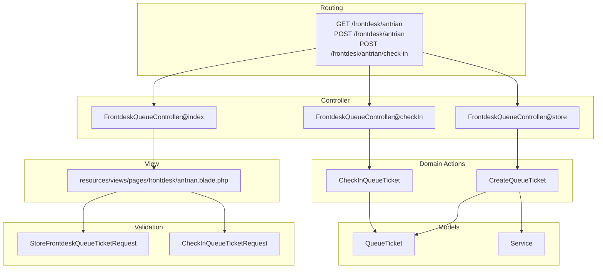
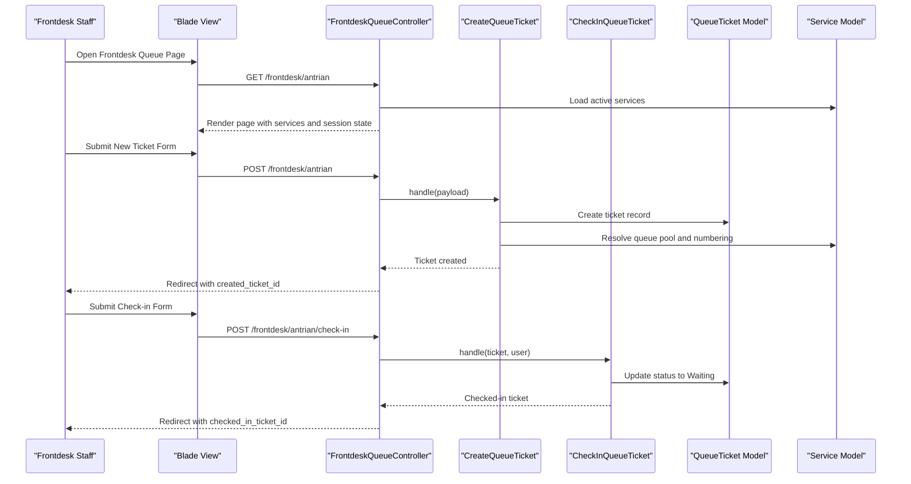
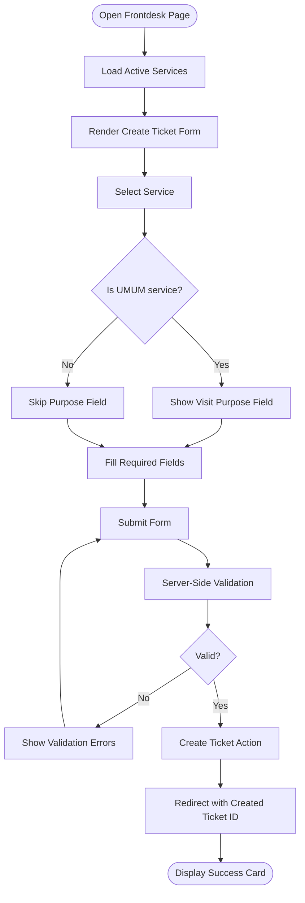
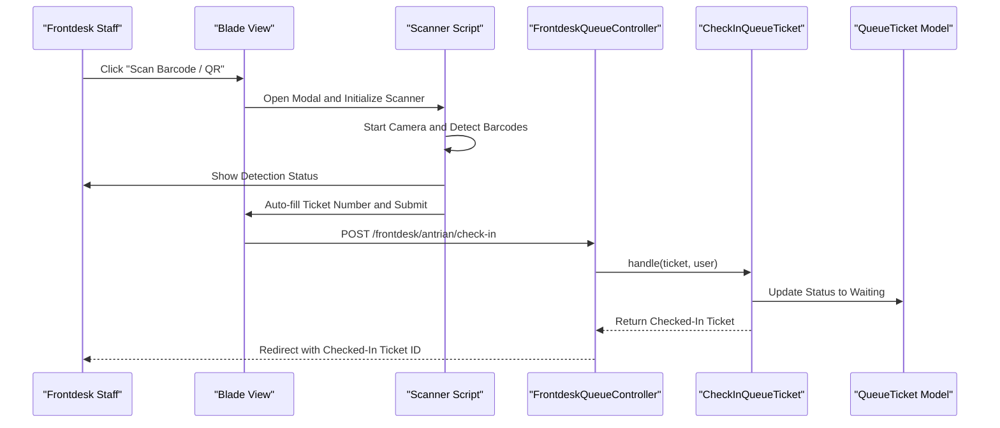
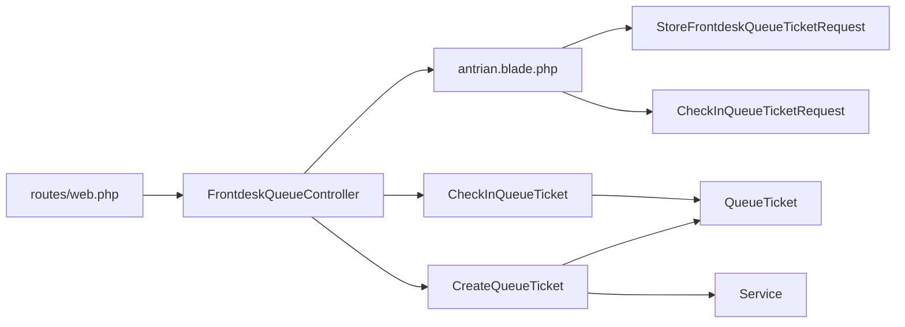

# Frontdesk Interface Components

<cite>
**Referenced Files in This Document**
- [antrian.blade.php](file://resources/views/pages/frontdesk/antrian.blade.php)
- [FrontdeskQueueController.php](file://app/Http/Controllers/FrontdeskQueueController.php)
- [web.php](file://routes/web.php)
- [CreateQueueTicket.php](file://app/Actions/Queue/CreateQueueTicket.php)
- [CheckInQueueTicket.php](file://app/Actions/Queue/CheckInQueueTicket.php)
- [QueueTicket.php](file://app/Models/QueueTicket.php)
- [Service.php](file://app/Models/Service.php)
- [StoreFrontdeskQueueTicketRequest.php](file://app/Http/Requests/StoreFrontdeskQueueTicketRequest.php)
- [CheckInQueueTicketRequest.php](file://app/Http/Requests/CheckInQueueTicketRequest.php)
- [app.blade.php](file://resources/views/layouts/app.blade.php)
- [AdminRoleSwitcher.php](file://app/Livewire/AdminRoleSwitcher.php)
</cite>

## Table of Contents
1. [Introduction](#introduction)
2. [Project Structure](#project-structure)
3. [Core Components](#core-components)
4. [Architecture Overview](#architecture-overview)
5. [Detailed Component Analysis](#detailed-component-analysis)
6. [Dependency Analysis](#dependency-analysis)
7. [Performance Considerations](#performance-considerations)
8. [Accessibility Guidelines](#accessibility-guidelines)
9. [Troubleshooting Guide](#troubleshooting-guide)
10. [Conclusion](#conclusion)

## Introduction
This document describes the frontdesk user interface components used for daily queue operations. It explains the layout structure, navigation patterns, and interactive elements available to frontdesk staff. It details the ticket creation and check-in workflows, the service selection interface, and the real-time feedback mechanisms. It also documents the session-based state management for created and checked-in tickets, along with guidelines for interface responsiveness, accessibility, and optimal user experience tailored to frontdesk workflows.

## Project Structure
The frontdesk interface is implemented as a Blade view integrated into the application layout and served via a controller. Routes restrict access to authenticated users with frontdesk or admin roles. Validation requests enforce business rules, while actions encapsulate domain logic for creating and checking in tickets.

**Diagram sources**
- [web.php:42-46](file://routes/web.php#L42-L46)
- [FrontdeskQueueController.php:18-88](file://app/Http/Controllers/FrontdeskQueueController.php#L18-L88)
- [antrian.blade.php:1-426](file://resources/views/pages/frontdesk/antrian.blade.php#L1-L426)
- [CreateQueueTicket.php:34-89](file://app/Actions/Queue/CreateQueueTicket.php#L34-L89)
- [CheckInQueueTicket.php:17-42](file://app/Actions/Queue/CheckInQueueTicket.php#L17-L42)
- [QueueTicket.php:17-52](file://app/Models/QueueTicket.php#L17-L52)
- [Service.php:17-41](file://app/Models/Service.php#L17-L41)
- [StoreFrontdeskQueueTicketRequest.php:24-66](file://app/Http/Requests/StoreFrontdeskQueueTicketRequest.php#L24-L66)
- [CheckInQueueTicketRequest.php:29-42](file://app/Http/Requests/CheckInQueueTicketRequest.php#L29-L42)

**Section sources**
- [web.php:42-46](file://routes/web.php#L42-L46)
- [FrontdeskQueueController.php:18-42](file://app/Http/Controllers/FrontdeskQueueController.php#L18-L42)
- [antrian.blade.php:1-426](file://resources/views/pages/frontdesk/antrian.blade.php#L1-L426)

## Core Components
- Layout container: The frontdesk page is wrapped in a sidebar layout that integrates with the application navigation.
- Ticket creation card: Provides a form to create new same-day tickets with service selection, channel, date, visitor details, and optional notes.
- Check-in card: Allows scanning or manual entry of a ticket number to perform check-in.
- Real-time feedback: Success notifications for created and checked-in tickets are displayed using session flash messages.
- Session state: The controller reads created and checked-in ticket IDs from the session to prepopulate UI feedback.

**Section sources**
- [app.blade.php:1-6](file://resources/views/layouts/app.blade.php#L1-L6)
- [antrian.blade.php:11-49](file://resources/views/pages/frontdesk/antrian.blade.php#L11-L49)
- [FrontdeskQueueController.php:20-31](file://app/Http/Controllers/FrontdeskQueueController.php#L20-L31)

## Architecture Overview
The frontdesk interface follows a layered pattern:
- Presentation: Blade view renders the UI and binds Alpine.js reactive state.
- Controller: Orchestrates data retrieval, validation, and redirects with flash messages.
- Domain Actions: Encapsulate business logic for creating and checking in tickets.
- Models: Persist and query queue tickets and services.
- Validation: Request classes enforce business rules and localization.

**Diagram sources**
- [antrian.blade.php:59-128](file://resources/views/pages/frontdesk/antrian.blade.php#L59-L128)
- [antrian.blade.php:150-166](file://resources/views/pages/frontdesk/antrian.blade.php#L150-L166)
- [FrontdeskQueueController.php:44-87](file://app/Http/Controllers/FrontdeskQueueController.php#L44-L87)
- [CreateQueueTicket.php:34-89](file://app/Actions/Queue/CreateQueueTicket.php#L34-L89)
- [CheckInQueueTicket.php:17-42](file://app/Actions/Queue/CheckInQueueTicket.php#L17-L42)
- [QueueTicket.php:17-52](file://app/Models/QueueTicket.php#L17-L52)
- [Service.php:17-41](file://app/Models/Service.php#L17-L41)

## Detailed Component Analysis

### Layout and Navigation
- The page is rendered inside a sidebar layout that provides consistent navigation across modules.
- Role-aware navigation: Admin users can switch roles, with frontdesk defaulting to the frontdesk queue page.

**Section sources**
- [app.blade.php:1-6](file://resources/views/layouts/app.blade.php#L1-L6)
- [AdminRoleSwitcher.php:14-19](file://app/Livewire/AdminRoleSwitcher.php#L14-L19)

### Ticket Creation Card
- Purpose: Create same-day tickets for walk-in or kiosk-assisted entries.
- Fields:
  - Service selection with dynamic visibility for purpose-specific options.
  - Channel selection restricted to assisted same-day and walk-in/kiosk.
  - Service date defaulted to current day with validation.
  - Visitor details: name, identifier, phone.
  - Optional notes.
- Behavior:
  - Reactive Alpine.js state manages service selection and conditional fields.
  - CSRF protection and server-side validation.
  - On success, a flash message displays the created ticket number and status.

**Diagram sources**
- [antrian.blade.php:59-128](file://resources/views/pages/frontdesk/antrian.blade.php#L59-L128)
- [StoreFrontdeskQueueTicketRequest.php:24-66](file://app/Http/Requests/StoreFrontdeskQueueTicketRequest.php#L24-L66)
- [CreateQueueTicket.php:34-89](file://app/Actions/Queue/CreateQueueTicket.php#L34-L89)

**Section sources**
- [antrian.blade.php:59-128](file://resources/views/pages/frontdesk/antrian.blade.php#L59-L128)
- [StoreFrontdeskQueueTicketRequest.php:24-66](file://app/Http/Requests/StoreFrontdeskQueueTicketRequest.php#L24-L66)
- [CreateQueueTicket.php:34-89](file://app/Actions/Queue/CreateQueueTicket.php#L34-L89)

### Check-in Card and Scanner
- Purpose: Convert a booked ticket into a waiting ticket upon arrival.
- Inputs:
  - Manual entry of ticket number with normalization and validation.
  - Optional QR/barcode scanner via modal.
- Scanner features:
  - Camera initialization with environment-facing preference.
  - Barcode detection using browser APIs with fallback messaging.
  - Keyboard buffer scanning for keyboard-based scanners.
  - Automatic form submission after detection.

**Diagram sources**
- [antrian.blade.php:140-191](file://resources/views/pages/frontdesk/antrian.blade.php#L140-L191)
- [antrian.blade.php:194-424](file://resources/views/pages/frontdesk/antrian.blade.php#L194-L424)
- [FrontdeskQueueController.php:66-87](file://app/Http/Controllers/FrontdeskQueueController.php#L66-L87)
- [CheckInQueueTicket.php:17-42](file://app/Actions/Queue/CheckInQueueTicket.php#L17-L42)
- [QueueTicket.php:17-52](file://app/Models/QueueTicket.php#L17-L52)

**Section sources**
- [antrian.blade.php:140-191](file://resources/views/pages/frontdesk/antrian.blade.php#L140-L191)
- [antrian.blade.php:194-424](file://resources/views/pages/frontdesk/antrian.blade.php#L194-L424)
- [FrontdeskQueueController.php:66-87](file://app/Http/Controllers/FrontdeskQueueController.php#L66-L87)

### Session-Based State Management
- Created ticket: After successful creation, the controller stores the ticket ID in the session and redirects back to the frontdesk page. The view conditionally renders a success card using the session value.
- Checked-in ticket: After successful check-in, the controller stores the ticket ID in the session and redirects back to the frontdesk page. The view conditionally renders a check-in success card using the session value.
- The controller reads these IDs on page load to prepopulate feedback.

**Section sources**
- [FrontdeskQueueController.php:20-31](file://app/Http/Controllers/FrontdeskQueueController.php#L20-L31)
- [antrian.blade.php:17-49](file://resources/views/pages/frontdesk/antrian.blade.php#L17-L49)

### Real-Time Feedback and Notifications
- Flash messages: Success notifications for created and checked-in tickets are displayed prominently.
- Validation errors: Form validation errors are surfaced inline for each field.
- Scanner status: Live status updates inform the operator about camera permissions, detected codes, and submission progress.

**Section sources**
- [antrian.blade.php:11-15](file://resources/views/pages/frontdesk/antrian.blade.php#L11-L15)
- [antrian.blade.php:17-49](file://resources/views/pages/frontdesk/antrian.blade.php#L17-L49)
- [antrian.blade.php:172-174](file://resources/views/pages/frontdesk/antrian.blade.php#L172-L174)

## Dependency Analysis
The frontdesk interface depends on:
- Routing: Defines accessible endpoints and role-based middleware.
- Controller: Coordinates view rendering and action orchestration.
- Actions: Encapsulate domain logic for ticket creation and check-in.
- Models: Provide persistence and helper methods for queue position and quota calculations.
- Validation: Enforce business rules and localized error messages.

**Diagram sources**
- [web.php:42-46](file://routes/web.php#L42-L46)
- [FrontdeskQueueController.php:18-88](file://app/Http/Controllers/FrontdeskQueueController.php#L18-L88)
- [antrian.blade.php:59-128](file://resources/views/pages/frontdesk/antrian.blade.php#L59-L128)
- [CreateQueueTicket.php:34-89](file://app/Actions/Queue/CreateQueueTicket.php#L34-L89)
- [CheckInQueueTicket.php:17-42](file://app/Actions/Queue/CheckInQueueTicket.php#L17-L42)
- [QueueTicket.php:17-52](file://app/Models/QueueTicket.php#L17-L52)
- [Service.php:17-41](file://app/Models/Service.php#L17-L41)
- [StoreFrontdeskQueueTicketRequest.php:24-66](file://app/Http/Requests/StoreFrontdeskQueueTicketRequest.php#L24-L66)
- [CheckInQueueTicketRequest.php:29-42](file://app/Http/Requests/CheckInQueueTicketRequest.php#L29-L42)

**Section sources**
- [web.php:42-46](file://routes/web.php#L42-L46)
- [FrontdeskQueueController.php:18-88](file://app/Http/Controllers/FrontdeskQueueController.php#L18-L88)
- [CreateQueueTicket.php:34-89](file://app/Actions/Queue/CreateQueueTicket.php#L34-L89)
- [CheckInQueueTicket.php:17-42](file://app/Actions/Queue/CheckInQueueTicket.php#L17-L42)
- [QueueTicket.php:79-94](file://app/Models/QueueTicket.php#L79-L94)
- [Service.php:73-99](file://app/Models/Service.php#L73-L99)

## Performance Considerations
- Minimize DOM updates: The Alpine.js reactive state avoids unnecessary re-renders by binding to local state.
- Efficient validation: Server-side validation reduces client-side overhead while ensuring correctness.
- Scanner optimization: The barcode detection loop uses requestAnimationFrame and stops streams promptly to conserve CPU/GPU resources.
- Database queries: The queue position calculation is scoped to the same pool and date, keeping queries efficient.

[No sources needed since this section provides general guidance]

## Accessibility Guidelines
- Focus management: Ensure keyboard navigation moves predictably through form fields and buttons.
- Labels and errors: Associate error messages with their respective inputs to aid screen reader users.
- Color contrast: Maintain sufficient contrast for badges, callouts, and status indicators.
- Alternative input: Provide manual input fallback when camera permissions are denied.
- ARIA live regions: Use aria-live areas for scanner status updates to announce changes to assistive technologies.

[No sources needed since this section provides general guidance]

## Troubleshooting Guide
Common issues and resolutions:
- Ticket creation fails with service-related errors:
  - Verify the selected service is active and supports walk-in/frontdesk entries.
  - Confirm the service date is not past and that daily quotas are available.
- Check-in fails:
  - Ensure the ticket exists and is in the expected status for check-in.
  - Confirm the ticket number is entered correctly (case-insensitive normalization occurs).
- Scanner does not work:
  - Browser support: Some browsers lack BarcodeDetector or camera permission; use a supported browser or a USB scanner.
  - Permissions: Grant camera access when prompted; the interface provides clear status messages.
  - Environment facing: The scanner prefers the environment-facing camera for QR/barcode scanning.

**Section sources**
- [StoreFrontdeskQueueTicketRequest.php:40-66](file://app/Http/Requests/StoreFrontdeskQueueTicketRequest.php#L40-L66)
- [CheckInQueueTicketRequest.php:29-42](file://app/Http/Requests/CheckInQueueTicketRequest.php#L29-L42)
- [CheckInQueueTicket.php:19-21](file://app/Actions/Queue/CheckInQueueTicket.php#L19-L21)
- [antrian.blade.php:332-366](file://resources/views/pages/frontdesk/antrian.blade.php#L332-L366)

## Conclusion
The frontdesk interface provides a streamlined, role-secured environment for creating same-day tickets and performing check-ins. Its layout emphasizes clarity and speed, with real-time feedback and robust validation. The session-based state management ensures continuity across actions, while the scanner integration accelerates check-in throughput. Following the accessibility and performance guidelines will further enhance the user experience for frontdesk staff during daily operations.