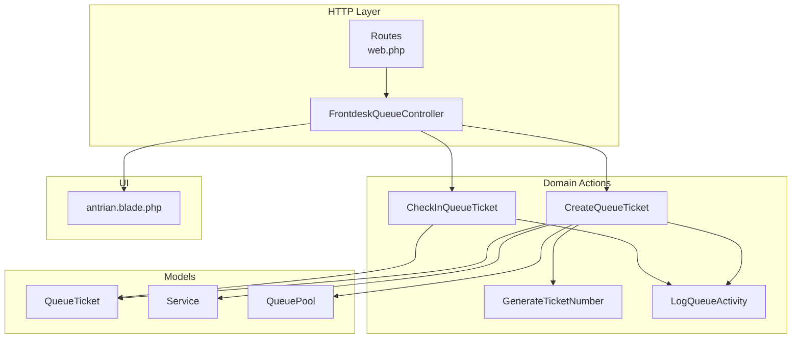
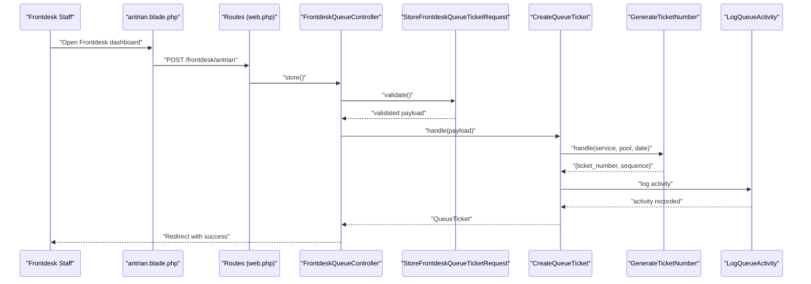
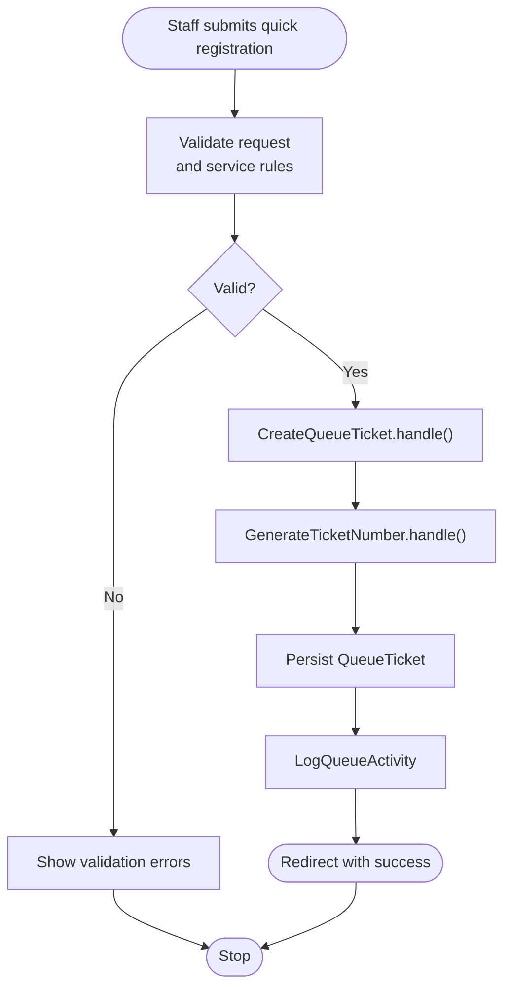
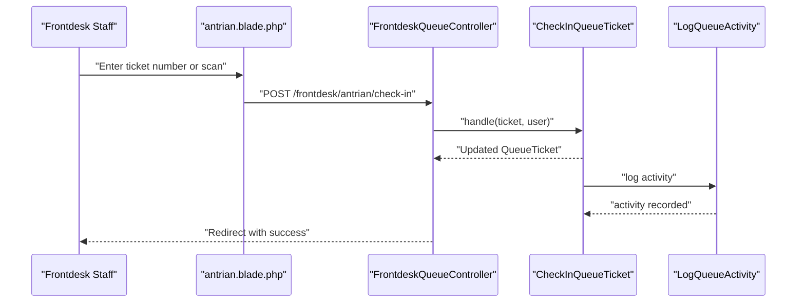

# Frontdesk Operations

<cite>
**Referenced Files in This Document**
- [FrontdeskQueueController.php](file://app/Http/Controllers/FrontdeskQueueController.php)
- [StoreFrontdeskQueueTicketRequest.php](file://app/Http/Requests/StoreFrontdeskQueueTicketRequest.php)
- [antrian.blade.php](file://resources/views/pages/frontdesk/antrian.blade.php)
- [CreateQueueTicket.php](file://app/Actions/Queue/CreateQueueTicket.php)
- [CheckInQueueTicket.php](file://app/Actions/Queue/CheckInQueueTicket.php)
- [GenerateTicketNumber.php](file://app/Actions/Queue/GenerateTicketNumber.php)
- [LogQueueActivity.php](file://app/Actions/Queue/LogQueueActivity.php)
- [QueueTicket.php](file://app/Models/QueueTicket.php)
- [QueueStatus.php](file://app/Enums/QueueStatus.php)
- [web.php](file://routes/web.php)
</cite>

## Table of Contents
1. [Introduction](#introduction)
2. [Project Structure](#project-structure)
3. [Core Components](#core-components)
4. [Architecture Overview](#architecture-overview)
5. [Detailed Component Analysis](#detailed-component-analysis)
6. [Dependency Analysis](#dependency-analysis)
7. [Performance Considerations](#performance-considerations)
8. [Troubleshooting Guide](#troubleshooting-guide)
9. [Conclusion](#conclusion)
10. [Appendices](#appendices)

## Introduction
This document explains the Frontdesk Operations functionality for managing walk-in visitors and integrating them into the queue system. It covers:
- Walk-in registration for visitors arriving without prior booking
- Quick registration workflow for immediate service requests
- Queue management tools: ticket creation, check-in, status updates, and visitor tracking
- Frontdesk user interface components and their roles
- Validation processes, error handling, and workflow automation features
- Best practices and operational efficiency guidelines for frontdesk staff

## Project Structure
Frontdesk Operations spans controller actions, request validation, UI templates, domain actions, and models. The routing layer exposes three endpoints under the Frontdesk role:
- GET /frontdesk/antrian: renders the Frontdesk dashboard
- POST /frontdesk/antrian: creates a new queue ticket (quick registration)
- POST /frontdesk/antrian/check-in: performs check-in for an existing ticket

**Diagram sources**
- [web.php:42-46](file://routes/web.php#L42-L46)
- [FrontdeskQueueController.php:16-88](file://app/Http/Controllers/FrontdeskQueueController.php#L16-L88)
- [CreateQueueTicket.php:13-91](file://app/Actions/Queue/CreateQueueTicket.php#L13-L91)
- [CheckInQueueTicket.php:11-44](file://app/Actions/Queue/CheckInQueueTicket.php#L11-L44)
- [GenerateTicketNumber.php:10-31](file://app/Actions/Queue/GenerateTicketNumber.php#L10-L31)
- [LogQueueActivity.php:8-29](file://app/Actions/Queue/LogQueueActivity.php#L8-L29)
- [QueueTicket.php:12-121](file://app/Models/QueueTicket.php#L12-L121)
- [antrian.blade.php:1-426](file://resources/views/pages/frontdesk/antrian.blade.php#L1-L426)

**Section sources**
- [web.php:42-46](file://routes/web.php#L42-L46)
- [FrontdeskQueueController.php:16-88](file://app/Http/Controllers/FrontdeskQueueController.php#L16-L88)
- [antrian.blade.php:1-426](file://resources/views/pages/frontdesk/antrian.blade.php#L1-L426)

## Core Components
- FrontdeskQueueController: orchestrates Frontdesk operations, including rendering the dashboard, creating tickets, and performing check-in.
- StoreFrontdeskQueueTicketRequest: validates quick registration inputs and service availability.
- CreateQueueTicket: builds a new queue ticket with generated number, appropriate status, and activity log.
- CheckInQueueTicket: transitions a booked ticket to waiting and logs the activity.
- GenerateTicketNumber: computes sequence and formatted ticket number per service and date.
- LogQueueActivity: records queue lifecycle events for auditability.
- QueueTicket model: persists ticket data, relationships, and queue position calculation.
- QueueStatus enum: defines human-readable labels and colors for statuses.
- Blade template antrian.blade.php: presents quick registration and check-in forms, plus scanning UX.

**Section sources**
- [FrontdeskQueueController.php:16-88](file://app/Http/Controllers/FrontdeskQueueController.php#L16-L88)
- [StoreFrontdeskQueueTicketRequest.php:9-88](file://app/Http/Requests/StoreFrontdeskQueueTicketRequest.php#L9-L88)
- [CreateQueueTicket.php:13-91](file://app/Actions/Queue/CreateQueueTicket.php#L13-L91)
- [CheckInQueueTicket.php:11-44](file://app/Actions/Queue/CheckInQueueTicket.php#L11-L44)
- [GenerateTicketNumber.php:10-31](file://app/Actions/Queue/GenerateTicketNumber.php#L10-L31)
- [LogQueueActivity.php:8-29](file://app/Actions/Queue/LogQueueActivity.php#L8-L29)
- [QueueTicket.php:12-121](file://app/Models/QueueTicket.php#L12-L121)
- [QueueStatus.php:5-38](file://app/Enums/QueueStatus.php#L5-L38)
- [antrian.blade.php:1-426](file://resources/views/pages/frontdesk/antrian.blade.php#L1-L426)

## Architecture Overview
The Frontdesk module follows a layered pattern:
- HTTP layer: routes bind to FrontdeskQueueController actions.
- Domain actions: encapsulate business logic for ticket creation and check-in.
- Persistence: models represent queue entities and relationships.
- Presentation: Blade template renders forms and integrates scanning UX.

**Diagram sources**
- [web.php:42-46](file://routes/web.php#L42-L46)
- [FrontdeskQueueController.php:44-64](file://app/Http/Controllers/FrontdeskQueueController.php#L44-L64)
- [StoreFrontdeskQueueTicketRequest.php:24-66](file://app/Http/Requests/StoreFrontdeskQueueTicketRequest.php#L24-L66)
- [CreateQueueTicket.php:34-89](file://app/Actions/Queue/CreateQueueTicket.php#L34-L89)
- [GenerateTicketNumber.php:15-29](file://app/Actions/Queue/GenerateTicketNumber.php#L15-L29)
- [LogQueueActivity.php:13-26](file://app/Actions/Queue/LogQueueActivity.php#L13-L26)

## Detailed Component Analysis

### Walk-in Registration (Quick Registration)
Purpose: Allow frontdesk staff to immediately register visitors who arrive without prior booking.

Key steps:
- The UI presents a form to select service, channel, service date, visitor details, and optional notes.
- Request validation ensures:
  - Service exists and is active
  - Channel is walk-in or assisted same-day (only if service allows walk-in)
  - Daily quota is not exceeded
  - Required fields are present
- On successful validation, the controller delegates to CreateQueueTicket, which:
  - Determines initial status based on channel
  - Generates a unique ticket number and sequence
  - Persists the ticket and logs the activity

**Diagram sources**
- [antrian.blade.php:51-129](file://resources/views/pages/frontdesk/antrian.blade.php#L51-L129)
- [StoreFrontdeskQueueTicketRequest.php:24-66](file://app/Http/Requests/StoreFrontdeskQueueTicketRequest.php#L24-L66)
- [CreateQueueTicket.php:34-89](file://app/Actions/Queue/CreateQueueTicket.php#L34-L89)
- [GenerateTicketNumber.php:15-29](file://app/Actions/Queue/GenerateTicketNumber.php#L15-L29)
- [LogQueueActivity.php:13-26](file://app/Actions/Queue/LogQueueActivity.php#L13-L26)

**Section sources**
- [antrian.blade.php:51-129](file://resources/views/pages/frontdesk/antrian.blade.php#L51-L129)
- [StoreFrontdeskQueueTicketRequest.php:24-66](file://app/Http/Requests/StoreFrontdeskQueueTicketRequest.php#L24-L66)
- [CreateQueueTicket.php:34-89](file://app/Actions/Queue/CreateQueueTicket.php#L34-L89)
- [GenerateTicketNumber.php:15-29](file://app/Actions/Queue/GenerateTicketNumber.php#L15-L29)
- [LogQueueActivity.php:13-26](file://app/Actions/Queue/LogQueueActivity.php#L13-L26)

### Check-in Workflow
Purpose: Transition a previously booked ticket to waiting status for immediate service.

Key steps:
- The UI provides a check-in form and a barcode/QR scanner integrated via JavaScript.
- On submission, the controller finds the ticket by number and delegates to CheckInQueueTicket.
- The action enforces that only booked tickets can be checked in and updates status to waiting.
- Activity is logged with metadata indicating the status change.

**Diagram sources**
- [antrian.blade.php:131-167](file://resources/views/pages/frontdesk/antrian.blade.php#L131-L167)
- [FrontdeskQueueController.php:66-87](file://app/Http/Controllers/FrontdeskQueueController.php#L66-L87)
- [CheckInQueueTicket.php:17-42](file://app/Actions/Queue/CheckInQueueTicket.php#L17-L42)
- [LogQueueActivity.php:13-26](file://app/Actions/Queue/LogQueueActivity.php#L13-L26)

**Section sources**
- [antrian.blade.php:131-167](file://resources/views/pages/frontdesk/antrian.blade.php#L131-L167)
- [FrontdeskQueueController.php:66-87](file://app/Http/Controllers/FrontdeskQueueController.php#L66-L87)
- [CheckInQueueTicket.php:17-42](file://app/Actions/Queue/CheckInQueueTicket.php#L17-L42)
- [LogQueueActivity.php:13-26](file://app/Actions/Queue/LogQueueActivity.php#L13-L26)

### Frontdesk User Interface Components
The Frontdesk dashboard comprises:
- Success notifications for created and checked-in tickets
- Quick registration card with:
  - Service selection
  - Visit purpose dropdown for a specific service
  - Channel selection (walk-in or assisted same-day)
  - Service date picker
  - Visitor details and notes
- Check-in card with:
  - Ticket number input
  - QR/barcode scanner button
  - Modal with camera detection and keyboard buffer scanning

The UI integrates:
- Alpine.js reactive bindings for dynamic fields
- A modal-based scanner powered by browser APIs and a keyboard buffer to emulate a barcode scanner

**Section sources**
- [antrian.blade.php:11-49](file://resources/views/pages/frontdesk/antrian.blade.php#L11-L49)
- [antrian.blade.php:51-129](file://resources/views/pages/frontdesk/antrian.blade.php#L51-L129)
- [antrian.blade.php:131-167](file://resources/views/pages/frontdesk/antrian.blade.php#L131-L167)
- [antrian.blade.php:169-191](file://resources/views/pages/frontdesk/antrian.blade.php#L169-L191)
- [antrian.blade.php:194-424](file://resources/views/pages/frontdesk/antrian.blade.php#L194-L424)

### Validation Processes and Error Handling
Validation rules and custom checks:
- Service must exist and be active
- Channel must be walk-in or assisted same-day for walk-in-enabled services
- Daily quota must not be full for the selected service and date
- Required fields validated with localized messages

Error handling:
- Check-in rejects non-booked tickets with a user-friendly error
- Validation errors are surfaced in the UI
- Redirects preserve success/error messages

**Section sources**
- [StoreFrontdeskQueueTicketRequest.php:24-66](file://app/Http/Requests/StoreFrontdeskQueueTicketRequest.php#L24-L66)
- [StoreFrontdeskQueueTicketRequest.php:73-86](file://app/Http/Requests/StoreFrontdeskQueueTicketRequest.php#L73-L86)
- [FrontdeskQueueController.php:73-81](file://app/Http/Controllers/FrontdeskQueueController.php#L73-L81)

### Status Updates and Visitor Tracking
- Status transitions:
  - New tickets created via quick registration start in waiting status for walk-in channels
  - Check-in transitions booked tickets to waiting
- Position tracking:
  - Queue position is calculated for waiting tickets within the same pool and date
- Activity logging:
  - All lifecycle events are recorded with metadata for auditability

**Section sources**
- [CreateQueueTicket.php:42-46](file://app/Actions/Queue/CreateQueueTicket.php#L42-L46)
- [CheckInQueueTicket.php:19-21](file://app/Actions/Queue/CheckInQueueTicket.php#L19-L21)
- [QueueTicket.php:82-94](file://app/Models/QueueTicket.php#L82-L94)
- [LogQueueActivity.php:13-26](file://app/Actions/Queue/LogQueueActivity.php#L13-L26)

## Dependency Analysis
The Frontdesk module exhibits clean separation of concerns:
- Controller depends on request validators and domain actions
- Domain actions depend on models and shared utilities
- UI depends on controller-provided data and JavaScript for scanning

```mermaid
classDiagram
class FrontdeskQueueController {
+index()
+store()
+checkIn()
}
class StoreFrontdeskQueueTicketRequest {
+rules()
+withValidator()
+messages()
}
class CreateQueueTicket {
+handle(payload) QueueTicket
}
class CheckInQueueTicket {
+handle(queueTicket, userId) QueueTicket
}
class GenerateTicketNumber {
+handle(service, pool, date) array
}
class LogQueueActivity {
+handle(ticket, action, userId, counterId, meta) QueueActivity
}
class QueueTicket {
+getQueuePosition() int?
+activities()
}
FrontdeskQueueController --> StoreFrontdeskQueueTicketRequest : "validates"
FrontdeskQueueController --> CreateQueueTicket : "creates"
FrontdeskQueueController --> CheckInQueueTicket : "checks in"
CreateQueueTicket --> GenerateTicketNumber : "generates"
CreateQueueTicket --> LogQueueActivity : "logs"
CheckInQueueTicket --> LogQueueActivity : "logs"
CreateQueueTicket --> QueueTicket : "persists"
CheckInQueueTicket --> QueueTicket : "updates"
```

**Diagram sources**
- [FrontdeskQueueController.php:16-88](file://app/Http/Controllers/FrontdeskQueueController.php#L16-L88)
- [StoreFrontdeskQueueTicketRequest.php:9-88](file://app/Http/Requests/StoreFrontdeskQueueTicketRequest.php#L9-L88)
- [CreateQueueTicket.php:13-91](file://app/Actions/Queue/CreateQueueTicket.php#L13-L91)
- [CheckInQueueTicket.php:11-44](file://app/Actions/Queue/CheckInQueueTicket.php#L11-L44)
- [GenerateTicketNumber.php:10-31](file://app/Actions/Queue/GenerateTicketNumber.php#L10-L31)
- [LogQueueActivity.php:8-29](file://app/Actions/Queue/LogQueueActivity.php#L8-L29)
- [QueueTicket.php:12-121](file://app/Models/QueueTicket.php#L12-L121)

**Section sources**
- [FrontdeskQueueController.php:16-88](file://app/Http/Controllers/FrontdeskQueueController.php#L16-L88)
- [CreateQueueTicket.php:13-91](file://app/Actions/Queue/CreateQueueTicket.php#L13-L91)
- [CheckInQueueTicket.php:11-44](file://app/Actions/Queue/CheckInQueueTicket.php#L11-L44)
- [GenerateTicketNumber.php:10-31](file://app/Actions/Queue/GenerateTicketNumber.php#L10-L31)
- [LogQueueActivity.php:8-29](file://app/Actions/Queue/LogQueueActivity.php#L8-L29)
- [QueueTicket.php:12-121](file://app/Models/QueueTicket.php#L12-L121)

## Performance Considerations
- Transaction boundaries: Both creation and check-in wrap updates in transactions to maintain consistency.
- Minimal queries: Number generation uses a single max lookup and arithmetic increment.
- UI responsiveness: Scanner uses requestAnimationFrame and stops streams on unload to conserve resources.
- Validation early exit: Custom validator short-circuits after the first failure to reduce overhead.

[No sources needed since this section provides general guidance]

## Troubleshooting Guide
Common issues and resolutions:
- Ticket cannot be checked in:
  - Cause: Non-booked status
  - Resolution: Verify the ticket was created via quick registration (which sets waiting) or ensure the original booking is properly migrated
  - Evidence: Exception thrown and user-visible error message
- Service not available or walk-in disabled:
  - Cause: Service inactive or walk-in not enabled
  - Resolution: Select another service or enable walk-in for the service
  - Evidence: Validation error on service_id
- Daily quota exceeded:
  - Cause: Maximum capacity reached for the selected service and date
  - Resolution: Choose another date or inform the visitor that the quota is full
  - Evidence: Validation error on service_date
- Scanner not working:
  - Cause: Unsupported browser or blocked camera permissions
  - Resolution: Use a USB barcode scanner or input manually; ensure camera permissions are granted
  - Evidence: Status messages in the scanner modal

**Section sources**
- [FrontdeskQueueController.php:73-81](file://app/Http/Controllers/FrontdeskQueueController.php#L73-L81)
- [StoreFrontdeskQueueTicketRequest.php:40-65](file://app/Http/Requests/StoreFrontdeskQueueTicketRequest.php#L40-L65)
- [antrian.blade.php:332-366](file://resources/views/pages/frontdesk/antrian.blade.php#L332-L366)

## Conclusion
Frontdesk Operations provides a streamlined pathway for walk-in visitors to enter the queue and for frontdesk staff to manage daily operations efficiently. The solution combines robust validation, clear status transitions, and a practical UI with scanning capabilities. Adhering to the best practices below will help maintain smooth operations and accurate queue tracking.

## Appendices

### Best Practices for Frontdesk Staff
- Always confirm the visitor’s service and purpose before creating a ticket
- Use the scanner for faster check-ins; if unavailable, input the ticket number manually
- Verify daily quotas to avoid overbooking
- Keep the scanner modal closed when not in use to prevent accidental submissions
- Use the “Assisted Same Day” channel for visitors needing help completing forms; otherwise use “Walk-in / Kiosk”
- Log any anomalies or repeated scanner failures for IT review

### Operational Efficiency Guidelines
- Batch walk-ins during peak hours by pre-selecting the most common service
- Train staff on the keyboard buffer scanner technique for quick barcode entry
- Monitor the queue dashboard for real-time status updates and bottlenecks
- Ensure camera permissions are granted for devices with built-in scanners