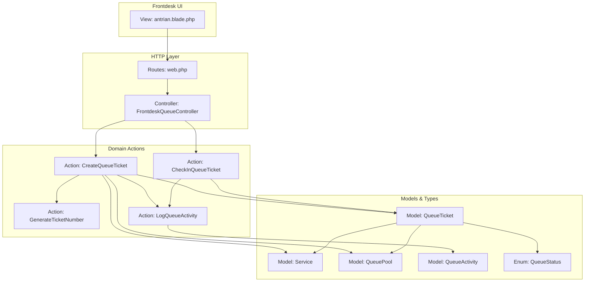
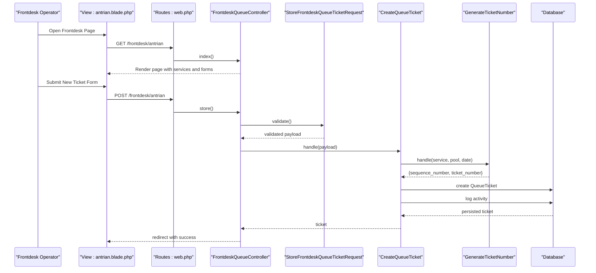
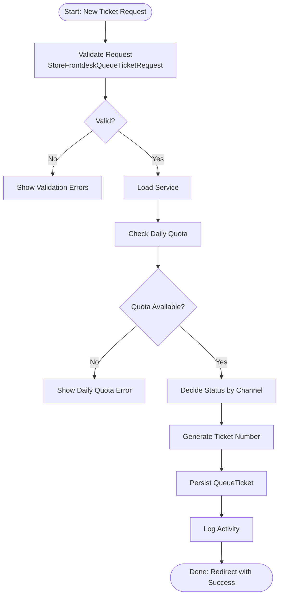
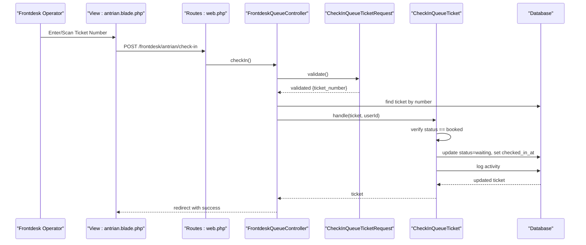
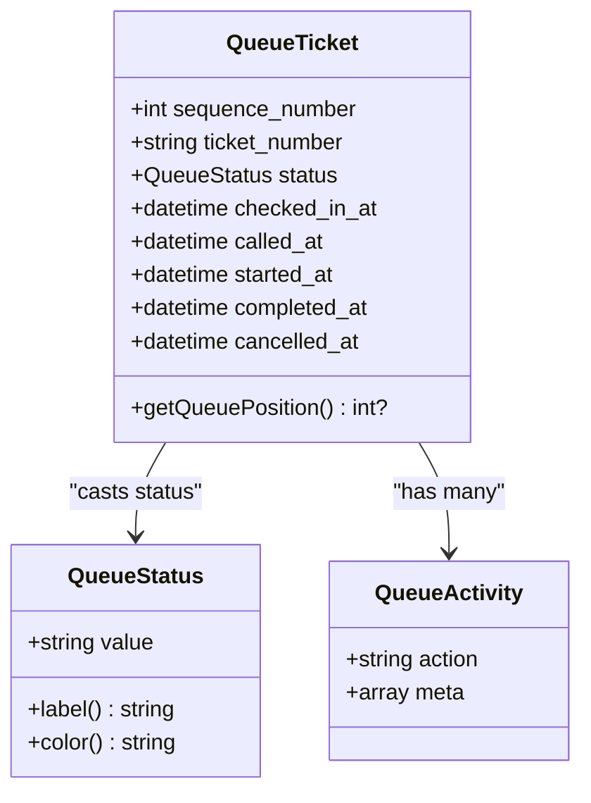
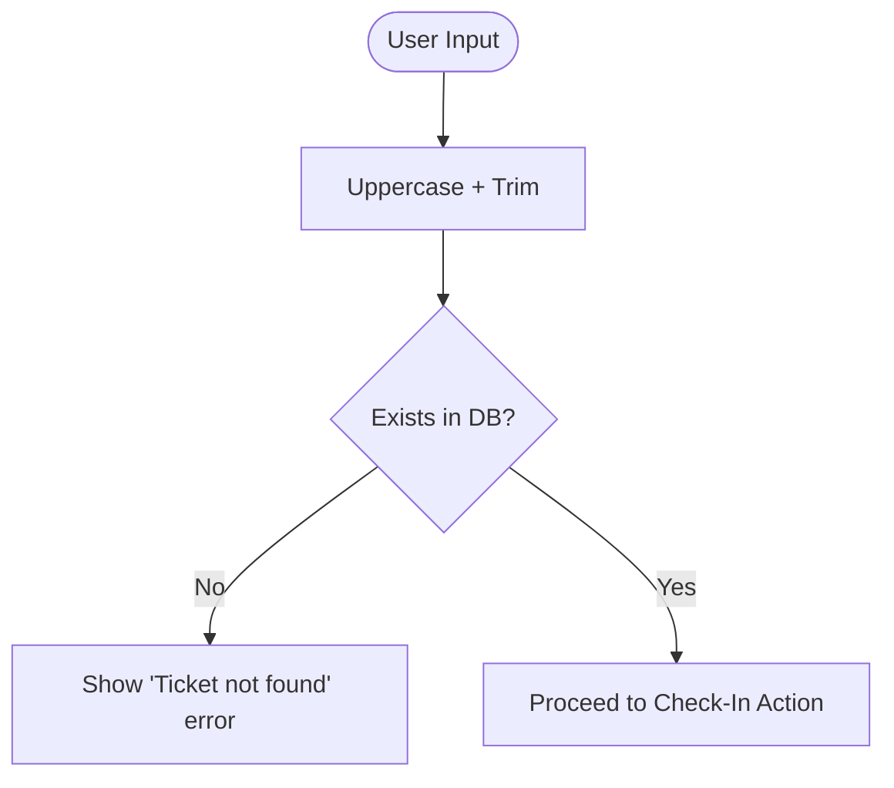
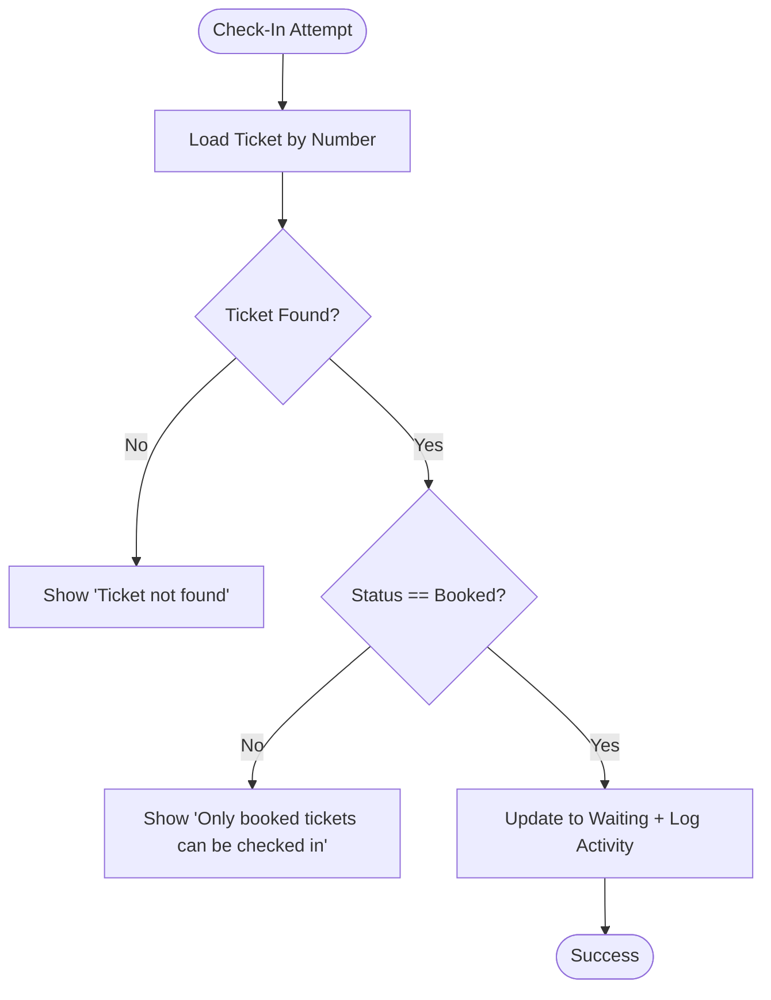
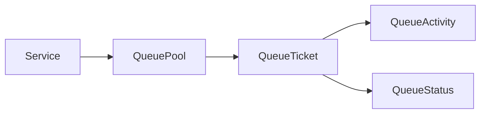
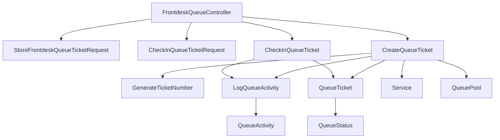

# Queue Management Tools

<cite>
**Referenced Files in This Document**
- [FrontdeskQueueController.php](file://app/Http/Controllers/FrontdeskQueueController.php)
- [CheckInQueueTicket.php](file://app/Actions/Queue/CheckInQueueTicket.php)
- [CreateQueueTicket.php](file://app/Actions/Queue/CreateQueueTicket.php)
- [GenerateTicketNumber.php](file://app/Actions/Queue/GenerateTicketNumber.php)
- [CheckInQueueTicketRequest.php](file://app/Http/Requests/CheckInQueueTicketRequest.php)
- [StoreFrontdeskQueueTicketRequest.php](file://app/Http/Requests/StoreFrontdeskQueueTicketRequest.php)
- [QueueTicket.php](file://app/Models/QueueTicket.php)
- [QueueStatus.php](file://app/Enums/QueueStatus.php)
- [Service.php](file://app/Models/Service.php)
- [QueuePool.php](file://app/Models/QueuePool.php)
- [QueueActivity.php](file://app/Models/QueueActivity.php)
- [LogQueueActivity.php](file://app/Actions/Queue/LogQueueActivity.php)
- [antrian.blade.php](file://resources/views/pages/frontdesk/antrian.blade.php)
- [web.php](file://routes/web.php)
- [AssistedQueueEntryTest.php](file://tests/Feature/Frontdesk/AssistedQueueEntryTest.php)
- [QueueCheckInTest.php](file://tests/Feature/Frontdesk/QueueCheckInTest.php)
</cite>

## Table of Contents
1. [Introduction](#introduction)
2. [Project Structure](#project-structure)
3. [Core Components](#core-components)
4. [Architecture Overview](#architecture-overview)
5. [Detailed Component Analysis](#detailed-component-analysis)
6. [Dependency Analysis](#dependency-analysis)
7. [Performance Considerations](#performance-considerations)
8. [Troubleshooting Guide](#troubleshooting-guide)
9. [Conclusion](#conclusion)
10. [Appendices](#appendices)

## Introduction
This document explains the queue management tools available to frontdesk staff. It covers the end-to-end ticket creation and check-in process, status verification, visitor tracking, validation mechanisms for ticket numbers, error handling for invalid or inappropriate check-in attempts, integration with the main queue system, and how frontdesk actions affect overall queue state. It also provides best practices for processing different visitor types and handling edge cases.

## Project Structure
The frontdesk queue tools are implemented as a cohesive set of controller actions, domain actions, requests, models, enums, and views:
- Controller: orchestrates user interactions and delegates to domain actions
- Requests: validate and normalize input
- Actions: encapsulate business logic for creating tickets, generating numbers, and checking in
- Models: represent queue entities and their relationships
- Enum: defines queue states and labels
- Views: present forms and feedback to frontdesk operators
- Routes: bind URLs to controller actions

**Diagram sources**
- [antrian.blade.php:1-426](file://resources/views/pages/frontdesk/antrian.blade.php#L1-L426)
- [web.php:42-46](file://routes/web.php#L42-L46)
- [FrontdeskQueueController.php:16-88](file://app/Http/Controllers/FrontdeskQueueController.php#L16-L88)
- [CreateQueueTicket.php:13-91](file://app/Actions/Queue/CreateQueueTicket.php#L13-L91)
- [CheckInQueueTicket.php:11-44](file://app/Actions/Queue/CheckInQueueTicket.php#L11-L44)
- [GenerateTicketNumber.php:10-31](file://app/Actions/Queue/GenerateTicketNumber.php#L10-L31)
- [LogQueueActivity.php:8-29](file://app/Actions/Queue/LogQueueActivity.php#L8-L29)
- [QueueTicket.php:12-121](file://app/Models/QueueTicket.php#L12-L121)
- [Service.php:12-101](file://app/Models/Service.php#L12-L101)
- [QueuePool.php:9-43](file://app/Models/QueuePool.php#L9-L43)
- [QueueActivity.php:9-44](file://app/Models/QueueActivity.php#L9-L44)
- [QueueStatus.php:5-38](file://app/Enums/QueueStatus.php#L5-L38)

**Section sources**
- [web.php:42-46](file://routes/web.php#L42-L46)
- [FrontdeskQueueController.php:16-88](file://app/Http/Controllers/FrontdeskQueueController.php#L16-L88)
- [antrian.blade.php:1-426](file://resources/views/pages/frontdesk/antrian.blade.php#L1-L426)

## Core Components
- FrontdeskQueueController: renders the frontdesk page, creates tickets via validated requests, and performs check-in with validation and error handling.
- CreateQueueTicket: builds a ticket for assisted same-day or walk-in kiosk channels, generates a unique ticket number, sets initial status, and logs activity.
- CheckInQueueTicket: transitions a booked ticket to waiting, records check-in time, and logs activity.
- GenerateTicketNumber: computes sequence number and formatted ticket number per queue pool and service date.
- Validation Requests: enforce input correctness and service eligibility for frontdesk actions.
- Models and Enum: define queue entities, relationships, and status semantics.
- View: presents forms for creating tickets and checking in, supports scanning and keyboard input.

**Section sources**
- [FrontdeskQueueController.php:16-88](file://app/Http/Controllers/FrontdeskQueueController.php#L16-L88)
- [CreateQueueTicket.php:13-91](file://app/Actions/Queue/CreateQueueTicket.php#L13-L91)
- [CheckInQueueTicket.php:11-44](file://app/Actions/Queue/CheckInQueueTicket.php#L11-L44)
- [GenerateTicketNumber.php:10-31](file://app/Actions/Queue/GenerateTicketNumber.php#L10-L31)
- [StoreFrontdeskQueueTicketRequest.php:9-88](file://app/Http/Requests/StoreFrontdeskQueueTicketRequest.php#L9-L88)
- [CheckInQueueTicketRequest.php:7-44](file://app/Http/Requests/CheckInQueueTicketRequest.php#L7-L44)
- [QueueTicket.php:12-121](file://app/Models/QueueTicket.php#L12-L121)
- [QueueStatus.php:5-38](file://app/Enums/QueueStatus.php#L5-L38)
- [antrian.blade.php:1-426](file://resources/views/pages/frontdesk/antrian.blade.php#L1-L426)

## Architecture Overview
The frontdesk tools follow a layered pattern:
- Presentation: Blade view renders forms and displays outcomes
- Routing: HTTP routes map to controller actions
- Controller: validates input, invokes domain actions, manages redirects and flash messages
- Domain Actions: encapsulate business rules and database transactions
- Persistence: Eloquent models and enums represent data and state
- Logging: Activity records capture all significant queue events

**Diagram sources**
- [antrian.blade.php:51-129](file://resources/views/pages/frontdesk/antrian.blade.php#L51-L129)
- [web.php:42-46](file://routes/web.php#L42-L46)
- [FrontdeskQueueController.php:44-64](file://app/Http/Controllers/FrontdeskQueueController.php#L44-L64)
- [StoreFrontdeskQueueTicketRequest.php:24-66](file://app/Http/Requests/StoreFrontdeskQueueTicketRequest.php#L24-L66)
- [CreateQueueTicket.php:34-89](file://app/Actions/Queue/CreateQueueTicket.php#L34-L89)
- [GenerateTicketNumber.php:15-29](file://app/Actions/Queue/GenerateTicketNumber.php#L15-L29)

## Detailed Component Analysis

### Ticket Creation Workflow (Assisted Same-Day and Walk-in Kiosk)
- Purpose: Allow frontdesk to register walk-in or assisted same-day visitors directly into the queue system.
- Inputs validated by StoreFrontdeskQueueTicketRequest:
  - Service selection and activation
  - Channel restricted to assisted_same_day or walk_in_kiosk
  - Service date not in the past
  - Visitor details (name, optional identifier, phone)
  - Visit purpose for general service
  - Daily quota checks
- Action logic in CreateQueueTicket:
  - Determines initial status based on channel
  - Generates sequence number and formatted ticket number
  - Persists ticket and logs activity
- Outcome: Ticket appears in the “Today’s Queue” list with appropriate status.

**Diagram sources**
- [StoreFrontdeskQueueTicketRequest.php:24-66](file://app/Http/Requests/StoreFrontdeskQueueTicketRequest.php#L24-L66)
- [CreateQueueTicket.php:34-89](file://app/Actions/Queue/CreateQueueTicket.php#L34-L89)
- [GenerateTicketNumber.php:15-29](file://app/Actions/Queue/GenerateTicketNumber.php#L15-L29)
- [Service.php:73-99](file://app/Models/Service.php#L73-L99)

**Section sources**
- [StoreFrontdeskQueueTicketRequest.php:24-66](file://app/Http/Requests/StoreFrontdeskQueueTicketRequest.php#L24-L66)
- [CreateQueueTicket.php:34-89](file://app/Actions/Queue/CreateQueueTicket.php#L34-L89)
- [GenerateTicketNumber.php:15-29](file://app/Actions/Queue/GenerateTicketNumber.php#L15-L29)
- [Service.php:73-99](file://app/Models/Service.php#L73-L99)
- [AssistedQueueEntryTest.php:8-36](file://tests/Feature/Frontdesk/AssistedQueueEntryTest.php#L8-L36)

### Check-In Workflow (Converting Booked Tickets to Waiting)
- Purpose: Convert an online-booking ticket to “waiting” status when the visitor arrives.
- Inputs validated by CheckInQueueTicketRequest:
  - Normalizes ticket number to uppercase and trims whitespace
  - Ensures ticket exists in the database
- Action logic in CheckInQueueTicket:
  - Validates that the ticket status is “booked”
  - Updates status to “waiting”, records check-in timestamp
  - Logs activity with metadata indicating status change
- Error handling:
  - Throws an exception for non-booked tickets
  - Controller catches and returns user-friendly error with input preserved

**Diagram sources**
- [antrian.blade.php:131-167](file://resources/views/pages/frontdesk/antrian.blade.php#L131-L167)
- [web.php:42-46](file://routes/web.php#L42-L46)
- [FrontdeskQueueController.php:66-87](file://app/Http/Controllers/FrontdeskQueueController.php#L66-L87)
- [CheckInQueueTicketRequest.php:9-14](file://app/Http/Requests/CheckInQueueTicketRequest.php#L9-L14)
- [CheckInQueueTicket.php:17-42](file://app/Actions/Queue/CheckInQueueTicket.php#L17-L42)
- [QueueTicket.php:82-94](file://app/Models/QueueTicket.php#L82-L94)

**Section sources**
- [CheckInQueueTicketRequest.php:9-14](file://app/Http/Requests/CheckInQueueTicketRequest.php#L9-L14)
- [CheckInQueueTicket.php:17-42](file://app/Actions/Queue/CheckInQueueTicket.php#L17-L42)
- [FrontdeskQueueController.php:66-87](file://app/Http/Controllers/FrontdeskQueueController.php#L66-L87)
- [QueueCheckInTest.php:9-42](file://tests/Feature/Frontdesk/QueueCheckInTest.php#L9-L42)

### Status Verification and Visitor Tracking
- Status enumeration: QueueStatus defines all states and provides localized labels and colors for UI rendering.
- Position calculation: QueueTicket exposes a method to compute queue position among waiting tickets for the same pool and service date.
- Activity tracking: All state changes are recorded in QueueActivity with associated metadata (e.g., action, user, counter, timestamps).

**Diagram sources**
- [QueueStatus.php:5-38](file://app/Enums/QueueStatus.php#L5-L38)
- [QueueTicket.php:17-52](file://app/Models/QueueTicket.php#L17-L52)
- [QueueTicket.php:79-94](file://app/Models/QueueTicket.php#L79-L94)
- [QueueActivity.php:14-27](file://app/Models/QueueActivity.php#L14-L27)

**Section sources**
- [QueueStatus.php:5-38](file://app/Enums/QueueStatus.php#L5-L38)
- [QueueTicket.php:79-94](file://app/Models/QueueTicket.php#L79-L94)
- [QueueActivity.php:14-27](file://app/Models/QueueActivity.php#L14-L27)

### Validation Mechanisms for Ticket Numbers
- Normalization: The check-in request normalizes input to uppercase and trims whitespace.
- Existence: The request enforces that the ticket number exists in the queue_tickets table.
- Controller lookup: The controller fetches the ticket by number and throws a not-found error if absent.
- Frontend scanning: The view integrates a barcode/QR scanner and keyboard buffer to auto-fill and submit the form.

**Diagram sources**
- [CheckInQueueTicketRequest.php:9-14](file://app/Http/Requests/CheckInQueueTicketRequest.php#L9-L14)
- [CheckInQueueTicketRequest.php:29-34](file://app/Http/Requests/CheckInQueueTicketRequest.php#L29-L34)
- [FrontdeskQueueController.php:69-71](file://app/Http/Controllers/FrontdeskQueueController.php#L69-L71)
- [antrian.blade.php:194-424](file://resources/views/pages/frontdesk/antrian.blade.php#L194-L424)

**Section sources**
- [CheckInQueueTicketRequest.php:9-14](file://app/Http/Requests/CheckInQueueTicketRequest.php#L9-L14)
- [CheckInQueueTicketRequest.php:29-42](file://app/Http/Requests/CheckInQueueTicketRequest.php#L29-L42)
- [FrontdeskQueueController.php:69-71](file://app/Http/Controllers/FrontdeskQueueController.php#L69-L71)
- [antrian.blade.php:194-424](file://resources/views/pages/frontdesk/antrian.blade.php#L194-L424)

### Error Handling for Invalid or Inappropriate Check-In Attempts
- Non-booked tickets: Attempting to check in a ticket not in “booked” status raises an exception; the controller catches it and returns a user-friendly error while preserving input.
- Non-existent ticket numbers: The controller fails to find the ticket and triggers a validation error.
- Frontend scanning errors: The view handles unsupported browsers, camera permissions, and malformed input gracefully.

**Diagram sources**
- [FrontdeskQueueController.php:66-87](file://app/Http/Controllers/FrontdeskQueueController.php#L66-L87)
- [CheckInQueueTicket.php:19-21](file://app/Actions/Queue/CheckInQueueTicket.php#L19-L21)
- [QueueCheckInTest.php:44-65](file://tests/Feature/Frontdesk/QueueCheckInTest.php#L44-L65)

**Section sources**
- [FrontdeskQueueController.php:73-81](file://app/Http/Controllers/FrontdeskQueueController.php#L73-L81)
- [CheckInQueueTicket.php:19-21](file://app/Actions/Queue/CheckInQueueTicket.php#L19-L21)
- [QueueCheckInTest.php:44-65](file://tests/Feature/Frontdesk/QueueCheckInTest.php#L44-L65)

### Integration with the Main Queue System and Impact on Queue State
- Channels and statuses:
  - Online bookings: enter as “booked”
  - Assisted same-day and walk-in kiosk: enter as “waiting”
- Sequence and numbering:
  - Sequence number increments per pool and service date
  - Ticket number combines service letter code and zero-padded sequence
- Position tracking:
  - Waiting tickets can compute their position relative to others in the same pool and date
- Activity audit:
  - Every state change is logged with metadata for traceability

**Diagram sources**
- [CreateQueueTicket.php:48-72](file://app/Actions/Queue/CreateQueueTicket.php#L48-L72)
- [GenerateTicketNumber.php:15-29](file://app/Actions/Queue/GenerateTicketNumber.php#L15-L29)
- [QueueTicket.php:82-94](file://app/Models/QueueTicket.php#L82-L94)
- [QueueActivity.php:14-27](file://app/Models/QueueActivity.php#L14-L27)
- [QueueStatus.php:5-38](file://app/Enums/QueueStatus.php#L5-L38)

**Section sources**
- [CreateQueueTicket.php:42-46](file://app/Actions/Queue/CreateQueueTicket.php#L42-L46)
- [GenerateTicketNumber.php:15-29](file://app/Actions/Queue/GenerateTicketNumber.php#L15-L29)
- [QueueTicket.php:82-94](file://app/Models/QueueTicket.php#L82-L94)
- [LogQueueActivity.php:13-27](file://app/Actions/Queue/LogQueueActivity.php#L13-L27)

### Best Practices for Processing Different Visitor Types and Edge Cases
- General service (UMUM):
  - Require visit purpose selection when the service code indicates general service.
- Walk-in vs. assisted:
  - Use “walk_in_kiosk” for kiosk-assisted walk-ins; “assisted_same_day” for frontdesk-assisted same-day entries.
- Daily quotas:
  - Respect service daily quotas; prevent creation when full.
- Channel eligibility:
  - Reject creation if the service does not allow walk-in/frontdesk entries.
- Scanner UX:
  - Encourage barcode/QR scanning for speed; fallback to manual input.
  - Buffer keyboard input to simulate scanner input for devices without scanners.
- Error UX:
  - Preserve form input after validation failures.
  - Provide clear, localized error messages.

**Section sources**
- [antrian.blade.php:73-83](file://resources/views/pages/frontdesk/antrian.blade.php#L73-L83)
- [StoreFrontdeskQueueTicketRequest.php:38-66](file://app/Http/Requests/StoreFrontdeskQueueTicketRequest.php#L38-L66)
- [AssistedQueueEntryTest.php:38-95](file://tests/Feature/Frontdesk/AssistedQueueEntryTest.php#L38-L95)
- [antrian.blade.php:368-405](file://resources/views/pages/frontdesk/antrian.blade.php#L368-L405)

## Dependency Analysis
- Controller depends on:
  - Requests for validation
  - Domain actions for business logic
  - Models for persistence and queries
- Actions depend on:
  - Each other (e.g., CreateQueueTicket uses GenerateTicketNumber and LogQueueActivity)
  - Models and enums for state and relationships
- View depends on:
  - Controller-provided data and routes
  - JavaScript for scanning and keyboard input

**Diagram sources**
- [FrontdeskQueueController.php:44-87](file://app/Http/Controllers/FrontdeskQueueController.php#L44-L87)
- [CreateQueueTicket.php:15-18](file://app/Actions/Queue/CreateQueueTicket.php#L15-L18)
- [CheckInQueueTicket.php:13-15](file://app/Actions/Queue/CheckInQueueTicket.php#L13-L15)
- [GenerateTicketNumber.php:15-29](file://app/Actions/Queue/GenerateTicketNumber.php#L15-L29)
- [LogQueueActivity.php:13-27](file://app/Actions/Queue/LogQueueActivity.php#L13-L27)
- [QueueTicket.php:12-121](file://app/Models/QueueTicket.php#L12-L121)
- [Service.php:12-101](file://app/Models/Service.php#L12-L101)
- [QueuePool.php:9-43](file://app/Models/QueuePool.php#L9-L43)
- [QueueActivity.php:9-44](file://app/Models/QueueActivity.php#L9-L44)
- [QueueStatus.php:5-38](file://app/Enums/QueueStatus.php#L5-L38)

**Section sources**
- [FrontdeskQueueController.php:44-87](file://app/Http/Controllers/FrontdeskQueueController.php#L44-L87)
- [CreateQueueTicket.php:15-18](file://app/Actions/Queue/CreateQueueTicket.php#L15-L18)
- [CheckInQueueTicket.php:13-15](file://app/Actions/Queue/CheckInQueueTicket.php#L13-L15)

## Performance Considerations
- Transaction boundaries: Both creation and check-in are wrapped in database transactions to maintain consistency.
- Index usage: The ticket number existence check relies on a unique index; ensure proper indexing on queue_tickets for optimal lookup.
- Scanning pipeline: The frontend scanning uses requestAnimationFrame and stops streams promptly to minimize resource usage.
- Position computation: Computing queue position involves counting rows; consider caching or precomputing positions for frequently accessed pools/dates.

[No sources needed since this section provides general guidance]

## Troubleshooting Guide
- Ticket not found during check-in:
  - Verify the ticket number exists and matches the expected format.
  - Ensure the number is uppercase and trimmed.
- Check-in rejected for non-booked tickets:
  - Only tickets in “booked” status can be checked in.
  - Confirm the ticket was created via online booking.
- Daily quota exceeded:
  - Creation requests fail when the service’s daily quota is full.
  - Adjust quotas or schedule visits to future dates.
- Channel mismatch:
  - Some services do not accept walk-in/frontdesk entries.
  - Select eligible services or use online booking.
- Scanner not working:
  - Browser may lack BarcodeDetector or camera permission denied.
  - Use a USB scanner or manual input.

**Section sources**
- [CheckInQueueTicketRequest.php:29-42](file://app/Http/Requests/CheckInQueueTicketRequest.php#L29-L42)
- [CheckInQueueTicket.php:19-21](file://app/Actions/Queue/CheckInQueueTicket.php#L19-L21)
- [StoreFrontdeskQueueTicketRequest.php:62-64](file://app/Http/Requests/StoreFrontdeskQueueTicketRequest.php#L62-L64)
- [AssistedQueueEntryTest.php:64-95](file://tests/Feature/Frontdesk/AssistedQueueEntryTest.php#L64-L95)
- [antrian.blade.php:332-366](file://resources/views/pages/frontdesk/antrian.blade.php#L332-L366)

## Conclusion
The frontdesk queue tools provide a robust, validated pathway for registering walk-in and assisted same-day visitors and converting online bookings to arrivals. Strong validation, explicit status transitions, and comprehensive activity logging ensure reliable queue state management. Following the best practices and troubleshooting steps outlined here will help frontdesk staff efficiently manage queues while maintaining data integrity.

## Appendices
- UI Elements:
  - New ticket form: service selection, channel, service date, visitor details, and notes
  - Check-in form: ticket number input with scanning and keyboard buffer support
  - Success and error notifications with preserved input

**Section sources**
- [antrian.blade.php:51-167](file://resources/views/pages/frontdesk/antrian.blade.php#L51-L167)