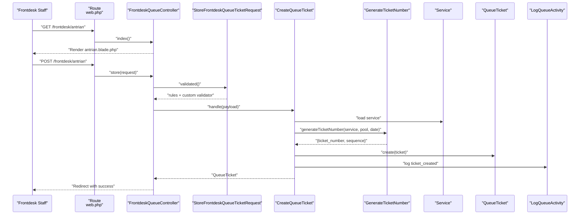
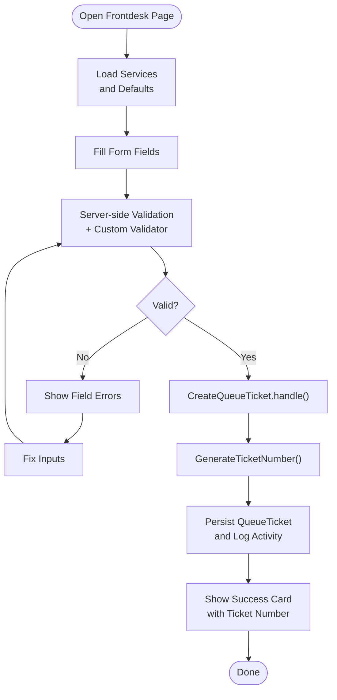
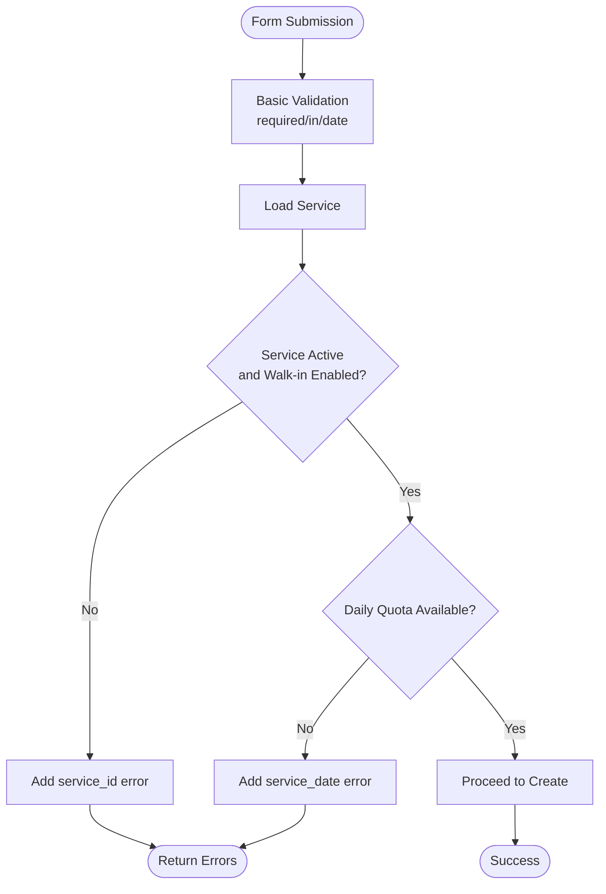
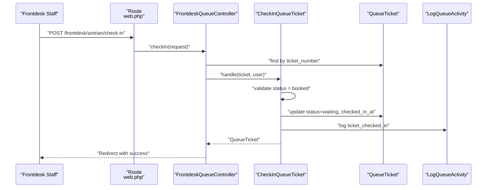
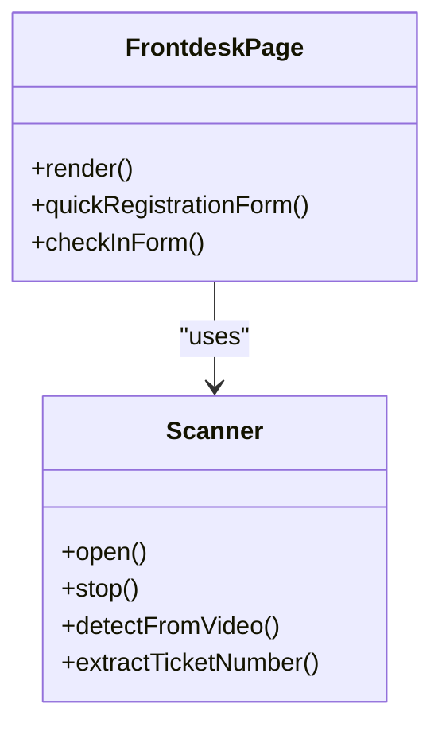
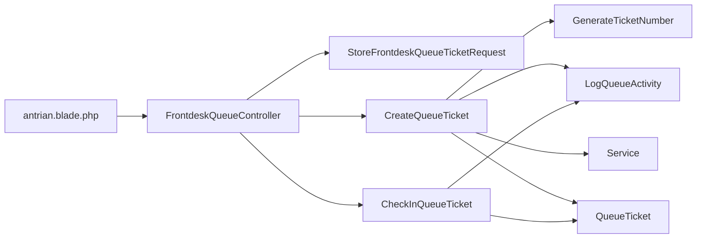

# Walk-in Registration

<cite>
**Referenced Files in This Document**
- [FrontdeskQueueController.php](file://app/Http/Controllers/FrontdeskQueueController.php)
- [StoreFrontdeskQueueTicketRequest.php](file://app/Http/Requests/StoreFrontdeskQueueTicketRequest.php)
- [CreateQueueTicket.php](file://app/Actions/Queue/CreateQueueTicket.php)
- [CheckInQueueTicket.php](file://app/Actions/Queue/CheckInQueueTicket.php)
- [GenerateTicketNumber.php](file://app/Actions/Queue/GenerateTicketNumber.php)
- [LogQueueActivity.php](file://app/Actions/Queue/LogQueueActivity.php)
- [QueueStatus.php](file://app/Enums/QueueStatus.php)
- [QueueTicket.php](file://app/Models/QueueTicket.php)
- [Service.php](file://app/Models/Service.php)
- [antrian.blade.php](file://resources/views/pages/frontdesk/antrian.blade.php)
- [web.php](file://routes/web.php)
- [QueueCheckInTest.php](file://tests/Feature/Frontdesk/QueueCheckInTest.php)
- [AssistedQueueEntryTest.php](file://tests/Feature/Frontdesk/AssistedQueueEntryTest.php)
- [CreateQueueTicketTest.php](file://tests/Feature/Queue/CreateQueueTicketTest.php)
</cite>

## Table of Contents
1. [Introduction](#introduction)
2. [Project Structure](#project-structure)
3. [Core Components](#core-components)
4. [Architecture Overview](#architecture-overview)
5. [Detailed Component Analysis](#detailed-component-analysis)
6. [Dependency Analysis](#dependency-analysis)
7. [Performance Considerations](#performance-considerations)
8. [Troubleshooting Guide](#troubleshooting-guide)
9. [Conclusion](#conclusion)

## Introduction
This document explains the walk-in registration workflow used by frontdesk staff to register visitors who arrive without prior booking. It covers the quick registration flow, service selection, visitor information collection, immediate ticket generation, validation rules, data requirements, business logic, UI components, and error handling. It also includes examples of different visitor scenarios and how the system processes them.

## Project Structure
The walk-in registration spans several layers:
- Routes define the frontdesk endpoints for quick registration and check-in.
- The controller orchestrates requests, delegates to actions, and renders the UI.
- Request validators enforce business rules and data constraints.
- Actions encapsulate ticket creation, check-in, number generation, and activity logging.
- Models represent domain entities and expose helpers for quotas and status.
- Blade templates render the frontdesk UI with form handling and optional scanning.

```mermaid
graph TB
subgraph "HTTP Layer"
R["Routes<br/>web.php"]
C["FrontdeskQueueController<br/>FrontdeskQueueController.php"]
end
subgraph "Validation"
V["StoreFrontdeskQueueTicketRequest<br/>StoreFrontdeskQueueTicketRequest.php"]
end
subgraph "Domain Actions"
A1["CreateQueueTicket<br/>CreateQueueTicket.php"]
A2["CheckInQueueTicket<br/>CheckInQueueTicket.php"]
A3["GenerateTicketNumber<br/>GenerateTicketNumber.php"]
A4["LogQueueActivity<br/>LogQueueActivity.php"]
end
subgraph "Domain Models"
M1["Service<br/>Service.php"]
M2["QueueTicket<br/>QueueTicket.php"]
E1["QueueStatus<br/>QueueStatus.php"]
end
subgraph "UI"
UI["Frontdesk Page<br/>antrian.blade.php"]
end
R --> C
C --> V
C --> A1
C --> A2
A1 --> A3
A1 --> A4
A1 --> M1
A1 --> M2
A1 --> E1
A2 --> M2
A2 --> A4
UI --> R
```

**Diagram sources**
- [web.php:42-46](file://routes/web.php#L42-L46)
- [FrontdeskQueueController.php:16-88](file://app/Http/Controllers/FrontdeskQueueController.php#L16-L88)
- [StoreFrontdeskQueueTicketRequest.php:9-87](file://app/Http/Requests/StoreFrontdeskQueueTicketRequest.php#L9-L87)
- [CreateQueueTicket.php:13-91](file://app/Actions/Queue/CreateQueueTicket.php#L13-L91)
- [CheckInQueueTicket.php:11-44](file://app/Actions/Queue/CheckInQueueTicket.php#L11-L44)
- [GenerateTicketNumber.php:10-31](file://app/Actions/Queue/GenerateTicketNumber.php#L10-L31)
- [LogQueueActivity.php:8-29](file://app/Actions/Queue/LogQueueActivity.php#L8-L29)
- [Service.php:12-101](file://app/Models/Service.php#L12-L101)
- [QueueTicket.php:12-121](file://app/Models/QueueTicket.php#L12-L121)
- [QueueStatus.php:5-38](file://app/Enums/QueueStatus.php#L5-L38)
- [antrian.blade.php:1-426](file://resources/views/pages/frontdesk/antrian.blade.php#L1-L426)

**Section sources**
- [web.php:42-46](file://routes/web.php#L42-L46)
- [FrontdeskQueueController.php:16-88](file://app/Http/Controllers/FrontdeskQueueController.php#L16-L88)
- [antrian.blade.php:1-426](file://resources/views/pages/frontdesk/antrian.blade.php#L1-L426)

## Core Components
- Frontdesk controller: Renders the page, handles quick registration, and processes check-in.
- Validation request: Enforces required fields, channel/service compatibility, and daily quota checks.
- Ticket creation action: Generates ticket number, sets status, persists data, and logs activity.
- Check-in action: Transitions online-booked tickets to waiting and records activity.
- UI template: Provides form fields, conditional logic for service-specific purpose, and optional scanning.

**Section sources**
- [FrontdeskQueueController.php:18-87](file://app/Http/Controllers/FrontdeskQueueController.php#L18-L87)
- [StoreFrontdeskQueueTicketRequest.php:24-66](file://app/Http/Requests/StoreFrontdeskQueueTicketRequest.php#L24-L66)
- [CreateQueueTicket.php:34-89](file://app/Actions/Queue/CreateQueueTicket.php#L34-L89)
- [CheckInQueueTicket.php:17-42](file://app/Actions/Queue/CheckInQueueTicket.php#L17-L42)
- [antrian.blade.php:51-167](file://resources/views/pages/frontdesk/antrian.blade.php#L51-L167)

## Architecture Overview
The walk-in registration follows a layered pattern:
- HTTP routes bind to the frontdesk controller.
- The controller validates input via a dedicated request class.
- Creation and check-in are performed by cohesive actions.
- Domain models encapsulate business rules (e.g., quotas, status).
- The UI renders the form and optionally integrates scanning.



**Diagram sources**
- [web.php:42-46](file://routes/web.php#L42-L46)
- [FrontdeskQueueController.php:44-64](file://app/Http/Controllers/FrontdeskQueueController.php#L44-L64)
- [StoreFrontdeskQueueTicketRequest.php:24-66](file://app/Http/Requests/StoreFrontdeskQueueTicketRequest.php#L24-L66)
- [CreateQueueTicket.php:34-89](file://app/Actions/Queue/CreateQueueTicket.php#L34-L89)
- [GenerateTicketNumber.php:15-29](file://app/Actions/Queue/GenerateTicketNumber.php#L15-L29)
- [Service.php:69-99](file://app/Models/Service.php#L69-L99)
- [QueueTicket.php:17-38](file://app/Models/QueueTicket.php#L17-L38)
- [LogQueueActivity.php:13-27](file://app/Actions/Queue/LogQueueActivity.php#L13-L27)

## Detailed Component Analysis

### Quick Registration Workflow
- Service selection: Dropdown of active services; special handling for a general-purpose service reveals a visit purpose dropdown.
- Visitor information: Name is required; optional identity and phone fields.
- Channel and date: Channel must be one of assisted same day or walk-in kiosk; service date must be today or later.
- Validation: Additional checks ensure the service accepts walk-in, and daily quota is not exceeded.
- Immediate ticket generation: On success, a waiting ticket is created with a generated ticket number and logged activity.



**Diagram sources**
- [antrian.blade.php:59-128](file://resources/views/pages/frontdesk/antrian.blade.php#L59-L128)
- [StoreFrontdeskQueueTicketRequest.php:24-66](file://app/Http/Requests/StoreFrontdeskQueueTicketRequest.php#L24-L66)
- [CreateQueueTicket.php:34-89](file://app/Actions/Queue/CreateQueueTicket.php#L34-L89)
- [GenerateTicketNumber.php:15-29](file://app/Actions/Queue/GenerateTicketNumber.php#L15-L29)
- [LogQueueActivity.php:13-27](file://app/Actions/Queue/LogQueueActivity.php#L13-L27)

**Section sources**
- [antrian.blade.php:51-128](file://resources/views/pages/frontdesk/antrian.blade.php#L51-L128)
- [StoreFrontdeskQueueTicketRequest.php:24-66](file://app/Http/Requests/StoreFrontdeskQueueTicketRequest.php#L24-L66)
- [CreateQueueTicket.php:34-89](file://app/Actions/Queue/CreateQueueTicket.php#L34-L89)

### Validation Rules and Business Logic
- Required fields: service_id, channel, service_date, visitor_name.
- Channel constraints: only assisted same day or walk-in kiosk are accepted for walk-in creation.
- Service eligibility: service must be active and allow walk-in.
- Daily quota: creation fails if the service’s daily quota is full.
- Status derivation: walk-in channels set status to waiting; online bookings set status to booked.
- Visit purpose: shown conditionally for a specific general-purpose service.



**Diagram sources**
- [StoreFrontdeskQueueTicketRequest.php:24-66](file://app/Http/Requests/StoreFrontdeskQueueTicketRequest.php#L24-L66)
- [Service.php:69-99](file://app/Models/Service.php#L69-L99)

**Section sources**
- [StoreFrontdeskQueueTicketRequest.php:24-66](file://app/Http/Requests/StoreFrontdeskQueueTicketRequest.php#L24-L66)
- [Service.php:69-99](file://app/Models/Service.php#L69-L99)

### Check-in Workflow
- Purpose: Convert an online-booked ticket to waiting when the visitor arrives.
- Validation: Only tickets with booked status can be checked in; others produce an error.
- Persistence: Updates status and timestamps, logs activity.



**Diagram sources**
- [web.php:45](file://routes/web.php#L45)
- [FrontdeskQueueController.php:66-87](file://app/Http/Controllers/FrontdeskQueueController.php#L66-L87)
- [CheckInQueueTicket.php:17-42](file://app/Actions/Queue/CheckInQueueTicket.php#L17-L42)
- [QueueStatus.php:7-12](file://app/Enums/QueueStatus.php#L7-L12)
- [LogQueueActivity.php:13-27](file://app/Actions/Queue/LogQueueActivity.php#L13-L27)

**Section sources**
- [FrontdeskQueueController.php:66-87](file://app/Http/Controllers/FrontdeskQueueController.php#L66-L87)
- [CheckInQueueTicket.php:17-42](file://app/Actions/Queue/CheckInQueueTicket.php#L17-L42)
- [QueueStatus.php:7-12](file://app/Enums/QueueStatus.php#L7-L12)

### User Interface Components and Form Handling
- Service selector: Dropdown populated from active services.
- Visit purpose: Conditional dropdown shown only for a general-purpose service.
- Channel selector: Assisted same day or walk-in kiosk.
- Service date: Date picker defaulted to today.
- Visitor info: Name (required), optional identity and phone.
- Notes: Optional free text.
- Check-in form: Manual entry or scanning via modal with camera detection and keyboard buffer support.



**Diagram sources**
- [antrian.blade.php:51-167](file://resources/views/pages/frontdesk/antrian.blade.php#L51-L167)
- [antrian.blade.php:169-191](file://resources/views/pages/frontdesk/antrian.blade.php#L169-L191)

**Section sources**
- [antrian.blade.php:51-167](file://resources/views/pages/frontdesk/antrian.blade.php#L51-L167)

### Examples of Visitor Scenarios
- General visitor with a general-purpose service:
  - Select general-purpose service → visit purpose dropdown appears → choose purpose → submit → ticket created with waiting status.
- Visitor with a specialized service:
  - Choose specialized service → no purpose dropdown → submit → ticket created with waiting status.
- Full daily quota:
  - Attempt to register when quota is full → validation error for service date → prevent creation.
- Non-walk-in-enabled service:
  - Select service that does not accept walk-in → validation error for service_id → prevent creation.
- Online booking check-in:
  - Enter a valid online-booked ticket number → check-in succeeds → status transitions to waiting.

**Section sources**
- [AssistedQueueEntryTest.php:44-82](file://tests/Feature/Frontdesk/AssistedQueueEntryTest.php#L44-L82)
- [QueueCheckInTest.php:44-65](file://tests/Feature/Frontdesk/QueueCheckInTest.php#L44-L65)
- [CreateQueueTicketTest.php:41-86](file://tests/Feature/Queue/CreateQueueTicketTest.php#L41-L86)

## Dependency Analysis
- Controller depends on:
  - Request validator for input rules and custom checks.
  - CreateQueueTicket action for persistence and number generation.
  - CheckInQueueTicket action for status transitions.
- Actions depend on:
  - Service model for eligibility and quota checks.
  - QueueTicket model for persistence and status helpers.
  - Enum for status values.
  - LogQueueActivity for audit trail.
- UI depends on:
  - Routes and controller to render and submit forms.
  - Optional JavaScript for scanning and keyboard input.



**Diagram sources**
- [FrontdeskQueueController.php:44-87](file://app/Http/Controllers/FrontdeskQueueController.php#L44-L87)
- [StoreFrontdeskQueueTicketRequest.php:24-66](file://app/Http/Requests/StoreFrontdeskQueueTicketRequest.php#L24-L66)
- [CreateQueueTicket.php:15-18](file://app/Actions/Queue/CreateQueueTicket.php#L15-L18)
- [CheckInQueueTicket.php:13-15](file://app/Actions/Queue/CheckInQueueTicket.php#L13-L15)
- [GenerateTicketNumber.php:15-29](file://app/Actions/Queue/GenerateTicketNumber.php#L15-L29)
- [LogQueueActivity.php:13-27](file://app/Actions/Queue/LogQueueActivity.php#L13-L27)
- [Service.php:69-99](file://app/Models/Service.php#L69-L99)
- [QueueTicket.php:17-38](file://app/Models/QueueTicket.php#L17-L38)
- [antrian.blade.php:51-167](file://resources/views/pages/frontdesk/antrian.blade.php#L51-L167)

**Section sources**
- [FrontdeskQueueController.php:44-87](file://app/Http/Controllers/FrontdeskQueueController.php#L44-L87)
- [CreateQueueTicket.php:15-18](file://app/Actions/Queue/CreateQueueTicket.php#L15-L18)
- [CheckInQueueTicket.php:13-15](file://app/Actions/Queue/CheckInQueueTicket.php#L13-L15)

## Performance Considerations
- Transaction boundaries: Creation and check-in wrap writes in transactions to maintain consistency.
- Minimal queries: Number generation fetches the maximum sequence per pool and date; quota checks leverage model helpers.
- UI responsiveness: Camera scanning runs on animation frames and stops resources on unload.

[No sources needed since this section provides general guidance]

## Troubleshooting Guide
Common issues and resolutions:
- Validation errors on required fields:
  - Ensure service, channel, service date, and visitor name are filled; fix invalid selections or formats.
- Service not accepting walk-in:
  - The selected service must be active and have walk-in enabled; choose another service.
- Daily quota full:
  - Cannot create a new walk-in ticket for the selected service on the chosen date; select another date or service.
- Check-in failure for non-booked tickets:
  - Only tickets with booked status can be checked in; verify the ticket number and status.
- Camera or scanner not working:
  - Browser may lack barcode detection or camera permissions; use manual input or a USB scanner.

**Section sources**
- [StoreFrontdeskQueueTicketRequest.php:73-86](file://app/Http/Requests/StoreFrontdeskQueueTicketRequest.php#L73-L86)
- [QueueCheckInTest.php:44-65](file://tests/Feature/Frontdesk/QueueCheckInTest.php#L44-L65)
- [antrian.blade.php:194-424](file://resources/views/pages/frontdesk/antrian.blade.php#L194-L424)

## Conclusion
The walk-in registration system provides a streamlined path for frontdesk staff to quickly register arriving visitors. It enforces robust validation, respects service capabilities and daily quotas, generates tickets immediately, and offers optional scanning for efficient check-in. The modular design keeps concerns separated and facilitates maintainability and testing.