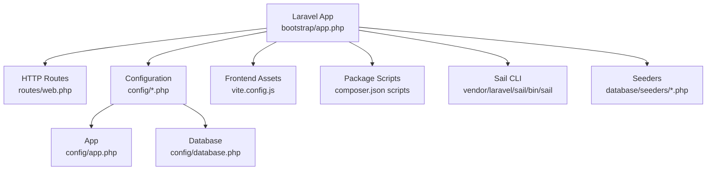
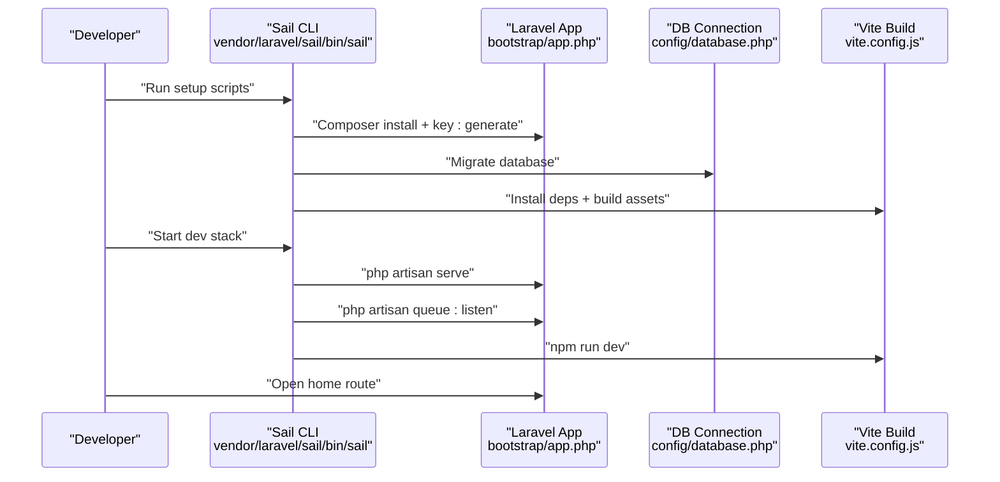
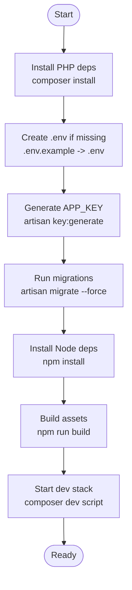
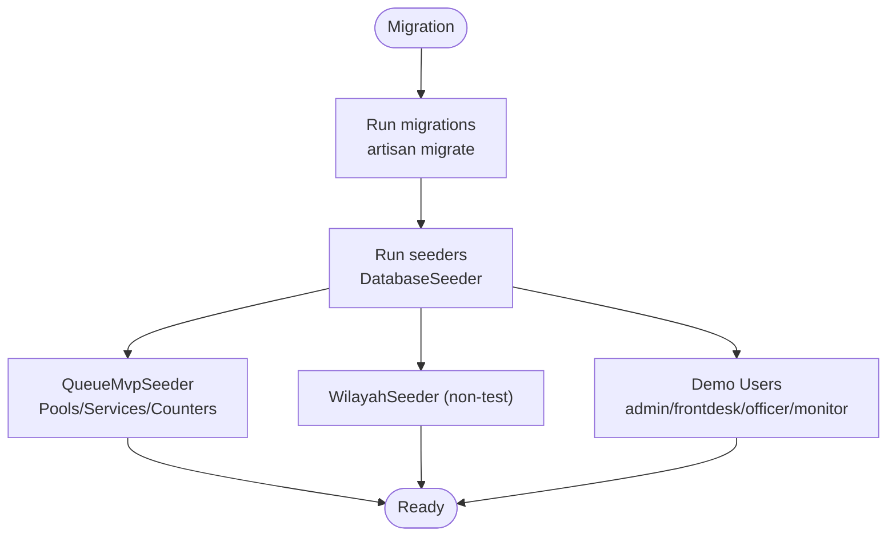
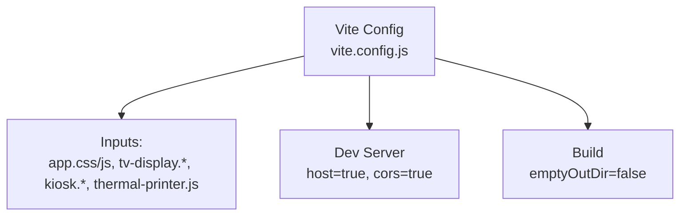
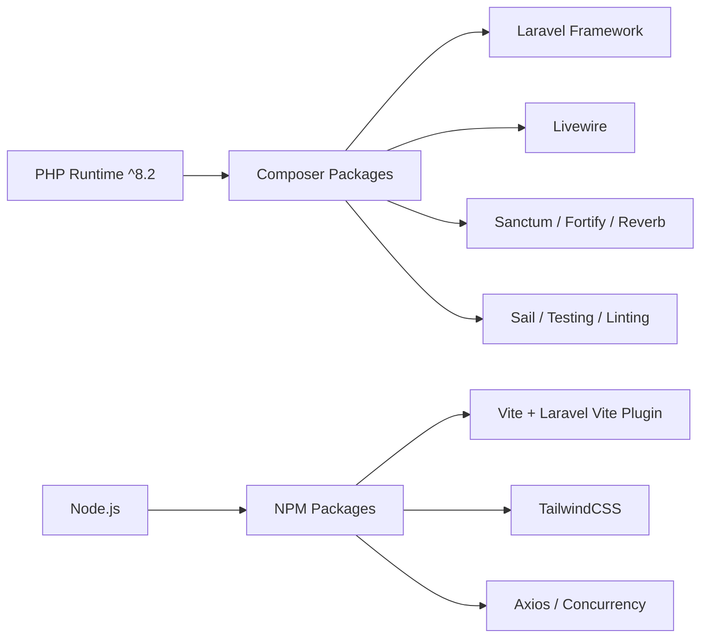

# Getting Started

<cite>
**Referenced Files in This Document**
- [composer.json](file://composer.json)
- [package.json](file://package.json)
- [config/app.php](file://config/app.php)
- [config/database.php](file://config/database.php)
- [bootstrap/app.php](file://bootstrap/app.php)
- [routes/web.php](file://routes/web.php)
- [vendor/laravel/sail/bin/sail](file://vendor/laravel/sail/bin/sail)
- [database/seeders/DatabaseSeeder.php](file://database/seeders/DatabaseSeeder.php)
- [database/seeders/QueueMvpSeeder.php](file://database/seeders/QueueMvpSeeder.php)
- [vite.config.js](file://vite.config.js)
</cite>

## Table of Contents
1. [Introduction](#introduction)
2. [Project Structure](#project-structure)
3. [Core Components](#core-components)
4. [Architecture Overview](#architecture-overview)
5. [Detailed Component Analysis](#detailed-component-analysis)
6. [Dependency Analysis](#dependency-analysis)
7. [Performance Considerations](#performance-considerations)
8. [Troubleshooting Guide](#troubleshooting-guide)
9. [Conclusion](#conclusion)
10. [Appendices](#appendices)

## Introduction
This guide helps you install, configure, and run the PTSP Queue Management System locally. It covers prerequisites, environment setup with Laravel Sail, database migration and seeding, asset compilation, and first-run verification. It also includes troubleshooting tips for common issues.

## Project Structure
The application is a Laravel 12 project with Livewire UI components, Vite-powered frontend assets, and modular routing for Admin, Frontdesk, Officer, Kiosk, and TV Display modules. Laravel Sail provides a Docker-based local environment.

**Diagram sources**
- [bootstrap/app.php:1-32](file://bootstrap/app.php#L1-L32)
- [routes/web.php:1-127](file://routes/web.php#L1-L127)
- [config/app.php:1-127](file://config/app.php#L1-L127)
- [config/database.php:1-185](file://config/database.php#L1-L185)
- [vite.config.js:1-37](file://vite.config.js#L1-L37)
- [composer.json:53-99](file://composer.json#L53-L99)
- [vendor/laravel/sail/bin/sail:1-633](file://vendor/laravel/sail/bin/sail#L1-L633)
- [database/seeders/DatabaseSeeder.php:1-47](file://database/seeders/DatabaseSeeder.php#L1-L47)
- [database/seeders/QueueMvpSeeder.php:1-130](file://database/seeders/QueueMvpSeeder.php#L1-L130)

**Section sources**
- [bootstrap/app.php:1-32](file://bootstrap/app.php#L1-L32)
- [routes/web.php:1-127](file://routes/web.php#L1-L127)
- [config/app.php:1-127](file://config/app.php#L1-L127)
- [config/database.php:1-185](file://config/database.php#L1-L185)
- [vite.config.js:1-37](file://vite.config.js#L1-L37)
- [composer.json:53-99](file://composer.json#L53-L99)
- [vendor/laravel/sail/bin/sail:1-633](file://vendor/laravel/sail/bin/sail#L1-L633)
- [database/seeders/DatabaseSeeder.php:1-47](file://database/seeders/DatabaseSeeder.php#L1-L47)
- [database/seeders/QueueMvpSeeder.php:1-130](file://database/seeders/QueueMvpSeeder.php#L1-L130)

## Core Components
- Backend framework: Laravel 12 with Livewire UI components.
- Package manager: Composer for PHP dependencies and NPM for Node.js packages.
- Asset pipeline: Vite with Laravel Vite Plugin and TailwindCSS.
- Local environment: Laravel Sail (Docker) with optional database choices (SQLite, MySQL, MariaDB, PostgreSQL, SQL Server).
- Routing: Modular routes for Admin, Frontdesk, Officer, Kiosk, and TV Display modules.
- Seeding: Demo users and initial services/counters/pools for MVP.

**Section sources**
- [composer.json:11-34](file://composer.json#L11-L34)
- [package.json:1-28](file://package.json#L1-L28)
- [config/database.php:20-116](file://config/database.php#L20-L116)
- [routes/web.php:1-127](file://routes/web.php#L1-L127)
- [database/seeders/DatabaseSeeder.php:15-45](file://database/seeders/DatabaseSeeder.php#L15-L45)
- [database/seeders/QueueMvpSeeder.php:15-128](file://database/seeders/QueueMvpSeeder.php#L15-L128)

## Architecture Overview
High-level runtime flow for local development and first-run tasks.

**Diagram sources**
- [composer.json:53-65](file://composer.json#L53-L65)
- [vendor/laravel/sail/bin/sail:264-286](file://vendor/laravel/sail/bin/sail#L264-L286)
- [config/database.php:20-116](file://config/database.php#L20-L116)
- [vite.config.js:1-37](file://vite.config.js#L1-L37)

## Detailed Component Analysis

### Prerequisites
- PHP: ^8.2 (required by Composer)
- Node.js: Required for asset compilation and dev server
- Docker: Required for Laravel Sail
- Operating system: Sail supports macOS, Linux, and Windows WSL2

Environment variables and defaults:
- Application name, environment, debug, URL, timezone, locale, encryption key, maintenance driver/store
- Database default connection is SQLite by default; MySQL/MariaDB/PostgreSQL/SQL Server supported
- Redis client, port, database indices, and retry/backoff options

**Section sources**
- [composer.json:12](file://composer.json#L12)
- [vendor/laravel/sail/bin/sail:1-16](file://vendor/laravel/sail/bin/sail#L1-L16)
- [config/app.php:16-124](file://config/app.php#L16-L124)
- [config/database.php:20-182](file://config/database.php#L20-L182)

### Step-by-Step Installation
1. Install dependencies
   - Composer: Install PHP dependencies
   - NPM: Install Node.js dependencies
2. Generate application key
3. Run database migrations
4. Compile assets
5. Start the development stack

**Diagram sources**
- [composer.json:53-65](file://composer.json#L53-L65)
- [composer.json:54-60](file://composer.json#L54-L60)

**Section sources**
- [composer.json:53-65](file://composer.json#L53-L65)
- [composer.json:54-60](file://composer.json#L54-L60)

### Environment Configuration
- Default database connection is SQLite unless overridden by environment variables.
- Supported drivers: sqlite, mysql, mariadb, pgsql, sqlsrv.
- Redis options include client type, cluster, prefix, persistence, and retry/backoff settings.
- Application configuration keys include name, environment, debug, URL, timezone, locale, cipher/key, and maintenance settings.

Set these in your environment:
- DB_CONNECTION, DB_HOST, DB_PORT, DB_DATABASE, DB_USERNAME, DB_PASSWORD
- APP_URL, APP_ENV, APP_DEBUG, APP_KEY
- REDIS_* variables as needed

**Section sources**
- [config/database.php:20-116](file://config/database.php#L20-L116)
- [config/database.php:146-182](file://config/database.php#L146-L182)
- [config/app.php:16-124](file://config/app.php#L16-L124)

### Development Environment Setup with Laravel Sail
- Start the stack: use Sail to bring up the application and related services.
- Access the app via configured APP_URL or Sail’s exposed port.
- Use Sail to run Artisan commands, Composer, Node/npm, and database clients.

Common Sail commands:
- Start/stop/restart services
- Run Artisan commands inside the container
- Run tests via Artisan
- Open the site in a browser
- Connect to MySQL/MariaDB/PostgreSQL/Redis/MongoDB/Valkey shells

**Section sources**
- [vendor/laravel/sail/bin/sail:41-122](file://vendor/laravel/sail/bin/sail#L41-L122)
- [vendor/laravel/sail/bin/sail:264-286](file://vendor/laravel/sail/bin/sail#L264-L286)
- [vendor/laravel/sail/bin/sail:388-422](file://vendor/laravel/sail/bin/sail#L388-L422)
- [vendor/laravel/sail/bin/sail:484-521](file://vendor/laravel/sail/bin/sail#L484-L521)
- [vendor/laravel/sail/bin/sail:559-581](file://vendor/laravel/sail/bin/sail#L559-L581)

### Database Migration and Seeding
- Migrations: Run during setup to create and update schema.
- Seeders:
  - QueueMvpSeeder: Creates queue pools, services, and counters for MVP.
  - WilayahSeeder: Region-related data (conditionally runs outside unit tests).
  - Demo users: Creates default Administrator, Frontdesk Demo, Officer Demo, Monitor Demo with a shared password.

**Diagram sources**
- [composer.json:58](file://composer.json#L58)
- [database/seeders/DatabaseSeeder.php:15-45](file://database/seeders/DatabaseSeeder.php#L15-L45)
- [database/seeders/QueueMvpSeeder.php:15-128](file://database/seeders/QueueMvpSeeder.php#L15-L128)

**Section sources**
- [composer.json:58](file://composer.json#L58)
- [database/seeders/DatabaseSeeder.php:15-45](file://database/seeders/DatabaseSeeder.php#L15-L45)
- [database/seeders/QueueMvpSeeder.php:15-128](file://database/seeders/QueueMvpSeeder.php#L15-L128)

### Asset Compilation
- Vite configuration registers inputs for app, TV display, kiosk, and thermal printer assets.
- Development server exposes HMR and CORS for frontend iteration.
- Production build is handled by Vite with Laravel Vite Plugin.

**Diagram sources**
- [vite.config.js:1-37](file://vite.config.js#L1-L37)

**Section sources**
- [vite.config.js:1-37](file://vite.config.js#L1-L37)

### First-Run Instructions
- Default credentials:
  - Administrator: admin@example.com / password
  - Frontdesk Demo: frontdesk@example.com / password
  - Officer Demo: officer@example.com / password
  - Monitor Demo: monitor@example.com / password
- Initial data:
  - Queue pools, services, counters, and regions are seeded automatically during setup.
- Basic system verification:
  - Visit the home route to confirm the public queue interface.
  - Navigate to module-specific routes (Admin, Frontdesk, Officer, Kiosk, TV Display) after logging in.
  - Confirm TV Display and Kiosk login routes are accessible.

**Section sources**
- [database/seeders/DatabaseSeeder.php:27-44](file://database/seeders/DatabaseSeeder.php#L27-L44)
- [routes/web.php:18-124](file://routes/web.php#L18-L124)

## Dependency Analysis
- PHP dependencies managed by Composer (e.g., Laravel framework, Livewire, Sanctum, Reverb, Fortify).
- Dev dependencies include Laravel Sail, testing frameworks, linting, and debugging tools.
- Node dependencies include Vite, Laravel Vite Plugin, TailwindCSS, Axios, and concurrency helpers.

**Diagram sources**
- [composer.json:11-34](file://composer.json#L11-L34)
- [composer.json:24-34](file://composer.json#L24-L34)
- [package.json:1-28](file://package.json#L1-L28)

**Section sources**
- [composer.json:11-34](file://composer.json#L11-L34)
- [composer.json:24-34](file://composer.json#L24-L34)
- [package.json:1-28](file://package.json#L1-L28)

## Performance Considerations
- Use Sail for consistent environments and avoid local drift.
- Keep asset builds optimized; avoid unnecessary rebuilds by leveraging Vite HMR.
- Prefer SQLite for local development simplicity; switch to MySQL/MariaDB/PostgreSQL for production-like testing.
- Tune Redis settings (client, retries, backoff) for queue and caching workloads.

## Troubleshooting Guide
- Docker not running
  - Sail requires Docker to be installed and running. Start Docker and retry Sail commands.
- Sail is not running
  - Use Sail to start the stack; Sail will print helpful guidance if the service is not up.
- Port conflicts
  - Adjust APP_PORT or stop conflicting services if the default port is in use.
- Database connection errors
  - Verify DB_CONNECTION and related DB_* variables match your chosen backend.
  - For SQLite, ensure the database file path is writable.
- Asset build failures
  - Reinstall Node dependencies and rebuild assets.
- Queue worker not processing jobs
  - Ensure the queue listener is running alongside the server in dev mode.
- Authentication and roles
  - Use the seeded demo users and verify role middleware allows access to intended routes.

**Section sources**
- [vendor/laravel/sail/bin/sail:157-164](file://vendor/laravel/sail/bin/sail#L157-L164)
- [vendor/laravel/sail/bin/sail:190-208](file://vendor/laravel/sail/bin/sail#L190-L208)
- [config/database.php:20-116](file://config/database.php#L20-L116)
- [package.json:1-28](file://package.json#L1-L28)
- [composer.json:62-65](file://composer.json#L62-L65)
- [routes/web.php:28-90](file://routes/web.php#L28-L90)

## Conclusion
You now have the prerequisites, environment setup, and first-run steps to launch the PTSP Queue Management System locally. Use Laravel Sail for a reproducible environment, run migrations and seeders for initial data, compile assets, and verify module access with the provided demo credentials.

## Appendices
- Quick commands
  - Install deps and run setup: composer install, copy .env.example to .env, generate key, migrate, npm install, npm run build
  - Start dev stack: composer dev script (runs server, queue listener, and Vite dev)
  - Run tests: composer test
  - Open site: Sail open

**Section sources**
- [composer.json:54-65](file://composer.json#L54-L65)
- [vendor/laravel/sail/bin/sail:604-628](file://vendor/laravel/sail/bin/sail#L604-L628)