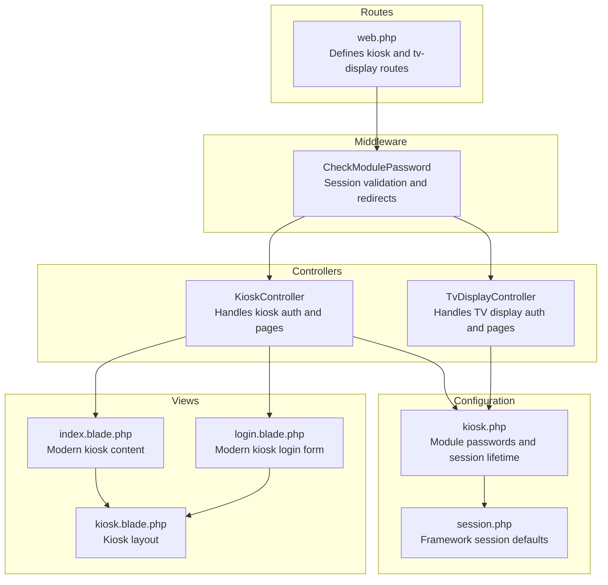
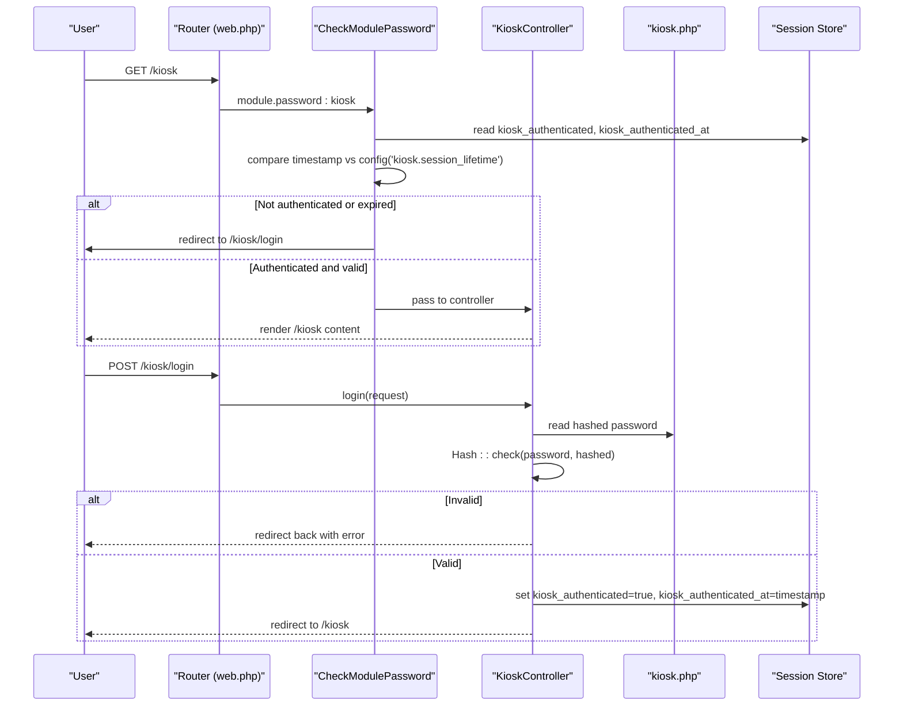
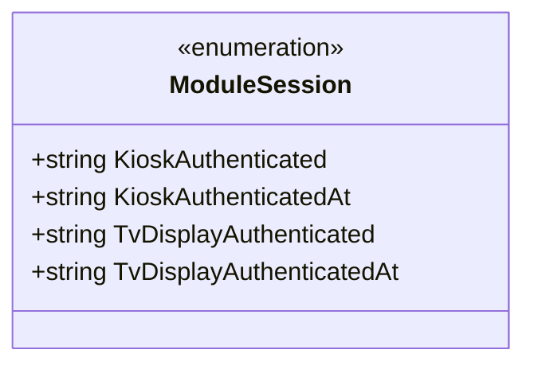
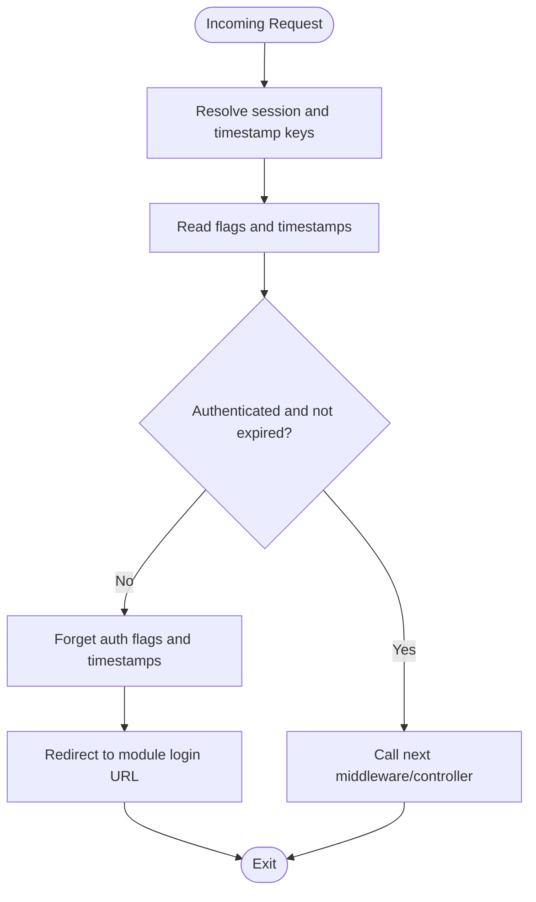
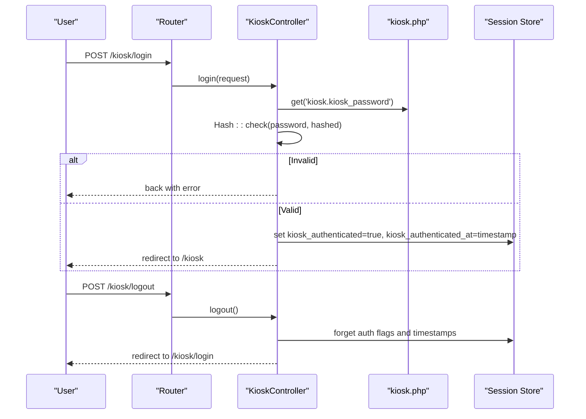
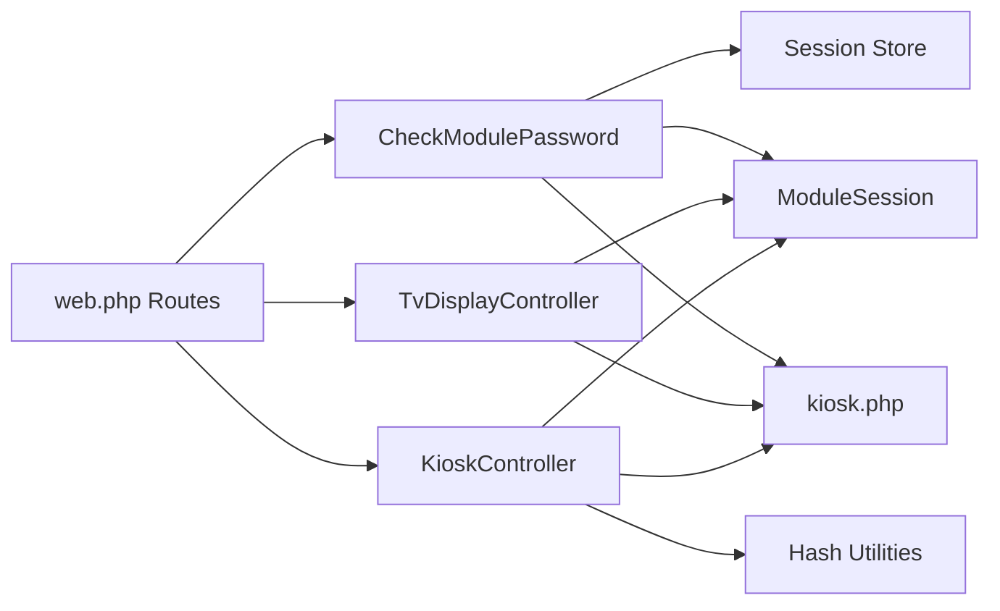

# Kiosk Authentication System

<cite>
**Referenced Files in This Document**
- [CheckModulePassword.php](file://app/Http/Middleware/CheckModulePassword.php)
- [ModuleSession.php](file://app/Enums/ModuleSession.php)
- [KioskController.php](file://app/Http/Controllers/KioskController.php)
- [TvDisplayController.php](file://app/Http/Controllers/TvDisplayController.php)
- [kiosk.php](file://config/kiosk.php)
- [session.php](file://config/session.php)
- [web.php](file://routes/web.php)
- [login.blade.php](file://resources/views/pages/kiosk/login.blade.php)
- [index.blade.php](file://resources/views/pages/kiosk/index.blade.php)
- [kiosk.blade.php](file://resources/views/layouts/kiosk.blade.php)
- [KioskAuthTest.php](file://tests/Feature/Kiosk/KioskAuthTest.php)
</cite>

## Table of Contents
1. [Introduction](#introduction)
2. [Project Structure](#project-structure)
3. [Core Components](#core-components)
4. [Architecture Overview](#architecture-overview)
5. [Detailed Component Analysis](#detailed-component-analysis)
6. [Dependency Analysis](#dependency-analysis)
7. [Performance Considerations](#performance-considerations)
8. [Troubleshooting Guide](#troubleshooting-guide)
9. [Conclusion](#conclusion)

## Introduction
This document describes the Kiosk Authentication System used for password-based access to kiosk and TV display modules. It explains the hashed password validation process, session management using ModuleSession enums, authentication state handling, differences between modern and legacy flows, error handling for invalid credentials, session timeout mechanisms, security considerations, session cleanup, and middleware integration. It also provides troubleshooting guidance and security best practices tailored for kiosk environments.

## Project Structure
The authentication system spans controllers, middleware, configuration, routes, and Blade views. Key areas:
- Controllers handle login, logout, and module-specific pages
- Middleware enforces session validity and redirects unauthenticated requests
- Configuration defines password hashes and session lifetimes
- Routes register both modern and legacy endpoints
- Views render login pages and protected content

**Diagram sources**
- [web.php:92-124](file://routes/web.php#L92-L124)
- [CheckModulePassword.php:17-33](file://app/Http/Middleware/CheckModulePassword.php#L17-L33)
- [KioskController.php:25-45](file://app/Http/Controllers/KioskController.php#L25-L45)
- [TvDisplayController.php:23-43](file://app/Http/Controllers/TvDisplayController.php#L23-L43)
- [kiosk.php:1-8](file://config/kiosk.php#L1-L8)
- [session.php:21-37](file://config/session.php#L21-L37)
- [login.blade.php:49-85](file://resources/views/pages/kiosk/login.blade.php#L49-L85)
- [index.blade.php:1-4](file://resources/views/pages/kiosk/index.blade.php#L1-L4)
- [kiosk.blade.php:1-67](file://resources/views/layouts/kiosk.blade.php#L1-L67)

**Section sources**
- [web.php:92-124](file://routes/web.php#L92-L124)
- [CheckModulePassword.php:17-33](file://app/Http/Middleware/CheckModulePassword.php#L17-L33)
- [KioskController.php:25-45](file://app/Http/Controllers/KioskController.php#L25-L45)
- [TvDisplayController.php:23-43](file://app/Http/Controllers/TvDisplayController.php#L23-L43)
- [kiosk.php:1-8](file://config/kiosk.php#L1-L8)
- [session.php:21-37](file://config/session.php#L21-L37)
- [login.blade.php:49-85](file://resources/views/pages/kiosk/login.blade.php#L49-L85)
- [index.blade.php:1-4](file://resources/views/pages/kiosk/index.blade.php#L1-L4)
- [kiosk.blade.php:1-67](file://resources/views/layouts/kiosk.blade.php#L1-L67)

## Core Components
- ModuleSession enum: Centralized session key constants for kiosk and TV display authentication flags and timestamps
- CheckModulePassword middleware: Validates session state and enforces session lifetime
- KioskController: Handles kiosk login/logout and modern/legacy flows
- TvDisplayController: Handles TV display login/logout and modern/legacy flows
- Configuration: kiosk.php defines module passwords and session lifetime; session.php defines framework session defaults
- Routes: Register authentication endpoints and protected routes under module.password middleware

Key responsibilities:
- Password hashing and verification using framework hash utilities
- Session creation and cleanup using ModuleSession keys
- Redirects to appropriate login URLs based on module
- Throttling to mitigate brute-force attempts

**Section sources**
- [ModuleSession.php:8-14](file://app/Enums/ModuleSession.php#L8-L14)
- [CheckModulePassword.php:17-33](file://app/Http/Middleware/CheckModulePassword.php#L17-L33)
- [KioskController.php:25-45](file://app/Http/Controllers/KioskController.php#L25-L45)
- [TvDisplayController.php:23-43](file://app/Http/Controllers/TvDisplayController.php#L23-L43)
- [kiosk.php:1-8](file://config/kiosk.php#L1-L8)
- [session.php:21-37](file://config/session.php#L21-L37)
- [web.php:92-124](file://routes/web.php#L92-L124)

## Architecture Overview
The system uses a layered approach:
- Presentation: Blade views for login and content
- Routing: Route definitions with middleware groups
- Authentication: Module-specific controllers validating hashed passwords
- Session Management: Middleware checking session flags and timestamps
- Configuration: Environment-driven passwords and session lifetimes

**Diagram sources**
- [web.php:92-98](file://routes/web.php#L92-L98)
- [CheckModulePassword.php:17-33](file://app/Http/Middleware/CheckModulePassword.php#L17-L33)
- [KioskController.php:25-45](file://app/Http/Controllers/KioskController.php#L25-L45)
- [kiosk.php:1-8](file://config/kiosk.php#L1-L8)

## Detailed Component Analysis

### ModuleSession Enum
The enum centralizes session key naming for authentication flags and timestamps, ensuring consistency across kiosk and TV display modules.

**Diagram sources**
- [ModuleSession.php:8-14](file://app/Enums/ModuleSession.php#L8-L14)

**Section sources**
- [ModuleSession.php:8-14](file://app/Enums/ModuleSession.php#L8-L14)

### CheckModulePassword Middleware
Responsibilities:
- Resolves session and timestamp keys based on module
- Reads authentication flags and timestamps from session
- Enforces session lifetime using config('kiosk.session_lifetime')
- Clears invalid/expired session data and redirects to module login URL
- Allows request to proceed if authenticated and not expired

**Diagram sources**
- [CheckModulePassword.php:17-33](file://app/Http/Middleware/CheckModulePassword.php#L17-L33)
- [CheckModulePassword.php:38-66](file://app/Http/Middleware/CheckModulePassword.php#L38-L66)

**Section sources**
- [CheckModulePassword.php:17-33](file://app/Http/Middleware/CheckModulePassword.php#L17-L33)
- [CheckModulePassword.php:38-66](file://app/Http/Middleware/CheckModulePassword.php#L38-L66)

### KioskController: Modern and Legacy Flows
Modern flow:
- Login endpoint validates password against hashed value from configuration
- On success, sets authentication flags and timestamp in session
- Redirects to kiosk index page

Legacy flow:
- Mirrors modern behavior but targets legacy endpoints and views
- Used for older devices without modern frontend frameworks

Additional behaviors:
- Logout clears authentication flags and timestamps
- Index page renders the kiosk booking interface

**Diagram sources**
- [KioskController.php:25-45](file://app/Http/Controllers/KioskController.php#L25-L45)
- [web.php:92-98](file://routes/web.php#L92-L98)
- [kiosk.php:1-8](file://config/kiosk.php#L1-L8)

**Section sources**
- [KioskController.php:25-45](file://app/Http/Controllers/KioskController.php#L25-L45)
- [KioskController.php:47-52](file://app/Http/Controllers/KioskController.php#L47-L52)
- [KioskController.php:54-57](file://app/Http/Controllers/KioskController.php#L54-L57)
- [KioskController.php:59-84](file://app/Http/Controllers/KioskController.php#L59-L84)
- [web.php:92-98](file://routes/web.php#L92-L98)
- [kiosk.php:1-8](file://config/kiosk.php#L1-L8)

### TvDisplayController: Modern and Legacy Flows
Similar pattern to KioskController but for TV display:
- Uses TV display password from configuration
- Sets TV display authentication flags and timestamps
- Provides legacy endpoints for older devices

**Section sources**
- [TvDisplayController.php:23-43](file://app/Http/Controllers/TvDisplayController.php#L23-L43)
- [TvDisplayController.php:45-50](file://app/Http/Controllers/TvDisplayController.php#L45-L50)
- [TvDisplayController.php:57-82](file://app/Http/Controllers/TvDisplayController.php#L57-L82)
- [web.php:108-114](file://routes/web.php#L108-L114)
- [web.php:117-124](file://routes/web.php#L117-L124)

### Configuration and Session Lifetime
- kiosk.php:
  - Defines module passwords for kiosk and TV display
  - Defines session lifetime in minutes
- session.php:
  - Framework session defaults (driver, lifetime, cookie policies)
  - Separate from module session lifetime; module middleware overrides per-module

**Section sources**
- [kiosk.php:1-8](file://config/kiosk.php#L1-L8)
- [session.php:21-37](file://config/session.php#L21-L37)
- [CheckModulePassword.php:24](file://app/Http/Middleware/CheckModulePassword.php#L24)

### Views and Layouts
- Modern login view renders a password field with CSRF protection and error display
- Kiosk layout provides shared styling and scripts for kiosk pages
- Index view hosts the kiosk booking Livewire component

**Section sources**
- [login.blade.php:49-85](file://resources/views/pages/kiosk/login.blade.php#L49-L85)
- [kiosk.blade.php:1-67](file://resources/views/layouts/kiosk.blade.php#L1-L67)
- [index.blade.php:1-4](file://resources/views/pages/kiosk/index.blade.php#L1-L4)

## Dependency Analysis
- Controllers depend on:
  - Hash utilities for password verification
  - Configuration for hashed passwords and session lifetime
  - ModuleSession enum for consistent session keys
- Middleware depends on:
  - ModuleSession enum for session key resolution
  - Configuration for session lifetime
  - Session store for flags and timestamps
- Routes depend on:
  - Middleware registration for module.password
  - Controller actions for handling requests

**Diagram sources**
- [KioskController.php:15](file://app/Http/Controllers/KioskController.php#L15)
- [TvDisplayController.php:12](file://app/Http/Controllers/TvDisplayController.php#L12)
- [CheckModulePassword.php:5-6](file://app/Http/Middleware/CheckModulePassword.php#L5-L6)
- [web.php:92-124](file://routes/web.php#L92-L124)

**Section sources**
- [KioskController.php:15](file://app/Http/Controllers/KioskController.php#L15)
- [TvDisplayController.php:12](file://app/Http/Controllers/TvDisplayController.php#L12)
- [CheckModulePassword.php:5-6](file://app/Http/Middleware/CheckModulePassword.php#L5-L6)
- [web.php:92-124](file://routes/web.php#L92-L124)

## Performance Considerations
- Hash verification cost: Password checks are constant-time comparisons after hashing; ensure passwords are properly hashed at rest
- Session reads/writes: Minimal overhead; avoid excessive session writes outside login/logout
- Middleware evaluation: Single pass per request; keep session keys short and consistent
- Throttling: Built-in throttling on authentication endpoints reduces load during brute-force attempts
- Session lifetime: Shorter lifetimes reduce stale session accumulation; adjust based on operational needs

## Troubleshooting Guide
Common issues and resolutions:
- Invalid credentials:
  - Symptom: Redirect back to login with error message
  - Cause: Hash mismatch or empty configured password
  - Resolution: Verify environment variables and ensure password is hashed
  - Evidence: Tests assert redirect with errors and missing authenticated flags
- Unauthenticated access:
  - Symptom: Redirect to module login
  - Cause: Missing or cleared authentication flags
  - Resolution: Ensure login succeeds and session is set
  - Evidence: Tests assert redirect to login and session clearing on logout
- Expired session:
  - Symptom: Automatic redirect to login after session lifetime
  - Cause: Timestamp older than configured lifetime
  - Resolution: Adjust kiosk.session_lifetime or re-authenticate
  - Evidence: Middleware compares timestamp against config value
- Legacy device behavior:
  - Symptom: Different endpoints and views
  - Cause: Legacy routes and controllers
  - Resolution: Use legacy endpoints for older devices

Security best practices:
- Use strong, randomly generated hashed passwords for kiosk and TV display
- Regularly rotate module passwords and update environment variables
- Limit session lifetime to minimize exposure windows
- Apply network-level controls (firewalls, VLANs) around kiosk/TV devices
- Monitor authentication failures and throttle thresholds
- Ensure HTTPS and secure cookie settings for production deployments

**Section sources**
- [KioskAuthTest.php:35-46](file://tests/Feature/Kiosk/KioskAuthTest.php#L35-L46)
- [KioskAuthTest.php:48-57](file://tests/Feature/Kiosk/KioskAuthTest.php#L48-L57)
- [KioskAuthTest.php:6-12](file://tests/Feature/Kiosk/KioskAuthTest.php#L6-L12)
- [CheckModulePassword.php:24](file://app/Http/Middleware/CheckModulePassword.php#L24)
- [web.php:94](file://routes/web.php#L94)
- [web.php:102](file://routes/web.php#L102)

## Conclusion
The Kiosk Authentication System provides a robust, module-specific authentication mechanism using hashed passwords and session-based state management. The CheckModulePassword middleware ensures session validity and enforces configurable timeouts, while controllers implement consistent login/logout flows for both modern and legacy devices. Proper configuration, session cleanup, and security practices are essential for reliable operation in kiosk environments.