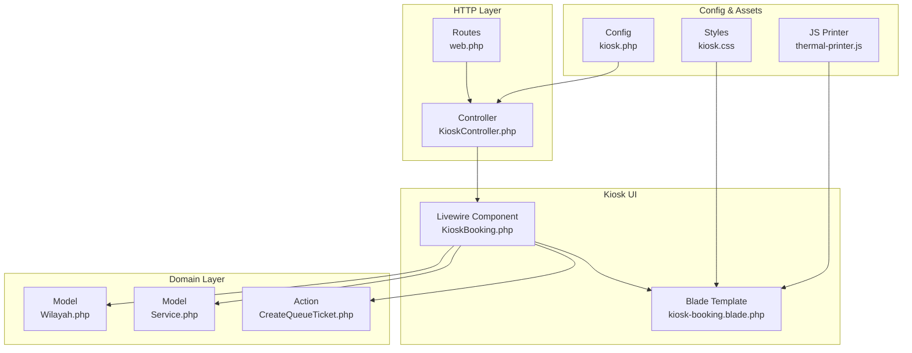
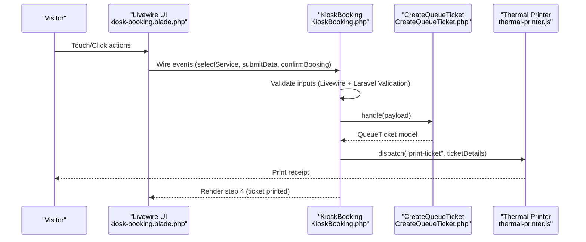
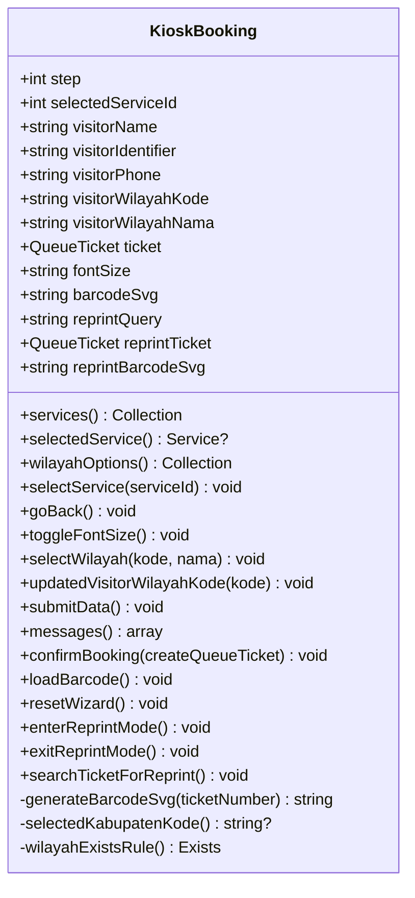
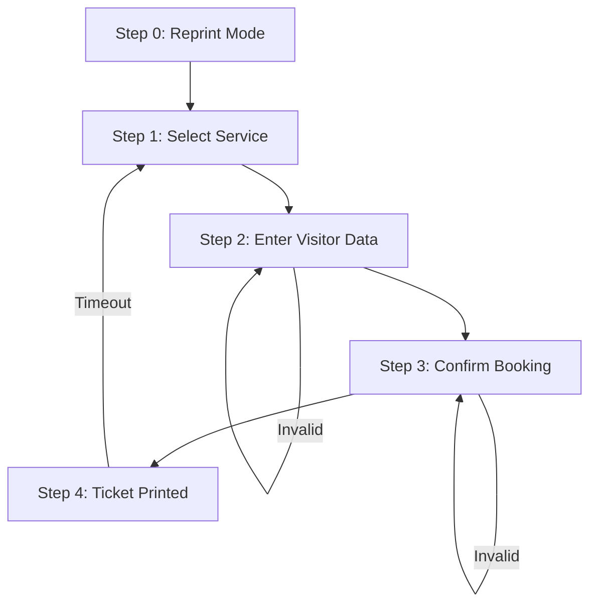
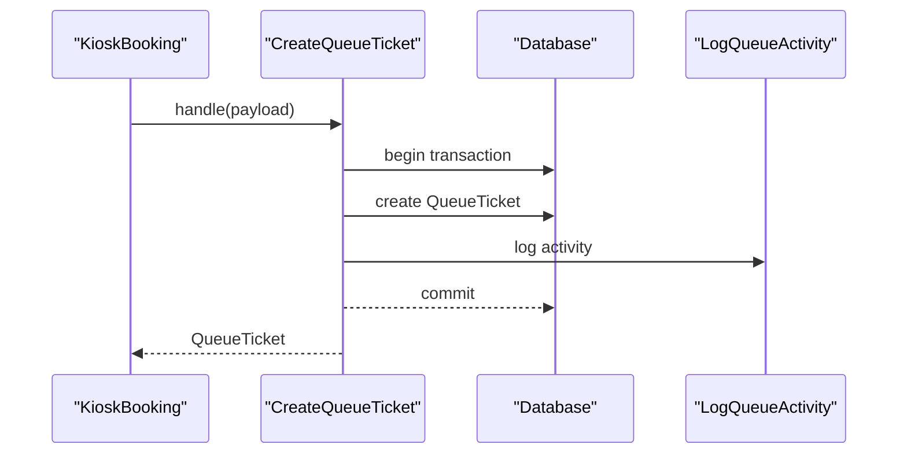
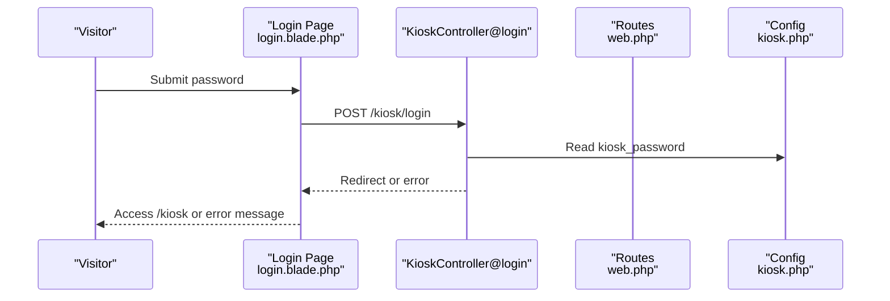
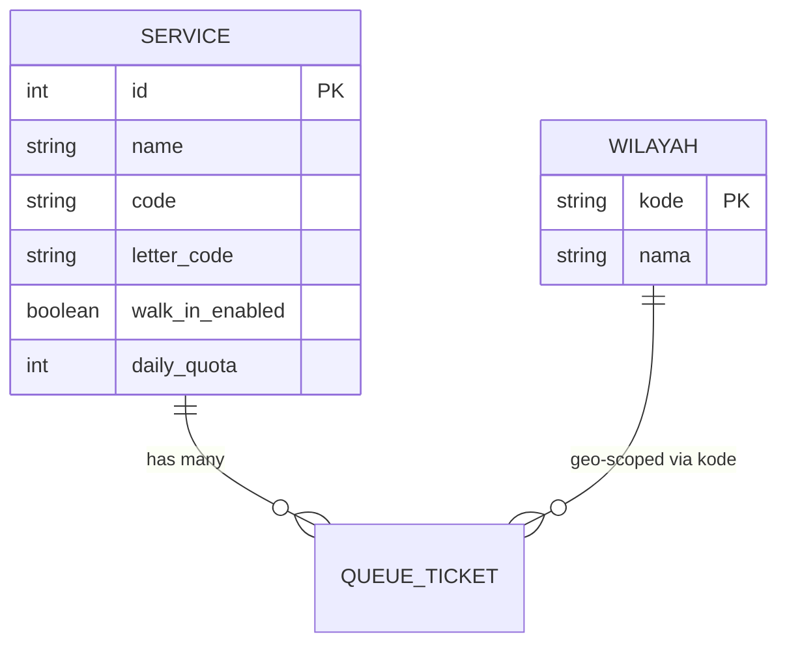
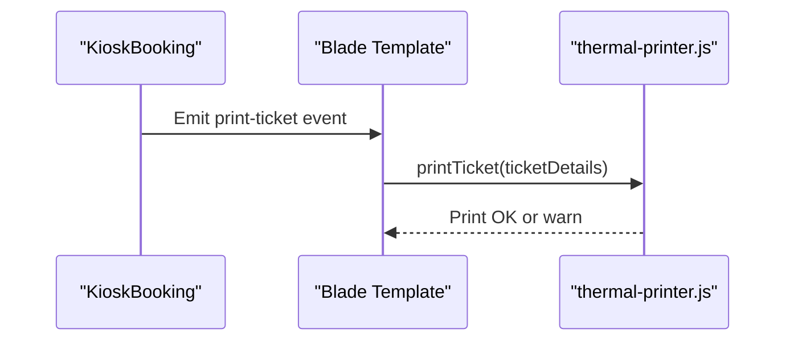
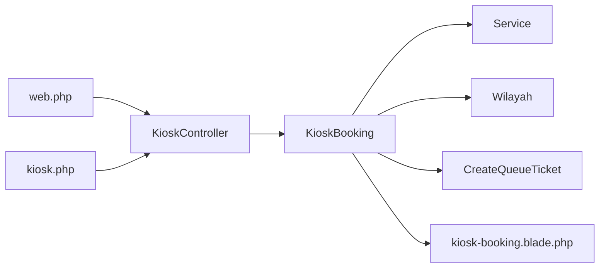

# Kiosk Booking Workflow

<cite>
**Referenced Files in This Document**
- [KioskBooking.php](file://app/Livewire/KioskBooking.php)
- [kiosk-booking.blade.php](file://resources/views/livewire/kiosk-booking.blade.php)
- [KioskController.php](file://app/Http/Controllers/KioskController.php)
- [CreateQueueTicket.php](file://app/Actions/Queue/CreateQueueTicket.php)
- [kiosk.php](file://config/kiosk.php)
- [web.php](file://routes/web.php)
- [Service.php](file://app/Models/Service.php)
- [Wilayah.php](file://app/Models/Wilayah.php)
- [login.blade.php](file://resources/views/pages/kiosk/login.blade.php)
- [index.blade.php](file://resources/views/pages/kiosk/index.blade.php)
- [kiosk.css](file://resources/css/kiosk.css)
- [thermal-printer.js](file://resources/js/thermal-printer.js)
</cite>

## Table of Contents
1. [Introduction](#introduction)
2. [Project Structure](#project-structure)
3. [Core Components](#core-components)
4. [Architecture Overview](#architecture-overview)
5. [Detailed Component Analysis](#detailed-component-analysis)
6. [Dependency Analysis](#dependency-analysis)
7. [Performance Considerations](#performance-considerations)
8. [Troubleshooting Guide](#troubleshooting-guide)
9. [Conclusion](#conclusion)

## Introduction
This document explains the Kiosk Booking Workflow system that enables visitors to self-serve appointment bookings on kiosks. It covers the step-by-step process, the Livewire component architecture, state management, validation rules, and the integration between frontend and backend for ticket creation. It also includes user experience considerations for touch-screen interfaces, error handling, performance optimization for kiosk environments, and troubleshooting guidance.

## Project Structure
The Kiosk module is composed of:
- A Livewire component that renders the booking wizard and manages state
- Blade templates that define the UI for each step
- A controller for authentication and legacy printing
- Backend actions for creating tickets
- Routes and configuration for kiosk access and session lifecycle
- Thermal printer integration for ticket printing

**Diagram sources**
- [KioskBooking.php:1-288](file://app/Livewire/KioskBooking.php#L1-L288)
- [kiosk-booking.blade.php:1-588](file://resources/views/livewire/kiosk-booking.blade.php#L1-L588)
- [KioskController.php:1-144](file://app/Http/Controllers/KioskController.php#L1-L144)
- [CreateQueueTicket.php:1-91](file://app/Actions/Queue/CreateQueueTicket.php#L1-L91)
- [Service.php:1-101](file://app/Models/Service.php#L1-L101)
- [Wilayah.php:1-24](file://app/Models/Wilayah.php#L1-L24)
- [web.php:1-127](file://routes/web.php#L1-L127)
- [kiosk.php:1-8](file://config/kiosk.php#L1-L8)
- [kiosk.css:1-8](file://resources/css/kiosk.css#L1-L8)
- [thermal-printer.js:1-139](file://resources/js/thermal-printer.js#L1-L139)

**Section sources**
- [web.php:92-98](file://routes/web.php#L92-L98)
- [index.blade.php:1-4](file://resources/views/pages/kiosk/index.blade.php#L1-L4)
- [login.blade.php:1-91](file://resources/views/pages/kiosk/login.blade.php#L1-L91)

## Core Components
- Livewire Wizard Component: Manages steps, state, validation, and ticket generation
- Blade Templates: Render each step with responsive, large-touch-friendly UI
- Controller: Handles kiosk login/logout and legacy printing
- CreateQueueTicket Action: Creates tickets with transactional safety and activity logging
- Models: Service and Wilayah provide domain data and constraints
- Routing and Config: Secure kiosk access and session lifetime
- Thermal Printer: Native ESC/POS printing for receipt-style tickets

**Section sources**
- [KioskBooking.php:25-288](file://app/Livewire/KioskBooking.php#L25-L288)
- [kiosk-booking.blade.php:1-588](file://resources/views/livewire/kiosk-booking.blade.php#L1-L588)
- [KioskController.php:18-144](file://app/Http/Controllers/KioskController.php#L18-L144)
- [CreateQueueTicket.php:13-91](file://app/Actions/Queue/CreateQueueTicket.php#L13-L91)
- [Service.php:12-101](file://app/Models/Service.php#L12-L101)
- [Wilayah.php:7-24](file://app/Models/Wilayah.php#L7-L24)
- [kiosk.php:3-7](file://config/kiosk.php#L3-L7)

## Architecture Overview
The kiosk booking flow is a client-driven wizard powered by Livewire. The UI emits events that update component state and trigger validations. On confirmation, the component delegates to a backend action to create a ticket, then triggers a thermal printer event for immediate printing.

**Diagram sources**
- [kiosk-booking.blade.php:166-167](file://resources/views/livewire/kiosk-booking.blade.php#L166-L167)
- [kiosk-booking.blade.php:347-356](file://resources/views/livewire/kiosk-booking.blade.php#L347-L356)
- [kiosk-booking.blade.php:461-470](file://resources/views/livewire/kiosk-booking.blade.php#L461-L470)
- [kiosk-booking.blade.php:480-487](file://resources/views/livewire/kiosk-booking.blade.php#L480-L487)
- [KioskBooking.php:89-93](file://app/Livewire/KioskBooking.php#L89-L93)
- [KioskBooking.php:126-142](file://app/Livewire/KioskBooking.php#L126-L142)
- [KioskBooking.php:155-180](file://app/Livewire/KioskBooking.php#L155-L180)
- [CreateQueueTicket.php:34-89](file://app/Actions/Queue/CreateQueueTicket.php#L34-L89)
- [thermal-printer.js:54-128](file://resources/js/thermal-printer.js#L54-L128)

## Detailed Component Analysis

### Livewire Wizard: KioskBooking
Responsibilities:
- Manage multi-step wizard (service selection, visitor info, confirmation, printed ticket)
- Persist and compute state across steps
- Real-time validation and error messaging
- Generate barcode for printed receipt
- Trigger thermal printer events

Key behaviors:
- Steps: 0 (reprint), 1 (service selection), 2 (visitor data), 3 (confirmation), 4 (printed)
- State fields: selected service, visitor details, location, ticket, font size, barcode SVG
- Computed properties: services, selectedService, wilayahOptions
- Validation rules enforced on both “next” and “confirm”
- Reprint mode allows lookup by identifier or phone

**Diagram sources**
- [KioskBooking.php:25-288](file://app/Livewire/KioskBooking.php#L25-L288)

**Section sources**
- [KioskBooking.php:27-59](file://app/Livewire/KioskBooking.php#L27-L59)
- [KioskBooking.php:89-101](file://app/Livewire/KioskBooking.php#L89-L101)
- [KioskBooking.php:103-106](file://app/Livewire/KioskBooking.php#L103-L106)
- [KioskBooking.php:108-124](file://app/Livewire/KioskBooking.php#L108-L124)
- [KioskBooking.php:126-142](file://app/Livewire/KioskBooking.php#L126-L142)
- [KioskBooking.php:144-153](file://app/Livewire/KioskBooking.php#L144-L153)
- [KioskBooking.php:155-180](file://app/Livewire/KioskBooking.php#L155-L180)
- [KioskBooking.php:182-189](file://app/Livewire/KioskBooking.php#L182-L189)
- [KioskBooking.php:191-206](file://app/Livewire/KioskBooking.php#L191-L206)
- [KioskBooking.php:222-236](file://app/Livewire/KioskBooking.php#L222-L236)
- [KioskBooking.php:238-262](file://app/Livewire/KioskBooking.php#L238-L262)
- [KioskBooking.php:211-220](file://app/Livewire/KioskBooking.php#L211-L220)
- [KioskBooking.php:269-286](file://app/Livewire/KioskBooking.php#L269-L286)

### Blade Templates: Step-by-Step UI
- Step 0 (Reprint): Search by ID/phone, display found ticket with barcode, trigger reprint
- Step 1 (Service Selection): Grid of active walk-in services with visual cards
- Step 2 (Visitor Data): Required fields with validation hints; dynamic wilayah dropdown
- Step 3 (Confirmation): Summary of selections and visitor info
- Step 4 (Printed): Ticket number, service, date, barcode, instructions, auto-reset countdown

Touch-screen UX highlights:
- Large buttons and inputs
- Clear progress indicators
- Immediate validation feedback
- Auto-focus on first input
- Back navigation between steps

**Diagram sources**
- [kiosk-booking.blade.php:15-132](file://resources/views/livewire/kiosk-booking.blade.php#L15-L132)
- [kiosk-booking.blade.php:134-236](file://resources/views/livewire/kiosk-booking.blade.php#L134-L236)
- [kiosk-booking.blade.php:238-359](file://resources/views/livewire/kiosk-booking.blade.php#L238-L359)
- [kiosk-booking.blade.php:361-473](file://resources/views/livewire/kiosk-booking.blade.php#L361-L473)
- [kiosk-booking.blade.php:475-569](file://resources/views/livewire/kiosk-booking.blade.php#L475-L569)

**Section sources**
- [kiosk-booking.blade.php:166-167](file://resources/views/livewire/kiosk-booking.blade.php#L166-L167)
- [kiosk-booking.blade.php:323-336](file://resources/views/livewire/kiosk-booking.blade.php#L323-L336)
- [kiosk-booking.blade.php:461-470](file://resources/views/livewire/kiosk-booking.blade.php#L461-L470)
- [kiosk-booking.blade.php:556-567](file://resources/views/livewire/kiosk-booking.blade.php#L556-L567)

### Backend Integration: CreateQueueTicket Action
- Validates channel and constructs ticket under transaction
- Generates ticket number and sequence via numbering service
- Logs activity with metadata
- Returns persisted ticket ready for printing

**Diagram sources**
- [CreateQueueTicket.php:34-89](file://app/Actions/Queue/CreateQueueTicket.php#L34-L89)

**Section sources**
- [CreateQueueTicket.php:13-18](file://app/Actions/Queue/CreateQueueTicket.php#L13-L18)
- [CreateQueueTicket.php:34-89](file://app/Actions/Queue/CreateQueueTicket.php#L34-L89)

### Authentication and Routing
- Login page enforces kiosk password via module middleware
- Session lifetime controlled by configuration
- Access to kiosk index guarded by module password middleware

**Diagram sources**
- [login.blade.php:49-84](file://resources/views/pages/kiosk/login.blade.php#L49-L84)
- [KioskController.php:25-45](file://app/Http/Controllers/KioskController.php#L25-L45)
- [web.php:92-98](file://routes/web.php#L92-L98)
- [kiosk.php:3-7](file://config/kiosk.php#L3-L7)

**Section sources**
- [web.php:92-98](file://routes/web.php#L92-L98)
- [login.blade.php:49-84](file://resources/views/pages/kiosk/login.blade.php#L49-L84)
- [KioskController.php:20-52](file://app/Http/Controllers/KioskController.php#L20-L52)
- [kiosk.php:3-7](file://config/kiosk.php#L3-L7)

### Data Models and Constraints
- Service: Active services with walk-in enabled; daily quota and remaining quota helpers
- Wilayah: Administrative area with hierarchical codes; validation constrained to selected scope

**Diagram sources**
- [Service.php:17-41](file://app/Models/Service.php#L17-L41)
- [Wilayah.php:9-22](file://app/Models/Wilayah.php#L9-L22)

**Section sources**
- [Service.php:62-99](file://app/Models/Service.php#L62-L99)
- [Wilayah.php:9-22](file://app/Models/Wilayah.php#L9-L22)
- [KioskBooking.php:274-286](file://app/Livewire/KioskBooking.php#L274-L286)

### Thermal Printer Integration
- Event-driven printing via Alpine/XInit dispatch
- ESC/POS native commands for receipt formatting
- Automatic barcode generation and cutting

**Diagram sources**
- [kiosk-booking.blade.php:480-487](file://resources/views/livewire/kiosk-booking.blade.php#L480-L487)
- [thermal-printer.js:54-128](file://resources/js/thermal-printer.js#L54-L128)

**Section sources**
- [kiosk-booking.blade.php:8-9](file://resources/views/livewire/kiosk-booking.blade.php#L8-L9)
- [kiosk-booking.blade.php:480-487](file://resources/views/livewire/kiosk-booking.blade.php#L480-L487)
- [thermal-printer.js:54-128](file://resources/js/thermal-printer.js#L54-L128)

## Dependency Analysis
- Livewire component depends on:
  - Service model for active services
  - Wilayah model for location options
  - CreateQueueTicket action for persistence
  - Blade template for rendering
- Controller depends on:
  - Module password middleware
  - Config for credentials
- Routes depend on:
  - Module password guard for kiosk endpoints
  - Throttling middleware for brute-force protection

**Diagram sources**
- [KioskBooking.php:54-59](file://app/Livewire/KioskBooking.php#L54-L59)
- [KioskBooking.php:75-87](file://app/Livewire/KioskBooking.php#L75-L87)
- [CreateQueueTicket.php:13-18](file://app/Actions/Queue/CreateQueueTicket.php#L13-L18)
- [web.php:92-98](file://routes/web.php#L92-L98)
- [kiosk.php:3-7](file://config/kiosk.php#L3-L7)

**Section sources**
- [web.php:92-98](file://routes/web.php#L92-L98)
- [kiosk.php:3-7](file://config/kiosk.php#L3-L7)

## Performance Considerations
- Minimize DOM updates: Livewire’s reactive properties and computed collections reduce unnecessary re-renders
- Persist computed services and wilayah options to avoid repeated queries
- Debounce or throttle input events where appropriate
- Use large touch targets and minimal animations for responsiveness
- Preload and cache static assets; Tailwind purging configured via CSS source directives
- Limit wildcard queries: wilayah scope constrained by kabupaten code to avoid scanning entire country-level dataset

[No sources needed since this section provides general guidance]

## Troubleshooting Guide
Common issues and resolutions:
- Wrong kiosk password
  - Symptom: Stays on login screen with error message
  - Resolution: Verify environment variable and middleware configuration
  - Section sources
    - [login.blade.php:45-47](file://resources/views/pages/kiosk/login.blade.php#L45-L47)
    - [KioskController.php:31-37](file://app/Http/Controllers/KioskController.php#L31-L37)
    - [kiosk.php:4](file://config/kiosk.php#L4)

- No services displayed
  - Symptom: Empty grid on step 1
  - Causes: No active services with walk-in enabled, or no selected kabupaten scope
  - Resolution: Enable services and set wilayah scope in admin
  - Section sources
    - [KioskBooking.php:54-59](file://app/Livewire/KioskBooking.php#L54-L59)
    - [KioskBooking.php:269-272](file://app/Livewire/KioskBooking.php#L269-L272)

- Location dropdown empty
  - Symptom: “Kelurahan/desa belum tersedia” message
  - Cause: Kabupaten scope not set
  - Resolution: Set wilayah scope in admin settings
  - Section sources
    - [kiosk-booking.blade.php:318-321](file://resources/views/livewire/kiosk-booking.blade.php#L318-L321)
    - [KioskBooking.php:75-87](file://app/Livewire/KioskBooking.php#L75-L87)

- Validation errors on “Next” or “Confirm”
  - Symptoms: Error messages for name, ID, phone, or location
  - Resolution: Fix inputs according to validation rules; ensure wilayah exists in selected scope
  - Section sources
    - [KioskBooking.php:128-133](file://app/Livewire/KioskBooking.php#L128-L133)
    - [KioskBooking.php:157-163](file://app/Livewire/KioskBooking.php#L157-L163)
    - [KioskBooking.php:144-153](file://app/Livewire/KioskBooking.php#L144-L153)

- Ticket not printed
  - Symptoms: No thermal printer output after step 4
  - Causes: Printer disabled, SDK not loaded, connection failure
  - Resolution: Enable thermal printer in config, ensure ePOS SDK present, check network connectivity
  - Section sources
    - [kiosk-booking.blade.php:8-9](file://resources/views/livewire/kiosk-booking.blade.php#L8-L9)
    - [thermal-printer.js:17-21](file://resources/js/thermal-printer.js#L17-L21)
    - [thermal-printer.js:24-45](file://resources/js/thermal-printer.js#L24-L45)

- Reprint search yields no results
  - Symptoms: “Tiket Tidak Ditemukan” message
  - Resolution: Verify ID/phone matches records for today and active statuses
  - Section sources
    - [kiosk-booking.blade.php:114-124](file://resources/views/livewire/kiosk-booking.blade.php#L114-L124)
    - [KioskBooking.php:240-262](file://app/Livewire/KioskBooking.php#L240-L262)

## Conclusion
The Kiosk Booking Workflow leverages Livewire for a responsive, stateful wizard that validates inputs in real time, persists visitor data, and creates tickets atomically. The design emphasizes large touch targets, clear progress, and immediate feedback. Backend actions encapsulate ticket creation and logging, while the thermal printer integration provides instant physical receipts. Proper configuration of scopes, passwords, and printer settings ensures reliable operation in kiosk environments.