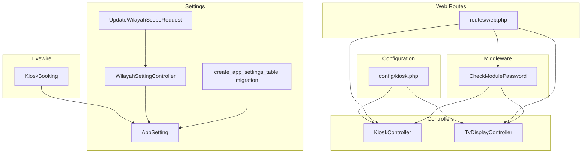
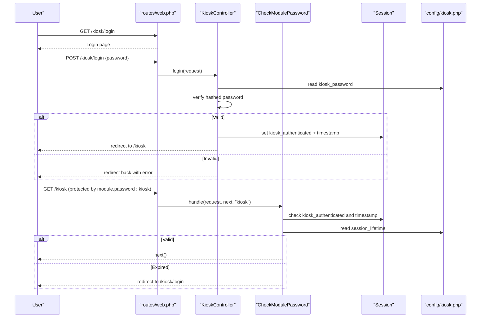
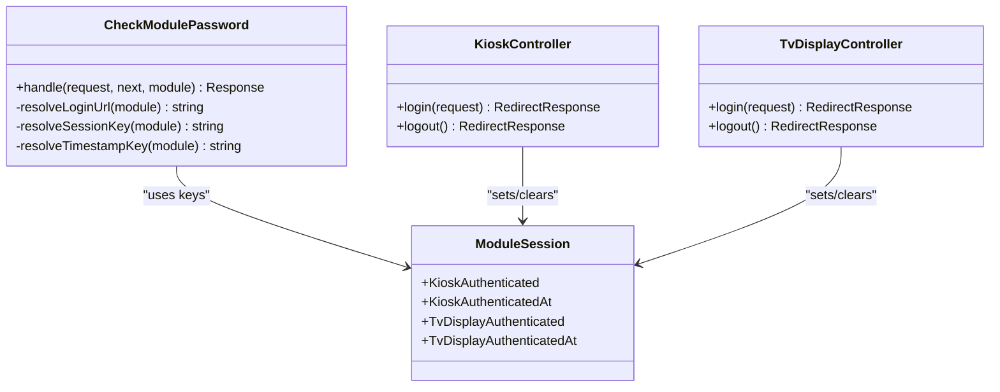
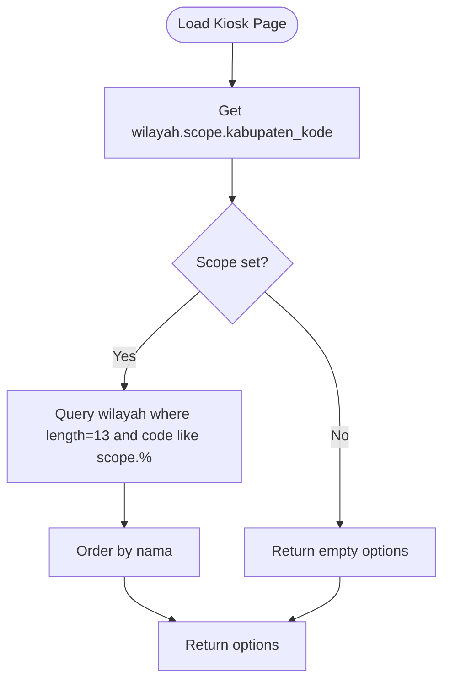
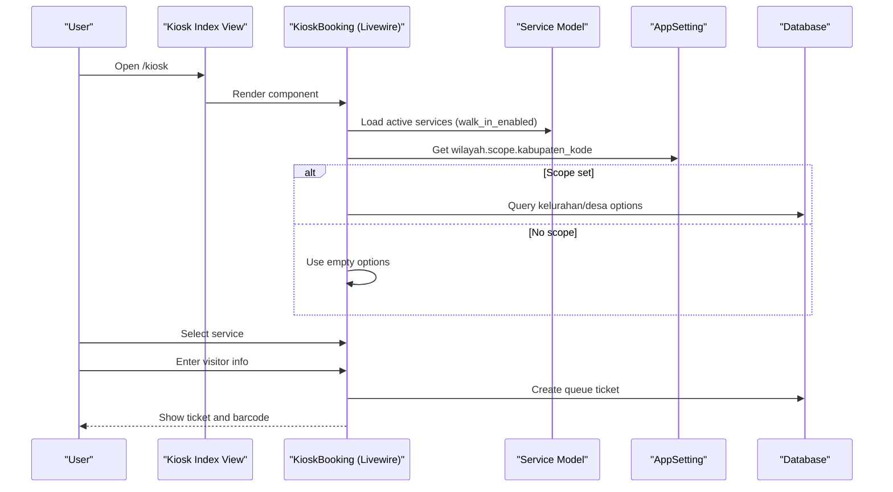
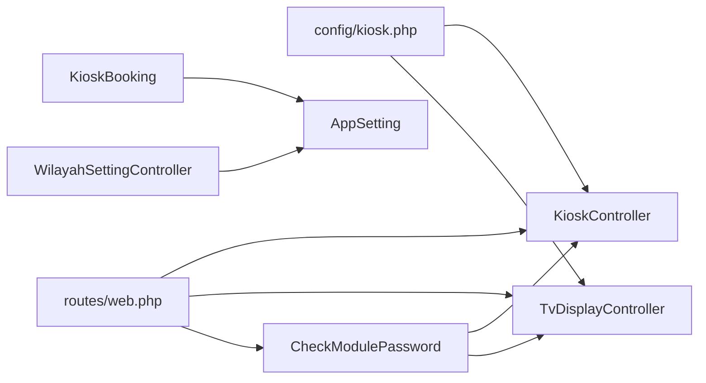

# Kiosk Configuration Management

<cite>
**Referenced Files in This Document**
- [config/kiosk.php](file://config/kiosk.php)
- [app/Http/Controllers/KioskController.php](file://app/Http/Controllers/KioskController.php)
- [app/Http/Controllers/TvDisplayController.php](file://app/Http/Controllers/TvDisplayController.php)
- [app/Http/Middleware/CheckModulePassword.php](file://app/Http/Middleware/CheckModulePassword.php)
- [app/Enums/ModuleSession.php](file://app/Enums/ModuleSession.php)
- [routes/web.php](file://routes/web.php)
- [app/Models/AppSetting.php](file://app/Models/AppSetting.php)
- [database/migrations/2026_03_11_073137_create_app_settings_table.php](file://database/migrations/2026_03_11_073137_create_app_settings_table.php)
- [app/Http/Controllers/Admin/WilayahSettingController.php](file://app/Http/Controllers/Admin/WilayahSettingController.php)
- [app/Http/Requests/UpdateWilayahScopeRequest.php](file://app/Http/Requests/UpdateWilayahScopeRequest.php)
- [app/Livewire/KioskBooking.php](file://app/Livewire/KioskBooking.php)
- [resources/views/pages/kiosk/index.blade.php](file://resources/views/pages/kiosk/index.blade.php)
- [resources/views/pages/kiosk/login.blade.php](file://resources/views/pages/kiosk/login.blade.php)
- [resources/views/components/layouts/kiosk.blade.php](file://resources/views/components/layouts/kiosk.blade.php)
- [resources/views/pages/kiosk/legacy.blade.php](file://resources/views/pages/kiosk/legacy.blade.php)
- [tests/Feature/Admin/KioskConfigTest.php](file://tests/Feature/Admin/KioskConfigTest.php)
</cite>

## Table of Contents
1. [Introduction](#introduction)
2. [Project Structure](#project-structure)
3. [Core Components](#core-components)
4. [Architecture Overview](#architecture-overview)
5. [Detailed Component Analysis](#detailed-component-analysis)
6. [Dependency Analysis](#dependency-analysis)
7. [Performance Considerations](#performance-considerations)
8. [Troubleshooting Guide](#troubleshooting-guide)
9. [Conclusion](#conclusion)
10. [Appendices](#appendices)

## Introduction
This document describes Kiosk Configuration Management for the PTSP queue system. It explains how kiosk and TV display modules are secured via dedicated passwords, how session lifetimes are enforced, and how dynamic configuration is managed through AppSetting records. It also covers geographic scope limitations for kiosk booking, environment-specific settings, validation rules, and operational considerations for deployment and maintenance.

## Project Structure
Kiosk configuration spans configuration files, controllers, middleware, Livewire components, and administrative settings. The kiosk module is exposed via dedicated routes and protected by a custom middleware that enforces password authentication and session lifetime checks. Dynamic settings are stored in the database-backed AppSetting model and cached for performance.

**Diagram sources**
- [config/kiosk.php:1-8](file://config/kiosk.php#L1-L8)
- [routes/web.php:92-124](file://routes/web.php#L92-L124)
- [app/Http/Controllers/KioskController.php:18-144](file://app/Http/Controllers/KioskController.php#L18-L144)
- [app/Http/Controllers/TvDisplayController.php:16-144](file://app/Http/Controllers/TvDisplayController.php#L16-L144)
- [app/Http/Middleware/CheckModulePassword.php:10-68](file://app/Http/Middleware/CheckModulePassword.php#L10-L68)
- [app/Livewire/KioskBooking.php:25-288](file://app/Livewire/KioskBooking.php#L25-L288)
- [app/Models/AppSetting.php:8-34](file://app/Models/AppSetting.php#L8-L34)
- [database/migrations/2026_03_11_073137_create_app_settings_table.php:7-30](file://database/migrations/2026_03_11_073137_create_app_settings_table.php#L7-L30)
- [app/Http/Controllers/Admin/WilayahSettingController.php:13-54](file://app/Http/Controllers/Admin/WilayahSettingController.php#L13-L54)
- [app/Http/Requests/UpdateWilayahScopeRequest.php:8-49](file://app/Http/Requests/UpdateWilayahScopeRequest.php#L8-L49)

**Section sources**
- [config/kiosk.php:1-8](file://config/kiosk.php#L1-L8)
- [routes/web.php:92-124](file://routes/web.php#L92-L124)

## Core Components
- Kiosk configuration options:
  - kiosk_password: hashed credential for kiosk login
  - tv_display_password: hashed credential for TV display login
  - session_lifetime: session lifetime multiplier (minutes)
- Authentication and session enforcement:
  - KioskController and TvDisplayController handle login, logout, and route protection
  - CheckModulePassword middleware validates authentication and session freshness
  - ModuleSession enum defines session keys for kiosk and TV display
- Dynamic configuration:
  - AppSetting model stores key-value pairs with caching and cache invalidation
  - Administrative controller updates geographic scope for kiosk booking
  - UpdateWilayahScopeRequest validates scope selection
- Kiosk UI and booking:
  - KioskBooking Livewire component orchestrates multi-step booking and reprint flows
  - Views provide login and kiosk page layouts

**Section sources**
- [config/kiosk.php:3-7](file://config/kiosk.php#L3-L7)
- [app/Http/Controllers/KioskController.php:25-52](file://app/Http/Controllers/KioskController.php#L25-L52)
- [app/Http/Controllers/TvDisplayController.php:23-50](file://app/Http/Controllers/TvDisplayController.php#L23-L50)
- [app/Http/Middleware/CheckModulePassword.php:17-33](file://app/Http/Middleware/CheckModulePassword.php#L17-L33)
- [app/Enums/ModuleSession.php:8-14](file://app/Enums/ModuleSession.php#L8-L14)
- [app/Models/AppSetting.php:15-32](file://app/Models/AppSetting.php#L15-L32)
- [app/Http/Controllers/Admin/WilayahSettingController.php:44-52](file://app/Http/Controllers/Admin/WilayahSettingController.php#L44-L52)
- [app/Http/Requests/UpdateWilayahScopeRequest.php:23-47](file://app/Http/Requests/UpdateWilayahScopeRequest.php#L23-L47)
- [app/Livewire/KioskBooking.php:54-87](file://app/Livewire/KioskBooking.php#L54-L87)

## Architecture Overview
The kiosk module uses a password-based authentication scheme separate from the main application’s auth system. Routes are grouped under module.password middleware to enforce session validity. Dynamic configuration is loaded via AppSetting with caching to minimize database queries.

**Diagram sources**
- [routes/web.php:92-98](file://routes/web.php#L92-L98)
- [app/Http/Controllers/KioskController.php:25-44](file://app/Http/Controllers/KioskController.php#L25-L44)
- [app/Http/Middleware/CheckModulePassword.php:17-33](file://app/Http/Middleware/CheckModulePassword.php#L17-L33)
- [config/kiosk.php:3-7](file://config/kiosk.php#L3-L7)

## Detailed Component Analysis

### Configuration Options and Environment Integration
- kiosk_password and tv_display_password:
  - Loaded from environment variables with fallback to a shared MODULE_PASSWORD
  - Stored as hashes; verified using framework hashing utilities during login
- session_lifetime:
  - Multiplier in minutes; middleware converts to seconds for expiration checks
  - Defaults to 1440 minutes if not set
- Environment-specific settings:
  - Use .env to set KIOSK_PASSWORD, TV_DISPLAY_PASSWORD, MODULE_PASSWORD, and MODULE_SESSION_LIFETIME
  - Tests assert defaults when environment variables are absent

**Section sources**
- [config/kiosk.php:3-7](file://config/kiosk.php#L3-L7)
- [app/Http/Controllers/KioskController.php:31-37](file://app/Http/Controllers/KioskController.php#L31-L37)
- [app/Http/Controllers/TvDisplayController.php:29-35](file://app/Http/Controllers/TvDisplayController.php#L29-L35)
- [app/Http/Middleware/CheckModulePassword.php:24](file://app/Http/Middleware/CheckModulePassword.php#L24)
- [tests/Feature/Admin/KioskConfigTest.php:3-10](file://tests/Feature/Admin/KioskConfigTest.php#L3-L10)

### Session Management and Access Control
- Session keys:
  - KioskAuthenticated and KioskAuthenticatedAt for kiosk
  - TvDisplayAuthenticated and TvDisplayAuthenticatedAt for TV display
- Middleware behavior:
  - Validates presence of authentication flags and timestamp
  - Enforces expiration based on session_lifetime
  - Redirects to appropriate login route when session expires
- Controller actions:
  - Set session flags on successful login
  - Clear session flags on logout

**Diagram sources**
- [app/Enums/ModuleSession.php:8-14](file://app/Enums/ModuleSession.php#L8-L14)
- [app/Http/Middleware/CheckModulePassword.php:17-66](file://app/Http/Middleware/CheckModulePassword.php#L17-L66)
- [app/Http/Controllers/KioskController.php:39-51](file://app/Http/Controllers/KioskController.php#L39-L51)
- [app/Http/Controllers/TvDisplayController.php:37-49](file://app/Http/Controllers/TvDisplayController.php#L37-L49)

**Section sources**
- [app/Enums/ModuleSession.php:8-14](file://app/Enums/ModuleSession.php#L8-L14)
- [app/Http/Middleware/CheckModulePassword.php:17-33](file://app/Http/Middleware/CheckModulePassword.php#L17-L33)
- [app/Http/Controllers/KioskController.php:39-51](file://app/Http/Controllers/KioskController.php#L39-L51)
- [app/Http/Controllers/TvDisplayController.php:37-49](file://app/Http/Controllers/TvDisplayController.php#L37-L49)

### Dynamic Configuration via AppSetting
- AppSetting.getValue(key, default):
  - Retrieves value from database and caches it forever under a namespaced key
  - Returns default if not found
- AppSetting.setValue(key, value):
  - Upserts record and clears the cache for that key
- Geographic scope:
  - Admin sets wilayah.scope.kabupaten_kode
  - KioskBooking and legacy page filter kelurahan/desa options by this scope
  - Validation ensures selected wilayah exists and matches scope

**Diagram sources**
- [app/Livewire/KioskBooking.php:74-87](file://app/Livewire/KioskBooking.php#L74-L87)
- [app/Http/Controllers/KioskController.php:97-109](file://app/Http/Controllers/KioskController.php#L97-L109)
- [app/Models/AppSetting.php:15-22](file://app/Models/AppSetting.php#L15-L22)

**Section sources**
- [app/Models/AppSetting.php:15-32](file://app/Models/AppSetting.php#L15-L32)
- [database/migrations/2026_03_11_073137_create_app_settings_table.php:14-19](file://database/migrations/2026_03_11_073137_create_app_settings_table.php#L14-L19)
- [app/Http/Controllers/Admin/WilayahSettingController.php:44-52](file://app/Http/Controllers/Admin/WilayahSettingController.php#L44-L52)
- [app/Http/Requests/UpdateWilayahScopeRequest.php:25-33](file://app/Http/Requests/UpdateWilayahScopeRequest.php#L25-L33)
- [app/Livewire/KioskBooking.php:269-272](file://app/Livewire/KioskBooking.php#L269-L272)
- [app/Http/Controllers/KioskController.php:97-109](file://app/Http/Controllers/KioskController.php#L97-L109)

### Kiosk UI and Booking Workflow
- Livewire component:
  - Multi-step wizard: service selection → visitor info → confirmation → ticket display
  - Reprint mode supports lookup by identifier or phone
  - Generates barcode SVG for tickets
- Views:
  - Login page renders a secure form with error handling
  - Kiosk index page hosts the Livewire component
  - Legacy page provides a full-screen launcher-style interface

**Diagram sources**
- [resources/views/pages/kiosk/index.blade.php:1-4](file://resources/views/pages/kiosk/index.blade.php#L1-L4)
- [app/Livewire/KioskBooking.php:54-72](file://app/Livewire/KioskBooking.php#L54-L72)
- [app/Livewire/KioskBooking.php:74-87](file://app/Livewire/KioskBooking.php#L74-L87)
- [app/Livewire/KioskBooking.php:155-180](file://app/Livewire/KioskBooking.php#L155-L180)
- [app/Models/AppSetting.php:15-22](file://app/Models/AppSetting.php#L15-L22)

**Section sources**
- [resources/views/pages/kiosk/index.blade.php:1-4](file://resources/views/pages/kiosk/index.blade.php#L1-L4)
- [resources/views/pages/kiosk/login.blade.php:49-85](file://resources/views/pages/kiosk/login.blade.php#L49-L85)
- [resources/views/components/layouts/kiosk.blade.php:1-4](file://resources/views/components/layouts/kiosk.blade.php#L1-L4)
- [resources/views/pages/kiosk/legacy.blade.php:1-200](file://resources/views/pages/kiosk/legacy.blade.php#L1-L200)
- [app/Livewire/KioskBooking.php:54-87](file://app/Livewire/KioskBooking.php#L54-L87)
- [app/Livewire/KioskBooking.php:155-180](file://app/Livewire/KioskBooking.php#L155-L180)

### Route Protection and Maintenance Mode Considerations
- Routes:
  - Kiosk: login, authenticate, logout, protected index
  - TV Display: similar pattern
  - Both protected by module.password middleware
- Maintenance mode:
  - Middleware redirects to login when session expires; this acts as a de facto maintenance gate
  - To “take offline,” reduce session_lifetime or clear module passwords in config

**Section sources**
- [routes/web.php:92-124](file://routes/web.php#L92-L124)
- [app/Http/Middleware/CheckModulePassword.php:24](file://app/Http/Middleware/CheckModulePassword.php#L24)

## Dependency Analysis
The kiosk configuration depends on:
- config/kiosk.php for credential and session settings
- routes/web.php for route registration and middleware binding
- KioskController and TvDisplayController for authentication flows
- CheckModulePassword for session enforcement
- AppSetting for dynamic configuration and caching
- Livewire component for UI orchestration and validation

**Diagram sources**
- [config/kiosk.php:3-7](file://config/kiosk.php#L3-L7)
- [routes/web.php:92-124](file://routes/web.php#L92-L124)
- [app/Http/Controllers/KioskController.php:25-44](file://app/Http/Controllers/KioskController.php#L25-L44)
- [app/Http/Controllers/TvDisplayController.php:23-43](file://app/Http/Controllers/TvDisplayController.php#L23-L43)
- [app/Http/Middleware/CheckModulePassword.php:17-33](file://app/Http/Middleware/CheckModulePassword.php#L17-L33)
- [app/Livewire/KioskBooking.php:269-272](file://app/Livewire/KioskBooking.php#L269-L272)
- [app/Http/Controllers/Admin/WilayahSettingController.php:44-52](file://app/Http/Controllers/Admin/WilayahSettingController.php#L44-L52)

**Section sources**
- [routes/web.php:92-124](file://routes/web.php#L92-L124)
- [app/Http/Middleware/CheckModulePassword.php:17-33](file://app/Http/Middleware/CheckModulePassword.php#L17-L33)
- [app/Models/AppSetting.php:15-32](file://app/Models/AppSetting.php#L15-L32)

## Performance Considerations
- AppSetting caching:
  - getValue uses a long-lived cache to avoid repeated DB reads
  - setValue invalidates cache immediately after write
- Livewire persistence:
  - Computed properties are persisted with timeouts to balance freshness and performance
- Database queries:
  - Wilayah scope filtering reduces result sets to a single kabupaten’s kelurahan/desa
- Recommendations:
  - Keep session_lifetime reasonable to prevent stale sessions
  - Monitor cache hit rates for app settings
  - Use pagination for admin lists where applicable

[No sources needed since this section provides general guidance]

## Troubleshooting Guide
Common issues and resolutions:
- Wrong password on kiosk login:
  - Verify KIOSK_PASSWORD and TV_DISPLAY_PASSWORD in environment
  - Ensure passwords are hashed as expected by the authentication flow
- Session expired:
  - Reduce MODULE_SESSION_LIFETIME to force shorter sessions
  - Confirm middleware is applied to protected routes
- Geographic scope not working:
  - Confirm wilayah.scope.kabupaten_kode is set in AppSetting
  - Validate that selected wilayah exists and matches the scope pattern
- Legacy kiosk UI not rendering options:
  - Ensure scope is set; otherwise, options will be empty to avoid heavy queries
- Reprint mode not finding tickets:
  - Search by either visitor identifier or phone; ensure today’s date and valid statuses

**Section sources**
- [app/Http/Controllers/KioskController.php:31-37](file://app/Http/Controllers/KioskController.php#L31-L37)
- [app/Http/Controllers/TvDisplayController.php:29-35](file://app/Http/Controllers/TvDisplayController.php#L29-L35)
- [app/Http/Middleware/CheckModulePassword.php:24](file://app/Http/Middleware/CheckModulePassword.php#L24)
- [app/Models/AppSetting.php:15-22](file://app/Models/AppSetting.php#L15-L22)
- [app/Http/Controllers/Admin/WilayahSettingController.php:44-52](file://app/Http/Controllers/Admin/WilayahSettingController.php#L44-L52)
- [app/Livewire/KioskBooking.php:238-262](file://app/Livewire/KioskBooking.php#L238-L262)

## Conclusion
Kiosk Configuration Management leverages environment-driven secrets, middleware-enforced sessions, and dynamic AppSetting records to deliver a secure, configurable kiosk experience. Administrators can control access credentials, session lifetimes, and geographic scope through simple configuration and administrative actions. Proper environment setup and validation ensure robust operation across deployments.

[No sources needed since this section summarizes without analyzing specific files]

## Appendices

### Configuration Reference
- Keys and defaults:
  - kiosk.kiosk_password: default null; falls back to MODULE_PASSWORD
  - kiosk.tv_display_password: default null; falls back to MODULE_PASSWORD
  - kiosk.session_lifetime: default 1440 minutes
- Environment variables:
  - KIOSK_PASSWORD, TV_DISPLAY_PASSWORD, MODULE_PASSWORD, MODULE_SESSION_LIFETIME

**Section sources**
- [config/kiosk.php:3-7](file://config/kiosk.php#L3-L7)
- [tests/Feature/Admin/KioskConfigTest.php:3-10](file://tests/Feature/Admin/KioskConfigTest.php#L3-L10)

### Setup Procedures
- Initial setup:
  - Set KIOSK_PASSWORD and TV_DISPLAY_PASSWORD in environment
  - Optionally set MODULE_SESSION_LIFETIME
  - Configure wilayah.scope.kabupaten_kode via admin panel
- Deployment checklist:
  - Confirm routes are registered and middleware applied
  - Test login flows for both kiosk and TV display
  - Validate geographic scope filtering and wilayah options
  - Verify Livewire and legacy UI rendering

**Section sources**
- [routes/web.php:92-124](file://routes/web.php#L92-L124)
- [app/Http/Controllers/Admin/WilayahSettingController.php:44-52](file://app/Http/Controllers/Admin/WilayahSettingController.php#L44-L52)
- [resources/views/pages/kiosk/index.blade.php:1-4](file://resources/views/pages/kiosk/index.blade.php#L1-L4)