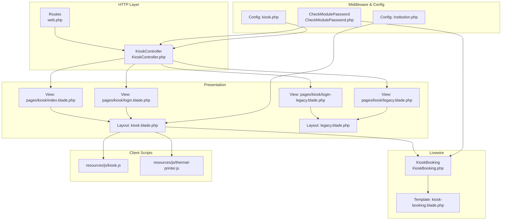
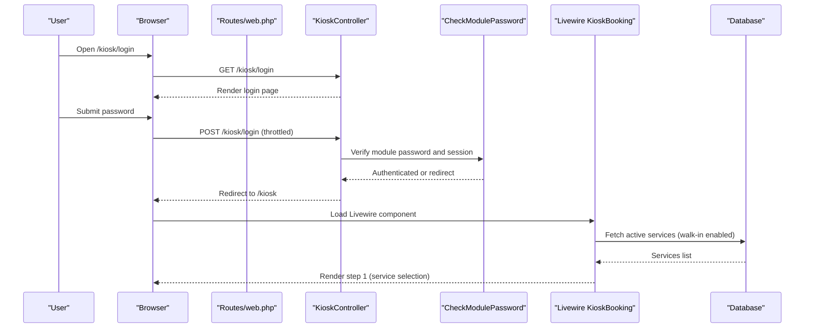
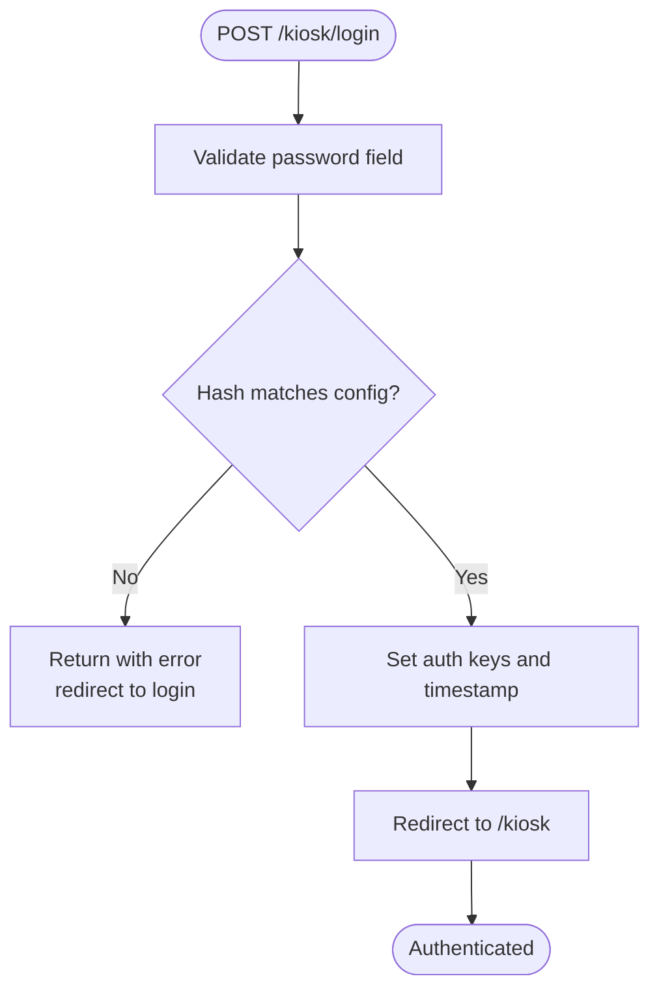
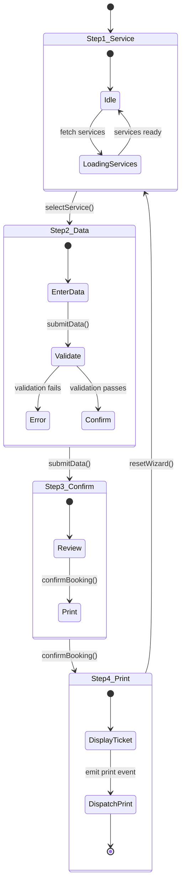
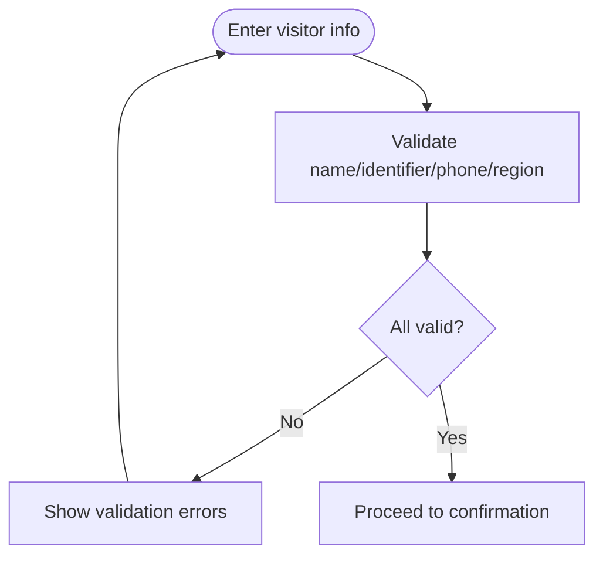
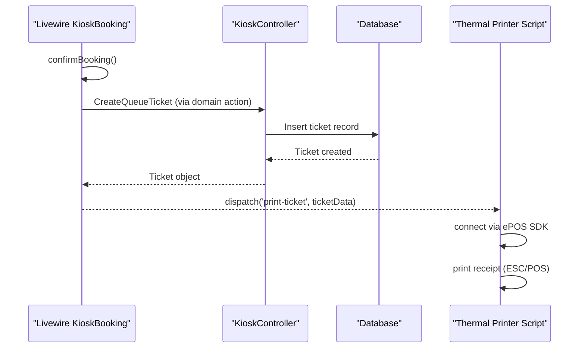
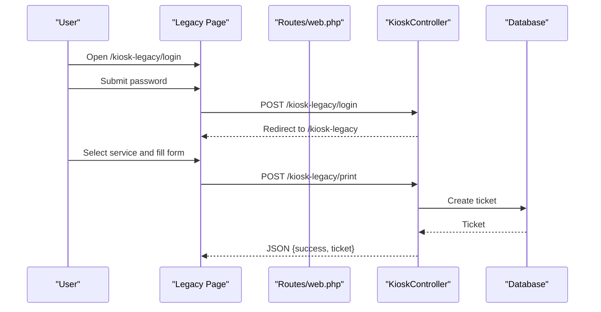
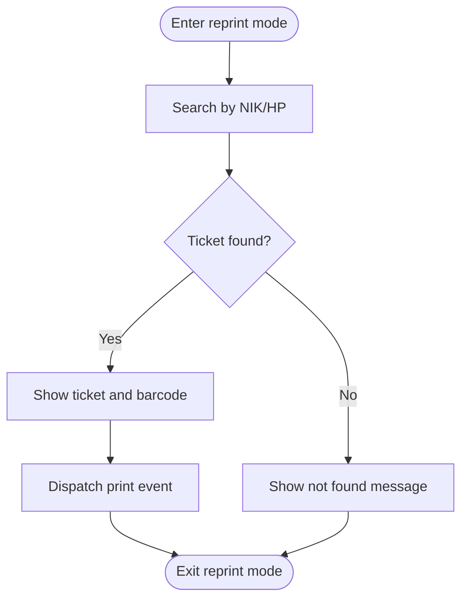
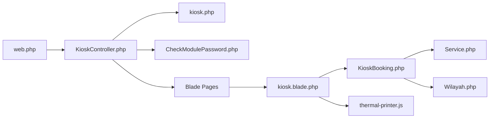

# Kiosk Interface

<cite>
**Referenced Files in This Document**
- [KioskController.php](file://app/Http/Controllers/KioskController.php)
- [KioskBooking.php](file://app/Livewire/KioskBooking.php)
- [kiosk-booking.blade.php](file://resources/views/livewire/kiosk-booking.blade.php)
- [kiosk.php](file://config/kiosk.php)
- [kiosk.blade.php](file://resources/views/layouts/kiosk.blade.php)
- [legacy.blade.php](file://resources/views/layouts/legacy.blade.php)
- [kiosk.js](file://resources/js/kiosk.js)
- [thermal-printer.js](file://resources/js/thermal-printer.js)
- [web.php](file://routes/web.php)
- [Service.php](file://app/Models/Service.php)
- [Wilayah.php](file://app/Models/Wilayah.php)
- [CheckModulePassword.php](file://app/Http/Middleware/CheckModulePassword.php)
- [institution.php](file://config/institution.php)
- [index.blade.php](file://resources/views/pages/kiosk/index.blade.php)
- [login.blade.php](file://resources/views/pages/kiosk/login.blade.php)
- [legacy.blade.php](file://resources/views/pages/kiosk/legacy.blade.php)
- [login-legacy.blade.php](file://resources/views/pages/kiosk/login-legacy.blade.php)
</cite>

## Table of Contents
1. [Introduction](#introduction)
2. [Project Structure](#project-structure)
3. [Core Components](#core-components)
4. [Architecture Overview](#architecture-overview)
5. [Detailed Component Analysis](#detailed-component-analysis)
6. [Dependency Analysis](#dependency-analysis)
7. [Performance Considerations](#performance-considerations)
8. [Troubleshooting Guide](#troubleshooting-guide)
9. [Conclusion](#conclusion)
10. [Appendices](#appendices)

## Introduction
This document describes the Kiosk Interface system for self-service public booking on touch-screen kiosks. It covers the kiosk authentication system, service selection, visitor information capture, ticket generation, Livewire-driven interactivity, legacy HTML support for older hardware, configuration, security, maintenance, troubleshooting, and performance optimization.

## Project Structure
The Kiosk Interface spans controllers, Livewire components, Blade templates, middleware, configuration, and client-side scripts:
- Controllers manage authentication and page routing for modern and legacy kiosks.
- Livewire component orchestrates the interactive booking wizard and state.
- Blade templates define the UI for modern and legacy experiences.
- Middleware enforces module-specific authentication and session lifetime.
- Configuration files define passwords, session lifetimes, and thermal printer settings.
- Client-side scripts integrate with Epson thermal printers via ePOS SDK.

**Diagram sources**
- [web.php:1-127](file://routes/web.php#L1-L127)
- [KioskController.php:18-144](file://app/Http/Controllers/KioskController.php#L18-L144)
- [kiosk.blade.php:1-67](file://resources/views/layouts/kiosk.blade.php#L1-L67)
- [legacy.blade.php:1-112](file://resources/views/layouts/legacy.blade.php#L1-L112)
- [index.blade.php:1-4](file://resources/views/pages/kiosk/index.blade.php#L1-L4)
- [login.blade.php:1-91](file://resources/views/pages/kiosk/login.blade.php#L1-L91)
- [legacy.blade.php:1-1059](file://resources/views/pages/kiosk/legacy.blade.php#L1-L1059)
- [login-legacy.blade.php:1-114](file://resources/views/pages/kiosk/login-legacy.blade.php#L1-L114)
- [KioskBooking.php:25-288](file://app/Livewire/KioskBooking.php#L25-L288)
- [kiosk-booking.blade.php:1-588](file://resources/views/livewire/kiosk-booking.blade.php#L1-L588)
- [CheckModulePassword.php:10-68](file://app/Http/Middleware/CheckModulePassword.php#L10-L68)
- [kiosk.php:1-8](file://config/kiosk.php#L1-L8)
- [institution.php:1-10](file://config/institution.php#L1-L10)
- [kiosk.js:1-2](file://resources/js/kiosk.js#L1-L2)
- [thermal-printer.js:1-139](file://resources/js/thermal-printer.js#L1-L139)

**Section sources**
- [web.php:92-106](file://routes/web.php#L92-L106)
- [KioskController.php:18-144](file://app/Http/Controllers/KioskController.php#L18-L144)
- [kiosk.blade.php:16-42](file://resources/views/layouts/kiosk.blade.php#L16-L42)
- [legacy.blade.php:95-98](file://resources/views/layouts/legacy.blade.php#L95-L98)
- [CheckModulePassword.php:17-33](file://app/Http/Middleware/CheckModulePassword.php#L17-L33)
- [kiosk.php:3-7](file://config/kiosk.php#L3-L7)
- [institution.php:3-9](file://config/institution.php#L3-L9)

## Core Components
- Authentication and Routing
  - KioskController handles login, logout, and exposes index and legacy endpoints.
  - Routes enforce throttling and module password middleware for kiosk endpoints.
- Livewire Booking Experience
  - KioskBooking manages a 4-step wizard: service selection, visitor info, confirmation, and ticket display.
  - State includes selected service, visitor details, ticket, font size, and reprint mode.
- Legacy HTML Experience
  - Legacy pages provide a Bootstrap/Metronic-based interface for older devices.
  - Includes a dedicated print endpoint and a separate login page.
- Thermal Printing
  - Client script integrates with Epson ePOS SDK to print tickets on receipt printers.
- Configuration and Security
  - Module passwords, session lifetime, and institution branding are configured centrally.

**Section sources**
- [KioskController.php:25-52](file://app/Http/Controllers/KioskController.php#L25-L52)
- [web.php:96-98](file://routes/web.php#L96-L98)
- [web.php:103-106](file://routes/web.php#L103-L106)
- [KioskBooking.php:27-51](file://app/Livewire/KioskBooking.php#L27-L51)
- [kiosk-booking.blade.php:134-473](file://resources/views/livewire/kiosk-booking.blade.php#L134-L473)
- [legacy.blade.php:455-800](file://resources/views/pages/kiosk/legacy.blade.php#L455-L800)
- [thermal-printer.js:54-128](file://resources/js/thermal-printer.js#L54-L128)
- [kiosk.php:3-7](file://config/kiosk.php#L3-L7)
- [CheckModulePassword.php:24-30](file://app/Http/Middleware/CheckModulePassword.php#L24-L30)

## Architecture Overview
The system supports two UI stacks:
- Modern stack: Livewire component embedded in a responsive layout with Flux UI.
- Legacy stack: Plain HTML/CSS/JS with Bootstrap/Metronic for older browsers.

**Diagram sources**
- [web.php:93-98](file://routes/web.php#L93-L98)
- [KioskController.php:20-44](file://app/Http/Controllers/KioskController.php#L20-L44)
- [CheckModulePassword.php:17-33](file://app/Http/Middleware/CheckModulePassword.php#L17-L33)
- [KioskBooking.php:54-59](file://app/Livewire/KioskBooking.php#L54-L59)

## Detailed Component Analysis

### Authentication and Session Management
- Login flow validates a module-specific password against a hashed secret stored in configuration.
- On success, session keys for authentication and timestamp are set.
- Middleware checks authentication and session age; expired sessions redirect to login.
- Session lifetime is configurable.

**Diagram sources**
- [KioskController.php:25-44](file://app/Http/Controllers/KioskController.php#L25-L44)
- [kiosk.php:3-7](file://config/kiosk.php#L3-L7)
- [CheckModulePassword.php:24-30](file://app/Http/Middleware/CheckModulePassword.php#L24-L30)

**Section sources**
- [KioskController.php:25-44](file://app/Http/Controllers/KioskController.php#L25-L44)
- [CheckModulePassword.php:24-30](file://app/Http/Middleware/CheckModulePassword.php#L24-L30)
- [kiosk.php:3-7](file://config/kiosk.php#L3-L7)

### Livewire Booking Wizard
The KioskBooking component drives a 4-step wizard:
- Step 1: Service selection (grid of cards). Persisted service selection advances the wizard.
- Step 2: Visitor information capture (name, identifier, phone, region). Validation ensures required fields and region existence.
- Step 3: Confirmation screen summarizing selections.
- Step 4: Ticket display with barcode and automatic thermal print dispatch.

**Diagram sources**
- [KioskBooking.php:89-101](file://app/Livewire/KioskBooking.php#L89-L101)
- [KioskBooking.php:126-142](file://app/Livewire/KioskBooking.php#L126-L142)
- [KioskBooking.php:155-180](file://app/Livewire/KioskBooking.php#L155-L180)
- [kiosk-booking.blade.php:166-235](file://resources/views/livewire/kiosk-booking.blade.php#L166-L235)
- [kiosk-booking.blade.php:239-359](file://resources/views/livewire/kiosk-booking.blade.php#L239-L359)
- [kiosk-booking.blade.php:361-473](file://resources/views/livewire/kiosk-booking.blade.php#L361-L473)
- [kiosk-booking.blade.php:475-569](file://resources/views/livewire/kiosk-booking.blade.php#L475-L569)

**Section sources**
- [KioskBooking.php:27-51](file://app/Livewire/KioskBooking.php#L27-L51)
- [KioskBooking.php:89-101](file://app/Livewire/KioskBooking.php#L89-L101)
- [KioskBooking.php:126-180](file://app/Livewire/KioskBooking.php#L126-L180)
- [kiosk-booking.blade.php:134-473](file://resources/views/livewire/kiosk-booking.blade.php#L134-L473)

### Visitor Information Capture and Validation
- Name, identifier, phone, and region are captured.
- Region selection is filtered by a configurable kabupaten scope; dynamic options load based on selection.
- Validation ensures required fields and region existence using a composite rule.

**Diagram sources**
- [KioskBooking.php:128-142](file://app/Livewire/KioskBooking.php#L128-L142)
- [KioskBooking.php:274-286](file://app/Livewire/KioskBooking.php#L274-L286)
- [kiosk-booking.blade.php:318-359](file://resources/views/livewire/kiosk-booking.blade.php#L318-L359)

**Section sources**
- [KioskBooking.php:128-142](file://app/Livewire/KioskBooking.php#L128-L142)
- [KioskBooking.php:274-286](file://app/Livewire/KioskBooking.php#L274-L286)
- [kiosk-booking.blade.php:318-359](file://resources/views/livewire/kiosk-booking.blade.php#L318-L359)

### Ticket Generation and Thermal Printing
- On confirmation, a queue ticket is created via a domain action with channel set to kiosk walk-in.
- The UI emits a print event; the thermal printer script connects to an Epson ePOS device and prints a structured receipt.
- The ticket display includes a generated barcode.

**Diagram sources**
- [KioskBooking.php:155-180](file://app/Livewire/KioskBooking.php#L155-L180)
- [KioskController.php:114-142](file://app/Http/Controllers/KioskController.php#L114-L142)
- [thermal-printer.js:54-128](file://resources/js/thermal-printer.js#L54-L128)
- [kiosk-booking.blade.php:480-487](file://resources/views/livewire/kiosk-booking.blade.php#L480-L487)

**Section sources**
- [KioskBooking.php:155-180](file://app/Livewire/KioskBooking.php#L155-L180)
- [KioskController.php:114-142](file://app/Http/Controllers/KioskController.php#L114-L142)
- [thermal-printer.js:54-128](file://resources/js/thermal-printer.js#L54-L128)
- [kiosk-booking.blade.php:475-569](file://resources/views/livewire/kiosk-booking.blade.php#L475-L569)

### Legacy HTML Experience
- Dedicated login and main pages for older devices.
- Uses Bootstrap/Metronic with custom styles for large touch targets.
- Provides a print endpoint that creates a ticket and returns JSON for printing.

**Diagram sources**
- [web.php:101-106](file://routes/web.php#L101-L106)
- [KioskController.php:86-142](file://app/Http/Controllers/KioskController.php#L86-L142)
- [legacy.blade.php:455-800](file://resources/views/pages/kiosk/legacy.blade.php#L455-L800)

**Section sources**
- [web.php:101-106](file://routes/web.php#L101-L106)
- [KioskController.php:86-142](file://app/Http/Controllers/KioskController.php#L86-L142)
- [legacy.blade.php:455-800](file://resources/views/pages/kiosk/legacy.blade.php#L455-L800)

### Reprint Mode
- A dedicated step allows searching tickets by visitor identifier or phone for today’s active statuses.
- Displays ticket details and a barcode, enabling reprint dispatch.

**Diagram sources**
- [KioskBooking.php:222-262](file://app/Livewire/KioskBooking.php#L222-L262)
- [kiosk-booking.blade.php:15-132](file://resources/views/livewire/kiosk-booking.blade.php#L15-L132)

**Section sources**
- [KioskBooking.php:222-262](file://app/Livewire/KioskBooking.php#L222-L262)
- [kiosk-booking.blade.php:15-132](file://resources/views/livewire/kiosk-booking.blade.php#L15-L132)

## Dependency Analysis
- Controllers depend on configuration for passwords and session lifetime.
- Livewire component depends on Service and Wilayah models for data and validation rules.
- Layouts include Vite assets and Flux UI; thermal printing relies on Epson ePOS SDK.
- Routes apply throttling and module password middleware.

**Diagram sources**
- [web.php:92-106](file://routes/web.php#L92-L106)
- [KioskController.php:18-144](file://app/Http/Controllers/KioskController.php#L18-L144)
- [kiosk.php:3-7](file://config/kiosk.php#L3-L7)
- [CheckModulePassword.php:17-33](file://app/Http/Middleware/CheckModulePassword.php#L17-L33)
- [kiosk.blade.php:16-42](file://resources/views/layouts/kiosk.blade.php#L16-L42)
- [KioskBooking.php:54-59](file://app/Livewire/KioskBooking.php#L54-L59)
- [Service.php:62-67](file://app/Models/Service.php#L62-L67)
- [Wilayah.php:19-22](file://app/Models/Wilayah.php#L19-L22)
- [thermal-printer.js:5-22](file://resources/js/thermal-printer.js#L5-L22)

**Section sources**
- [web.php:92-106](file://routes/web.php#L92-L106)
- [KioskController.php:18-144](file://app/Http/Controllers/KioskController.php#L18-L144)
- [CheckModulePassword.php:17-33](file://app/Http/Middleware/CheckModulePassword.php#L17-L33)
- [kiosk.blade.php:16-42](file://resources/views/layouts/kiosk.blade.php#L16-L42)
- [KioskBooking.php:54-59](file://app/Livewire/KioskBooking.php#L54-L59)
- [Service.php:62-67](file://app/Models/Service.php#L62-L67)
- [Wilayah.php:19-22](file://app/Models/Wilayah.php#L19-L22)
- [thermal-printer.js:5-22](file://resources/js/thermal-printer.js#L5-L22)

## Performance Considerations
- Livewire state persistence: Computed properties for services and regions persist to reduce repeated queries.
- Throttling: Routes throttle login attempts to mitigate brute-force.
- Asset loading: Vite bundles and Flux script are included conditionally; ensure production builds minimize payload.
- Thermal printing: Connect once and reuse device handle; avoid reconnect on every print.
- Legacy UI: Lightweight CSS/JS avoids heavy frameworks on constrained devices.

[No sources needed since this section provides general guidance]

## Troubleshooting Guide
Common issues and resolutions:
- Authentication failures
  - Symptom: Stuck on login with error message.
  - Cause: Incorrect password or missing hashed secret.
  - Resolution: Verify environment variable for kiosk password and ensure correct input.
- Session timeout
  - Symptom: Automatic redirect to login after inactivity.
  - Cause: Session lifetime exceeded.
  - Resolution: Adjust session lifetime configuration; re-authenticate.
- Region options empty
  - Symptom: “Wilayah not available” message.
  - Cause: Kabupaten scope not set in settings.
  - Resolution: Configure active kabupaten scope; reload page.
- Thermal printer not printing
  - Symptom: No print output despite successful booking.
  - Cause: ePOS SDK not loaded or device unreachable.
  - Resolution: Enable thermal printer in config, ensure SDK asset is present, check network connectivity and device ID/port.
- Legacy page not responsive
  - Symptom: Touch targets too small or slow.
  - Cause: Device/browser limitations.
  - Resolution: Use modern stack; if legacy required, verify CSS/JS assets and disable unsupported features.

**Section sources**
- [KioskController.php:33-37](file://app/Http/Controllers/KioskController.php#L33-L37)
- [CheckModulePassword.php:24-30](file://app/Http/Middleware/CheckModulePassword.php#L24-L30)
- [kiosk.php:6-7](file://config/kiosk.php#L6-L7)
- [kiosk-booking.blade.php:318-322](file://resources/views/livewire/kiosk-booking.blade.php#L318-L322)
- [legacy.blade.php:707-718](file://resources/views/pages/kiosk/legacy.blade.php#L707-L718)
- [thermal-printer.js:16-46](file://resources/js/thermal-printer.js#L16-L46)
- [kiosk.blade.php:39-42](file://resources/views/layouts/kiosk.blade.php#L39-L42)

## Conclusion
The Kiosk Interface provides a robust, secure, and accessible self-service booking experience. It supports modern Livewire-driven interactions and a legacy HTML fallback for older hardware. Strong authentication, session management, and optional thermal printing integrate seamlessly with the UI. Proper configuration and maintenance ensure reliability and performance across diverse kiosk environments.

[No sources needed since this section summarizes without analyzing specific files]

## Appendices

### Configuration Options
- Module passwords and session lifetime
  - Keys: kiosk.kiosk_password, kiosk.session_lifetime
  - Defaults: environment variables MODULE_PASSWORD fallback; minutes converted to seconds internally
- Institution branding
  - Keys: institution.name, address, phone, operating_hours, logo_path
- Thermal printer
  - Keys: services.thermal_printer.enabled, ip, port, device_id, institution.name

**Section sources**
- [kiosk.php:3-7](file://config/kiosk.php#L3-L7)
- [institution.php:3-9](file://config/institution.php#L3-L9)
- [kiosk.blade.php:3-8](file://resources/views/layouts/kiosk.blade.php#L3-L8)
- [thermal-printer.js:5-14](file://resources/js/thermal-printer.js#L5-L14)

### Security Measures
- Module-specific passwords protect kiosk and TV display modules independently.
- Session timestamps enforce expiration; middleware redirects unauthenticated or expired requests.
- Rate limiting on login endpoints prevents abuse.

**Section sources**
- [web.php:96-98](file://routes/web.php#L96-L98)
- [web.php:103-106](file://routes/web.php#L103-L106)
- [CheckModulePassword.php:24-30](file://app/Http/Middleware/CheckModulePassword.php#L24-L30)

### Maintenance Procedures
- Regularly review and update thermal printer SDK and firmware.
- Monitor session logs and adjust session lifetime based on operational needs.
- Keep legacy assets up to date; phase out legacy UI when feasible.
- Validate service quotas and active service lists to prevent invalid selections.

[No sources needed since this section provides general guidance]