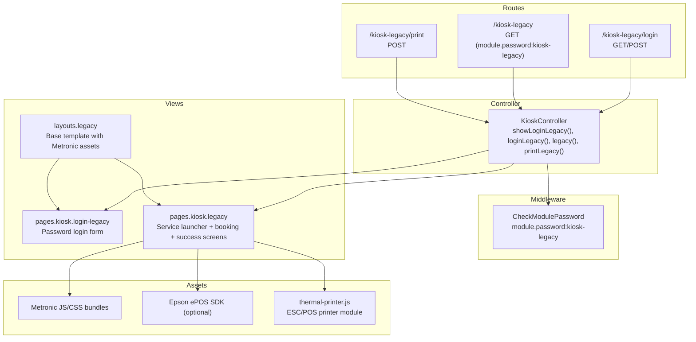
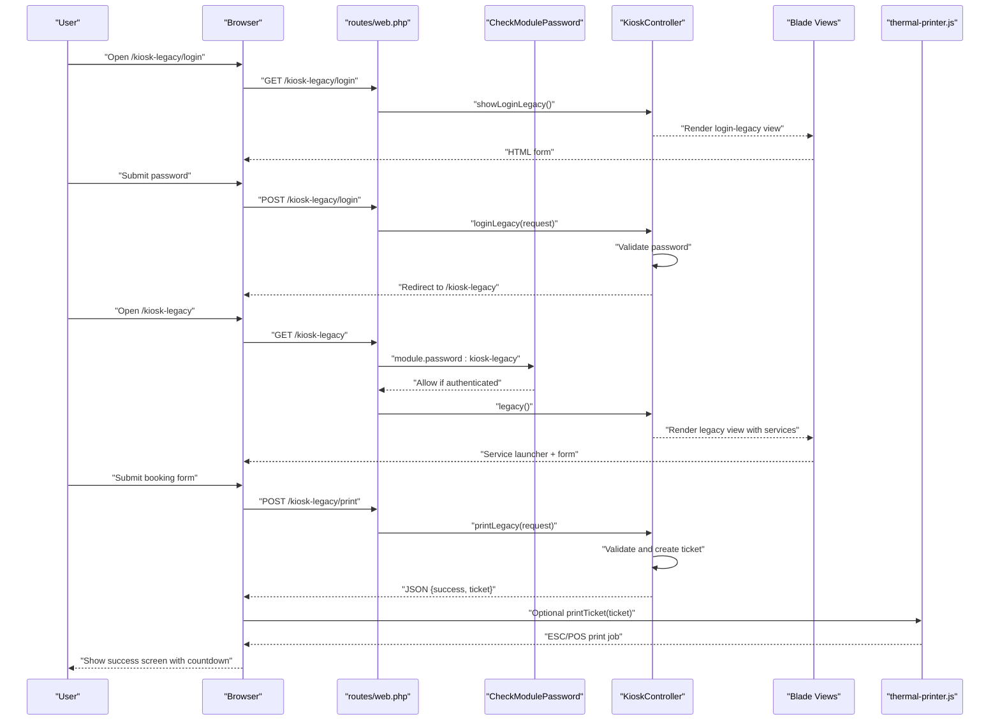
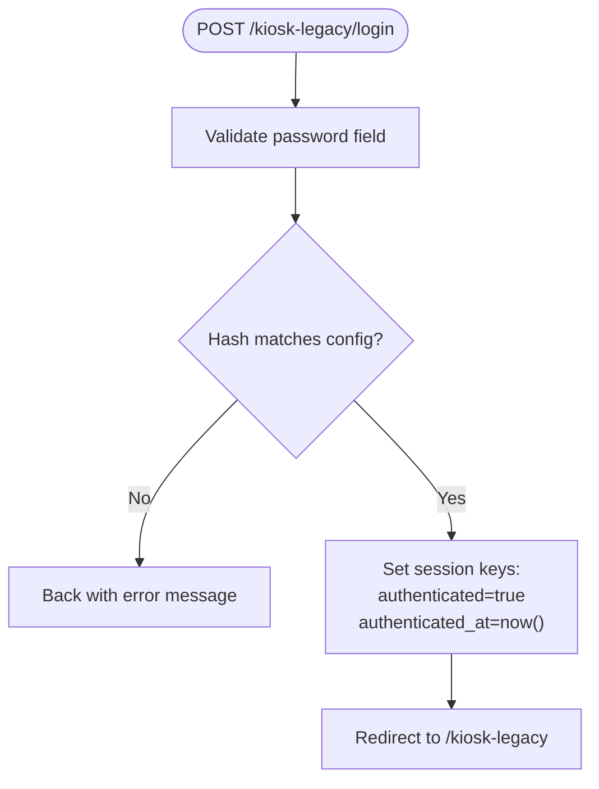
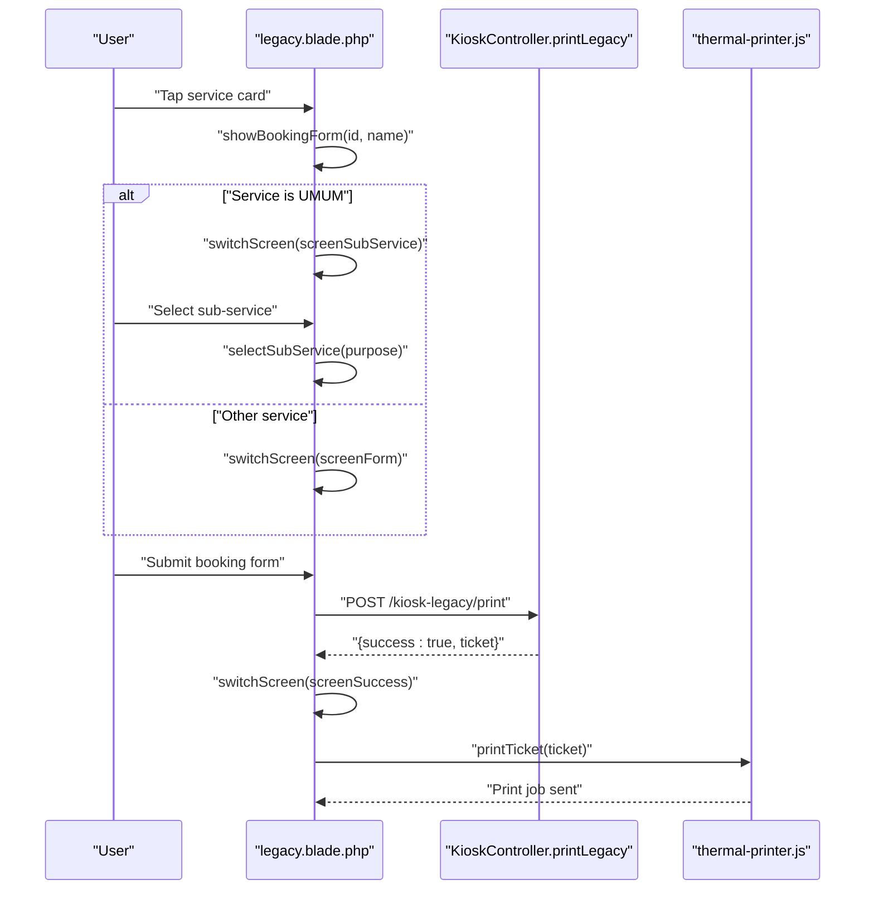
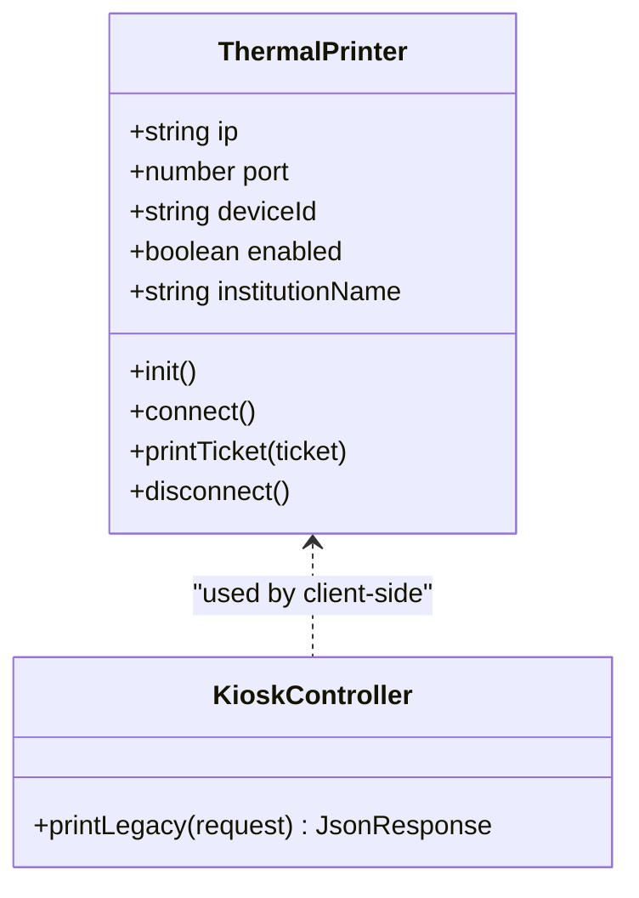
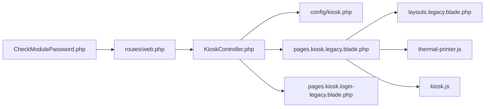

# Legacy Kiosk Support

<cite>
**Referenced Files in This Document**
- [KioskController.php](file://app/Http/Controllers/KioskController.php)
- [routes/web.php](file://routes/web.php)
- [CheckModulePassword.php](file://app/Http/Middleware/CheckModulePassword.php)
- [kiosk.php](file://config/kiosk.php)
- [legacy.blade.php](file://resources/views/pages/kiosk/legacy.blade.php)
- [login-legacy.blade.php](file://resources/views/pages/kiosk/login-legacy.blade.php)
- [legacy.blade.php](file://resources/views/layouts/legacy.blade.php)
- [thermal-printer.js](file://resources/js/thermal-printer.js)
- [kiosk.js](file://resources/js/kiosk.js)
</cite>

## Table of Contents
1. [Introduction](#introduction)
2. [Project Structure](#project-structure)
3. [Core Components](#core-components)
4. [Architecture Overview](#architecture-overview)
5. [Detailed Component Analysis](#detailed-component-analysis)
6. [Dependency Analysis](#dependency-analysis)
7. [Performance Considerations](#performance-considerations)
8. [Troubleshooting Guide](#troubleshooting-guide)
9. [Conclusion](#conclusion)

## Introduction
This document describes the Legacy Kiosk Support functionality designed to operate reliably on older hardware and browsers with limited JavaScript capabilities. It covers the simplified HTML interface, reduced functionality compared to modern kiosks, fallback mechanisms, authentication flow, service selection, and basic ticket printing. It also outlines browser compatibility requirements, performance considerations for older devices, migration strategies, and troubleshooting procedures.

## Project Structure
Legacy Kiosk Support is implemented as a separate module with dedicated routes, controller actions, Blade templates, and client-side scripts. The system provides a plain HTML experience without modern frameworks, ensuring broad compatibility with older devices.

**Diagram sources**
- [routes/web.php:100-106](file://routes/web.php#L100-L106)
- [KioskController.php:59-142](file://app/Http/Controllers/KioskController.php#L59-L142)
- [CheckModulePassword.php:17-33](file://app/Http/Middleware/CheckModulePassword.php#L17-L33)
- [legacy.blade.php:1-112](file://resources/views/layouts/legacy.blade.php#L1-L112)
- [login-legacy.blade.php:1-114](file://resources/views/pages/kiosk/login-legacy.blade.php#L1-L114)
- [legacy.blade.php:1-1059](file://resources/views/pages/kiosk/legacy.blade.php#L1-L1059)
- [thermal-printer.js:1-139](file://resources/js/thermal-printer.js#L1-L139)

**Section sources**
- [routes/web.php:100-106](file://routes/web.php#L100-L106)
- [KioskController.php:59-142](file://app/Http/Controllers/KioskController.php#L59-L142)
- [CheckModulePassword.php:17-33](file://app/Http/Middleware/CheckModulePassword.php#L17-L33)
- [legacy.blade.php:1-112](file://resources/views/layouts/legacy.blade.php#L1-L112)
- [login-legacy.blade.php:1-114](file://resources/views/pages/kiosk/login-legacy.blade.php#L1-L114)
- [legacy.blade.php:1-1059](file://resources/views/pages/kiosk/legacy.blade.php#L1-L1059)
- [thermal-printer.js:1-139](file://resources/js/thermal-printer.js#L1-L139)

## Core Components
- Authentication and session management for legacy kiosks
- Simplified service launcher with optional sub-service selection
- Basic booking form with region selection
- Success screen with countdown and automatic reset
- Optional thermal printer integration via Epson ePOS SDK

Key behaviors:
- Password-based authentication with configurable session lifetime
- Static HTML with minimal JavaScript for older browsers
- Fallback alert modal for error messaging when modern libraries are unavailable
- Optional ESC/POS printing to thermal printers

**Section sources**
- [KioskController.php:64-142](file://app/Http/Controllers/KioskController.php#L64-L142)
- [CheckModulePassword.php:17-33](file://app/Http/Middleware/CheckModulePassword.php#L17-L33)
- [legacy.blade.php:862-920](file://resources/views/pages/kiosk/legacy.blade.php#L862-L920)
- [thermal-printer.js:54-128](file://resources/js/thermal-printer.js#L54-L128)

## Architecture Overview
The legacy kiosk architecture separates concerns into routes, controller, middleware, views, and assets. The controller validates credentials, manages session state, renders the legacy UI, and handles printing requests. The view provides a responsive, touch-optimized interface with fallbacks for older environments.

**Diagram sources**
- [routes/web.php:100-106](file://routes/web.php#L100-L106)
- [CheckModulePassword.php:17-33](file://app/Http/Middleware/CheckModulePassword.php#L17-L33)
- [KioskController.php:64-142](file://app/Http/Controllers/KioskController.php#L64-L142)
- [legacy.blade.php:862-920](file://resources/views/pages/kiosk/legacy.blade.php#L862-L920)
- [thermal-printer.js:54-128](file://resources/js/thermal-printer.js#L54-L128)

## Detailed Component Analysis

### Authentication and Session Management
- Routes define legacy kiosk login and protected endpoints.
- Middleware enforces authentication and session lifetime based on configuration.
- Controller validates the kiosk password against environment configuration and sets session flags.
- Session keys track authentication state and timestamp; expired sessions redirect to login.

**Diagram sources**
- [routes/web.php:100-106](file://routes/web.php#L100-L106)
- [KioskController.php:64-84](file://app/Http/Controllers/KioskController.php#L64-L84)
- [CheckModulePassword.php:22-30](file://app/Http/Middleware/CheckModulePassword.php#L22-L30)
- [kiosk.php:3-7](file://config/kiosk.php#L3-L7)

**Section sources**
- [routes/web.php:100-106](file://routes/web.php#L100-L106)
- [KioskController.php:64-84](file://app/Http/Controllers/KioskController.php#L64-L84)
- [CheckModulePassword.php:17-33](file://app/Http/Middleware/CheckModulePassword.php#L17-L33)
- [kiosk.php:3-7](file://config/kiosk.php#L3-L7)

### Service Selection and Booking Flow
- The legacy view presents service cards with illustrative icons and colors.
- For the "UMUM" service, a sub-service selection screen appears before the booking form.
- The booking form collects visitor name, identity, phone, and region (with Select2 enhancement when available).
- On submit, an AJAX request posts to the print endpoint, displays success with countdown, and optionally prints via ESC/POS.

**Diagram sources**
- [legacy.blade.php:938-976](file://resources/views/pages/kiosk/legacy.blade.php#L938-L976)
- [legacy.blade.php:876-920](file://resources/views/pages/kiosk/legacy.blade.php#L876-L920)
- [KioskController.php:114-142](file://app/Http/Controllers/KioskController.php#L114-L142)
- [thermal-printer.js:54-128](file://resources/js/thermal-printer.js#L54-L128)

**Section sources**
- [legacy.blade.php:528-653](file://resources/views/pages/kiosk/legacy.blade.php#L528-L653)
- [legacy.blade.php:655-758](file://resources/views/pages/kiosk/legacy.blade.php#L655-L758)
- [legacy.blade.php:876-920](file://resources/views/pages/kiosk/legacy.blade.php#L876-L920)
- [KioskController.php:86-112](file://app/Http/Controllers/KioskController.php#L86-L112)

### Thermal Printing Integration
- The client initializes the Epson ePOS SDK connection if enabled and available.
- The controller action creates a queue ticket and returns JSON.
- The client-side printer module formats and sends ESC/POS commands to the thermal printer.

**Diagram sources**
- [thermal-printer.js:5-139](file://resources/js/thermal-printer.js#L5-L139)
- [KioskController.php:114-142](file://app/Http/Controllers/KioskController.php#L114-L142)

**Section sources**
- [thermal-printer.js:5-139](file://resources/js/thermal-printer.js#L5-L139)
- [legacy.blade.php:1012-1056](file://resources/views/pages/kiosk/legacy.blade.php#L1012-L1056)

### Layout and Responsive Design
- The legacy layout loads Metronic assets and disables unsupported features (e.g., CSS backdrop blur) for performance.
- The legacy view defines extensive CSS grid-based responsive breakpoints and mobile-first overrides.
- JavaScript toggles visibility of multiple screens and manages countdown timers.

**Section sources**
- [legacy.blade.php:1-112](file://resources/views/layouts/legacy.blade.php#L1-L112)
- [legacy.blade.php:148-451](file://resources/views/pages/kiosk/legacy.blade.php#L148-L451)
- [legacy.blade.php:973-994](file://resources/views/pages/kiosk/legacy.blade.php#L973-L994)

## Dependency Analysis
- Routes depend on the controller actions for authentication and content rendering.
- Controller actions depend on configuration for passwords and session lifetimes.
- Views depend on the layout and optional Epson SDK for printing.
- Client-side scripts depend on jQuery and optional SweetAlert for UX.

**Diagram sources**
- [routes/web.php:100-106](file://routes/web.php#L100-L106)
- [KioskController.php:59-142](file://app/Http/Controllers/KioskController.php#L59-L142)
- [kiosk.php:3-7](file://config/kiosk.php#L3-L7)
- [legacy.blade.php:1-112](file://resources/views/layouts/legacy.blade.php#L1-L112)
- [login-legacy.blade.php:1-114](file://resources/views/pages/kiosk/login-legacy.blade.php#L1-L114)
- [thermal-printer.js:1-139](file://resources/js/thermal-printer.js#L1-L139)
- [kiosk.js:1-2](file://resources/js/kiosk.js#L1-L2)
- [CheckModulePassword.php:17-33](file://app/Http/Middleware/CheckModulePassword.php#L17-L33)

**Section sources**
- [routes/web.php:100-106](file://routes/web.php#L100-L106)
- [KioskController.php:59-142](file://app/Http/Controllers/KioskController.php#L59-L142)
- [CheckModulePassword.php:17-33](file://app/Http/Middleware/CheckModulePassword.php#L17-L33)

## Performance Considerations
- Minimize JavaScript usage: rely on vanilla DOM manipulation and avoid modern APIs.
- Disable heavy CSS features (e.g., backdrop blur) to improve rendering performance on older devices.
- Use CSS Grid for robust layout and reduce reliance on complex Flexbox fallbacks.
- Keep asset sizes small: load only necessary Metronic bundles and defer non-critical enhancements.
- Prefer direct DOM queries and avoid deep selector chains for better performance on low-powered devices.

[No sources needed since this section provides general guidance]

## Troubleshooting Guide
Common issues and resolutions:
- Authentication failures: verify the configured kiosk password and ensure the environment variable is set correctly.
- Region selection empty: confirm the active kabupaten scope is selected in settings so child kelurahan/desa are available.
- Thermal printer errors: check Epson SDK availability, network connectivity to the printer IP/port, and printer status.
- Browser compatibility: ensure the device supports jQuery and basic DOM APIs; fallback alerts are used when modern libraries are missing.
- Session timeouts: adjust session lifetime configuration if sessions expire too quickly.

Operational checks:
- Confirm routes are registered for legacy kiosk endpoints.
- Validate middleware redirection to the correct login URL for legacy modules.
- Test AJAX printing endpoint returns expected JSON structure.

**Section sources**
- [KioskController.php:64-84](file://app/Http/Controllers/KioskController.php#L64-L84)
- [legacy.blade.php:707-731](file://resources/views/pages/kiosk/legacy.blade.php#L707-L731)
- [thermal-printer.js:16-46](file://resources/js/thermal-printer.js#L16-L46)
- [CheckModulePassword.php:38-45](file://app/Http/Middleware/CheckModulePassword.php#L38-L45)
- [routes/web.php:100-106](file://routes/web.php#L100-L106)

## Migration Strategies
- Gradually replace legacy kiosks with modern kiosks by enabling the modern UI and disabling legacy routes after training staff.
- Maintain dual endpoints during transition to allow rollback if needed.
- Standardize configuration for passwords and session lifetimes across both legacy and modern modules to simplify administration.
- Retire legacy assets and routes after all kiosks are migrated.

[No sources needed since this section provides general guidance]

## Conclusion
Legacy Kiosk Support delivers a robust, backward-compatible interface for older hardware and browsers. By combining password-based authentication, a simplified service selection flow, and optional thermal printing, it ensures reliable operation while maintaining clear migration pathways to modern kiosks.