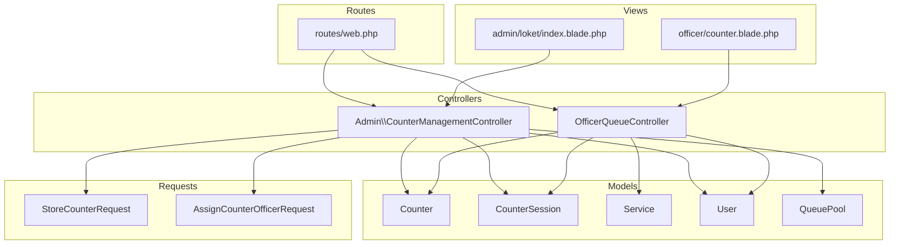
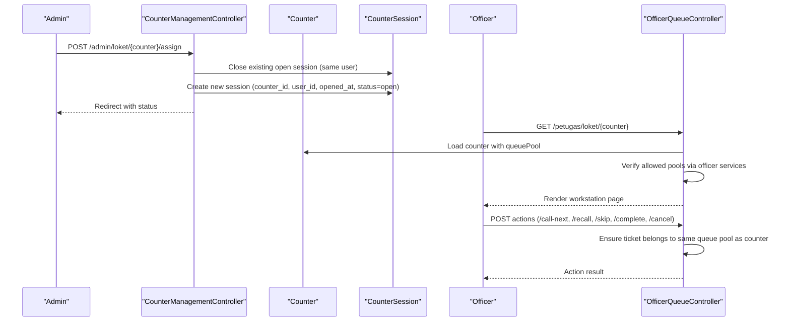
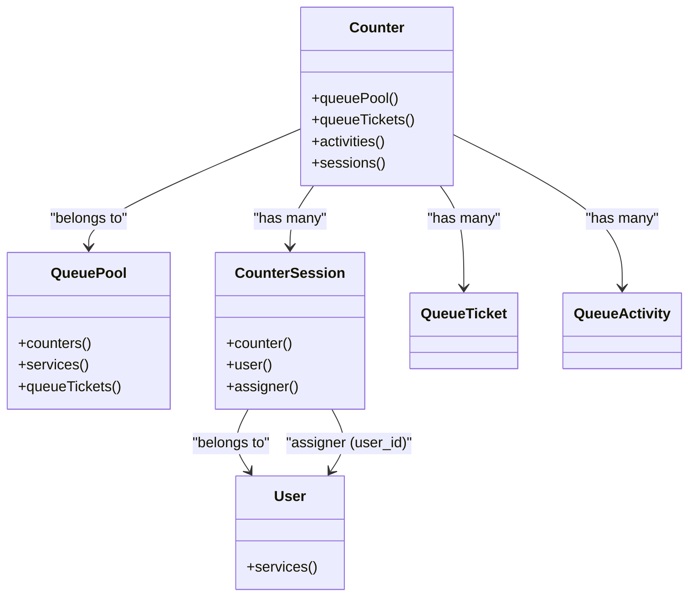
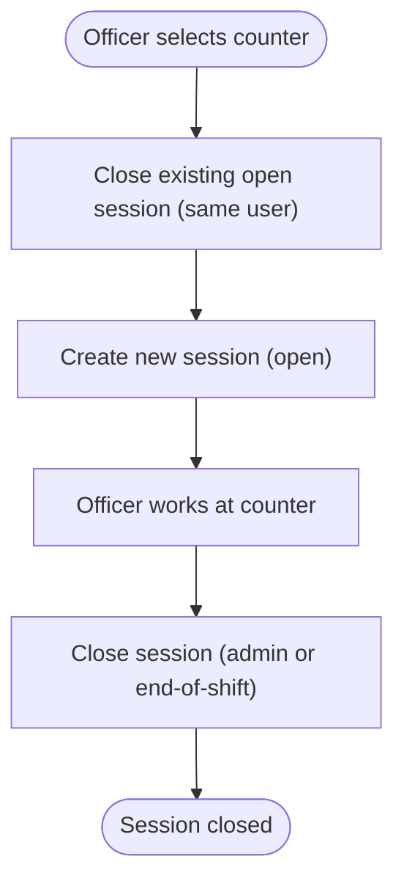
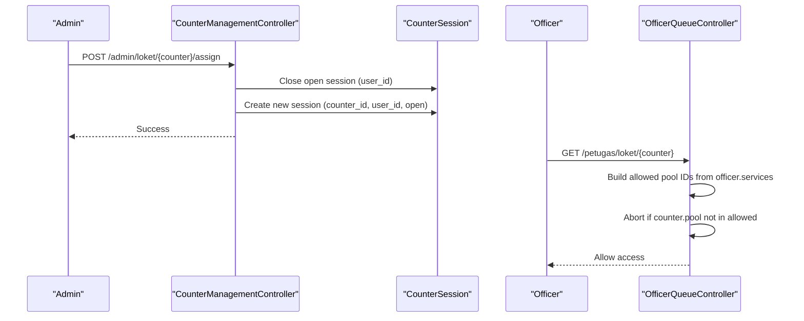
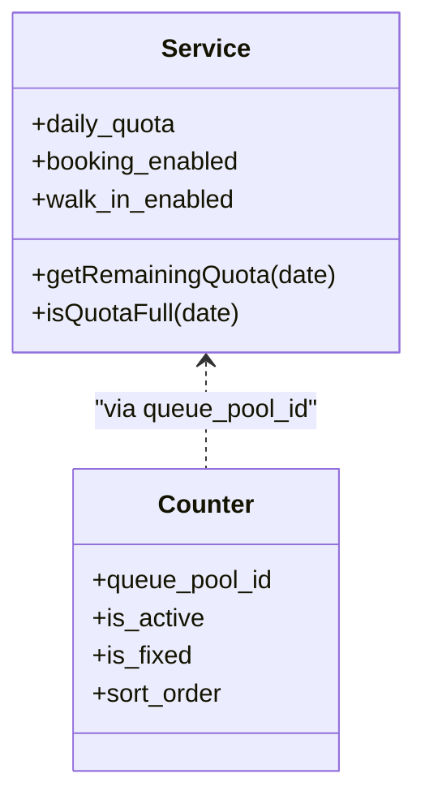
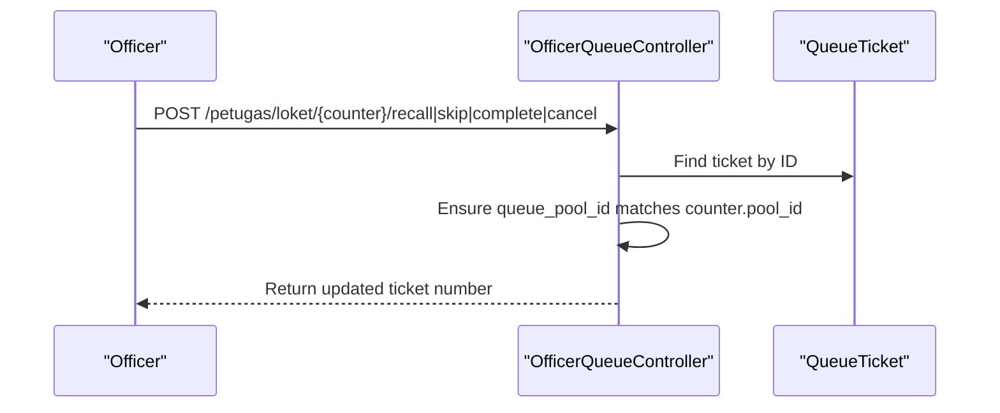
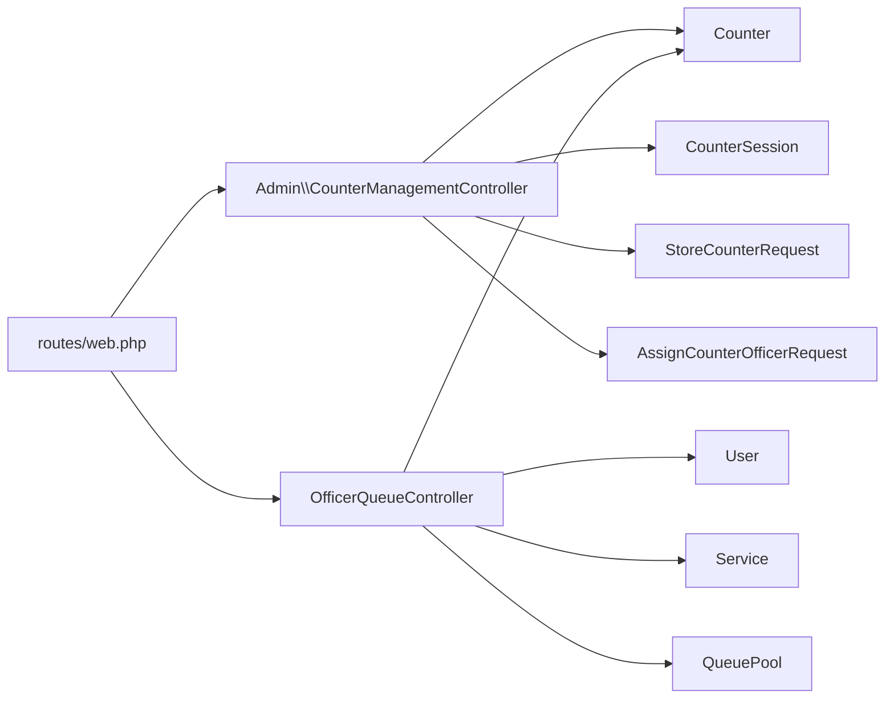

# Counter Management

<cite>
**Referenced Files in This Document**
- [Counter.php](file://app/Models/Counter.php)
- [CounterSession.php](file://app/Models/CounterSession.php)
- [CounterManagementController.php](file://app/Http/Controllers/Admin/CounterManagementController.php)
- [OfficerQueueController.php](file://app/Http/Controllers/OfficerQueueController.php)
- [AssignCounterOfficerRequest.php](file://app/Http/Requests/AssignCounterOfficerRequest.php)
- [StoreCounterRequest.php](file://app/Http/Requests/StoreCounterRequest.php)
- [UpdateCounterRequest.php](file://app/Http/Requests/UpdateCounterRequest.php)
- [web.php](file://routes/web.php)
- [2026_03_06_015236_create_counters_table.php](file://database/migrations/2026_03_06_015236_create_counters_table.php)
- [2026_03_06_015237_create_counter_sessions_table.php](file://database/migrations/2026_03_06_015237_create_counter_sessions_table.php)
- [2026_03_30_181555_add_visit_purpose_to_queue_tickets_and_is_fixed_to_counters_and_assigned_by_to_counter_sessions.php](file://database/migrations/2026_03_30_181555_add_visit_purpose_to_queue_tickets_and_is_fixed_to_counters_and_assigned_by_to_counter_sessions.php)
- [Service.php](file://app/Models/Service.php)
- [User.php](file://app/Models/User.php)
- [QueuePool.php](file://app/Models/QueuePool.php)
- [counter.blade.php](file://resources/views/pages/officer/counter.blade.php)
- [index.blade.php](file://resources/views/pages/admin/loket/index.blade.php)
- [ServiceTest.php](file://tests/Unit/Models/ServiceTest.php)
</cite>

## Table of Contents
1. [Introduction](#introduction)
2. [Project Structure](#project-structure)
3. [Core Components](#core-components)
4. [Architecture Overview](#architecture-overview)
5. [Detailed Component Analysis](#detailed-component-analysis)
6. [Dependency Analysis](#dependency-analysis)
7. [Performance Considerations](#performance-considerations)
8. [Troubleshooting Guide](#troubleshooting-guide)
9. [Conclusion](#conclusion)

## Introduction
This document explains the Counter Management functionality within Officer Operations. It covers how counters are configured, how officers are assigned to counters, how sessions are managed, and how queue pool associations and service permissions govern access. It also documents the counter session lifecycle, shift management, and performance tracking considerations, along with configuration options, capacity limits, setup guidelines, maintenance procedures, and troubleshooting.

## Project Structure
Counter Management spans models, controllers, requests, routes, and views:
- Models define the data structures and relationships for counters, sessions, services, users, and queue pools.
- Controllers handle administrative actions (create/update/delete counters, assign/release officers) and officer-facing operations (workstation access and queue actions).
- Requests enforce validation rules for counter creation and assignments.
- Routes expose endpoints for admin and officer workflows.
- Views render the admin counter management UI and the officer workstation page.

**Diagram sources**
- [Counter.php:1-53](file://app/Models/Counter.php#L1-L53)
- [CounterSession.php:1-46](file://app/Models/CounterSession.php#L1-L46)
- [CounterManagementController.php:1-124](file://app/Http/Controllers/Admin/CounterManagementController.php#L1-L124)
- [OfficerQueueController.php:1-96](file://app/Http/Controllers/OfficerQueueController.php#L1-L96)
- [StoreCounterRequest.php:1-32](file://app/Http/Requests/StoreCounterRequest.php#L1-L32)
- [AssignCounterOfficerRequest.php:1-21](file://app/Http/Requests/AssignCounterOfficerRequest.php#L1-L21)
- [web.php:1-127](file://routes/web.php#L1-L127)
- [index.blade.php:138-345](file://resources/views/pages/admin/loket/index.blade.php#L138-L345)
- [counter.blade.php:1-33](file://resources/views/pages/officer/counter.blade.php#L1-L33)

**Section sources**
- [Counter.php:1-53](file://app/Models/Counter.php#L1-L53)
- [CounterSession.php:1-46](file://app/Models/CounterSession.php#L1-L46)
- [CounterManagementController.php:1-124](file://app/Http/Controllers/Admin/CounterManagementController.php#L1-L124)
- [OfficerQueueController.php:1-96](file://app/Http/Controllers/OfficerQueueController.php#L1-L96)
- [StoreCounterRequest.php:1-32](file://app/Http/Requests/StoreCounterRequest.php#L1-L32)
- [AssignCounterOfficerRequest.php:1-21](file://app/Http/Requests/AssignCounterOfficerRequest.php#L1-L21)
- [web.php:1-127](file://routes/web.php#L1-L127)
- [index.blade.php:138-345](file://resources/views/pages/admin/loket/index.blade.php#L138-L345)
- [counter.blade.php:1-33](file://resources/views/pages/officer/counter.blade.php#L1-L33)

## Core Components
- Counter: Represents a physical or logical workstation with pool association, activation flag, fixed flag, sorting order, and related sessions and tickets.
- CounterSession: Tracks open/close sessions of officers at counters, including timestamps and who assigned the session.
- OfficerQueueController: Provides officer access to a counter’s workstation, enforces service-permission gating via queue pool matching, and exposes queue actions.
- Admin CounterManagementController: Manages counters (CRUD), assigns officers to counters, releases current assignments, and displays active sessions.
- Requests: Validation rules for counter creation and officer assignment.
- Routes: Expose endpoints for admin counter management and officer operations.
- Views: Admin UI for managing counters and assigning officers; officer workstation page.

**Section sources**
- [Counter.php:1-53](file://app/Models/Counter.php#L1-L53)
- [CounterSession.php:1-46](file://app/Models/CounterSession.php#L1-L46)
- [OfficerQueueController.php:1-96](file://app/Http/Controllers/OfficerQueueController.php#L1-L96)
- [CounterManagementController.php:1-124](file://app/Http/Controllers/Admin/CounterManagementController.php#L1-L124)
- [StoreCounterRequest.php:1-32](file://app/Http/Requests/StoreCounterRequest.php#L1-L32)
- [AssignCounterOfficerRequest.php:1-21](file://app/Http/Requests/AssignCounterOfficerRequest.php#L1-L21)
- [web.php:1-127](file://routes/web.php#L1-L127)
- [index.blade.php:138-345](file://resources/views/pages/admin/loket/index.blade.php#L138-L345)
- [counter.blade.php:1-33](file://resources/views/pages/officer/counter.blade.php#L1-L33)

## Architecture Overview
Counter Management integrates administrative controls with operational workflows:
- Admins configure counters and assign officers to counters for the current day.
- Officers select a counter from their allowed set (based on service permissions) and operate the workstation.
- Queue pool associations ensure officers can only act on tickets belonging to their permitted pools.

**Diagram sources**
- [CounterManagementController.php:80-124](file://app/Http/Controllers/Admin/CounterManagementController.php#L80-L124)
- [OfficerQueueController.php:18-95](file://app/Http/Controllers/OfficerQueueController.php#L18-L95)
- [web.php:48-90](file://routes/web.php#L48-L90)

## Detailed Component Analysis

### Counter Model and Relationships
- Fields include pool association, name/code, activation flag, fixed flag, and sort order.
- Relationships:
  - Belongs to QueuePool.
  - Has many QueueTickets and QueueActivities.
  - Has many CounterSessions.

**Diagram sources**
- [Counter.php:1-53](file://app/Models/Counter.php#L1-L53)
- [CounterSession.php:1-46](file://app/Models/CounterSession.php#L1-L46)
- [QueuePool.php:1-43](file://app/Models/QueuePool.php#L1-L43)
- [User.php:1-99](file://app/Models/User.php#L1-L99)

**Section sources**
- [Counter.php:1-53](file://app/Models/Counter.php#L1-L53)
- [CounterSession.php:1-46](file://app/Models/CounterSession.php#L1-L46)
- [QueuePool.php:1-43](file://app/Models/QueuePool.php#L1-L43)
- [User.php:1-99](file://app/Models/User.php#L1-L99)

### Counter Session Lifecycle
- Opening a session:
  - Close any existing open session for the same user.
  - Create a new session record with open status and timestamp.
- Closing a session:
  - Close the current open session for the counter.
- Shift management:
  - Sessions are scoped to the current day for active sessions display.
- Performance tracking:
  - Sessions associate officers to counters for auditability and reporting.

**Diagram sources**
- [CounterManagementController.php:80-124](file://app/Http/Controllers/Admin/CounterManagementController.php#L80-L124)
- [CounterSession.php:1-46](file://app/Models/CounterSession.php#L1-L46)

**Section sources**
- [CounterManagementController.php:80-124](file://app/Http/Controllers/Admin/CounterManagementController.php#L80-L124)
- [CounterSession.php:1-46](file://app/Models/CounterSession.php#L1-L46)

### Officer-Counter Assignment and Access Control
- Admin assignment:
  - Admin posts to assign an officer to a counter; the controller closes any open session for that user and opens a new session for the selected counter.
  - Admin can also release the current officer from a counter.
- Officer access:
  - Officer can only access a counter if the counter’s queue pool matches the officer’s allowed service pools.
  - The controller enforces this by checking the officer’s services’ queue pool IDs against the counter’s pool ID.

**Diagram sources**
- [CounterManagementController.php:80-124](file://app/Http/Controllers/Admin/CounterManagementController.php#L80-L124)
- [OfficerQueueController.php:18-38](file://app/Http/Controllers/OfficerQueueController.php#L18-L38)
- [web.php:48-55](file://routes/web.php#L48-L55)

**Section sources**
- [CounterManagementController.php:80-124](file://app/Http/Controllers/Admin/CounterManagementController.php#L80-L124)
- [OfficerQueueController.php:18-38](file://app/Http/Controllers/OfficerQueueController.php#L18-L38)
- [web.php:48-55](file://routes/web.php#L48-L55)

### Counter Configuration Options and Capacity Limits
- Counter configuration:
  - Pool association, name, code, activation flag, fixed flag, sort order.
  - Unique code constraint prevents duplicates.
- Capacity and quotas:
  - Services define daily quotas and whether walk-ins/online bookings are enabled.
  - Remaining quota calculation excludes cancelled tickets and respects date boundaries.
- Fixed counters:
  - A fixed flag indicates counters that are pre-assigned and not selectable by officers.

**Diagram sources**
- [Service.php:1-101](file://app/Models/Service.php#L1-L101)
- [Counter.php:1-53](file://app/Models/Counter.php#L1-L53)

**Section sources**
- [StoreCounterRequest.php:1-32](file://app/Http/Requests/StoreCounterRequest.php#L1-L32)
- [2026_03_06_015236_create_counters_table.php:1-35](file://database/migrations/2026_03_06_015236_create_counters_table.php#L1-L35)
- [Service.php:1-101](file://app/Models/Service.php#L1-L101)
- [ServiceTest.php:43-119](file://tests/Unit/Models/ServiceTest.php#L43-L119)
- [2026_03_30_181555_add_visit_purpose_to_queue_tickets_and_is_fixed_to_counters_and_assigned_by_to_counter_sessions.php:1-46](file://database/migrations/2026_03_30_181555_add_visit_purpose_to_queue_tickets_and_is_fixed_to_counters_and_assigned_by_to_counter_sessions.php#L1-L46)

### Officer Workstation and Queue Actions
- Workstation page:
  - Renders the officer dashboard for the selected counter.
- Queue actions:
  - Officers can call next, recall, skip, complete, or cancel tickets.
  - Each action validates that the ticket belongs to the same queue pool as the counter.

**Diagram sources**
- [OfficerQueueController.php:51-95](file://app/Http/Controllers/OfficerQueueController.php#L51-L95)
- [counter.blade.php:1-33](file://resources/views/pages/officer/counter.blade.php#L1-L33)

**Section sources**
- [OfficerQueueController.php:18-95](file://app/Http/Controllers/OfficerQueueController.php#L18-L95)
- [counter.blade.php:1-33](file://resources/views/pages/officer/counter.blade.php#L1-L33)

## Dependency Analysis
- Administrative actions depend on:
  - CounterManagementController for CRUD and assignment.
  - Counter and CounterSession models for persistence.
  - AssignCounterOfficerRequest for validation.
- Officer operations depend on:
  - OfficerQueueController for access and actions.
  - User model for service permissions and queue pool checks.
  - Service model for pool associations.
  - Counter and QueuePool for pool linkage.

**Diagram sources**
- [CounterManagementController.php:1-124](file://app/Http/Controllers/Admin/CounterManagementController.php#L1-L124)
- [OfficerQueueController.php:1-96](file://app/Http/Controllers/OfficerQueueController.php#L1-L96)
- [web.php:1-127](file://routes/web.php#L1-L127)

**Section sources**
- [CounterManagementController.php:1-124](file://app/Http/Controllers/Admin/CounterManagementController.php#L1-L124)
- [OfficerQueueController.php:1-96](file://app/Http/Controllers/OfficerQueueController.php#L1-L96)
- [web.php:1-127](file://routes/web.php#L1-L127)

## Performance Considerations
- Indexes:
  - Counter sessions indexed by counter_id and status, and by user_id and status to efficiently query active sessions.
  - Counters indexed by queue_pool_id and is_active to quickly filter active counters per pool.
- Queries:
  - Active sessions are filtered by today’s date to avoid cross-day overlap.
  - Officer counter selection is constrained by allowed service pools to reduce UI and backend filtering overhead.
- Recommendations:
  - Keep sort_order consistent to minimize UI rendering churn.
  - Use pool scoping to limit visible counters for officers and reduce client-side filtering.

**Section sources**
- [2026_03_06_015237_create_counter_sessions_table.php:21-32](file://database/migrations/2026_03_06_015237_create_counter_sessions_table.php#L21-L32)
- [2026_03_06_015236_create_counters_table.php:14-24](file://database/migrations/2026_03_06_015236_create_counters_table.php#L14-L24)
- [CounterManagementController.php:38-43](file://app/Http/Controllers/Admin/CounterManagementController.php#L38-L43)

## Troubleshooting Guide
- Officer cannot access a counter:
  - Verify the counter’s queue pool is included in the officer’s service permissions.
  - Confirm the officer’s services are properly linked to queue pools.
- No counters available in officer UI:
  - Ensure counters are active and associated with pools that match the officer’s services.
  - Confirm sort_order and is_active flags are set correctly.
- Duplicate session errors:
  - Ensure any existing open session for the officer is closed before assigning a new counter.
- Session not appearing in admin dashboard:
  - Confirm sessions are open and from today; the dashboard filters by open status and current date.
- Capacity limit confusion:
  - Daily quotas are enforced per service and per date; cancelled tickets are excluded from usage calculations.

**Section sources**
- [OfficerQueueController.php:18-38](file://app/Http/Controllers/OfficerQueueController.php#L18-L38)
- [CounterManagementController.php:38-43](file://app/Http/Controllers/Admin/CounterManagementController.php#L38-L43)
- [Service.php:73-99](file://app/Models/Service.php#L73-L99)
- [ServiceTest.php:43-119](file://tests/Unit/Models/ServiceTest.php#L43-L119)

## Conclusion
Counter Management centers on secure, permission-driven assignment of officers to counters, with robust session lifecycle handling and queue pool enforcement. Administrators configure counters and manage daily shifts, while officers operate workstations aligned to their service-permitted pools. Capacity limits and performance indexes support scalable operations, and the troubleshooting guidance helps maintain smooth workflows.