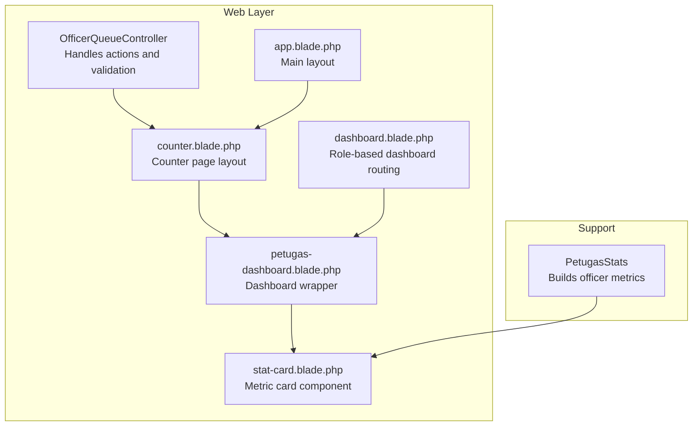
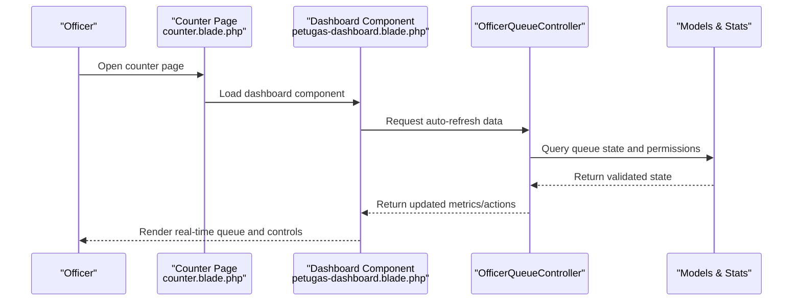
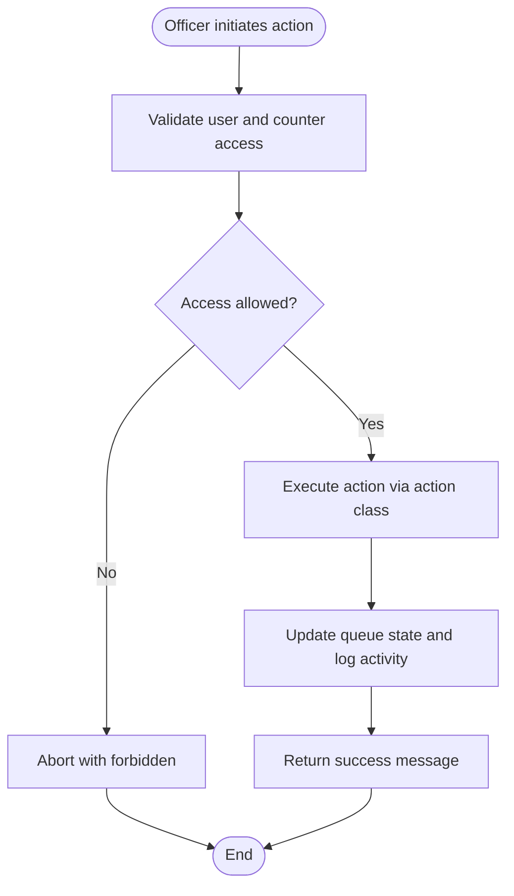
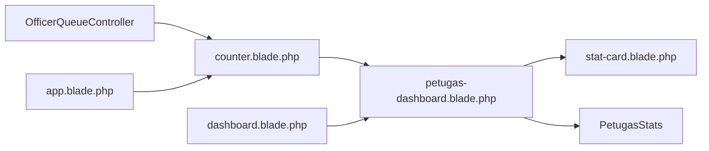

# Officer Interface

<cite>
**Referenced Files in This Document**
- [OfficerQueueController.php](file://app/Http/Controllers/OfficerQueueController.php)
- [counter.blade.php](file://resources/views/pages/officer/counter.blade.php)
- [petugas-dashboard.blade.php](file://resources/views/components/dashboard/petugas-dashboard.blade.php)
- [stat-card.blade.php](file://resources/views/components/dashboard/stat-card.blade.php)
- [dashboard.blade.php](file://resources/views/dashboard.blade.php)
- [app.blade.php](file://resources/views/layouts/app.blade.php)
- [PetugasStats.php](file://app/Support/Dashboard/PetugasStats.php)
- [OfficerQueueControllerTest.php](file://tests/Feature/Officer/OfficerQueueControllerTest.php)
- [PetugasDashboardTest.php](file://tests/Feature/Dashboard/PetugasDashboardTest.php)
</cite>

## Table of Contents
1. [Introduction](#introduction)
2. [Project Structure](#project-structure)
3. [Core Components](#core-components)
4. [Architecture Overview](#architecture-overview)
5. [Detailed Component Analysis](#detailed-component-analysis)
6. [Dependency Analysis](#dependency-analysis)
7. [Performance Considerations](#performance-considerations)
8. [Accessibility and Mobile Compatibility](#accessibility-and-mobile-compatibility)
9. [User Guidance and Best Practices](#user-guidance-and-best-practices)
10. [Troubleshooting Guide](#troubleshooting-guide)
11. [Conclusion](#conclusion)

## Introduction
This document provides comprehensive documentation for the Officer Interface components and user experience within the queue management system. It explains the counter dashboard layout, real-time queue status display, and interactive controls for ticket operations. It also documents the statistical cards showing current queue metrics, service statistics, and performance indicators. Finally, it covers interface responsiveness, accessibility features, mobile compatibility considerations, and practical guidance for efficient navigation and workflow optimization during peak hours.

## Project Structure
The Officer Interface is composed of:
- A controller that handles officer-specific queue operations and validates access per counter pool
- Blade templates for the counter page and dashboard components
- Livewire-driven dashboard for real-time updates and officer actions
- Reusable stat card component for displaying metrics
- Supporting statistics utility for building performance indicators

**Diagram sources**
- [OfficerQueueController.php:1-96](file://app/Http/Controllers/OfficerQueueController.php#L1-L96)
- [counter.blade.php:1-33](file://resources/views/pages/officer/counter.blade.php#L1-L33)
- [petugas-dashboard.blade.php:1-9](file://resources/views/components/dashboard/petugas-dashboard.blade.php#L1-L9)
- [stat-card.blade.php:1-59](file://resources/views/components/dashboard/stat-card.blade.php#L1-L59)
- [dashboard.blade.php:1-16](file://resources/views/dashboard.blade.php#L1-L16)
- [app.blade.php:1-6](file://resources/views/layouts/app.blade.php#L1-L6)
- [PetugasStats.php:1-60](file://app/Support/Dashboard/PetugasStats.php#L1-L60)

**Section sources**
- [OfficerQueueController.php:1-96](file://app/Http/Controllers/OfficerQueueController.php#L1-L96)
- [counter.blade.php:1-33](file://resources/views/pages/officer/counter.blade.php#L1-L33)
- [petugas-dashboard.blade.php:1-9](file://resources/views/components/dashboard/petugas-dashboard.blade.php#L1-L9)
- [stat-card.blade.php:1-59](file://resources/views/components/dashboard/stat-card.blade.php#L1-L59)
- [dashboard.blade.php:1-16](file://resources/views/dashboard.blade.php#L1-L16)
- [app.blade.php:1-6](file://resources/views/layouts/app.blade.php#L1-L6)
- [PetugasStats.php:1-60](file://app/Support/Dashboard/PetugasStats.php#L1-L60)

## Core Components
- Counter Page Layout: Provides the full-screen counter interface with header navigation and embedded dashboard component
- Dashboard Wrapper: Renders the operational panel for officer actions and queue management
- Stat Card Component: Reusable metric display with color-coded themes and trend indicators
- Statistics Builder: Aggregates officer performance metrics for today's service activities
- Controller Actions: Secure endpoints for calling, recalling, skipping, completing, and canceling tickets

Key responsibilities:
- Enforce role-based access and counter pool validation
- Provide real-time updates via periodic polling
- Render actionable controls for queue progression
- Present performance indicators for productivity monitoring

**Section sources**
- [counter.blade.php:1-33](file://resources/views/pages/officer/counter.blade.php#L1-L33)
- [petugas-dashboard.blade.php:1-9](file://resources/views/components/dashboard/petugas-dashboard.blade.php#L1-L9)
- [stat-card.blade.php:1-59](file://resources/views/components/dashboard/stat-card.blade.php#L1-L59)
- [PetugasStats.php:1-60](file://app/Support/Dashboard/PetugasStats.php#L1-L60)
- [OfficerQueueController.php:1-96](file://app/Http/Controllers/OfficerQueueController.php#L1-L96)

## Architecture Overview
The Officer Interface follows a layered architecture:
- Presentation: Blade templates and Livewire components
- Control: Controller actions for ticket operations
- Data: Models and statistics builder for metrics
- Validation: Role and pool-based access checks

**Diagram sources**
- [counter.blade.php:25-26](file://resources/views/pages/officer/counter.blade.php#L25-L26)
- [petugas-dashboard.blade.php:7-7](file://resources/views/components/dashboard/petugas-dashboard.blade.php#L7-L7)
- [OfficerQueueController.php:18-38](file://app/Http/Controllers/OfficerQueueController.php#L18-L38)

## Detailed Component Analysis

### Counter Page Layout
The counter page provides a dedicated, full-screen workstation for officers:
- Header with counter name and back navigation to the main dashboard
- Embedded dashboard component for immediate access to queue controls
- Responsive viewport settings for mobile and tablet compatibility
- Dark theme styling optimized for screen visibility

Responsibilities:
- Host the dashboard component in full-screen mode
- Provide contextual navigation and branding
- Apply responsive design patterns for diverse devices

**Section sources**
- [counter.blade.php:1-33](file://resources/views/pages/officer/counter.blade.php#L1-L33)

### Dashboard Wrapper
The dashboard wrapper encapsulates the operational panel:
- Heading and subheading for context
- Embeds the Livewire dashboard component for reactive updates
- Supports role-based rendering in the main dashboard

Integration:
- Loaded by the counter page and by the main dashboard route
- Uses Flux UI components for consistent styling

**Section sources**
- [petugas-dashboard.blade.php:1-9](file://resources/views/components/dashboard/petugas-dashboard.blade.php#L1-L9)
- [dashboard.blade.php:7-8](file://resources/views/dashboard.blade.php#L7-L8)

### Stat Card Component
The stat card component renders metric displays with:
- Value, label, and icon
- Color-coded variants for different contexts
- Optional trend indicator support
- Responsive typography and spacing

Usage:
- Consumed by the dashboard and statistics builder
- Supports multiple color themes for quick visual scanning

**Section sources**
- [stat-card.blade.php:1-59](file://resources/views/components/dashboard/stat-card.blade.php#L1-L59)

### Statistics Builder
The statistics builder aggregates officer performance metrics:
- Completed tickets for the day
- Action counts (skipped, recalled, completed)
- Service distribution across service types
- Date-scoped aggregation for daily reporting

Data sources:
- Queue activity records
- Joined queue tickets and services
- User-scoped filtering

**Section sources**
- [PetugasStats.php:1-60](file://app/Support/Dashboard/PetugasStats.php#L1-L60)

### Controller Actions and Access Control
The controller enforces secure operations:
- Validates user authentication and role
- Restricts access to counters within the officer's assigned pools
- Executes ticket actions with proper validation and feedback
- Returns standardized messages for each operation

Operations supported:
- Call next ticket
- Recall ticket
- Skip ticket
- Complete ticket
- Cancel ticket

Security measures:
- Pool ID validation ensures actions apply only to the correct queue pool
- Fallback responses when no queue is available

**Diagram sources**
- [OfficerQueueController.php:20-31](file://app/Http/Controllers/OfficerQueueController.php#L20-L31)
- [OfficerQueueController.php:40-89](file://app/Http/Controllers/OfficerQueueController.php#L40-L89)

**Section sources**
- [OfficerQueueController.php:1-96](file://app/Http/Controllers/OfficerQueueController.php#L1-L96)

## Dependency Analysis
The Officer Interface components depend on:
- Blade templates for presentation and layout
- Livewire components for reactive UI updates
- Controller actions for backend operations
- Statistics utility for performance metrics
- Models for data persistence and joins

**Diagram sources**
- [OfficerQueueController.php:1-96](file://app/Http/Controllers/OfficerQueueController.php#L1-L96)
- [counter.blade.php:1-33](file://resources/views/pages/officer/counter.blade.php#L1-L33)
- [petugas-dashboard.blade.php:1-9](file://resources/views/components/dashboard/petugas-dashboard.blade.php#L1-L9)
- [stat-card.blade.php:1-59](file://resources/views/components/dashboard/stat-card.blade.php#L1-L59)
- [dashboard.blade.php:1-16](file://resources/views/dashboard.blade.php#L1-L16)
- [app.blade.php:1-6](file://resources/views/layouts/app.blade.php#L1-L6)
- [PetugasStats.php:1-60](file://app/Support/Dashboard/PetugasStats.php#L1-L60)

**Section sources**
- [OfficerQueueController.php:1-96](file://app/Http/Controllers/OfficerQueueController.php#L1-L96)
- [PetugasStats.php:1-60](file://app/Support/Dashboard/PetugasStats.php#L1-L60)

## Performance Considerations
- Auto-refresh interval: The dashboard polls periodically to keep data current without manual refresh
- Minimal payload: Responses return concise messages for actions, reducing bandwidth
- Efficient queries: Statistics aggregation uses targeted joins and grouping for timely results
- Rendering optimization: Blade components separate concerns and enable incremental updates via Livewire

Recommendations:
- Monitor polling frequency to balance freshness and resource usage
- Cache frequently accessed metrics where appropriate
- Ensure database indexes on date-based filters and foreign keys

[No sources needed since this section provides general guidance]

## Accessibility and Mobile Compatibility
- Responsive viewport: The counter page sets viewport-fit and responsive scaling for mobile devices
- Dark theme: Background gradients and dark palette improve readability under various lighting conditions
- Clear typography: Large headings and readable subheadings aid quick comprehension
- Keyboard-friendly controls: Buttons and navigation should be operable via keyboard for assistive technologies
- Color contrast: Stat cards use color variants with sufficient contrast for low-light environments

Mobile considerations:
- Full-screen mode: Counter page is designed for full-screen operation on tablets and monitors
- Touch targets: Buttons and controls sized appropriately for touch interaction
- Landscape orientation: Consider wider layouts for counters with multiple metrics

**Section sources**
- [counter.blade.php:5-11](file://resources/views/pages/officer/counter.blade.php#L5-L11)
- [stat-card.blade.php:10-48](file://resources/views/components/dashboard/stat-card.blade.php#L10-L48)

## User Guidance and Best Practices
Navigation tips:
- Use the back button in the counter header to return to the main dashboard
- Select the appropriate counter from the dashboard before performing actions
- Utilize the full-screen mode for distraction-free work

Common shortcuts:
- Quick action buttons for call-next, recall, skip, complete, and cancel
- Auto-refresh keeps the interface current without manual polling

Workflow optimization during peak hours:
- Focus on call-next to maintain continuous throughput
- Use recall sparingly for corrections; batch similar actions
- Skip tickets only when necessary to minimize queue disruption
- Complete tickets promptly to free counters for new clients
- Monitor performance indicators to identify bottlenecks and adjust staffing

**Section sources**
- [counter.blade.php:19-21](file://resources/views/pages/officer/counter.blade.php#L19-L21)
- [PetugasStats.php:14-18](file://app/Support/Dashboard/PetugasStats.php#L14-L18)

## Troubleshooting Guide
Common issues and resolutions:
- No queue available: Controller responds with a message indicating no queue; wait briefly or check counter assignment
- Access denied: Pool validation prevents actions outside assigned services; verify officer service assignments
- Action errors: Ensure the selected counter belongs to the same queue pool as the target ticket

Verification steps:
- Confirm user role and service assignments
- Verify counter pool matches ticket pool
- Check network connectivity for auto-refresh
- Review browser console for JavaScript errors

**Section sources**
- [OfficerQueueController.php:44-48](file://app/Http/Controllers/OfficerQueueController.php#L44-L48)
- [OfficerQueueController.php:91-94](file://app/Http/Controllers/OfficerQueueController.php#L91-L94)

## Conclusion
The Officer Interface delivers a focused, responsive, and secure environment for queue officers. Its real-time dashboard, actionable controls, and performance metrics streamline daily operations while ensuring compliance with access policies. By following the recommended practices and leveraging the built-in features, officers can maintain efficient workflows even during peak periods.