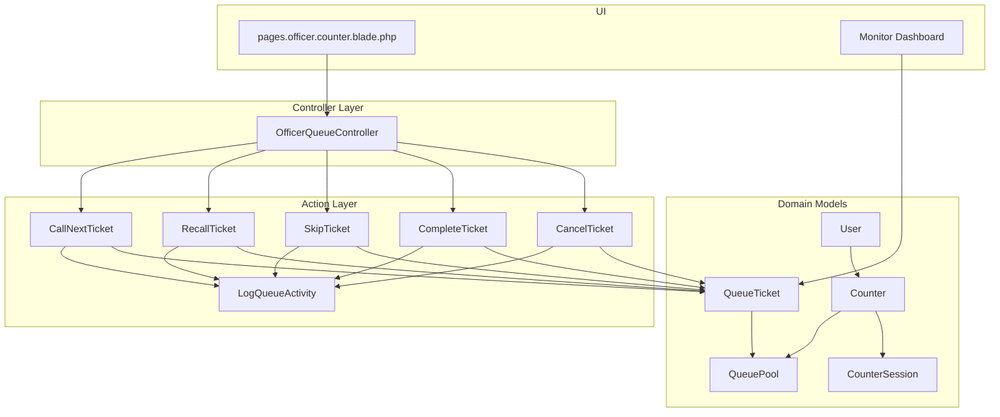
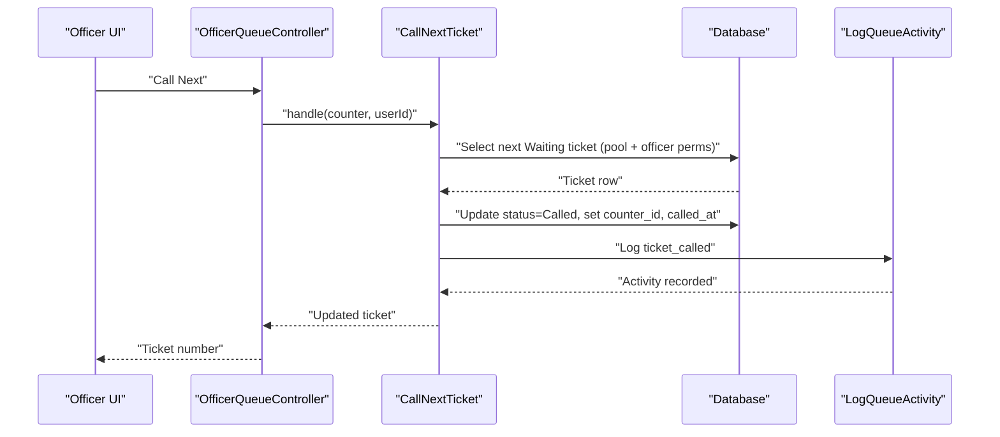
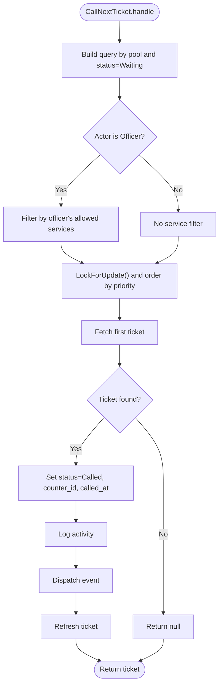
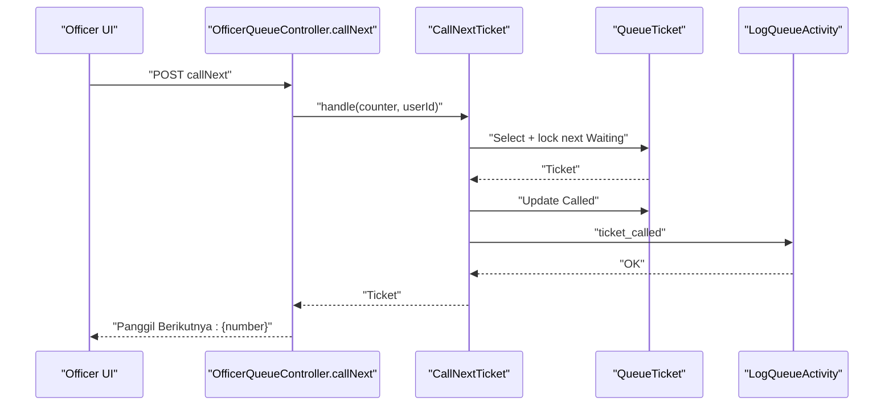
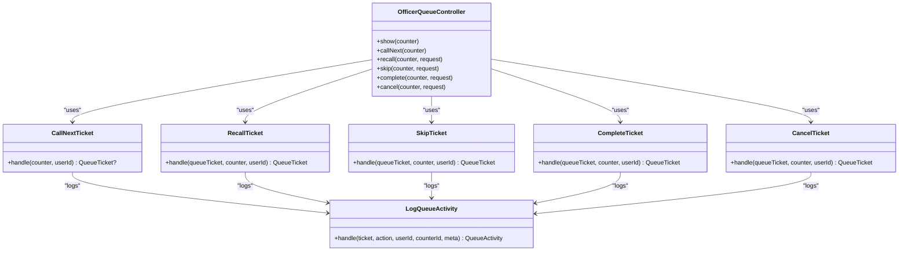
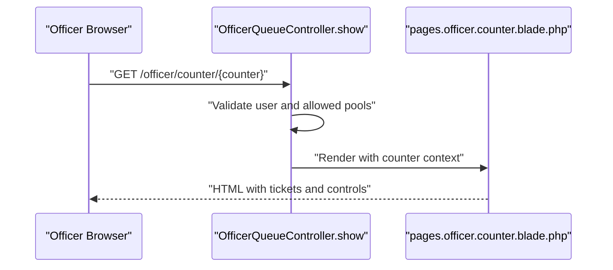
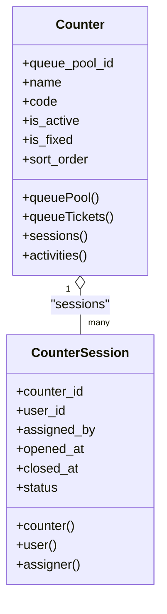
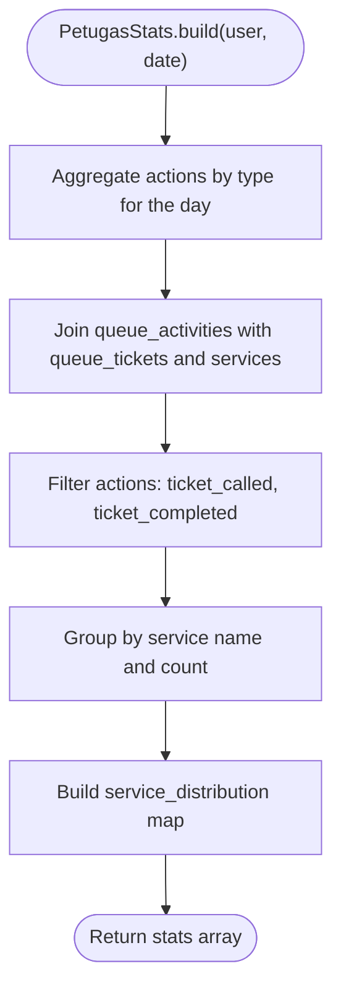
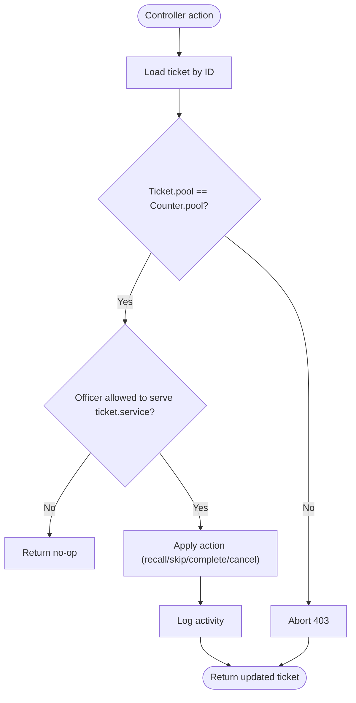
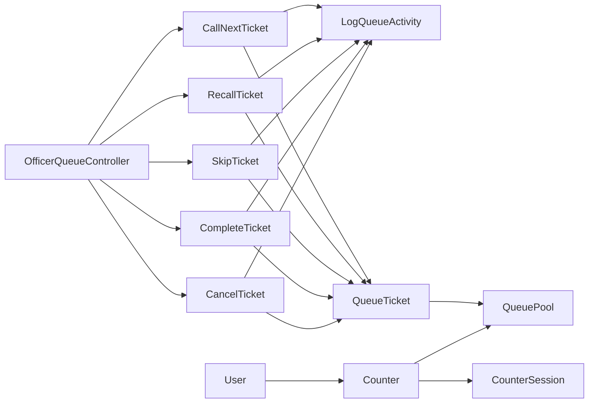

# Officer Operations

<cite>
**Referenced Files in This Document**
- [OfficerQueueController.php](file://app/Http/Controllers/OfficerQueueController.php)
- [CallNextTicket.php](file://app/Actions/Queue/CallNextTicket.php)
- [RecallTicket.php](file://app/Actions/Queue/RecallTicket.php)
- [SkipTicket.php](file://app/Actions/Queue/SkipTicket.php)
- [CompleteTicket.php](file://app/Actions/Queue/CompleteTicket.php)
- [CancelTicket.php](file://app/Actions/Queue/CancelTicket.php)
- [LogQueueActivity.php](file://app/Actions/Queue/LogQueueActivity.php)
- [PetugasStats.php](file://app/Support/Dashboard/PetugasStats.php)
- [Counter.php](file://app/Models/Counter.php)
- [CounterSession.php](file://app/Models/CounterSession.php)
- [QueueTicket.php](file://app/Models/QueueTicket.php)
- [QueuePool.php](file://app/Models/QueuePool.php)
- [QueueStatus.php](file://app/Enums/QueueStatus.php)
- [User.php](file://app/Models/User.php)
- [2026-03-06-ptsp-queue-implementation-plan.md](file://docs/plans/2026-03-06-ptsp-queue-implementation-plan.md)
- [CounterQueueWorkflowTest.php](file://tests/Feature/Officer/CounterQueueWorkflowTest.php)
- [counter.blade.php](file://resources/views/pages/officer/counter.blade.php)
- [⚡monitor-dashboard.blade.php](file://resources/views/components/dashboard/⚡monitor-dashboard.blade.php)
- [index.blade.php](file://resources/views/pages/laporan/antrian/index.blade.php)
</cite>

## Table of Contents
1. [Introduction](#introduction)
2. [Project Structure](#project-structure)
3. [Core Components](#core-components)
4. [Architecture Overview](#architecture-overview)
5. [Detailed Component Analysis](#detailed-component-analysis)
6. [Dependency Analysis](#dependency-analysis)
7. [Performance Considerations](#performance-considerations)
8. [Troubleshooting Guide](#troubleshooting-guide)
9. [Conclusion](#conclusion)
10. [Appendices](#appendices)

## Introduction
This document explains the Officer Operations functionality for managing counter-based queues where officers serve citizens for specific service types. It covers:
- Counter-based queue management and pool-scoped visibility
- Ticket calling mechanisms and special operations (recall, skip, cancel, complete)
- Session management and officer productivity metrics
- Officer interface integration and administrative oversight
- Operational procedures and training guidelines

## Project Structure
Officer Operations spans controllers, actions, models, enums, and views:
- Controllers orchestrate officer actions and enforce pool-based access
- Actions encapsulate atomic queue operations and audit logging
- Models represent counters, tickets, pools, sessions, and users
- Enums define queue states and UI labels/colors
- Views render the officer counter interface and dashboards

**Diagram sources**
- [OfficerQueueController.php:1-96](file://app/Http/Controllers/OfficerQueueController.php#L1-L96)
- [CallNextTicket.php:1-80](file://app/Actions/Queue/CallNextTicket.php#L1-L80)
- [RecallTicket.php:1-48](file://app/Actions/Queue/RecallTicket.php#L1-L48)
- [SkipTicket.php:1-47](file://app/Actions/Queue/SkipTicket.php#L1-L47)
- [CompleteTicket.php:1-49](file://app/Actions/Queue/CompleteTicket.php#L1-L49)
- [CancelTicket.php:1-48](file://app/Actions/Queue/CancelTicket.php#L1-L48)
- [LogQueueActivity.php:1-29](file://app/Actions/Queue/LogQueueActivity.php#L1-L29)
- [QueueTicket.php:1-121](file://app/Models/QueueTicket.php#L1-L121)
- [Counter.php:1-53](file://app/Models/Counter.php#L1-L53)
- [QueuePool.php:1-43](file://app/Models/QueuePool.php#L1-L43)
- [CounterSession.php:1-45](file://app/Models/CounterSession.php#L1-L45)
- [User.php:1-99](file://app/Models/User.php#L1-L99)
- [counter.blade.php](file://resources/views/pages/officer/counter.blade.php)
- [⚡monitor-dashboard.blade.php:74-101](file://resources/views/components/dashboard/⚡monitor-dashboard.blade.php#L74-L101)

**Section sources**
- [OfficerQueueController.php:1-96](file://app/Http/Controllers/OfficerQueueController.php#L1-L96)
- [CallNextTicket.php:1-80](file://app/Actions/Queue/CallNextTicket.php#L1-L80)
- [QueueTicket.php:1-121](file://app/Models/QueueTicket.php#L1-L121)
- [Counter.php:1-53](file://app/Models/Counter.php#L1-L53)
- [QueuePool.php:1-43](file://app/Models/QueuePool.php#L1-L43)
- [CounterSession.php:1-45](file://app/Models/CounterSession.php#L1-L45)
- [User.php:1-99](file://app/Models/User.php#L1-L99)
- [counter.blade.php](file://resources/views/pages/officer/counter.blade.php)

## Core Components
- OfficerQueueController: Exposes officer-facing endpoints to call, recall, skip, complete, and cancel tickets scoped to a counter’s pool. Enforces officer eligibility and pool alignment.
- CallNextTicket: Claims the next eligible waiting ticket for a counter, applying officer-specific service permissions and transactional safety.
- RecallTicket, SkipTicket, CompleteTicket, CancelTicket: Implement state transitions and audit logging for each operation.
- LogQueueActivity: Centralized activity logging for all queue actions.
- Counter and CounterSession: Represent physical/digital stations and officer sessions.
- QueueTicket and QueuePool: Track ticket lifecycle and pool scoping.
- QueueStatus: Enumerates states and UI semantics.
- PetugasStats: Computes officer productivity metrics for dashboards.

**Section sources**
- [OfficerQueueController.php:1-96](file://app/Http/Controllers/OfficerQueueController.php#L1-L96)
- [CallNextTicket.php:1-80](file://app/Actions/Queue/CallNextTicket.php#L1-L80)
- [RecallTicket.php:1-48](file://app/Actions/Queue/RecallTicket.php#L1-L48)
- [SkipTicket.php:1-47](file://app/Actions/Queue/SkipTicket.php#L1-L47)
- [CompleteTicket.php:1-49](file://app/Actions/Queue/CompleteTicket.php#L1-L49)
- [CancelTicket.php:1-48](file://app/Actions/Queue/CancelTicket.php#L1-L48)
- [LogQueueActivity.php:1-29](file://app/Actions/Queue/LogQueueActivity.php#L1-L29)
- [Counter.php:1-53](file://app/Models/Counter.php#L1-L53)
- [CounterSession.php:1-45](file://app/Models/CounterSession.php#L1-L45)
- [QueueTicket.php:1-121](file://app/Models/QueueTicket.php#L1-L121)
- [QueuePool.php:1-43](file://app/Models/QueuePool.php#L1-L43)
- [QueueStatus.php:1-38](file://app/Enums/QueueStatus.php#L1-L38)
- [PetugasStats.php:1-60](file://app/Support/Dashboard/PetugasStats.php#L1-L60)

## Architecture Overview
Officer Operations follows a layered architecture:
- Controller layer validates roles, pools, and requests
- Action layer encapsulates business logic and persistence
- Model layer defines domain entities and relationships
- UI layer renders the officer counter page and dashboards

**Diagram sources**
- [OfficerQueueController.php:40-49](file://app/Http/Controllers/OfficerQueueController.php#L40-L49)
- [CallNextTicket.php:19-77](file://app/Actions/Queue/CallNextTicket.php#L19-L77)
- [LogQueueActivity.php:13-27](file://app/Actions/Queue/LogQueueActivity.php#L13-L27)

## Detailed Component Analysis

### Counter-Based Queue Management
- Pool scoping: Officers can only act on tickets within the counter’s queue pool.
- Officer permissions: Officers are restricted to services they are authorized to serve.
- Eligibility ordering: Tickets are selected by service date, sequence number, and ID, ensuring fairness.

**Diagram sources**
- [CallNextTicket.php:19-77](file://app/Actions/Queue/CallNextTicket.php#L19-L77)
- [QueueStatus.php:5-12](file://app/Enums/QueueStatus.php#L5-L12)

**Section sources**
- [OfficerQueueController.php:18-38](file://app/Http/Controllers/OfficerQueueController.php#L18-L38)
- [CallNextTicket.php:19-77](file://app/Actions/Queue/CallNextTicket.php#L19-L77)
- [QueueTicket.php:82-94](file://app/Models/QueueTicket.php#L82-L94)

### Ticket Calling Mechanisms
- CallNextTicket: Claims the next eligible ticket, records called timestamp, and logs the action.
- Controller integration: Returns human-readable messages and handles “no queue” scenarios.

**Diagram sources**
- [OfficerQueueController.php:40-49](file://app/Http/Controllers/OfficerQueueController.php#L40-L49)
- [CallNextTicket.php:19-77](file://app/Actions/Queue/CallNextTicket.php#L19-L77)
- [LogQueueActivity.php:13-27](file://app/Actions/Queue/LogQueueActivity.php#L13-L27)

**Section sources**
- [OfficerQueueController.php:40-49](file://app/Http/Controllers/OfficerQueueController.php#L40-L49)
- [CallNextTicket.php:19-77](file://app/Actions/Queue/CallNextTicket.php#L19-L77)

### Special Operations: Recall, Skip, Cancel, Complete
- RecallTicket: Re-calls a currently “Called” ticket; updates timestamps and logs.
- SkipTicket: Skips a “Called” or “Waiting” ticket; marks as Skipped.
- CancelTicket: Cancels tickets in specific statuses (Booked, Waiting, Called).
- CompleteTicket: Marks a “Called” ticket as Completed; sets started/completed timestamps.

**Diagram sources**
- [OfficerQueueController.php:1-96](file://app/Http/Controllers/OfficerQueueController.php#L1-L96)
- [CallNextTicket.php:1-80](file://app/Actions/Queue/CallNextTicket.php#L1-L80)
- [RecallTicket.php:1-48](file://app/Actions/Queue/RecallTicket.php#L1-L48)
- [SkipTicket.php:1-47](file://app/Actions/Queue/SkipTicket.php#L1-L47)
- [CompleteTicket.php:1-49](file://app/Actions/Queue/CompleteTicket.php#L1-L49)
- [CancelTicket.php:1-48](file://app/Actions/Queue/CancelTicket.php#L1-L48)
- [LogQueueActivity.php:1-29](file://app/Actions/Queue/LogQueueActivity.php#L1-L29)

**Section sources**
- [OfficerQueueController.php:51-89](file://app/Http/Controllers/OfficerQueueController.php#L51-L89)
- [RecallTicket.php:17-47](file://app/Actions/Queue/RecallTicket.php#L17-L47)
- [SkipTicket.php:17-46](file://app/Actions/Queue/SkipTicket.php#L17-L46)
- [CompleteTicket.php:17-47](file://app/Actions/Queue/CompleteTicket.php#L17-L47)
- [CancelTicket.php:17-46](file://app/Actions/Queue/CancelTicket.php#L17-L46)

### Officer Interface and Integration
- Officer counter page: Displays current serving ticket and next waiting tickets filtered by pool.
- Pool enforcement: Controller ensures the officer’s allowed pools align with the counter’s pool.
- Event dispatch: On call, a ticket-called event is emitted for real-time integrations.

**Diagram sources**
- [OfficerQueueController.php:18-38](file://app/Http/Controllers/OfficerQueueController.php#L18-L38)
- [counter.blade.php](file://resources/views/pages/officer/counter.blade.php)

**Section sources**
- [OfficerQueueController.php:18-38](file://app/Http/Controllers/OfficerQueueController.php#L18-L38)
- [counter.blade.php](file://resources/views/pages/officer/counter.blade.php)

### Counter Assignment and Session Management
- CounterSession tracks who is assigned to a counter, when they opened/closed their session, and the session status.
- Counter belongs to a QueuePool and maintains relationships to tickets and activities.

**Diagram sources**
- [Counter.php:1-53](file://app/Models/Counter.php#L1-L53)
- [CounterSession.php:1-45](file://app/Models/CounterSession.php#L1-L45)

**Section sources**
- [Counter.php:33-51](file://app/Models/Counter.php#L33-L51)
- [CounterSession.php:14-44](file://app/Models/CounterSession.php#L14-L44)

### Performance Tracking and Productivity Metrics
- PetugasStats aggregates daily officer metrics:
  - Tickets served today
  - Counts of skipped/recalled/completed actions
  - Service distribution across services
- Dashboards visualize “Served by Officer” and “Officer x Service Distribution.”

**Diagram sources**
- [PetugasStats.php:20-58](file://app/Support/Dashboard/PetugasStats.php#L20-L58)
- [QueueTicket.php:74-76](file://app/Models/QueueTicket.php#L74-L76)

**Section sources**
- [PetugasStats.php:20-58](file://app/Support/Dashboard/PetugasStats.php#L20-L58)
- [⚡monitor-dashboard.blade.php:74-101](file://resources/views/components/dashboard/⚡monitor-dashboard.blade.php#L74-L101)
- [index.blade.php:169-188](file://resources/views/pages/laporan/antrian/index.blade.php#L169-L188)

### Workflow for Special Cases and Queue Optimization
- Pool alignment: Controller enforces that the ticket’s pool matches the counter’s pool before acting.
- Officer eligibility: Officers can only serve tickets for services they are authorized to handle.
- Transactional safety: Calls use row-level locking to prevent race conditions.
- Queue position calculation: Tickets expose a method to compute remaining wait ahead of them.

**Diagram sources**
- [OfficerQueueController.php:91-94](file://app/Http/Controllers/OfficerQueueController.php#L91-L94)
- [CallNextTicket.php:26-39](file://app/Actions/Queue/CallNextTicket.php#L26-L39)
- [QueueTicket.php:82-94](file://app/Models/QueueTicket.php#L82-L94)

**Section sources**
- [OfficerQueueController.php:91-94](file://app/Http/Controllers/OfficerQueueController.php#L91-L94)
- [CallNextTicket.php:26-39](file://app/Actions/Queue/CallNextTicket.php#L26-L39)
- [QueueTicket.php:82-94](file://app/Models/QueueTicket.php#L82-L94)

### Administrative Oversight
- Activity logs: Every action writes a queue activity record with metadata.
- Reporting: Dashboards and reports show officer productivity and service distributions.
- Plan-driven development: Implementation plan outlines officer pages, actions, and tests.

**Section sources**
- [LogQueueActivity.php:13-27](file://app/Actions/Queue/LogQueueActivity.php#L13-L27)
- [index.blade.php:169-188](file://resources/views/pages/laporan/antrian/index.blade.php#L169-L188)
- [2026-03-06-ptsp-queue-implementation-plan.md:375-422](file://docs/plans/2026-03-06-ptsp-queue-implementation-plan.md#L375-L422)
- [CounterQueueWorkflowTest.php:83-100](file://tests/Feature/Officer/CounterQueueWorkflowTest.php#L83-L100)

## Dependency Analysis
- Controller depends on actions for each operation and on request validation.
- Actions depend on models and shared logging.
- Models define relationships among counters, tickets, pools, sessions, and users.
- UI depends on controller-provided context and displays pool-scoped data.

**Diagram sources**
- [OfficerQueueController.php:1-96](file://app/Http/Controllers/OfficerQueueController.php#L1-L96)
- [CallNextTicket.php:1-80](file://app/Actions/Queue/CallNextTicket.php#L1-L80)
- [RecallTicket.php:1-48](file://app/Actions/Queue/RecallTicket.php#L1-L48)
- [SkipTicket.php:1-47](file://app/Actions/Queue/SkipTicket.php#L1-L47)
- [CompleteTicket.php:1-49](file://app/Actions/Queue/CompleteTicket.php#L1-L49)
- [CancelTicket.php:1-48](file://app/Actions/Queue/CancelTicket.php#L1-L48)
- [LogQueueActivity.php:1-29](file://app/Actions/Queue/LogQueueActivity.php#L1-L29)
- [QueueTicket.php:1-121](file://app/Models/QueueTicket.php#L1-L121)
- [Counter.php:1-53](file://app/Models/Counter.php#L1-L53)
- [CounterSession.php:1-45](file://app/Models/CounterSession.php#L1-L45)
- [User.php:1-99](file://app/Models/User.php#L1-L99)

**Section sources**
- [OfficerQueueController.php:1-96](file://app/Http/Controllers/OfficerQueueController.php#L1-L96)
- [QueueTicket.php:54-77](file://app/Models/QueueTicket.php#L54-L77)
- [Counter.php:33-51](file://app/Models/Counter.php#L33-L51)
- [CounterSession.php:31-44](file://app/Models/CounterSession.php#L31-L44)
- [User.php:93-97](file://app/Models/User.php#L93-L97)

## Performance Considerations
- Row-level locking: CallNextTicket uses explicit locking to avoid race conditions during selection.
- Index-friendly queries: Pool and status filters, plus multi-column ordering, support efficient retrieval.
- Minimal roundtrips: Actions update and log in a single transaction.
- Dashboard aggregation: PetugasStats uses grouped counts and joins to summarize efficiently.

[No sources needed since this section provides general guidance]

## Troubleshooting Guide
Common issues and resolutions:
- No queue returned: The controller returns a message indicating no queue; verify pool and service permissions.
- Unauthorized action: Pool mismatch or missing officer permissions result in 403; confirm counter pool and officer service authorizations.
- Invalid state transitions: Actions validate current status and throw exceptions for invalid transitions; ensure tickets are in expected states.
- Missing audit trail: Verify LogQueueActivity is invoked after each action.

**Section sources**
- [OfficerQueueController.php:44-46](file://app/Http/Controllers/OfficerQueueController.php#L44-L46)
- [OfficerQueueController.php:91-94](file://app/Http/Controllers/OfficerQueueController.php#L91-L94)
- [RecallTicket.php:19-21](file://app/Actions/Queue/RecallTicket.php#L19-L21)
- [SkipTicket.php:19-21](file://app/Actions/Queue/SkipTicket.php#L19-L21)
- [CompleteTicket.php:19-21](file://app/Actions/Queue/CompleteTicket.php#L19-L21)
- [CancelTicket.php:19-21](file://app/Actions/Queue/CancelTicket.php#L19-L21)
- [LogQueueActivity.php:13-27](file://app/Actions/Queue/LogQueueActivity.php#L13-L27)

## Conclusion
Officer Operations provides a robust, permission-aware, and auditable system for counter-based queue management. It enforces pool and service scoping, supports essential operations with clear state transitions, and integrates with dashboards for productivity insights. The modular design of actions and centralized logging enables maintainability and extensibility.

[No sources needed since this section summarizes without analyzing specific files]

## Appendices

### Operational Procedures and Training Guidelines
- Role-based access: Officers must be assigned to services they can serve; administrators configure officer-service relationships.
- Counter assignment: Use CounterSession to open/close sessions and track who serves which counter.
- Daily routines: Officers call next tickets, handle recalls/skips/cancellations/completions as needed, and rely on dashboards for performance feedback.
- Testing: Follow the plan-defined workflow tests to validate officer operations end-to-end.

**Section sources**
- [2026-03-06-ptsp-queue-implementation-plan.md:375-422](file://docs/plans/2026-03-06-ptsp-queue-implementation-plan.md#L375-L422)
- [CounterQueueWorkflowTest.php:83-100](file://tests/Feature/Officer/CounterQueueWorkflowTest.php#L83-L100)
- [User.php:93-97](file://app/Models/User.php#L93-L97)
- [CounterSession.php:14-29](file://app/Models/CounterSession.php#L14-L29)