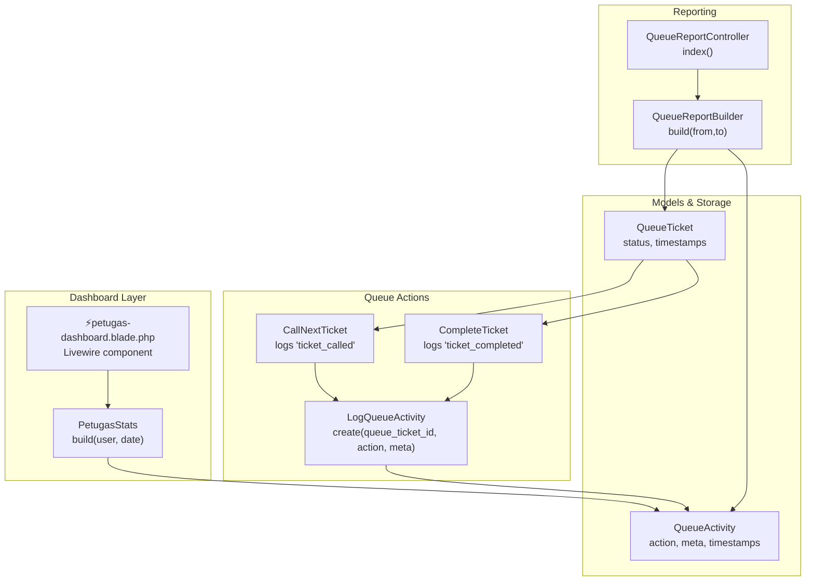
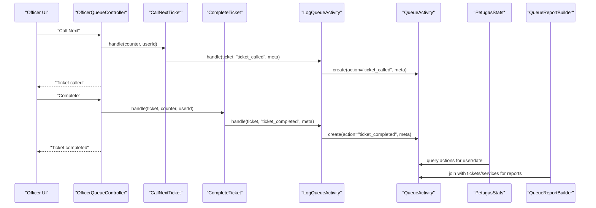
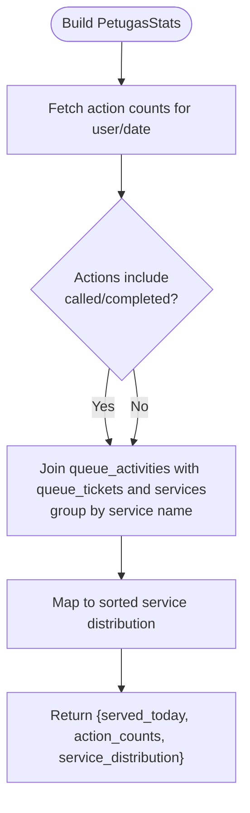
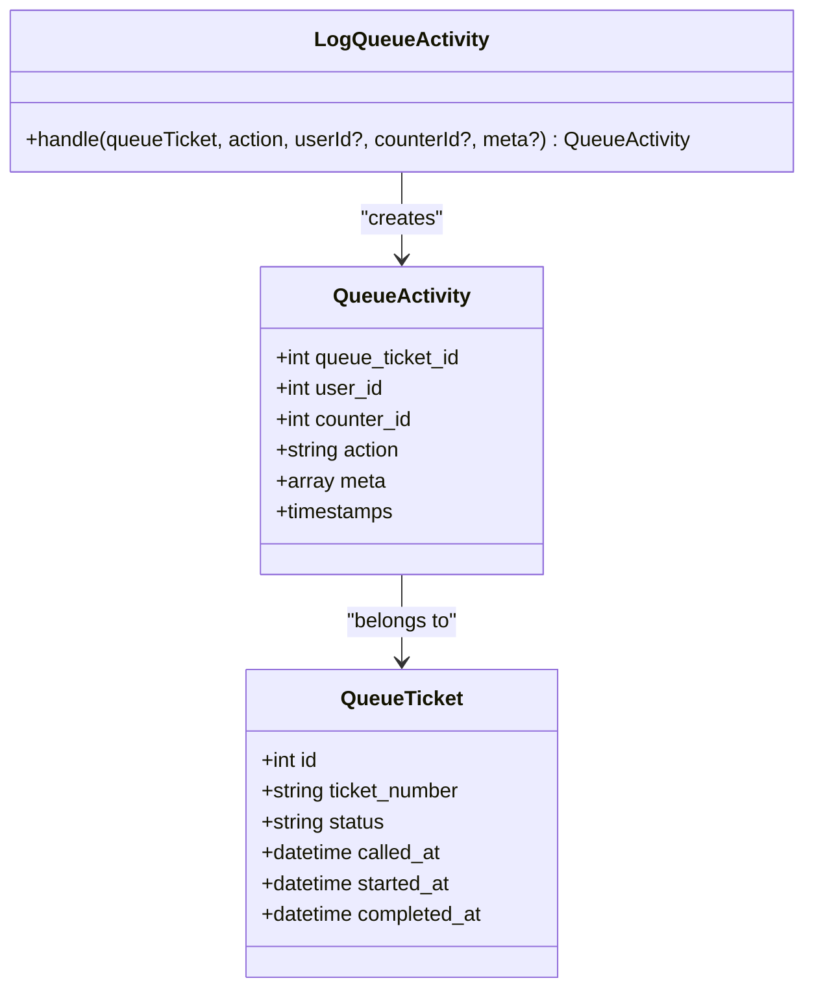
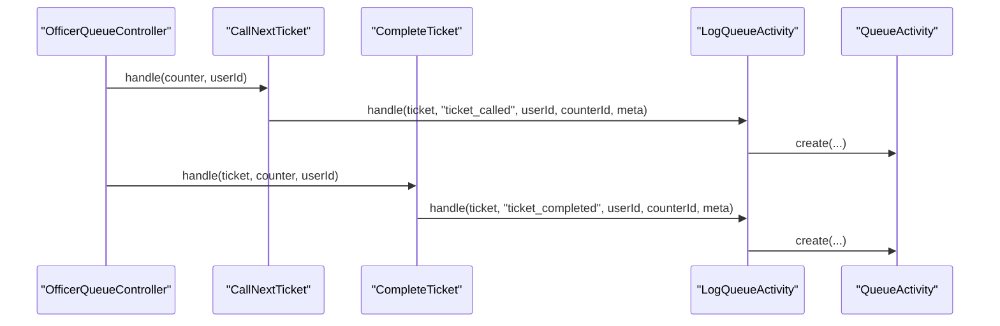
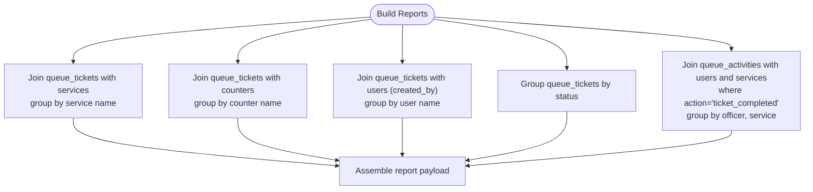
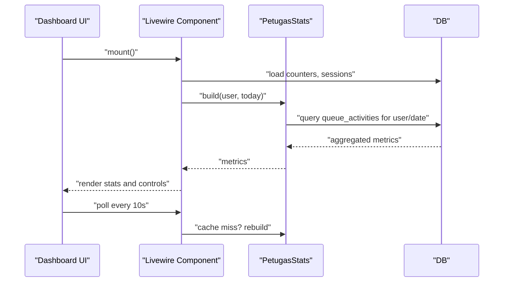
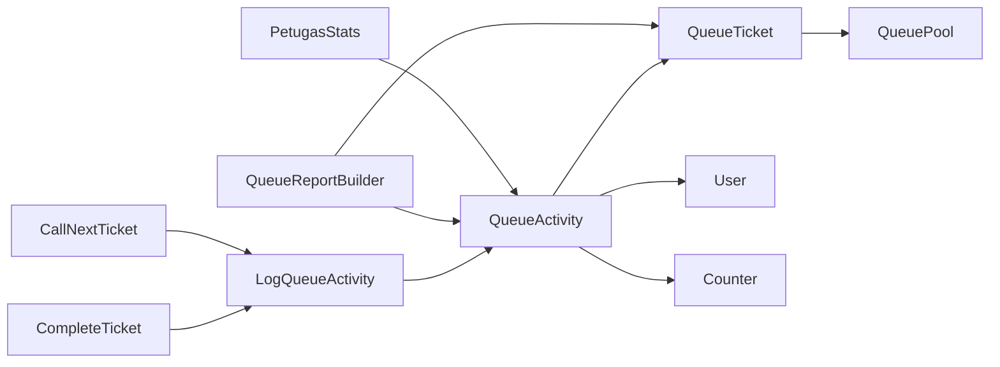

# Performance Tracking

<cite>
**Referenced Files in This Document**
- [PetugasStats.php](file://app/Support/Dashboard/PetugasStats.php)
- [QueueActivity.php](file://app/Models/QueueActivity.php)
- [LogQueueActivity.php](file://app/Actions/Queue/LogQueueActivity.php)
- [QueueReportBuilder.php](file://app/Support/Reports/QueueReportBuilder.php)
- [QueueReportController.php](file://app/Http/Controllers/Report/QueueReportController.php)
- [QueueTicket.php](file://app/Models/QueueTicket.php)
- [CompleteTicket.php](file://app/Actions/Queue/CompleteTicket.php)
- [CallNextTicket.php](file://app/Actions/Queue/CallNextTicket.php)
- [QueueStatus.php](file://app/Enums/QueueStatus.php)
- [OfficerQueueController.php](file://app/Http/Controllers/OfficerQueueController.php)
- [⚡petugas-dashboard.blade.php](file://resources/views/components/dashboard/⚡petugas-dashboard.blade.php)
- [2026_03_06_015239_create_queue_activities_table.php](file://database/migrations/2026_03_06_015239_create_queue_activities_table.php)
- [2026_03_06_015238_create_queue_tickets_table.php](file://database/migrations/2026_03_06_015238_create_queue_tickets_table.php)
</cite>

## Table of Contents
1. [Introduction](#introduction)
2. [Project Structure](#project-structure)
3. [Core Components](#core-components)
4. [Architecture Overview](#architecture-overview)
5. [Detailed Component Analysis](#detailed-component-analysis)
6. [Dependency Analysis](#dependency-analysis)
7. [Performance Considerations](#performance-considerations)
8. [Troubleshooting Guide](#troubleshooting-guide)
9. [Conclusion](#conclusion)
10. [Appendices](#appendices)

## Introduction
This document explains the Performance Tracking capabilities for officers, focusing on the PetugasStats dashboard components that measure officer productivity and the queue activity logging system that records all officer actions and timestamps. It also documents report generation features for performance analysis, trend monitoring, and administrative oversight. Finally, it provides guidelines for interpreting performance metrics, identifying improvement opportunities, and maintaining quality service standards.

## Project Structure
The performance tracking system spans several layers:
- Dashboard statistics builder (PetugasStats) aggregates officer-specific metrics from queue activity logs.
- Queue activity logging (LogQueueActivity) captures every officer action with metadata.
- Ticket lifecycle actions (CallNextTicket, CompleteTicket) trigger activity logs and status updates.
- Reporting engine (QueueReportBuilder) produces administrative reports across services, counters, officers, and statuses.
- UI dashboard (Livewire component) surfaces real-time metrics and controls for officers.

**Diagram sources**
- [PetugasStats.php:20-58](file://app/Support/Dashboard/PetugasStats.php#L20-L58)
- [⚡petugas-dashboard.blade.php:260-420](file://resources/views/components/dashboard/⚡petugas-dashboard.blade.php#L260-L420)
- [CallNextTicket.php:13-79](file://app/Actions/Queue/CallNextTicket.php#L13-L79)
- [CompleteTicket.php:11-49](file://app/Actions/Queue/CompleteTicket.php#L11-L49)
- [LogQueueActivity.php:8-28](file://app/Actions/Queue/LogQueueActivity.php#L8-L28)
- [QueueActivity.php:9-43](file://app/Models/QueueActivity.php#L9-L43)
- [QueueTicket.php:12-121](file://app/Models/QueueTicket.php#L12-L121)
- [QueueReportBuilder.php:9-97](file://app/Support/Reports/QueueReportBuilder.php#L9-L97)
- [QueueReportController.php:10-26](file://app/Http/Controllers/Report/QueueReportController.php#L10-L26)

**Section sources**
- [PetugasStats.php:20-58](file://app/Support/Dashboard/PetugasStats.php#L20-L58)
- [QueueReportBuilder.php:20-64](file://app/Support/Reports/QueueReportBuilder.php#L20-L64)
- [QueueReportController.php:12-25](file://app/Http/Controllers/Report/QueueReportController.php#L12-L25)
- [CallNextTicket.php:19-77](file://app/Actions/Queue/CallNextTicket.php#L19-L77)
- [CompleteTicket.php:17-47](file://app/Actions/Queue/CompleteTicket.php#L17-L47)
- [LogQueueActivity.php:13-27](file://app/Actions/Queue/LogQueueActivity.php#L13-L27)
- [QueueActivity.php:14-27](file://app/Models/QueueActivity.php#L14-L27)
- [QueueTicket.php:17-51](file://app/Models/QueueTicket.php#L17-L51)

## Core Components
- PetugasStats: Builds officer-centric performance metrics for a given day, including:
  - served_today: number of completed tickets for the officer on the target date
  - action_counts: counts of skipped, recalled, and completed actions
  - service_distribution: distribution of handled tickets by service name
- QueueActivity: Stores each officer action with associated metadata (e.g., service_id, queue_pool_id, visit_purpose).
- LogQueueActivity: Creates queue activity records during ticket lifecycle actions.
- QueueReportBuilder: Generates administrative reports across services, counters, officers, statuses, and officer-service distributions.
- QueueReportController: Handles report requests and renders the report view.
- QueueTicket: Tracks ticket lifecycle with timestamps and status transitions.
- CallNextTicket and CompleteTicket: Trigger activity logging and status updates.

**Section sources**
- [PetugasStats.php:20-58](file://app/Support/Dashboard/PetugasStats.php#L20-L58)
- [QueueActivity.php:14-27](file://app/Models/QueueActivity.php#L14-L27)
- [LogQueueActivity.php:13-27](file://app/Actions/Queue/LogQueueActivity.php#L13-L27)
- [QueueReportBuilder.php:20-95](file://app/Support/Reports/QueueReportBuilder.php#L20-L95)
- [QueueReportController.php:12-25](file://app/Http/Controllers/Report/QueueReportController.php#L12-L25)
- [QueueTicket.php:17-51](file://app/Models/QueueTicket.php#L17-L51)
- [CallNextTicket.php:19-77](file://app/Actions/Queue/CallNextTicket.php#L19-L77)
- [CompleteTicket.php:17-47](file://app/Actions/Queue/CompleteTicket.php#L17-L47)

## Architecture Overview
The performance tracking architecture centers on queue activity logging and dashboard/report builders. Officer actions (calling next ticket, completing a ticket) produce activity records that feed both the PetugasStats dashboard and the QueueReportBuilder.

**Diagram sources**
- [OfficerQueueController.php:40-79](file://app/Http/Controllers/OfficerQueueController.php#L40-L79)
- [CallNextTicket.php:19-77](file://app/Actions/Queue/CallNextTicket.php#L19-L77)
- [CompleteTicket.php:17-47](file://app/Actions/Queue/CompleteTicket.php#L17-L47)
- [LogQueueActivity.php:13-27](file://app/Actions/Queue/LogQueueActivity.php#L13-L27)
- [QueueActivity.php:14-27](file://app/Models/QueueActivity.php#L14-L27)
- [PetugasStats.php:25-47](file://app/Support/Dashboard/PetugasStats.php#L25-L47)
- [QueueReportBuilder.php:72-83](file://app/Support/Reports/QueueReportBuilder.php#L72-L83)

## Detailed Component Analysis

### PetugasStats Dashboard Metrics
PetugasStats computes three core metrics for a single officer on a given date:
- served_today: derived from the count of "ticket_completed" actions
- action_counts: counts of "ticket_skipped", "ticket_recalled", and "ticket_completed"
- service_distribution: grouped counts of handled tickets by service name

**Diagram sources**
- [PetugasStats.php:25-47](file://app/Support/Dashboard/PetugasStats.php#L25-L47)

**Section sources**
- [PetugasStats.php:20-58](file://app/Support/Dashboard/PetugasStats.php#L20-L58)

### Queue Activity Logging System
QueueActivity captures every officer action with rich metadata:
- Fields: queue_ticket_id, user_id, counter_id, action, meta
- Creation: triggered by LogQueueActivity during ticket lifecycle actions
- Timestamps: created_at reflects the action timestamp

**Diagram sources**
- [QueueActivity.php:14-27](file://app/Models/QueueActivity.php#L14-L27)
- [LogQueueActivity.php:13-27](file://app/Actions/Queue/LogQueueActivity.php#L13-L27)
- [QueueTicket.php:17-51](file://app/Models/QueueTicket.php#L17-L51)

**Section sources**
- [QueueActivity.php:14-27](file://app/Models/QueueActivity.php#L14-L27)
- [LogQueueActivity.php:13-27](file://app/Actions/Queue/LogQueueActivity.php#L13-L27)
- [2026_03_06_015239_create_queue_activities_table.php:1-50](file://database/migrations/2026_03_06_015239_create_queue_activities_table.php#L1-L50)

### Ticket Lifecycle Actions and Activity Records
- CallNextTicket: sets status to "called", records "ticket_called" with metadata including from_status, to_status, service_id, queue_pool_id, visit_purpose.
- CompleteTicket: sets status to "completed", records "ticket_completed" with similar metadata.

**Diagram sources**
- [OfficerQueueController.php:40-79](file://app/Http/Controllers/OfficerQueueController.php#L40-L79)
- [CallNextTicket.php:52-72](file://app/Actions/Queue/CallNextTicket.php#L52-L72)
- [CompleteTicket.php:23-44](file://app/Actions/Queue/CompleteTicket.php#L23-L44)
- [LogQueueActivity.php:20-26](file://app/Actions/Queue/LogQueueActivity.php#L20-L26)

**Section sources**
- [CallNextTicket.php:19-77](file://app/Actions/Queue/CallNextTicket.php#L19-L77)
- [CompleteTicket.php:17-47](file://app/Actions/Queue/CompleteTicket.php#L17-L47)
- [QueueStatus.php:7-12](file://app/Enums/QueueStatus.php#L7-L12)

### Report Generation Features
QueueReportBuilder aggregates administrative insights:
- by_service: count of tickets per service
- by_counter: count of tickets per counter
- by_officer: count of tickets created by officer
- by_status: count of tickets per status
- officer_service_distribution: matrix of officer-to-service completion counts

**Diagram sources**
- [QueueReportBuilder.php:26-63](file://app/Support/Reports/QueueReportBuilder.php#L26-L63)
- [QueueReportBuilder.php:69-95](file://app/Support/Reports/QueueReportBuilder.php#L69-L95)

**Section sources**
- [QueueReportBuilder.php:20-95](file://app/Support/Reports/QueueReportBuilder.php#L20-L95)
- [QueueReportController.php:12-25](file://app/Http/Controllers/Report/QueueReportController.php#L12-L25)

### Officer Dashboard UI and Real-Time Metrics
The Livewire-based dashboard component:
- Resolves counters and sessions for the officer
- Computes waiting count, active ticket, recent skipped tickets
- Caches and refreshes PetugasStats daily metrics
- Provides action buttons (call next, recall, skip, complete, cancel)

**Diagram sources**
- [⚡petugas-dashboard.blade.php:72-92](file://resources/views/components/dashboard/⚡petugas-dashboard.blade.php#L72-L92)
- [PetugasStats.php:20-58](file://app/Support/Dashboard/PetugasStats.php#L20-L58)
- [⚡petugas-dashboard.blade.php:409-419](file://resources/views/components/dashboard/⚡petugas-dashboard.blade.php#L409-L419)

**Section sources**
- [⚡petugas-dashboard.blade.php:260-420](file://resources/views/components/dashboard/⚡petugas-dashboard.blade.php#L260-L420)
- [OfficerQueueController.php:18-38](file://app/Http/Controllers/OfficerQueueController.php#L18-L38)

## Dependency Analysis
Key dependencies and relationships:
- PetugasStats depends on QueueActivity and DB joins to compute metrics.
- QueueReportBuilder depends on QueueTicket and QueueActivity for administrative reporting.
- CallNextTicket and CompleteTicket depend on LogQueueActivity to persist actions.
- QueueActivity belongs to QueueTicket, User, and Counter.
- QueueTicket timestamps and status inform service duration calculations.

**Diagram sources**
- [PetugasStats.php:25-47](file://app/Support/Dashboard/PetugasStats.php#L25-L47)
- [QueueReportBuilder.php:72-83](file://app/Support/Reports/QueueReportBuilder.php#L72-L83)
- [CallNextTicket.php:14-15](file://app/Actions/Queue/CallNextTicket.php#L14-L15)
- [CompleteTicket.php:14](file://app/Actions/Queue/CompleteTicket.php#L14)
- [LogQueueActivity.php:5-6](file://app/Actions/Queue/LogQueueActivity.php#L5-L6)
- [QueueActivity.php:29-42](file://app/Models/QueueActivity.php#L29-L42)
- [QueueTicket.php:54-77](file://app/Models/QueueTicket.php#L54-L77)

**Section sources**
- [PetugasStats.php:25-47](file://app/Support/Dashboard/PetugasStats.php#L25-L47)
- [QueueReportBuilder.php:72-83](file://app/Support/Reports/QueueReportBuilder.php#L72-L83)
- [QueueActivity.php:29-42](file://app/Models/QueueActivity.php#L29-L42)
- [QueueTicket.php:54-77](file://app/Models/QueueTicket.php#L54-L77)

## Performance Considerations
- Indexes: Queue tickets and activities are indexed by service_date/status and queue_pool_id/service_date, supporting efficient daily queries.
- Aggregation: PetugasStats and QueueReportBuilder use grouped counts and joins; ensure appropriate indexes exist for service_id, queue_pool_id, and created_at.
- Caching: The dashboard caches PetugasStats results per day to reduce repeated DB work.
- Throughput calculation: Administrative dashboard computes average wait minutes using database-native time diff expressions for SQLite and MySQL.

**Section sources**
- [2026_03_06_015238_create_queue_tickets_table.php:38-41](file://database/migrations/2026_03_06_015238_create_queue_tickets_table.php#L38-L41)
- [2026_03_06_015239_create_queue_activities_table.php:1-50](file://database/migrations/2026_03_06_015239_create_queue_activities_table.php#L1-L50)
- [QueueReportBuilder.php:79-82](file://app/Support/Reports/QueueReportBuilder.php#L79-L82)

## Troubleshooting Guide
Common issues and resolutions:
- No metrics displayed: Verify the officer has allowed services and is assigned to a counter; check cache date and that today’s date matches.
- Missing activity logs: Confirm that CallNextTicket and CompleteTicket are invoked and that LogQueueActivity persists records.
- Incorrect counts: Ensure filters restrict to the correct date and user; confirm action names ("ticket_called", "ticket_completed") align with PetugasStats queries.
- Report gaps: Validate date range parameters and that queue tickets have proper service_date and status values.

**Section sources**
- [PetugasStats.php:20-58](file://app/Support/Dashboard/PetugasStats.php#L20-L58)
- [CallNextTicket.php:19-77](file://app/Actions/Queue/CallNextTicket.php#L19-L77)
- [CompleteTicket.php:17-47](file://app/Actions/Queue/CompleteTicket.php#L17-L47)
- [QueueReportController.php:12-25](file://app/Http/Controllers/Report/QueueReportController.php#L12-L25)

## Conclusion
The performance tracking system provides actionable insights for officers and administrators. PetugasStats delivers daily productivity metrics, while queue activity logging ensures complete auditability of officer actions. QueueReportBuilder supports broader performance analysis and oversight. Together, these components enable continuous improvement in service delivery and quality.

## Appendices

### Metrics Definitions and Interpretation Guidelines
- handled tickets per day: served_today indicates the officer’s daily throughput; compare across days to identify trends.
- action distribution: action_counts reveals operational patterns (skips/recalls vs. completions); sustained high skips may signal readiness or process issues.
- service distribution: service_distribution highlights specialization and workload balance; uneven distributions may require scheduling adjustments.
- average service duration: computed in administrative dashboards using timestamps; monitor for outliers indicating training or process needs.
- customer satisfaction: future integration planned via survey system; use aggregated ratings alongside performance metrics for holistic oversight.

[No sources needed since this section provides general guidance]