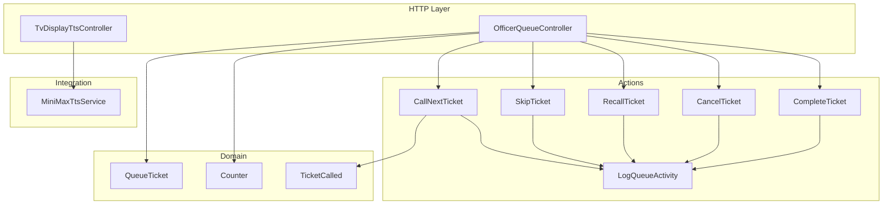
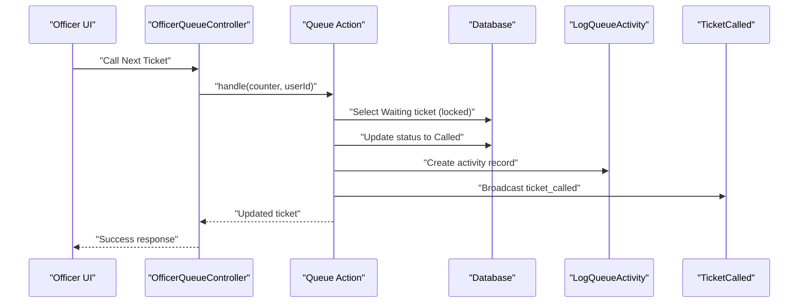
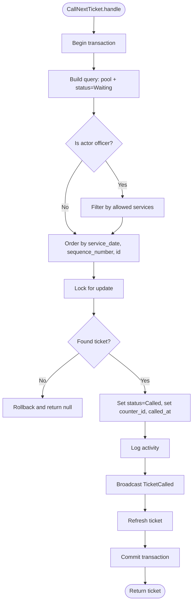
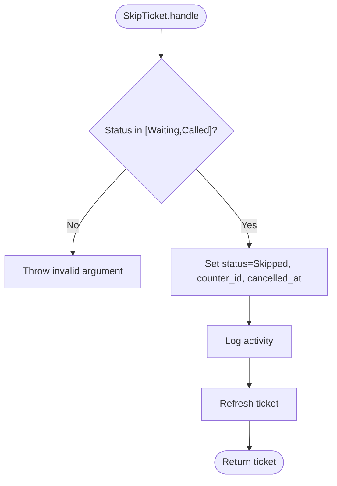
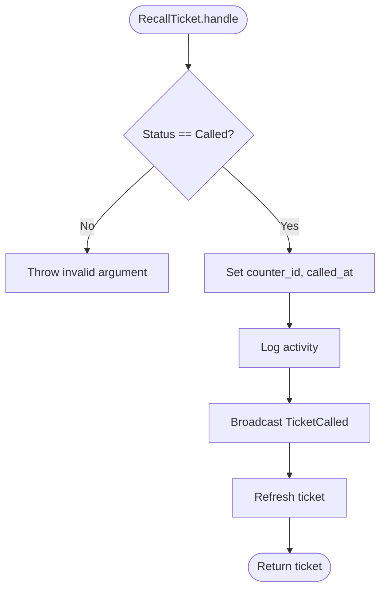
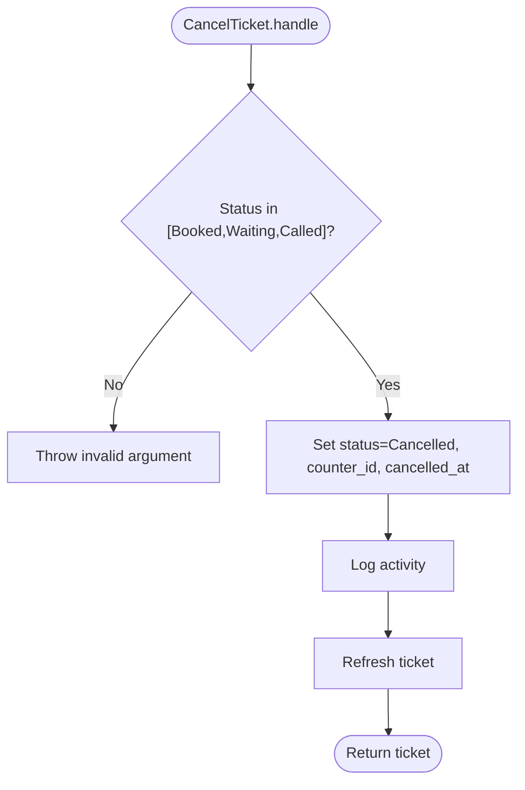
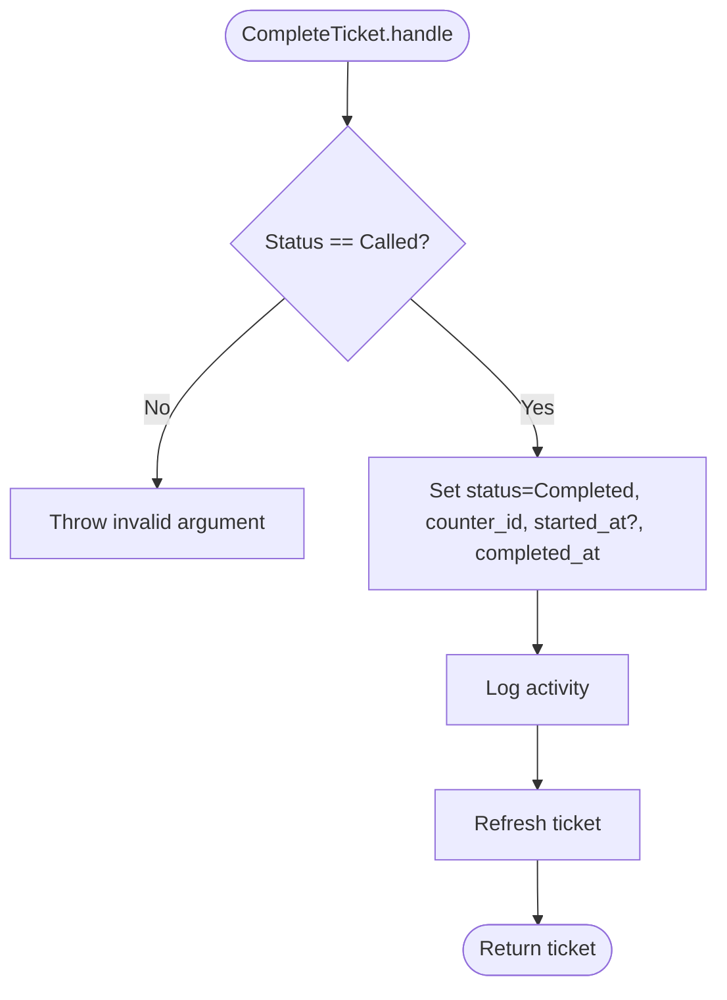
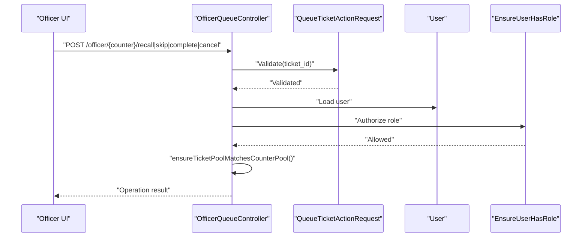
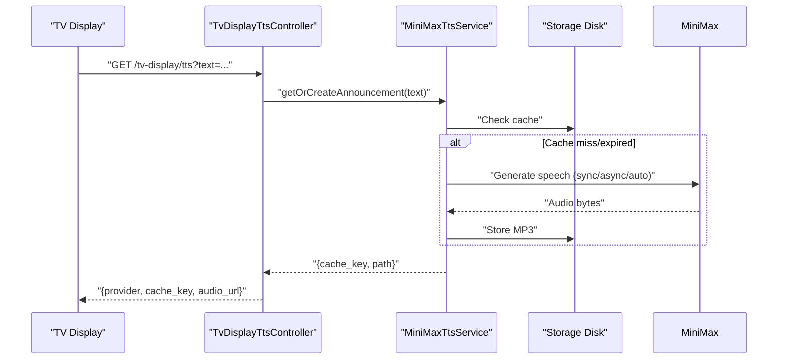
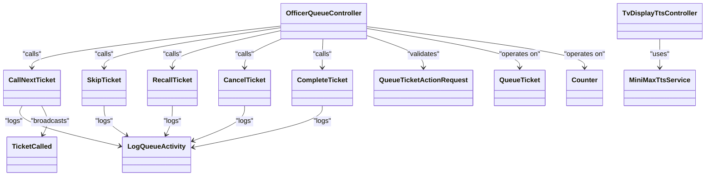

# Ticket Operations

<cite>
**Referenced Files in This Document**
- [OfficerQueueController.php](file://app/Http/Controllers/OfficerQueueController.php)
- [CallNextTicket.php](file://app/Actions/Queue/CallNextTicket.php)
- [SkipTicket.php](file://app/Actions/Queue/SkipTicket.php)
- [RecallTicket.php](file://app/Actions/Queue/RecallTicket.php)
- [CancelTicket.php](file://app/Actions/Queue/CancelTicket.php)
- [CompleteTicket.php](file://app/Actions/Queue/CompleteTicket.php)
- [QueueTicketActionRequest.php](file://app/Http/Requests/QueueTicketActionRequest.php)
- [LogQueueActivity.php](file://app/Actions/Queue/LogQueueActivity.php)
- [TicketCalled.php](file://app/Events/TicketCalled.php)
- [TvDisplayTtsController.php](file://app/Http/Controllers/TvDisplayTtsController.php)
- [MiniMaxTtsService.php](file://app/Services/Tts/MiniMaxTtsService.php)
- [EnsureUserHasRole.php](file://app/Http/Middleware/EnsureUserHasRole.php)
- [UserRole.php](file://app/Enums/UserRole.php)
- [QueueTicket.php](file://app/Models/QueueTicket.php)
- [Counter.php](file://app/Models/Counter.php)
</cite>

## Table of Contents
1. [Introduction](#introduction)
2. [Project Structure](#project-structure)
3. [Core Components](#core-components)
4. [Architecture Overview](#architecture-overview)
5. [Detailed Component Analysis](#detailed-component-analysis)
6. [Dependency Analysis](#dependency-analysis)
7. [Performance Considerations](#performance-considerations)
8. [Troubleshooting Guide](#troubleshooting-guide)
9. [Conclusion](#conclusion)

## Introduction
This document explains the complete lifecycle of ticket operations in the Officer interface. It covers how officers call the next ticket, and how they perform special actions: skipping, recalling, cancelling, and completing tickets. It also documents the validation and authorization flow, the automatic queue processing behavior, and the integration with Text-to-Speech (TTS) for TV displays. Step-by-step workflows, error handling, and audit trail recording are included to guide proper ticket handling procedures and address common operational challenges.

## Project Structure
The Officer interface is implemented via a controller that delegates to dedicated action classes. Validation and authorization are handled by a shared request class and middleware. Activity auditing is performed by a dedicated action, and real-time updates are broadcast via events. TTS announcements integrate with a TV display endpoint and a TTS service.

**Diagram sources**
- [OfficerQueueController.php:16-95](file://app/Http/Controllers/OfficerQueueController.php#L16-L95)
- [CallNextTicket.php:13-79](file://app/Actions/Queue/CallNextTicket.php#L13-L79)
- [SkipTicket.php:11-47](file://app/Actions/Queue/SkipTicket.php#L11-L47)
- [RecallTicket.php:11-48](file://app/Actions/Queue/RecallTicket.php#L11-L48)
- [CancelTicket.php:11-47](file://app/Actions/Queue/CancelTicket.php#L11-L47)
- [CompleteTicket.php:11-48](file://app/Actions/Queue/CompleteTicket.php#L11-L48)
- [LogQueueActivity.php:8-28](file://app/Actions/Queue/LogQueueActivity.php#L8-L28)
- [TicketCalled.php:11-33](file://app/Events/TicketCalled.php#L11-L33)
- [TvDisplayTtsController.php:12-61](file://app/Http/Controllers/TvDisplayTtsController.php#L12-L61)
- [MiniMaxTtsService.php:11-311](file://app/Services/Tts/MiniMaxTtsService.php#L11-L311)
- [QueueTicket.php:12-120](file://app/Models/QueueTicket.php#L12-L120)
- [Counter.php:10-52](file://app/Models/Counter.php#L10-L52)

**Section sources**
- [OfficerQueueController.php:16-95](file://app/Http/Controllers/OfficerQueueController.php#L16-L95)
- [QueueTicketActionRequest.php:7-28](file://app/Http/Requests/QueueTicketActionRequest.php#L7-L28)

## Core Components
- OfficerQueueController: Exposes endpoints for officer operations and enforces authorization against the officer’s allowed services and counter pool.
- Action classes: Encapsulate each ticket operation with validation, atomic updates, and audit logging.
- QueueTicketActionRequest: Validates that a ticket_id is present, exists, and is an integer.
- LogQueueActivity: Persists audit records with contextual metadata.
- TicketCalled: Broadcasts real-time updates when a ticket is called.
- TvDisplayTtsController and MiniMaxTtsService: Provide TTS announcements for TV displays with caching and fallback strategies.

**Section sources**
- [OfficerQueueController.php:16-95](file://app/Http/Controllers/OfficerQueueController.php#L16-L95)
- [CallNextTicket.php:13-79](file://app/Actions/Queue/CallNextTicket.php#L13-L79)
- [SkipTicket.php:11-47](file://app/Actions/Queue/SkipTicket.php#L11-L47)
- [RecallTicket.php:11-48](file://app/Actions/Queue/RecallTicket.php#L11-L48)
- [CancelTicket.php:11-47](file://app/Actions/Queue/CancelTicket.php#L11-L47)
- [CompleteTicket.php:11-48](file://app/Actions/Queue/CompleteTicket.php#L11-L48)
- [QueueTicketActionRequest.php:7-28](file://app/Http/Requests/QueueTicketActionRequest.php#L7-L28)
- [LogQueueActivity.php:8-28](file://app/Actions/Queue/LogQueueActivity.php#L8-L28)
- [TicketCalled.php:11-33](file://app/Events/TicketCalled.php#L11-L33)
- [TvDisplayTtsController.php:12-61](file://app/Http/Controllers/TvDisplayTtsController.php#L12-L61)
- [MiniMaxTtsService.php:11-311](file://app/Services/Tts/MiniMaxTtsService.php#L11-L311)

## Architecture Overview
The Officer interface follows a layered pattern:
- Controller layer validates inputs and authorizes access.
- Action layer performs domain logic with database transactions and emits events.
- Audit layer persists activity logs.
- Real-time layer broadcasts updates.
- Presentation layer integrates TTS for TV displays.

**Diagram sources**
- [OfficerQueueController.php:40-49](file://app/Http/Controllers/OfficerQueueController.php#L40-L49)
- [CallNextTicket.php:19-77](file://app/Actions/Queue/CallNextTicket.php#L19-L77)
- [LogQueueActivity.php:13-26](file://app/Actions/Queue/LogQueueActivity.php#L13-L26)
- [TicketCalled.php:18-20](file://app/Events/TicketCalled.php#L18-L20)

## Detailed Component Analysis

### CallNextTicket
Purpose: Selects the next eligible waiting ticket from the same queue pool and assigns it to the officer’s counter. Applies officer-specific service filters when applicable. Updates status, records audit, and broadcasts a real-time update.

Key behaviors:
- Transactional selection with row-level locking to prevent race conditions.
- Filters by officer’s allowed services when role is officer.
- Updates called_at and counter_id upon successful selection.
- Logs activity with from/to statuses and service/pool info.
- Emits a broadcast event for live TV updates.

**Diagram sources**
- [CallNextTicket.php:19-77](file://app/Actions/Queue/CallNextTicket.php#L19-L77)

**Section sources**
- [CallNextTicket.php:19-77](file://app/Actions/Queue/CallNextTicket.php#L19-L77)
- [TicketCalled.php:11-33](file://app/Events/TicketCalled.php#L11-L33)
- [LogQueueActivity.php:13-26](file://app/Actions/Queue/LogQueueActivity.php#L13-L26)

### SkipTicket
Purpose: Skip a currently waiting or called ticket. Moves it to Skipped status and records the action.

Constraints:
- Only waiting or called tickets can be skipped.
- Updates counter_id and sets cancelled_at.

**Diagram sources**
- [SkipTicket.php:17-46](file://app/Actions/Queue/SkipTicket.php#L17-L46)

**Section sources**
- [SkipTicket.php:17-46](file://app/Actions/Queue/SkipTicket.php#L17-L46)
- [LogQueueActivity.php:13-26](file://app/Actions/Queue/LogQueueActivity.php#L13-L26)

### RecallTicket
Purpose: Re-call a ticket that is already called, resetting timing but keeping the Called state.

Constraints:
- Only called tickets can be recalled.
- Updates called_at and counter_id.

**Diagram sources**
- [RecallTicket.php:17-47](file://app/Actions/Queue/RecallTicket.php#L17-L47)

**Section sources**
- [RecallTicket.php:17-47](file://app/Actions/Queue/RecallTicket.php#L17-L47)
- [TicketCalled.php:11-33](file://app/Events/TicketCalled.php#L11-L33)
- [LogQueueActivity.php:13-26](file://app/Actions/Queue/LogQueueActivity.php#L13-L26)

### CancelTicket
Purpose: Cancel a ticket from Booked, Waiting, or Called states.

Constraints:
- Only tickets in specific statuses can be cancelled.
- Updates counter_id and sets cancelled_at.

**Diagram sources**
- [CancelTicket.php:17-46](file://app/Actions/Queue/CancelTicket.php#L17-L46)

**Section sources**
- [CancelTicket.php:17-46](file://app/Actions/Queue/CancelTicket.php#L17-L46)
- [LogQueueActivity.php:13-26](file://app/Actions/Queue/LogQueueActivity.php#L13-L26)

### CompleteTicket
Purpose: Mark a Called ticket as Completed, setting timestamps for started and completed.

Constraints:
- Only Called tickets can be completed.
- Ensures started_at is set on first completion.

**Diagram sources**
- [CompleteTicket.php:17-47](file://app/Actions/Queue/CompleteTicket.php#L17-L47)

**Section sources**
- [CompleteTicket.php:17-47](file://app/Actions/Queue/CompleteTicket.php#L17-L47)
- [LogQueueActivity.php:13-26](file://app/Actions/Queue/LogQueueActivity.php#L13-L26)

### Validation and Authorization Flow
- QueueTicketActionRequest: Ensures ticket_id is required, integer, and exists in queue_tickets.
- OfficerQueueController: Enforces that the officer can only operate on tickets belonging to their allowed services and the counter’s queue pool.
- EnsureUserHasRole middleware: Restricts access to roles as appropriate; admin bypasses role checks.

**Diagram sources**
- [QueueTicketActionRequest.php:22-27](file://app/Http/Requests/QueueTicketActionRequest.php#L22-L27)
- [OfficerQueueController.php:51-89](file://app/Http/Controllers/OfficerQueueController.php#L51-L89)
- [EnsureUserHasRole.php:16-35](file://app/Http/Middleware/EnsureUserHasRole.php#L16-L35)
- [UserRole.php:5-10](file://app/Enums/UserRole.php#L5-L10)

**Section sources**
- [QueueTicketActionRequest.php:7-28](file://app/Http/Requests/QueueTicketActionRequest.php#L7-L28)
- [OfficerQueueController.php:91-94](file://app/Http/Controllers/OfficerQueueController.php#L91-L94)
- [EnsureUserHasRole.php:16-35](file://app/Http/Middleware/EnsureUserHasRole.php#L16-L35)
- [UserRole.php:5-10](file://app/Enums/UserRole.php#L5-L10)

### TTS Integration for TV Display
The TV display can request synthesized announcements. The endpoint validates input, attempts to generate or reuse cached audio via MiniMax, and returns either a browser fallback or a minimax provider with cache key and audio URL.

**Diagram sources**
- [TvDisplayTtsController.php:14-39](file://app/Http/Controllers/TvDisplayTtsController.php#L14-L39)
- [MiniMaxTtsService.php:16-44](file://app/Services/Tts/MiniMaxTtsService.php#L16-L44)
- [MiniMaxTtsService.php:53-116](file://app/Services/Tts/MiniMaxTtsService.php#L53-L116)
- [MiniMaxTtsService.php:118-180](file://app/Services/Tts/MiniMaxTtsService.php#L118-L180)

**Section sources**
- [TvDisplayTtsController.php:14-61](file://app/Http/Controllers/TvDisplayTtsController.php#L14-L61)
- [MiniMaxTtsService.php:16-311](file://app/Services/Tts/MiniMaxTtsService.php#L16-L311)

## Dependency Analysis
- Controller depends on action classes and request validation.
- Actions depend on models, enums, and the audit logger.
- Broadcasting relies on the TicketCalled event.
- TTS depends on external provider and local storage caching.

**Diagram sources**
- [OfficerQueueController.php:16-95](file://app/Http/Controllers/OfficerQueueController.php#L16-L95)
- [CallNextTicket.php:13-79](file://app/Actions/Queue/CallNextTicket.php#L13-L79)
- [SkipTicket.php:11-47](file://app/Actions/Queue/SkipTicket.php#L11-L47)
- [RecallTicket.php:11-48](file://app/Actions/Queue/RecallTicket.php#L11-L48)
- [CancelTicket.php:11-47](file://app/Actions/Queue/CancelTicket.php#L11-L47)
- [CompleteTicket.php:11-48](file://app/Actions/Queue/CompleteTicket.php#L11-L48)
- [QueueTicketActionRequest.php:7-28](file://app/Http/Requests/QueueTicketActionRequest.php#L7-L28)
- [LogQueueActivity.php:8-28](file://app/Actions/Queue/LogQueueActivity.php#L8-L28)
- [TicketCalled.php:11-33](file://app/Events/TicketCalled.php#L11-L33)
- [TvDisplayTtsController.php:12-61](file://app/Http/Controllers/TvDisplayTtsController.php#L12-L61)
- [MiniMaxTtsService.php:11-311](file://app/Services/Tts/MiniMaxTtsService.php#L11-L311)
- [QueueTicket.php:12-120](file://app/Models/QueueTicket.php#L12-L120)
- [Counter.php:10-52](file://app/Models/Counter.php#L10-L52)

**Section sources**
- [OfficerQueueController.php:16-95](file://app/Http/Controllers/OfficerQueueController.php#L16-L95)
- [QueueTicketActionRequest.php:7-28](file://app/Http/Requests/QueueTicketActionRequest.php#L7-L28)
- [LogQueueActivity.php:8-28](file://app/Actions/Queue/LogQueueActivity.php#L8-L28)
- [TicketCalled.php:11-33](file://app/Events/TicketCalled.php#L11-L33)
- [TvDisplayTtsController.php:12-61](file://app/Http/Controllers/TvDisplayTtsController.php#L12-L61)
- [MiniMaxTtsService.php:11-311](file://app/Services/Tts/MiniMaxTtsService.php#L11-L311)
- [QueueTicket.php:12-120](file://app/Models/QueueTicket.php#L12-L120)
- [Counter.php:10-52](file://app/Models/Counter.php#L10-L52)

## Performance Considerations
- Row-level locking during selection prevents race conditions when multiple officers call tickets concurrently.
- Atomic transactions ensure consistency of status transitions and audit records.
- Caching reduces repeated TTS generation costs; tune async polling intervals and retry attempts for reliability under load.
- Broadcasting updates efficiently informs TV displays without heavy polling.

[No sources needed since this section provides general guidance]

## Troubleshooting Guide
Common issues and resolutions:
- No queue available: CallNextTicket returns null; controller responds with a “no queue” message.
- Invalid operation for current status: Actions throw exceptions for unsupported transitions; verify ticket status before invoking operations.
- Unauthorized access: Pool mismatch or missing role leads to 403; ensure officer belongs to allowed services and operates on the correct counter’s pool.
- TTS failures: Endpoint falls back to browser playback; check provider credentials and network connectivity.
- Audit gaps: Verify LogQueueActivity creation and meta fields for accurate trails.

**Section sources**
- [OfficerQueueController.php:44-46](file://app/Http/Controllers/OfficerQueueController.php#L44-L46)
- [CallNextTicket.php:48-50](file://app/Actions/Queue/CallNextTicket.php#L48-L50)
- [SkipTicket.php:19-21](file://app/Actions/Queue/SkipTicket.php#L19-L21)
- [RecallTicket.php:19-21](file://app/Actions/Queue/RecallTicket.php#L19-L21)
- [CancelTicket.php:19-21](file://app/Actions/Queue/CancelTicket.php#L19-L21)
- [CompleteTicket.php:19-21](file://app/Actions/Queue/CompleteTicket.php#L19-L21)
- [OfficerQueueController.php:91-94](file://app/Http/Controllers/OfficerQueueController.php#L91-L94)
- [TvDisplayTtsController.php:20-26](file://app/Http/Controllers/TvDisplayTtsController.php#L20-L26)
- [LogQueueActivity.php:13-26](file://app/Actions/Queue/LogQueueActivity.php#L13-L26)

## Conclusion
The Officer interface provides a robust, auditable, and real-time-driven ticket management system. Each operation is encapsulated, validated, and logged, ensuring traceability and resilience. TTS integration enhances the public display experience. Following the documented workflows and troubleshooting steps will help maintain smooth operations and reliable service delivery.