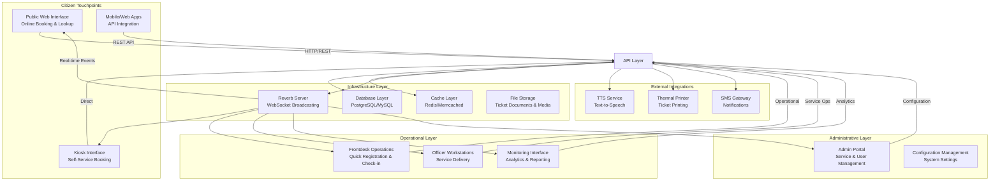
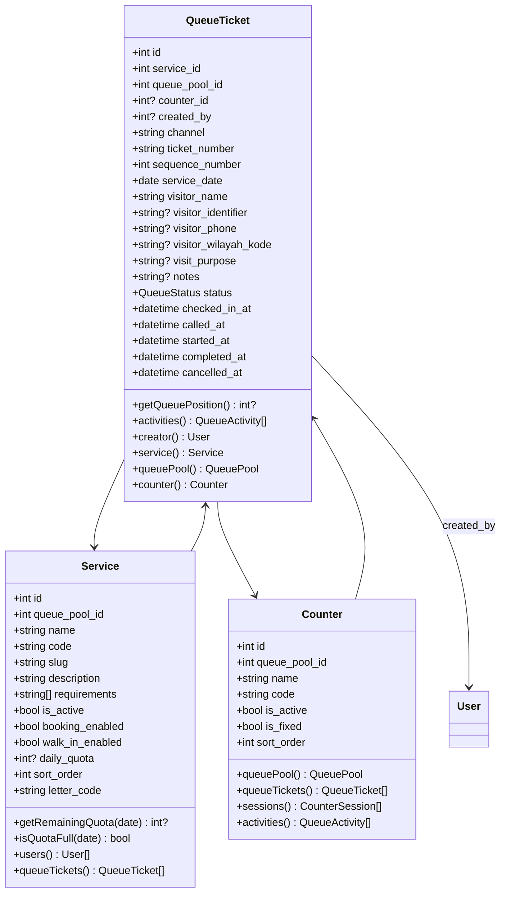
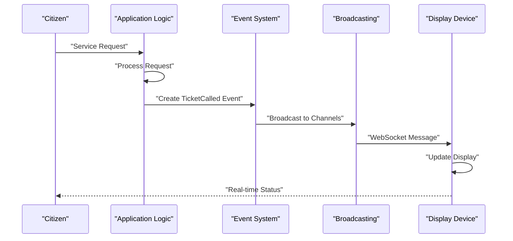
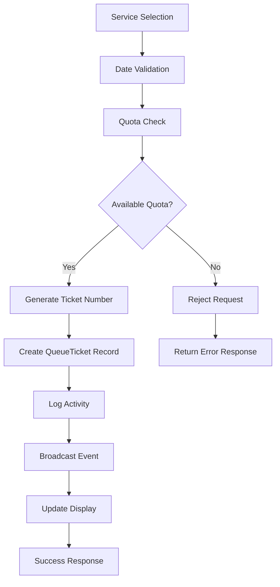

# Project Overview

<cite>
**Referenced Files in This Document**
- [composer.json](file://composer.json)
- [routes/web.php](file://routes/web.php)
- [config/app.php](file://config/app.php)
- [config/broadcasting.php](file://config/broadcasting.php)
- [config/reverb.php](file://config/reverb.php)
- [config/kiosk.php](file://config/kiosk.php)
- [resources/js/echo.js](file://resources/js/echo.js)
- [app/Events/TicketCalled.php](file://app/Events/TicketCalled.php)
- [app/Enums/UserRole.php](file://app/Enums/UserRole.php)
- [app/Enums/QueueStatus.php](file://app/Enums/QueueStatus.php)
- [app/Models/QueueTicket.php](file://app/Models/QueueTicket.php)
- [app/Models/Service.php](file://app/Models/Service.php)
- [app/Models/Counter.php](file://app/Models/Counter.php)
- [app/Actions/Queue/CreateQueueTicket.php](file://app/Actions/Queue/CreateQueueTicket.php)
- [app/Http/Controllers/KioskController.php](file://app/Http/Controllers/KioskController.php)
- [app/Http/Controllers/TvDisplayController.php](file://app/Http/Controllers/TvDisplayController.php)
- [app/Livewire/KioskBooking.php](file://app/Livewire/KioskBooking.php)
- [app/Livewire/TvDisplay.php](file://app/Livewire/TvDisplay.php)
</cite>

## Update Summary
**Changes Made**
- Enhanced core components section with detailed technology stack and real-time capabilities
- Expanded architecture overview with comprehensive runtime flow patterns
- Added detailed component analysis for all major system interfaces
- Improved dependency analysis with specific configuration references
- Enhanced troubleshooting guide with practical debugging steps
- Updated performance considerations with scaling recommendations

## Table of Contents
1. [Introduction](#introduction)
2. [Technology Stack and Dependencies](#technology-stack-and-dependencies)
3. [System Architecture Overview](#system-architecture-overview)
4. [Core Components and Data Models](#core-components-and-data-models)
5. [Multi-Touchpoint Interface Architecture](#multi-touchpoint-interface-architecture)
6. [Real-Time Communication Framework](#real-time-communication-framework)
7. [Runtime Flow Patterns](#runtime-flow-patterns)
8. [Configuration and Environment Management](#configuration-and-environment-management)
9. [Performance and Scalability Considerations](#performance-and-scalability-considerations)
10. [Integration Capabilities](#integration-capabilities)
11. [Troubleshooting and Debugging Guide](#troubleshooting-and-debugging-guide)
12. [Conclusion](#conclusion)

## Introduction

The PTSP Queue Management System is a comprehensive government service queue management platform designed to streamline citizen appointments and service delivery across multiple touchpoints. Built with Laravel 12.x and Livewire 4.x, the system serves as a modern digital infrastructure for public service delivery, supporting seamless integration between citizens, frontdesk staff, officers, and administrators through a unified real-time communication framework.

The platform addresses critical challenges in government service delivery including appointment scheduling inefficiencies, long wait times, lack of transparency, and fragmented service experiences. By implementing a multi-touchpoint architecture with real-time updates, the system ensures optimal resource utilization while maintaining excellent citizen experience standards.

**Section sources**
- [composer.json:11-23](file://composer.json#L11-L23)
- [routes/web.php:18-124](file://routes/web.php#L18-L124)

## Technology Stack and Dependencies

### Backend Framework
- **Laravel 12.x**: Latest LTS framework providing robust MVC architecture, dependency injection, and comprehensive ecosystem integration
- **Livewire 4.x**: Reactive component library enabling real-time UI updates without complex JavaScript architecture
- **Fortify**: Security-focused authentication scaffolding with customizable guard configurations
- **Sanctum**: API authentication for mobile and third-party integrations
- **Pest**: Modern PHP testing framework with expressive syntax and parallel execution

### Real-Time Infrastructure
- **Laravel Reverb**: Pusher-compatible WebSocket server for real-time event broadcasting
- **Echo Client**: Frontend WebSocket client with automatic reconnection and fallback mechanisms
- **Redis Integration**: Optional scaling backend for distributed messaging and session management

### Development and Quality Tools
- **Vite**: Lightning-fast frontend build tool with hot module replacement
- **TailwindCSS**: Utility-first CSS framework for rapid UI development
- **Pint**: Code styling tool ensuring consistent code quality
- **BarCode Generator**: PHP library for ticket number barcode generation

**Section sources**
- [composer.json:11-23](file://composer.json#L11-L23)
- [config/broadcasting.php:31-47](file://config/broadcasting.php#L31-L47)
- [config/reverb.php:29-55](file://config/reverb.php#L29-L55)

## System Architecture Overview

The PTSP Queue Management System implements a distributed, event-driven architecture that separates concerns across multiple layers while maintaining real-time synchronization between all touchpoints.

**Diagram sources**
- [routes/web.php:18-124](file://routes/web.php#L18-L124)
- [config/broadcasting.php:33-47](file://config/broadcasting.php#L33-L47)
- [config/reverb.php:74-98](file://config/reverb.php#L74-L98)

## Core Components and Data Models

### QueueTicket Model
The central entity representing individual citizen service requests with comprehensive lifecycle management:

**Diagram sources**
- [app/Models/QueueTicket.php:12-121](file://app/Models/QueueTicket.php#L12-L121)
- [app/Models/Service.php:12-101](file://app/Models/Service.php#L12-L101)
- [app/Models/Counter.php:10-53](file://app/Models/Counter.php#L10-L53)

### Enumerations and Status Management
The system employs strongly-typed enumerations for consistent status management across all components:

- **UserRole**: Admin, Frontdesk, Officer, Monitor with color-coded labels
- **QueueStatus**: Booked, Waiting, Called, Completed, Cancelled, Skipped with localized labels

**Section sources**
- [app/Enums/UserRole.php:5-31](file://app/Enums/UserRole.php#L5-L31)
- [app/Enums/QueueStatus.php:5-37](file://app/Enums/QueueStatus.php#L5-L37)
- [app/Models/QueueTicket.php:79-112](file://app/Models/QueueTicket.php#L79-L112)

## Multi-Touchpoint Interface Architecture

### Public Web Interface
Citizens interact through a responsive web interface supporting both online booking and status checking:

**Booking Workflow**:
1. Service selection with availability indicators
2. Date and time validation
3. Visitor information capture
4. Confirmation and ticket number generation
5. Email/SMS confirmation delivery

**Lookup Workflow**:
1. Signed URL validation for security
2. Real-time status retrieval
3. Position calculation in queue
4. Service details display

### Kiosk Interface
Self-service kiosks provide touch-friendly interfaces for assisted walk-in registrations:

**Kiosk Features**:
- Password-protected access with configurable session timeout
- Geographic scope filtering for local services
- Barcode generation for physical ticket printing
- Legacy device support for older hardware
- Thermal printer integration for ticket printing

### TV Display Interface
Large-screen displays provide real-time queue monitoring for public viewing:

**Display Features**:
- Current call announcements with TTS integration
- Recent history tracking
- Service-specific queue displays
- Video playback capabilities
- Multiple layout configurations

### Administrative Interfaces
Comprehensive dashboards for different stakeholder roles:

**Admin Portal**: Service configuration, user management, system settings
**Frontdesk Interface**: Quick registration, check-in operations, walk-in processing
**Officer Workstation**: Service delivery, ticket management, counter operations
**Monitor Interface**: Analytics, reporting, audit trails

**Section sources**
- [routes/web.php:23-26](file://routes/web.php#L23-L26)
- [app/Http/Controllers/KioskController.php:20-57](file://app/Http/Controllers/KioskController.php#L20-L57)
- [app/Http/Controllers/TvDisplayController.php:18-55](file://app/Http/Controllers/TvDisplayController.php#L18-L55)

## Real-Time Communication Framework

### Event-Driven Architecture
The system leverages Laravel's event broadcasting capabilities to maintain real-time synchronization across all interfaces:

**Diagram sources**
- [app/Events/TicketCalled.php:18-32](file://app/Events/TicketCalled.php#L18-L32)
- [resources/js/echo.js:6-14](file://resources/js/echo.js#L6-L14)

### Broadcasting Configuration
The system supports multiple broadcasting drivers with Reverb as the primary production driver:

**Reverb Configuration**:
- Pusher-compatible WebSocket server
- TLS encryption with configurable certificates
- Rate limiting and connection pooling
- Redis-backed scaling support
- Activity timeout and ping interval management

**Client Configuration**:
- Automatic reconnection with exponential backoff
- Transport fallback from WSS to WS
- Channel subscription management
- Event listener registration

**Section sources**
- [config/broadcasting.php:33-47](file://config/broadcasting.php#L33-L47)
- [config/reverb.php:74-98](file://config/reverb.php#L74-L98)
- [resources/js/echo.js:6-14](file://resources/js/echo.js#L6-L14)

## Runtime Flow Patterns

### Ticket Creation Flow
The ticket creation process follows a transactional pattern ensuring data consistency:

**Diagram sources**
- [app/Actions/Queue/CreateQueueTicket.php:34-89](file://app/Actions/Queue/CreateQueueTicket.php#L34-L89)
- [app/Models/Service.php:69-99](file://app/Models/Service.php#L69-L99)

### Status Transition Management
The system maintains strict state machine for ticket lifecycle management:

**Status Flow**:
1. **Booked** → Online booking confirmation
2. **Waiting** → Walk-in registration, check-in processing
3. **Called** → Officer call initiation
4. **Completed** → Service completion
5. **Cancelled** → Administrative cancellation
6. **Skipped** → Officer skip for valid reasons

### Operational Workflows
Different user roles follow distinct operational patterns:

**Frontdesk Operations**:
- Quick registration for walk-ins
- Check-in verification and status updates
- Reprint and correction processes

**Officer Operations**:
- Counter assignment and session management
- Call sequence management
- Service duration tracking

**Administrative Operations**:
- Service configuration and quota management
- User role assignment and permissions
- System monitoring and reporting

**Section sources**
- [app/Actions/Queue/CreateQueueTicket.php:48-89](file://app/Actions/Queue/CreateQueueTicket.php#L48-L89)
- [app/Enums/QueueStatus.php:14-36](file://app/Enums/QueueStatus.php#L14-L36)

## Configuration and Environment Management

### Environment Variables
The system requires comprehensive environment configuration for secure operation:

**Core Configuration**:
- `APP_KEY`: Application encryption key
- `REVERB_*`: WebSocket server credentials
- `REDIS_*`: Cache and session storage
- `KIOSK_PASSWORD`: Kiosk access authentication
- `TV_DISPLAY_PASSWORD`: Display interface authentication

**Security Configuration**:
- Database connection credentials
- File storage permissions
- Logging and audit trail settings
- CORS policy for API endpoints

### Module-Based Authentication
The system implements module-specific authentication for specialized interfaces:

**Authentication Flow**:
1. Password validation against hashed credentials
2. Session establishment with expiration handling
3. Role-based access control enforcement
4. Automatic session cleanup and timeout

**Section sources**
- [config/kiosk.php:3-7](file://config/kiosk.php#L3-L7)
- [app/Http/Controllers/KioskController.php:25-44](file://app/Http/Controllers/KioskController.php#L25-L44)

## Performance and Scalability Considerations

### Horizontal Scaling Architecture
The system is designed for horizontal scaling with distributed components:

**Scaling Components**:
- Load balancer distribution across multiple instances
- Redis cluster for session and cache management
- Database read replicas for reporting queries
- CDN for static asset delivery

**Performance Optimization**:
- Database query optimization with proper indexing
- Caching strategies for frequently accessed data
- Asynchronous job processing for non-critical operations
- Connection pooling for external service integrations

### Real-Time Performance
WebSocket connections are optimized for minimal latency:

**Connection Management**:
- Connection pooling and reuse
- Automatic reconnection with backoff strategy
- Heartbeat monitoring and health checks
- Resource cleanup on disconnect

**Memory Management**:
- Efficient event serialization
- Garbage collection optimization
- Memory leak prevention in long-running processes

## Integration Capabilities

### External Service Integration
The system provides hooks for integrating with external services:

**Third-Party Integrations**:
- SMS gateway for appointment notifications
- TTS service for audio announcements
- Printer drivers for thermal ticket printing
- Geographic information systems for location services

**API Endpoints**:
- RESTful API for mobile applications
- Webhook support for external system notifications
- Export capabilities for reporting and analytics
- Authentication APIs for partner system integration

### Data Export and Reporting
Comprehensive reporting capabilities for administrative oversight:

**Export Formats**:
- CSV and Excel for spreadsheet integration
- PDF reports for official documentation
- JSON APIs for system integration
- Real-time dashboard widgets

## Troubleshooting and Debugging Guide

### Common Issues and Solutions

**Real-Time Updates Not Working**:
1. Verify Reverb server connectivity and authentication
2. Check browser console for WebSocket connection errors
3. Validate broadcasting configuration in environment variables
4. Confirm event listener registration in Livewire components

**Ticket Creation Failures**:
1. Review service quota limits and availability
2. Check database connection and transaction logs
3. Validate input data formats and constraints
4. Examine activity logging for error details

**Authentication Problems**:
1. Verify password hash configuration
2. Check session timeout settings
3. Review middleware chain for route groups
4. Confirm user role assignments and permissions

**Performance Issues**:
1. Monitor database query execution times
2. Check Redis connection and memory usage
3. Analyze WebSocket connection counts
4. Review application logs for bottlenecks

### Debugging Tools and Techniques

**Development Tools**:
- Laravel Telescope for application monitoring
- Browser developer tools for frontend debugging
- Database query analyzer for performance optimization
- WebSocket inspector for real-time communication

**Production Monitoring**:
- Application performance monitoring (APM) integration
- Distributed tracing for complex request flows
- Error tracking and alerting systems
- Capacity planning and resource utilization metrics

**Section sources**
- [config/broadcasting.php:18-18](file://config/broadcasting.php#L18-L18)
- [config/reverb.php:74-98](file://config/reverb.php#L74-L98)
- [resources/js/echo.js:6-14](file://resources/js/echo.js#L6-L14)

## Conclusion

The PTSP Queue Management System represents a comprehensive solution for modern government service delivery, combining robust technical architecture with user-centric design principles. Through its multi-touchpoint approach, real-time communication framework, and scalable infrastructure, the system addresses the fundamental challenges of inefficient public service delivery while maintaining excellent citizen experience standards.

The Laravel 12.x and Livewire 4.x foundation provides a solid technical base for future enhancements, while the modular design ensures flexibility for evolving requirements. With comprehensive real-time capabilities, role-based access control, and extensive integration possibilities, the system positions itself as a leading solution for digital government transformation initiatives.

The platform's emphasis on transparency, efficiency, and scalability makes it well-suited for deployment in diverse government environments, from small municipalities to large provincial departments. Its comprehensive monitoring, reporting, and analytics capabilities support continuous improvement and evidence-based decision-making in public service delivery.

Through careful attention to performance optimization, security hardening, and user experience design, the PTSP Queue Management System delivers measurable improvements in service delivery efficiency while maintaining the highest standards of reliability and accessibility for all citizens.